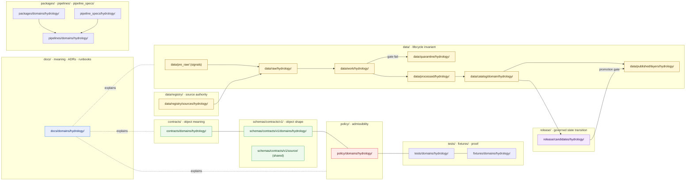
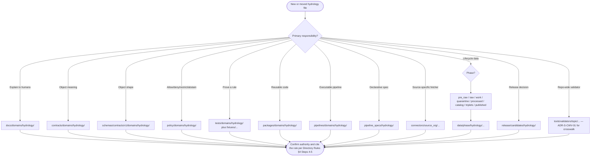

<!-- [KFM_META_BLOCK_V2]
doc_id: kfm://doc/domains/hydrology/file-system-plan
title: Hydrology — File System Plan
type: standard
version: v2
status: draft
owners: ["TODO: hydrology-domain-stewards", "TODO: directory-rules-owners"]
created: 2026-05-17
updated: 2026-06-06
policy_label: public
contract_version: "3.0.0"   # pinned per ai-build-operating-contract.md v3.0
related:
  - "ai-build-operating-contract.md"                 # canonical operating contract (CONTRACT_VERSION 3.0.0)
  - "directory-rules.md"
  - "docs/domains/README.md"
  - "docs/domains/hydrology/README.md"               # TODO: verify presence
  - "docs/domains/hydrology/DATA_LIFECYCLE.md"
  - "docs/domains/hydrology/EXPANSION_BACKLOG.md"
  - "docs/domains/hydrology/EXPANSION_PLAN.md"
  - "docs/adr/ADR-0001-schema-home.md"
  - "docs/registers/DRIFT_REGISTER.md"
  - "docs/registers/VERIFICATION_BACKLOG.md"
  - "schemas/contracts/v1/domains/hydrology/"
  - "schemas/contracts/v1/source/source-descriptor.json"   # shared SourceDescriptor schema (ADR-0001)
  - "contracts/domains/hydrology/"
  - "policy/domains/hydrology/"
  - "tests/domains/hydrology/"
  - "fixtures/domains/hydrology/"
  - "packages/domains/hydrology/"
  - "pipelines/domains/hydrology/"
  - "pipeline_specs/hydrology/"
  - "data/registry/sources/hydrology/"
  - "release/candidates/hydrology/"
tags: ["kfm", "hydrology", "directory-rules", "domain-lane", "file-system-plan", "governance"]
notes:
  - "Lane PATTERN is CONFIRMED doctrine per Directory Rules §12."
  - "All concrete per-file placements remain PROPOSED until verified against a mounted repo (none mounted this session)."
  - "Companion to directory-rules.md; never overrides it. Also companion to DATA_LIFECYCLE / EXPANSION_BACKLOG / EXPANSION_PLAN."
  - "Crosswalk validator home is CONFLICTED (ADR-S-CWV-01); SourceDescriptor schema home is schemas/contracts/v1/source/ (source/ vs sources/ CONFLICTED per ADR-0001)."
  - "v2 reconciles crosswalk validator placement, SourceDescriptor schema home, Pre-RAW phase, alignment-threshold status, and CONTRACT_VERSION pin. See Changelog (§14)."
[/KFM_META_BLOCK_V2] -->

# Hydrology — File System Plan

> Canonical lane layout, per-root responsibilities, and placement rules for **every hydrology-domain file** in the Kansas Frontier Matrix monorepo. CONFIRMED doctrine for the pattern; PROPOSED for the concrete file lists until a mounted-repo audit confirms each lane.


| Status | Contract | Owners | Last updated |
|---|---|---|---|
| Draft | `CONTRACT_VERSION = "3.0.0"` | `TODO: hydrology-domain-stewards`, `TODO: directory-rules-owners` | 2026-06-06 |

---

## Contents

- [1 · Purpose](#1--purpose)
- [2 · Doctrinal basis](#2--doctrinal-basis)
- [3 · Lane pattern (the rule)](#3--lane-pattern-the-rule)
- [4 · Lane diagram](#4--lane-diagram)
- [5 · Per-root file system plan](#5--per-root-file-system-plan)
  - [5.1 `docs/domains/hydrology/`](#51-docsdomainshydrology)
  - [5.2 `contracts/domains/hydrology/`](#52-contractsdomainshydrology)
  - [5.3 `schemas/contracts/v1/domains/hydrology/`](#53-schemascontractsv1domainshydrology)
  - [5.4 `policy/domains/hydrology/`](#54-policydomainshydrology)
  - [5.5 `tests/domains/hydrology/` and `fixtures/domains/hydrology/`](#55-testsdomainshydrology-and-fixturesdomainshydrology)
  - [5.6 `packages/domains/hydrology/`](#56-packagesdomainshydrology)
  - [5.7 `pipelines/domains/hydrology/` and `pipeline_specs/hydrology/`](#57-pipelinesdomainshydrology-and-pipeline_specshydrology)
  - [5.8 `data/<phase>/hydrology/` and `data/registry/sources/hydrology/`](#58-dataphasehydrology-and-dataregistrysourceshydrology)
  - [5.9 `release/candidates/hydrology/`](#59-releasecandidateshydrology)
  - [5.10 `connectors/` — source-specific intake](#510-connectors--source-specific-intake)
  - [5.11 Cross-cutting validators and crosswalk tooling](#511-cross-cutting-validators-and-crosswalk-tooling)
  - [5.12 `control_plane/` references](#512-control_plane-references)
- [6 · What does NOT belong in the hydrology lane](#6--what-does-not-belong-in-the-hydrology-lane)
- [7 · Multi-domain and cross-cutting files](#7--multi-domain-and-cross-cutting-files)
- [8 · Adjacent-domain boundary table](#8--adjacent-domain-boundary-table)
- [9 · Lifecycle-phase mapping (Pre-RAW → PUBLISHED)](#9--lifecycle-phase-mapping-pre-raw--published)
- [10 · Hydrology-specific anti-patterns](#10--hydrology-specific-anti-patterns)
- [11 · Placement protocol — quick decision aid](#11--placement-protocol--quick-decision-aid)
- [12 · Open questions and verification backlog](#12--open-questions-and-verification-backlog)
- [13 · Related docs](#13--related-docs)
- [14 · Changelog](#14--changelog-v1--v2)
- [Appendix A · Source-family → lane mapping (PROPOSED)](#appendix-a--source-family--lane-mapping-proposed)
- [Appendix B · Object-family → lane mapping (PROPOSED)](#appendix-b--object-family--lane-mapping-proposed)

---

## 1 · Purpose

This document is the **single navigation map** for every hydrology-domain file in the KFM monorepo. It answers four questions a contributor or reviewer needs to answer before writing code, opening a PR, or running a pipeline:

1. **Where does a hydrology file go?** — the responsibility root, the lane segment, and (for `data/`) the lifecycle phase.
2. **Where does a hydrology file *not* go?** — the patterns that look convenient but break Directory Rules or the trust membrane.
3. **What governs each hydrology lane?** — which root README, which ADR, which validator, which policy bundle.
4. **What is CONFIRMED, PROPOSED, CONFLICTED, or NEEDS VERIFICATION** — so contributors do not promote a planning artifact to repo fact.

It is a companion to [`DATA_LIFECYCLE.md`](./DATA_LIFECYCLE.md) (gates/governance), [`EXPANSION_BACKLOG.md`](./EXPANSION_BACKLOG.md) (ordered work), and [`EXPANSION_PLAN.md`](./EXPANSION_PLAN.md) (phased roadmap). This plan is the **placement** view of the same lane.

> [!IMPORTANT]
> This plan is **subordinate** to `directory-rules.md`. Where this plan and Directory Rules disagree, Directory Rules wins, and the disagreement opens a `docs/registers/DRIFT_REGISTER.md` entry. This plan never grants new root authority and never amends the lane pattern. This session exposed doctrine documents only, not a mounted repo, so every concrete path here is PROPOSED.

[Back to top ↑](#contents)

---

## 2 · Doctrinal basis

The hydrology lane derives from a small set of CONFIRMED doctrine sources. Each item below is a *referenced* control, not a re-derived one.

| # | Doctrine source | Section | What it controls here | Status |
|---:|---|---|---|---|
| 1 | Directory Rules — *Domain Placement Law* | §12 | Hydrology MUST live as a lane under responsibility roots, never as a repo-root folder. | **CONFIRMED doctrine** |
| 2 | Directory Rules — *Placement Protocol* | §4 (Steps 1–5) | Responsibility → lifecycle phase → domain segment → authority → cite the rule. | **CONFIRMED doctrine** |
| 3 | Directory Rules — *Required README Contract* | §15 | Each canonical/compatibility root MUST carry a folder README meeting the contract. | **CONFIRMED doctrine** |
| 4 | Directory Rules — *Lifecycle invariant* | §9.1 / §4 Step 2 | `Pre-RAW → RAW → WORK / QUARANTINE → PROCESSED → CATALOG / TRIPLET → PUBLISHED`; promotion is governed, not a file move. | **CONFIRMED doctrine** |
| 5 | ADR-0001 — *Schema home* | — | Default machine-schema home is `schemas/contracts/v1/...`. `contracts/` retains semantic Markdown only. | **CONFIRMED doctrine** |
| 6 | AI Build Operating Contract v3.0 | §10, §34 | Core invariants; `GENERATED_RECEIPT` discipline; `CONTRACT_VERSION = "3.0.0"`. | **CONFIRMED doctrine** |
| 7 | Encyclopedia — Hydrology domain | §7.2 | Hydrology mission, boundary, source families, object families. | **CONFIRMED doctrine** / **PROPOSED implementation** |
| 8 | Domains Culmination Atlas — Hydrology | §4 (A–N); §24.1 | Cross-lane relations, source-role anti-collapse, publication posture, verification backlog. | **CONFIRMED doctrine** / **PROPOSED implementation** |

> [!NOTE]
> The encyclopedia and atlas confirm the **domain semantics** (what hydrology owns and excludes). Directory Rules confirms the **placement law**. The Operating Contract confirms the **governance and receipt discipline**. This plan applies all three — it does not add new law.

[Back to top ↑](#contents)

---

## 3 · Lane pattern (the rule)

The hydrology lane is the exact pattern Directory Rules §12 prescribes for every KFM domain. **No deviation is permitted** without an ADR.

```text
docs/domains/hydrology/                              # human explanation
contracts/domains/hydrology/                         # object meaning (Markdown)
schemas/contracts/v1/domains/hydrology/              # machine shape (JSON Schema, default per ADR-0001)
schemas/contracts/v1/source/source-descriptor.json  # shared SourceDescriptor schema (NOT domain-segmented; ADR-0001)
policy/domains/hydrology/                            # allow / deny / restrict / abstain
tests/domains/hydrology/                             # proof that rules are enforceable
fixtures/domains/hydrology/                          # golden / valid / invalid samples
packages/domains/hydrology/                          # reusable hydrology library code
pipelines/domains/hydrology/                         # executable pipeline logic
pipeline_specs/hydrology/                            # declarative pipeline configuration
data/pre_raw/                                        # watcher signals before admission (cross-cutting; PROPOSED)
data/raw/hydrology/                                  # immutable intake
data/work/hydrology/                                 # transformation in progress
data/quarantine/hydrology/                           # gate failures held for review
data/processed/hydrology/                            # validated normalized outputs
data/catalog/domain/hydrology/                       # catalog records (STAC/DCAT/PROV)
data/triplets/                                       # graph/triplet projections (cross-cutting; plural per DIRRULES §18.a)
data/published/layers/hydrology/                     # public-safe release artifacts
data/registry/sources/hydrology/                     # source-descriptor instances / authority
release/candidates/hydrology/                        # release candidates and manifests
```

> [!WARNING]
> A root-level `hydrology/` folder is a **MUST-NOT** per Directory Rules §12 / §13. Any PR that creates `hydrology/` at repo root requires an ADR that *first* removes Directory Rules §12 — which has never been accepted. Reviewers should refuse the PR and open a drift entry. Note that `data/pre_raw/` and `data/triplets/` are **cross-cutting** (not domain-segmented); the `SourceDescriptor` *schema* is shared (not `domains/hydrology/`), while descriptor *instances* live in `data/registry/sources/hydrology/`.

[Back to top ↑](#contents)

---

## 4 · Lane diagram

The lane pattern as a single picture: each responsibility root owns one slice of the hydrology lane; the lifecycle invariant moves data left-to-right; promotion is a gate, never a file move.



> [!NOTE]
> The diagram is **structural**, not executable. Arrows show governance flow, not file moves. The solid links from `data/catalog/.../hydrology/` to `release/candidates/hydrology/` to `data/published/layers/hydrology/` are guarded by the promotion gate; nothing crosses that line without a `ReleaseManifest`, `EvidenceBundle`, validation receipts, a `PolicyDecision`, and a rollback target. [DOM-HYD §H] [DIRRULES §9]

[Back to top ↑](#contents)

---

## 5 · Per-root file system plan

Each subsection below is a **placement contract** for one lane segment. Lane *existence* is CONFIRMED doctrine; the **specific file lists are PROPOSED** and must be confirmed against the mounted repo.

### 5.1 `docs/domains/hydrology/`

**Purpose.** Human-facing explanation of the hydrology domain — its mission, boundary, ubiquitous language, source families, object families, pipeline shape, sensitivity posture, validators, AI behavior, publication / correction / rollback story.

| Proposed file | Role | Status |
|---|---|---|
| `README.md` | Domain landing page; one-line purpose, scope, exclusions, navigation. | **PROPOSED** |
| `FILE_SYSTEM_PLAN.md` | *This file.* | **CONFIRMED (this draft)** |
| `DATA_LIFECYCLE.md` | Lane governance, gates, artifact homes. | **PROPOSED (companion)** |
| `EXPANSION_BACKLOG.md` | Ordered work items. | **PROPOSED (companion)** |
| `EXPANSION_PLAN.md` | Phased roadmap. | **PROPOSED (companion)** |
| `BOUNDARY.md` | Owns / does-not-own table; collapse-prevention rules (NFHL ≠ observed flood; warnings ≠ life-safety authority). | **PROPOSED** |
| `UBIQUITOUS_LANGUAGE.md` | Glossary of hydrology terms (Watershed, HUCUnit, ReachIdentity, GaugeSite, FlowObservation, NFHLZone, etc.). | **PROPOSED** |
| `SOURCE_FAMILIES.md` | Authoritative source families and source-role assignments (USGS WBD/HUC, NHDPlus HR, USGS Water Data, FEMA NFHL/MSC, 3DEP, state water offices, water quality, groundwater). | **PROPOSED** |
| `OBJECT_FAMILIES.md` | Watershed, HUCUnit, HydroFeature, ReachIdentity, GaugeSite, FlowObservation, WaterLevelObservation, WaterQualityObservation, GroundwaterWell, AquiferObservation, NFHLZone, Hydrograph, UpstreamTrace, WaterUseLink, DroughtLink, IrrigationLink. | **PROPOSED** |
| `THIN_SLICE_PLAN.md` | Kansas HUC12 + one USGS gauge fixture + one NHDPlus identity crosswalk + NFHL contextual overlay + hydrograph panel + EvidenceBundle closure + ABSTAIN on ambiguous reach identity. | **PROPOSED** |
| `VERIFICATION_BACKLOG.md` | Domain-local backlog, mirrored from `docs/registers/VERIFICATION_BACKLOG.md`. | **PROPOSED** |

> [!TIP]
> Anything that *executes* (a validator, a pipeline step, a schema check) does **not** live here. `docs/` explains; it does not enforce. See [§11 · Placement protocol](#11--placement-protocol--quick-decision-aid).

### 5.2 `contracts/domains/hydrology/`

**Purpose.** Semantic Markdown that defines what each hydrology object **means** — its fields' intent, invariants, source-role constraints, and temporal handling. Executable validation does not live here.

| Proposed file | Role | Status |
|---|---|---|
| `README.md` | Folder README per Directory Rules §15. | **PROPOSED** |
| `watershed.md` | Watershed object semantics. | **PROPOSED** |
| `huc_unit.md` | HUCUnit semantics (HUC2/HUC4/.../HUC12 boundaries, vintage). | **PROPOSED** |
| `hydro_feature.md` | HydroFeature semantics (streams, lakes, wetlands, reservoirs). | **PROPOSED** |
| `reach_identity.md` | ReachIdentity (NHDPlus permanent ID, reachcode, version) — ambiguity → ABSTAIN. | **PROPOSED** |
| `gauge_site.md` | GaugeSite (USGS NWIS) semantics. | **PROPOSED** |
| `flow_observation.md` | FlowObservation (discharge, units, qualifiers). | **PROPOSED** |
| `water_level_observation.md` | WaterLevelObservation semantics. | **PROPOSED** |
| `water_quality_observation.md` | WaterQualityObservation semantics. | **PROPOSED** |
| `groundwater_well.md` | GroundwaterWell semantics. | **PROPOSED** |
| `nfhl_zone.md` | NFHLZone (regulatory-only; never an observed-flood claim). | **PROPOSED** |
| `hydrograph.md` | Hydrograph projection semantics (modeled — carries run receipt + bounds). | **PROPOSED** |
| `upstream_trace.md` | UpstreamTrace semantics. | **PROPOSED** |

### 5.3 `schemas/contracts/v1/domains/hydrology/`

**Purpose.** Machine-checkable shape (JSON Schema) for each hydrology object family. Default schema home **per ADR-0001**. `contracts/<domain>/*.schema.json` is forbidden parallel authority and an active drift class (Directory Rules §13.1).

> [!CAUTION]
> **CONFLICTED — `SourceDescriptor` schema home.** The shared `SourceDescriptor` schema is **not** a hydrology-domain file; its home is `schemas/contracts/v1/source/source-descriptor.json` per Atlas §24.1.3 / ADR-0001. The Operating Contract's worked `GENERATED_RECEIPT` example references `schemas/contracts/v1/sources/source_descriptor.schema.json` (plural `sources/`, underscore, `.schema.json`). Log for ADR-0001 confirmation + DRIFT_REGISTER entry; do not assert one. `data/registry/sources/hydrology/` holds descriptor **instances**, not the schema. [ENCY §24.1.3] [AIBOC §46]

| Proposed file | Role | Status |
|---|---|---|
| `README.md` | Folder README; references ADR-0001. | **PROPOSED** |
| `watershed.schema.json` | Watershed shape. | **PROPOSED** |
| `huc_unit.schema.json` | HUCUnit shape — `huc12` MUST be 12-digit string, lineage carries WBD snapshot. | **PROPOSED** |
| `hydro_feature.schema.json` | HydroFeature shape. | **PROPOSED** |
| `reach_identity.schema.json` | ReachIdentity shape — carries `nhdplus_version`, `reachcode`, `permanent_identifier`, `vpuid`. | **PROPOSED** |
| `gauge_site.schema.json` | GaugeSite shape. | **PROPOSED** |
| `flow_observation.schema.json` | FlowObservation shape — `parameter_code`, `unit`, `qualifier`, `no_data`. | **PROPOSED** |
| `water_level_observation.schema.json` | WaterLevelObservation shape. | **PROPOSED** |
| `water_quality_observation.schema.json` | WaterQualityObservation shape. | **PROPOSED** |
| `groundwater_well.schema.json` | GroundwaterWell shape. | **PROPOSED** |
| `nfhl_zone.schema.json` | NFHLZone shape — `source_role: "regulatory"` is enforced. | **PROPOSED** |
| `hydrograph.schema.json` | Hydrograph shape (modeled). | **PROPOSED** |
| `upstream_trace.schema.json` | UpstreamTrace shape. | **PROPOSED** |
| `comid_huc12_crosswalk.schema.json` | COMID ↔ HUC12 crosswalk manifest schema. May live under `schemas/contracts/v1/domains/hydrology/` or as cross-cutting under `schemas/contracts/v1/crosswalks/` — choice pending ADR. | **PROPOSED / CONFLICTED** |

> [!IMPORTANT]
> If a `contracts/domains/hydrology/*.schema.json` file ever appears alongside this lane, treat it as **drift** per Directory Rules §13.1. Migrate, freeze the legacy path to mirror, and open a `docs/registers/DRIFT_REGISTER.md` entry. Do not allow two homes to evolve in parallel.

### 5.4 `policy/domains/hydrology/`

**Purpose.** Allow / deny / restrict / abstain decisions specific to hydrology. The `policy/` root is canonical; `policies/` is mirror or legacy and must not evolve independently (Directory Rules §8.1).

| Proposed file | Role | Status |
|---|---|---|
| `README.md` | Folder README. | **PROPOSED** |
| `release/hydrology_publication.rego` | Promotion gate — denies publication when `ReleaseManifest`, `EvidenceBundle`, validation receipts, or rollback target are missing. | **PROPOSED** |
| `source_role/nfhl_anti_collapse.rego` | DENY when an NFHL record is presented as observed-inundation evidence. | **PROPOSED** |
| `source_role/operational_warning_boundary.rego` | DENY when an operational warning is presented as KFM life-safety authority. | **PROPOSED** |
| `sensitivity/private_infrastructure.rego` | RESTRICT when private-property or critical-infrastructure implications are unclear. | **PROPOSED** |
| `rights/usgs_fema_terms.rego` | Source-rights/terms enforcement. | **PROPOSED** |

> [!CAUTION]
> Hydrology is the early proof lane, but it is **not** a life-safety authority. KFM does not issue emergency flood warnings. Any policy that could be read as elevating KFM to alert authority is a SEVERE violation and must be denied at design review. Disposition for sensitive objects defers to Operating Contract §23.2.

### 5.5 `tests/domains/hydrology/` and `fixtures/domains/hydrology/`

**Purpose.** Prove the rules are enforceable (`tests/`) and supply the inputs that exercise them (`fixtures/`). Fixture sprawl is an explicit anti-pattern (Directory Rules §13.5); use one authority per fixture class with documented separation between `tests/fixtures/` and root `fixtures/`.

| Proposed file | Role | Status |
|---|---|---|
| `tests/domains/hydrology/test_huc12_fingerprint.py` | HUC12 shape and fingerprint validation. | **PROPOSED** |
| `tests/domains/hydrology/test_reach_identity_ambiguity.py` | ABSTAIN behavior when NHDPlus identity is ambiguous. | **PROPOSED** |
| `tests/domains/hydrology/test_usgs_water_normalizer.py` | parameter/unit/qualifier/no-data normalization. | **PROPOSED** |
| `tests/domains/hydrology/test_nfhl_role_separation.py` | NFHL role-collapse refusal. | **PROPOSED** |
| `tests/domains/hydrology/test_evidence_bundle_closure.py` | EvidenceBundle closure for hydrology objects. | **PROPOSED** |
| `fixtures/domains/hydrology/valid/kansas_huc12_sample.json` | A single Kansas HUC12 polygon + crosswalk row. | **PROPOSED** |
| `fixtures/domains/hydrology/valid/usgs_gauge_sample.json` | One gauge with normalized observation. | **PROPOSED** |
| `fixtures/domains/hydrology/valid/nhdplus_identity_sample.json` | One NHDPlus identity crosswalk row. | **PROPOSED** |
| `fixtures/domains/hydrology/valid/nfhl_context_sample.json` | One NFHL contextual overlay record. | **PROPOSED** |
| `fixtures/domains/hydrology/invalid/invalid_huc_length.json` | `huc12` length ≠ 12 → expect `FAIL` (`FAIL_INVALID_HUC12`). | **PROPOSED** |
| `fixtures/domains/hydrology/invalid/low_alignment.json` | `alignment_score` below the policy threshold → expect `FAIL` (`FAIL_LOW_ALIGNMENT`). | **PROPOSED** |
| `fixtures/domains/hydrology/invalid/missing_provenance.json` | Missing `provenance` block → expect `FAIL` (`FAIL_MISSING_PROVENANCE`). | **PROPOSED** |
| `fixtures/domains/hydrology/invalid/coastal_ambiguous.json` | Multi-HUC candidate without rationale → ABSTAIN/FAIL per policy. | **PROPOSED** |

> [!NOTE]
> All hydrology fixtures MUST be **no-network**, deterministic, and reproducible. Live USGS/FEMA fetches do not belong in tests; they belong behind connectors (§5.10). This is a CONFIRMED hydrology-proof-lane constraint (fixture-first, no-network). [ENCY] [DOM-HYD §K]

### 5.6 `packages/domains/hydrology/`

**Purpose.** Shared, importable library code for hydrology: identity helpers, temporal helpers, projection/upstream-trace utilities, normalizer adapters. A package MUST be reusable (Directory Rules §7.2). Single-use code belongs under `tools/` or `pipelines/`.

| Proposed file | Role | Status |
|---|---|---|
| `README.md` | Folder README. | **PROPOSED** |
| `identity/` | Reach identity, HUC identity, gauge identity helpers; ABSTAIN signaling on ambiguity. | **PROPOSED** |
| `normalize/` | USGS Water Data, NHDPlus HR, WBD/HUC normalizers. | **PROPOSED** |
| `temporal/` | Hydrology-specific time handling (observed_time, valid_time, source_time, retrieval_time, release_time, provisional/final status, qualifiers). | **PROPOSED** |
| `projections/` | Hydrograph and UpstreamTrace projection logic. | **PROPOSED** |

### 5.7 `pipelines/domains/hydrology/` and `pipeline_specs/hydrology/`

**Purpose.** `pipeline_specs/` says **what** runs (declarative); `pipelines/` says **how** it runs (executable). The split is a Directory Rules placement distinction (§4 Step 1).

| Proposed file | Role | Status |
|---|---|---|
| `pipeline_specs/hydrology/wbd_huc12_ingest.yaml` | Declarative ingest spec for WBD HUC12 polygons. | **PROPOSED** |
| `pipeline_specs/hydrology/nhdplus_hr_ingest.yaml` | NHDPlus HR ingest spec. | **PROPOSED** |
| `pipeline_specs/hydrology/usgs_water_observations.yaml` | USGS Water Data observation ingest spec. | **PROPOSED** |
| `pipeline_specs/hydrology/nfhl_context.yaml` | NFHL context ingest spec (regulatory only). | **PROPOSED** |
| `pipelines/domains/hydrology/ingest/` | Executable ingest pipelines, by source. | **PROPOSED** |
| `pipelines/domains/hydrology/normalize/` | Executable normalize pipelines. | **PROPOSED** |
| `pipelines/domains/hydrology/validate/` | Validation steps (call `tools/validators/...`). | **PROPOSED** |
| `pipelines/domains/hydrology/catalog/` | Catalog closure (STAC/DCAT/PROV emission). | **PROPOSED** |
| `pipelines/domains/hydrology/triplets/` | Graph projection / triplet exports (write to cross-cutting `data/triplets/`). | **PROPOSED** |
| `pipelines/domains/hydrology/publish/` | Public-safe candidate emission to `release/candidates/hydrology/`. | **PROPOSED** |
| `pipelines/domains/hydrology/rollback/` | Rollback-card execution. | **PROPOSED** |

### 5.8 `data/<phase>/hydrology/` and `data/registry/sources/hydrology/`

**Purpose.** Lifecycle data. The phase is **mandatory** (Directory Rules §4 Step 2). Receipts, proofs, registry, and rollback are emitted *alongside* lifecycle directories — they do not replace them.

| Lane | Role | Status |
|---|---|---|
| `data/pre_raw/` | Watcher signals before admission (`event_envelope`, `prefilter_output`, `event_run_receipt`); cross-cutting, not domain-segmented. | **PROPOSED** |
| `data/raw/hydrology/<source_id>/<run_id>/` | Immutable intake from connectors. `SourceDescriptor` exists. | **PROPOSED** |
| `data/work/hydrology/<run_id>/` | In-progress transformation. | **PROPOSED** |
| `data/quarantine/hydrology/<reason>/<run_id>/` | Gate failures held with recorded reason. | **PROPOSED** |
| `data/processed/hydrology/<dataset_id>/<version>/` | Validated normalized objects. `EvidenceRef` + `ValidationReport` + digest closure exist. | **PROPOSED** |
| `data/catalog/domain/hydrology/` | Catalog records (STAC/DCAT/PROV) + `EvidenceBundle`s. | **PROPOSED** |
| `data/triplets/graph_deltas/`, `data/triplets/exports/` | Graph/triplet projections (cross-cutting; plural per DIRRULES §18.a). | **PROPOSED** |
| `data/published/layers/hydrology/` | Public-safe release artifacts (PMTiles, GeoParquet, layer manifests). | **PROPOSED** |
| `data/registry/sources/hydrology/` | Source-descriptor **instances** and source-role authority (schema lives under `schemas/contracts/v1/source/`). | **PROPOSED** |
| `data/receipts/{ingest,validation,pipeline,release}/hydrology/` | Process memory; not release proof. | **PROPOSED** |
| `data/proofs/{evidence_bundle,validation_report,citation_validation}/hydrology/` | Release-grade support surfaces. | **PROPOSED** |
| `data/rollback/hydrology/<release_id>/` | Rollback targets. | **PROPOSED** |

> [!CAUTION]
> **Lifecycle skip is forbidden.** A pipeline that writes directly from `data/raw/hydrology/...` to `data/published/layers/hydrology/...` violates the lifecycle invariant (Directory Rules §13.5). Every phase MUST run, and promotion is a governed state transition recorded in `release/candidates/hydrology/`, not a directory shortcut.

### 5.9 `release/candidates/hydrology/`

**Purpose.** Release candidates, `ReleaseManifest`s, `PromotionDecision`s, `RollbackCard`s, and `CorrectionNotice`s for hydrology. The `release/` root is the **only** legitimate home for release decisions; trust-bearing receipts and proofs do **not** live in `artifacts/`.

| Proposed file | Role | Status |
|---|---|---|
| `release/candidates/hydrology/<release_id>/ReleaseManifest.json` | Authoritative release manifest. | **PROPOSED** |
| `release/candidates/hydrology/<release_id>/PromotionDecision.json` | Governed CATALOG/TRIPLET → PUBLISHED decision (`ALLOW` / `DENY` / `HOLD` / `ERROR`). | **PROPOSED** |
| `release/candidates/hydrology/<release_id>/RollbackCard.json` | Rollback target and drill record. | **PROPOSED** |
| `release/candidates/hydrology/<release_id>/CorrectionNotice.md` | Correction path for previously published artifacts; lists invalidated derivatives. | **PROPOSED** |

> [!NOTE]
> Where this lane authors AI-generated artifacts, each carries a `GENERATED_RECEIPT.json` pinning `CONTRACT_VERSION = "3.0.0"` (Operating Contract §34); a receipt with `human_review.state == "pending"` is well-formed but not mergeable.

### 5.10 `connectors/` — source-specific intake

**Purpose.** Source-specific fetch and admission. Connector output MUST go to `data/raw/hydrology/<source_id>/<run_id>/` or `data/quarantine/...`. Connectors MUST NOT publish, mutate canonical truth, or write under `data/processed/`, `data/catalog/`, or `data/published/` (Directory Rules §7.3).

| Proposed connector | Source family | Status |
|---|---|---|
| `connectors/usgs/wbd_huc/` | USGS WBD / HUC | **PROPOSED** |
| `connectors/usgs/nhdplus_hr/` | NHDPlus HR | **PROPOSED** |
| `connectors/usgs/water_data/` | USGS Water Data APIs (`api.waterdata.usgs.gov`) | **PROPOSED** |
| `connectors/usgs/3dep/` | 3DEP terrain | **PROPOSED** |
| `connectors/fema/nfhl/` | FEMA NFHL / MSC (regulatory only) | **PROPOSED** |
| `connectors/kansas/<water_office>/` | State water offices, water quality, groundwater | **PROPOSED** |

> [!IMPORTANT]
> A connector is **not** an authority, and a **watcher is not a publisher**. A watcher emits a Pre-RAW signal (`event_envelope` / `event_run_receipt`) and at most a WORK candidate; it does not write to catalog or published lanes. A connector that begins emitting publication-shaped artifacts (manifests, `EvidenceBundle`s, decisions) is in violation — such code belongs in `pipelines/` or `tools/`, not `connectors/`. [KFM-P1-PROG-0008 watcher-as-non-publisher]

### 5.11 Cross-cutting validators and crosswalk tooling

**Purpose.** Repo-wide validators that operate on hydrology objects. Because they are repo-wide tools, they live under `tools/validators/<topic>/...` — a **topic** segment, **not** `tools/validators/domains/hydrology/` and **not** a flat `tools/validators/hydro/...` unless they are domain-specific without cross-cutting reuse (Directory Rules §12, Multi-domain and cross-cutting files).

> [!CAUTION]
> **CONFLICTED — crosswalk validator home (ADR-S-CWV-01).** The corpus proposes three different homes for the COMID ↔ HUC12 crosswalk tooling:
> `tools/probes/comid_huc12/{compute_crosswalk.py, score_alignment.py, verify_manifest.py}` (Atlas crosswalk card KFM-P5-PROG-0008), `tools/validators/validators/crosswalk/` (Doctrine Synthesis worked example), and a flat `tools/validators/hydro/...` (earlier hydrology planning). Do **not** assert one until the ADR lands; log a DRIFT_REGISTER entry. The crosswalk policy bundle is proposed at `policy/spatial/comid_huc12.rego`.

| Proposed file | Role | Status |
|---|---|---|
| Crosswalk validator (`compute_crosswalk` / `score_alignment` / `verify_manifest`) | COMID ↔ HUC12 deterministic validator (offline, side-effect free). **Home per ADR-S-CWV-01.** | **PROPOSED / CONFLICTED** |
| HUC12 structural validator | HUC12 fingerprint + 12-digit + geometry validity. **Home per ADR-S-CWV-01.** | **PROPOSED** |
| Crosswalk manifest emitter | Provenance-first manifest emitter; DSSE-signed per release. | **PROPOSED** |
| CI probe for COMID ↔ HUC12 alignment | Kansas-subset CI probe; emits manifest + DSSE envelope. | **PROPOSED** |

> [!NOTE]
> Regardless of home, hydrology validators emit a `ValidationReport` (`PASS` / `FAIL` / `ERROR`) on structure, lineage, and determinism. They do **not** emit a `PromotionDecision` — that is policy's job at the release gate (`ALLOW` / `DENY` / `HOLD` / `ERROR`). Keep validator and policy responsibilities separated. The orchestrator exit-code contract (`0`/`1`/`2`) is itself ADR-class (Directory Rules OPEN-DR-03).

### 5.12 `control_plane/` references

**Purpose.** Machine-readable governance maps. Hydrology entries live as **rows** in shared registers — not as a separate hydrology-only register. The registers below are CONFIRMED structure; the hydrology entries are PROPOSED until written.

| Register | Hydrology entry | Status |
|---|---|---|
| `control_plane/source_authority_register.yaml` | USGS WBD, NHDPlus HR, USGS Water Data, FEMA NFHL/MSC, 3DEP, state water offices. | **PROPOSED** |
| `control_plane/object_family_register.yaml` | All hydrology object families (§5.2). | **PROPOSED** |
| `control_plane/domain_lane_register.yaml` | The hydrology lane row (path → authority). | **PROPOSED** |
| `control_plane/policy_gate_register.yaml` | Hydrology gates (NFHL anti-collapse, warning boundary, promotion). | **PROPOSED** |
| `control_plane/release_state_register.yaml` | Hydrology release-state rows. | **PROPOSED** |
| `control_plane/verification_backlog.yaml` | Open hydrology verification items (see §12). | **PROPOSED** |

[Back to top ↑](#contents)

---

## 6 · What does NOT belong in the hydrology lane

> [!WARNING]
> The "do NOT put this here" list is as important as the "do put this here" list. Each row below describes a placement that *looks* hydrology-shaped but breaks doctrine.

| Anti-placement | Why it's wrong | Correct home |
|---|---|---|
| `hydrology/` at repo root | Domain ≠ root. Directory Rules §12 / §13. | The lane pattern in §3. |
| `contracts/domains/hydrology/*.schema.json` | Parallel schema authority (drift class §13.1). | `schemas/contracts/v1/domains/hydrology/...` per ADR-0001. |
| `SourceDescriptor` schema under `data/registry/sources/hydrology/` | Registry holds instances, not the schema. | `schemas/contracts/v1/source/source-descriptor.json` (ADR-0001). |
| `policies/domains/hydrology/...` editing independently of `policy/...` | Mirror-divergence drift (§13.5 / §8.1). | `policy/domains/hydrology/...`; `policies/` mirrors or is frozen. |
| `artifacts/hydrology/...` containing `ReleaseManifest`s, `EvidenceBundle`s, `RunReceipt`s | Trust content in `artifacts/` is forbidden (§8.2 / §13.5). | `release/candidates/hydrology/`, `data/proofs/.../hydrology/`, `data/receipts/.../hydrology/`. |
| `data/published/layers/hydrology/...` written directly by a connector | Connectors MUST NOT publish (§7.3). | Connectors → `data/raw/hydrology/...`; pipelines promote through gates. |
| `data/published/layers/hydrology/...` or `data/catalog/...` written by a watcher | Watcher-as-non-publisher invariant. | Watcher emits Pre-RAW signals, receipts, and candidate decisions only. |
| `tests/...` with live USGS/FEMA HTTP calls | Fixture-first, no-network constraint. | Offline fixtures under `fixtures/domains/hydrology/`. |
| Hydrology layer style/template directly under `styles/` or `viewer_templates/` (treated as canonical) | Those are compatibility roots / legacy mirrors (§5 / §8.1). | Canonical home is `packages/maplibre/` / `packages/ui/` / `apps/explorer-web/`. |
| `docs/domains/hydrology/...` containing a JSON Schema or `.rego` file | `docs/` explains; it does not enforce. | Move shape to `schemas/...`; move policy to `policy/...`. |
| Emergency-warning logic anywhere in the lane | KFM is never an alert authority. | Not in KFM. Refer to official sources outside the system. |

[Back to top ↑](#contents)

---

## 7 · Multi-domain and cross-cutting files

When a hydrology file legitimately spans domains, it belongs under the **lowest common responsibility root** *without* a domain segment, per Directory Rules §12 (Multi-domain and cross-cutting files).

| Cross-cutting concern | Correct placement | Avoid |
|---|---|---|
| Habitat × fauna × hydrology validator | `tools/validators/<topic>/...` | `tools/validators/domains/hydrology/...` |
| Hydrology × hazards regulatory schema | `schemas/contracts/v1/<topic>/...` | A copy under `schemas/contracts/v1/domains/hydrology/` and another under `.../hazards/`. |
| Cross-domain doctrine ("source-role anti-collapse") | `docs/architecture/<topic>.md` | `docs/domains/hydrology/<topic>.md` only. |
| COMID ↔ HUC12 crosswalk schema | **PROPOSED / OPEN:** `schemas/contracts/v1/crosswalks/` vs. `schemas/contracts/v1/domains/hydrology/`. ADR recommended. | Quiet duplication in both. |
| COMID ↔ HUC12 crosswalk validator | **CONFLICTED (ADR-S-CWV-01):** `tools/probes/comid_huc12/` vs. `tools/validators/validators/crosswalk/` vs. `tools/validators/hydro/`. | Asserting one home without the ADR. |
| `SourceDescriptor` schema (used by every domain) | `schemas/contracts/v1/source/...` (shared) | A per-domain copy under `schemas/contracts/v1/domains/hydrology/`. |

[Back to top ↑](#contents)

---

## 8 · Adjacent-domain boundary table

Hydrology has formal cross-lane relations. Each relation MUST preserve ownership, source role, sensitivity, and `EvidenceBundle` support — it MUST NOT collapse one lane's truth into another's. Cross-lane joins are inference-risk multipliers (ADR-S-14). [DOM-HYD §F]

| Adjacent lane | Relation type (CONFIRMED / PROPOSED) | Hydrology MUST NOT … |
|---|---|---|
| Hazards | flood, drought, warning, declaration, resilience context | claim alert/life-safety authority; collapse NFHL into observed flood. |
| Soil | soil moisture, hydrologic group, infiltration, runoff | claim ownership of pedons/horizons or crop/yield rows. |
| Agriculture | irrigation, drought stress, crop-water context | own crop or yield claims. |
| Settlements / Infrastructure | floodplain, bridges, dams, utilities, exposure context | publish critical-asset detail without sensitivity review. |
| Geology / Natural Resources | aquifer geometry, hydrogeology | own lithology, boreholes, stratigraphy. |
| Atmosphere / Air | precipitation, evaporation, drought drivers | own observed/modeled atmospheric truth. |

[Back to top ↑](#contents)

---

## 9 · Lifecycle-phase mapping (Pre-RAW → PUBLISHED)

The hydrology lane follows the lifecycle invariant. Each row below mirrors the Atlas §4.H "Pipeline shape" rows for hydrology; the *gate* column is the doctrine, the *lane segment* column is this plan's PROPOSED placement.

| Stage | Handling | Gate | Lane segment (PROPOSED) | Status |
|---|---|---|---|---|
| Pre-RAW | Watcher emits a source-event signal before admission; no admission, no publish. | `EventEnvelope` / `EventRunReceipt` exists; admission is a separate transition. | `data/pre_raw/` · `data/receipts/ingest/...` | **PROPOSED** |
| RAW | Capture immutable source payload or reference with source role, rights, sensitivity, citation, time, and hash. | `SourceDescriptor` exists. | `data/raw/hydrology/<source_id>/<run_id>/` | **PROPOSED** |
| WORK / QUARANTINE | Normalize schema, geometry, time, identity, evidence, rights, policy; hold failures. | Validation and policy gate pass, or quarantine reason recorded. | `data/work/hydrology/...` · `data/quarantine/hydrology/...` | **PROPOSED** |
| PROCESSED | Emit validated normalized objects, receipts, and public-safe candidates. | `EvidenceRef`, `ValidationReport`, digest closure exist. | `data/processed/hydrology/<dataset_id>/<version>/` | **PROPOSED** |
| CATALOG / TRIPLET | Emit catalog records, `EvidenceBundle`s, graph/triplet projections, release candidates. | Catalog/proof closure passes. | `data/catalog/domain/hydrology/` · `data/triplets/...` | **PROPOSED** |
| PUBLISHED | Serve released public-safe artifacts through governed APIs and manifests. | `ReleaseManifest`, correction path, rollback target, review/policy state exist. | `data/published/layers/hydrology/` (consumed via `apps/governed-api/`). | **PROPOSED** |

[Back to top ↑](#contents)

---

## 10 · Hydrology-specific anti-patterns

> [!WARNING]
> The following anti-patterns recur in the corpus for hydrology specifically. Reviewers should flag them aggressively.

<details>
<summary>NFHL collapsed into observed-flood truth</summary>

NFHL regulatory zones are **not** observed inundation. Any data path that fills an "observed flood" field from an NFHL source MUST be denied at the policy gate (`policy/domains/hydrology/source_role/nfhl_anti_collapse.rego`). Confirmed across the encyclopedia (§7.2 B), the atlas (§4 B; §24.1.2 — "Regulatory zone labeled as an observed flood / event → DENY"), and the cross-domain source-role anti-collapse rule.

</details>

<details>
<summary>Operational warning treated as KFM authority</summary>

Official operational warnings (e.g., NWS) are not KFM truth. The atlas is explicit: emergency alerts and life-safety warnings are hazards/official-source concerns. Any code that publishes a warning-shaped artifact from a hydrology lane is a SEVERE violation.

</details>

<details>
<summary>Silent NHDPlus version drift</summary>

`NHDPlus v2.1`, `NHDPlus HR`, and `WBD snapshot` vintages must never be silently mixed. Records carry `nhdplus_version` and `wbd_snapshot` fields. Mixing without lineage is a quarantine-class failure. (Whether the crosswalk key becomes COMID → 3DHP `universal_reference_id` → HUC12 once 3DHP supersedes v2.1 is **unresolved in the corpus** — an open ADR; see §12.)

</details>

<details>
<summary>Crosswalk derived from unpublished WORK/QUARANTINE lanes</summary>

A COMID ↔ HUC12 crosswalk row whose source provenance points into `data/work/...` or `data/quarantine/...` MUST fail the promotion gate. Only PROCESSED/CATALOG sources may anchor a public crosswalk.

</details>

<details>
<summary>Low alignment treated as authoritative</summary>

A low `alignment_score` MUST fail closed (`FAIL_LOW_ALIGNMENT`). Coastal/braided systems may produce ranked `candidate_huc12s` with `multi_huc_candidate: true`, but the public crosswalk row must abstain rather than guess. **The specific threshold is PROPOSED, not settled doctrine** — the crosswalk card notes that scores below ~0.5 without a braided-geometry flag are common in real data and that the threshold "may need tuning"; whether it is a fixed value (e.g., `0.75`) or per-source-family configurable is an open policy question (§12).

</details>

<details>
<summary>Non-CONUS coverage assumed</summary>

The official CONUS crosswalk is not universally authoritative outside its scope. Hydrology lane SHOULD enforce `coverage_scope: "CONUS"` and fail closed elsewhere unless explicitly supported. (Whether this is a hard gate is an open policy question; see §12.)

</details>

<details>
<summary>Fixture sprawl</summary>

Hydrology fixtures duplicated across `tests/fixtures/hydrology/`, `fixtures/domains/hydrology/`, and ad-hoc per-tool fixture folders. Choose one authority (Directory Rules §13.5); document in both READMEs.

</details>

[Back to top ↑](#contents)

---

## 11 · Placement protocol — quick decision aid

Use this **before** opening a hydrology PR. It is a condensed restatement of Directory Rules §4 (Steps 1–5) applied to hydrology.



> [!TIP]
> If the file fits two responsibilities, **split it**. A schema and a doc that share a filename are two files in two homes, not one file in either. If the file is genuinely cross-domain, drop the `domains/hydrology/` segment and use a `<topic>` segment (§7).

[Back to top ↑](#contents)

---

## 12 · Open questions and verification backlog

ADR-linked rows reference the open-ADR backlog in Atlas §24.12 and Directory Rules §18.

| # | Item | What would settle it | Status |
|---:|---|---|---|
| 1 | Does the mounted repo already contain `docs/domains/hydrology/`? | `git ls-tree` (or equivalent) on the live repo. | **NEEDS VERIFICATION** |
| 2 | Does the mounted repo use `schemas/contracts/v1/...` or has it drifted to `contracts/domains/hydrology/*.schema.json`? | Repo inspection + drift register entry per Directory Rules §13.1. | **NEEDS VERIFICATION** |
| 3 | `SourceDescriptor` schema path: `source/source-descriptor.json` (Atlas §24.1.3) vs `sources/source_descriptor.schema.json` (Operating Contract §46 example). | ADR-0001 confirmation + DRIFT_REGISTER entry. | **CONFLICTED** |
| 4 | Crosswalk **validator** home: `tools/probes/comid_huc12/` vs `tools/validators/validators/crosswalk/` vs `tools/validators/hydro/`. | **ADR-S-CWV-01** (validator nested-path normalization). | **CONFLICTED** |
| 5 | Should the COMID ↔ HUC12 crosswalk **schema** live under `schemas/contracts/v1/domains/hydrology/` or `schemas/contracts/v1/crosswalks/`? | ADR. | **OPEN** |
| 6 | Singular vs. plural form of `data/triplet(s)/`. | One-line ADR (Directory Rules §18.a recommends plural `triplets/`). | **OPEN** |
| 7 | `policies/` or `policy/` in the live repo? | Repo inspection. Default per Directory Rules §8.1 is `policy/`. | **NEEDS VERIFICATION** |
| 8 | Per-root READMEs (§15 contract) for every hydrology lane segment listed in §5. | Repo inspection; create stubs where absent. | **PROPOSED** |
| 9 | `PROV.md` vs `PROVENANCE.md` provenance-profile filename. | Directory Rules **OPEN-DR-01** (PROV.md is the live artifact). | **OPEN** |
| 10 | Runbook subfolder convention (`docs/runbooks/hydrology/` vs flat). | **ADR-S-13** / Directory Rules **OPEN-DR-02** (Pattern A recommended; fauna precedent). | **OPEN** |
| 11 | 3DHP supersession of the NHDPlus v2.1 crosswalk key (COMID → 3DHP `universal_reference_id` → HUC12?). | ADR + connector evidence (corpus leaves this unresolved). | **CONFLICTED** |
| 12 | Alignment-score threshold: fixed value (e.g., `0.75`) vs per-source-family configurable. | Threshold policy registry + ADR (crosswalk card flags tuning need). | **PROPOSED** |
| 13 | `coverage_scope: "CONUS"` hard gate vs configurable. | ADR or policy decision. | **UNKNOWN** |
| 14 | Verify HUC12 fixture and fingerprint rule. | Mounted-repo files, schemas, registry entries, tests, logs, emitted artifacts. | **NEEDS VERIFICATION** ([Atlas §4.N]) |
| 15 | Verify NHDPlus HR crosswalk and ABSTAIN behavior on ambiguity. | Same as above. | **NEEDS VERIFICATION** ([Atlas §4.N]) |
| 16 | Verify USGS Water normalizer and NFHL source-role separation. | Same as above. | **NEEDS VERIFICATION** ([Atlas §4.N]) |
| 17 | Verify hydrology API and MapLibre layer adapter route names. | Mounted-repo `apps/governed-api/` inspection. | **NEEDS VERIFICATION** ([Atlas §4.J]) |
| 18 | Confirm the per-domain Definition of Done checklist for hydrology promotion. | Domain steward + governance review. | **PROPOSED** |

> [!NOTE]
> `NEEDS VERIFICATION` items are checkable against a mounted repository. `OPEN` items need an ADR or steward decision. `CONFLICTED` rows MUST carry a `DRIFT_REGISTER.md` entry until the ADR resolves them. Until all are resolved, every path-bearing claim in this document remains PROPOSED.

[Back to top ↑](#contents)

---

## 13 · Related docs

- [`ai-build-operating-contract.md`](../../../ai-build-operating-contract.md) — canonical operating contract; `CONTRACT_VERSION = "3.0.0"`.
- [`directory-rules.md`](../../../directory-rules.md) — placement law; this plan never overrides it.
- [`docs/domains/README.md`](../README.md) — domain index. *(TODO: verify presence.)*
- [`docs/domains/hydrology/README.md`](./README.md) — hydrology domain landing page. *(TODO: verify presence.)*
- [`docs/domains/hydrology/DATA_LIFECYCLE.md`](./DATA_LIFECYCLE.md) — lane governance and gates (companion).
- [`docs/domains/hydrology/EXPANSION_BACKLOG.md`](./EXPANSION_BACKLOG.md) — ordered backlog (companion).
- [`docs/domains/hydrology/EXPANSION_PLAN.md`](./EXPANSION_PLAN.md) — phased roadmap (companion).
- [`docs/domains/hydrology/BOUNDARY.md`](./BOUNDARY.md) — owns / does-not-own table. *(TODO.)*
- [`docs/domains/hydrology/SOURCE_FAMILIES.md`](./SOURCE_FAMILIES.md) — source families and roles. *(TODO.)*
- [`docs/domains/hydrology/OBJECT_FAMILIES.md`](./OBJECT_FAMILIES.md) — hydrology object families. *(TODO.)*
- [`docs/domains/hydrology/THIN_SLICE_PLAN.md`](./THIN_SLICE_PLAN.md) — Kansas HUC12 fixture-first proof slice. *(TODO.)*
- [`docs/adr/ADR-0001-schema-home.md`](../../adr/ADR-0001-schema-home.md) — schema-home authority.
- [`docs/registers/DRIFT_REGISTER.md`](../../registers/DRIFT_REGISTER.md) — open drift entries.
- [`docs/registers/VERIFICATION_BACKLOG.md`](../../registers/VERIFICATION_BACKLOG.md) — verification queue.
- [`docs/standards/PROV.md`](../../standards/PROV.md) — provenance profile (W3C PROV-O / PAV); live artifact, cf. OPEN-DR-01.
- [`docs/standards/ISO-19115.md`](../../standards/ISO-19115.md) — geographic-metadata crosswalk.
- [`docs/standards/OGC-API-TILES.md`](../../standards/OGC-API-TILES.md) — tile-delivery integration.
- [`docs/standards/PMTILES.md`](../../standards/PMTILES.md) — PMTiles conformance.
- [`docs/standards/OAI-PMH.md`](../../standards/OAI-PMH.md) — harvest governance.
- [`docs/runbooks/fauna/SOURCE_REFRESH_RUNBOOK.md`](../../runbooks/fauna/SOURCE_REFRESH_RUNBOOK.md) — runbook pattern reference for a sibling domain (Pattern A precedent).

[Back to top ↑](#contents)

---

## 14 · Changelog v1 → v2

| Change | Type (per contract §37) | Reason |
|---|---|---|
| Pinned `CONTRACT_VERSION = "3.0.0"` in meta block, badge row, status table | conformance | Doctrine-adjacent standard doc must pin per AIBOC v3.0. |
| §5.11 retitled and reworked: crosswalk validator home reclassified from flat `tools/validators/hydro/...` assertion to **CONFLICTED / ADR-S-CWV-01** | reconciliation | Section heading already said cross-cutting validators take a `<topic>` segment; the file table contradicted it. Corpus offers three homes. |
| Corrected `SourceDescriptor` schema home to `schemas/contracts/v1/source/source-descriptor.json`; distinguished schema (under `schemas/`) from descriptor **instances** (under `data/registry/sources/hydrology/`); surfaced `source/` vs `sources/` as CONFLICTED | reconciliation / gap closure | The lane pattern and Appendix B never stated the shared schema home. |
| Added **Pre-RAW** to the lane pattern, lane diagram, lifecycle mapping (§9), the `data/` table (§5.8), and watcher language (§5.10) | gap closure | Pre-RAW is a CONFIRMED lifecycle phase; watchers land there. Watcher-as-non-publisher made explicit. |
| Reclassified the `alignment_score < 0.75` hard threshold (§5.5, §10) to PROPOSED / open policy question | reconciliation | Crosswalk card explicitly states the threshold "may need tuning"; it is not settled doctrine. |
| Added `data/triplets/` (plural) to the lane pattern and §5.8; tied OQ to DIRRULES §18.a | clarification | Plural is the Directory Rules recommendation. |
| Tied OPEN items to explicit ADR IDs (ADR-0001, ADR-S-CWV-01, ADR-S-13, ADR-S-14, OPEN-DR-01/02/03) and added 3DHP-supersession and threshold rows | clarification | Resolvable anchors instead of bare "OPEN". |
| Named promotion finite-outcome set (`ALLOW/DENY/HOLD/ERROR`) and validator set (`PASS/FAIL/ERROR`) in §5.9/§5.11 | clarification | Avoids implying validators emit promotion decisions. [Atlas §24.3] |
| Added companion-doc cross-links (DATA_LIFECYCLE, EXPANSION_BACKLOG, EXPANSION_PLAN) and the operating contract to `related` | clarification | Aligns the four-doc hydrology suite. |
| Split Changelog out as §14; renumbered nothing else | housekeeping | Companion-section pattern. |

> **Backward compatibility.** Anchors `#1`–`#13` and all `5.x` sub-anchors are preserved **except** §5.11, whose anchor changes from `#511-toolsvalidatorshydro--cross-cutting-validators` to `#511-cross-cutting-validators-and-crosswalk-tooling` (the old title asserted a CONFLICTED path). Inbound links to the old §5.11 anchor should be repointed. A new §14 (Changelog) is appended. Appendix A/B anchors unchanged.

[Back to top ↑](#contents)

---

## Appendix A · Source-family → lane mapping (PROPOSED)

> [!NOTE]
> Source roles use the canonical seven-class vocabulary (`observed / regulatory / modeled / aggregate / administrative / candidate / synthetic`), fixed at admission and never upgraded by promotion (Atlas §24.1). "Authority / reference" below denotes a source admitted in an authority/context capacity.

| Source family | Source role | Primary lane | Sensitivity posture | Status |
|---|---|---|---|---|
| USGS WBD / HUC | authority / context (accounting geometry) | `data/raw/hydrology/usgs_wbd/...` → `data/processed/hydrology/wbd/...` | public-safe; vintage tracked | **PROPOSED** |
| NHDPlus HR / 3DHP-oriented hydrography | authority / context (reference network) | `data/raw/hydrology/usgs_nhdplus_hr/...` | public-safe; version tracked | **PROPOSED** |
| USGS Water Data / NWIS | **observed** | `data/raw/hydrology/usgs_water_data/...` | public-safe; provisional/final state preserved | **PROPOSED** |
| FEMA NFHL / MSC | **regulatory only** | `data/raw/hydrology/fema_nfhl/...` | public; **MUST NOT** be presented as observed flood | **PROPOSED** |
| 3DEP terrain | observed / context | `data/raw/hydrology/usgs_3dep/...` | public-safe | **PROPOSED** |
| State water offices | observed / context | `data/raw/hydrology/<state_water_office>/...` | per-source rights check | **PROPOSED** |
| Water-quality programs | observed | `data/raw/hydrology/<wq_program>/...` | per-source rights/sensitivity | **PROPOSED** |
| Groundwater wells | observed | `data/raw/hydrology/<gw_program>/...` | **review-required**; private-property implications | **PROPOSED** |
| Historical observed-flood evidence | observed / context (archival) | `data/raw/hydrology/<historical_source>/...` | per-source rights | **PROPOSED** |

[Back to top ↑](#contents)

---

## Appendix B · Object-family → lane mapping (PROPOSED)

> [!NOTE]
> The shared `SourceDescriptor` schema lives under `schemas/contracts/v1/source/`, **not** in the hydrology lane below.

| Object family | `contracts/` Markdown | `schemas/contracts/v1/...` JSON Schema | Notes |
|---|---|---|---|
| Watershed | `contracts/domains/hydrology/watershed.md` | `schemas/contracts/v1/domains/hydrology/watershed.schema.json` | Polygon. |
| HUCUnit | `contracts/domains/hydrology/huc_unit.md` | `.../huc_unit.schema.json` | `huc12` 12-digit string; WBD snapshot. |
| HydroFeature | `contracts/domains/hydrology/hydro_feature.md` | `.../hydro_feature.schema.json` | Streams / lakes / wetlands / reservoirs. |
| ReachIdentity | `contracts/domains/hydrology/reach_identity.md` | `.../reach_identity.schema.json` | NHDPlus permanent id + reachcode + version. |
| GaugeSite | `contracts/domains/hydrology/gauge_site.md` | `.../gauge_site.schema.json` | USGS NWIS. |
| FlowObservation | `contracts/domains/hydrology/flow_observation.md` | `.../flow_observation.schema.json` | parameter_code, unit, qualifier. |
| WaterLevelObservation | `contracts/domains/hydrology/water_level_observation.md` | `.../water_level_observation.schema.json` | — |
| WaterQualityObservation | `contracts/domains/hydrology/water_quality_observation.md` | `.../water_quality_observation.schema.json` | — |
| GroundwaterWell | `contracts/domains/hydrology/groundwater_well.md` | `.../groundwater_well.schema.json` | Review-required class. |
| AquiferObservation | `contracts/domains/hydrology/aquifer_observation.md` | `.../aquifer_observation.schema.json` | Cross-lane with Geology. |
| NFHLZone | `contracts/domains/hydrology/nfhl_zone.md` | `.../nfhl_zone.schema.json` | `source_role: "regulatory"` enforced. |
| Hydrograph | `contracts/domains/hydrology/hydrograph.md` | `.../hydrograph.schema.json` | Modeled projection; carries run receipt + bounds. |
| UpstreamTrace | `contracts/domains/hydrology/upstream_trace.md` | `.../upstream_trace.schema.json` | Network traversal projection. |
| WaterUseLink | `contracts/domains/hydrology/water_use_link.md` | `.../water_use_link.schema.json` | Cross-lane with Agriculture. |
| DroughtLink | `contracts/domains/hydrology/drought_link.md` | `.../drought_link.schema.json` | Cross-lane with Atmosphere / Hazards. |
| IrrigationLink | `contracts/domains/hydrology/irrigation_link.md` | `.../irrigation_link.schema.json` | Cross-lane with Agriculture. |
| *(shared)* SourceDescriptor | `docs/sources/SOURCE_DESCRIPTOR_STANDARD.md` (meaning) | `schemas/contracts/v1/source/source-descriptor.json` | **Not** a hydrology-domain file; `source/` vs `sources/` CONFLICTED (ADR-0001). |

[Back to top ↑](#contents)

---

**Last reviewed:** 2026-06-06 · **Doc id:** `kfm://doc/domains/hydrology/file-system-plan` · **Contract:** `CONTRACT_VERSION = "3.0.0"` · **Status:** draft · [Back to top ↑](#contents)
