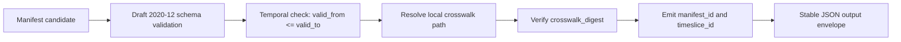

<!-- [KFM_META_BLOCK_V2]
doc_id: kfm://doc/hydrology/huc12-comid-crosswalk-manifest
title: HUC12⇄COMID Crosswalk Manifest Governance Slice
type: standard
version: v1
status: draft
owners: hydrology domain steward; policy steward
created: 2026-05-01
updated: 2026-05-01
policy_label: public
related: [schemas/hydrology/huc12_comid_manifest.schema.json, policy/hydrology/huc12_comid_manifest.rego, tools/validators/hydrology/validate_huc12_comid_manifest.py]
tags: [kfm, hydrology, governance, crosswalk, manifest, promotion-gate]
notes: [Fixture-backed and no-network by design, Any runtime promotion wiring is NEEDS_VERIFICATION]
[/KFM_META_BLOCK_V2] -->

# HUC12⇄COMID Crosswalk Manifest Governance Slice

Release-candidate manifest rules for binding a HUC12 unit to a COMID crosswalk artifact without allowing silent identity drift into publication.

> [!IMPORTANT]
> This slice is intentionally narrow: it governs one hydrology identity bridge, its digest-backed artifact reference, and the promotion checks that prevent automatic release when the anchor identity changes. It does **not** prove runtime promotion wiring, UI payload mapping, release-registry aliasing, or live WBD/NHD source access.

## Quick navigation

- [Purpose](#purpose)
- [Evidence and implementation posture](#evidence-and-implementation-posture)
- [Repo fit](#repo-fit)
- [Manifest contract](#manifest-contract)
- [Stable identity](#stable-identity)
- [Validator behavior](#validator-behavior)
- [Promotion gate](#promotion-gate)
- [Evidence Drawer payload](#evidence-drawer-payload)
- [No-network fixture posture](#no-network-fixture-posture)
- [Rollback and correction](#rollback-and-correction)
- [Reviewer checklist](#reviewer-checklist)
- [Open verification items](#open-verification-items)

## Purpose

This document defines the governance rules for release-candidate manifest records that connect:

- a `layer_type = "huc12"` hydrologic unit,
- one declared HUC12 identifier,
- one source/snapshot context,
- one local COMID crosswalk artifact,
- one deterministic artifact digest,
- one receipt-bearing validation run.

The goal is to make the HUC12⇄COMID bridge inspectable before it can become a public or semi-public KFM claim surface. A changed `nhd_snapshot_id` or changed `crosswalk_digest` is treated as identity drift and blocks automatic promotion.

## Evidence and implementation posture

| Claim area | Status | What this document may safely say |
| --- | --- | --- |
| Manifest slice intent | CONFIRMED from supplied slice | The slice is designed for fixture-backed, no-network governance of HUC12⇄COMID manifest records. |
| Schema, policy, and validator paths | CONFIRMED as declared paths; repo presence NEEDS VERIFICATION | The paths named in the meta block are the expected homes for this slice, but this session did not verify the mounted repository tree. |
| Runtime promotion wiring | NEEDS VERIFICATION | Promotion policy is specified here as a gate posture; integration with release registries, aliases, or deployment workflows is not confirmed. |
| UI / Evidence Drawer mapping | NEEDS VERIFICATION | Required evidence fields are listed, but any actual UI DTO or component mapping remains unverified. |
| Live source access | OUT OF SCOPE for this slice | This slice uses local fixtures and must not require WBD/NHD live pulls. |

## Repo fit

**PROPOSED document home:** `docs/domains/hydrology/HUC12_COMID_CROSSWALK_MANIFEST_LEGACY.md`.

This document belongs in the hydrology documentation lane beside the schema, policy, validator, and test fixtures that govern the manifest.

| Surface | Expected path | Role |
| --- | --- | --- |
| Schema | `schemas/hydrology/huc12_comid_manifest.schema.json` | Machine-readable contract for manifest shape. |
| Policy | `policy/hydrology/huc12_comid_manifest.rego` | Promotion-denial rules for drift, missing records, digest shape, and receipt verification. |
| Validator | `tools/validators/hydrology/validate_huc12_comid_manifest.py` | Offline manifest validation, digest verification, and stable ID emission. |
| Fixtures | `tests/fixtures/hydrology/huc12_comid_manifest/` | Local-only valid and denied examples. |

> [!NOTE]
> The paths above are treated as declared slice homes, not as verified repository inventory. Confirm them in a real checkout before commit or CI wiring.

## Manifest contract

Canonical schema declared by this slice: `schemas/hydrology/huc12_comid_manifest.schema.json`.

`additionalProperties` is disallowed. A release-candidate manifest must be small, explicit, and digest-backed.

| Field | Required | Constraint / expected shape | Why it matters |
| --- | --- | --- | --- |
| `layer_type` | Yes | Must equal `"huc12"`. | Prevents this slice from being reused for incompatible layer families without a new contract. |
| `huc12` | Yes | 12-digit string. | Defines the hydrologic unit anchor. |
| `snapshot_id` | Yes | Snapshot identifier. | Binds the manifest to the KFM snapshot context. |
| `nhd_snapshot_id` | Yes | NHD/NHDPlus snapshot identifier. | Detects crosswalk identity drift across hydrography source snapshots. |
| `spec_hash` | Yes | Must begin with `sha256:`. | Binds the run to a deterministic specification. |
| `run_receipt_url` | Yes | Receipt reference. | Gives reviewers a traceable run artifact. |
| `valid_from` | Yes | Date or date-time per schema. | Starts the time slice. |
| `valid_to` | Yes | Date or date-time per schema. | Ends the time slice. |
| `comid_crosswalk` | Yes | Local path or path resolvable under `--crosswalk-root`. | Points to the artifact whose digest is checked. |
| `crosswalk_digest` | Yes | Must begin with `sha256:`. | Detects changed crosswalk content. |

### Illustrative manifest shape

The following is illustrative only; use repo fixtures for authoritative examples.

```json
{
  "layer_type": "huc12",
  "huc12": "102701040101",
  "snapshot_id": "kfm-hydro-2026-05-01",
  "nhd_snapshot_id": "nhdplushr-2026-05-01",
  "spec_hash": "sha256:REPLACE_WITH_64_HEX_CHARS",
  "run_receipt_url": "receipts/hydrology/huc12_comid/example-run-receipt.json",
  "valid_from": "2026-05-01",
  "valid_to": "2026-12-31",
  "comid_crosswalk": "crosswalks/huc12_102701040101_comid.csv",
  "crosswalk_digest": "sha256:REPLACE_WITH_64_HEX_CHARS"
}
```

## Stable identity

The validator emits deterministic IDs from the manifest content:

| ID | Formula | Stability rule |
| --- | --- | --- |
| `manifest_id` | `huc12@<snapshot_id>::<spec_hash>` | Stable when the HUC12, snapshot, and spec hash are unchanged. |
| `timeslice_id` | `huc12::<snapshot_id>::<YYYYMMDD>-<YYYYMMDD>` | Stable when the HUC12, snapshot, `valid_from`, and `valid_to` are unchanged. |

These IDs are not display labels. They are reviewer-facing and automation-facing anchors for receipts, proof objects, promotion comparisons, and rollback references.

## Validator behavior

Validator declared by this slice: `tools/validators/hydrology/validate_huc12_comid_manifest.py`.

The validator must run without live network calls and produce a stable JSON output envelope.



| Step | Required behavior | Failure posture |
| --- | --- | --- |
| Schema validation | Validate against Draft 2020-12 schema. | `ok = false`; include schema error. |
| Temporal validation | Ensure `valid_from <= valid_to`. | `ok = false`; include temporal error. |
| Crosswalk resolution | Resolve `comid_crosswalk` locally or under `--crosswalk-root`. | `ok = false`; include resolution error. |
| Digest verification | Compute deterministic digest for local crosswalk artifact and compare with `crosswalk_digest`. | `ok = false`; include digest mismatch. |
| Stable ID emission | Emit `manifest_id` and `timeslice_id` for valid content. | IDs may be `null` or omitted only if the validator contract explicitly permits it. |

### Output envelope

The validator output envelope is intentionally finite and reviewable:

```json
{
  "ok": true,
  "errors": [],
  "manifest_id": "huc12@kfm-hydro-2026-05-01::sha256:REPLACE_WITH_64_HEX_CHARS",
  "timeslice_id": "huc12::kfm-hydro-2026-05-01::20260501-20261231"
}
```

## Promotion gate

Policy declared by this slice: `policy/hydrology/huc12_comid_manifest.rego`.

Promotion is a governed state transition, not a file move. The policy must compare the previous released manifest and the current release candidate in a fail-closed posture.

| Condition | Decision | Rationale |
| --- | --- | --- |
| Previous released record is missing | DENY | No baseline exists for drift comparison. |
| Current candidate record is missing | DENY | No candidate exists to validate. |
| `nhd_snapshot_id` changed | DENY auto-promotion | Hydrography anchor drift requires governed review/correction. |
| `crosswalk_digest` changed | DENY auto-promotion | Crosswalk content changed and must not silently replace released meaning. |
| `spec_hash` does not start with `sha256:` | DENY | Specification identity is not in the expected digest form. |
| `run_receipt_url_verified != true` | DENY | The run receipt must be verified before promotion. |

> [!WARNING]
> A DENY decision is not a deletion instruction. It means the candidate must enter a governed correction, supersession, or review flow before publication can proceed.

## Evidence Drawer payload

Public evidence-bound clients should be able to explain a HUC12⇄COMID manifest-backed claim without exposing internal stores or raw model output.

At minimum, the Evidence Drawer payload for this slice should carry:

| Evidence field | Required for public explanation | Notes |
| --- | --- | --- |
| `snapshot_id` | Yes | KFM snapshot context. |
| `nhd_snapshot_id` | Yes | Hydrography source snapshot context. |
| `spec_hash` | Yes | Digest-tagged specification identity. |
| `run_receipt_url` | Yes | Must include verification state. |
| `run_receipt_url_verified` | Yes | Promotion gate expects `true`. |
| `comid_crosswalk` | Yes | Public-safe artifact reference or redacted/generalized display equivalent. |
| `crosswalk_digest` | Yes | Digest-tagged artifact identity. |
| `valid_from` / `valid_to` | Yes | Time-bounds the manifest. |
| `manifest_id` | Recommended | Supports reviewer traceability. |
| `timeslice_id` | Recommended | Supports temporal traceability. |

UI payload mapping is **NEEDS VERIFICATION**. This document defines the minimum evidence surface; it does not confirm a DTO, API route, component, or renderer implementation.

## No-network fixture posture

This slice is fixture-backed and no-network by design.

| Rule | Requirement |
| --- | --- |
| Fixture root | Use `tests/fixtures/hydrology/huc12_comid_manifest/`. |
| Network access | No WBD/NHD live pulls in validator tests. |
| Crosswalk artifact | Use local fixture files only. |
| Digest test | Include at least one valid digest fixture and one digest-mismatch fixture. |
| Drift test | Include previous/current fixture pairs for `nhd_snapshot_id` drift and `crosswalk_digest` drift. |
| Fail-closed test | Include missing previous and missing current cases. |

## Rollback and correction

Rollback should restore the released alias/state to a prior approved manifest. Immutable artifacts should not be deleted.

| Situation | Required action |
| --- | --- |
| `nhd_snapshot_id` drift | Deny auto-promotion and require governed correction or supersession review. |
| `crosswalk_digest` drift | Deny auto-promotion and require artifact/content review. |
| Bad release alias | Repoint released alias/state to prior approved manifest. |
| Invalid candidate | Keep candidate and receipts for audit; do not promote. |
| Superseded manifest | Preserve immutable artifact and record correction lineage. |

Integration with release registries and alias wiring is **NEEDS VERIFICATION**.

## Reviewer checklist

Use this checklist before accepting a PR that introduces or changes this slice.

- [ ] Meta block is present, synchronized with the H1, and still marked `status: draft` unless review state changed.
- [ ] Schema path exists or the PR explains why the path changed.
- [ ] Policy path exists or the PR explains why the path changed.
- [ ] Validator path exists or the PR explains why the path changed.
- [ ] Validator emits `ok`, `errors`, `manifest_id`, and `timeslice_id`.
- [ ] Validator tests are no-network and fixture-backed.
- [ ] Digest verification covers local path and `--crosswalk-root` resolution.
- [ ] Temporal check rejects `valid_from > valid_to`.
- [ ] Promotion policy denies missing previous/current records.
- [ ] Promotion policy denies `nhd_snapshot_id` drift.
- [ ] Promotion policy denies `crosswalk_digest` drift.
- [ ] Promotion policy denies non-`sha256:` `spec_hash`.
- [ ] Promotion policy denies unverified run receipts.
- [ ] Evidence Drawer contract includes the minimum evidence fields listed above or records a reviewed exception.
- [ ] Rollback/correction notes preserve immutable artifacts and avoid treating rollback as deletion.

## Open verification items

| Item | Status | Why it remains open |
| --- | --- | --- |
| Actual doc path | NEEDS VERIFICATION | No mounted repository was available to confirm documentation layout. |
| Schema implementation | NEEDS VERIFICATION | Declared path was supplied, but the schema file was not inspected in a repo checkout. |
| Rego implementation | NEEDS VERIFICATION | Declared path was supplied, but policy execution was not inspected. |
| Validator CLI contract | NEEDS VERIFICATION | Behavior is specified, but exact command-line interface beyond `--crosswalk-root` was not verified. |
| Promotion registry integration | NEEDS VERIFICATION | Release aliases, state stores, and promotion workflows were not inspected. |
| Evidence Drawer DTO/API mapping | NEEDS VERIFICATION | Minimum fields are defined, but UI and API contracts were not verified. |
| Fixture coverage | NEEDS VERIFICATION | Fixture posture is declared; actual test inventory must be inspected in the repo. |

## Summary

This slice turns the HUC12⇄COMID crosswalk from a hidden helper table into a governed, digest-backed release candidate. It preserves KFM’s hydrology identity discipline by requiring local validation, deterministic IDs, fail-closed promotion comparison, receipt verification, evidence-bound public explanation, and rollback without artifact deletion.
