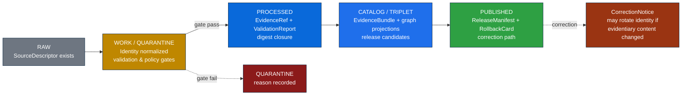

<!-- [KFM_META_BLOCK_V2]
doc_id: kfm://doc/hydrology-identity-model
title: Hydrology Identity Model
type: standard
version: v1
status: draft
owners: <hydrology-lane-steward — TODO assign>
created: 2026-05-18
updated: 2026-05-18
policy_label: public
related:
  - docs/domains/hydrology/README.md
  - docs/doctrine/lifecycle-law.md
  - docs/doctrine/truth-posture.md
  - docs/doctrine/trust-membrane.md
  - docs/standards/CANONICALIZATION.md
  - docs/architecture/contract-schema-policy-split.md
  - docs/adr/ADR-0001-schema-home.md
  - schemas/contracts/v1/domains/hydrology/
  - contracts/domains/hydrology/
  - policy/domains/hydrology/
tags: [kfm, hydrology, identity, evidence, governance]
notes:
  - Path conformant to Directory Rules §12 (Domain Placement Law).
  - Specific repo paths beyond docs/domains/hydrology/ are PROPOSED pending mounted-repo verification.
  - Identity rule structure (source id + object role + temporal scope + normalized digest) is doctrine; field-level realization is PROPOSED.
[/KFM_META_BLOCK_V2] -->

# Hydrology Identity Model

> Deterministic, evidence-bounded identity rules for every object family the Hydrology lane owns — from `HUCUnit` and `ReachIdentity` to `FlowObservation`, `Groundwater Well`, and `NFHLZone` — and the governance that keeps those identities stable across pipeline phases, source vintages, and corrections.


| Field | Value |
|---|---|
| **Status** | `draft` — under review by the hydrology lane steward |
| **Doctrine confidence** | **CONFIRMED** for identity rule shape, temporal handling, lifecycle, and ABSTAIN posture |
| **Implementation confidence** | **PROPOSED** — field-level realization not yet verified against mounted repo |
| **Owners** | Hydrology lane steward — *TODO assign* |
| **Last updated** | 2026-05-18 |

> [!IMPORTANT]
> Identity decisions in this document are **doctrinal**. They describe how objects are made distinguishable in the Hydrology lane regardless of representation, vintage, or pipeline phase. Identity is **not** a file path, an internal database key, or a UI handle — it is a deterministic property of the object's evidence, role, scope, and content. Where an `Identity rule` field reads `PROPOSED deterministic basis`, the *shape* of the rule is fixed by KFM doctrine; the *field names and normalization rules* are pending schema realization.

---

## Contents

1. [Scope and identity boundaries](#1-scope-and-identity-boundaries)
2. [The deterministic identity rule](#2-the-deterministic-identity-rule)
3. [Object families and their identities](#3-object-families-and-their-identities)
4. [Temporal handling — six times that stay distinct](#4-temporal-handling--six-times-that-stay-distinct)
5. [Identity machinery — `spec_hash`, digests, ID derivation](#5-identity-machinery--spec_hash-digests-id-derivation)
6. [Reach identity: COMID → HUC12 worked example](#6-reach-identity-comid--huc12-worked-example)
7. [Edge cases and ABSTAIN semantics](#7-edge-cases-and-abstain-semantics)
8. [Source-role discipline and identity](#8-source-role-discipline-and-identity)
9. [Cross-domain identity edges](#9-cross-domain-identity-edges)
10. [Lifecycle and identity](#10-lifecycle-and-identity)
11. [Where this lives in the repo](#11-where-this-lives-in-the-repo)
12. [Verification backlog and open questions](#12-verification-backlog-and-open-questions)
13. [Related documents](#13-related-documents)

---

## 1. Scope and identity boundaries

**CONFIRMED doctrine / PROPOSED implementation.** The Hydrology lane governs identity for watersheds, HUC units, hydro features, reaches, gauges, flow and level observations, water quality, groundwater context, regulatory flood context, observed flood evidence, drought, and irrigation links. *(Sources: `[DOM-HYD]`, `[ENCY]`.)*

### What this lane owns

`Watershed` · `HUCUnit` · `HydroFeature` · `ReachIdentity` · `GaugeSite` · `FlowObservation` · `WaterLevelObservation` · `Water Quality Observation` · `Groundwater Well` · `NFHLZone` / `Flood Context` · `Observed Flood Event` · `Hydrograph` · `UpstreamTrace`.

### What this lane explicitly does **not** own

> [!WARNING]
> **Source-role anti-collapse is doctrine.** These are the most common identity-collapse hazards in hydrology. Treat them as fail-closed boundaries, not stylistic guidance.

- **Emergency alerts and life-safety warnings** are owned by Hazards / official sources, not Hydrology.
- **NFHL regulatory flood context is not observed inundation.** NFHL is a regulatory product with regulatory identity; observed inundation has its own object family (`Observed Flood Event`) with its own identity. Joining them silently is a `DENY`-class violation.
- **Soil, agriculture, geology, and infrastructure** keep their own canonical claims. Hydrology may consume them via cross-lane edges (§9) but never re-identifies them.

[⬆ back to top](#contents)

---

## 2. The deterministic identity rule

**PROPOSED deterministic basis** for every hydrology object family:

```text
identity(object) = f(  source_id
                     , object_role
                     , temporal_scope
                     , normalized_digest )
```

This is the doctrinal shape recorded for every Hydrology object family in the Domain Atlas and is consistent with the identity rules used across Spatial Foundation, Soil, Fauna, Flora, Habitat, Geology, Hazards, Roads/Rail, and other KFM lanes. *(Source: `[DOM-HYD]` Section E; `[ENCY]` Section 5.)*

| Component | Purpose | Realization status |
|---|---|---|
| `source_id` | Pins identity to a registered `SourceDescriptor` — vintage, authority, rights, and source role flow from here. | **PROPOSED** schema field; canonical home `schemas/contracts/v1/source/source-descriptor.json` per ADR-0001. |
| `object_role` | The object family within this lane (e.g., `ReachIdentity`, `GaugeSite`, `FlowObservation`) — prevents cross-family identity collisions. | **CONFIRMED** vocabulary (Section 3); **PROPOSED** field realization. |
| `temporal_scope` | The window of time the identity covers (instant, valid-interval, vintage band) — keeps WBD snapshots and NHDPlus vintages distinct. | **CONFIRMED** semantics (Section 4); **PROPOSED** field shape. |
| `normalized_digest` | A deterministic content hash (default `jcs:sha256:<hex>`) over the canonicalized identity-bearing fields — makes identity reproducible across runs and tools. | **CONFIRMED** algorithm default (Section 5); **NEEDS VERIFICATION** for per-object normalization rules. |

### Three invariants the rule must preserve

1. **Two objects with the same logical content from the same source and vintage MUST produce the same identity.** This is what makes pipelines idempotent and corrections targeted.
2. **An object's identity MUST NOT change because a path moved, a timestamp ticked, or a serializer reformatted the JSON.** Transport, location, and incidental ordering are excluded from the digest.
3. **A change to evidentiary content MUST rotate identity.** Drift, partial promotion, or accidental substitution becomes detectable as a hash mismatch.

[⬆ back to top](#contents)

---

## 3. Object families and their identities

**CONFIRMED ownership / PROPOSED field realization.** Every Hydrology object family shares the same identity rule structure. The columns below summarize the per-family role, what `source_id` typically resolves to, and what `temporal_scope` looks like in practice. *(Source: `[DOM-HYD]` Section E; `[ENCY]`.)*

| Object family | What it represents (in this lane) | Typical `source_id` anchor | Typical `temporal_scope` |
|---|---|---|---|
| `Watershed` | Watershed evidence or released derivative | WBD snapshot + HUC nesting | Snapshot vintage; valid interval |
| `HUCUnit` | HUC2/HUC4/HUC8/HUC12 accounting unit | WBD snapshot | Snapshot vintage |
| `HydroFeature` | Waterbody, flowline, or other NHD-class feature | NHDPlus version (v2.1 / HR / 3DHP) | Vintage band |
| `ReachIdentity` | Stable identity for a stream reach across vintages | NHDPlus permanent identifier + version | Vintage band; valid interval |
| `GaugeSite` | USGS / state water gauge site | NWIS site identifier | Site lifetime |
| `FlowObservation` | Discharge / streamflow observation | NWIS series + parameter code | Instant or aggregation window |
| `WaterLevelObservation` | Gage height / stage observation | NWIS series + parameter code | Instant or aggregation window |
| `Water Quality Observation` | Water-quality measurement | Water-quality program + station | Instant or sampling window |
| `Groundwater Well` | Groundwater well of record | State / NWIS well registry | Well lifetime |
| `NFHLZone` / `Flood Context` | FEMA NFHL regulatory polygon | NFHL panel + effective date | Effective interval |
| `Observed Flood Event` | Observed inundation evidence | Historical / observed source family | Event interval |
| `Hydrograph` / `UpstreamTrace` | Derivative views over the above | Composition of underlying objects | Inherited from inputs |

> [!NOTE]
> Each row carries the **same** doctrinal identity rule: `source_id + object_role + temporal_scope + normalized_digest`. The columns differ in *what fills* the slots, never in *which slots exist*.

[⬆ back to top](#contents)

---

## 4. Temporal handling — six times that stay distinct

**CONFIRMED.** For every Hydrology object family the Domain Atlas records the same temporal invariant:

> *"source, observed, valid, retrieval, release, and correction times stay distinct where material."*

| Time | What it pins | Why it matters in Hydrology |
|---|---|---|
| **source time** | The vintage stamped by the issuing authority (e.g., WBD snapshot date, NHDPlus version tag). | NHDPlus v2.1 and NHDPlus HR are *different sources*, not different times of the same source. |
| **observed time** | When the phenomenon occurred (e.g., the moment a gauge reading was taken). | A 10:00 stage value is not the same fact as the daily mean for the day that contains it. |
| **valid time** | The interval over which the claim holds (e.g., an NFHL panel's effective period). | A regulatory zone has identity tied to its effective interval, not its retrieval date. |
| **retrieval time** | When KFM pulled the bytes. | Drives `source_head` (URL, ETag, Last-Modified) and freshness badges; does not affect identity. |
| **release time** | When KFM promoted the artifact to `PUBLISHED`. | Recorded in `ReleaseManifest`; never embedded in the identity digest. |
| **correction time** | When a `CorrectionNotice` superseded a prior claim. | Triggers identity rotation only when the *correction* changes evidentiary content; otherwise it's a release-plane event. |

> [!CAUTION]
> Collapsing any two of these (especially **source time** with **observed time**, or **valid time** with **release time**) is one of the most common identity-corruption failures in environmental data systems. The Hydrology lane treats this as fail-closed.

[⬆ back to top](#contents)

---

## 5. Identity machinery — `spec_hash`, digests, ID derivation

**CONFIRMED doctrine / PROPOSED per-object realization.** Hydrology identities are realized through the same `spec_hash` machinery used across KFM. *(Sources: `C1-02 Deterministic spec_hash via RFC 8785 JCS + SHA-256`; New Ideas 5-8, 5-15; Pass 20 Part 2.)*

### The default algorithm

- **Canonicalize** the identity-bearing JSON with **RFC 8785 JCS** (sorted keys, no whitespace variance, normalized number representation).
- **Hash** the canonical bytes with **SHA-256**.
- **Record** the digest as `jcs:sha256:<hex>`.

### Derived IDs (PROPOSED scheme)

```text
bundle_id        = "eb-" + base32( lowercase( SHA-256( spec_hash ) ) )[:26]
evidence_ref_id  = "er-" + base32( lowercase( SHA-256( target_bundle_spec_hash ) ) )[:26]
```

> [!NOTE]
> The `eb-` / `er-` prefix scheme is PROPOSED in the New Ideas dossier and `NEEDS VERIFICATION` against the mounted repository before being treated as canonical. Adopt or amend via an accepted ADR before any consumer relies on the exact prefix or length.

### What goes into the digest

| **Included** (changes the digest) | **Excluded** (does not change the digest) |
|---|---|
| `object_type`, `schema_version` | retrieval timestamp |
| `source_refs`, `dataset_refs` | storage URL / file path |
| `evidence_refs`, `object_refs` | run nonce / orchestrator session id |
| `policy_label`, `rights_status`, `sensitivity` | signatures / attestations (attached separately) |
| Identity-bearing geometry fingerprints | transport encoding artifacts |

### Hash policy is ADR-class

> [!IMPORTANT]
> The choice between **SHA-256 (with JCS)** and **BLAKE3** is not free. New Ideas 5-10 and Pass 20 Part 2 note that different roles want different algorithms — **JCS+SHA-256** is the default for descriptor and identity hashing, while **BLAKE3** is the recommended root hash for streaming artifacts (e.g., PMTiles content). A hash-policy ADR (working title **EXP-004**) is **PROPOSED** to lock these choices per object family. Until that ADR is accepted, every hash field MUST carry an explicit algorithm prefix.

### Identity construction flow

```mermaid
flowchart LR
    A[Raw source bytes] --> B[SourceDescriptor lookup<br/>source_id]
    B --> C[Object role assignment<br/>e.g. ReachIdentity]
    C --> D[Temporal scope binding<br/>vintage / valid interval]
    D --> E[Canonicalize identity-bearing fields<br/>RFC 8785 JCS]
    E --> F[SHA-256 over canonical bytes]
    F --> G[normalized_digest<br/>jcs:sha256:&lt;hex&gt;]
    G --> H[Object identity = source_id + object_role<br/>+ temporal_scope + normalized_digest]
    H -.evidence path.-> I[EvidenceBundle resolution]
    H -.publication path.-> J[Release gate / ReleaseManifest]
    style H fill:#1f6feb,stroke:#0a2540,color:#fff
    style I fill:#2ea043,stroke:#0a2540,color:#fff
    style J fill:#bf8700,stroke:#0a2540,color:#fff
```



[⬆ back to top](#contents)

---

## 6. Reach identity: COMID → HUC12 worked example

**CONFIRMED doctrine / PROPOSED implementation.** `ReachIdentity` is the most edge-case-rich identity in this lane. The deterministic, provenance-first recipe below comes from the New Ideas 5-8 hydrology dossier and aligns with `[DOM-HYD]` ABSTAIN doctrine on ambiguous reaches.

### Deterministic fallback ladder

Only advance to the next tier if the higher one is missing or insufficient. **Record which tier was used; the tier itself is part of the identity-bearing record.**

1. **Official USGS COMID→HUC12 crosswalk** (`decision_reason: official_crosswalk`).
2. **Area-weighted polygon overlay** of NHDPlus catchments on WBD HUC12s (`decision_reason: area_weighted_overlay`); retain the overlap fraction.
3. **Centroid-in-polygon heuristic** when overlay is ambiguous (`decision_reason: centroid_in_polygon`).
4. **Snap-to-outlet / pour-point** when geometry is problematic (`decision_reason: snap_to_pour_point`); record PRNG seed for tie-breaks.

### Required provenance fields per row

<details>
<summary><b>Click to expand: identity-bearing fields the manifest MUST carry</b></summary>

- `spec_hash` — `jcs:sha256:<hex>` over the canonical, key-sorted JSON of this row.
- `source_head` — `{ url, etag, last_modified }` at fetch time.
- `source_doi` — e.g., USGS crosswalk DOI when present.
- `algorithm_version` — semantic version of the crosswalk tool.
- `comid`, `huc12` — the join itself.
- `catchment_poly_hash` — WKB SHA-256 of the catchment geometry.
- `geometry_sanity_flags` — self-intersection, tiny area, invalid ring, etc.
- `alignment_score` — overlap fraction used for the decision.
- `decision_reason` — one of `official_crosswalk` | `area_weighted_overlay` | `centroid_in_polygon` | `snap_to_pour_point`.
- `provenance` — `{ tool, tool_version }` (e.g., `nhdplusTools` / `hydroloom`).
- `nhdplus_version` — `v2.1` | `HR` | `3DHP` — **never** silently mixed.
- `wbd_snapshot` — ISO-8601 date of the WBD vintage.
- `coverage_scope` — e.g., `CONUS`; fail closed outside supported extents unless explicitly supported.

</details>

### Minimal manifest shape (illustrative, PROPOSED)

```json
{
  "schema_version": "v1",
  "object_type": "HydroCrosswalkManifest",
  "comid": 1234567,
  "huc12": "102701010203",
  "decision_reason": "official_crosswalk",
  "alignment_score": 0.9921,
  "spec_hash": "jcs:sha256:<hex>",
  "source_head": {
    "url": "<crosswalk source URL>",
    "etag": "<ETag from HEAD>",
    "last_modified": "<Last-Modified from HEAD>"
  },
  "geometry": {
    "catchment_poly_hash": "sha256:<hex>",
    "geometry_valid": true
  },
  "nhdplus_version": "v2.1",
  "wbd_snapshot": "2024-10-01",
  "coverage_scope": "CONUS",
  "provenance": {
    "tool": "kfm-hydro-validator",
    "tool_version": "0.1.0"
  }
}
```

> [!NOTE]
> This shape is **illustrative**, not authoritative. The canonical home for the validated schema is **PROPOSED** at `schemas/contracts/v1/domains/hydrology/hydro-crosswalk-manifest.schema.json` per Directory Rules §7.4 and ADR-0001; the actual file presence and field names are **NEEDS VERIFICATION** against the mounted repo.

[⬆ back to top](#contents)

---

## 7. Edge cases and ABSTAIN semantics

**CONFIRMED doctrine.** The hydrology thin-slice plan in `[ENCY]` is explicit: the first credible slice includes **ABSTAIN on ambiguous reach identity**. That is not a soft fallback; it is a finite-outcome contract.

### Finite outcomes (CONFIRMED)

| Outcome | Meaning in Hydrology |
|---|---|
| `ANSWER` | A defensible, evidence-bounded identity is available; release-eligible subject to other gates. |
| `ABSTAIN` | No defensible identity given current evidence; do not publish, do not invent, do not fall back silently to a heuristic without recording it. |
| `DENY` | A policy, rights, sensitivity, or release-state rule blocks the claim — even if identity is unambiguous. |
| `ERROR` | Structural or runtime failure; emit a receipt; do not retry as `ANSWER`. |

### When `ReachIdentity` should ABSTAIN

> [!CAUTION]
> Each of these triggers ABSTAIN, not a silent best-guess. The Hydrology validator is required to be **deterministic, offline-capable, reproducible, and side-effect free**, per New Ideas 5-8.

- **NHDPlus version drift.** v2.1, HR, and 3DHP identifiers are **not** interchangeable. Mixing them without an explicit `nhdplus_version` triggers ABSTAIN.
- **WBD snapshot drift.** A HUC12 that crosses snapshot vintages is two facts, not one. Lineage notes are required; identity is per-snapshot.
- **Coastal / braided / transition systems.** Area-weighted overlays can produce unstable assignments. The validator emits `multi_huc_candidate: true` with a ranked candidate list, and the publication gate ABSTAINs.
- **`alignment_score < 0.75`.** The default low-alignment threshold for a heuristic crosswalk decision.
- **Non-CONUS extents.** The official crosswalk is not universally authoritative outside supported scopes. Fail closed unless `coverage_scope` explicitly supports the extent.
- **Missing provenance.** Any of `spec_hash`, `source_head`, `algorithm_version`, or `decision_reason` absent → ABSTAIN at validation, DENY at publication.

### Negative fixtures the validator should carry

| Fixture | Trigger | Expected outcome |
|---|---|---|
| `huc12` not 12 digits | Structural | `FAIL_INVALID_HUC12` |
| `decision_reason: area_weighted_overlay` with `alignment_score < 0.75` | Hydrologic sanity | `FAIL_LOW_ALIGNMENT` |
| Missing `source_head` or `algorithm_version` | Provenance | `FAIL_MISSING_PROVENANCE` |
| `nhdplus_version` absent on a v2.1 vs HR mixed batch | Version drift | `FAIL_NHDPLUS_VERSION_DRIFT` *(PROPOSED label)* |

[⬆ back to top](#contents)

---

## 8. Source-role discipline and identity

**CONFIRMED.** Source role is part of identity context, not a label that can be retro-edited. *(Sources: `[DOM-HYD]`, `[ENCY]`, Pass 20 Part 2 §24.1.3.)*

### Source families for Hydrology (CONFIRMED ownership)

| Source family | Role | Rights / sensitivity |
|---|---|---|
| USGS WBD / HUC12 | authority / observation / context as the source role requires | rights `NEEDS VERIFICATION`; sensitive joins fail closed |
| NHDPlus HR / v2.1 / 3DHP-oriented hydrography | authority / observation | rights `NEEDS VERIFICATION` |
| USGS Water Data / NWIS | authority / observation | rights `NEEDS VERIFICATION`; freshness-sensitive |
| FEMA NFHL / MSC | **regulatory** | regulatory context only; `DENY` cross-tag as observed inundation |
| 3DEP terrain | authority / context | rights `NEEDS VERIFICATION` |
| Water quality and groundwater sources | authority / observation | rights and sensitivity vary by program |
| Historical observed flood evidence | observation | source-vintage specific |

### The role anti-collapse rule

> [!WARNING]
> A `source_role` of `regulatory` (e.g., NFHL) and a `source_role` of `observed` (e.g., observed inundation) **cannot** share an identity. Even when geometries overlap, the identities are separate, the EvidenceBundles are separate, the release manifests are separate, and the UI badges differ. This is recorded as a `DENY`-class cross-domain rule in `[DOM-HYD] [DOM-HAZ] [DOM-AIR]`.

[⬆ back to top](#contents)

---

## 9. Cross-domain identity edges

**CONFIRMED doctrine.** Hydrology supplies identity context to several other lanes but never overrides their canonical identities. *(Source: `[DOM-HYD]` Section F; `[ENCY]` §24.4.2.)*

| Hydrology consumed by… | Relation | Constraint |
|---|---|---|
| **Soil** | HUC / watershed identity bounds soil hydrologic group context. | Soil keeps `SoilMapUnit` identity; Hydrology only frames the bounds. |
| **Habitat / Fauna / Flora** | Wetland and reach identity feeds habitat-quality and occurrence-context joins. | Ecology objects retain their own identity; Hydrology supplies context. |
| **Agriculture** | Reach identity and water-availability context bound irrigation links. | Observed flow is **not** a yield input without modeling. |
| **Hazards** | Observed flow and water-level observations are cited as context for flood events. | NFHL remains regulatory context only — never observed inundation. |
| **Settlements / Infrastructure** | Reach proximity and HUC context drive settlement and crossing analyses. | Hydrology context does not override settlement identity. |
| **Frontier Matrix** | HUC / reach as cross-temporal anchors for water-availability cells. | Aggregate cells cited as per-place truth is `DENY`. |

> [!NOTE]
> Cross-lane consumers MUST resolve Hydrology identities via the governed API and released `EvidenceBundle`s — not by reading canonical or pipeline-internal stores. This is the trust-membrane discipline applied at the identity boundary.

[⬆ back to top](#contents)

---

## 10. Lifecycle and identity

**CONFIRMED doctrine / PROPOSED implementation.** Identity travels through the same lifecycle every KFM object obeys: `RAW → WORK / QUARANTINE → PROCESSED → CATALOG / TRIPLET → PUBLISHED`. Promotion is a **governed state transition, not a file move**.



### Identity rules per phase (CONFIRMED doctrine, PROPOSED implementation)

| Phase | What happens to identity | Gate |
|---|---|---|
| **RAW** | Source vintage captured; `source_id` minted via `SourceDescriptor`. No public-facing identity yet. | `SourceDescriptor` exists. |
| **WORK / QUARANTINE** | Identity normalized; `temporal_scope` bound; digest computed; failures held. | Validation + policy gate pass, or quarantine reason recorded. |
| **PROCESSED** | Identity stable; `EvidenceRef` issued. | `EvidenceRef`, `ValidationReport`, digest closure exist. |
| **CATALOG / TRIPLET** | Identity linked into `EvidenceBundle` and graph projections. | Catalog / proof closure passes. |
| **PUBLISHED** | Identity served via governed API behind `ReleaseManifest`. | `ReleaseManifest`, correction path, rollback target, review/policy state exist. |

[⬆ back to top](#contents)

---

## 11. Where this lives in the repo

**CONFIRMED doctrine / PROPOSED specific paths.** Directory Rules §12 (Domain Placement Law) is explicit: **a domain MUST NOT become a root folder**. Hydrology identity material spreads across responsibility roots, with the domain appearing as a segment in each.

```text
docs/domains/hydrology/                                 # this file lives here
contracts/domains/hydrology/                            # semantic Markdown for objects
schemas/contracts/v1/domains/hydrology/                 # machine-checkable JSON Schema  (per ADR-0001)
policy/domains/hydrology/                               # admissibility, publication gates
tests/domains/hydrology/                                # proof the rules are enforceable
fixtures/domains/hydrology/                             # valid + invalid sample data
packages/domains/hydrology/                             # shared libraries (e.g., evidence resolver clients)
pipelines/domains/hydrology/                            # executable pipeline logic
pipeline_specs/hydrology/                               # declarative pipeline configuration
data/raw/hydrology/                                     # immutable captured payloads
data/work/hydrology/                                    # in-progress normalization
data/quarantine/hydrology/                              # held failures
data/processed/hydrology/                               # validated normalized objects
data/catalog/domain/hydrology/                          # catalog records, EvidenceBundles
data/published/layers/hydrology/                        # public-safe released artifacts
data/registry/sources/hydrology/                        # source descriptors per-domain
release/candidates/hydrology/                           # release candidates per-domain
tools/validators/hydro/                                 # cross-cutting validator (no domain segment)
```

> [!NOTE]
> **Per Directory Rules §0:** the default schema home is `schemas/contracts/v1/<...>` per ADR-0001. **Specific paths above remain PROPOSED until mounted-repo verification.** Do not treat the tree as a repo fact.

> [!IMPORTANT]
> **Public consumers never read canonical hydrology stores directly.** Identity is exposed only through `apps/governed-api/` behind released `EvidenceBundle`s, `ReleaseManifest`s, and the runtime response envelope (`ANSWER` / `ABSTAIN` / `DENY` / `ERROR`). The Cesium / 3D renderer, if used for hydrology, consumes the same envelope — it is an alternate renderer, **not** an alternate truth path.

[⬆ back to top](#contents)

---

## 12. Verification backlog and open questions

**NEEDS VERIFICATION.** The items below are the per-lane identity-bearing claims that cannot be acted on as fact until verified against the mounted repository or settled by an ADR.

| # | Item | Evidence that would settle it | Status |
|---|---|---|---|
| 1 | HUC12 fixture and fingerprint rule. | Mounted repo files, schemas, tests, fixtures. | NEEDS VERIFICATION |
| 2 | NHDPlus HR crosswalk and ambiguity-ABSTAIN behavior. | Validator implementation + negative fixtures + CI run. | NEEDS VERIFICATION |
| 3 | USGS Water normalizer and NFHL source-role separation. | Normalizer code + policy bundle + emitted receipts. | NEEDS VERIFICATION |
| 4 | Hydrology API and MapLibre layer adapter. | API routes + `LayerManifest` + adapter tests. | NEEDS VERIFICATION |
| 5 | `eb-` / `er-` ID prefix scheme and base32 length. | Accepted ADR + reference verifier. | PROPOSED |
| 6 | Hash-policy ADR (`EXP-004`): SHA-256 vs BLAKE3 per object family. | Accepted ADR + algorithm-prefix validator fixtures. | PROPOSED |
| 7 | Source-role enum vocabulary (ADR-S-04). | Accepted ADR + `SourceDescriptor` schema. | PROPOSED |
| 8 | Canonical home for `HydroCrosswalkManifest` schema. | Verified file at `schemas/contracts/v1/domains/hydrology/`. | NEEDS VERIFICATION |
| 9 | Whether `policies/` or `policy/` is canonical in the mounted repo. | Repo inspection or ADR. | NEEDS VERIFICATION |
| 10 | Whether `triplets/` (plural) or `triplet/` (singular) is the chosen form. | Repo inspection or one-line ADR. | OPEN |

[⬆ back to top](#contents)

---

## 13. Related documents

- [`docs/domains/hydrology/README.md`](./README.md) — hydrology lane orientation *(TODO if absent)*
- [`docs/doctrine/lifecycle-law.md`](../../doctrine/lifecycle-law.md) — `RAW → PUBLISHED` invariant *(TODO link target verification)*
- [`docs/doctrine/truth-posture.md`](../../doctrine/truth-posture.md) — cite-or-abstain default
- [`docs/doctrine/trust-membrane.md`](../../doctrine/trust-membrane.md) — governed-API boundary
- [`docs/standards/CANONICALIZATION.md`](../../standards/CANONICALIZATION.md) — JCS / URDNA2015 decision matrix
- [`docs/architecture/contract-schema-policy-split.md`](../../architecture/contract-schema-policy-split.md) — `contracts/` vs `schemas/` vs `policy/`
- [`docs/adr/ADR-0001-schema-home.md`](../../adr/ADR-0001-schema-home.md) — canonical schema home *(TODO link target verification)*
- [`schemas/contracts/v1/domains/hydrology/`](../../../schemas/contracts/v1/domains/hydrology/) — PROPOSED machine-schema home
- [`contracts/domains/hydrology/`](../../../contracts/domains/hydrology/) — PROPOSED object-meaning home
- [`policy/domains/hydrology/`](../../../policy/domains/hydrology/) — PROPOSED admissibility / release home
- [`tools/validators/hydro/README.md`](../../../tools/validators/hydro/README.md) — PROPOSED cross-cutting validator
- [`docs/registers/VERIFICATION_BACKLOG.md`](../../registers/VERIFICATION_BACKLOG.md) — global verification backlog *(TODO link target verification)*

[⬆ back to top](#contents)

---

> **Lineage.** This document synthesizes hydrology-identity doctrine from `[DOM-HYD]`, `[ENCY]` (Master Domain Atlas, §5; Domains Culmination Atlas, §4 & §24.4.2), the Unified Implementation Architecture Build Manual (Part V §30.1), the New Ideas 5-8 hydrology dossier (COMID → HUC12 recipe; validator gates; finite outcomes), Pass 10 Idea Index entries `C1-01` (Universal Run Receipt) and `C1-02` (Deterministic `spec_hash` via JCS + SHA-256), Pass 20 Part 2 (hash policy and POL discipline), and Directory Rules §§3, 7.4, 12. No content was sourced from external (web) research; all citations are internal KFM doctrine.
>
> **Last updated:** 2026-05-18 · **Version:** v1 · **Status:** draft · [⬆ back to top](#contents)
