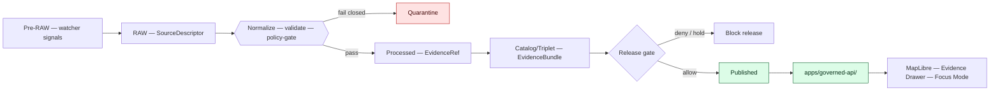

<!-- [KFM_META_BLOCK_V2]
doc_id: kfm://doc/domains/hydrology/index
title: Hydrology — Lane Index
type: standard
version: v1
status: draft
owners: <hydrology lane steward> + <docs steward>   # placeholders — resolve via CODEOWNERS / ownership register
created: 2026-06-06
updated: 2026-06-06
policy_label: public
contract_version: "3.0.0"   # pinned per ai-build-operating-contract.md v3.0
related:
  - ai-build-operating-contract.md
  - directory-rules.md
  - docs/domains/README.md
  - docs/domains/hydrology/README.md          # canonical lane landing page (README vs INDEX is a convention question — see §7)
  - docs/domains/hydrology/DATA_LIFECYCLE.md
  - docs/domains/hydrology/EXPANSION_BACKLOG.md
  - docs/domains/hydrology/EXPANSION_PLAN.md
  - docs/domains/hydrology/FILE_SYSTEM_PLAN.md
  - docs/domains/hydrology/GLOSSARY.md
  - docs/domains/hydrology/identity-model.md
tags: [kfm, domain, hydrology, index, navigation, governance]
notes:
  - This is a navigation/index surface over the hydrology lane doc suite; it is not machine truth and does not enforce gates.
  - No mounted repo this session; every path is PROPOSED or NEEDS VERIFICATION.
  - Directory Rules treat docs/domains/<domain>/ as the human-facing lane index; README vs INDEX as the landing filename is a convention question (§7, OQ-HYD-IDX-01).
  - Doc-suite status reflects this authoring sprint; merge/promotion state is pending (GENERATED_RECEIPT human_review pending).
[/KFM_META_BLOCK_V2] -->

# 💧 Hydrology — Lane Index

> The navigation hub for the Kansas Frontier Matrix **hydrology lane**: what the lane owns, where every hydrology file lives, which documents exist, and what still needs verification — all under the responsibility-rooted Domain Placement Law and the cite-or-abstain trust posture.

**Status:** draft · **Owners:** `<hydrology lane steward>` + `<docs steward>` · **Contract:** `CONTRACT_VERSION = "3.0.0"` · **Last updated:** 2026-06-06

---

## Contents

- [1. What this lane is](#1-what-this-lane-is)
- [2. Document map](#2-document-map)
- [3. Lane file homes at a glance](#3-lane-file-homes-at-a-glance)
- [4. Object families and source roles](#4-object-families-and-source-roles)
- [5. Lifecycle and trust posture](#5-lifecycle-and-trust-posture)
- [6. Open questions and conflicts (lane-wide)](#6-open-questions-and-conflicts-lane-wide)
- [7. How to use this index](#7-how-to-use-this-index)
- [8. Definition of Done (lane promotion)](#8-definition-of-done-lane-promotion)
- [9. Changelog](#9-changelog)

---

## 1. What this lane is

The hydrology lane governs **watersheds, hydrologic accounting units, the surface-water network, in-situ observations, regulatory flood context, observed flood evidence, and the drought/irrigation links** that connect water to its neighboring lanes. It is the KFM **proof lane** — fixture-first, no-network, and the earliest place the trust membrane is made real end-to-end. [DOM-HYD §A] [ENCY]

> [!IMPORTANT]
> Hydrology doctrine — what the lane owns, what it must not collapse, what fails closed — is **CONFIRMED**. Every claim about repo state, paths, routes, schemas, tests, and CI in this lane is **PROPOSED** until verified against a mounted repo. This session exposed doctrine documents only.

**Three things the lane must never collapse** (source-role anti-collapse, fail-closed):

1. **Regulatory flood context** (`NFHLZone`) **≠ observed inundation** (`ObservedFloodEvent`) **≠ forecast** (`Hydrograph`, modeled) **≠ emergency warning** (Hazards / official sources). [Atlas §24.1.2]
2. **Source vintages** (`nhdplus_version`, `wbd_snapshot`) must not be silently mixed.
3. **KFM is not an emergency-alert authority.** Life-safety action redirects to official sources (NWS, state/county EM).

[⬆ back to top](#contents)

---

## 2. Document map

The hydrology lane doc suite. Status reflects this authoring sprint; **all documents are draft and AI-authored, with `human_review.state: "pending"` — not yet merged or promoted.**

| Document | Purpose | Status |
|---|---|---|
| [`README.md`](./README.md) | Canonical lane landing page (one-line purpose, scope, exclusions, navigation). | **PROPOSED** *(not yet authored; see §7)* |
| [`INDEX.md`](./INDEX.md) | *This file* — navigation hub over the suite. | **draft (this doc)** |
| [`GLOSSARY.md`](./GLOSSARY.md) | Ubiquitous-language glossary (object families, source roles, temporal vocab, collapse-prevention terms). Backlog `HYD-M12`. | **draft** |
| [`identity-model.md`](./identity-model.md) | Deterministic, evidence-bounded identity rules; `spec_hash` machinery; COMID→HUC12 worked example. | **draft** |
| [`DATA_LIFECYCLE.md`](./DATA_LIFECYCLE.md) | Lane governance, gates, artifact homes across `Pre-RAW → PUBLISHED`. | **draft** |
| [`FILE_SYSTEM_PLAN.md`](./FILE_SYSTEM_PLAN.md) | Per-root placement contract for every hydrology file. | **draft** |
| [`EXPANSION_BACKLOG.md`](./EXPANSION_BACKLOG.md) | Ordered work register (`HYD-H/M/L`, `OQ-HYD-*`). | **draft** |
| [`EXPANSION_PLAN.md`](./EXPANSION_PLAN.md) | Phased roadmap (P0–P6) and small reversible PR sequence (PR-00–PR-10). | **draft** |
| `BOUNDARY.md` | Owns / does-not-own table; collapse-prevention rules. | **PROPOSED** *(not yet authored)* |
| `SOURCE_FAMILIES.md` | Source families + source-role assignments. | **PROPOSED** *(not yet authored)* |
| `OBJECT_FAMILIES.md` | Per-object-family detail. | **PROPOSED** *(not yet authored)* |
| `THIN_SLICE_PLAN.md` | Kansas HUC12 fixture-first proof slice. | **PROPOSED** *(not yet authored)* |
| `VERIFICATION_BACKLOG.md` | Domain-local verification queue (mirrors the global register). | **PROPOSED** *(not yet authored)* |

> [!NOTE]
> The suite follows the Atlas A–N domain-dossier shape (identity → scope/boundary → ubiquitous language → source families → object families → cross-lane relations → map products → pipeline → sensitivity → API/schema → validators → governed AI → publication/rollback → verification backlog), spread across the documents above rather than one monolith. [Atlas §3–§4]

[⬆ back to top](#contents)

---

## 3. Lane file homes at a glance

**CONFIRMED pattern (Directory Rules §12) / PROPOSED concrete paths.** A domain is a **segment inside a responsibility root**, never a root folder. Full contract: [`FILE_SYSTEM_PLAN.md`](./FILE_SYSTEM_PLAN.md).

| Responsibility | Hydrology home |
|---|---|
| Explain to humans | `docs/domains/hydrology/` |
| Object meaning | `contracts/domains/hydrology/` |
| Object shape | `schemas/contracts/v1/domains/hydrology/` |
| Shared source-descriptor schema | `schemas/contracts/v1/source/source-descriptor.json` *(not domain-segmented; `source/` vs `sources/` CONFLICTED)* |
| Allow / deny / restrict / abstain | `policy/domains/hydrology/` |
| Proof + fixtures | `tests/domains/hydrology/` · `fixtures/domains/hydrology/` |
| Reusable code | `packages/domains/hydrology/` |
| Pipelines + specs | `pipelines/domains/hydrology/` · `pipeline_specs/hydrology/` |
| Watcher signals (pre-admission) | `data/pre_raw/` *(cross-cutting)* |
| Lifecycle data | `data/{raw,work,quarantine,processed}/hydrology/` · `data/catalog/domain/hydrology/` · `data/published/layers/hydrology/` |
| Graph/triplet projections | `data/triplets/` *(cross-cutting; plural per DIRRULES §18.a)* |
| Source-descriptor instances | `data/registry/sources/hydrology/` |
| Release decisions | `release/candidates/hydrology/` |
| Cross-cutting crosswalk validator | `tools/validators/<topic>/` *(home CONFLICTED — ADR-S-CWV-01)* |

[⬆ back to top](#contents)

---

## 4. Object families and source roles

**CONFIRMED ownership / PROPOSED field realization.** Full term definitions: [`GLOSSARY.md`](./GLOSSARY.md); identity rules: [`identity-model.md`](./identity-model.md).

**Object families owned by the lane:**
`Watershed` · `HUCUnit` · `HydroFeature` · `ReachIdentity` · `GaugeSite` · `FlowObservation` · `WaterLevelObservation` · `WaterQualityObservation` · `GroundwaterWell` · `NFHLZone` / `FloodContext` · `ObservedFloodEvent` · `Hydrograph` · `UpstreamTrace` (plus cross-lane links `AquiferObservation`, `WaterUseLink`, `DroughtLink`, `IrrigationLink`). [DOM-HYD §E]

**Source roles** — the canonical seven classes, **fixed at admission, never upgraded by promotion**: `observed / regulatory / modeled / aggregate / administrative / candidate / synthetic`. [Atlas §24.1]

| Source family | Typical role | Discipline |
|---|---|---|
| USGS WBD / HUC12 | authority / context | vintage-tracked (`wbd_snapshot`) |
| NHDPlus HR / 3DHP | authority / context | version-tracked (`nhdplus_version`) |
| USGS Water Data / NWIS | observed | provisional/final status preserved |
| FEMA NFHL / MSC | regulatory (context only) | never observed inundation → DENY on collapse |
| 3DEP terrain | observed / context | tile-version-pinned |
| Water-quality / groundwater | observed | sensitive joins fail closed |
| Historical flood evidence | observed (archival) | distinct from regulatory NFHL |

[⬆ back to top](#contents)

---

## 5. Lifecycle and trust posture

**CONFIRMED.** Identity and data travel `Pre-RAW → RAW → WORK / QUARANTINE → PROCESSED → CATALOG / TRIPLET → PUBLISHED`. Promotion is a **governed state transition, never a file move**. Full gate detail: [`DATA_LIFECYCLE.md`](./DATA_LIFECYCLE.md).

| Posture | Rule |
|---|---|
| Truth | Cite-or-abstain; `EvidenceRef` resolves to `EvidenceBundle` |
| Public path | Public clients use **governed API only**; no direct canonical or RAW reads |
| Watchers | Observe, emit Pre-RAW signals + candidates; **never** publish |
| Finite outcomes | promotion `ALLOW/DENY/HOLD/ERROR` · validator `PASS/FAIL/ERROR` · API/AI `ANSWER/ABSTAIN/DENY/ERROR` [Atlas §24.3] |
| Reversibility | Every release carries `ReleaseManifest` + rollback target + correction path |
| Sensitivity | Defers to Operating Contract §23.2; default to redaction/generalization/delay when unclear |

[⬆ back to top](#contents)

---

## 6. Open questions and conflicts (lane-wide)

A consolidated view of the cross-document open items. Each doc carries its own backlog; this is the roll-up. `CONFLICTED` rows MUST carry a `DRIFT_REGISTER.md` entry until resolved.

| ID / item | Status | Settled by |
|---|---|---|
| `SourceDescriptor` schema path: `source/source-descriptor.json` vs `sources/source_descriptor.schema.json` | **CONFLICTED** | ADR-0001 + DRIFT_REGISTER |
| Crosswalk **validator** home: `tools/probes/comid_huc12/` vs `tools/validators/validators/crosswalk/` vs `tools/validators/hydro/` | **CONFLICTED** | **ADR-S-CWV-01** |
| 3DHP supersession of the NHDPlus v2.1 crosswalk key | **CONFLICTED** | ADR + connector evidence |
| Crosswalk **schema** home: `domains/hydrology/` vs `crosswalks/` | **OPEN** | ADR |
| `alignment_score` threshold: fixed (e.g., `0.75`) vs per-source-family configurable | **PROPOSED** | threshold policy + ADR |
| `coverage_scope: "CONUS"` hard gate vs configurable | **UNKNOWN** | ADR / policy |
| `triplet(s)/` singular vs plural | **OPEN** | one-line ADR (DIRRULES §18.a → plural) |
| `PROV.md` vs `PROVENANCE.md` | **OPEN** | DIRRULES **OPEN-DR-01** |
| Runbook subfolder convention (`docs/runbooks/hydrology/` vs flat) | **OPEN** | **ADR-S-13** / OPEN-DR-02 |
| Hash policy (SHA-256 vs BLAKE3 vs dual-hash per object family) | **PROPOSED** | **EXP-004** |
| `eb-` / `er-` evidence-ID prefix scheme | **PROPOSED** | ADR + reference verifier |
| Source-role enum vocabulary | **PROPOSED** | **ADR-S-04** |
| Lane landing filename: `README.md` vs `INDEX.md` | **OPEN** | **OQ-HYD-IDX-01** (§7) |
| Mounted-repo presence of all `docs/`, `schemas/`, `policy/`, `data/`, `tools/` hydrology paths | **NEEDS VERIFICATION** | repo inspection |

[⬆ back to top](#contents)

---

## 7. How to use this index

| If you want to… | Start here |
|---|---|
| Understand what a hydrology term means | [`GLOSSARY.md`](./GLOSSARY.md) |
| Know how an object is made distinguishable | [`identity-model.md`](./identity-model.md) |
| Place a new hydrology file | [`FILE_SYSTEM_PLAN.md`](./FILE_SYSTEM_PLAN.md) → §3 here |
| Understand gates and promotion | [`DATA_LIFECYCLE.md`](./DATA_LIFECYCLE.md) |
| Pick up the next piece of work | [`EXPANSION_BACKLOG.md`](./EXPANSION_BACKLOG.md) |
| See the phased roadmap and PR sequence | [`EXPANSION_PLAN.md`](./EXPANSION_PLAN.md) |

> [!NOTE]
> **`README.md` vs `INDEX.md` (OQ-HYD-IDX-01).** Directory Rules and the Atlas treat `docs/domains/<domain>/` as the human-facing **lane index**, and the §15 folder-README contract expects a `README.md`. This `INDEX.md` is a navigation hub over the doc suite; whether the canonical landing file is `README.md`, `INDEX.md`, or both (with one a thin pointer to the other) is a convention question for an ADR. Until then, treat `README.md` as the expected landing page and this file as its companion table of contents — do not create two divergent landing pages.

[⬆ back to top](#contents)

---

## 8. Definition of Done (lane promotion)

**PROPOSED** (per-domain Definition of Done; the shared envelope is CONFIRMED, the hydrology-specific checklist is design intent). [C14-05] A hydrology artifact is promotable from CATALOG to PUBLISHED only when:

- [ ] `SourceDescriptor` exists with declared **role** (one of the canonical seven), rights, sensitivity, citation, time, and content hash.
- [ ] `EvidenceRef` resolves to a closed `EvidenceBundle` for every public claim.
- [ ] `ValidationReport` passes — schema, geometry validity, temporal logic, identity, and (where applicable) COMID↔HUC12 manifest closure.
- [ ] Source-role separation holds — no NFHL-as-observed-flood, no version-drift collapse.
- [ ] `PolicyDecision` recorded — sensitive geometry redacted/generalized with a `RedactionReceipt`, or DENY.
- [ ] `ReleaseManifest` signed, with rollback target and correction path; rollback drilled at least once.
- [ ] Review state satisfied where sensitivity/materiality requires it (release author ≠ release authority; ADR-S-09 / S-12).
- [ ] `GENERATED_RECEIPT.json` pins `CONTRACT_VERSION = "3.0.0"`; `human_review.state` is approved (not `pending`).

> [!WARNING]
> This checklist is **PROPOSED** until ratified by the hydrology steward and reconciled with the global Definition of Done. It does not yet bind CI.

[⬆ back to top](#contents)

---

## 9. Changelog

| Version | Date | Change |
|---|---|---|
| v1 | 2026-06-06 | Initial lane index over the hydrology doc suite (DATA_LIFECYCLE, EXPANSION_BACKLOG, EXPANSION_PLAN, FILE_SYSTEM_PLAN, GLOSSARY, identity-model). Surfaced lane-wide open questions and the README-vs-INDEX convention question (OQ-HYD-IDX-01). |

[⬆ back to top](#contents)

---

Status: draft · Version: v1 · Contract: CONTRACT_VERSION = "3.0.0" · Lane: hydrology · Last updated: 2026-06-06 · Owners: `<hydrology lane steward>` + `<docs steward>`

[⬆ back to top](#contents)
