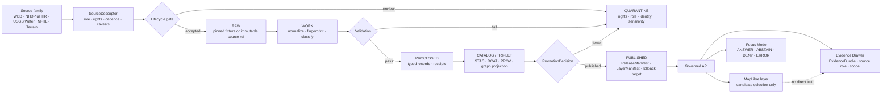

<!-- [KFM_META_BLOCK_V2]
doc_id: kfm://doc/TODO-VERIFY-UUID
title: Hydrology Domain Lane
type: standard
version: v1
status: draft
owners: TODO-VERIFY(hydrology-steward, docs-steward)
created: TODO-VERIFY(YYYY-MM-DD)
updated: TODO-VERIFY(YYYY-MM-DD)
policy_label: TODO-VERIFY(public|restricted)
related: [TODO-VERIFY:../README.md, TODO-VERIFY:../../README.md, TODO-VERIFY:../domains/hydrology/README.md, TODO-VERIFY:../../schemas/contracts/v1/hydrology/, TODO-VERIFY:../../data/registry/hydrology/sources/, TODO-VERIFY:../../policy/hydrology/, TODO-VERIFY:../../tests/]
tags: [kfm, hydrology, water, evidence, map-first, time-aware, readme]
notes: [Target path supplied by current task as docs/hydrology/README.md. Prior KFM materials also reference docs/domains/hydrology; path harmonization needs mounted-repo verification. Owner, doc_id, dates, policy label, and related links are placeholders until verified in the actual repository.]
[/KFM_META_BLOCK_V2] -->

<a id="top"></a>

# Hydrology Domain Lane

Governed orientation for KFM hydrology documentation, source intake, proof objects, map delivery, and evidence-bound water claims.

<p>
  
  
  
  
  
</p>

> [!IMPORTANT]
> **Impact block**
>
> | Field | Value |
> |---|---|
> | Status | `experimental` until the mounted repo confirms file homes, schemas, tests, workflows, and runtime behavior |
> | Owners | `TODO-VERIFY(hydrology-steward, docs-steward)` |
> | Target path | `docs/hydrology/README.md` |
> | Path caution | Prior KFM materials also mention `docs/domains/hydrology/`; resolve through repo inspection before link wiring |
> | Truth posture | Hydrology doctrine is strong; current implementation depth is **NEEDS VERIFICATION** |
> | Quick jumps | [Scope](#scope) · [Repo fit](#repo-fit) · [Inputs](#inputs) · [Exclusions](#exclusions) · [Directory tree](#directory-tree) · [Quickstart](#quickstart) · [Usage](#usage) · [Diagram](#diagram) · [Tables](#tables) · [Task list](#task-list--definition-of-done) · [FAQ](#faq) · [Appendix](#appendix) |

> [!NOTE]
> This README is not a generic water-data overview. It is a KFM control-plane landing page for a proof-bearing hydrology lane: source descriptors first, fixture-first validation, explicit source roles, EvidenceBundle resolution, governed API delivery, MapLibre layer manifests, visible negative outcomes, and rollback-aware publication.

---

## Scope

`docs/hydrology/` is the documentation home for KFM’s hydrology lane.

The lane’s job is to make water-related spatial claims inspectable. A hydrology claim should be able to answer:

- What source family supports this?
- What water object, station, watershed, event, derivative, or regulatory context is being referenced?
- What is the spatial scope, time basis, freshness state, and source role?
- What evidence bundle, catalog record, release manifest, and policy decision support public use?
- What should happen when identity is ambiguous, evidence is missing, or a source role is misused?

### Grounded lane posture

| Claim | Status | Handling |
|---|---:|---|
| Hydrology is the preferred first KFM proof lane | CONFIRMED doctrine | Use it to prove the governed path before broadening into more sensitive or speculative lanes |
| Current repo implementation exists at this path | UNKNOWN | Verify with a mounted checkout before claiming file presence, tests, workflows, routes, or emitted artifacts |
| Hydrology source descriptors, schemas, validators, fixtures, layer manifests, and Evidence Drawer payloads should exist | PROPOSED | Treat as PR-ready target surfaces, not current implementation proof |
| Live source connectors are safe as a first step | DENY by default | Start with source descriptors and pinned no-network fixtures before live fetches |

[Back to top](#top)

---

## Repo fit

### Path

`docs/hydrology/README.md`

### How this directory should fit

| Direction | Target | Status | Purpose |
|---|---|---:|---|
| Upstream | `../README.md` | TODO-VERIFY | Docs index or domain documentation hub |
| Upstream | `../../README.md` | TODO-VERIFY | Root repository orientation |
| Possible alternate home | `../domains/hydrology/README.md` | NEEDS VERIFICATION | Prior KFM materials reference this shape; do not silently fork both homes |
| Downstream | `ARCHITECTURE.md` | PROPOSED | Hydrology lane architecture, object families, and lifecycle rules |
| Downstream | `SOURCES.md` | PROPOSED | SourceDescriptor register for WBD/HUC12, NHDPlus HR, USGS Water Data, FEMA NFHL, terrain, and future source families |
| Downstream | `VALIDATION.md` | PROPOSED | Validators, fixtures, finite outcomes, and promotion checks |
| Downstream | `RUNBOOK.md` | PROPOSED | No-network proof slice, release assembly, correction, and rollback |
| Adjacent | `../../schemas/contracts/v1/hydrology/` | TODO-VERIFY | Proposed machine-contract home if repo convention confirms `schemas/contracts/v1/` |
| Adjacent | `../../data/registry/hydrology/sources/` | TODO-VERIFY | Proposed source descriptor registry |
| Adjacent | `../../policy/hydrology/` | TODO-VERIFY | Proposed policy gates and reason-code tests |
| Adjacent | `../../tests/` | TODO-VERIFY | Contract, validator, runtime-proof, and regression tests |

> [!WARNING]
> Do not create both `docs/hydrology/` and `docs/domains/hydrology/` as competing authorities. If both paths exist or are planned, add an ADR and choose one canonical documentation home with redirects, aliases, or migration notes.

[Back to top](#top)

---

## Inputs

Accepted inputs belong here when they help document, verify, or review hydrology evidence without bypassing KFM lifecycle controls.

| Input family | Belongs here when it includes | Minimum posture |
|---|---|---|
| SourceDescriptor notes | source owner, role, rights, access method, cadence, spatial/temporal support, caveats, citation text | Descriptor-first; live activation reviewed separately |
| WBD / HUC watershed material | HUC level, HUC12 preference, geometry fingerprint method, hierarchy, source version, watershed scope | Boundary/context evidence; not a streamflow observation |
| NHDPlus HR identity material | Permanent Identifier, legacy COMID support, relationship type, reachcode/HUC context, split/merge/no-match handling | Governed identity bridge; ambiguous joins return `ABSTAIN` |
| USGS Water observations | station/site ID, variable/parameter, timestamp, unit, qualifier, provisional/no-data state, retrieval receipt | Observation/time-series evidence with qualifiers preserved |
| FEMA NFHL flood material | flood zone or regulatory layer fields, source role, effective/issue context | `regulatory_context`; not observed inundation |
| Terrain-derived hydrology | DEM source, CRS/datum, algorithm, flow direction/accumulation candidates, derivative manifest | Derived analytic support; never canonical observation |
| Catalog/provenance records | STAC/DCAT/PROV closure, artifact IDs, digests, source roles, release ties | Discovery and provenance support; not proof alone |
| UI trust payload notes | Evidence Drawer payload, Focus outcome examples, layer manifest fields, trust badges, negative states | Browser receives governed payloads only |
| Review and rollback notes | PromotionDecision, CorrectionNotice, rollback reference, withdrawn/replaced status | Governed state transition, not a file move |

### Accepted examples

```yaml
# illustrative only — validate against repo schemas before use
source_family: usgs_water_data
source_role: observation_time_series
public_release_intent: candidate
evidence_requirements:
  - source_descriptor
  - retrieval_receipt
  - normalized_observation_fixture
  - evidence_bundle
  - catalog_closure
visible_negative_states:
  - ABSTAIN_MISSING_BASELINE
  - DENY_UNRELEASED_ARTIFACT
  - ERROR_MALFORMED_SUPPORT_OBJECT
```

[Back to top](#top)

---

## Exclusions

The hydrology lane must not become a dumping ground for every water-adjacent artifact.

| Excluded item | Why it is excluded | Route it to |
|---|---|---|
| Raw downloaded source dumps without descriptors | Source role, rights, cadence, and caveats are not yet governable | `RAW` intake path after SourceDescriptor review |
| Credentials, tokens, API keys, or private endpoint notes | Security-sensitive and not documentation-safe | Secret manager / deployment docs after security review |
| Live fetch code as the first proof step | Connector behavior can outrun rights, cadence, schema, and review | Fixture-first pipeline and source descriptor PR |
| Emergency instructions or life-safety alerting | KFM is not an emergency alert system | Official emergency sources; hazards lane may provide contextual, non-life-safety evidence |
| NFHL labeled as observed flooding | Regulatory flood context is not observed inundation | Keep as `flood_context`; observed flood events need separate evidence |
| Hydrologic simulation labeled as observation | Model output has calibration, uncertainty, and model-card burden | Experimental/model lane with explicit model metadata |
| Generic “water blob” schemas | Collapses surface water, groundwater, water quality, wetlands, flood context, observations, and derivatives | Lane-specific schemas and source-role checks |
| Map popups that invent claims from feature properties | Rendered properties are not evidence authority | Evidence Drawer via governed API |
| AI summaries without EvidenceBundle support | Generated text is interpretive only | Focus Mode with finite `ANSWER / ABSTAIN / DENY / ERROR` envelope |

[Back to top](#top)

---

## Directory tree

Directory shape is **NEEDS VERIFICATION** because no mounted repository tree was available during this drafting pass. The tree below is a proposed documentation landing shape for the requested path.

```text
docs/
└── hydrology/
    ├── README.md                  # this file
    ├── ARCHITECTURE.md            # PROPOSED: lane architecture and lifecycle responsibilities
    ├── SOURCES.md                 # PROPOSED: source descriptor register and source-role matrix
    ├── VALIDATION.md              # PROPOSED: validators, fixtures, outcomes, and gates
    ├── RUNBOOK.md                 # PROPOSED: no-network proof slice, release, correction, rollback
    ├── ADR-hydrology-doc-home.md  # PROPOSED: only if docs/hydrology vs docs/domains/hydrology conflicts
    └── examples/
        ├── evidence-drawer.md     # PROPOSED: public-safe drawer payload examples
        └── focus-outcomes.md      # PROPOSED: ANSWER / ABSTAIN / DENY / ERROR examples
```

> [!TIP]
> Keep this directory documentation-first. Machine contracts, policy, fixtures, receipts, proofs, and published artifacts should stay in their canonical homes once the repo convention is verified.

[Back to top](#top)

---

## Quickstart

### Safe inspection commands

Run these from the repository root after the actual KFM checkout is mounted. They do not fetch live sources, write artifacts, or publish anything.

```bash
# confirm checkout state
git status --short
git branch --show-current || true
git rev-parse --show-toplevel

# inspect the requested and historically referenced hydrology doc homes
find docs/hydrology -maxdepth 4 -type f 2>/dev/null | sort
find docs/domains/hydrology -maxdepth 4 -type f 2>/dev/null | sort

# inspect adjacent contract, policy, fixture, and test surfaces without assuming they exist
find schemas contracts policy data tools tests .github -maxdepth 4 -type f 2>/dev/null | sort | grep -Ei 'hydro|water|huc|nhd|comid|nfhl|wbd|evidence|release|receipt|drawer|focus' || true

# search before inventing names
grep -RIn \
  -e 'Hydrology' \
  -e 'HUC12' \
  -e 'WBD' \
  -e 'NHDPlus' \
  -e 'Permanent Identifier' \
  -e 'COMID' \
  -e 'USGS Water' \
  -e 'NFHL' \
  -e 'EvidenceBundle' \
  -e 'LayerManifest' \
  -e 'ABSTAIN' \
  -e 'DENY' \
  docs schemas contracts policy data tools tests apps packages 2>/dev/null || true
```

### No-network validation starter

```bash
# NEEDS VERIFICATION:
# Only enable after the checked-out branch proves these paths and dependencies.
pytest -q tests/contracts/hydrology 2>/dev/null || true
pytest -q tests/validators/hydrology 2>/dev/null || true
pytest -q tests/e2e/runtime_proof/hydrology 2>/dev/null || true
```

> [!CAUTION]
> Do not add live credentials, live source fetches, production writes, publication side effects, or unreviewed generated artifacts to the first hydrology quickstart.

[Back to top](#top)

---

## Usage

Use this README as the first stop when adding, reviewing, or correcting hydrology-lane work.

### Add a hydrology source family

1. Write or update a `SourceDescriptor`.
2. Add one valid fixture and one invalid fixture.
3. Preserve source role, rights, cadence, spatial support, temporal support, citation text, and known caveats.
4. Add a validator that can fail closed before connector code runs.
5. Keep live activation out of scope until source terms, endpoint behavior, and repo conventions are verified.

### Add a hydrology claim or public layer

1. Start from a released or release-candidate artifact, not a raw source capture.
2. Resolve `EvidenceRef → EvidenceBundle`.
3. Carry source role, time basis, spatial support, freshness, policy state, review state, and correction lineage.
4. Emit or reference catalog/provenance closure.
5. Publish only through a governed API, release alias, layer manifest, and rollback target.

### Add an identity crosswalk

1. Prefer current stable identifiers where available.
2. Treat legacy COMID support as compatibility, not authority.
3. Version the crosswalk.
4. Classify exact, split, merge, retired, and no-match relationships.
5. Return `ABSTAIN` unless geometry, reachcode, HUC context, or reviewed evidence resolves ambiguity.

### Add a Focus Mode answer

1. Bound the question by place, time, release, and evidence pool.
2. Validate citations before answer release.
3. Return `ANSWER`, `ABSTAIN`, `DENY`, or `ERROR`; do not emit free-form model authority.
4. Link back to the Evidence Drawer and audit reference.

[Back to top](#top)

---

## Diagram



> [!IMPORTANT]
> MapLibre can select a candidate feature and render released artifacts. It must not decide what is true, safe, public, reviewed, cited, or released.

[Back to top](#top)

---

## Tables

### Source-role matrix

| Source family | KFM role | Preserve | Must not claim |
|---|---|---|---|
| WBD / HUC12 | Watershed boundary and hydrologic unit context | hierarchy, HUC code, geometry fingerprint, source version, spatial support | streamflow, observed flooding, water quality, or regulatory determination |
| NHDPlus HR | Hydrography network and identity context | Permanent Identifier, network relation, reach context, crosswalk provenance | silent COMID equivalence, unreviewed split/merge resolution |
| USGS Water Data | Observation/time-series support | station/site, variable, timestamp, units, qualifiers, provisional/no-data states | regulatory flood zone, permanent waterbody identity, unqualified “truth” after stale data |
| FEMA NFHL | Regulatory flood context | flood zone fields, effective context, source role, release basis | observed inundation or event evidence |
| Terrain / DEM derivatives | Derived analytic support | source DEM, CRS/datum, algorithm, transform receipt, uncertainty/caveat | observation, regulatory context, or canonical hydrologic truth |
| Observed flood event evidence | Event-specific evidence | event date/time, source type, confidence, correction lineage | NFHL-style regulatory generalization |

### Object families to keep visible

| Object family | Role | Hydrology note |
|---|---|---|
| `SourceDescriptor` | Defines source identity, role, rights, access, cadence, and caveats | Required before connector activation |
| `EvidenceRef` / `EvidenceBundle` | Resolves support for a claim context | Outranks generated text and rendered properties |
| `RunReceipt` / `TransformReceipt` | Records process memory | Not proof by itself |
| `DecisionEnvelope` / `RuntimeResponseEnvelope` | Makes outcomes finite and inspectable | `ANSWER`, `ABSTAIN`, `DENY`, `ERROR` |
| `CatalogMatrix` | Checks catalog/provenance closure | Discovery and provenance must align to artifact identity |
| `LayerManifest` | Governs public layer delivery | Tiles and styles are derived surfaces |
| `ReleaseManifest` | Defines outward release state | Public routes read release aliases, not work products |
| `PromotionDecision` | Records gated release decision | Promotion is a state transition, not a file move |
| `CorrectionNotice` / `RollbackReference` | Preserves corrigibility | Hydrology corrections must remain user-visible where public claims changed |

### Negative-state examples

| Situation | Expected outcome | Reason |
|---|---|---|
| HUC12 fixture lacks deterministic geometry fingerprint | `ERROR` or validation failure | Artifact identity cannot be trusted |
| COMID maps to multiple Permanent Identifiers without disambiguation | `ABSTAIN` | Identity support is ambiguous |
| NFHL is requested as observed flood evidence | `DENY` | Source role misuse |
| USGS Water observation has provisional or no-data qualifier | `ANSWER` only with qualifier visible, otherwise `ABSTAIN` | Observation caveat cannot be hidden |
| Layer has no release manifest or unknown rights | `DENY` | Public delivery state is not proven |
| Evidence resolver fails | `ERROR` | Do not substitute raw feature properties |

[Back to top](#top)

---

## Task list — definition of done

A hydrology change is not ready for publication until the relevant gates pass.

- [ ] Target documentation home verified: `docs/hydrology/` versus `docs/domains/hydrology/`.
- [ ] `SourceDescriptor` exists for every admitted source family.
- [ ] Rights, source role, cadence, citation text, spatial support, temporal support, and caveats are explicit.
- [ ] No-network valid and invalid fixtures exist before live connector activation.
- [ ] HUC12 geometry/content fingerprinting is deterministic.
- [ ] NHDPlus HR identity crosswalk handles split, merge, retired, no-match, and ambiguous cases.
- [ ] Ambiguous hydrologic identity returns `ABSTAIN`.
- [ ] NFHL regulatory context cannot be promoted as observed flooding.
- [ ] USGS Water observation qualifiers, provisional state, and no-data state remain visible.
- [ ] Catalog/provenance closure aligns STAC/DCAT/PROV, artifact digest, source role, and release identity.
- [ ] EvidenceBundle resolves every consequential public claim.
- [ ] LayerManifest carries trust badges, freshness, source refs, artifact digest, release ID, and rollback target.
- [ ] Public clients use governed APIs and released artifacts only.
- [ ] MapLibre never reads `RAW`, `WORK`, `QUARANTINE`, canonical stores, proof packs, review-only stores, or direct model runtimes.
- [ ] Focus Mode returns finite outcomes and validated citations.
- [ ] Correction and rollback path is documented and tested.
- [ ] Documentation updates land with behavior changes or explicitly explain why docs did not change.

[Back to top](#top)

---

## FAQ

### Why is hydrology the first proof lane?

Hydrology is public-facing, place-rich, time-aware, source-rich, analytically legible, and well suited to evidence drill-through. It also forces KFM to prove the hard parts: source descriptors, identity crosswalks, observations, catalog closure, map delivery, Evidence Drawer payloads, Focus outcomes, correction, and rollback.

### Is WBD/HUC12 the same as a streamflow observation?

No. WBD/HUC12 is watershed boundary and hydrologic-unit context. Streamflow observations belong to observation/time-series sources such as USGS Water Data and must preserve station, variable, timestamp, units, qualifiers, and freshness.

### Is FEMA NFHL observed flood evidence?

No. NFHL belongs to regulatory flood context unless separate event evidence supports observed inundation.

### Can a map popup summarize the claim?

Only lightly. Popups may provide affordance or a non-authoritative preview. Consequential claims should resolve through governed API into an Evidence Drawer payload.

### Can AI explain hydrology results?

Yes, as an interpretive layer inside Focus Mode. It must use released, policy-safe EvidenceBundles and finite outcomes. Generated text must not outrank evidence, policy, release, or review state.

[Back to top](#top)

---

## Appendix

<details>
<summary>Truth labels used in this README</summary>

| Label | Meaning here |
|---|---|
| CONFIRMED | Verified from attached KFM doctrine or current workspace inspection |
| INFERRED | Reasonable from source convergence but not directly implemented evidence |
| PROPOSED | Recommended design, doc, schema, validator, or workflow not verified in a mounted repo |
| UNKNOWN | Not verifiable without the real repository, tests, workflows, logs, dashboards, or emitted artifacts |
| NEEDS VERIFICATION | Specific check required before treating a value, path, source, owner, or integration as current fact |
| DENY / ABSTAIN / ERROR | Finite negative outcomes used to keep trust failures visible |

</details>

<details>
<summary>Hydrology terms that must stay distinct</summary>

- `watershed_boundary`: boundary/context, often WBD/HUC based.
- `hydrography_network`: stream, river, waterbody, and connectivity context.
- `identity_crosswalk`: versioned reconciliation between identifiers such as Permanent Identifier and legacy COMID.
- `observation_time_series`: measured or reported observations with timestamp, unit, qualifier, and freshness.
- `regulatory_context`: legal or regulatory layer context, such as NFHL.
- `observed_event`: event-specific evidence, such as observed flood extent or flood report.
- `terrain_derivative`: output derived from DEMs and algorithms, not observation.
- `simulation_output`: model output requiring model card, calibration, uncertainty, and validation burden.

</details>

<details>
<summary>Open verification backlog</summary>

| Item | Why it remains open |
|---|---|
| Actual path for this README | Target path is supplied by task, but prior materials reference another hydrology docs home |
| Owner field | No mounted CODEOWNERS or repo stewardship file was available |
| Policy label | No mounted policy registry was available |
| Schema home | `contracts/` versus `schemas/contracts/v1/` remains repo-convention dependent |
| Package manager and test runner | No mounted package files or workflow YAML were available |
| OPA / Conftest / signing tools | Tooling and security pins need live repo or CI evidence |
| Official source terms and endpoint behavior | Source behavior, rights, cadence, headers, and quotas can change |
| UI binding | MapLibre shell, Evidence Drawer, and Focus Mode implementation are doctrine/proposed until app code is inspected |
| Runtime routes | Governed API framework, DTO names, and route names are unknown |
| Release proof | No emitted proof pack, release manifest, or rollback drill was inspected |

</details>

[Back to top](#top)
