<!-- [KFM_META_BLOCK_V2]
doc_id: kfm://doc/hydrology-map-ui-contracts-v1
title: Hydrology — Map UI Contracts
type: standard
version: v1
status: draft
owners: <hydrology lane steward> · <map shell owner> · <governance reviewer>
created: 2026-05-18
updated: 2026-05-18
policy_label: public
related:
  - kfm://doc/directory-rules
  - kfm://doc/maplibre-master-atlas
  - kfm://doc/whole-ui-governed-ai-expansion
  - kfm://doc/domains-culmination-atlas-v1.1
  - kfm://doc/kfm-encyclopedia-v0.1
tags: [kfm, hydrology, map, ui, contracts, governed-api, evidence, layer-manifest]
notes:
  - All implementation-layer paths (schema URIs, routes, repo locations) are PROPOSED pending mounted-repo verification.
  - Trust-state vocabulary follows `KFM-IDX-MAP-005` (PROPOSED five-state enum).
  - NFHL role-separation is a CONFIRMED doctrinal invariant for this domain.
[/KFM_META_BLOCK_V2] -->

# Hydrology — Map UI Contracts

> The contract surface between the Hydrology lane and the public Map UI: which objects cross the trust membrane, in which shape, with which outcomes, and under which guards.

<!-- Badges: replace TODO targets when CI, schema-home, and release routes are verified in a mounted repo. -->
[]()
[]()
[]()
[]()
[]()
[]()
[]()

**Status:** `draft`  ·  **Owners:** *hydrology lane steward · map shell owner · governance reviewer* (placeholder, NEEDS VERIFICATION)  ·  **Last updated:** `2026-05-18`

---

## Mini‑TOC

1. [Purpose & scope](#1-purpose--scope)
2. [Position in KFM doctrine](#2-position-in-kfm-doctrine)
3. [Contract surface — at a glance](#3-contract-surface--at-a-glance)
4. [Object families crossing the membrane](#4-object-families-crossing-the-membrane)
5. [Hydrology `LayerManifest` profile](#5-hydrology-layermanifest-profile)
6. [Hydrology `StyleManifest` profile](#6-hydrology-stylemanifest-profile)
7. [Hydrology `EvidenceDrawerPayload` projection](#7-hydrology-evidencedrawerpayload-projection)
8. [`MapContextEnvelope` for hydrology](#8-mapcontextenvelope-for-hydrology)
9. [Focus Mode behavior in hydrology context](#9-focus-mode-behavior-in-hydrology-context)
10. [Trust-state vocabulary](#10-trust-state-vocabulary)
11. [Source-role separation (the NFHL invariant)](#11-source-role-separation-the-nfhl-invariant)
12. [Freshness, staleness, and the gauge timeline](#12-freshness-staleness-and-the-gauge-timeline)
13. [Finite outcomes per surface](#13-finite-outcomes-per-surface)
14. [Validators & tests](#14-validators--tests)
15. [Anti-patterns](#15-anti-patterns)
16. [Open questions & verification backlog](#16-open-questions--verification-backlog)
17. [Related docs](#17-related-docs)

[Back to top](#hydrology--map-ui-contracts)

---

## 1. Purpose & scope

**CONFIRMED doctrine / PROPOSED implementation.** This document specifies the **map-UI-facing contract surface** for the Hydrology lane: which Hydrology objects may appear in the public map shell, in what shape they appear, what outcomes the governed API may return for them, what the renderer is permitted to do with them, and what guards prevent misuse. It is a **profile** that specializes the cross-cutting MapLibre object families — `LayerManifest`, `StyleManifest`, `TileArtifactManifest`, `MapReleaseManifest`, `EvidenceDrawerPayload`, `MapContextEnvelope`, `FocusModeRequest/Response`, `AIReceipt`, `CitationValidationReport`, `PolicyDecision` — for the Hydrology lane.

It is **not**:

- A connector or pipeline specification (see hydrology pipeline specs).
- A schema home (schemas live under `schemas/contracts/v1/...`; PROPOSED).
- A release manifest (release decisions live under `release/`).
- A policy authority (policy decisions live under `policy/domains/hydrology/`).

### Scope summary

| In scope | Out of scope |
|---|---|
| What hydrology objects may surface in the map UI | How hydrology objects are ingested or normalized |
| Shape of UI-bound DTOs (profile of cross-cutting families) | Field-level schema definitions (live in `schemas/`) |
| Outcomes the governed API may return | Backend implementation of those routes |
| Trust-state vocabulary applied to hydrology layers | Renderer code in `packages/maplibre/` |
| Source-role separation rules at the UI boundary | Source rights and licensing (live in `policy/sensitivity/`) |

[Back to top](#hydrology--map-ui-contracts)

---

## 2. Position in KFM doctrine

> [!IMPORTANT]
> **CONFIRMED doctrinal invariant.** The map renderer is **downstream** of trust. MapLibre, tiles, popups, and badges are **carriers**, never **authorities**. Anything the map shows must trace, via governed API, to an `EvidenceBundle`, a `LayerManifest`, and a `MapReleaseManifest` — or else it must be rendered in an explicit `denied`, `bounded`, or `narrowed` state.

The Hydrology Map UI Contract sits at the intersection of four invariants:

```mermaid
flowchart LR
    subgraph TRUST[Trust spine -CONFIRMED doctrine-]
        EB[EvidenceBundle]
        SD[SourceDescriptor]
        LM[LayerManifest]
        MRM[MapReleaseManifest]
        PD[PolicyDecision]
    end

    subgraph LANE[Hydrology lane -PROPOSED implementation-]
        HUC[HUC / Watershed]
        REACH[HydroFeature / Reach]
        GAUGE[GaugeSite + FlowObservation]
        NFHL[NFHLZone -regulatory context-]
        FLOOD[Observed Flood Event]
    end

    subgraph MEMBRANE[Governed API -PROPOSED routes-]
        FEAT[/features/]
        EVR[/evidence/]
        LMR[/layers/manifest/]
        FOC[/focus/]
    end

    subgraph UI[Map UI -apps/explorer-web/-]
        SHELL[Map shell + time strip]
        DRAW[Evidence Drawer]
        FOCUS[Focus Mode panel]
    end

    LANE --> TRUST
    TRUST --> MEMBRANE
    MEMBRANE --> UI
    UI -. click / focus request .-> MEMBRANE
    MEMBRANE -. ANSWER / ABSTAIN / DENY / ERROR .-> UI
```



> [!NOTE]
> **Truth label.** The trust spine and invariants are **CONFIRMED doctrine**. The hydrology lane, governed-API routes, and UI components shown are **PROPOSED implementation** until checked against a mounted repository.

[Back to top](#hydrology--map-ui-contracts)

---

## 3. Contract surface — at a glance

The hydrology map UI exchanges five **kinds** of payloads across the membrane. Each payload is a profile of a cross-cutting family.

| Direction | Trigger | Inbound payload (UI → API) | Outbound payload (API → UI) | Outcomes |
|---|---|---|---|---|
| Bootstrap | Map shell load | `MapContextEnvelope` (initial) | `LayerCatalogItem[]` (hydrology subset) + `LayerManifest` refs | `ANSWER` / `DENY` / `ERROR` |
| Layer load | Layer toggle | `layer_id` + `release_id?` | `LayerManifest` + `StyleManifest` ref + `TileArtifactManifest` ref | `ANSWER` / `DENY` / `ERROR` |
| Feature click | Pointer / keyboard select | `feature_id` + `layer_id` + `MapContextEnvelope` | `EvidenceDrawerPayload` (hydrology projection) | `ANSWER` / `ABSTAIN` / `DENY` / `ERROR` |
| Timeline change | Time slider | `MapContextEnvelope` (with `time_window`) | New `LayerManifest` snapshot refs + stale/degraded flags | `ANSWER` / `DENY` / `ERROR` |
| Focus Mode | User question | `FocusModeRequest` + `MapContextEnvelope` | `FocusModeResponse` + `AIReceipt` + `CitationValidationReport` | `ANSWER` / `ABSTAIN` / `DENY` / `ERROR` |

> [!CAUTION]
> The renderer **MUST NOT** call canonical stores (`data/processed/`, `data/catalog/`, `data/published/` raw paths) directly. The only browser network paths permitted for trust-bearing content are the governed API routes named above. This is `KFM-IDX-API-001` (CONFIRMED).

[Back to top](#hydrology--map-ui-contracts)

---

## 4. Object families crossing the membrane

The Hydrology lane uses the cross-cutting Map UI object families. Below is the **profile binding** — which hydrology object identities and which fields participate in each family.

| Cross-cutting family | Hydrology profile (PROPOSED) | Bound hydrology objects |
|---|---|---|
| `SourceDescriptor` | One per hydrology source family. Carries `source_role` (authority / observation / context / model). | USGS WBD/HUC, NHDPlus HR / 3DHP, USGS Water Data / NWIS, FEMA NFHL/MSC, 3DEP terrain, water-quality programs, groundwater wells, historical flood evidence |
| `LayerManifest` | One per public-safe hydrology layer. Carries layer identity, source/evidence bindings, sensitivity label, attribution, trust state. | HUC12 watershed layer, NHDPlus flowline / catchment layer, gauge site point layer, NFHL regulatory zones layer (**context only**), observed-flood-event layer, terrain-derived hydrology context, water-quality / groundwater context layers |
| `StyleManifest` | One per released hydrology style set. Carries color ramps, output units, uncertainty cues, legends. | HUC12 boundary style, flow-magnitude ramp, gauge symbology with stale/degraded variants, NFHL regulatory style (visually distinct from observed inundation), trust-state badges |
| `TileArtifactManifest` | One per PMTiles / MVT / COG artifact serving a hydrology layer. Carries digest, spec_hash, byte-range manifest. | HUC12 PMTiles, flowline PMTiles, gauge points (GeoJSON or PMTiles), NFHL contextual tiles, optional terrain COG |
| `MapReleaseManifest` | Binds the hydrology layer set, style, and tile artifacts to a release decision, rollback target, and cache keys. | Hydrology release bundle (PROPOSED) |
| `EvidenceDrawerPayload` | Click-resolution payload that surfaces `EvidenceBundle` refs, source roles, valid time, review state, rights, sensitivity, correction links. | One projection variant per hydrology object family (HUC, reach, gauge, NFHL zone, observed flood, water-quality observation, groundwater well) |
| `MapContextEnvelope` | Map state envelope: camera, bounds, zoom, time window, visible layers, selected feature(s), version locks. | Same shape; carries hydrology layer ids and selected feature ids |
| `FocusModeRequest / Response` | Bounded AI surface over released Hydrology `EvidenceBundle`s. | Hydrology-scoped questions only; cite-or-abstain enforced |
| `AIReceipt` | Audit trail for any Focus Mode answer over hydrology evidence. | One per Focus call; never stores private reasoning |
| `CitationValidationReport` | Proof that every cited `EvidenceRef` resolves and is admissible. | One per Focus answer or governed export |
| `PolicyDecision` | Decision record gating layer admission, drawer payload composition, and Focus responses. | One per gate evaluation |

> [!NOTE]
> **Schema homes.** The schemas for the cross-cutting families above are **PROPOSED** to live under `schemas/contracts/v1/...` (e.g., `schemas/contracts/v1/layers/layer_manifest.schema.json`, `schemas/contracts/v1/ui/evidence_drawer_payload.schema.json`). The Hydrology lane does **not** maintain a parallel schema home — only domain fixtures and lane documentation. See `directory-rules.md` §13.4 (CONFIRMED).

[Back to top](#hydrology--map-ui-contracts)

---

## 5. Hydrology `LayerManifest` profile

**Authority:** `LayerManifest` is owned by the cross-cutting Map family; the Hydrology lane supplies a **profile** — required fields, allowed values, and admission rules.

### 5.1 Required fields (PROPOSED profile)

| Field | Hydrology profile rule | Source authority |
|---|---|---|
| `layer_id` | Stable, lane-prefixed (PROPOSED convention: `hydrology.<object>.<source_family>.<vintage>`). | this profile |
| `title` | Human-readable; must distinguish **regulatory** vs **observed** vs **model-derived** layers verbatim. | NFHL invariant (§11) |
| `geometry_type` | Polygon (HUC, NFHL), line (flowline/reach), point (gauge, well), or raster (terrain-derived). | per object family |
| `source_id` | Must resolve to a registered `SourceDescriptor`. | source registry |
| `source_role` | One of `authority` / `observation` / `context` / `model`. **Must not be elided.** | DOM-HYD |
| `source_layer` | Tile/source layer name (PMTiles/MVT). | TileArtifactManifest |
| `evidence_ref_field` | Field on the tile feature carrying `EvidenceRef` (or a feature_id resolvable to one). | EvidenceDrawerPayload |
| `temporal_fields` | Names of source-time / valid-time / observed-time / retrieval-time / release-time fields. | time discipline |
| `policy_label` | `public` for HUC, flowlines, NFHL context, gauge points; `restricted` or `review` where applicable. | policy/domains/hydrology/ |
| `release_state` | One of `granted` / `narrowed` / `bounded` / `denied` / `candidate` (see §10). | KFM-IDX-MAP-005 |
| `attribution` | Source attribution string (e.g., USGS, FEMA), exposed to the UI. | rights doctrine |
| `release_id` | Foreign key to `MapReleaseManifest`. | release authority |

> [!IMPORTANT]
> The renderer **MUST** refuse to load a layer source URL that does not appear in a **released** `MapReleaseManifest`. This is `KFM-IDX-API-001` and the no-unreleased-tile-load test (PROPOSED test family).

### 5.2 Per-object admission rules

| Hydrology layer | `source_role` | Default `release_state` | Special admission rule |
|---|---|---|---|
| HUC12 watershed | `authority` | `granted` (when released) | Must carry HUC12 fingerprint (PROPOSED validation). |
| NHDPlus HR flowline / catchment | `authority` (with model lineage in VAAs) | `granted` (when released) | Identity ambiguity → `ABSTAIN` at drawer; do not render contested reach identity as canonical. |
| Gauge sites (USGS NWIS / new Water Data API) | `observation` | `granted` (when fresh); `bounded` (when stale-window applies) | Stale-source rule applies (§12). |
| `FlowObservation` time-series | `observation` | `bounded` (operational freshness limit) | Never implies emergency or live authority unless current-cadence verification is recorded. |
| NFHL regulatory zones | `authority` (**regulatory only**) | `granted` (when released) | **MUST** be styled and labeled distinctly from observed inundation. See §11. |
| Observed Flood Event | `observation` (historic) or `model` (reconstructed) | `granted` or `narrowed` (precision) | Never collapsed with NFHL regulatory layer. |
| 3DEP terrain-derived hydrology context | `model` | `granted` or `bounded` | Model lineage must be visible in drawer. |
| Water-quality / groundwater wells | `observation` | `granted` to `restricted` per source-family | Private-property and well-owner sensitivity is a gate. |

<details>
<summary><strong>PROPOSED <code>LayerManifest</code> illustrative shape (hydrology HUC12 layer)</strong></summary>

```json
{
  "$schema": "https://kfm.example/schemas/contracts/v1/layers/layer_manifest.schema.json",
  "layer_id": "hydrology.huc12.wbd.2023q4",
  "title": "WBD HUC12 Subwatersheds (Kansas)",
  "geometry_type": "polygon",
  "source_id": "src:usgs:wbd:huc12",
  "source_role": "authority",
  "source_layer": "huc12",
  "evidence_ref_field": "evidence_ref",
  "temporal_fields": {
    "source_time": "src_time",
    "valid_time": "valid_time",
    "release_time": "rel_time"
  },
  "policy_label": "public",
  "release_state": "granted",
  "attribution": "U.S. Geological Survey, Watershed Boundary Dataset",
  "release_id": "rel:hydrology:2026-05:001",
  "tile_artifact_ref": "tar:hydrology:huc12:pmtiles:<digest>",
  "style_ref": "sty:hydrology:base:v1",
  "sensitivity_label": "T0",
  "tags": ["hydrology", "watershed", "huc12"]
}
```

**Status:** PROPOSED illustrative. Field names trace to cross-cutting `LayerManifest` doctrine; exact field set requires the mounted-repo schema for confirmation.
</details>

[Back to top](#hydrology--map-ui-contracts)

---

## 6. Hydrology `StyleManifest` profile

The hydrology style set has two non-negotiables: **role-distinct styling** and **trust-state visibility**.

| Style concern | Hydrology profile rule | Rationale |
|---|---|---|
| Regulatory vs observed | NFHL zones MUST use a visually distinct palette/pattern from observed-flood-event layers; legends MUST name the source role. | NFHL invariant (CONFIRMED) |
| Flow magnitude | Ramps carry units (cfs / m³·s⁻¹) and uncertainty banding; styles document the ramp in the `StyleManifest`. | ML-M-107 (PROPOSED) |
| Gauge state | Fresh / stale / degraded / denied each render with a distinct, accessible symbol — not by hidden style filters. | KFM-IDX-MAP-005, trust-visible states |
| Sensitivity | Sensitive geometry MUST be **transformed** (generalized / redacted) upstream; styles MUST NOT be used as the only sensitivity mechanism. | ML-061-132, sensitive-geometry deny fixture (CONFIRMED policy) |
| Accessibility | Color choices meet WCAG contrast; legend text and badges have keyboard-reachable focus order and accessible names. | ML-064-091, ML-059-019 |
| Color, units, uncertainty, legend | Documented in `StyleManifest`, not inferred by the renderer. | ML-M-107 |

> [!WARNING]
> **Style filters are not a sensitivity control.** Hiding sensitive geometry behind a layout/paint expression is a recognized anti-pattern: the tile still ships the geometry and a curious client can read it. Sensitive transforms are upstream; style enforces visual discipline only.

[Back to top](#hydrology--map-ui-contracts)

---

## 7. Hydrology `EvidenceDrawerPayload` projection

When a user clicks (or keyboard-activates) a hydrology feature, the governed API returns an `EvidenceDrawerPayload` — the **drawer is the inspection surface**. Popups and badges do not substitute for it.

### 7.1 Minimum payload contract (PROPOSED profile)

| Field | Purpose | Hydrology-specific note |
|---|---|---|
| `feature_id` | Stable identifier for the clicked feature | Provider-based where possible (e.g., gauge `site_no`, HUC12 code, NHDPlus permanent identifier). |
| `layer_id` | The `LayerManifest` the feature belongs to | — |
| `evidence_bundle_refs` | One or more `EvidenceBundle` IDs | Always required for consequential claims. |
| `source_summary` | Source descriptor projection (name, role, authority, attribution) | Must distinguish authority / observation / context / model. |
| `citations` | Citations resolving to authoritative source records | Resolved by `CitationValidationReport`. |
| `policy_state` | `PolicyDecision` summary | Includes deny reason where applicable. |
| `release_state` | The trust state (see §10) | Drawer MUST visibly show this. |
| `valid_time` / `observed_time` / `source_time` / `retrieval_time` / `release_time` | Time fields kept distinct | Hydrology must not collapse these. |
| `limitations` | Plain-language caveats | E.g., "NFHL is regulatory; not observed inundation." |
| `correction_link` | URL for the correction path | Must always be present, even when no correction exists. |
| `transforms` | Generalization / redaction record (where applicable) | Required when sensitive geometry has been transformed. |

### 7.2 Per-object drawer notes

| Hydrology object | Required drawer content |
|---|---|
| HUC12 watershed | HUC code, area, parent HUC, source descriptor (WBD), valid time, attribution. |
| NHDPlus flowline / reach | Permanent identifier, VAAs *labeled as model-derived*, identity-ambiguity flag if present. |
| Gauge site | Site number, parameter list, freshness state, **non-emergency caveat** if hydrologic risk is implied. |
| `FlowObservation` time series | Provider, parameter, units, no-data qualifiers, observation time, retrieval time. |
| NFHL zone | DFIRM_ID, VERSION_ID, EFFECTIVE_DATE, zone code, **role label: regulatory context**, NFHL-not-observed warning. |
| Observed Flood Event | Event identity, source-role, geometry vintage, public-safe transform record. |
| Water-quality observation | Method, detection limits, qualifiers, provenance. |
| Groundwater well | Owner-sensitivity check, restricted-geometry transform record if applicable. |

> [!CAUTION]
> **Required denial.** Drawer composition MUST `DENY` direct exposure of `RAW` / `WORK` / `QUARANTINE` references or canonical-store paths, even via link. The drawer is a release-state-aware surface only.

[Back to top](#hydrology--map-ui-contracts)

---

## 8. `MapContextEnvelope` for hydrology

The `MapContextEnvelope` is the bounded scope sent to the governed API for clicks, timeline changes, and Focus Mode requests. The hydrology profile reuses the cross-cutting envelope without modification, with these usage notes:

- `visible_layers` MUST include only released hydrology layers (no candidate or watcher-only layers).
- `time_window` is the **valid-time** window the user selected, distinct from retrieval time. Snapshot resolution uses `LayerManifest` temporal metadata.
- `selected_features` carries hydrology feature ids resolvable through the drawer route.
- `evidence_refs` carries explicit `EvidenceRef`s when the click already resolved one; the API still re-resolves before answering.

> [!NOTE]
> **No raw features to model.** The envelope MUST NOT carry raw geometry payloads or unreleased model outputs. Its job is to bound scope, not to substitute for evidence.

[Back to top](#hydrology--map-ui-contracts)

---

## 9. Focus Mode behavior in hydrology context

Focus Mode is the **bounded AI surface** over released hydrology `EvidenceBundle`s. Its outputs are finite, cited, and policy-checked.

| Question shape | Permitted outcome | Required guards |
|---|---|---|
| "Summarize this gauge's last 7 days of flow." | `ANSWER` over released observation `EvidenceBundle`, with citations | Time-window admissibility; gauge release state. |
| "Compare HUC12 X and Y by historical record." | `ANSWER` if both released; otherwise `ABSTAIN` with reason | Both HUC12 fingerprints validate; evidence closure passes. |
| "Is this property in a flood zone?" | `ABSTAIN` (regulatory-context interpretation) **or** `DENY` (out of scope: property-level claim) | NFHL invariant; never collapse regulatory and observed. |
| "Should I evacuate?" | `DENY` with safety reason and external-authority redirect | Emergency-use boundary — KFM is not an emergency authority. |
| "What is the reach identity here?" | `ABSTAIN` if NHDPlus identity is ambiguous | NHDPlus HR identity ambiguity tests (PROPOSED). |
| Any question lacking released evidence | `ABSTAIN` | Cite-or-abstain. |

> [!IMPORTANT]
> **Absolute prohibitions for Focus Mode in hydrology context** (CONFIRMED doctrine):
> - MUST NOT replace emergency alerting or official forecasts.
> - MUST NOT present NFHL regulatory zones as observed inundation or forecast.
> - MUST NOT answer uncited; if `CitationValidationReport` fails, `ABSTAIN`.
> - MUST NOT call a model runtime directly from the browser.

Every Focus call MUST emit an `AIReceipt` (provider, model, context, evidence refs, citation report id, finite outcome) and a `CitationValidationReport`.

[Back to top](#hydrology--map-ui-contracts)

---

## 10. Trust-state vocabulary

**Status.** The five-state enum is **PROPOSED** (`KFM-IDX-MAP-005`, CONFIRMED doctrine, PROPOSED implementation). Hydrology applies it as follows:

| State | When a hydrology layer is in this state | Renderer behavior | Drawer behavior |
|---|---|---|---|
| `granted` | Layer released, fresh, all gates passed. | Render normally. | Full drawer payload. |
| `narrowed` | Geometry generalized, attributes restricted, or coverage subset for sensitivity (e.g., restricted-geometry groundwater wells). | Render with narrowed-state indicator. | Drawer explains the transform; `transforms` field populated. |
| `bounded` | Confidence or freshness limit applies (e.g., stale gauge data still within tolerance; modeled flow with uncertainty band). | Render with bounded-state indicator. | Drawer explains limits, including `valid_time` boundary. |
| `denied` | Rights / sensitivity / release / review gate fails. | Either layer absent or denied-state placeholder. | Drawer returns `DENY` with reason code; no feature payload. |
| `candidate` | Watcher emitted; not yet promoted. | **MUST NOT** render in public path. | n/a (not a public surface). |

> [!TIP]
> Mixed-trust-state scenes are an **open question** (`KFM-IDX-MAP-005`). Until an ADR settles composition rules, the recommended posture is **worst-state-per-frame** for hydrology scenes that mix layers, with per-layer indicators in the legend.

[Back to top](#hydrology--map-ui-contracts)

---

## 11. Source-role separation (the NFHL invariant)

> [!WARNING]
> **CONFIRMED doctrine / non-negotiable.** NFHL regulatory flood zones are **regulatory context**, not observed inundation, not forecasts, not real-time hydraulic model output. The Hydrology lane MUST keep these source roles separated at every surface — schema, layer, style, drawer, Focus answer, citation, and policy decision. NFHL-as-observed-flood is a recognized DENY case.

| Source role | Hydrology objects | UI guarantees |
|---|---|---|
| `authority` (regulatory) | NFHL zones, WBD HUC | Distinct style; legends say *regulatory*; drawer says *regulatory*. |
| `authority` (network identity) | NHDPlus HR / 3DHP | VAAs labeled as model-derived; identity ambiguity → `ABSTAIN`. |
| `observation` | USGS gauge sites + `FlowObservation`, water-quality observations, groundwater wells, historical observed flood evidence | Time fields exposed; freshness state visible; never implies emergency authority. |
| `context` | Terrain-derived hydrology context (3DEP) | Drawer marks as derived; lineage visible. |
| `model` | Reconstructed flood evidence, hydraulic-model derivatives | Lineage visible; uncertainty banded in style; renderer must not present as observed. |

### 11.1 Collapsing failure modes

| Collapse | Why it fails | Required outcome |
|---|---|---|
| NFHL → observed inundation | Confuses regulatory determination with hydrologic event | `DENY` at drawer composition; `ABSTAIN` at Focus. |
| NFHL → forecast | Confuses regulation with prediction | `DENY` at drawer composition. |
| Gauge observation → emergency authority | KFM is not an emergency authority | `DENY` at Focus with redirect to official source. |
| NHDPlus model VAAs → observation | Confuses derived value with observed measurement | `ABSTAIN`; drawer labels model lineage. |

[Back to top](#hydrology--map-ui-contracts)

---

## 12. Freshness, staleness, and the gauge timeline

Hydrology observations are **operationally current** but the map UI is not an emergency-grade surface. The contract:

- Every gauge-bound layer has a **declared cadence** in the `SourceDescriptor`.
- The `LayerManifest` carries the **stale window** beyond which `release_state` shifts from `granted` to `bounded` (visible stale badge) and then to `denied` (no public claim).
- The timeline shows **source time** vs **valid time** vs **retrieval time** vs **release time** distinctly.
- A no-change (304 / no-update) poll does **not** mint a new catalog entry or invalidate caches (ML-062-020, CONFIRMED evidence / PROPOSED implementation).
- Stale state and degraded state are **separate** from denied state in the UI.

> [!NOTE]
> The exact freshness thresholds for KFM hydrology are **NEEDS VERIFICATION**. The hydrology source roles (USGS Water Data / NWIS, NFHL, etc.) have their own cadences; KFM's stale-window policy must be set per source-family and recorded in `SourceDescriptor` + `LayerManifest`.

[Back to top](#hydrology--map-ui-contracts)

---

## 13. Finite outcomes per surface

Every governed surface in this contract returns a finite outcome from `{ ANSWER, ABSTAIN, DENY, ERROR }` (plus `HOLD` for surfaces that pause for review). The mapping for hydrology:

| Surface | Outcomes | Forbidden behavior |
|---|---|---|
| Layer manifest resolver (per layer) | `ANSWER` / `DENY` / `ERROR` | Returning a layer without a `MapReleaseManifest`; serving `WORK` / `CATALOG` layers to the public path. |
| Hydrology feature / detail resolver | `ANSWER` / `ABSTAIN` / `DENY` / `ERROR` | Returning unreleased candidate features as `ANSWER`; exposing internal store identifiers; returning raw source bytes. |
| Evidence Drawer payload resolver | `ANSWER` / `ABSTAIN` / `DENY` / `ERROR` | Drawer payload without resolved `EvidenceBundle`; drawer that fronts an unreleased candidate. |
| Focus Mode (hydrology context) | `ANSWER` / `ABSTAIN` / `DENY` / `ERROR` | Uncited answers; safety/emergency advisory; collapsing NFHL with observed. |
| Correction submit (hydrology surface) | `ACCEPTED` / `DENY` / `ERROR` | Silent acceptance without review state. |
| Review queue (when applicable) | `ALLOW` / `RESTRICT` / `DENY` / `HOLD` / `ERROR` | Promotion without separation of duties for sensitive sub-domains. |

[Back to top](#hydrology--map-ui-contracts)

---

## 14. Validators & tests

The following test families apply to this contract. Status reflects the cross-cutting Map UI plan as it applies to hydrology; all are **PROPOSED** until mounted-repo evidence confirms implementation.

| Test family | Hydrology specialization | Status |
|---|---|---|
| Schema validation | Validate `LayerManifest`, `StyleManifest`, `TileArtifactManifest`, `MapReleaseManifest`, `EvidenceDrawerPayload`, `MapContextEnvelope`, `FocusModeRequest/Response`, `AIReceipt`, `CitationValidationReport`, `PolicyDecision` against hydrology fixtures. | PROPOSED |
| HUC12 fingerprint validation | One HUC12 fixture; geometry fingerprint regression. | PROPOSED |
| NHDPlus HR identity ambiguity | Force-ambiguity fixture; assert `ABSTAIN` at drawer / Focus. | PROPOSED |
| USGS Water Data normalization | Parameter / unit / qualifier / no-data tests over the gauge fixture. | PROPOSED |
| NFHL role-separation | Negative case: NFHL feature marketed as observed → `DENY`. | PROPOSED |
| EvidenceBundle closure | Click resolves to a bundle; missing bundle → `ABSTAIN`. | PROPOSED |
| No public raw path | Browser cannot reach `RAW` / `WORK` / `QUARANTINE` / internal store. | PROPOSED |
| No unreleased tile load | Layer source URL appears in a released `MapReleaseManifest`. | PROPOSED |
| Stale source badge / abstain | Gauge cadence exceeded → `bounded` state with badge; further → `denied`. | PROPOSED |
| Sensitive geometry deny | Style-only hiding insufficient; transforms required upstream. | PROPOSED |
| Citation validation | Focus answers cite resolvable `EvidenceRef`s or `ABSTAIN`. | PROPOSED |
| Focus Mode finite outcomes | `ANSWER` / `ABSTAIN` / `DENY` / `ERROR` over fixture answers. | PROPOSED |
| No-network hydrology proof fixture | End-to-end PR-safe test: HUC12 + one gauge + one NFHL context + one EvidenceBundle + one layer manifest + drawer payload. | PROPOSED |
| Rollback drill | A hydrology release manifest has a documented rollback target; replay restores prior state. | PROPOSED |
| Accessibility / a11y | Keyboard navigation, color contrast, alt text for legend and badges, screen-reader labels on trust-state indicators. | PROPOSED |
| Tile load budget / resource timing | p95 tile fetch within the declared SLO; cache invalidation on rollback. | PROPOSED |

[Back to top](#hydrology--map-ui-contracts)

---

## 15. Anti-patterns

> [!CAUTION]
> Each of the following is a recognized failure mode. The Hydrology lane MUST guard against them at the UI contract surface.

| Anti-pattern | Why it fails | Required fix |
|---|---|---|
| Treating MapLibre, tiles, screenshots, or AI answers as sovereign truth | Renderer is downstream of trust. | Drawer + Focus Mode + governed routes. |
| Using popups in place of the Evidence Drawer | Popups cannot carry the full evidence + policy + release context. | Click resolves through governed API; drawer is the inspection surface. |
| Using badges as proof | A badge is a UI annotation; it does not replace receipts. | Badges link into drawer / receipt artifacts; never substitute for them. |
| Style-only sensitivity (paint/layout filters hiding geometry) | Tile still carries the geometry. | Upstream transforms in `data/processed/` and `data/published/`; receipts in `data/receipts/`. |
| Collapsing NFHL with observed flood | Regulatory context ≠ event evidence. | Source-role separation invariant (§11). |
| Implying emergency or live authority from a hydrology layer | KFM is not an emergency authority. | Non-emergency caveats; `DENY` at Focus; redirect to official sources. |
| Letting a candidate (watcher-emitted) layer appear in the public path | Watcher-as-non-publisher invariant. | Candidate stays out of public; only released enters the map. |
| Direct `addSource` on unverified PMTiles | Bypasses release & integrity gates. | Tile artifacts must appear in the released `MapReleaseManifest` and pass digest / sidecar checks. |
| Pretending docs are the authority | Docs explain; ADRs decide. | Promote authority claims to ADR / `control_plane/`. |

[Back to top](#hydrology--map-ui-contracts)

---

## 16. Open questions & verification backlog

| Item | What would settle it | Status |
|---|---|---|
| Exact governed-API routes for hydrology (feature, evidence, layer manifest, focus) | Mounted-repo `apps/governed-api/src/routes/*` and OpenAPI fixture. | NEEDS VERIFICATION |
| Schema home for `LayerManifest` / `StyleManifest` / `TileArtifactManifest` / `MapReleaseManifest` / `EvidenceDrawerPayload` / `MapContextEnvelope` | `schemas/contracts/v1/...` files in a mounted repo. | NEEDS VERIFICATION |
| Hydrology source-family freshness thresholds (USGS Water Data API / NWIS, NFHL, NHDPlus HR vintages) | `SourceDescriptor` + `LayerManifest` cadence fields in fixtures. | NEEDS VERIFICATION |
| Mixed-trust-state scene composition rule (worst-state vs per-layer indicator vs composite) | An accepted ADR (referenced from `KFM-IDX-MAP-005`). | OPEN |
| Layer naming convention (`hydrology.<object>.<source_family>.<vintage>`) | Confirmed in the source-registry / control-plane register. | PROPOSED |
| Provider-based `feature_id` rules for gauges and HUCs (deterministic identity vs site_no / HUC code) | ADR + fixture. | PROPOSED |
| Stale-window thresholds per source family | Policy register + `SourceDescriptor` cadence + `LayerManifest` stale-window. | NEEDS VERIFICATION |
| Trust-state badge semantics in the legend (icon + ARIA label + tooltip) | A11y spec + visual regression baseline. | PROPOSED |
| Rollback drill: cache-key invalidation on release rollback for hydrology PMTiles | A `RollbackCard` + cache-receipt fixture. | PROPOSED |
| Anchor for the *PROV.md* / *PROVENANCE.md* naming question | Open ADR (referenced from standards corpus). | OPEN |
| `tools/` validator exit-code contract for hydrology fixtures | Validator README + exit-code matrix. | OPEN |

[Back to top](#hydrology--map-ui-contracts)

---

## 17. Related docs

> Many of these are PROPOSED paths; replace with actual repo paths once verified. Inbound links from these docs SHOULD point to this contract.

- `docs/domains/hydrology/README.md` — hydrology lane landing page (PROPOSED)
- `docs/architecture/map-shell.md` — map shell architecture (PROPOSED)
- `docs/architecture/governed-api.md` — governed API trust membrane (PROPOSED)
- `docs/standards/MAP_TRUST_STATES.md` — trust-state vocabulary and composition rules (PROPOSED)
- `docs/standards/PROV.md` — provenance standard profile (CONFIRMED authored)
- `docs/standards/PMTILES.md` — PMTiles standard profile (CONFIRMED authored)
- `docs/standards/OGC-API-TILES.md` — OGC API · Tiles profile (CONFIRMED authored)
- `docs/runbooks/hydrology/SOURCE_REFRESH_RUNBOOK.md` — hydrology source-refresh runbook (PROPOSED; analog of the fauna runbook)
- `schemas/contracts/v1/layers/layer_manifest.schema.json` — `LayerManifest` schema (PROPOSED home)
- `schemas/contracts/v1/ui/evidence_drawer_payload.schema.json` — `EvidenceDrawerPayload` schema (PROPOSED home)
- `policy/domains/hydrology/` — hydrology policy lane (PROPOSED home)
- `tests/domains/hydrology/` — hydrology tests (PROPOSED home)
- `fixtures/domains/hydrology/` — hydrology fixtures (PROPOSED home)

---

<!-- footer -->

> Hydrology Map UI Contracts · profile of cross-cutting Map UI families for the Hydrology lane.
>
> _**Authority basis.**_ Cross-cutting object families and the governed-API outcome envelope are **CONFIRMED doctrine** in the KFM corpus. Hydrology lane object definitions and source-role separation are **CONFIRMED doctrine**. All repo paths, route names, and schema homes named here are **PROPOSED** until verified against a mounted repository. Bend an invariant only via ADR.

**Related:** [`directory-rules.md`](../../../directory-rules.md) · [`docs/architecture/map-shell.md`](../../architecture/map-shell.md) · [`docs/standards/MAP_TRUST_STATES.md`](../../standards/MAP_TRUST_STATES.md) · [`docs/standards/PROV.md`](../../standards/PROV.md)

**Last updated:** 2026-05-18 · **Maintainers:** hydrology lane steward, map shell owner, governance reviewer (placeholders) · **Review cadence:** quarterly or on any change to cross-cutting Map UI families.

[Back to top](#hydrology--map-ui-contracts)
