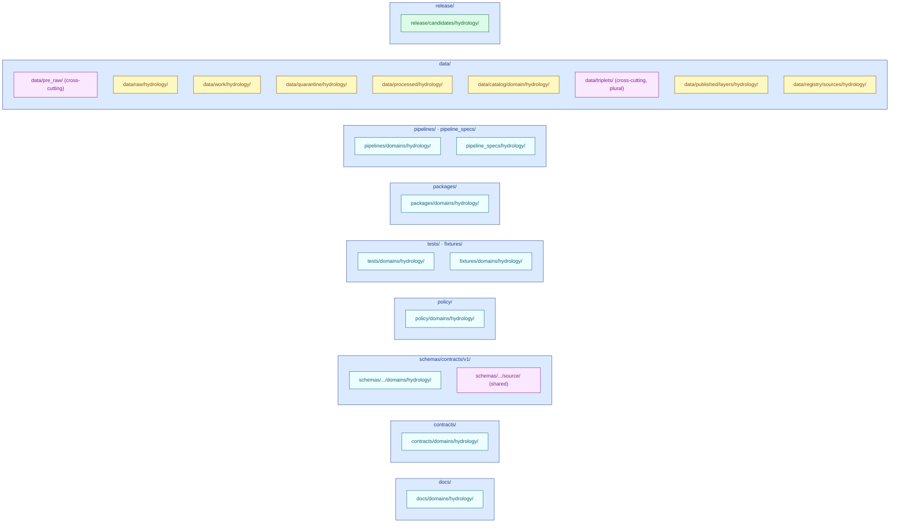

<!-- [KFM_META_BLOCK_V2]
doc_id: kfm://doc/domains/hydrology/missing-or-planned-files
title: Hydrology — Missing or Planned Files
type: standard
version: v3
status: draft
owners: <hydrology lane steward> + <directory-rules reviewer>   # placeholders — resolve via CODEOWNERS
created: 2026-05-18
updated: 2026-06-06
policy_label: public
contract_version: "3.0.0"   # pinned per ai-build-operating-contract.md v3.0
related:
  - ai-build-operating-contract.md
  - directory-rules.md
  - docs/registers/VERIFICATION_BACKLOG.md
  - docs/registers/DRIFT_REGISTER.md
  - docs/domains/hydrology/README.md
  - docs/domains/hydrology/INDEX.md
  - docs/domains/hydrology/FILE_SYSTEM_PLAN.md
  - docs/domains/hydrology/SOURCE_FAMILIES.md
  - docs/standards/PROV.md
tags: [kfm, hydrology, planning, directory-rules, backlog, proof-lane]
notes:
  - Repository not mounted in this session; all path claims are PROPOSED and all absence claims are NEEDS VERIFICATION.
  - v3 is a STATUS-TRACKING optimization of v2 — the exhaustive per-file lists now live in FILE_SYSTEM_PLAN.md; this doc tracks coverage state and the proof slice, not filenames.
  - Per §15, a folder lacking a contract-conformant README is a DRIFT CANDIDATE, not confirmed MISSING, until the repo is inspected.
  - Crosswalk validator home is CONFLICTED (ADR-S-CWV-01); SourceDescriptor schema home schemas/contracts/v1/source/ (source/ vs sources/ CONFLICTED).
  - OBJECT_MAP vs OBJECT_FAMILIES filename drift resolved in favor of OBJECT_FAMILIES.md (sibling-doc convention). See Changelog.
[/KFM_META_BLOCK_V2] -->

# 🌊 Hydrology — Missing or Planned Files

> **Coverage tracker** for the hydrology domain lane: which expected lane segments and key artifacts are present, planned, drift candidates, or unverified against the mounted repository — and the proof-slice subset that gates the lane's first release. The exhaustive per-file placement lists live in [`FILE_SYSTEM_PLAN.md`](./FILE_SYSTEM_PLAN.md); **this doc tracks state, not filenames.**

**Status:** `draft` · **Owners:** `<hydrology lane steward>` + `<directory-rules reviewer>` · **Contract:** `CONTRACT_VERSION = "3.0.0"` · **Last updated:** `2026-06-06`

> [!IMPORTANT]
> **Repository not mounted in this session.** Because the repo is not mounted, **no file can be confirmed present or absent**: required-but-unseen READMEs are **drift candidates / NEEDS VERIFICATION**, not confirmed `MISSING`. Statuses are best-effort planning estimates. This is a **planning instrument**, not a repo-state report. Companions: [`FILE_SYSTEM_PLAN.md`](./FILE_SYSTEM_PLAN.md) (placement contract — the authoritative file list), [`INDEX.md`](./INDEX.md) (navigation), [`README.md`](./README.md) (lane landing page).

---

## Quick navigation

- [How this doc relates to FILE_SYSTEM_PLAN](#how-this-doc-relates-to-file_system_plan)
- [Status vocabulary](#status-vocabulary)
- [Lane shape — Directory Rules §12](#lane-shape--directory-rules-12)
- [Coverage by responsibility root](#coverage-by-responsibility-root)
- [README coverage (§15 contract)](#readme-coverage-15-contract)
- [Conflicted & cross-cutting placements](#conflicted--cross-cutting-placements)
- [Proof-slice tracker](#proof-slice-tracker)
- [ADRs needed or pending](#adrs-needed-or-pending)
- [Open questions & verification backlog](#open-questions--verification-backlog)
- [How to update this document](#how-to-update-this-document)
- [Related docs](#related-docs)
- [Changelog](#changelog)

---

## How this doc relates to FILE_SYSTEM_PLAN

These two documents are deliberately split so they cannot drift against each other:

| | [`FILE_SYSTEM_PLAN.md`](./FILE_SYSTEM_PLAN.md) | **This doc** (`MISSING_OR_PLANNED_FILES.md`) |
|---|---|---|
| **Question it answers** | *Where does a hydrology file belong?* | *Which expected coverage exists yet, and what blocks the proof slice?* |
| **Owns** | The exhaustive per-root file lists and placement rules | Coverage **state** + the proof-slice subset |
| **Authority** | Placement contract (consult before picking a path) | Planning / tracking instrument |

> [!NOTE]
> If a specific filename appears here and in `FILE_SYSTEM_PLAN.md` and they disagree, **`FILE_SYSTEM_PLAN.md` wins** and a `DRIFT_REGISTER.md` entry is opened. To prevent that, v3 stopped re-listing every schema/contract filename here — the coverage tables below track **lane segments and key artifacts**, not the full file inventory.

[⬆ Back to top](#-hydrology--missing-or-planned-files)

---

## Status vocabulary

The engine of this document. Every coverage row carries one of:

| Status | Meaning |
|---|---|
| `PRESENT` | Exists in the repo and verified **this session** (impossible while unmounted; reserved for future inspections). |
| `PROPOSED` | Path conforms to Directory Rules; planned, not yet created/confirmed. |
| `PLANNED` | `PROPOSED` with an accepted ADR or explicit roadmap entry. |
| `DRIFT CANDIDATE` | Doctrinally required (e.g., a §15 README) but unconfirmable this session. Per §15, a folder lacking a contract-conformant README is a *drift candidate*; it becomes confirmed `MISSING` only after a mounted-repo scan shows it absent. |
| `MISSING` | Doctrinally required **and confirmed absent against a mounted repo**. Not assignable this session. |
| `DEFERRED` | Recognised but intentionally pushed past the current phase (with reason). |
| `NEEDS VERIFICATION` | May already exist or may need an ADR; unsettlable without a mounted repo. |
| `CONFLICTED` | Corpus sources disagree on placement; held open until an ADR + DRIFT_REGISTER entry resolve it. |
| `UNKNOWN` | Doctrine does not yet settle whether the file is needed. |

> [!TIP]
> Promote forward only with evidence: `PROPOSED → PRESENT` only after viewing the file in a mounted repo this session; `DRIFT CANDIDATE → MISSING` only after a scan confirms absence; `CONFLICTED →` resolved only after the named ADR is accepted (Operating Contract current-session evidence limit).

[⬆ Back to top](#-hydrology--missing-or-planned-files)

---

## Lane shape — Directory Rules §12

The lane appears as segments inside responsibility roots, never as a root folder. Cross-cutting (non-domain-segmented) homes: `data/pre_raw/` (watcher signals) and `data/triplets/` (graph projections, plural per §18.a).

> [!WARNING]
> **Anti-pattern guard (Directory Rules §13.4).** A root-level `hydrology/` folder with its own `data/`, `schemas/`, `policy/`, `docs/` subtree is a documented anti-pattern. If one appears, open a drift entry pointing to `docs/registers/DRIFT_REGISTER.md` rather than treating it as the lane.

[⬆ Back to top](#-hydrology--missing-or-planned-files)

---

## Coverage by responsibility root

One row per lane segment. The **Key artifacts** column names only the anchor files that gate coverage; for the full file list per segment, see [`FILE_SYSTEM_PLAN.md`](./FILE_SYSTEM_PLAN.md).

| Lane segment | Key artifacts (coverage anchors) | README (§15) | Segment status |
|---|---|---|---|
| `docs/domains/hydrology/` | README, INDEX, GLOSSARY, identity-model, DATA_LIFECYCLE, FILE_SYSTEM_PLAN, MAP_UI_CONTRACTS, this doc — **authored this sprint**; ARCHITECTURE, BOUNDARY, OBJECT_FAMILIES, SOURCE_FAMILIES, THIN_SLICE_PLAN, VERIFICATION_BACKLOG — **not yet authored** | n/a (this *is* docs) | `PROPOSED` (8 of ~14 authored) |
| `contracts/domains/hydrology/` | 13 object-meaning `.md` (watershed … upstream_trace) | `DRIFT CANDIDATE` | `PROPOSED` |
| `schemas/contracts/v1/domains/hydrology/` | 13 object schemas + `comid_huc12_crosswalk.schema.json` (`crosswalks/` home OPEN) | `DRIFT CANDIDATE` | `PROPOSED` |
| `schemas/contracts/v1/source/` *(shared)* | `source-descriptor.json` — **not a hydrology file**; `source/` vs `sources/` | n/a | `CONFLICTED` (ADR-0001) |
| `policy/domains/hydrology/` | publication gate; NFHL role-separation; emergency-alert boundary; source-role disambiguation; freshness; groundwater sensitivity | `DRIFT CANDIDATE` | `PROPOSED` |
| `tests/domains/hydrology/` | HUC12 fingerprint; reach-ambiguity ABSTAIN; NFHL role-separation; EvidenceBundle closure; temporal logic; no-network proof; rollback drill | `DRIFT CANDIDATE` | `PROPOSED` |
| `fixtures/domains/hydrology/` | `valid/` proof-slice set + `invalid/` negative fixtures; **declare one fixture home** (root vs `tests/fixtures/`) | `DRIFT CANDIDATE` | `PROPOSED` (home choice OPEN) |
| `packages/domains/hydrology/` | hydro-identity, hydro-temporal, hydro-evidence, hydro-crosswalk | `DRIFT CANDIDATE` | `PROPOSED` |
| `pipelines/domains/hydrology/` + `pipeline_specs/hydrology/` | ingest (WBD/NHDPlus/NWIS/NFHL/3DEP), normalize, catalog-close, publish, rollback + declarative specs | `DRIFT CANDIDATE` (both) | `PROPOSED` |
| `data/pre_raw/` *(cross-cutting)* | watcher `event_envelope` / `event_run_receipt` | per-root README | `PROPOSED` |
| `data/{raw,work,quarantine,processed}/hydrology/` | lifecycle dirs (connector → processed) | per-phase READMEs | `PROPOSED` |
| `data/catalog/domain/hydrology/` | EvidenceBundles, release candidates | per-root README | `PROPOSED` |
| `data/triplets/` *(cross-cutting, plural)* | graph/triplet projections | per-root README | `PROPOSED` |
| `data/published/layers/hydrology/` | public-safe layers (PMTiles, layer manifests) | per-root README | `PROPOSED` |
| `data/registry/sources/hydrology/` | SourceDescriptor **instances** (schema lives under `schemas/.../source/`) | per-root README | `PROPOSED` |
| `release/candidates/hydrology/` | release_manifest, promotion_decision, rollback_card, correction_notice, GENERATED_RECEIPT | `DRIFT CANDIDATE` | `PROPOSED` |
| `tools/validators/<topic>/` *(cross-cutting)* | COMID↔HUC12 crosswalk validator + manifest emitter | — | `CONFLICTED` (ADR-S-CWV-01) |

> [!NOTE]
> The `docs/` row tracks suite progress directly because this doc lives there. As of this sprint, eight lane docs are authored (drafts, `human_review` pending); six remain unauthored. See [`INDEX.md`](./INDEX.md) §2 for the live document map.

[⬆ Back to top](#-hydrology--missing-or-planned-files)

---

## README coverage (§15 contract)

Every canonical/compatibility root touched by the lane needs a §15 folder README (Purpose → Authority level → Status → What belongs → What does NOT belong → Inputs → Outputs → Validation → Review burden → Related folders → ADRs → Last reviewed). Until a mounted-repo scan runs, each is a **drift candidate**, not confirmed `MISSING`.

| Segment README | Status |
|---|---|
| `docs/domains/hydrology/README.md` | `PROPOSED` (authored this sprint — drives this row toward `PRESENT` on merge) |
| `contracts/`, `schemas/.../hydrology/`, `policy/`, `tests/`, `fixtures/`, `packages/`, `pipelines/`, `pipeline_specs/`, each `data/<phase>/`, `release/candidates/hydrology/` READMEs | `DRIFT CANDIDATE` (×~14) |

> [!NOTE]
> A single mounted-repo missing-README scan resolves this entire section at once (`DRIFT CANDIDATE → PRESENT` or `→ MISSING`). It is the highest-leverage verification action for the lane (H-V-09).

[⬆ Back to top](#-hydrology--missing-or-planned-files)

---

## Conflicted & cross-cutting placements

The placements that **cannot** be settled by this doc — each needs an ADR + `DRIFT_REGISTER.md` entry. These are the lane's true blockers; everything else is just authoring.

| Placement | Conflict | Resolves via |
|---|---|---|
| Crosswalk **validator** home | `tools/probes/comid_huc12/` vs `tools/validators/validators/crosswalk/` vs `tools/validators/hydro/` | **ADR-S-CWV-01** |
| `tools/validators/hydro/{schemas,policy}/` co-location | Schemas belong under `schemas/contracts/v1/...`; policy under `policy/domains/hydrology/` — not under `tools/` | ADR-S-CWV-01 + ADR-0001 |
| `SourceDescriptor` **schema** path | `source/source-descriptor.json` (Atlas §24.1.3) vs `sources/source_descriptor.schema.json` (Operating Contract §46) | **ADR-0001** |
| Crosswalk **schema** home | `schemas/.../domains/hydrology/` vs cross-cutting `schemas/.../crosswalks/` | ADR |
| 3DHP supersession of the v2.1 crosswalk key | COMID → 3DHP `universal_reference_id` → HUC12? — corpus-open | ADR + connector evidence |
| Fixture home | root `fixtures/domains/hydrology/` vs `tests/fixtures/domains/hydrology/` | ADR-hydro-fixture-home |
| `alignment_score` threshold | fixed `0.75` vs per-source-family configurable — not settled doctrine (crosswalk card flags tuning) | threshold policy + ADR |

> [!CAUTION]
> Do **not** assert any single home for the conflicted rows. The crosswalk validator and the `SourceDescriptor` schema path appear in **multiple** corpus locations; picking one without an ADR creates parallel authority. Reference canonical homes by path; co-locate nothing under `tools/`.

[⬆ Back to top](#-hydrology--missing-or-planned-files)

---

## Proof-slice tracker

Hydrology is the **first proof-bearing thin slice**. This is the gating subset — fixture-first, no-network, no live USGS/WBD/FEMA traffic.

> **Thin slice (Encyclopedia §5 N):** _Kansas HUC12 + one USGS gauge fixture + one NHDPlus identity crosswalk + NFHL contextual overlay + hydrograph panel + EvidenceBundle closure + ABSTAIN on ambiguous reach identity._

| Component | Coverage anchor (PROPOSED path) | Status |
|---|---|---|
| HUC12 fixture | `fixtures/domains/hydrology/valid/huc12_kansas_sample.json` | `PROPOSED` |
| USGS gauge fixture | `fixtures/domains/hydrology/valid/usgs_gauge_observation.json` | `PROPOSED` |
| NHDPlus crosswalk (official-tier) | `fixtures/domains/hydrology/valid/nhdplus_crosswalk_official.json` | `PROPOSED` |
| NFHL contextual overlay | `fixtures/domains/hydrology/valid/nfhl_zone_context.json` | `PROPOSED` |
| EvidenceBundle closure | `data/catalog/domain/hydrology/<bundle_id>/evidence_bundle.json` | `PROPOSED` |
| LayerManifest + hydrograph projection | `data/published/layers/hydrology/<layer_id>/…` | `PROPOSED` |
| Evidence Drawer payload | `schemas/contracts/v1/ui/evidence_drawer_payload.schema.json` *(cross-cutting, not lane-owned)* | `PROPOSED` |
| RunReceipt | `data/receipts/<run_id>/run_receipt.json` *(cross-domain home)* | `PROPOSED` |
| ReleaseManifest (dry-run) | `release/candidates/hydrology/<release_id>/release_manifest.json` | `PROPOSED` |
| ABSTAIN-on-ambiguous-reach test | `tests/domains/hydrology/test_nhdplus_hr_ambiguity.py` | `PROPOSED` |
| No-network proof test | `tests/domains/hydrology/test_no_network_proof.py` | `PROPOSED` |

> [!TIP]
> Keep this section at the top of priorities until the whole slice is `PRESENT`. It is the lane's definition of "first credible release," and it is fully achievable offline.

[⬆ Back to top](#-hydrology--missing-or-planned-files)

---

## ADRs needed or pending

Named ids where a sprint-wide ADR already exists; descriptive titles otherwise. Status `NEEDS VERIFICATION` where no ADR index is mounted.

| ADR (id / title) | Resolves | Status |
|---|---|---|
| **ADR-0001** | Schema home `schemas/contracts/v1/...`; `SourceDescriptor` `source/` vs `sources/` | `CONFLICTED` |
| **ADR-S-04** | Source-role vocabulary (the canonical seven, fixed at admission) | `PROPOSED` |
| **ADR-S-CWV-01** | Crosswalk validator home + `tools/validators/hydro/{schemas,policy}/` co-location | `CONFLICTED` |
| **ADR-S-13** | Runbook subfolder convention (OPEN-DR-02) | `OPEN` |
| **ADR-S-09 / S-12** | Reviewer separation of duties / connector cadence | `PROPOSED` |
| **EXP-004** | Hash policy (SHA-256/JCS vs BLAKE3 per object family) | `PROPOSED` |
| **OPEN-DR-01** | `PROV.md` vs `PROVENANCE.md` | `OPEN` |
| ADR-hydro-nfhl-observed-flood-boundary | Formalises NFHL-as-observed-flood DENY (Atlas §24.1.2) | `NEEDS VERIFICATION` |
| ADR-hydro-emergency-alert-boundary | Formalises KFM-not-an-alert-authority DENY (Atlas §20.4) | `NEEDS VERIFICATION` |
| ADR-hydro-crosswalk-canonicalisation | Canonical JSON, `spec_hash`, decision-reason enum | `NEEDS VERIFICATION` |
| ADR-hydro-fixture-home | `fixtures/domains/hydrology/` vs `tests/fixtures/...` | `NEEDS VERIFICATION` |

[⬆ Back to top](#-hydrology--missing-or-planned-files)

---

## Open questions & verification backlog

Mirrors the hydrology backlog (Atlas v1.1 §4 N) into a checkable register.

| # | Item | Evidence that would settle it | Status |
|---:|---|---|---|
| H-V-01 | HUC12 fixture and fingerprint rule | mounted repo files; fingerprint test; sample fixture | `NEEDS VERIFICATION` |
| H-V-02 | NHDPlus HR crosswalk and ambiguity ABSTAIN behavior | crosswalk fixture + ambiguity test + lane EvidenceBundle | `NEEDS VERIFICATION` |
| H-V-03 | USGS Water normalizer and NFHL source-role separation | normalizer code; role-separation policy test | `NEEDS VERIFICATION` |
| H-V-04 | Hydrology API and MapLibre layer adapter | governed-API routes; layer manifest fixtures; renderer-boundary tests | `NEEDS VERIFICATION` |
| H-V-05 | Fixture home choice (root `fixtures/` vs `tests/fixtures/`) | README declaration + reviewer confirmation | `NEEDS VERIFICATION` |
| H-V-06 | Schema home (rogue `contracts/.../*.schema.json`?) + `source/` vs `sources/` | repo grep; ADR-0001 reconciliation | `CONFLICTED` |
| H-V-07 | Groundwater-well sensitivity defaults | `groundwater_sensitivity.rego` + tests | `NEEDS VERIFICATION` |
| H-V-08 | Freshness / stale-state rules per source family | freshness policy + per-family thresholds | `NEEDS VERIFICATION` |
| H-V-09 | Per-folder §15 READMEs across all lane segments | **single missing-README scan** resolves the whole README-coverage section | `NEEDS VERIFICATION` |
| H-V-10 | Drift entry for any root-level `hydrology/` folder? | repo top-level inspection | `NEEDS VERIFICATION` |
| H-V-11 | Crosswalk validator home | ADR-S-CWV-01 | `CONFLICTED` |
| H-V-12 | 3DHP supersession of the v2.1 crosswalk key | ADR + connector evidence (corpus-open) | `CONFLICTED` |
| H-V-13 | Alignment-score threshold (fixed `0.75` vs configurable) | threshold policy + ADR | `PROPOSED` |

> [!WARNING]
> **NFHL ≠ observed flood.** Atlas v1.1 §4 B / §24.1.2: NFHL regulatory context **must not** be collapsed into observed inundation. Any pipeline, schema, layer, or UI surface allowing that collapse is a publication blocker. `H-V-03` exists to catch it; do not promote past CATALOG without it passing.

> [!CAUTION]
> **Emergency-alert boundary.** Atlas v1.1 §20.4: KFM may **not** be used as a life-safety authority in Hazards / Hydrology / Air. Hydrology surfaces must avoid language framing released artifacts as official alerts.

[⬆ Back to top](#-hydrology--missing-or-planned-files)

---

## How to update this document

<strong>Update procedure (click to expand)</strong>

1. **Inspect the mounted repo.** Confirm path presence before changing any status. Memory and prior reports do not count (Operating Contract current-session evidence limit).
2. **Track segments and key artifacts, not every filename.** If a specific file's placement is in question, that belongs in [`FILE_SYSTEM_PLAN.md`](./FILE_SYSTEM_PLAN.md); update the segment's coverage status here.
3. **Move statuses forward only with evidence.**
   - `PROPOSED`/`PLANNED` → `PRESENT`: file visible in the mounted repo, this session.
   - `DRIFT CANDIDATE` → `MISSING`: a scan confirms the required file absent.
   - `NEEDS VERIFICATION` → resolved: only after the listed verification action.
   - `CONFLICTED` → resolved: only after the named ADR is accepted; close the DRIFT_REGISTER entry.
4. **Open drift entries** for any path conflicting with Directory Rules (root-level `hydrology/`; schema mirror divergence; `tools/validators/hydro/{schemas,policy}/` co-location). Cross-link `DRIFT_REGISTER.md`.
5. **Open ADRs** before landing files that require one (see ADR table).
6. **Update the meta block.** Bump `updated` and (on large status changes) `version`.
7. **Keep the proof-slice tracker at the top of priorities** until the slice is fully `PRESENT`.

<strong>Status legend, quick reference</strong>

| Symbol | Status | When to use |
|---|---|---|
| 🟢 | `PRESENT` | Verified this session against mounted repo. |
| 🟡 | `PROPOSED` / `PLANNED` | Path conforms; not yet created or confirmed. |
| 🟠 | `DRIFT CANDIDATE` | Doctrinally required (e.g., §15 README); unconfirmed this session. |
| 🔴 | `MISSING` | Doctrinally required and **confirmed absent** against a mounted repo. |
| 🟣 | `CONFLICTED` | Corpus sources disagree; ADR + DRIFT_REGISTER pending. |
| ⏸ | `DEFERRED` | Recognised but pushed past the current phase, with a reason. |
| ❓ | `NEEDS VERIFICATION` | Requires repo inspection or ADR. |
| ⚪ | `UNKNOWN` | Doctrine does not yet settle whether this is needed. |

[⬆ Back to top](#-hydrology--missing-or-planned-files)

---

## Related docs

- [`ai-build-operating-contract.md`](../../../ai-build-operating-contract.md) — operating contract; `CONTRACT_VERSION = "3.0.0"`.
- [`directory-rules.md`](../../../directory-rules.md) — Domain Placement Law (§12), Required README Contract (§15), Path-Validation Checklist (§16), OPEN-DR-01/02.
- [`docs/domains/hydrology/FILE_SYSTEM_PLAN.md`](./FILE_SYSTEM_PLAN.md) — **per-root placement contract; the authoritative file list this tracker defers to.**
- [`docs/domains/hydrology/INDEX.md`](./INDEX.md) — lane navigation hub (live document map).
- [`docs/domains/hydrology/README.md`](./README.md) — lane landing page (§15 README).
- [`docs/domains/hydrology/SOURCE_FAMILIES.md`](./SOURCE_FAMILIES.md) — `PROPOSED` — source ledger.
- [`docs/registers/VERIFICATION_BACKLOG.md`](../../registers/VERIFICATION_BACKLOG.md) — repo-wide backlog target for promoted hydrology items.
- [`docs/registers/DRIFT_REGISTER.md`](../../registers/DRIFT_REGISTER.md) — drift entries; cross-link when conflicts surface.
- [`docs/standards/PROV.md`](../../standards/PROV.md) — provenance standard profile (live artifact; cf. OPEN-DR-01).
- [`docs/runbooks/hydrology/SOURCE_REFRESH_RUNBOOK.md`](../../runbooks/hydrology/SOURCE_REFRESH_RUNBOOK.md) — `PROPOSED` — refresh runbook (fauna precedent; Pattern A pending ADR-S-13).
- Sibling lane inventories — `PROPOSED`: `docs/domains/{soil,fauna,flora,habitat,geology,atmosphere,roads-rail-trade,settlements-infrastructure,archaeology,hazards,agriculture,people-dna-land}/MISSING_OR_PLANNED_FILES.md`.

> [!NOTE]
> All linked targets are `PROPOSED` / `DRIFT CANDIDATE` until confirmed against the mounted repo; until then several will 404 on GitHub — the intended planning state.

[⬆ Back to top](#-hydrology--missing-or-planned-files)

---

## Changelog

| Version | Date | Change |
|---|---|---|
| v3 | 2026-06-06 | **Status-tracking optimization.** Recast from a per-file inventory to a coverage tracker: replaced the eleven exhaustive per-root file tables with a single [Coverage by responsibility root](#coverage-by-responsibility-root) table (segment + key artifacts + README status + segment status), and pointed the authoritative file list to `FILE_SYSTEM_PLAN.md` with an explicit "FILE_SYSTEM_PLAN wins" drift rule. Consolidated all conflicts into one [Conflicted & cross-cutting placements](#conflicted--cross-cutting-placements) table. Added a [How this doc relates to FILE_SYSTEM_PLAN](#how-this-doc-relates-to-file_system_plan) delimiter. Resolved the `OBJECT_MAP.md` vs `OBJECT_FAMILIES.md` filename drift in favor of `OBJECT_FAMILIES.md` (sibling-doc convention). Renamed the doc-type badge to `coverage-tracker`. Trimmed H-V-14 (filename reconciliation, now resolved). |
| v2 | 2026-06-06 | Pinned `CONTRACT_VERSION`; fixed `doc_id` (removed doubled `docs/`); `MISSING → DRIFT CANDIDATE` for unseen READMEs; added Pre-RAW + `data/triplets/`; reconciled source roles to the canonical seven; led the crosswalk section with ADR-S-CWV-01; corrected relative-link depth. |
| v1 | 2026-05-18 | Initial per-file inventory. |

> **Backward compatibility.** The Quick-navigation anchors changed substantially in v3 (sections were merged/renamed): the per-root sections (`#contracts-…`, `#schemas-…`, `#policy-…`, etc.) are replaced by `#coverage-by-responsibility-root`; `#hydrology-thin-slice-proof-lane-inventory` → `#proof-slice-tracker`; `#how-to-read-this-inventory` → `#status-vocabulary`. Inbound links from sibling docs that targeted the old per-root anchors must repoint. The page-top anchor and `doc_id` are unchanged from v2.

[⬆ Back to top](#-hydrology--missing-or-planned-files)

---

Document version: <code>v3</code> · Contract: <code>CONTRACT_VERSION = "3.0.0"</code> · Last updated: <code>2026-06-06</code> · Status: <code>draft</code> · Coverage tracker for the hydrology lane.

[⬆ Back to top](#-hydrology--missing-or-planned-files)
