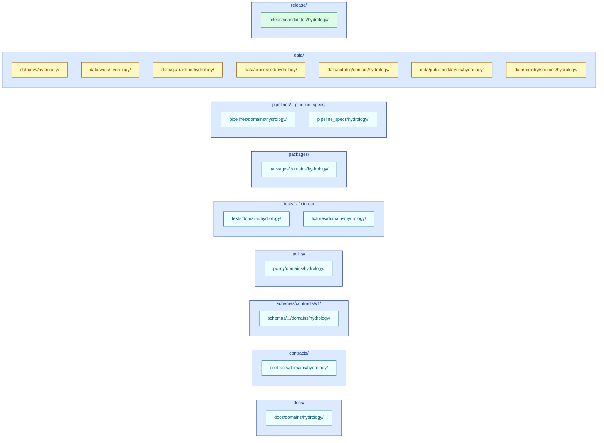

<!-- [KFM_META_BLOCK_V2]
doc_id: kfm://doc/docs/domains/hydrology/missing_or_planned_files
title: Hydrology — Missing or Planned Files
type: standard
version: v1
status: draft
owners: TBD — Hydrology domain stewards + Directory Rules reviewers
created: 2026-05-18
updated: 2026-05-18
policy_label: public
related:
  - docs/doctrine/directory-rules.md
  - docs/registers/VERIFICATION_BACKLOG.md
  - docs/registers/DRIFT_REGISTER.md
  - docs/domains/hydrology/README.md
  - docs/domains/hydrology/SOURCE_FAMILIES.md
  - kfm://doc/docs/standards/PROV
tags: [kfm, hydrology, planning, directory-rules, backlog, proof-lane]
notes:
  - Repository not mounted in this session; all path claims are PROPOSED.
  - Tracks the hydrology domain lane file inventory per Directory Rules §12.
  - Hydrology is identified across KFM doctrine as the preferred early proof lane.
[/KFM_META_BLOCK_V2] -->

# 🌊 Hydrology — Missing or Planned Files

> Working inventory of every file the **hydrology domain lane** is expected to carry, where each file belongs under Directory Rules §12, and whether it is currently **present, planned, missing, deferred, or unverified** against the mounted repository.

**Status:** `draft` · **Owners:** _TBD — Hydrology stewards + Directory Rules reviewers_ · **Last updated:** `2026-05-18`

> [!IMPORTANT]
> **Repository not mounted in this session.** Every concrete path in this document is **PROPOSED** under Directory Rules §12 (Domain Placement Law) and the Required README Contract (§15). Statuses below are **best-effort planning estimates** until the repo is inspected and reconciled. Until then, this file is a **planning instrument**, not a repo-state report.

---

## Quick navigation

- [Purpose & scope](#purpose--scope)
- [How to read this inventory](#how-to-read-this-inventory)
- [Lane shape — Directory Rules §12](#lane-shape--directory-rules-12)
- [Documentation files (`docs/domains/hydrology/`)](#documentation-files-docsdomainshydrology)
- [Contracts (`contracts/domains/hydrology/`)](#contracts-contractsdomainshydrology)
- [Schemas (`schemas/contracts/v1/domains/hydrology/`)](#schemas-schemascontractsv1domainshydrology)
- [Policy (`policy/domains/hydrology/`)](#policy-policydomainshydrology)
- [Tests (`tests/domains/hydrology/`)](#tests-testsdomainshydrology)
- [Fixtures (`fixtures/domains/hydrology/`)](#fixtures-fixturesdomainshydrology)
- [Packages (`packages/domains/hydrology/`)](#packages-packagesdomainshydrology)
- [Pipelines & specs](#pipelines--specs)
- [Cross-cutting tools (`tools/validators/`)](#cross-cutting-tools-toolsvalidators)
- [Lifecycle data (`data/<phase>/hydrology/`)](#lifecycle-data-dataphasehydrology)
- [Release (`release/candidates/hydrology/`)](#release-releasecandidateshydrology)
- [Hydrology thin-slice proof lane inventory](#hydrology-thin-slice-proof-lane-inventory)
- [ADRs needed or pending](#adrs-needed-or-pending)
- [Open questions & verification backlog](#open-questions--verification-backlog)
- [How to update this document](#how-to-update-this-document)
- [Related docs](#related-docs)

---

## Purpose & scope

**Purpose.** This document is the **single tracking surface** for every file the hydrology domain lane is doctrinally expected to carry. It exists so that:

1. Reviewers can see — at a glance — which expected files are present, which are still planned, and which have unresolved placement questions.
2. PR authors proposing hydrology files have an inventory to consult **before** picking a path.
3. The lane's coverage gaps surface in one place rather than across scattered TODOs.
4. Directory Rules §12 (Domain Placement Law) and §15 (Required README Contract) are observably enforced for hydrology.

**In scope.** Files that doctrinally belong to the hydrology domain lane: watersheds, HUC units, hydro features, reaches, gauges, flow and water-level observations, water quality, groundwater context, regulatory flood context (FEMA NFHL), observed flood evidence, and terrain-derived hydrology context. (Object families per Atlas v1.1 §4 and Encyclopedia §5.)

**Out of scope.** Files for adjacent domains (Hazards, Soil, Agriculture, Settlements/Infrastructure, Spatial Foundation, Atmosphere) are tracked in **their own** `MISSING_OR_PLANNED_FILES.md`. Cross-domain validators or schemas — anything that spans hydrology × another domain — live under topic-named non-domain segments per Directory Rules §12 _Multi-domain and cross-cutting files_, and are linked from this document but **owned elsewhere**.

> [!NOTE]
> Hydrology is identified as the **preferred early proof lane** in KFM build doctrine (Unified Implementation Architecture §6.1; Atlas v1.1 §21 Phase 5). The proof-lane subset of this inventory therefore carries higher priority than the full lane.

[⬆ Back to top](#-hydrology--missing-or-planned-files)

---

## How to read this inventory

Each table below lists expected files under one responsibility root. Statuses use this fixed vocabulary:

| Status | Meaning |
|---|---|
| `PRESENT` | File exists in the repository and is verified this session (currently impossible — repo not mounted; reserve for future inspections). |
| `PROPOSED` | Path conforms to Directory Rules; file does not yet exist (or cannot be confirmed) and is planned. |
| `PLANNED` | Synonym of `PROPOSED` reserved for files with an accepted ADR or explicit roadmap entry. |
| `MISSING` | Doctrinally required (e.g., per-root README under §15) and not present. Higher urgency than `PROPOSED`. |
| `DEFERRED` | Path is recognised but intentionally pushed past the current phase (with reason). |
| `NEEDS VERIFICATION` | Path may already exist or may need ADR; cannot be settled without a mounted repo. |
| `UNKNOWN` | Doctrine does not yet settle whether this file is needed. |

> [!TIP]
> Move a row from `PROPOSED` → `PRESENT` only after the file has been viewed in the mounted repo **this session**. Do not promote based on memory, prior reports, or partial scans (Directory Rules §0; KFM truth posture).

[⬆ Back to top](#-hydrology--missing-or-planned-files)

---

## Lane shape — Directory Rules §12

Directory Rules §12 uses hydrology as the **canonical worked example** of the Domain Placement Law. The lane MUST appear as segments inside responsibility roots, never as a root folder. The diagram below mirrors §12 verbatim and is the structural skeleton this inventory tracks.

> [!WARNING]
> **Anti-pattern guard (Directory Rules §13.4).** A root-level `hydrology/` folder with its own `data/`, `schemas/`, `policy/`, `docs/` subtree is a documented anti-pattern. If such a folder appears, this document MUST open a drift entry pointing to `docs/registers/DRIFT_REGISTER.md` rather than treating it as the lane.

[⬆ Back to top](#-hydrology--missing-or-planned-files)

---

## Documentation files (`docs/domains/hydrology/`)

Human-readable doctrine and orientation for the hydrology lane.

| File | Status | Notes |
|---|---|---|
| `README.md` | `PROPOSED` / `MISSING` | Required by §15 Required README Contract. One-line purpose, authority class, what belongs / does not belong, validation, related folders. |
| `MISSING_OR_PLANNED_FILES.md` | This file | `PROPOSED`. |
| `ARCHITECTURE.md` | `PROPOSED` | Lane architecture: source-role separation, observed-vs-regulatory boundary, pipeline shape, proof-lane scope. |
| `OBJECT_MAP.md` | `PROPOSED` | Watershed · HUCUnit · HydroFeature · ReachIdentity · GaugeSite · FlowObservation · WaterLevelObservation · WaterQualityObservation · GroundwaterWell · NFHLZone/FloodContext · ObservedFloodEvent · Hydrograph · UpstreamTrace. (Atlas v1.1 §4 E.) |
| `UBIQUITOUS_LANGUAGE.md` | `PROPOSED` | CONFIRMED-term glossary per Atlas v1.1 §4 C. |
| `SOURCE_FAMILIES.md` | `PROPOSED` | USGS WBD/HUC · NHDPlus HR/3DHP · USGS Water Data/NWIS · FEMA NFHL/MSC · 3DEP terrain · water-quality & groundwater · historical observed flood. (Atlas v1.1 §4 D.) |
| `PUBLICATION_POSTURE.md` | `PROPOSED` | Public-suitable defaults; NFHL-as-observed-flood denial; emergency-boundary exclusion; freshness rules. |
| `VERIFICATION_BACKLOG.md` | `PROPOSED` | Domain-scoped backlog mirroring Atlas v1.1 §4 N items into a checkable register. |
| `runbooks/` (sibling under `docs/runbooks/hydrology/`) | `PROPOSED` | Lane-specific operational runbooks — placed under `docs/runbooks/`, **not** here, per the established runbook home (compare fauna's runbook placement). |

> [!NOTE]
> A subfolder convention note: runbook files for this lane belong under `docs/runbooks/hydrology/`, not `docs/domains/hydrology/runbooks/`. This mirrors the fauna precedent (`docs/runbooks/fauna/SOURCE_REFRESH_RUNBOOK.md`) and keeps `docs/domains/<domain>/` doctrine-focused.

[⬆ Back to top](#-hydrology--missing-or-planned-files)

---

## Contracts (`contracts/domains/hydrology/`)

Semantic meaning files (Markdown). Validation logic does **not** live here — it lives in `schemas/` (shape), `policy/` (admissibility), and `tests/` (proof). (Directory Rules §6.3, §6.4.)

| File | Status | Object family |
|---|---|---|
| `README.md` | `MISSING` | Required by §15. |
| `watershed.md` | `PROPOSED` | Watershed identity, scope, hierarchy. |
| `huc_unit.md` | `PROPOSED` | HUC2 / HUC4 / HUC8 / HUC10 / HUC12 unit; WBD snapshot tracking. |
| `hydro_feature.md` | `PROPOSED` | NHD/NHDPlus HR generic feature identity. |
| `reach_identity.md` | `PROPOSED` | COMID, permanent identifier, reachcode, VPUID semantics. |
| `gauge_site.md` | `PROPOSED` | NWIS station identity; provider IDs as canonical keys. |
| `flow_observation.md` | `PROPOSED` | Discharge time series; parameter, unit, qualifier, no-data semantics. |
| `water_level_observation.md` | `PROPOSED` | Stage / gauge-height time series. |
| `water_quality_observation.md` | `PROPOSED` | Concentration / characteristic observation; method / detection-limit context. |
| `groundwater_well.md` | `PROPOSED` | Well identity, completion, level observations; sensitivity caveats. |
| `nfhl_zone.md` | `PROPOSED` | Regulatory flood-zone classification; **explicitly not** observed inundation. |
| `observed_flood_event.md` | `PROPOSED` | Observed inundation evidence (high-water marks, imagery footprints); source-role-isolated from NFHL. |
| `hydrograph.md` | `PROPOSED` | Time-series projection of flow/level observations for UI. |
| `upstream_trace.md` | `PROPOSED` | Network traversal projection; depends on NHDPlus HR identity. |

[⬆ Back to top](#-hydrology--missing-or-planned-files)

---

## Schemas (`schemas/contracts/v1/domains/hydrology/`)

Machine-checkable shape. Default home per **ADR-0001** (Directory Rules §6.4). No parallel home under `contracts/domains/hydrology/`.

| File | Status | Notes |
|---|---|---|
| `README.md` | `MISSING` | §15 required. |
| `watershed.schema.json` | `PROPOSED` | |
| `huc_unit.schema.json` | `PROPOSED` | 12-digit HUC12 enforcement; WBD snapshot field. |
| `hydro_feature.schema.json` | `PROPOSED` | |
| `reach_identity.schema.json` | `PROPOSED` | NHDPlus version + reachcode + permanent_identifier + VPUID. |
| `gauge_site.schema.json` | `PROPOSED` | |
| `flow_observation.schema.json` | `PROPOSED` | |
| `water_level_observation.schema.json` | `PROPOSED` | |
| `water_quality_observation.schema.json` | `PROPOSED` | |
| `groundwater_well.schema.json` | `PROPOSED` | |
| `nfhl_zone.schema.json` | `PROPOSED` | Carries `source_role: regulatory_context` invariant. |
| `observed_flood_event.schema.json` | `PROPOSED` | Carries `source_role: observation` invariant. |
| `hydrograph.schema.json` | `PROPOSED` | |
| `upstream_trace.schema.json` | `PROPOSED` | |
| `comid_huc12_crosswalk.schema.json` | `PROPOSED` | Crosswalk manifest; `decision_reason` enum: `official_crosswalk` / `area_weighted_overlay` / `centroid_in_polygon` / `snap_to_pour_point`. (Per New Ideas 5-8-26 hydro validator design.) |
| `negative/` (invalid fixtures for each schema) | `PROPOSED` | Co-located negative-state fixtures per Directory Rules §6.6. |

> [!CAUTION]
> **Schema-home discipline.** Schemas MUST NOT also live under `contracts/domains/hydrology/<x>.schema.json`. Any pre-existing path of that shape is `CONFLICTED` per ADR-0001 and triggers a drift entry, not a parallel home.

[⬆ Back to top](#-hydrology--missing-or-planned-files)

---

## Policy (`policy/domains/hydrology/`)

Admissibility, release, sensitivity, and source-role rules. Canonical singular root (`policy/`, not `policies/`).

| File | Status | Notes |
|---|---|---|
| `README.md` | `MISSING` | §15 required. |
| `hydro_publication.rego` | `PROPOSED` | Public-safe publication gate; rights, source-role, freshness checks. |
| `nfhl_role_separation.rego` | `PROPOSED` | **Deny** any claim that presents an NFHL regulatory zone as observed inundation. (Atlas v1.1 §4 B, §20.) |
| `emergency_alert_boundary.rego` | `PROPOSED` | **Deny** the use of KFM as a life-safety alert authority; emergency text belongs to Hazards / official sources. (Atlas v1.1 §20.4.) |
| `source_role_disambiguation.rego` | `PROPOSED` | Enforce separation among `observation` / `regulatory_context` / `model` / `authority` / `legal` source roles. |
| `freshness_stale_state.rego` | `PROPOSED` | Stale-state badging and ABSTAIN rules for time-sensitive series. |
| `groundwater_sensitivity.rego` | `PROPOSED` | Well-location sensitivity defaults; private-well joins fail closed. |
| `tests/` (policy-side fixtures and rule tests) | `PROPOSED` | Distinct from `tests/domains/hydrology/`; per Directory Rules §6.5. |

[⬆ Back to top](#-hydrology--missing-or-planned-files)

---

## Tests (`tests/domains/hydrology/`)

Proof the lane's contracts, schemas, and policies are enforceable.

| File | Status | Tests |
|---|---|---|
| `README.md` | `MISSING` | §15 required. |
| `test_huc12_fingerprint.py` | `PROPOSED` | HUC12 fingerprint rule per Atlas v1.1 §4 N. |
| `test_nhdplus_hr_ambiguity.py` | `PROPOSED` | Ambiguous reach identity → ABSTAIN. |
| `test_usgs_water_normalizer.py` | `PROPOSED` | Parameter / unit / qualifier / no-data handling. |
| `test_nfhl_role_separation.py` | `PROPOSED` | Confirms NFHL never serialised as observed inundation. |
| `test_evidence_bundle_closure.py` | `PROPOSED` | Lane EvidenceBundle closure with `EvidenceRef`. |
| `test_temporal_logic.py` | `PROPOSED` | source / observed / valid / retrieval / release / correction times stay distinct. |
| `test_geometry_validity.py` | `PROPOSED` | Polygon topology, catchment validity, multi-HUC candidates. |
| `test_no_network_proof.py` | `PROPOSED` | Offline fixture-first proof slice (no live network). |
| `test_release_manifest.py` | `PROPOSED` | Hydrology release manifest validation. |
| `test_rollback_drill.py` | `PROPOSED` | RollbackCard dry-run. |
| `test_citation_validation.py` | `PROPOSED` | Cite-or-abstain on lane-scoped AI answers. |

[⬆ Back to top](#-hydrology--missing-or-planned-files)

---

## Fixtures (`fixtures/domains/hydrology/`)

Sample data for tests and proof slices. The lane MAY keep fixtures under `tests/fixtures/domains/hydrology/` instead; per Directory Rules §6.6, **only one** fixture home for this lane.

| File | Status | Notes |
|---|---|---|
| `README.md` | `MISSING` | §15 required; must declare which fixture home is canonical for hydrology. |
| `valid/huc12_kansas_sample.json` | `PROPOSED` | One Kansas HUC12 with WBD snapshot. |
| `valid/usgs_gauge_observation.json` | `PROPOSED` | One USGS gauge + one flow observation. |
| `valid/nhdplus_crosswalk_official.json` | `PROPOSED` | `decision_reason: official_crosswalk`. |
| `valid/overlay_assignment.json` | `PROPOSED` | `decision_reason: area_weighted_overlay`. |
| `valid/nfhl_zone_context.json` | `PROPOSED` | `source_role: regulatory_context`. |
| `valid/observed_flood_event.json` | `PROPOSED` | `source_role: observation`. |
| `invalid/invalid_huc_length.json` | `PROPOSED` | HUC12 not 12 digits → `FAIL_INVALID_HUC12`. |
| `invalid/low_alignment.json` | `PROPOSED` | `alignment_score < 0.75` → `FAIL_LOW_ALIGNMENT`. |
| `invalid/missing_provenance.json` | `PROPOSED` | Missing `source_head` → `FAIL_MISSING_PROVENANCE`. |
| `invalid/duplicate_comid.json` | `PROPOSED` | Unjustified duplicate `(comid, huc12)` rows. |
| `invalid/nfhl_as_observed.json` | `PROPOSED` | Negative fixture proving role-separation DENY. |
| `invalid/multi_huc_unresolved.json` | `PROPOSED` | Catchment overlaps >1 HUC12 with no candidate ranking. |
| `invalid/invalid_geometry_hash.json` | `PROPOSED` | Malformed catchment polygon hash. |

[⬆ Back to top](#-hydrology--missing-or-planned-files)

---

## Packages (`packages/domains/hydrology/`)

Reusable, shared libraries scoped to the lane. A package MUST be reusable; one-off workflow steps belong in `tools/` or `pipelines/` (Directory Rules §7.2).

| Path | Status | Responsibility |
|---|---|---|
| `README.md` | `MISSING` | §15 required. |
| `hydro-identity/` | `PROPOSED` | COMID / HUC12 / reach identity utilities; canonicalisation; deterministic identity. |
| `hydro-temporal/` | `PROPOSED` | Time-stamp distinction (observed / valid / retrieval / release / correction). |
| `hydro-evidence/` | `PROPOSED` | EvidenceBundle helpers for hydrology objects. |
| `hydro-crosswalk/` | `PROPOSED` | COMID ↔ HUC12 crosswalk computation; reads `comid_huc12_crosswalk.schema.json`. |

[⬆ Back to top](#-hydrology--missing-or-planned-files)

---

## Pipelines & specs

Executable pipelines (`pipelines/domains/hydrology/`) describe **how** runs proceed. Declarative specs (`pipeline_specs/hydrology/`) describe **what** should run (Directory Rules §7.4).

| Path | Status | Notes |
|---|---|---|
| `pipelines/domains/hydrology/README.md` | `MISSING` | §15 required. |
| `pipelines/domains/hydrology/ingest_wbd_huc/` | `PROPOSED` | WBD / HUC12 RAW capture. |
| `pipelines/domains/hydrology/ingest_nhdplus_hr/` | `PROPOSED` | NHDPlus HR / 3DHP identity ingest. |
| `pipelines/domains/hydrology/ingest_usgs_water/` | `PROPOSED` | NWIS observation normalization. |
| `pipelines/domains/hydrology/ingest_nfhl/` | `PROPOSED` | FEMA NFHL regulatory-context ingest. |
| `pipelines/domains/hydrology/ingest_3dep_terrain/` | `PROPOSED` | Terrain-derived hydrology context. |
| `pipelines/domains/hydrology/normalize_observation/` | `PROPOSED` | Parameter / unit / qualifier / no-data normalization. |
| `pipelines/domains/hydrology/catalog_close/` | `PROPOSED` | Catalog / triplet projection + EvidenceBundle closure. |
| `pipelines/domains/hydrology/publish_layers/` | `PROPOSED` | Public-safe layer emission (PMTiles / governed-API surfaces). |
| `pipelines/domains/hydrology/rollback/` | `PROPOSED` | RollbackCard execution. |
| `pipeline_specs/hydrology/README.md` | `MISSING` | §15 required. |
| `pipeline_specs/hydrology/*.yaml` | `PROPOSED` | One spec per pipeline above, declarative. |

[⬆ Back to top](#-hydrology--missing-or-planned-files)

---

## Cross-cutting tools (`tools/validators/`)

Cross-domain validators live under **topic-named non-domain segments** (Directory Rules §12 _Multi-domain and cross-cutting files_). The hydro crosswalk validator is the canonical example because it pre-dates and informs the schema home.

| Path | Status | Notes |
|---|---|---|
| `tools/validators/hydro/README.md` | `PROPOSED` | Governed COMID ↔ HUC12 validation; fail-closed, offline-first. (Per New Ideas 5-8-26.) |
| `tools/validators/hydro/check_crosswalk.py` | `PROPOSED` | CLI: structural / governance / hydrology-sanity gates. |
| `tools/validators/hydro/emit_manifest.py` | `PROPOSED` | Emits HydroCrosswalkManifest with `spec_hash`. |
| `tools/validators/hydro/test_check_crosswalk.py` | `PROPOSED` | Negative-path test set. |
| `tools/validators/hydro/schemas/comid_huc12_crosswalk.schema.json` | `PROPOSED` / `CONFLICTED` | **Schema-home note:** New Ideas 5-8-26 placed this here; ADR-0001 says schemas live under `schemas/contracts/v1/...`. Reconcile via ADR or migration before landing. |
| `tools/validators/hydro/fixtures/{valid,invalid}/` | `PROPOSED` | Local validator fixtures distinct from domain `fixtures/` home. |
| `tools/validators/hydro/policy/hydro_publication.rego` | `PROPOSED` / `CONFLICTED` | Same issue: policy belongs under `policy/domains/hydrology/`, not under `tools/`. Resolve before merge. |

> [!IMPORTANT]
> The validator-package layout from New Ideas 5-8-26 (`tools/validators/hydro/schemas/`, `tools/validators/hydro/policy/`) **diverges** from Directory Rules §6.4 and §6.5, which call for canonical schema and policy homes. This is flagged as a `CONFLICTED` placement requiring an ADR before any of those files land. Until then, the validator should reference the canonical homes by path, not co-locate them.

[⬆ Back to top](#-hydrology--missing-or-planned-files)

---

## Lifecycle data (`data/<phase>/hydrology/`)

Per Directory Rules §4 Step 2, every lifecycle phase has a dedicated home; promotion is a governed state transition, not a file move.

| Phase | Path | Status | Notes |
|---|---|---|---|
| RAW | `data/raw/hydrology/<source_id>/<run_id>/` | `PROPOSED` | Immutable source payload; connector output only. |
| WORK | `data/work/hydrology/` | `PROPOSED` | In-progress normalization. |
| QUARANTINE | `data/quarantine/hydrology/` | `PROPOSED` | Held-back records with reason codes. |
| PROCESSED | `data/processed/hydrology/` | `PROPOSED` | Validated normalized objects + receipts. |
| CATALOG | `data/catalog/domain/hydrology/` | `PROPOSED` | EvidenceBundles, triplet projections, release candidates. |
| PUBLISHED | `data/published/layers/hydrology/` | `PROPOSED` | Public-safe artifacts served via governed-API. |
| REGISTRY | `data/registry/sources/hydrology/` | `PROPOSED` | SourceDescriptor records. |
| RECEIPTS / PROOFS | `data/receipts/`, `data/proofs/` (cross-domain) | `PROPOSED` | Emitted alongside lifecycle dirs; not nested under hydrology. |

Each phase folder needs a `README.md` declaring authority class and acceptable content (§15). All eight READMEs are `MISSING` until proven otherwise.

[⬆ Back to top](#-hydrology--missing-or-planned-files)

---

## Release (`release/candidates/hydrology/`)

Release **decisions** for hydrology. Distinct from `data/published/layers/hydrology/`, which holds release **artifacts** (Directory Rules §5).

| File | Status | Notes |
|---|---|---|
| `README.md` | `MISSING` | §15 required. |
| `<release_id>/release_manifest.json` | `PROPOSED` | ReleaseManifest per release. |
| `<release_id>/promotion_decision.json` | `PROPOSED` | PromotionDecision tying EvidenceBundle to release. |
| `<release_id>/rollback_card.json` | `PROPOSED` | Rollback target identification. |
| `<release_id>/correction_notice.json` | `PROPOSED` (when applicable) | Correction path artifact. |

[⬆ Back to top](#-hydrology--missing-or-planned-files)

---

## Hydrology thin-slice proof lane inventory

KFM doctrine names hydrology as the **first proof-bearing thin slice**. The Encyclopedia §5 N and Atlas v1.1 §21 Phase 5 specify the exact slice composition. Tracking it separately makes the proof-slice subset visible.

> **Thin slice (per Encyclopedia §5 N):** _Kansas HUC12 + one USGS gauge fixture + one NHDPlus identity crosswalk + NFHL contextual overlay + hydrograph panel + EvidenceBundle closure + ABSTAIN on ambiguous reach identity._

| Component | Concrete file (PROPOSED path) | Status |
|---|---|---|
| HUC12 fixture | `fixtures/domains/hydrology/valid/huc12_kansas_sample.json` | `PROPOSED` |
| USGS gauge fixture | `fixtures/domains/hydrology/valid/usgs_gauge_observation.json` | `PROPOSED` |
| NHDPlus crosswalk | `fixtures/domains/hydrology/valid/nhdplus_crosswalk_official.json` | `PROPOSED` |
| NFHL contextual overlay | `fixtures/domains/hydrology/valid/nfhl_zone_context.json` | `PROPOSED` |
| EvidenceBundle closure | `data/catalog/domain/hydrology/<bundle_id>/evidence_bundle.json` | `PROPOSED` |
| LayerManifest | `data/published/layers/hydrology/<layer_id>/layer_manifest.json` | `PROPOSED` |
| Evidence Drawer payload | `schemas/contracts/v1/ui/evidence_drawer_payload.schema.json` (cross-cutting, not lane-owned) | `PROPOSED` |
| Hydrograph projection | `data/published/layers/hydrology/<gauge_id>/hydrograph.json` | `PROPOSED` |
| RunReceipt | `data/receipts/<run_id>/run_receipt.json` (cross-domain home) | `PROPOSED` |
| ReleaseManifest (dry-run) | `release/candidates/hydrology/<release_id>/release_manifest.json` | `PROPOSED` |
| ABSTAIN test on ambiguous reach | `tests/domains/hydrology/test_nhdplus_hr_ambiguity.py` | `PROPOSED` |
| No-network proof | `tests/domains/hydrology/test_no_network_proof.py` | `PROPOSED` |

> [!TIP]
> The proof slice is **fixture-first and no-network**. No live USGS / WBD / FEMA traffic should be required for the proof slice to pass. Live source verification arrives only after rights, endpoint, cadence, and policy checks complete.

[⬆ Back to top](#-hydrology--missing-or-planned-files)

---

## ADRs needed or pending

ADRs the hydrology lane likely requires before fully landing. Status `NEEDS VERIFICATION` because no ADR index is mounted.

| ADR (proposed title) | Question it resolves | Status |
|---|---|---|
| ADR-hydro-source-role-separation | Canonical enumeration of `observation` / `regulatory_context` / `model` / `authority` / `legal` for hydrology; how role drift is detected. | `NEEDS VERIFICATION` |
| ADR-hydro-nfhl-observed-flood-boundary | Formalises the **deny** rule against presenting NFHL zones as observed inundation. | `NEEDS VERIFICATION` |
| ADR-hydro-emergency-alert-boundary | Formalises the **deny** rule against KFM as a life-safety alert authority. | `NEEDS VERIFICATION` |
| ADR-hydro-crosswalk-canonicalisation | Canonical JSON serialisation, `spec_hash` rule, decision-reason enum for COMID ↔ HUC12. | `NEEDS VERIFICATION` |
| ADR-hydro-validator-placement | Reconcile `tools/validators/hydro/{schemas,policy}/` co-location with §6.4 / §6.5 canonical homes. | `NEEDS VERIFICATION` |
| ADR-hydro-temporal-distinctions | Canonical handling of source / observed / valid / retrieval / release / correction times. | `NEEDS VERIFICATION` |
| ADR-hydro-fixture-home | Choose `fixtures/domains/hydrology/` vs `tests/fixtures/domains/hydrology/` and document. | `NEEDS VERIFICATION` |

[⬆ Back to top](#-hydrology--missing-or-planned-files)

---

## Open questions & verification backlog

Mirrors the hydrology verification backlog from Atlas v1.1 §4 N into a checkable register for this lane.

| # | Item | Evidence that would settle it | Status |
|---:|---|---|---|
| H-V-01 | Verify HUC12 fixture and fingerprint rule | mounted repo files; `tests/domains/hydrology/test_huc12_fingerprint.py`; sample fixture | `NEEDS VERIFICATION` |
| H-V-02 | Verify NHDPlus HR crosswalk and ambiguity ABSTAIN behavior | crosswalk fixture + ambiguity test + lane EvidenceBundle | `NEEDS VERIFICATION` |
| H-V-03 | Verify USGS Water normalizer and NFHL source-role separation | normalizer code; role-separation policy test | `NEEDS VERIFICATION` |
| H-V-04 | Verify hydrology API and MapLibre layer adapter | governed-API route surface; layer manifest fixtures; renderer-boundary tests | `NEEDS VERIFICATION` |
| H-V-05 | Confirm fixture home choice (root `fixtures/` vs `tests/fixtures/`) | README declaration + reviewer confirmation | `NEEDS VERIFICATION` |
| H-V-06 | Confirm schema home (any rogue `contracts/.../*.schema.json`?) | repo grep; ADR-0001 reconciliation | `NEEDS VERIFICATION` |
| H-V-07 | Verify groundwater-well sensitivity defaults | `policy/domains/hydrology/groundwater_sensitivity.rego` + tests | `NEEDS VERIFICATION` |
| H-V-08 | Verify freshness / stale-state rules per source family | freshness policy + per-family thresholds | `NEEDS VERIFICATION` |
| H-V-09 | Verify presence of per-folder READMEs across all lane segments | each segment carries a current §15 README | `NEEDS VERIFICATION` |
| H-V-10 | Drift entry needed for any root-level `hydrology/` folder? | repo top-level inspection | `NEEDS VERIFICATION` |

> [!WARNING]
> **NFHL ≠ observed flood.** Atlas v1.1 §4 B is explicit: NFHL regulatory context **must not** be collapsed into observed inundation. Any pipeline, schema, layer, or UI surface that allows that collapse is a publication blocker. Test `H-V-03` exists to catch this; do not promote past CATALOG without it passing.

> [!CAUTION]
> **Emergency-alert boundary.** Atlas v1.1 §20.4 lists Hazards / Hydrology / Air as the domains where KFM **may not** be used as a life-safety authority. Hydrology surfaces (drawer, AI summaries, layer descriptions) must avoid language framing released artifacts as official alerts.

[⬆ Back to top](#-hydrology--missing-or-planned-files)

---

## How to update this document

<strong>Update procedure (click to expand)</strong>

1. **Inspect the mounted repo.** Confirm path presence before changing any status. Memory and prior reports do not count (Directory Rules §0).
2. **Update one row at a time.** Each change should be reviewable.
3. **Move statuses forward only with evidence.**
   - `PROPOSED` / `PLANNED` → `PRESENT`: the file is visible in the mounted repo, this session.
   - `PROPOSED` → `MISSING`: the file is doctrinally required (e.g., §15 README) and confirmed absent.
   - `NEEDS VERIFICATION` → `PRESENT` / `MISSING`: only after the verification action listed in the open-questions table is performed.
4. **Open drift entries** for any path that exists but conflicts with Directory Rules (e.g., a root-level `hydrology/` folder; schema mirror divergence). Cross-link `docs/registers/DRIFT_REGISTER.md`.
5. **Open ADRs** before landing files that require one — see the ADR table above.
6. **Update the meta block.** Bump `updated` and (when status changes are large) `version`.
7. **Run the path-validation checklist** from Directory Rules §16 for any new path added to this inventory.
8. **Keep the proof-slice section visible at the top of priorities** until the slice is fully `PRESENT`.

<strong>Status legend, quick reference</strong>

| Symbol | Status | When to use |
|---|---|---|
| 🟢 | `PRESENT` | Verified this session against mounted repo. |
| 🟡 | `PROPOSED` / `PLANNED` | Path conforms; file not yet created or not yet confirmed. |
| 🔴 | `MISSING` | Doctrinally required (e.g., §15 README); confirmed absent. |
| ⏸ | `DEFERRED` | Recognised but pushed past the current phase, with a reason. |
| ❓ | `NEEDS VERIFICATION` | Requires repo inspection or ADR. |
| ⚪ | `UNKNOWN` | Doctrine does not yet settle whether this is needed. |

Optional: prepend the symbol to status cells once the lane is mature enough to make the visual scan worthwhile.

[⬆ Back to top](#-hydrology--missing-or-planned-files)

---

## Related docs

- [`docs/doctrine/directory-rules.md`](../../doctrine/directory-rules.md) — Domain Placement Law (§12), Required README Contract (§15), Path-Validation Checklist (§16).
- [`docs/domains/hydrology/README.md`](./README.md) — `PROPOSED` — lane orientation.
- [`docs/domains/hydrology/ARCHITECTURE.md`](./ARCHITECTURE.md) — `PROPOSED` — lane architecture detail.
- [`docs/domains/hydrology/OBJECT_MAP.md`](./OBJECT_MAP.md) — `PROPOSED` — object families.
- [`docs/domains/hydrology/SOURCE_FAMILIES.md`](./SOURCE_FAMILIES.md) — `PROPOSED` — source ledger.
- [`docs/registers/VERIFICATION_BACKLOG.md`](../../registers/VERIFICATION_BACKLOG.md) — repo-wide backlog target for promoted hydrology items.
- [`docs/registers/DRIFT_REGISTER.md`](../../registers/DRIFT_REGISTER.md) — drift entries; cross-link when conflicts surface.
- [`docs/runbooks/hydrology/SOURCE_REFRESH_RUNBOOK.md`](../../runbooks/hydrology/SOURCE_REFRESH_RUNBOOK.md) — `PROPOSED` — operational refresh runbook (mirrors fauna precedent).
- Sibling lane inventories — `PROPOSED` set: `docs/domains/{soil,fauna,flora,habitat,geology,atmosphere,roads-rail-trade,settlements-infrastructure,archaeology,hazards,agriculture,people-dna-land}/MISSING_OR_PLANNED_FILES.md`.

> [!NOTE]
> All linked targets are `PROPOSED` until confirmed against the mounted repo. If any of these files do not exist yet, the links above will 404 on GitHub — that is the intended planning state. Promote to live links as files land.

[⬆ Back to top](#-hydrology--missing-or-planned-files)

---

Document version: <code>v1</code> · Last updated: <code>2026-05-18</code> · Status: <code>draft</code> · Governs only the hydrology lane.

[⬆ Back to top](#-hydrology--missing-or-planned-files)
