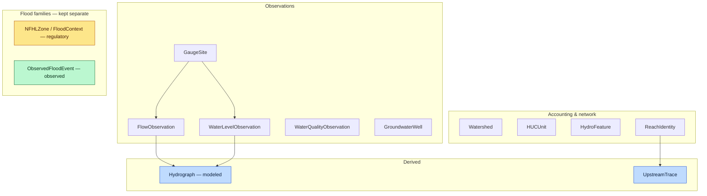

<!-- [KFM_META_BLOCK_V2]
doc_id: kfm://doc/domains/hydrology/object-families
title: Hydrology — Object Families
type: standard
version: v1
status: draft
owners: <hydrology lane steward> + <docs steward>   # placeholders — resolve via CODEOWNERS
created: 2026-06-06
updated: 2026-06-06
policy_label: public
contract_version: "3.0.0"   # pinned per ai-build-operating-contract.md v3.0
related:
  - ai-build-operating-contract.md
  - directory-rules.md
  - docs/domains/hydrology/README.md
  - docs/domains/hydrology/INDEX.md
  - docs/domains/hydrology/GLOSSARY.md
  - docs/domains/hydrology/identity-model.md
  - docs/domains/hydrology/DATA_LIFECYCLE.md
  - docs/domains/hydrology/FILE_SYSTEM_PLAN.md
  - docs/domains/hydrology/SOURCE_FAMILIES.md
  - contracts/domains/hydrology/
  - schemas/contracts/v1/domains/hydrology/
tags: [kfm, domain, hydrology, object-families, contracts, governance]
notes:
  - Object-family spine and the three Atlas §E columns (Purpose, Identity rule, Temporal handling) are CONFIRMED doctrine; every concrete field/attribute below is INFERRED field realization (PROPOSED) unless tied to a stated invariant.
  - The Atlas §2.2 spine list omits UpstreamTrace and Flood Context that §B/§E include — surfaced as an open question, not smoothed.
  - Detailed semantics per object belong in contracts/domains/hydrology/*.md; machine shape in schemas/contracts/v1/domains/hydrology/. This doc is the lane's object catalog and index into both.
  - No mounted repo this session; all path/field claims are PROPOSED or NEEDS VERIFICATION.
[/KFM_META_BLOCK_V2] -->

# 💧 Hydrology — Object Families

> The catalog of every object family the hydrology lane owns: what each represents, how its identity is formed, how its times stay distinct, the source roles it may carry, its sensitivity posture, and where its meaning and shape live. The companion to [`GLOSSARY.md`](./GLOSSARY.md) (term definitions) and [`identity-model.md`](./identity-model.md) (the identity machinery).

**Status:** draft · **Owners:** `<hydrology lane steward>` + `<docs steward>` · **Contract:** `CONTRACT_VERSION = "3.0.0"` · **Last updated:** 2026-06-06

---

## Contents

- [1. Purpose & how to read this catalog](#1-purpose--how-to-read-this-catalog)
- [2. The object-family spine](#2-the-object-family-spine)
- [3. Shared invariants (every family)](#3-shared-invariants-every-family)
- [4. Accounting & network families](#4-accounting--network-families)
- [5. Observation families](#5-observation-families)
- [6. Flood families (the separation that must hold)](#6-flood-families-the-separation-that-must-hold)
- [7. Derived families](#7-derived-families)
- [8. Cross-lane link objects](#8-cross-lane-link-objects)
- [9. Object → home crosswalk](#9-object--home-crosswalk)
- [10. Open questions](#10-open-questions)
- [11. Related docs](#11-related-docs)

---

## 1. Purpose & how to read this catalog

This is the hydrology lane's **object catalog** — one entry per owned object family, expanding the Atlas §E table into a usable reference. It sits between [`GLOSSARY.md`](./GLOSSARY.md) (one-line term meanings) and the per-object `contracts/domains/hydrology/*.md` files (full semantics). It does **not** define machine shape — that lives in `schemas/contracts/v1/domains/hydrology/` — and it enforces nothing; it indexes.

> [!IMPORTANT]
> **What is CONFIRMED vs PROPOSED here.** The Atlas states three things for every hydrology object: its **Purpose** ("Represents X evidence or released derivative within Hydrology"), its **Identity rule** (PROPOSED basis: `source id + object role + temporal scope + normalized digest`), and its **Temporal handling** (CONFIRMED: source / observed / valid / retrieval / release / correction times stay distinct where material). Those three columns are **CONFIRMED doctrine** [DOM-HYD §E]. **Every concrete attribute below** — field names, code values, digit counts, identifiers — is **INFERRED field realization (PROPOSED)** drawn from standard hydrology usage and the sibling docs, not Atlas-stated, unless it restates a named invariant (e.g., NFHL = regulatory only). Treat the per-object "Key attributes" as design intent pending schema realization.

## 2. The object-family spine

**CONFIRMED object-family spine / PROPOSED implementation** [DOM-HYD §B, §E; Atlas §2.2]. The lane owns:

`Watershed` · `HUCUnit` · `HydroFeature` · `ReachIdentity` · `GaugeSite` · `FlowObservation` · `WaterLevelObservation` · `WaterQualityObservation` · `GroundwaterWell` · `NFHLZone` / `FloodContext` · `ObservedFloodEvent` · `Hydrograph` · `UpstreamTrace`.

> [!NOTE]
> **Spine inconsistency (surfaced, not smoothed).** The Atlas §B scope list and §E object table include `UpstreamTrace` and `FloodContext`; the §2.2 cross-domain spine list omits both (it stops at `Hydrograph`). This catalog treats all thirteen as owned (per §B/§E, the lane-specific sources) and flags the §2.2 omission as an open question (§10, `OQ-HYD-OBJ-01`).

## 3. Shared invariants (every family)

Every entry in this catalog carries these, so they are stated once here rather than repeated per object [DOM-HYD §E] [Atlas §24.1]:

- **Purpose form.** Each object "represents *X* evidence or a released derivative within Hydrology" — it is never raw bytes; it is an admitted, role-tagged, time-scoped claim.
- **Identity rule (PROPOSED basis).** `source_id + object_role + temporal_scope + normalized_digest`. Full machinery: [`identity-model.md`](./identity-model.md).
- **Temporal handling (CONFIRMED).** Source / observed / valid / retrieval / release / correction times stay distinct where material; collapsing them is a correctness failure.
- **Source role (CONFIRMED vocabulary).** One of the canonical seven — `observed / regulatory / modeled / aggregate / administrative / candidate / synthetic` — **fixed at admission, never upgraded by promotion**. The Atlas source table assigns role "as the source role requires," so a family's role travels with each admitted descriptor, not with the family name.
- **Cite-or-abstain.** A public claim about any object resolves an `EvidenceRef` to an `EvidenceBundle`, or the surface abstains.

The per-object sections below add only what is **distinctive** to each family (its typical identity anchor, role, sensitivity, and the field-realization intent).

## 4. Accounting & network families

These define *where* water is accounted and *how* the network connects. Typically authority/context geometry; vintage-sensitive.

### Watershed
- **Purpose.** A drainage area whose surface flow converges to a common outlet.
- **Typical identity anchor (PROPOSED).** WBD snapshot + HUC nesting.
- **Key attributes (INFERRED/PROPOSED).** outlet reference, parent/child HUC nesting, area, `wbd_snapshot`.
- **Role / sensitivity.** authority-geometry / context; public-safe; vintage tracked.

### HUCUnit
- **Purpose.** A Watershed Boundary Dataset hydrologic unit (HUC2 … HUC12).
- **Typical identity anchor (PROPOSED).** HUC code + `wbd_snapshot`.
- **Key attributes (INFERRED/PROPOSED).** `huc_code`; for HUC12, a 12-digit string; level; parent HUC; `wbd_snapshot`. *(The 12-digit rule is a standard-usage inference, not Atlas-stated.)*
- **Role / sensitivity.** authority-geometry / context; public-safe; **vintage MUST NOT be silently mixed**.

### HydroFeature
- **Purpose.** A surface-water network feature — stream, lake, wetland, or reservoir.
- **Typical identity anchor (PROPOSED).** NHDPlus version (`v2.1` / `HR` / `3DHP`) + feature identifier.
- **Key attributes (INFERRED/PROPOSED).** feature class, geometry, `nhdplus_version`. Distinguish from `ReachIdentity` (which is the *stable reach identity*, not the generic feature).
- **Role / sensitivity.** authority-network / context; public-safe; version-tracked.

### ReachIdentity
- **Purpose.** The stable identity of a flowline reach across vintages.
- **Typical identity anchor (PROPOSED).** NHDPlus permanent identifier + reachcode + version.
- **Key attributes (INFERRED/PROPOSED).** `permanent_identifier`, `reachcode`, `nhdplus_version`, `vpuid`; VAAs **labeled model-derived**, never observed.
- **Role / sensitivity.** authority-network; public-safe. **Ambiguous reach identity → ABSTAIN, never a guess** (a CONFIRMED ABSTAIN trigger).

## 5. Observation families

Direct, time-stamped, in-situ readings. **Observed** role; provisional/final status preserved; never imply emergency authority.

### GaugeSite
- **Purpose.** A monitoring-location identity (e.g., USGS NWIS station) and its metadata. The site is the identity; readings are separate objects.
- **Typical identity anchor (PROPOSED).** NWIS site number (`site_no`).
- **Key attributes (INFERRED/PROPOSED).** site number, name, location, parameter list, operator.
- **Role / sensitivity.** observed (site of record); public-safe.

### FlowObservation
- **Purpose.** A time-stamped discharge / streamflow observation.
- **Typical identity anchor (PROPOSED).** NWIS series + parameter code; instant or aggregation window.
- **Key attributes (INFERRED/PROPOSED).** `parameter_code` (e.g., `00060` discharge), value, `unit`, `qualifier`, `no_data`, observed_time, provisional/final state.
- **Role / sensitivity.** observed; public-safe; **never a forecast** (that is `Hydrograph`/modeled).

### WaterLevelObservation
- **Purpose.** A time-stamped gauge-height / stage observation.
- **Typical identity anchor (PROPOSED).** NWIS series + parameter code (e.g., `00065` gauge height).
- **Key attributes (INFERRED/PROPOSED).** value, unit, qualifier, no_data, observed_time, provisional/final state.
- **Role / sensitivity.** observed; public-safe.

### WaterQualityObservation
- **Purpose.** A parameter/value/unit/qualifier water-quality measurement.
- **Typical identity anchor (PROPOSED).** water-quality program + station + characteristic.
- **Key attributes (INFERRED/PROPOSED).** characteristic, method, detection/reporting limits, units, qualifiers, sampling window.
- **Role / sensitivity.** observed; **sensitive joins fail closed** (Atlas §D); rights vary by program (NEEDS VERIFICATION).

### GroundwaterWell
- **Purpose.** A well identity with screened-interval context and level observations.
- **Typical identity anchor (PROPOSED).** state / NWIS well registry id.
- **Key attributes (INFERRED/PROPOSED).** well id, completion/screened interval, level observations.
- **Role / sensitivity.** observed; **review-required** — private-property / well-owner implications; private-well joins fail closed; generalize or redact precise location with a `RedactionReceipt`.

## 6. Flood families (the separation that must hold)

> [!WARNING]
> **CONFIRMED non-negotiable.** Regulatory flood context (`NFHLZone` / `FloodContext`), observed inundation (`ObservedFloodEvent`), modeled forecast (`Hydrograph`), and emergency warnings (Hazards / official sources) are **four distinct truth classes**. Collapsing any into another fails closed. [DOM-HYD §B] [Atlas §24.1.2]

### NFHLZone / FloodContext
- **Purpose.** A FEMA National Flood Hazard Layer regulatory flood-hazard area (and the contextual framing of a location). **Regulatory determination, not a hydrologic event.**
- **Typical identity anchor (PROPOSED).** NFHL panel (`DFIRM_ID`) + `VERSION_ID` + effective date.
- **Key attributes (INFERRED/PROPOSED).** zone code, `DFIRM_ID`, `VERSION_ID`, `EFFECTIVE_DATE`, effective interval (valid_time).
- **Role / sensitivity.** **regulatory only**; public; **DENY** if framed as observed inundation or forecast.

### ObservedFloodEvent
- **Purpose.** Historical or sourced inundation evidence (high-water marks, imagery footprints).
- **Typical identity anchor (PROPOSED).** historical/observed source family + event interval.
- **Key attributes (INFERRED/PROPOSED).** event identity, geometry vintage, source-role, public-safe transform record.
- **Role / sensitivity.** observed (or `modeled` when reconstructed — labeled as such); **never NFHL-derived**.

## 7. Derived families

Projections over admitted objects. Not new observations; lineage and bounds travel with them.

### Hydrograph
- **Purpose.** A derived projection of discharge or stage over time.
- **Typical identity anchor (PROPOSED).** composition of underlying observation objects (inherited temporal scope).
- **Key attributes (INFERRED/PROPOSED).** series reference, model identity, run receipt, uncertainty bounds.
- **Role / sensitivity.** **modeled** — carries model identity + run receipt + bounds; **never relabeled observed**.

### UpstreamTrace
- **Purpose.** A network-traversal projection (upstream/downstream reach set).
- **Typical identity anchor (PROPOSED).** seed `ReachIdentity` + NHDPlus version; inherited scope.
- **Key attributes (INFERRED/PROPOSED).** seed reach, traversal direction, resolved reach set, `nhdplus_version`.
- **Role / sensitivity.** derived; depends on admitted network identity; ABSTAIN if the seed reach identity is ambiguous.

## 8. Cross-lane link objects

These name the *seam* to a neighboring lane. The link belongs to hydrology; the linked object's identity stays with its owning lane (cross-lane joins are inference-risk multipliers, ADR-S-14). [DOM-HYD §F]

| Link object | Neighboring lane | Hydrology does **not** own |
|---|---|---|
| `AquiferObservation` | Geology | aquifer geometry, hydrogeology, lithology |
| `WaterUseLink` | Agriculture | crop / yield / withdrawal claims |
| `IrrigationLink` | Agriculture | irrigation administration |
| `DroughtLink` | Atmosphere / Hazards | observed/modeled atmospheric truth; hazard-event truth |

> [!NOTE]
> `AquiferObservation`, `WaterUseLink`, `DroughtLink`, and `IrrigationLink` appear in the Atlas §A scope language ("drought and irrigation links") and the sibling docs, but **not** in the §E object table. They are treated here as lane link objects (PROPOSED), distinct from the twelve/thirteen core families.

## 9. Object → home crosswalk

**PROPOSED** [DIRRULES §12]. Where each family's meaning, shape, and instances live. The shared `SourceDescriptor` schema is **not** a hydrology object — it lives at `schemas/contracts/v1/source/source-descriptor.json` (`source/` vs `sources/` CONFLICTED, ADR-0001).

Show the object → home crosswalk

| Object family | Meaning (`contracts/`) | Shape (`schemas/contracts/v1/domains/hydrology/`) | Default role |
|---|---|---|---|
| Watershed | `watershed.md` | `watershed.schema.json` | authority-geometry |
| HUCUnit | `huc_unit.md` | `huc_unit.schema.json` | authority-geometry |
| HydroFeature | `hydro_feature.md` | `hydro_feature.schema.json` | authority-network |
| ReachIdentity | `reach_identity.md` | `reach_identity.schema.json` | authority-network |
| GaugeSite | `gauge_site.md` | `gauge_site.schema.json` | observed |
| FlowObservation | `flow_observation.md` | `flow_observation.schema.json` | observed |
| WaterLevelObservation | `water_level_observation.md` | `water_level_observation.schema.json` | observed |
| WaterQualityObservation | `water_quality_observation.md` | `water_quality_observation.schema.json` | observed |
| GroundwaterWell | `groundwater_well.md` | `groundwater_well.schema.json` | observed (review-required) |
| NFHLZone / FloodContext | `nfhl_zone.md` | `nfhl_zone.schema.json` | regulatory |
| ObservedFloodEvent | `observed_flood_event.md` | `observed_flood_event.schema.json` | observed / modeled |
| Hydrograph | `hydrograph.md` | `hydrograph.schema.json` | modeled |
| UpstreamTrace | `upstream_trace.md` | `upstream_trace.schema.json` | derived |
| *(crosswalk)* COMID↔HUC12 row | `comid_huc12_crosswalk.md` | `comid_huc12_crosswalk.schema.json` *(or `crosswalks/` — OPEN)* | — |

## 10. Open questions

| ID | Item | Status |
|---|---|---|
| OQ-HYD-OBJ-01 | Atlas §2.2 spine omits `UpstreamTrace` and `FloodContext` that §B/§E include — reconcile the canonical spine count (12 vs 13). | OPEN |
| OQ-HYD-OBJ-02 | Are `AquiferObservation` / `WaterUseLink` / `DroughtLink` / `IrrigationLink` first-class object families or link records only? (Not in §E.) | OPEN |
| OQ-HYD-OBJ-03 | All per-object "Key attributes" are INFERRED field realization — confirm against the schemas once authored. | NEEDS VERIFICATION |
| OQ-HYD-OBJ-04 | `SourceDescriptor` schema path `source/` vs `sources/`. | CONFLICTED (ADR-0001) |
| OQ-HYD-OBJ-05 | Crosswalk schema home `domains/hydrology/` vs `crosswalks/`. | OPEN |
| OQ-HYD-OBJ-06 | Whether `FloodContext` is a distinct family or an aspect of `NFHLZone` (Atlas pairs them as "NFHLZone / Flood Context"). | OPEN |

## 11. Related docs

- [`README.md`](./README.md) — lane landing page.
- [`INDEX.md`](./INDEX.md) — lane navigation hub.
- [`GLOSSARY.md`](./GLOSSARY.md) — one-line term definitions for these families.
- [`identity-model.md`](./identity-model.md) — the identity rule and `spec_hash` machinery.
- [`SOURCE_FAMILIES.md`](./SOURCE_FAMILIES.md) — the source families that feed these objects (*PROPOSED, not yet authored*).
- [`FILE_SYSTEM_PLAN.md`](./FILE_SYSTEM_PLAN.md) — where the `contracts/` and `schemas/` files live.
- [`DATA_LIFECYCLE.md`](./DATA_LIFECYCLE.md) — how these objects move `Pre-RAW → PUBLISHED`.
- `contracts/domains/hydrology/*.md` — full per-object semantics (*PROPOSED*).
- `schemas/contracts/v1/domains/hydrology/*.schema.json` — machine shape (*PROPOSED*).
- [`directory-rules.md`](../../../directory-rules.md) · [`ai-build-operating-contract.md`](../../../ai-build-operating-contract.md) — placement law; `CONTRACT_VERSION = "3.0.0"`.

---

Status: draft · Version: v1 · Contract: CONTRACT_VERSION = "3.0.0" · Lane: hydrology · Last updated: 2026-06-06 · Owners: `<hydrology lane steward>` + `<docs steward>`
