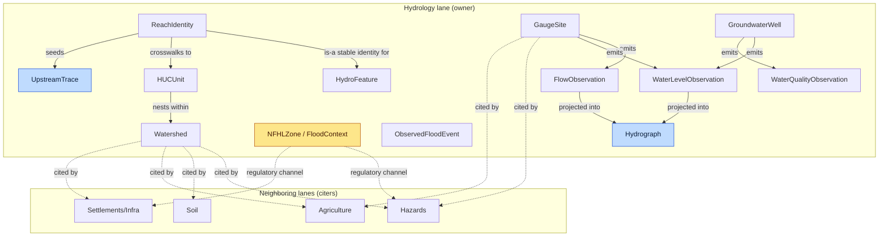

<!-- [KFM_META_BLOCK_V2]
doc_id: kfm://doc/domains/hydrology/object-map
title: Hydrology — Object Map (Relationships)
type: standard
version: v1
status: draft
owners: <hydrology lane steward> + <docs steward>   # placeholders — resolve via CODEOWNERS
created: 2026-06-06
updated: 2026-06-06
policy_label: public
contract_version: "3.0.0"   # pinned per ai-build-operating-contract.md v3.0
related:
  - ai-build-operating-contract.md
  - directory-rules.md
  - docs/domains/hydrology/README.md
  - docs/domains/hydrology/INDEX.md
  - docs/domains/hydrology/OBJECT_FAMILIES.md
  - docs/domains/hydrology/GLOSSARY.md
  - docs/domains/hydrology/identity-model.md
tags: [kfm, domain, hydrology, object-map, relationships, cross-lane, governance]
notes:
  - SCOPE — this is the object RELATIONSHIP map (edges, cardinality, direction, cross-lane citations). Per-family attributes live in OBJECT_FAMILIES.md; term meanings in GLOSSARY.md; identity machinery in identity-model.md. This doc does not restate them.
  - Cross-lane edges (§4) are CONFIRMED from Atlas §F and §24.14 (relation type + citing domains + sensitivity tier). Intra-lane edges (§3) are INFERRED from object purposes — labeled PROPOSED.
  - No mounted repo this session; all field/path/cardinality claims are PROPOSED or NEEDS VERIFICATION.
[/KFM_META_BLOCK_V2] -->

# 💧 Hydrology — Object Map (Relationships)

> How the hydrology object families **connect**: which object depends on which, the direction and cardinality of each edge, and which neighboring lanes cite hydrology objects (and under what constraint). This is the lane's relationship/ERD view — the **edges**, not the families. For per-family attributes see [`OBJECT_FAMILIES.md`](./OBJECT_FAMILIES.md); for term meanings see [`GLOSSARY.md`](./GLOSSARY.md).

**Status:** draft · **Owners:** `<hydrology lane steward>` + `<docs steward>` · **Contract:** `CONTRACT_VERSION = "3.0.0"` · **Last updated:** 2026-06-06

---

## Contents

- [1. Purpose & scope (what this maps, what it does not)](#1-purpose--scope-what-this-maps-what-it-does-not)
- [2. The relationship graph](#2-the-relationship-graph)
- [3. Intra-lane edges](#3-intra-lane-edges)
- [4. Cross-lane edges (who cites hydrology)](#4-cross-lane-edges-who-cites-hydrology)
- [5. Edge governance rules](#5-edge-governance-rules)
- [6. Edges that must NOT exist](#6-edges-that-must-not-exist)
- [7. Open questions](#7-open-questions)
- [8. Related docs](#8-related-docs)

---

## 1. Purpose & scope (what this maps, what it does not)

This document maps the **relationships between hydrology objects** — the edges of the lane's object graph. It answers: *what depends on what, in which direction, with what cardinality, and which other lanes are allowed to cite a hydrology object.* It is deliberately **distinct from** the per-family catalog.

| This doc (`OBJECT_MAP.md`) | [`OBJECT_FAMILIES.md`](./OBJECT_FAMILIES.md) |
|---|---|
| **Edges** — relationships, direction, cardinality, cross-lane citations | **Nodes** — per-family purpose, identity anchor, attributes, sensitivity |
| Answers "how do these connect?" | Answers "what is each one?" |

> [!IMPORTANT]
> **CONFIRMED vs INFERRED here.** The **cross-lane edges** in §4 are CONFIRMED doctrine — they come from the Atlas §F cross-lane relations table and the §24.14 Master Object Family × Domain Reference Matrix (relation type, citing domains, sensitivity tier). The **intra-lane edges** in §3 are **INFERRED (PROPOSED)** — the Atlas defines each object's purpose but does not publish an intra-lane ERD, so the dependency edges below are derived from the object purposes and the identity rule, not Atlas-stated. Cardinalities are PROPOSED throughout. [DOM-HYD §F] [Atlas §24.14]

## 2. The relationship graph

> [!NOTE]
> Solid arrows are **intra-lane dependency edges** (INFERRED, §3). Dashed arrows are **cross-lane citation edges** (CONFIRMED, §4). `NFHLZone` and `ObservedFloodEvent` are intentionally **not** connected to each other — that separation is the lane's defining invariant (§6).

## 3. Intra-lane edges

**INFERRED / PROPOSED.** Derived from object purposes; cardinalities are design intent pending schema realization. "Dependency direction" reads *from → to* as "depends on / derives from."

| From | Edge | To | Cardinality (PROPOSED) | Basis |
|---|---|---|---|---|
| `HUCUnit` | nests within | `HUCUnit` / `Watershed` | many → 1 (parent HUC) | HUC nesting (HUC12 ⊂ HUC10 ⊂ … ) |
| `ReachIdentity` | is the stable identity for | `HydroFeature` | 1 → 1..n | reach identity vs generic feature |
| `ReachIdentity` | crosswalks to | `HUCUnit` (HUC12) | n → 1 (or ranked n→m for braided) | COMID↔HUC12 crosswalk; see [`identity-model.md`](./identity-model.md) §6 |
| `GaugeSite` | emits | `FlowObservation` | 1 → many | site is identity; readings are separate objects |
| `GaugeSite` | emits | `WaterLevelObservation` | 1 → many | same |
| `GroundwaterWell` | emits | `WaterLevelObservation` | 1 → many | well level readings |
| `GroundwaterWell` | emits | `WaterQualityObservation` | 1 → many | well sampling |
| `FlowObservation` / `WaterLevelObservation` | projected into | `Hydrograph` | many → 1 | derived series (modeled) |
| `ReachIdentity` | seeds | `UpstreamTrace` | 1 → 1 (resolves a reach set) | network traversal |

> [!CAUTION]
> **The crosswalk edge is the lane's highest-risk join.** `ReachIdentity → HUCUnit` (COMID↔HUC12) is deterministic only via the fallback ladder, carries an `alignment_score`, and **ABSTAINs** on ambiguous/braided geometry. It is the one intra-lane edge with its own validator and policy bundle (home CONFLICTED — ADR-S-CWV-01). Detail: [`identity-model.md`](./identity-model.md).

## 4. Cross-lane edges (who cites hydrology)

**CONFIRMED.** Hydrology **owns** these objects; neighboring lanes **cite** them. Every edge must preserve ownership, source role, sensitivity, and `EvidenceBundle` support (Atlas §F constraint). Sensitivity tiers and citing domains are from the §24.14 reference matrix.

| Hydrology object | Cited by (CONFIRMED) | Relation / context | Sensitivity tier |
|---|---|---|---|
| `HUC` / `Watershed` / `Reach` | Soil, Habitat, Fauna, Flora, Agriculture, Hazards, Settlements, Frontier Matrix | spatial accounting + network identity anchor | T0 [Atlas §24.14] |
| `GaugeSite` / `FlowObservation` | Hazards, Agriculture, Frontier Matrix | observed water context | T0 [Atlas §24.14] |
| `NFHLZone` (regulatory channel) | Hazards, Settlements, UI | **regulatory** flood context only | T0 (regulatory) [Atlas §24.14] |

**By neighboring lane** (Atlas §F relation types):

| Related lane | Relation type (CONFIRMED) | Hydrology must NOT… |
|---|---|---|
| **Hazards** | flood, drought, warning, declaration, resilience context | claim alert/life-safety authority; collapse NFHL into observed flood |
| **Soil** | soil moisture, hydrologic group, infiltration, runoff | own pedons/horizons or `SoilMapUnit` identity |
| **Agriculture** | irrigation, drought stress, crop-water context | own crop/yield claims |
| **Settlements / Infrastructure** | floodplain, bridges, dams, utilities, exposure context | publish critical-asset detail without sensitivity review |

> [!NOTE]
> The Atlas §F hydrology table lists exactly these four neighboring lanes. The §24.14 matrix additionally records Habitat, Fauna, Flora, and Frontier Matrix as **citers** of `HUC/Watershed/Reach` — those are citation edges (they consume hydrology spatial identity) rather than §F "relation types." Both are shown; the distinction is preserved, not merged.

## 5. Edge governance rules

Every edge in this map — intra- or cross-lane — obeys these (CONFIRMED) [DOM-HYD §F] [Atlas §24.1]:

- **Ownership preserved.** A citing lane never re-identifies a hydrology object; it references it. Hydrology never re-identifies a Soil/Agriculture/Hazards object.
- **Source role travels the edge.** An `observed` `FlowObservation` cited by Hazards is still `observed`; a `regulatory` `NFHLZone` cited by Settlements is still `regulatory`. Roles are fixed at admission, never upgraded by being cited.
- **Sensitivity travels the edge.** A `GroundwaterWell` (review-required) does not become public by being cited; the most restrictive tier on the edge governs.
- **EvidenceBundle support required.** A cross-lane citation resolves an `EvidenceRef` to an `EvidenceBundle`, or the citing surface abstains.
- **Cross-lane joins are inference-risk multipliers** (ADR-S-14) — a join is not a new fact; it inherits the weakest evidence and the most restrictive policy of its endpoints.

## 6. Edges that must NOT exist

> [!WARNING]
> These are **forbidden edges** — the relationship-map statement of the lane's anti-collapse invariants (Atlas §24.1.2). Each is a fail-closed DENY.

| Forbidden edge | Why | Outcome |
|---|---|---|
| `NFHLZone` → `ObservedFloodEvent` (as "same as") | regulatory ≠ observed | DENY |
| `NFHLZone` / `Hydrograph` → emergency warning | KFM is not an alert authority | DENY + redirect to official sources |
| `Hydrograph` (modeled) → `FlowObservation` (as "observed") | modeled ≠ observed | DENY at publish / ABSTAIN at AI |
| `HUCUnit`(vintage A) ↔ `HUCUnit`(vintage B) silently merged | vintage mixing | quarantine-class FAIL |
| any hydrology object → another lane's canonical identity (re-identification) | ownership violation | DENY |

## 7. Open questions

| ID | Item | Status |
|---|---|---|
| OQ-HYD-MAP-01 | Intra-lane cardinalities (§3) are INFERRED — confirm against the schemas once authored. | NEEDS VERIFICATION |
| OQ-HYD-MAP-02 | Is `FloodContext` a node distinct from `NFHLZone`, and does it take its own edges? (Atlas pairs them.) | OPEN |
| OQ-HYD-MAP-03 | Does `ReachIdentity → HUCUnit` become `ReachIdentity → 3DHP id → HUCUnit` once 3DHP supersedes v2.1? | CONFLICTED (corpus-open) |
| OQ-HYD-MAP-04 | Cross-lane link objects (`AquiferObservation`, `WaterUseLink`, `DroughtLink`, `IrrigationLink`) — are they edges in this map or nodes in OBJECT_FAMILIES? | OPEN (cross-ref OQ-HYD-OBJ-02) |
| OQ-HYD-MAP-05 | §F lists 4 neighboring lanes; §24.14 adds Habitat/Fauna/Flora/Frontier as citers — confirm the citer set is complete. | NEEDS VERIFICATION |

## 8. Related docs

- [`OBJECT_FAMILIES.md`](./OBJECT_FAMILIES.md) — **per-family nodes** (this map's companion; attributes live there, not here).
- [`GLOSSARY.md`](./GLOSSARY.md) — term meanings for every node.
- [`identity-model.md`](./identity-model.md) — identity rule + the COMID↔HUC12 crosswalk edge in detail.
- [`README.md`](./README.md) · [`INDEX.md`](./INDEX.md) — lane landing page / navigation.
- [`DATA_LIFECYCLE.md`](./DATA_LIFECYCLE.md) — how objects (and their edges) move `Pre-RAW → PUBLISHED`.
- [`MAP_UI_CONTRACTS.md`](./MAP_UI_CONTRACTS.md) — how these objects and edges surface on the map.
- [`directory-rules.md`](../../../directory-rules.md) · [`ai-build-operating-contract.md`](../../../ai-build-operating-contract.md) — placement law; `CONTRACT_VERSION = "3.0.0"`.

---

Status: draft · Version: v1 · Contract: CONTRACT_VERSION = "3.0.0" · Lane: hydrology · Object **relationship** map (companion to OBJECT_FAMILIES.md) · Last updated: 2026-06-06 · Owners: `<hydrology lane steward>` + `<docs steward>`
