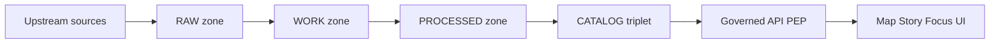

<!-- [KFM_META_BLOCK_V2]
doc_id: kfm://doc/9d6e2c2f-978b-46d5-a2d2-2de7b0c49b8d
title: Hydrology Pipelines
type: standard
version: v1
status: draft
owners: ["@kfm-hydrology","@bartytime4life"]
created: 2026-03-04
updated: 2026-03-04
policy_label: public
related: ["docs/domains/hydrology/README.md","docs/standards/GOVERNANCE.md","docs/standards/PROMOTION_CONTRACT.md"]
tags: ["kfm","hydrology","pipelines","stac","dcat","prov"]
notes: ["Evidence tags in this doc reflect what is supported by KFM design/docs bundles; repo implementation must be verified separately before marking any pipeline 'implemented'."]
[/KFM_META_BLOCK_V2] -->

# Hydrology Pipelines
Governed, evidence-first pipeline inventory + runbooks for hydrology datasets and derived hydrologic layers.

> **Status:** draft (GOVERNED surface)  
> **Owners:** @kfm-hydrology, @bartytime4life  
> **Policy label:** public  
> **Last updated:** 2026-03-04  
>
> **Badges (TODO):**     
>
> **Quick links:** [Scope](#scope) · [Truth path](#truth-path-and-trust-membrane) · [Pipeline inventory](#pipeline-inventory) · [Shared contracts](#shared-contracts-for-hydrology-pipelines) · [Runbooks](#pipeline-runbooks) · [Gates](#promotion-gates-and-definition-of-done) · [Appendix](#appendix)

---

## Scope

This file defines **how hydrology pipelines must behave in KFM**:
- what inputs are acceptable,
- what outputs must be produced (artifacts + catalogs + receipts),
- what validations are required,
- and how promotion to governed surfaces is gate-checked.

### Evidence discipline

All non-trivial claims below are labeled:

| Label | Meaning in this file | How to make it stronger |
|---|---|---|
| **CONFIRMED** | Supported by a KFM governance/design document in the current evidence bundle. | Add direct repo proof (paths, tests, CI runs) and link it. |
| **PROPOSED** | A recommended/target pattern or described in idea/spec docs, but **repo existence is not verified** here. | Verify in-repo code + runbook + passing CI, then upgrade to CONFIRMED. |
| **UNKNOWN** | Not found in the evidence bundle; we are guessing or leaving a placeholder. | Add the missing spec/runbook/evidence and link it. |

---

## Where it fits

### Truth path and trust membrane

**CONFIRMED:** Hydrology pipelines must follow the KFM truth path and cross the policy boundary only through governed APIs (no direct client access to storage/DB).  



**Rule:** the “canonical truth” is the object-store artifacts + catalogs + provenance; DB indexes and tiles are rebuildable projections.  
(See: “canonical vs rebuildable stores” principle in the KFM bundles.)  

---

## Acceptable inputs

**CONFIRMED (policy intent):** Inputs must be acquired immutably into **RAW** with checksums, plus a license/terms snapshot (if applicable).  
Hydrology-domain examples:

- **USGS NWIS** station metadata + instantaneous values (IV) + daily values (DV) (**PROPOSED**)
- **USGS 3DEP / DEM** rasters for Kansas / region (**PROPOSED**)
- **KDHE water quality measurements and reporting inputs** for Clean Water Act §303(d) workflows (**PROPOSED**)
- **Domain cross-links** (hazards floods, drought, irrigation infrastructure) as joinable reference sets (**PROPOSED**)

---

## Exclusions

These do **not** belong in hydrology pipelines (put them elsewhere or block promotion):

- Direct writes from UI/clients to storage/DB (**CONFIRMED** invariant)
- Publishing anything without DCAT+STAC+PROV cross-links (**CONFIRMED** gate)
- Unlicensed / unclear rights datasets promoted to PUBLISHED (**CONFIRMED** gate)
- Sensitive ecological or infrastructure locations without a policy label + redaction/generalization plan (**CONFIRMED** gate)
- “Scenario model outputs” (SWAT/MODFLOW) unless reproducibility, provenance, and licensing are fully specified (**PROPOSED**)

---

## Pipeline inventory

> NOTE: “Repo path” here is **PROPOSED** unless explicitly verified in-repo.
> “Status” is **documented status**, not runtime truth.

| Pipeline ID | Purpose | Typical cadence | Primary PROCESSED artifacts | Catalog outputs | Repo path | Evidence label | Repo verification |
|---|---|---:|---|---|---|---|---|
| `hydrology.terrain_dem_derivatives` | DEM → sinks filled → flow direction/accumulation → stream network → watersheds → distance-to-water → zonal stats | batch (on DEM refresh) | COG rasters, GeoParquet summaries | STAC (rasters + tables), DCAT dataset, PROV bundle | `src/pipelines/hydrology/terrain_etl/` | **PROPOSED** | **UNKNOWN** (verify path, tests, sample outputs) |
| `hydrology.nwis_watcher` | USGS NWIS IV/DV ingestion → normalize → sanity checks → STAC time-series items | hourly+daily | Parquet time-series, station metadata, optional CSV snapshots | STAC time-series items, DCAT, PROV | `src/pipelines/hydrology/nwis_watcher/` | **PROPOSED** | **UNKNOWN** (verify README/spec + runnable target) |
| `hydrology.kdhe_303d_etl` | Water quality → Clean Water Act §303(d) reporting-ready outputs | annual/periodic | GeoParquet/GeoJSON sites/segments, tabular aggregates | STAC vectors/tables, DCAT, PROV | `docs/domains/hydrology/kdhe/` + `src/pipelines/hydrology/kdhe_303d/` | **PROPOSED** | **UNKNOWN** |
| `hydrology.graph_sync` | Hydrology artifacts → Neo4j entities and relationships | on publish | graph ingest batches, linkmaps | PROV links to graph projection run | `src/indexers/neo4j/hydrology/` | **PROPOSED** | **UNKNOWN** |
| `hydrology.simulation_swat_modflow` | External hydrologic simulators orchestrated as governed runs | on demand | model configs, forcings, outputs, diagnostics | STAC assets + PROV activities | `src/pipelines/hydrology/models/` | **PROPOSED** | **UNKNOWN** |

---

## Proposed directory layout

```text
docs/domains/hydrology/
  PIPELINES.md
  README.md
  kdhe/
    303d-2026-submission.md
src/pipelines/hydrology/
  nwis_watcher/
    README.md
    pipeline.spec.jsonc
    MANIFEST.yaml
    SBOM.spdx.json
  terrain_etl/
    README.md
    pipeline.spec.jsonc
    checks/
```

**Repo-state label:** **UNKNOWN** until verified.

---

## Quickstart

```bash
# PSEUDOCODE: replace with real targets once implemented

# 1) Run the NWIS watcher (small window)
make hydrology-nwis-run WINDOW=72h

# 2) Run terrain derivatives pipeline for a DEM input
make hydrology-terrain-run DEM=data/raw/usgs_3dep/dem.tif

# 3) Validate catalogs + receipts (fail closed)
make hydrology-validate
```

---

## Shared contracts for hydrology pipelines

### Required artifacts per run

**CONFIRMED:** KFM promotion is blocked unless minimum gates are met, including identity/versioning, licensing, sensitivity classification, catalog triplet validation, QA thresholds, and a run receipt/audit record.  
Hydrology pipelines must output the following **at minimum**:

1) **Artifacts (PROCESSED)**
- Geo rasters: **COG** (`image/tiff; application=geotiff; profile=cloud-optimized`)
- Vectors/tables: **GeoParquet** (preferred) or GeoJSON when appropriate
- QA reports: machine-readable JSON + a short human summary

2) **Catalog triplet (CATALOG)**
- **DCAT dataset** (dataset-level discovery, rights, distributions)
- **STAC** collections/items (asset-level spatiotemporal metadata)
- **PROV** bundle (lineage: entities, activities, agents)

3) **Run receipt (AUDIT/EVIDENCE)**
- A compact, deterministic receipt that ties **spec_hash + inputs + outputs + rights + attestations**.

### Run receipt minimum (hydrology)

**PROPOSED:** Use a single-line JSON receipt per run (JSONL-friendly) with at least:

- `dataset_id`, `dataset_version`
- `fetch_time`
- `source_url`
- `http_validators` (ETag, Last-Modified) when upstream is HTTP
- `spec_hash` computed as **RFC 8785 JCS → SHA-256**
- `run_id`, `orchestrator`, `transform_git_sha`
- `artifacts[]` (path + sha256 digest)
- `rights_spdx`
- `attestations[]` (cosign bundle digest, etc.)

Example (shape only; values illustrative):

```json
{"dataset_id":"kfm:hydrology:nwis:ks","dataset_version":"2026-03-04T00:00:00Z","fetch_time":"2026-03-04T00:10:00Z","source_url":"https://waterservices.usgs.gov/nwis/iv/","http_validators":{"etag":"\"...\"","last_modified":"..."},"spec_hash":"jcs:sha256:...","run_id":"dagster:run:...","orchestrator":"dagster","transform_git_sha":"...","artifacts":[{"path":"s3://kfm/processed/hydrology/nwis/2026-03-04/ks_00060.parquet","digest":"sha256:..."}],"rights_spdx":"USGov-PD","attestations":[{"type":"cosign","bundle_digest":"sha256:..."}]}
```

---

## Pipeline runbooks

### `hydrology.nwis_watcher`

**PROPOSED:** A watcher for USGS NWIS that ingests instantaneous (IV) and daily (DV) series for Kansas sites, normalizes station metadata, runs sanity checks, emits **STAC Time-Series Items** and **PROV** lineage.

#### Inputs
- USGS NWIS endpoints (IV/DV)
- Site filter (site list or bbox)
- Parameter codes (e.g., discharge, gage height, groundwater levels)

#### Outputs
- STAC Time-Series Items per (site × parameter × time-window)
- DCAT dataset entries for run aggregates
- PROV activities: fetch, normalize, validate, publish
- Guarantees (PROPOSED): non-negative discharge, monotonic timestamps per series, timezone-aware, idempotent writes, reproducible configs
- Ops controls (PROPOSED): kill-switch + rollback

#### Hydrology-specific QA checks (minimum)
- Schema: required station fields exist (site_id, lat/lon, parameter, time range)
- Time monotonicity per site/parameter
- Non-negative discharge where applicable
- Freshness guard: if upstream “latest” regresses or stalls beyond threshold, quarantine and alert

#### Promotion note
- Do not promote series with failed QA; keep in WORK/QUARANTINE and emit a failure receipt.

---

### `hydrology.terrain_dem_derivatives`

**PROPOSED:** A deterministic terrain/hydrology ETL that processes DEMs to derive hydrologic layers.

#### Core steps (conceptual order)
1) Ingest DEM into RAW (immutable) + checksums
2) Fill sinks / depressions
3) Compute flow direction
4) Compute flow accumulation
5) Derive stream network (threshold-based)
6) Delineate watersheds / basins
7) Compute distance-to-water raster
8) Compute zonal statistics (watershed summaries, proximity summaries)
9) Package outputs as COG (rasters) + GeoParquet (tables)
10) Register in STAC/DCAT + PROV lineage

#### Tooling expectations
- Version-pin geospatial toolchain in pipeline spec (GDAL, WhiteboxTools, etc.)
- Deterministic export options (tiling, compression, overviews) for byte-stability

#### Hydrology-specific QA checks (minimum)
- CRS declared and consistent
- No unexpected nodata expansion
- Reasonable value domains (e.g., accumulation non-negative)
- Watershed polygons are valid geometries (no self-intersections) where relevant
- Checksums are present for every asset

---

### `hydrology.kdhe_303d_etl`

**PROPOSED:** A governed workflow that aggregates water quality measurements into outputs aligned with Kansas Dept. of Health & Environment reporting for Clean Water Act §303(d).

#### Outputs (examples)
- Impairment segments and/or site inventories as GeoParquet/GeoJSON
- Tabular aggregations and supporting evidence tables
- Catalog triplet + receipts

#### QA checks (minimum)
- Required regulatory fields present and typed (domains enforced)
- Provenance to upstream measurement sources preserved
- License and citation obligations captured

---

### `hydrology.simulation_swat_modflow` (advanced)

**PROPOSED:** Orchestrate external models (SWAT, MODFLOW) as strictly governed runs.

**Blocker:** Until a model pipeline has:
- pinned model versions,
- pinned forcing inputs,
- deterministic configuration hashing,
- clear licensing for model outputs,
- and an auditable run receipt + catalogs,

…it must remain **WORK-only** (no promotion).

---

## Orchestration and scheduling

**CONFIRMED (platform intent):** Pipelines should be orchestrated so storage concerns are modular and promotion is policy-gated (fail-closed).  

**PROPOSED hydrology schedules**
- `hydrology.nwis_watcher`: hourly (IV) + nightly (DV backfill)
- `hydrology.terrain_dem_derivatives`: on DEM refresh or quarterly
- `hydrology.kdhe_303d_etl`: annual + ad-hoc refresh when KDHE updates

---

## Promotion gates and Definition of Done

### Promotion gates (A–G)

Hydrology pipelines must pass the same promotion gates as other KFM domains:

- A: Identity + deterministic versioning
- B: Licensing + rights metadata
- C: Sensitivity classification + redaction plan if needed
- D: Catalog triplet validation (DCAT/STAC/PROV cross-links resolve)
- E: QA thresholds met (else quarantine)
- F: Run receipt + audit record present
- G: Release manifest recorded

### DoD checklist for hydrology pipeline PRs

- [ ] Pipeline spec is deterministic and produces a stable `spec_hash`
- [ ] RAW acquisition is immutable and checksummed
- [ ] WORK outputs include QA report JSON + human summary
- [ ] PROCESSED artifacts are in approved formats (COG, GeoParquet)
- [ ] DCAT/STAC/PROV validate and cross-link correctly
- [ ] Receipt JSON exists and includes rights + attestations (or is explicitly deferred with policy exception)
- [ ] Policy tests exist (default deny; redaction obligations enforced)
- [ ] Rollback path documented (kill-switch + revert to previous release manifest)

---

## Operational safety

### Kill switch

**PROPOSED:** Support a repo-controlled kill switch (file flag or secret) that blocks publish/promotion and forces fail-closed behavior for watcher pipelines.

### Rollback

**CONFIRMED (principle):** Rollback must be possible by reverting to the last known-good **release manifest** and rebuilding projections from canonical artifacts.

---

## Appendix

<details>
<summary>Appendix A — What to verify to upgrade PROPOSED → CONFIRMED</summary>

For each pipeline:

1) Confirm repo paths exist:
- `src/pipelines/hydrology/<pipeline>/...`

2) Confirm runnable entrypoints:
- `README.md` includes a real command that works locally
- CI workflow runs pipeline checks in a clean container

3) Confirm produced artifacts + catalogs exist in fixture form:
- sample `data/raw/...`
- sample `data/processed/...`
- sample `data/catalog/...` (DCAT/STAC/PROV)

4) Confirm fail-closed gates:
- break a gate intentionally and verify CI blocks promotion

</details>

<details>
<summary>Appendix B — Suggested hydrology dataset_id patterns (placeholders)</summary>

- `kfm:hydrology:nwis:ks` (USGS NWIS Kansas)
- `kfm:hydrology:dem:3dep` (3DEP DEM inputs)
- `kfm:hydrology:terrain:flow_accumulation:<resolution>` (derived layers)
- `kfm:hydrology:kdhe:303d:<cycle>` (regulatory workflow outputs)

These are placeholders until the controlled vocabulary is defined in `contracts/` and enforced in validators.

</details>

---

_Back to top:_ [↑](#hydrology-pipelines)
