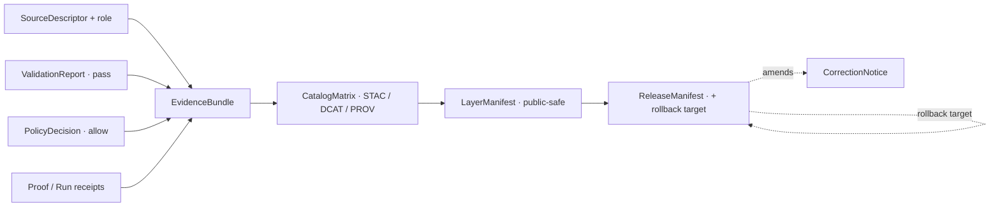

<!-- [KFM_META_BLOCK_V2]
doc_id: kfm://doc/NEEDS_VERIFICATION
title: Hydrology Preservation Matrix
type: standard
version: v1
status: draft
owners: [NEEDS_VERIFICATION — Domain Steward (Hydrology); Source Steward; Docs Steward]
created: 2026-05-18
updated: 2026-05-18
policy_label: public
related:
  - docs/doctrine/lifecycle-law.md
  - docs/doctrine/directory-rules.md
  - docs/doctrine/truth-posture.md
  - docs/doctrine/trust-membrane.md
  - docs/atlases/master-atlas-v1.1/24.1-source-role-anti-collapse.md
  - docs/atlases/master-atlas-v1.1/24.2-receipt-lifecycle-mapping.md
  - docs/atlases/master-atlas-v1.1/24.5-sensitivity-tier-reference.md
  - docs/atlases/master-atlas-v1.1/24.6-pipeline-gate-reference.md
  - docs/domains/hydrology/README.md
  - schemas/contracts/v1/domains/hydrology/
  - policy/domains/hydrology/
tags: [kfm, hydrology, preservation, lifecycle, evidence, receipts, retention]
notes:
  - All implementation paths PROPOSED pending mounted-repo verification.
  - This matrix is navigational; canonical authority is the schema/contract tree
    plus the per-domain dossier (DOM-HYD) and the Master Atlas v1.1.
  - Retention SLAs across the lifecycle are flagged as an open corpus gap
    (see Pass 10 §8.4); this matrix proposes a posture, not numbers.
[/KFM_META_BLOCK_V2] -->

# Hydrology Preservation Matrix

> What the Hydrology lane preserves, at which lifecycle phase, with which receipts, gates, and tier controls — so that every released hydrologic claim resolves to evidence, role, and rollback target.

<!-- Badge row: placeholders; replace targets when CI, registries, and ADRs are confirmed. -->

**Status:** draft · **Owners:** Domain Steward (Hydrology) · Source Steward · Docs Steward · **Updated:** 2026-05-18

---

## Contents

- [1 · Purpose & scope](#1--purpose--scope)
- [2 · How this matrix reads](#2--how-this-matrix-reads)
- [3 · Lifecycle preservation overview](#3--lifecycle-preservation-overview)
- [4 · Source family preservation matrix](#4--source-family-preservation-matrix)
- [5 · Object family preservation matrix](#5--object-family-preservation-matrix)
- [6 · Receipt × lifecycle phase matrix (Hydrology lens)](#6--receipt--lifecycle-phase-matrix-hydrology-lens)
- [7 · Source-role anti-collapse preservation](#7--source-role-anti-collapse-preservation)
- [8 · Sensitivity tier × allowed transforms (Hydrology)](#8--sensitivity-tier--allowed-transforms-hydrology)
- [9 · Temporal-field preservation](#9--temporal-field-preservation)
- [10 · Catalog-closure preservation invariants](#10--catalog-closure-preservation-invariants)
- [11 · Correction, rollback, and tombstone preservation](#11--correction-rollback-and-tombstone-preservation)
- [12 · Verification backlog & open questions](#12--verification-backlog--open-questions)
- [13 · Related docs](#13--related-docs)
- [Appendix A · Notation key](#appendix-a--notation-key)

---

## 1 · Purpose & scope

**Purpose.** This matrix names — in one place — *what the Hydrology lane preserves*, *where it is preserved*, and *which receipts, gates, and tier controls govern its preservation* as material moves through `RAW → WORK / QUARANTINE → PROCESSED → CATALOG / TRIPLET → PUBLISHED`. It is a domain-scoped reading of the cross-cutting doctrine in `[ENCY]`, `[DIRRULES]`, and Master Atlas v1.1 §§24.1–24.6, projected onto the Hydrology lane defined in `[DOM-HYD]`.

**In scope (CONFIRMED doctrine / PROPOSED lane application).** Preservation rules for hydrology source payloads, normalized objects, evidence bundles, receipts, catalog records, layer manifests, release manifests, rollback targets, and correction notices for the object families this lane owns: Watershed, HUCUnit, HydroFeature, ReachIdentity, GaugeSite, FlowObservation, WaterLevelObservation, WaterQualityObservation, GroundwaterWell, AquiferObservation, NFHLZone, Hydrograph, UpstreamTrace, WaterUseLink, DroughtLink, IrrigationLink. `[DOM-HYD]` `[ENCY]`

**Explicitly out of scope.** Emergency alerts and life-safety warnings (Hazards / official-source concern); flood as observed inundation collapsed with regulatory NFHL context (forbidden by source-role anti-collapse); soil/agriculture/geology/infrastructure canonical claims (those domains preserve their own). `[DOM-HYD]` `[DOM-HAZ]` `[ENCY]`

> [!IMPORTANT]
> **Preservation is governance, not storage.** A file ending up under `data/processed/hydrology/...` does not constitute preservation; preservation is the combined presence of source descriptor, transform receipts, validation reports, evidence bundle resolution, policy decision, and (where released) release manifest with rollback target. Promotion is a **governed state transition, not a file move.** `[DIRRULES]` `[ENCY]`

---

## 2 · How this matrix reads

Each preservation row in this document has three axes:

| Axis | Question it answers | Drawn from |
|---|---|---|
| **What** | Which artifact, object, receipt, or record is preserved? | `[DOM-HYD] §E`; `[ENCY] App. C` |
| **Where in the lifecycle** | At which phase(s) is preservation required, and where does the artifact stop being mutable? | Atlas v1.1 §24.6 Pipeline Gate Reference; `[DIRRULES] §9.1` |
| **Under what control** | Which receipts, validators, policies, reviews, and tier rules govern it? | Atlas v1.1 §§24.1, 24.2, 24.5, 24.7; `[ENCY]` |

Cells are populated against the operating invariants of `[ENCY]` §4 (Operating Law) and `[DIRRULES]`. Where this matrix proposes specificity not already present in the corpus (notably: retention durations, specific paths, validator names, route names), it is labeled **PROPOSED** or **NEEDS VERIFICATION** rather than asserted. The most prominent uncodified gap — *retention SLAs across the lifecycle* — is carried forward from Pass 10 §8.4 and surfaced in §12.

> [!NOTE]
> **Authority order.** Where a cell here disagrees with `[DOM-HYD]`, an accepted ADR, or the schema/contract tree under `schemas/contracts/v1/domains/hydrology/` (PROPOSED), those govern and this matrix is filed as a drift entry against itself.

---

## 3 · Lifecycle preservation overview

The diagram below shows the hydrology lane's preservation surface at each lifecycle phase. It reflects CONFIRMED doctrine for the phases and gates; the concrete artifacts shown are PROPOSED applications of `[ENCY]` and `[DIRRULES]` to the Hydrology lane.

```mermaid
flowchart LR
    subgraph RAW["RAW · capture"]
      R1["SourceDescriptor<br/>(role, rights, sensitivity, cadence)"]
      R2["Payload hash<br/>(HEAD, ETag, content)"]
    end

    subgraph WQ["WORK / QUARANTINE · normalize"]
      W1["TransformReceipt"]
      W2["ValidationReport<br/>(working)"]
      W3["PolicyDecision"]
      W4["QUARANTINE reason<br/>(on failure)"]
    end

    subgraph PR["PROCESSED · validated objects"]
      P1["Normalized objects<br/>(HUC12, Reach, Gauge,<br/>FlowObs, NFHLZone …)"]
      P2["ValidationReport<br/>(pass)"]
      P3["RedactionReceipt<br/>(if sensitivity)"]
      P4["AggregationReceipt<br/>(if applies)"]
    end

    subgraph CT["CATALOG / TRIPLET · closure"]
      C1["EvidenceBundle"]
      C2["CatalogMatrix entry<br/>(STAC / DCAT / PROV)"]
      C3["Graph / Triplet projection"]
      C4["LayerManifest candidate"]
    end

    subgraph PB["PUBLISHED · release"]
      B1["ReleaseManifest<br/>(+ rollback target)"]
      B2["LayerManifest<br/>(public-safe)"]
      B3["EvidenceRef-resolvable<br/>claim surface"]
      B4["CorrectionNotice / RollbackCard<br/>(on amendment)"]
    end

    RAW -->|admission gate| WQ
    WQ -->|normalization gate| PR
    PR -->|validation gate| CT
    CT -->|release gate| PB
    PB -->|correction gate| PB
```

> [!TIP]
> **Reading the diagram.** A receipt appearing in an earlier phase is *referenced*, not duplicated, at every later phase via `EvidenceRef`. Preservation means the chain resolves end-to-end — not that every artifact is re-emitted at every step. `[ENCY]` Atlas v1.1 §24.2

[⬆ Back to top](#top)

---

## 4 · Source family preservation matrix

The Hydrology lane admits material from a defined set of source families. Each family carries its source role(s) into every downstream phase; **a source's role at admission is preserved through every promotion** (Atlas v1.1 §24.1). The default tier is T0 (Open) for most hydrology products, but rights, cadence, and source role still gate the preservation discipline.

| Source family | Typical role(s) `[DOM-HYD]` | Cadence (PROPOSED) | Default tier | Preservation rules (PROPOSED) |
|---|---|---|---|---|
| USGS WBD / HUC12 | Authority · administrative | Source-vintage | T0 Open | Preserve unit identity (HUC code), WBD vintage, retrieval timestamp, payload hash; identity rule = source id + HUC code + vintage + normalized digest. |
| NHDPlus HR / 3DHP-oriented hydrography | Authority · model (derived where VAA / catchment) | Source-vintage | T0 Open | Preserve permanent IDs (COMID equivalent), VAA provenance, pour-point identity, alignment_score for crosswalks, model identity for derived attributes. `[New Ideas]` |
| USGS Water Data / NWIS | Observation | Continuous → daily / instantaneous | T0 Open | Preserve site id, parameter code, units, datum, observed_time (UTC), provisional/final qualifier, qualifier codes, retrieval URL, response body hash. |
| FEMA NFHL / MSC | Regulatory | Effective-date-bound | T0 Open (as regulatory **context**) | Preserve regulatory effective date, panel identifier, zone classification, jurisdictional authority, payload hash. **DENY** at publication if relabeled as observed inundation. `[ENCY] §24.1` |
| 3DEP terrain | Authority · observation (DEM) · model (derived hydrology) | Source-vintage | T0 Open | Preserve DEM tile identity, vintage, vertical datum, source resolution, ProjectionTransformReceipt for any reprojection. `[MAP-MASTER]` |
| Water quality / groundwater programs | Observation · administrative | Variable | T0 Open default; T1 on join sensitivity | Preserve method id, lab id where present, detection limits, sample times distinct from report times; joins to person-parcel data fail closed. `[ENCY]` `[DOM-PEOPLE]` |
| Historical observed flood evidence | Observation · administrative · candidate | Static / event-anchored | T0 Open (aggregate); per-record review for sensitive joins | Preserve source citation, observation method, eyewitness vs. instrument distinction, valid_time vs. retrieval_time; candidate status until steward-reviewed. |

> [!CAUTION]
> **Source-role preservation is non-negotiable.** Observed gauge readings cannot be promoted into regulatory claims; regulatory NFHL panels cannot be displayed as observed inundation; modeled hydrographs cannot be queried as observations. The KFM lifecycle and governed API both **fail closed** when these roles are conflated. `[ENCY] §24.1.2` `[DOM-HYD]` `[DOM-HAZ]`

[⬆ Back to top](#top)

---

## 5 · Object family preservation matrix

This table preserves, per Hydrology object family, the identity rule, mandatory temporal fields, default tier, and the receipt set required for promotion. Object families are CONFIRMED per `[DOM-HYD] §E` and `[ENCY]` Appendix C; identity-rule basis is PROPOSED.

| Object family | Identity rule basis (PROPOSED) | Mandatory time fields | Default tier | Receipts required for promotion |
|---|---|---|---|---|
| **Watershed** | source id + watershed name + WBD vintage + normalized digest | source_time, valid_time, retrieval_time | T0 | SourceDescriptor · TransformReceipt · ValidationReport |
| **HUCUnit** | source id + HUC code + WBD vintage | source_time, valid_time, retrieval_time | T0 | SourceDescriptor · TransformReceipt · ValidationReport |
| **HydroFeature** | source id + permanent id + geometry fingerprint | source_time, valid_time, retrieval_time | T0 | SourceDescriptor · TransformReceipt · ValidationReport · GeometryFingerprint |
| **ReachIdentity** | source id + reach id + network vintage + normalized digest | source_time, valid_time, retrieval_time | T0 | SourceDescriptor · TransformReceipt · ValidationReport; **ABSTAIN** at AI surface on ambiguous identity `[DOM-HYD]` |
| **GaugeSite** | source id + site id + datum + retrieval scope | source_time, valid_time, retrieval_time | T0 | SourceDescriptor · TransformReceipt · ValidationReport |
| **FlowObservation** | site id + parameter code + observed_time + qualifier | source_time, **observed_time**, valid_time, retrieval_time | T0 | SourceDescriptor · TransformReceipt · ValidationReport; provisional/final qualifier preserved |
| **WaterLevelObservation** | site id + parameter code + observed_time + datum | source_time, **observed_time**, valid_time, retrieval_time | T0 | Same as FlowObservation |
| **WaterQualityObservation** | sample id + parameter code + method id + observed_time | source_time, **observed_time**, valid_time, retrieval_time | T0; T1 on sensitive joins | + detection-limit preservation; sensitive joins fail closed |
| **GroundwaterWell** | well id + datum + source id | source_time, valid_time, retrieval_time | T0; T1/T4 if landowner-private | RedactionReceipt where landowner-sensitive |
| **AquiferObservation** | aquifer id + parameter code + observed_time | source_time, observed_time, valid_time, retrieval_time | T0 | Standard observation chain |
| **NFHLZone** | panel id + zone code + effective date | **effective_time**, retrieval_time, release_time | T0 (regulatory context) | SourceDescriptor · TransformReceipt · ValidationReport; **DENY** if relabeled as observed inundation |
| **Hydrograph** | site id + parameter code + window + reconstruction method | observed_time (composite), valid_time, retrieval_time | T0 | + ModelRunReceipt where reconstructed |
| **UpstreamTrace** | start reach + network vintage + algorithm version | valid_time, retrieval_time, release_time | T0 | + ModelRunReceipt (trace is a derived product) |
| **WaterUseLink / DroughtLink / IrrigationLink** | link id + endpoints + scope + temporal window | valid_time, retrieval_time, release_time | T0 (aggregate) / T1 (field-level) | + AggregationReceipt where summarized |

> [!NOTE]
> **Temporal preservation is multi-axis.** Hydrology preserves `source_time`, `observed_time`, `valid_time`, `retrieval_time`, `release_time`, and (post-publication) `correction_time` as **distinct** fields wherever the distinction is material. Collapsing them is a documented anti-pattern. `[DOM-HYD]` `[ENCY]`

[⬆ Back to top](#top)

---

## 6 · Receipt × lifecycle phase matrix (Hydrology lens)

This is the Hydrology projection of Atlas v1.1 §24.2 (Receipt ↔ lifecycle phase mapping). A bullet (●) means the receipt is normally **emitted, amended, or referenced** at that phase; receipts created earlier remain referenced (not duplicated) at later phases via `EvidenceRef`.

| Receipt | RAW | WORK / QUARANTINE | PROCESSED | CATALOG / TRIPLET | PUBLISHED |
|---|:---:|:---:|:---:|:---:|:---:|
| SourceDescriptor | ● | ● | ● | ● | ● |
| TransformReceipt |   | ● | ● | ● |   |
| ValidationReport |   | ● | ● | ● |   |
| PolicyDecision | ● | ● | ● | ● | ● |
| RedactionReceipt¹ |   | ● | ● | ● | ● |
| AggregationReceipt² |   | ● | ● | ● | ● |
| ModelRunReceipt³ |   | ● | ● | ● | ● |
| RepresentationReceipt⁴ |   |   | ● | ● | ● |
| ReviewRecord⁵ |   | ● | ● | ● | ● |
| ReleaseManifest |   |   |   | ● | ● |
| CorrectionNotice |   |   |   |   | ● |
| RollbackCard |   |   |   | ● | ● |
| AIReceipt⁶ |   |   |   |   | ● (Focus Mode only) |

¹ Required where sensitivity applies (rare in hydrology; appears for landowner-private wells, sensitive water-quality joins).  
² Required where outputs are county / watershed / temporal rollups.  
³ Required for hydrographs, upstream traces, terrain-derived hydrology, NHDPlus VAAs.  
⁴ Required for any synthetic / reconstructed flood scene; carries `RealityBoundaryNote`.  
⁵ Required for tier transitions and for publication when materiality applies (Atlas v1.1 §24.7).  
⁶ Focus Mode summaries only; AI never reads RAW or WORK content. `[GAI]`

> [!TIP]
> **Hydrology is the early proof lane.** Per the Unified Implementation Architecture Build Manual §6.1, hydrology is treated as the **safest first proof-bearing slice**. The thin-slice fixture is *one* HUC12 + *one* USGS gauge fixture + *one* NHDPlus identity crosswalk + *one* NFHL contextual overlay, threading the full receipt chain above. `[Unified Build Manual §6.1]` `[ENCY] §7.2`

[⬆ Back to top](#top)

---

## 7 · Source-role anti-collapse preservation

Source role is set at admission (in the `SourceDescriptor`) and **preserved through every promotion**. The table below applies Atlas v1.1 §24.1 to canonical hydrology examples. Promotion does **not** upgrade an observation to a regulation, or a model to an aggregate, or a candidate to a verified record — those are separate governed transitions with their own evidence and review requirements.

| Role | Hydrology example | Allowed downstream relabel | Forbidden relabel (DENY) |
|---|---|---|---|
| **Observed** | NWIS instantaneous discharge reading at 06892350 | May feed modeled or aggregate products | Relabeled as regulatory, modeled, or administrative |
| **Regulatory** | NFHL Zone AE on panel 20177C0125F, effective 2021-04-19 | Cited as regulatory context | Labeled as an observed event or modeled estimate |
| **Modeled** | Hydrograph reconstruction; upstream-trace network walk | Cited with model identity, run receipt, bounds | Labeled as an observation |
| **Aggregate** | HUC12 monthly mean discharge rollup; decadal flow normals | Cited with `AggregationReceipt` | Treated as a per-place record |
| **Administrative** | State water-office registry tract (where present) | Cited as administrative context | Collapsed with observation or regulation |
| **Candidate** | Quarantined connector output awaiting steward review | Cited as candidate evidence in WORK / QUARANTINE | Appears in PUBLISHED without promotion |
| **Synthetic** | Reconstructed historical flood scene; AI-drafted summary | Carries `RealityBoundaryNote` + `RepresentationReceipt` | Presented or queried as observed reality |

> [!WARNING]
> **The NFHL / observed-flood boundary is doctrinal.** NFHL regulatory flood zones are *not* observed inundation, *not* forecasts, *not* emergency warnings. Collapsing them into one truth class is the single most consequential anti-pattern in this lane. The publication gate must `DENY`; the AI surface must `ABSTAIN`. `[DOM-HYD]` `[DOM-HAZ]` `[ENCY] §24.1.2`

[⬆ Back to top](#top)

---

## 8 · Sensitivity tier × allowed transforms (Hydrology)

The Atlas v1.1 §24.5 tier scheme (T0 Open → T4 Denied) applied to Hydrology. Most hydrology products are public-suitable at T0; this section names the cases where higher tiers apply and the transforms that preserve safety while still permitting release. Tier transitions are governed (`PolicyDecision` + `ReviewRecord`) and reversible via `CorrectionNotice` / `RollbackCard`. `[ENCY] §24.5.3`

| Hydrology object class | Default tier | Conditions raising tier | Allowed transforms (PROPOSED) | Required gates |
|---|---|---|---|---|
| HUC12 / Watershed boundaries | T0 | — | None needed | Standard release |
| NHDPlus flowlines, reach identity | T0 | — | None needed | Standard release |
| USGS gauge sites, public observations | T0 | — | None needed | Standard release |
| NFHL regulatory zones | T0 | — (always regulatory context) | None needed; **no relabel** as observed | Standard release with role banner |
| Water quality observations | T0 | T1 on landowner / private-well joins | Generalization to HUC or county; aggregation | RedactionReceipt or AggregationReceipt + ReviewRecord |
| Private groundwater wells (landowner-private) | T1 / T4 | Where landowner identification is implied | Generalization to grid cell; suppression of identifying fields | RedactionReceipt + ReviewRecord |
| Hydrology × archaeology joins | per Archaeology | Any join that locates archaeological sites | Refuse the join; abstain | PolicyDecision DENY; AI ABSTAIN `[DOM-ARCH]` |
| Hydrology × rare-species occurrence joins | per Fauna / Flora | Any join that locates rare species | Refuse the join; abstain | PolicyDecision DENY; AI ABSTAIN `[DOM-FAUNA]` `[DOM-FLORA]` |
| Hydrology × person-parcel joins | per People / Land | Any join exposing living-person identity | Refuse the join; abstain | PolicyDecision DENY; AI ABSTAIN `[DOM-PEOPLE]` |

> [!NOTE]
> **Tier downgrade is one-way easy.** A tier *upgrade* (toward more public) always requires both a transform receipt and a review record; a tier *downgrade* (toward less public) only needs a `CorrectionNotice` — correction alone is sufficient to remove or restrict. `[ENCY] §24.5.3`

[⬆ Back to top](#top)

---

## 9 · Temporal-field preservation

Hydrology preserves more temporal fields than most KFM lanes because gauge data, regulatory windows, model runs, and corrections each live on distinct clocks. The minimum preservation set is:

| Field | Definition (CONFIRMED doctrine) | Hydrology example |
|---|---|---|
| `source_time` | Time the source system represents the record as having | NWIS site metadata last-update timestamp |
| `observed_time` | Time the phenomenon occurred / was measured | Gauge reading sample time (UTC) |
| `valid_time` | Time interval over which the claim is taken to hold | NFHL panel effective date range |
| `retrieval_time` | Time KFM retrieved or captured the payload | Connector fetch timestamp |
| `release_time` | Time the published derivative was released | `ReleaseManifest.time` |
| `correction_time` | Time a published claim was corrected | `CorrectionNotice.time` (only on amendment) |

> [!IMPORTANT]
> **Provisional vs. final must be preserved.** USGS Water Data values carry a provisional/final qualifier that materially changes the claim. Stripping or collapsing this qualifier is a `ValidationReport` failure. `[DOM-HYD]` `[ENCY] §7.2.D`

[⬆ Back to top](#top)

---

## 10 · Catalog-closure preservation invariants

A hydrology dataset, layer, or analytical product is **not publication-ready** until catalog closure resolves consistently. Each of the following must reference the others without breakage. `[Pass 19 REL-001]` `[ENCY]`

| Closure link | Hydrology preservation rule | Failure mode |
|---|---|---|
| Catalog (STAC / DCAT / PROV) | Each released hydrology layer registers a STAC Item / DCAT distribution with `kfm:provenance` `evidence_bundle_ref`, `run_record_ref`, and `policy_digest` (PROPOSED extension `[C4-01]`) | HOLD at CATALOG; no public edge |
| Evidence resolution | Every claim's `EvidenceRef` resolves to a complete `EvidenceBundle` (source descriptors, validation, policy, review state) | HOLD at CATALOG |
| Proof | Required `RunReceipt`s present and content-addressed | HOLD at CATALOG |
| Release manifest | `ReleaseManifest` records contents, digests, evidence refs, **rollback target**, time | HOLD at CATALOG; no PUBLISHED transition |
| Reviewer separation | Where materiality applies, release authority is distinct from the original author | HOLD at CATALOG `[ENCY] §24.7` |

> [!TIP]
> **Catalog closure is a closure property, not a process outcome.** A pipeline can complete successfully and still produce unready output if any closure link is broken — missing evidence ref, missing provenance, unresolved policy, missing proof, or release manifest pointing to a phantom record. `[Pass 19 REL-001]`

[⬆ Back to top](#top)

---

## 11 · Correction, rollback, and tombstone preservation

Published hydrology claims are **amendable** but never quietly. The corrections lattice below must remain auditable in perpetuity (retention duration **PROPOSED**, see §12).

| Trigger | Preserved artifact | Downstream effect |
|---|---|---|
| Detected error or new evidence | `CorrectionNotice` (claim_ref, prior_release_ref, change_summary, invalidates[], review_ref, time) | Derivatives identified by `invalidates[]` are marked stale and re-validated or withdrawn |
| Failed release / regression | `RollbackCard` (release_id, rollback_to, reason, invalidates[], review_ref, time) | Targeted prior release reactivated as authoritative; downstream invalidations cascade |
| Revoked source / withdrawn payload | Tombstone (PROPOSED) referencing the prior payload hash and replacement pointer | Replaces content; preserves explainability without preserving the withdrawn payload `[C5-09]` |
| Stale upstream propagation | Stale-state marker carried via `EvidenceRef` to downstream claims | Downstream surfaces render `stale-state` badge `[MAP-MASTER]` |

> [!CAUTION]
> **Tombstones are not erasure.** Where personal data is involved, tombstones satisfy explainability but may not satisfy erasure obligations. This is out-of-scope for hydrology in typical operation, but is reachable through joins (e.g., person-parcel × water-use) — those joins must fail closed at the policy gate. `[Pass 10 §8.4]` `[DOM-PEOPLE]`

[⬆ Back to top](#top)

---

## 12 · Verification backlog & open questions

| # | Item to verify | Evidence that would settle it | Status |
|---:|---|---|---|
| 1 | Canonical schema home for hydrology contracts (PROPOSED: `schemas/contracts/v1/domains/hydrology/`) | Mounted repo files; ADR-0001 disposition | **NEEDS VERIFICATION** |
| 2 | HUC12 fixture and geometry fingerprint canonicalization rule | Mounted fixtures, validators, tests | **NEEDS VERIFICATION** `[DOM-HYD]` |
| 3 | NHDPlus HR ↔ HUC12 crosswalk and ambiguity-`ABSTAIN` behavior | Mounted crosswalk, manifest, validator tests | **NEEDS VERIFICATION** |
| 4 | USGS Water Data normalizer + NFHL source-role separation enforcement | Connector code, policy bundle, integration test | **NEEDS VERIFICATION** |
| 5 | Provisional/final qualifier preservation in normalized FlowObservation | Schema field + validator fixture | **NEEDS VERIFICATION** |
| 6 | Hydrology API and MapLibre LayerManifest binding (governed) | `apps/governed-api/` + `packages/maplibre/` evidence | **NEEDS VERIFICATION** |
| 7 | Retention SLAs across phases (corpus-wide gap from Pass 10 §8.4) | ADR-S-XX (Retention SLA) or `docs/doctrine/retention.md` | **OPEN** |
| 8 | Tombstone vs. erasure boundary for hydrology joins implicating persons | ADR + policy bundle for `DOM-PEOPLE` × `DOM-HYD` | **OPEN** |
| 9 | NWIS endpoint phase-out posture (legacy WaterServices → modern api.waterdata.usgs.gov) | Source descriptor + watcher fixture | **NEEDS VERIFICATION** `[New Ideas 5-8-26]` |
| 10 | Reviewer separation-of-duties threshold for hydrology releases | ADR-S-09 disposition | **OPEN** `[ENCY] §24.7` |

[⬆ Back to top](#top)

---

## 13 · Related docs

<!-- All targets PROPOSED; verify against mounted repo before relying on them. -->

- [`docs/domains/hydrology/README.md`](./README.md) — hydrology lane orientation (TODO)
- [`docs/doctrine/lifecycle-law.md`](../../doctrine/lifecycle-law.md) — `RAW → PUBLISHED` invariant (TODO)
- [`docs/doctrine/directory-rules.md`](../../doctrine/directory-rules.md) — Domain Placement Law §12 (TODO)
- [`docs/doctrine/truth-posture.md`](../../doctrine/truth-posture.md) — cite-or-abstain (TODO)
- [`docs/doctrine/trust-membrane.md`](../../doctrine/trust-membrane.md) — governed API discipline (TODO)
- [`docs/atlases/master-atlas-v1.1/24.1-source-role-anti-collapse.md`](../../atlases/master-atlas-v1.1/24.1-source-role-anti-collapse.md) (TODO)
- [`docs/atlases/master-atlas-v1.1/24.2-receipt-lifecycle-mapping.md`](../../atlases/master-atlas-v1.1/24.2-receipt-lifecycle-mapping.md) (TODO)
- [`docs/atlases/master-atlas-v1.1/24.5-sensitivity-tier-reference.md`](../../atlases/master-atlas-v1.1/24.5-sensitivity-tier-reference.md) (TODO)
- [`docs/atlases/master-atlas-v1.1/24.6-pipeline-gate-reference.md`](../../atlases/master-atlas-v1.1/24.6-pipeline-gate-reference.md) (TODO)
- [`schemas/contracts/v1/domains/hydrology/`](../../../schemas/contracts/v1/domains/hydrology/) — canonical schema home (PROPOSED)
- [`policy/domains/hydrology/`](../../../policy/domains/hydrology/) — hydrology policy bundles (PROPOSED)
- [`docs/registers/DRIFT_REGISTER.md`](../../registers/DRIFT_REGISTER.md) — file drift entries against this matrix here (TODO)

---

## Appendix A · Notation key

<b>Truth labels used in this document</b>

| Label | Meaning |
|---|---|
| **CONFIRMED doctrine** | Established invariant in the KFM corpus (`[ENCY]`, `[DIRRULES]`, `[DOM-HYD]`, Master Atlas v1.1). |
| **PROPOSED** | Design or path not yet verified against a mounted repository. |
| **NEEDS VERIFICATION** | Checkable, not yet checked strongly enough to act as fact. |
| **OPEN** | Doctrinal gap requiring ADR or policy decision (e.g., retention SLAs). |
| **DENY / ABSTAIN** | Governed-AI / policy-gate outcomes from the `DecisionEnvelope` set. |

<b>Citation tags used in this document</b>

| Tag | Source |
|---|---|
| `[ENCY]` | KFM Domain and Capability Encyclopedia (`kfm_encyclopedia.pdf`) |
| `[DIRRULES]` | Directory Rules (`directory-rules.md`) |
| `[DOM-HYD]` | Hydrology domain dossier — chapter 4 of KFM Domains Culmination Atlas v1.1 |
| `[DOM-HAZ]`, `[DOM-ARCH]`, `[DOM-FAUNA]`, `[DOM-FLORA]`, `[DOM-PEOPLE]`, `[DOM-SOIL]`, `[DOM-AG]` | Sibling domain dossiers from the Culmination Atlas |
| `[MAP-MASTER]` | Master MapLibre Components / Functions / Features atlas |
| `[GAI]` | Governed AI section of the Encyclopedia / Whole-UI Governed AI Expansion Report |
| `[Unified Build Manual]` | KFM Unified Implementation Architecture Build Manual |
| `[Pass 10 §x]`, `[Pass 19 …]`, `[Pass 20 …]` | Idea Index / Category Atlas dossiers |
| `[New Ideas …]` | Dated New Ideas packets |

<b>Object / receipt glossary (abridged)</b>

| Term | Definition (from `[ENCY]` glossary) |
|---|---|
| **EvidenceBundle** | Resolved evidence package with source descriptors, supporting records, policy / review / release state, and citations. |
| **EvidenceRef** | Stable reference from a claim / object to the evidence supporting it. |
| **SourceDescriptor** | Machine / human source record with authority role, rights, sensitivity, cadence, and access facts. |
| **LayerManifest** | Public-safe layer descriptor binding tiles / data, fields, style, evidence hooks, source and release state. |
| **ReleaseManifest** | Bound release object listing artifacts, checksums, validation, policy, review, and rollback target. |
| **RollbackCard** | Auditable instructions and target for reverting or withdrawing a release. |
| **DecisionEnvelope** | Finite outcome record (`ANSWER` / `ABSTAIN` / `DENY` / `ERROR`) for policy, promotion, or runtime behavior. |
| **Reality Boundary Note** | Public-facing statement that a carrier is synthetic / reconstructed and not direct evidence. |
| **Focus Mode** | Governed AI question-answering mode over released or authorized `EvidenceBundle`s. |

---

<b>Last updated:</b> 2026-05-18 · <b>Doc id:</b> kfm://doc/NEEDS_VERIFICATION · <b>Status:</b> draft · <b>Authority:</b> navigational — canonical authority is the schema/contract tree, the per-domain dossier (`[DOM-HYD]`), and Master Atlas v1.1.

[⬆ Back to top](#top)
