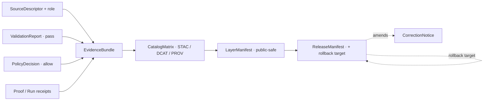

<!-- [KFM_META_BLOCK_V2]
doc_id: kfm://doc/domains/hydrology/preservation-matrix
title: Hydrology — Preservation Matrix
type: standard
version: v2
status: draft
owners: <hydrology domain steward> + <source steward> + <docs steward>   # placeholders — resolve via CODEOWNERS
created: 2026-05-18
updated: 2026-06-06
policy_label: public
contract_version: "3.0.0"   # pinned per ai-build-operating-contract.md v3.0
related:
  - ai-build-operating-contract.md
  - directory-rules.md
  - docs/domains/hydrology/README.md
  - docs/domains/hydrology/INDEX.md
  - docs/domains/hydrology/DATA_LIFECYCLE.md
  - docs/domains/hydrology/OBJECT_FAMILIES.md
  - docs/domains/hydrology/identity-model.md
  - schemas/contracts/v1/domains/hydrology/
  - policy/domains/hydrology/
tags: [kfm, hydrology, preservation, lifecycle, evidence, receipts, retention]
notes:
  - This matrix is navigational; canonical authority is the schema/contract tree, the per-domain dossier [DOM-HYD], and Master Atlas v1.1.
  - No mounted repo this session; all implementation paths are PROPOSED / NEEDS VERIFICATION.
  - Retention SLAs across the lifecycle are an OPEN corpus gap (Pass 10 §8.4); this matrix proposes a posture, not numbers.
  - Tier scheme is the full T0–T4 (T0 Open / T1 Generalized / T2 Reviewer / T3 Restricted / T4 Denied). Hydrology well/withdrawal records default T1/T2 per Atlas §24.5.2 (v1 erroneously wrote T1/T4).
  - AquiferObservation/WaterUseLink/DroughtLink/IrrigationLink are link objects in Atlas §A scope language, NOT in the §E object table — flagged.
  - v2 fixes the doc_id, adds Pre-RAW, corrects the tier values + adds T2/T3, reconciles source roles to the canonical seven, pins CONTRACT_VERSION, and corrects relative-link depth. See Changelog (§14).
[/KFM_META_BLOCK_V2] -->

# 💧 Hydrology — Preservation Matrix

> What the Hydrology lane preserves, at which lifecycle phase, with which receipts, gates, and tier controls — so that every released hydrologic claim resolves to evidence, role, and rollback target.

<!-- Badge row: placeholders; replace targets when CI, registries, and ADRs are confirmed. -->

**Status:** draft · **Owners:** `<hydrology domain steward>` · `<source steward>` · `<docs steward>` (placeholders) · **Contract:** `CONTRACT_VERSION = "3.0.0"` · **Updated:** 2026-06-06

---

## Contents

- [1 · Purpose & scope](#1--purpose--scope)
- [2 · How this matrix reads](#2--how-this-matrix-reads)
- [3 · Lifecycle preservation overview](#3--lifecycle-preservation-overview)
- [4 · Source family preservation matrix](#4--source-family-preservation-matrix)
- [5 · Object family preservation matrix](#5--object-family-preservation-matrix)
- [6 · Receipt × lifecycle phase matrix (Hydrology lens)](#6--receipt--lifecycle-phase-matrix-hydrology-lens)
- [7 · Source-role anti-collapse preservation](#7--source-role-anti-collapse-preservation)
- [8 · Sensitivity tier × allowed transforms (Hydrology)](#8--sensitivity-tier--allowed-transforms-hydrology)
- [9 · Temporal-field preservation](#9--temporal-field-preservation)
- [10 · Catalog-closure preservation invariants](#10--catalog-closure-preservation-invariants)
- [11 · Correction, rollback, and tombstone preservation](#11--correction-rollback-and-tombstone-preservation)
- [12 · Verification backlog & open questions](#12--verification-backlog--open-questions)
- [13 · Related docs](#13--related-docs)
- [14 · Changelog](#14--changelog)
- [Appendix A · Notation key](#appendix-a--notation-key)

---

## 1 · Purpose & scope

**Purpose.** This matrix names — in one place — *what the Hydrology lane preserves*, *where it is preserved*, and *which receipts, gates, and tier controls govern its preservation* as material moves through `Pre-RAW → RAW → WORK / QUARANTINE → PROCESSED → CATALOG / TRIPLET → PUBLISHED`. It is a domain-scoped reading of the cross-cutting doctrine in `[ENCY]`, `[DIRRULES]`, and Master Atlas v1.1 §§24.1–24.6, projected onto the Hydrology lane defined in `[DOM-HYD]`.

**In scope (CONFIRMED doctrine / PROPOSED lane application).** Preservation rules for hydrology source payloads, normalized objects, evidence bundles, receipts, catalog records, layer manifests, release manifests, rollback targets, and correction notices.

The **CONFIRMED §E object families** are: Watershed, HUCUnit, HydroFeature, ReachIdentity, GaugeSite, FlowObservation, WaterLevelObservation, WaterQualityObservation, GroundwaterWell, NFHLZone (+ FloodContext), ObservedFloodEvent, Hydrograph, and UpstreamTrace.

> [!NOTE]
> **Link objects (not §E families).** `AquiferObservation`, `WaterUseLink`, `DroughtLink`, and `IrrigationLink` appear in the Atlas §A scope language ("drought and irrigation links") and are tracked here for preservation completeness, but they are **not** in the §E object table — they are cross-lane *link* records (see [`OBJECT_FAMILIES.md`](./OBJECT_FAMILIES.md) §8, OQ-HYD-OBJ-02). The v1 of this matrix also omitted `ObservedFloodEvent`, a genuine §E family; it is restored below.

**Explicitly out of scope.** Emergency alerts and life-safety warnings (Hazards / official-source concern); flood as observed inundation collapsed with regulatory NFHL context (forbidden by source-role anti-collapse); soil/agriculture/geology/infrastructure canonical claims (those domains preserve their own). `[DOM-HYD]` `[DOM-HAZ]` `[ENCY]`

> [!IMPORTANT]
> **Preservation is governance, not storage.** A file landing under `data/processed/hydrology/...` does not constitute preservation; preservation is the combined presence of source descriptor, transform receipts, validation reports, evidence-bundle resolution, policy decision, and (where released) release manifest with rollback target. Promotion is a **governed state transition, not a file move.** `[DIRRULES]` `[ENCY]`

---

## 2 · How this matrix reads

Each preservation row has three axes:

| Axis | Question it answers | Drawn from |
|---|---|---|
| **What** | Which artifact, object, receipt, or record is preserved? | `[DOM-HYD] §E`; `[ENCY] App. C` |
| **Where in the lifecycle** | At which phase(s) is preservation required, and where does the artifact stop being mutable? | Atlas v1.1 §24.6 Pipeline Gate Reference; `[DIRRULES]` |
| **Under what control** | Which receipts, validators, policies, reviews, and tier rules govern it? | Atlas v1.1 §§24.1, 24.2, 24.5, 24.7; `[ENCY]` |

Where this matrix proposes specificity not already in the corpus (retention durations, specific paths, validator/route names), it is labeled **PROPOSED** or **NEEDS VERIFICATION** rather than asserted. The most prominent uncodified gap — *retention SLAs across the lifecycle* — is carried from Pass 10 §8.4 and surfaced in §12.

> [!NOTE]
> **Authority order.** Where a cell here disagrees with `[DOM-HYD]`, an accepted ADR, or the schema/contract tree under `schemas/contracts/v1/domains/hydrology/` (PROPOSED), those govern and this matrix is filed as a drift entry against itself.

---

## 3 · Lifecycle preservation overview

CONFIRMED doctrine for the phases and gates; the concrete artifacts shown are PROPOSED applications of `[ENCY]` and `[DIRRULES]` to the Hydrology lane. Note the leading **Pre-RAW** phase (watcher signals before admission; watchers are non-publishers).

```mermaid
flowchart LR
    subgraph PRE["Pre-RAW · watch"]
      E1["EventEnvelope / EventRunReceipt<br/>(watcher signal, candidate only)"]
    end

    subgraph RAW["RAW · capture"]
      R1["SourceDescriptor<br/>(role, rights, sensitivity, cadence)"]
      R2["Payload hash<br/>(HEAD, ETag, content)"]
    end

    subgraph WQ["WORK / QUARANTINE · normalize"]
      W1["TransformReceipt"]
      W2["ValidationReport<br/>(working)"]
      W3["PolicyDecision"]
      W4["QUARANTINE reason<br/>(on failure)"]
    end

    subgraph PR["PROCESSED · validated objects"]
      P1["Normalized objects<br/>(HUC12, Reach, Gauge,<br/>FlowObs, NFHLZone …)"]
      P2["ValidationReport<br/>(pass)"]
      P3["RedactionReceipt<br/>(if sensitivity)"]
      P4["AggregationReceipt<br/>(if applies)"]
    end

    subgraph CT["CATALOG / TRIPLET · closure"]
      C1["EvidenceBundle"]
      C2["CatalogMatrix entry<br/>(STAC / DCAT / PROV)"]
      C3["Graph / Triplet projection<br/>(data/triplets/)"]
      C4["LayerManifest candidate"]
    end

    subgraph PB["PUBLISHED · release"]
      B1["ReleaseManifest<br/>(+ rollback target)"]
      B2["LayerManifest<br/>(public-safe)"]
      B3["EvidenceRef-resolvable<br/>claim surface"]
      B4["CorrectionNotice / RollbackCard<br/>(on amendment)"]
    end

    PRE -->|admission gate| RAW
    RAW -->|normalization gate| WQ
    WQ -->|validation gate| PR
    PR -->|catalog-closure gate| CT
    CT -->|release gate| PB
    PB -->|correction gate| PB
```

> [!TIP]
> **Reading the diagram.** A receipt appearing in an earlier phase is *referenced*, not duplicated, at every later phase via `EvidenceRef`. Preservation means the chain resolves end-to-end — not that every artifact is re-emitted at every step. `[ENCY]` Atlas v1.1 §24.2

[⬆ Back to top](#top)

---

## 4 · Source family preservation matrix

The Hydrology lane admits material from a defined set of source families. Each family carries its source role(s) into every downstream phase; **a source's role at admission is preserved through every promotion** (Atlas v1.1 §24.1).

> [!NOTE]
> **Source roles are the canonical seven, assigned per descriptor.** The Atlas source table lists each family as carrying "authority / observation / context / model **as the source role requires**" — i.e., a family is not hard-bound to one role. KFM's canonical role vocabulary is the **seven** fixed-at-admission roles: `observed / regulatory / modeled / aggregate / administrative / candidate / synthetic`. The "Typical role(s)" column below maps the Atlas wording onto those seven; the binding role travels with each admitted `SourceDescriptor`, not with the family name. (Pending ADR-S-04.)

| Source family | Typical role(s) → canonical | Cadence (PROPOSED) | Default tier | Preservation rules (PROPOSED) |
|---|---|---|---|---|
| USGS WBD / HUC12 | authority-geometry → `regulatory`/`administrative` | Source-vintage | T0 Open | Preserve unit identity (HUC code), WBD vintage, retrieval timestamp, payload hash; identity = source id + HUC code + vintage + normalized digest. |
| NHDPlus HR / 3DHP hydrography | authority-network; VAA/catchment → `modeled` | Source-vintage | T0 Open | Preserve permanent IDs (COMID equivalent), VAA provenance (labeled `modeled`), pour-point identity, `alignment_score` for crosswalks, model identity for derived attributes. |
| USGS Water Data / NWIS | `observed` | Continuous → daily / instantaneous | T0 Open | Preserve site id, parameter code, units, datum, `observed_time` (UTC), provisional/final qualifier, qualifier codes, retrieval URL, response body hash. |
| FEMA NFHL / MSC | `regulatory` | Effective-date-bound | T0 Open (as regulatory **context**) | Preserve regulatory effective date, panel identifier, zone classification, jurisdictional authority, payload hash. **DENY** at publication if relabeled as observed inundation. `[Atlas §24.1.2]` |
| 3DEP terrain | DEM → `observed`; derived hydrology → `modeled` | Source-vintage | T0 Open | Preserve DEM tile identity, vintage, vertical datum, source resolution, ProjectionTransformReceipt for any reprojection. `[MAP-MASTER]` |
| Water quality / groundwater programs | `observed`; registry → `administrative` | Variable | T0 Open default; T1/T2 on join sensitivity | Preserve method id, lab id where present, detection limits, sample times distinct from report times; joins to person-parcel data fail closed. `[ENCY]` `[DOM-PEOPLE]` |
| Historical observed flood evidence | `observed`; sourced → `administrative`; pre-review → `candidate` | Static / event-anchored | T0 Open (aggregate); per-record review for sensitive joins | Preserve source citation, observation method, eyewitness vs. instrument distinction, `valid_time` vs `retrieval_time`; `candidate` status until steward-reviewed. |

> [!CAUTION]
> **Source-role preservation is non-negotiable.** Observed gauge readings cannot be promoted into regulatory claims; regulatory NFHL panels cannot be displayed as observed inundation; modeled hydrographs cannot be queried as observations. The KFM lifecycle and governed API both **fail closed** when these roles are conflated. `[Atlas §24.1.2]` `[DOM-HYD]` `[DOM-HAZ]`

[⬆ Back to top](#top)

---

## 5 · Object family preservation matrix

Per Hydrology object family: identity-rule basis, mandatory temporal fields, default tier, and the receipt set required for promotion. Object families are CONFIRMED per `[DOM-HYD] §E`; the identity-rule basis (`source id + object role + temporal scope + normalized digest`) is the Atlas PROPOSED basis; the concrete per-object identity anchors are INFERRED field realization (see [`OBJECT_FAMILIES.md`](./OBJECT_FAMILIES.md)).

| Object family | Identity-rule anchor (INFERRED/PROPOSED) | Mandatory time fields | Default tier | Receipts required for promotion |
|---|---|---|---|---|
| **Watershed** | source id + watershed/WBD vintage + normalized digest | source_time, valid_time, retrieval_time | T0 | SourceDescriptor · TransformReceipt · ValidationReport |
| **HUCUnit** | source id + HUC code + WBD vintage | source_time, valid_time, retrieval_time | T0 | SourceDescriptor · TransformReceipt · ValidationReport |
| **HydroFeature** | source id + permanent id + geometry fingerprint + nhdplus_version | source_time, valid_time, retrieval_time | T0 | + GeometryFingerprint |
| **ReachIdentity** | source id + reach id + network vintage + normalized digest | source_time, valid_time, retrieval_time | T0 | **ABSTAIN** at AI surface on ambiguous identity `[DOM-HYD]` |
| **GaugeSite** | source id + site id + datum + retrieval scope | source_time, valid_time, retrieval_time | T0 | SourceDescriptor · TransformReceipt · ValidationReport |
| **FlowObservation** | site id + parameter code + observed_time + qualifier | source_time, **observed_time**, valid_time, retrieval_time | T0 | provisional/final qualifier preserved |
| **WaterLevelObservation** | site id + parameter code + observed_time + datum | source_time, **observed_time**, valid_time, retrieval_time | T0 | Same as FlowObservation |
| **WaterQualityObservation** | sample id + parameter code + method id + observed_time | source_time, **observed_time**, valid_time, retrieval_time | T0; **T1/T2** on sensitive joins | + detection-limit preservation; sensitive joins fail closed |
| **GroundwaterWell** | well id + datum + source id | source_time, valid_time, retrieval_time | T0; **T1/T2** if landowner-private | RedactionReceipt where landowner-sensitive |
| **NFHLZone** (+ FloodContext) | panel id + zone code + effective date | **effective/valid_time**, retrieval_time, release_time | T0 (regulatory context) | **DENY** if relabeled as observed inundation |
| **ObservedFloodEvent** | source family + event interval + geometry vintage | observed_time, valid_time, retrieval_time | T0 (aggregate); review on sensitive joins | source-role-isolated from NFHL; transform record if generalized |
| **Hydrograph** | series ref + window + reconstruction method | observed_time (composite), valid_time, retrieval_time | T0 | + ModelRunReceipt (role = `modeled`) |
| **UpstreamTrace** | seed reach + network vintage + algorithm version | valid_time, retrieval_time, release_time | T0 | + ModelRunReceipt (derived product) |
| *link objects:* **AquiferObservation / WaterUseLink / DroughtLink / IrrigationLink** *(not §E)* | link id + endpoints + scope + temporal window | valid_time, retrieval_time, release_time | T0 (aggregate) / T1 (field-level) | + AggregationReceipt where summarized; cross-lane join inference-risk (ADR-S-14) |

> [!NOTE]
> **Temporal preservation is multi-axis.** Hydrology preserves `source_time`, `observed_time`, `valid_time`, `retrieval_time`, `release_time`, and (post-publication) `correction_time` as **distinct** fields wherever material. Collapsing them is a documented anti-pattern. `[DOM-HYD]` `[ENCY]`

[⬆ Back to top](#top)

---

## 6 · Receipt × lifecycle phase matrix (Hydrology lens)

The Hydrology projection of Atlas v1.1 §24.2 (receipt ↔ lifecycle phase). A bullet (●) means the receipt is normally **emitted, amended, or referenced** at that phase; receipts created earlier remain referenced (not duplicated) at later phases via `EvidenceRef`. Pre-RAW is shown because watcher signals (`EventEnvelope` / `EventRunReceipt`) originate there.

| Receipt | Pre-RAW | RAW | WORK / QUAR. | PROCESSED | CATALOG / TRIPLET | PUBLISHED |
|---|:---:|:---:|:---:|:---:|:---:|:---:|
| EventEnvelope / EventRunReceipt (watcher) | ● |   |   |   |   |   |
| SourceDescriptor |   | ● | ● | ● | ● | ● |
| TransformReceipt |   |   | ● | ● | ● |   |
| ValidationReport |   |   | ● | ● | ● |   |
| PolicyDecision |   | ● | ● | ● | ● | ● |
| RedactionReceipt¹ |   |   | ● | ● | ● | ● |
| AggregationReceipt² |   |   | ● | ● | ● | ● |
| ModelRunReceipt³ |   |   | ● | ● | ● | ● |
| RepresentationReceipt⁴ |   |   |   | ● | ● | ● |
| ReviewRecord⁵ |   |   | ● | ● | ● | ● |
| ReleaseManifest |   |   |   |   | ● | ● |
| CorrectionNotice |   |   |   |   |   | ● |
| RollbackCard |   |   |   |   | ● | ● |
| GENERATED_RECEIPT⁷ | (per AI-authored artifact, any phase) ||||||
| AIReceipt⁶ |   |   |   |   |   | ● (Focus Mode only) |

¹ Required where sensitivity applies (rare in hydrology; landowner-private wells, sensitive water-quality joins).  
² Required where outputs are county / watershed / temporal rollups.  
³ Required for hydrographs, upstream traces, terrain-derived hydrology, NHDPlus VAAs.  
⁴ Required for any synthetic / reconstructed flood scene; carries `RealityBoundaryNote`.  
⁵ Required for tier transitions and for publication when materiality applies (Atlas v1.1 §24.7).  
⁶ Focus Mode summaries only; AI never reads Pre-RAW / RAW / WORK content. `[GAI]`  
⁷ `GENERATED_RECEIPT.json` accompanies any AI-authored or AI-modified artifact; pins `CONTRACT_VERSION` and carries `human_review.state`. `[Operating Contract §34]`

> [!TIP]
> **Hydrology is the early proof lane.** Per the Unified Implementation Architecture Build Manual §6.1, hydrology is the **safest first proof-bearing slice**. The thin-slice fixture is *one* HUC12 + *one* USGS gauge fixture + *one* NHDPlus identity crosswalk + *one* NFHL contextual overlay, threading the full receipt chain above — fixture-first, no live network. `[Unified Build Manual §6.1]` `[ENCY]`

[⬆ Back to top](#top)

---

## 7 · Source-role anti-collapse preservation

Source role is set at admission (in the `SourceDescriptor`) and **preserved through every promotion**. The table applies Atlas v1.1 §24.1 to canonical hydrology examples. Promotion does **not** upgrade an observation to a regulation, a model to an aggregate, or a candidate to a verified record — those are separate governed transitions with their own evidence and review.

| Role (canonical) | Hydrology example | Allowed downstream relabel | Forbidden relabel (DENY) |
|---|---|---|---|
| **observed** | NWIS instantaneous discharge reading | May feed modeled or aggregate products (labeled as such) | Relabeled as regulatory, modeled, or administrative |
| **regulatory** | NFHL Zone AE panel, effective date | Cited as regulatory context | Labeled as observed event or modeled estimate |
| **modeled** | Hydrograph reconstruction; upstream-trace network walk | Cited with model identity, run receipt, bounds | Labeled as an observation |
| **aggregate** | HUC12 monthly mean discharge rollup; decadal normals | Cited with `AggregationReceipt` | Treated as a per-place record |
| **administrative** | State water-office registry tract (where present) | Cited as administrative context | Collapsed with observation or regulation |
| **candidate** | Quarantined connector output awaiting steward review | Cited as candidate evidence in WORK / QUARANTINE | Appears in PUBLISHED without promotion |
| **synthetic** | Reconstructed historical flood scene; AI-drafted summary | Carries `RealityBoundaryNote` + `RepresentationReceipt` | Presented or queried as observed reality |

> [!WARNING]
> **The NFHL / observed-flood boundary is doctrinal.** NFHL regulatory flood zones are *not* observed inundation, *not* forecasts, *not* emergency warnings. Collapsing them into one truth class is the single most consequential anti-pattern in this lane. The publication gate must `DENY`; the AI surface must `ABSTAIN`. `[DOM-HYD]` `[DOM-HAZ]` `[Atlas §24.1.2]`

[⬆ Back to top](#top)

---

## 8 · Sensitivity tier × allowed transforms (Hydrology)

The Atlas v1.1 §24.5 tier scheme applied to Hydrology. **The full scheme is five tiers** — T0 Open, T1 Generalized, T2 Reviewer, T3 Restricted, T4 Denied. Most hydrology products are public-suitable at T0; the cases below name where higher tiers apply and the transforms that preserve safety while still permitting release. Tier transitions are governed (`PolicyDecision` + `ReviewRecord`, plus `RedactionReceipt`/`AggregationReceipt` as applicable) and reversible. `[Atlas §24.5.1–24.5.3]`

| Hydrology object class | Default tier | Conditions raising tier | Allowed transforms (PROPOSED) | Required gates |
|---|---|---|---|---|
| HUC12 / Watershed boundaries | T0 | — | None needed | Standard release (Gates A–G) |
| NHDPlus flowlines, reach identity | T0 | — | None needed | Standard release |
| USGS gauge sites, public observations | T0 | — | None needed | Standard release |
| NFHL regulatory zones | T0 | — (always regulatory context) | None; **no relabel** as observed | Standard release with role banner |
| Water quality observations | T0 | **T1/T2** on landowner / private-well joins | Generalization to HUC or county; aggregation | RedactionReceipt or AggregationReceipt + ReviewRecord |
| Private groundwater wells (landowner-private) | **T1 / T2** | Where landowner identification is implied | Generalization to grid cell; suppression of identifying fields | RedactionReceipt + ReviewRecord |
| Hydrology × archaeology joins | per Archaeology (**T4** site coords) | Any join that locates archaeological sites | Refuse the join; abstain | PolicyDecision DENY; AI ABSTAIN `[DOM-ARCH]` |
| Hydrology × rare-species occurrence joins | per Fauna / Flora (**T4** sensitive occurrence) | Any join that locates rare species | Refuse the join; abstain | PolicyDecision DENY; AI ABSTAIN `[DOM-FAUNA]` `[DOM-FLORA]` |
| Hydrology × person-parcel joins | per People / Land (**T4** living-person) | Any join exposing living-person identity | Refuse the join; abstain | PolicyDecision DENY; AI ABSTAIN `[DOM-PEOPLE]` |

> [!IMPORTANT]
> **Hydrology's own data is low-tier; the risk is in the joins.** Per Atlas §24.5.2, hydrology HUC12/flowline/gauge products are T0 and well/withdrawal records default **T1/T2** (not T4). The T4 cases reached *through* hydrology are owned by the joined lane (archaeology site coords, sensitive species occurrences, living-person/parcel) — hydrology must refuse those joins at the policy gate, but it does not itself reclassify its water data to T4.

> [!NOTE]
> **Tier motion is asymmetric (CONFIRMED).** A tier *upgrade* (toward more public, e.g. T4→T1) requires both a transform receipt (`RedactionReceipt`/`AggregationReceipt`) **and** a `ReviewRecord` (and a `PolicyDecision`); a tier *downgrade* (toward less public, any tier → T4) needs only a `CorrectionNotice` + `ReviewRecord` — correction alone is sufficient to remove or restrict. `[Atlas §24.5.3]`

[⬆ Back to top](#top)

---

## 9 · Temporal-field preservation

Hydrology preserves more temporal fields than most KFM lanes because gauge data, regulatory windows, model runs, and corrections each live on distinct clocks. The minimum preservation set:

| Field | Definition (CONFIRMED doctrine) | Hydrology example |
|---|---|---|
| `source_time` | Time the source system represents the record as having | NWIS site metadata last-update timestamp |
| `observed_time` | Time the phenomenon occurred / was measured | Gauge reading sample time (UTC) |
| `valid_time` | Time interval over which the claim is taken to hold | NFHL panel effective date range |
| `retrieval_time` | Time KFM retrieved or captured the payload | Connector fetch timestamp |
| `release_time` | Time the published derivative was released | `ReleaseManifest.time` |
| `correction_time` | Time a published claim was corrected | `CorrectionNotice.time` (only on amendment) |

> [!IMPORTANT]
> **Provisional vs. final must be preserved.** USGS Water Data values carry a provisional/final qualifier that materially changes the claim. Stripping or collapsing this qualifier is a `ValidationReport` failure. `[DOM-HYD]` `[ENCY]`

[⬆ Back to top](#top)

---

## 10 · Catalog-closure preservation invariants

A hydrology dataset, layer, or analytical product is **not publication-ready** until catalog closure resolves consistently. Each of the following must reference the others without breakage. `[ENCY]`

| Closure link | Hydrology preservation rule | Failure mode |
|---|---|---|
| Catalog (STAC / DCAT / PROV) | Each released hydrology layer registers a STAC Item / DCAT distribution with `kfm:provenance` `evidence_bundle_ref`, `run_record_ref`, and `policy_digest` (PROPOSED extension) | HOLD at CATALOG; no public edge |
| Evidence resolution | Every claim's `EvidenceRef` resolves to a complete `EvidenceBundle` (source descriptors, validation, policy, review state) | HOLD at CATALOG |
| Proof | Required `RunReceipt`s present and content-addressed (`spec_hash` = `jcs:sha256:<hex>`) | HOLD at CATALOG |
| Release manifest | `ReleaseManifest` records contents, digests, evidence refs, **rollback target**, time | HOLD at CATALOG; no PUBLISHED transition |
| Reviewer separation | Where materiality applies, release authority is distinct from the original author | HOLD at CATALOG `[Atlas §24.7; ADR-S-09]` |

> [!TIP]
> **Catalog closure is a closure property, not a process outcome.** A pipeline can complete successfully and still produce unready output if any closure link is broken — missing evidence ref, missing provenance, unresolved policy, missing proof, or release manifest pointing to a phantom record.

[⬆ Back to top](#top)

---

## 11 · Correction, rollback, and tombstone preservation

Published hydrology claims are **amendable** but never quietly. The corrections lattice below must remain auditable (retention duration **OPEN**, see §12).

| Trigger | Preserved artifact | Downstream effect |
|---|---|---|
| Detected error or new evidence | `CorrectionNotice` (claim_ref, prior_release_ref, change_summary, invalidates[], review_ref, time) | Derivatives identified by `invalidates[]` are marked stale and re-validated or withdrawn |
| Failed release / regression | `RollbackCard` (release_id, rollback_to, reason, invalidates[], review_ref, time) | Targeted prior release reactivated as authoritative; downstream invalidations cascade |
| Revoked source / withdrawn payload | Tombstone (PROPOSED) referencing the prior payload hash and replacement pointer | Replaces content; preserves explainability without preserving the withdrawn payload |
| Stale upstream propagation | Stale-state marker carried via `EvidenceRef` to downstream claims | Downstream surfaces render `stale-state` badge `[MAP-MASTER]` |

> [!CAUTION]
> **Tombstones are not erasure.** Where personal data is involved, tombstones satisfy explainability but may not satisfy erasure obligations. Out-of-scope for hydrology in typical operation, but reachable through joins (e.g., person-parcel × water-use) — those joins must fail closed at the policy gate. `[Pass 10 §8.4]` `[DOM-PEOPLE]`

[⬆ Back to top](#top)

---

## 12 · Verification backlog & open questions

| # | Item to verify | Evidence that would settle it | Status |
|---:|---|---|---|
| 1 | Canonical schema home for hydrology contracts (`schemas/contracts/v1/domains/hydrology/`) + `SourceDescriptor` `source/` vs `sources/` | Mounted repo files; ADR-0001 disposition | **CONFLICTED** |
| 2 | HUC12 fixture and geometry-fingerprint canonicalization rule | Mounted fixtures, validators, tests | **NEEDS VERIFICATION** `[DOM-HYD]` |
| 3 | NHDPlus HR ↔ HUC12 crosswalk and ambiguity-`ABSTAIN` behavior; crosswalk validator home | Mounted crosswalk, manifest, validator tests; ADR-S-CWV-01 | **CONFLICTED** |
| 4 | USGS Water Data normalizer + NFHL source-role separation enforcement | Connector code, policy bundle, integration test | **NEEDS VERIFICATION** |
| 5 | Provisional/final qualifier preservation in normalized FlowObservation | Schema field + validator fixture | **NEEDS VERIFICATION** |
| 6 | Hydrology API and MapLibre LayerManifest binding (governed) | `apps/governed-api/` + renderer evidence | **NEEDS VERIFICATION** |
| 7 | Retention SLAs across phases (corpus-wide gap) | ADR or `docs/standards/RETENTION.md` | **OPEN** `[Pass 10 §8.4]` |
| 8 | Tombstone vs. erasure boundary for hydrology joins implicating persons | ADR + policy bundle for `DOM-PEOPLE` × `DOM-HYD` | **OPEN** |
| 9 | NWIS endpoint phase-out posture (legacy WaterServices → modern api.waterdata.usgs.gov) | Source descriptor + watcher fixture | **NEEDS VERIFICATION** |
| 10 | Reviewer separation-of-duties threshold for hydrology releases | ADR-S-09 disposition | **OPEN** `[Atlas §24.7]` |
| 11 | Hydrology well/withdrawal default tier — confirm **T1/T2** (Atlas §24.5.2), not T1/T4 | Atlas §24.5.2 row + policy bundle | **NEEDS VERIFICATION** |
| 12 | `AquiferObservation`/`WaterUseLink`/`DroughtLink`/`IrrigationLink` — first-class families or link records? (not in §E) | §E reconciliation; ADR | **OPEN** (cf. OQ-HYD-OBJ-02) |

[⬆ Back to top](#top)

---

## 13 · Related docs

- [`ai-build-operating-contract.md`](../../../ai-build-operating-contract.md) — operating contract; `CONTRACT_VERSION = "3.0.0"`, §34 GENERATED_RECEIPT.
- [`directory-rules.md`](../../../directory-rules.md) — lifecycle law, Domain Placement Law §12, README contract §15.
- [`docs/domains/hydrology/README.md`](./README.md) — lane landing page.
- [`docs/domains/hydrology/INDEX.md`](./INDEX.md) — lane navigation hub.
- [`docs/domains/hydrology/DATA_LIFECYCLE.md`](./DATA_LIFECYCLE.md) — gates + `Pre-RAW → PUBLISHED` in detail.
- [`docs/domains/hydrology/OBJECT_FAMILIES.md`](./OBJECT_FAMILIES.md) — per-family catalog (object families, roles, tiers, link objects).
- [`docs/domains/hydrology/identity-model.md`](./identity-model.md) — identity rule + `spec_hash` + crosswalk.
- [`schemas/contracts/v1/domains/hydrology/`](../../../schemas/contracts/v1/domains/hydrology/) — canonical schema home (PROPOSED).
- [`policy/domains/hydrology/`](../../../policy/domains/hydrology/) — hydrology policy bundles (PROPOSED).
- [`docs/registers/DRIFT_REGISTER.md`](../../registers/DRIFT_REGISTER.md) — file drift entries; cross-link when conflicts surface.

> [!NOTE]
> All targets are PROPOSED until confirmed against a mounted repo. Atlas §24.x sections referenced here live in the Master Atlas v1.1 / Doctrine Synthesis, not as standalone repo files at the paths the v1 `related` block guessed (`docs/atlases/master-atlas-v1.1/24.x-*.md`) — those split-file paths are unverified and were removed in v2.

[⬆ Back to top](#top)

---

## 14 · Changelog

| Change | Type (per contract §37) | Reason |
|---|---|---|
| Fixed `doc_id` from `kfm://doc/NEEDS_VERIFICATION` to slug `kfm://doc/domains/hydrology/preservation-matrix` | reconciliation | A doc_id is required; `NEEDS_VERIFICATION` is a status label, not an id. |
| Pinned `CONTRACT_VERSION = "3.0.0"` (meta block, badge, status line, footer) + added GENERATED_RECEIPT row to §6 | conformance | AIBOC v3.0. |
| Added **Pre-RAW** to the lifecycle string, the §3 diagram, and the §6 receipt matrix (watcher `EventEnvelope`/`EventRunReceipt`, non-publisher) | gap closure | Pre-RAW is a CONFIRMED phase. |
| **Corrected the tier scheme:** restored the full **T0–T4** (added T2 Reviewer, T3 Restricted); changed groundwater-well and water-quality-join defaults from `T1/T4` to **`T1/T2`** per Atlas §24.5.2; clarified that T4 cases reached *through* hydrology are owned by the joined lane | reconciliation | v1 skipped T2/T3 and mis-stated hydrology well records as T1/T4; the Atlas hydrology row is T1/T2. |
| Reconciled source roles to the **canonical seven** (`observed/regulatory/modeled/aggregate/administrative/candidate/synthetic`), noting the Atlas "as the role requires" per-descriptor assignment | reconciliation | v1 used the four-value `authority/observation/context/model` framing. |
| Restored **`ObservedFloodEvent`** as a §E family (v1 object table omitted it); flagged `AquiferObservation`/`WaterUseLink`/`DroughtLink`/`IrrigationLink` as **link objects, not §E** | gap closure | §E completeness; consistency with OBJECT_FAMILIES.md. |
| Added `data/triplets/` (plural, cross-cutting) to the CATALOG/TRIPLET node | clarification | §18.a plural. |
| Surfaced schema-home + crosswalk-validator home as **CONFLICTED** (ADR-0001, ADR-S-CWV-01) in the backlog | gap closure | Consistency with the lane suite. |
| Corrected relative-link depth and removed unverified split-file Atlas paths (`docs/doctrine/*`, `docs/atlases/master-atlas-v1.1/24.x-*`) | reconciliation | directory-rules / operating contract are at repo root (`../../../`); the §24.x atlas split-files are unverified guesses — pointed to the actual corpus instead. |
| Added §14 Changelog | housekeeping | Companion-section pattern. |

> **Backward compatibility.** All §1–§13 anchors and the page-top `#top` anchor are preserved; a new §14 is appended. The meta-block `doc_id` changed (was a placeholder, not a real id) — any consumer referencing `kfm://doc/NEEDS_VERIFICATION` must repoint. Tier-value cells changed (T1/T4 → T1/T2) — a correctness fix, not a structural change.

[⬆ Back to top](#top)

---

## Appendix A · Notation key

<b>Truth labels used in this document</b>

| Label | Meaning |
|---|---|
| **CONFIRMED doctrine** | Established invariant in the KFM corpus (`[ENCY]`, `[DIRRULES]`, `[DOM-HYD]`, Master Atlas v1.1). |
| **PROPOSED** | Design or path not yet verified against a mounted repository. |
| **INFERRED** | Derivable from confirmed doctrine but not stated verbatim (e.g., per-object identity anchors). |
| **NEEDS VERIFICATION** | Checkable, not yet checked strongly enough to act as fact. |
| **CONFLICTED** | Corpus sources disagree; ADR + DRIFT_REGISTER pending. |
| **OPEN** | Doctrinal gap requiring ADR or policy decision (e.g., retention SLAs). |
| **DENY / ABSTAIN** | Governed-AI / policy-gate outcomes from the finite-outcome sets. |

<b>Citation tags used in this document</b>

| Tag | Source |
|---|---|
| `[ENCY]` | KFM Encyclopedia |
| `[DIRRULES]` | Directory Rules (`directory-rules.md`) |
| `[DOM-HYD]` | Hydrology domain dossier — KFM Domains Culmination Atlas v1.1 |
| `[DOM-HAZ]`, `[DOM-ARCH]`, `[DOM-FAUNA]`, `[DOM-FLORA]`, `[DOM-PEOPLE]`, `[DOM-SOIL]`, `[DOM-AG]` | Sibling domain dossiers |
| `[MAP-MASTER]` | Master MapLibre Components / Functions / Features atlas |
| `[GAI]` | Governed AI doctrine |
| `[Unified Build Manual]` | KFM Unified Implementation Architecture Build Manual |
| `[Atlas §24.x]` | Master Atlas v1.1 / Doctrine Synthesis consolidated supplement |
| `[Pass 10 §x]` | Idea Index / Category Atlas dossier |

<b>Object / receipt glossary (abridged)</b>

| Term | Definition |
|---|---|
| **EvidenceBundle** | Resolved evidence package: source descriptors, supporting records, policy/review/release state, citations. |
| **EvidenceRef** | Stable reference from a claim/object to its supporting evidence. |
| **SourceDescriptor** | Source record with role, rights, sensitivity, cadence, access facts (canonical schema under `schemas/.../source/`). |
| **LayerManifest** | Public-safe layer descriptor binding tiles/data, fields, style, evidence hooks, source and release state. |
| **ReleaseManifest** | Bound release object: artifacts, checksums, validation, policy, review, rollback target. |
| **RollbackCard** | Auditable instructions + target for reverting or withdrawing a release. |
| **GENERATED_RECEIPT** | Per-AI-artifact receipt pinning `CONTRACT_VERSION`, hashes, model identity, truth labels, `human_review.state`. |
| **Reality Boundary Note** | Public-facing statement that a carrier is synthetic/reconstructed, not direct evidence. |
| **Focus Mode** | Governed AI Q&A over released/authorized `EvidenceBundle`s; finite outcomes `ANSWER/ABSTAIN/DENY/ERROR`. |

---

<b>Status:</b> draft · <b>Version:</b> v2 · <b>Contract:</b> CONTRACT_VERSION = "3.0.0" · <b>Doc id:</b> kfm://doc/domains/hydrology/preservation-matrix · <b>Last updated:</b> 2026-06-06 · <b>Authority:</b> navigational — canonical authority is the schema/contract tree, the per-domain dossier (`[DOM-HYD]`), and Master Atlas v1.1.

[⬆ Back to top](#top)
