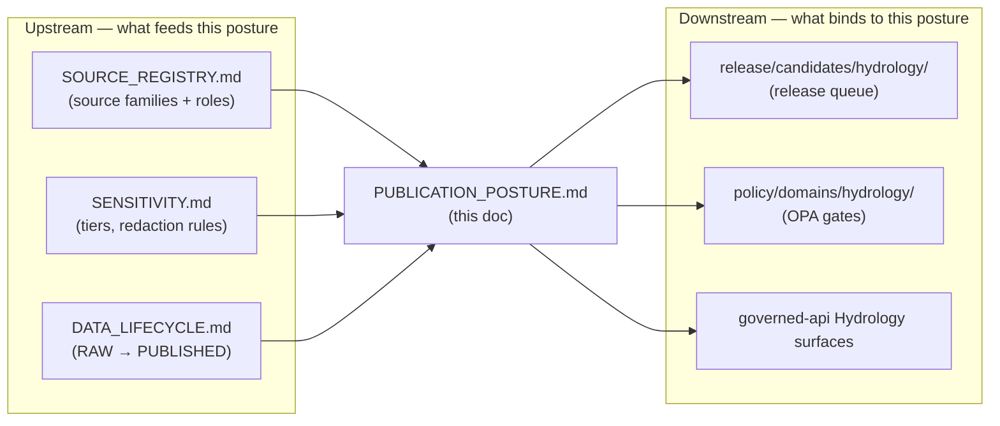
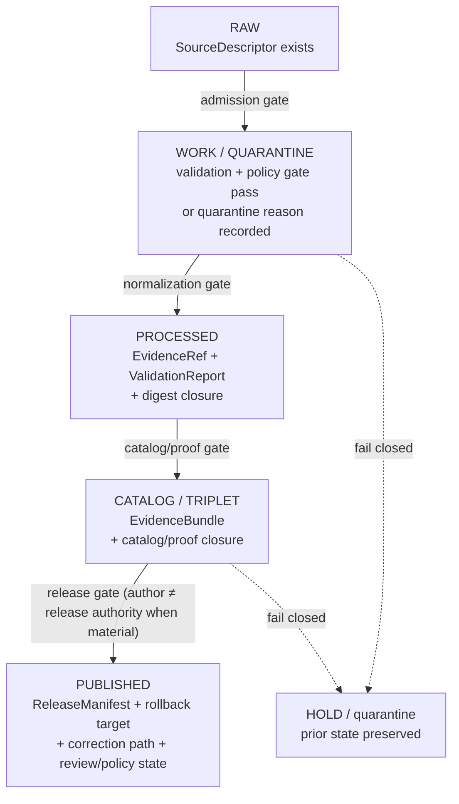

<!-- [KFM_META_BLOCK_V2]
doc_id: kfm://doc/hydrology-publication-posture
title: Hydrology — Publication Posture
type: standard
version: v1
status: draft
owners: <DOMAIN_STEWARD: hydrology> # TODO confirm owning team/handle
created: 2026-06-07
updated: 2026-06-07
policy_label: public
related:
  - ai-build-operating-contract.md
  - directory-rules.md
  - docs/domains/hydrology/SENSITIVITY.md # PROPOSED — confirm exact filename
  - docs/domains/hydrology/PUBLICATION_AND_ROLLBACK.md # PROPOSED — confirm exact filename
  - policy/domains/hydrology/ # PROPOSED responsibility-root lane
tags: [kfm]
notes:
  - CONTRACT_VERSION = "3.0.0"
  - Doctrine-adjacent domain doc; release/publication posture for the Hydrology lane.
  - All repo paths PROPOSED / NEEDS VERIFICATION until a repo is mounted.
[/KFM_META_BLOCK_V2] -->

# 💧 Hydrology — Publication Posture

> What Hydrology is allowed to publish, what it must hold or deny, and the proof required before any artifact crosses the trust membrane to `PUBLISHED`.

<!-- badges -->


| | |
|---|---|
| **Status** | `draft` |
| **Owners** | `<DOMAIN_STEWARD: hydrology>` · `<RELEASE_AUTHORITY>` *(placeholders — confirm)* |
| **Updated** | 2026-06-07 |
| **Contract** | `CONTRACT_VERSION = "3.0.0"` (`ai-build-operating-contract.md` v3.0) |
| **Responsibility root** | `docs/domains/hydrology/` (CONFIRMED placement, Directory Rules §12) |

---

## Quick jump

- [1. Scope](#1-scope)
- [2. Repo fit](#2-repo-fit)
- [3. Publication posture at a glance](#3-publication-posture-at-a-glance)
- [4. Promotion gate to PUBLISHED](#4-promotion-gate-to-published)
- [5. Deny-by-default register](#5-deny-by-default-register)
- [6. Source-role and flood-claim discipline](#6-source-role-and-flood-claim-discipline)
- [7. Public-safe geometry posture](#7-public-safe-geometry-posture)
- [8. Emergency / life-safety boundary](#8-emergency--life-safety-boundary)
- [9. Required release artifacts](#9-required-release-artifacts)
- [10. Correction, stale-state, and rollback](#10-correction-stale-state-and-rollback)
- [11. Separation of duties](#11-separation-of-duties)
- [12. Governed AI behavior](#12-governed-ai-behavior)
- [Open questions register](#open-questions-register)
- [Open verification backlog](#open-verification-backlog)
- [Changelog](#changelog-v0--v1)
- [Definition of done](#definition-of-done)
- [Related docs](#related-docs)

---

## 1. Scope

This document states the **publication posture** for the Hydrology domain: the conditions
under which Hydrology evidence and derivatives may be served publicly, the conditions
under which they must be held, generalized, or denied, and the proof that a release must
carry. It is the lane-specific operationalization of the operating contract's publication,
rights, and sensitivity law (§13) and the lifecycle invariant (§10), applied to Hydrology.

**This doc governs** the disposition decision (publish / hold / generalize / deny) and the
release-proof requirements for Hydrology artifacts.

**This doc does not** redefine the source-role vocabulary, the sensitivity tier scheme,
the receipt schemas, or the API routes — those are owned elsewhere (see
[Related docs](#related-docs)) and are referenced, not re-derived, here.

> [!IMPORTANT]
> Throughout this document, repository paths, routes, schema homes, and validator names
> are **PROPOSED / NEEDS VERIFICATION** unless explicitly marked CONFIRMED. No repository
> is mounted in this session; the doctrine is grounded, the implementation maturity is not.

[↑ Back to top](#-hydrology--publication-posture)

---

## 2. Repo fit

**This file (PROPOSED path):**

```text
docs/domains/hydrology/PUBLICATION_POSTURE.md
```

`docs/domains/hydrology/` is the CONFIRMED documentation home for the Hydrology lane per
Directory Rules §12 (Domain Placement Law). The Hydrology lane spreads across responsibility
roots — this doc is the **doctrine surface** for one slice of that lane.



> [!NOTE]
> The upstream/downstream filenames above are **PROPOSED**. Confirm exact filenames
> against the mounted Hydrology dossier before treating any link as canonical.

[↑ Back to top](#-hydrology--publication-posture)

---

## 3. Publication posture at a glance

| Dimension | Posture | Truth label |
|---|---|---|
| Public-safe geometry (HUC12, flowlines, gauge sites) | Generally publishable **with** source, time, and regulatory-vs-observational distinction | CONFIRMED doctrine / PROPOSED realization |
| Unclear rights or current terms | **Block public promotion** | CONFIRMED doctrine |
| Unresolved source role | **Block public promotion** | CONFIRMED doctrine |
| Missing evidence / EvidenceBundle closure | **Block public promotion** | CONFIRMED doctrine |
| NFHL flood-zone presented as *observed* flood | **DENY** | CONFIRMED / PROPOSED |
| Infrastructure or private-property implications | **Require review** | CONFIRMED / PROPOSED |
| KFM used as emergency / life-safety instruction | **DENY** | CONFIRMED doctrine |
| Absent release state (no `ReleaseManifest`) | **Block public promotion** | CONFIRMED doctrine |

> [!CAUTION]
> The single highest-risk Hydrology failure is **flood-role collapse**: serving a regulatory
> flood-hazard layer (FEMA NFHL) as if it were an observed flood extent. This is denied by
> doctrine and is the lane's named release-blocking anti-pattern.

[↑ Back to top](#-hydrology--publication-posture)

---

## 4. Promotion gate to PUBLISHED

CONFIRMED doctrine / PROPOSED lane realization: Hydrology follows the lifecycle invariant
`RAW → WORK / QUARANTINE → PROCESSED → CATALOG / TRIPLET → PUBLISHED`, with promotion as a
**governed state transition, not a file move**.



A transition is **closed** only when (i) the required artifacts exist, (ii) every required
artifact *resolves* — not merely references — its dependencies (`EvidenceRef → EvidenceBundle`,
`source_id → SourceDescriptor`), and (iii) the policy gate evaluated and recorded its
`PolicyDecision`. Missing any of these means the transition **fails closed** and the prior
state is preserved. *(CONFIRMED doctrine.)*

[↑ Back to top](#-hydrology--publication-posture)

---

## 5. Deny-by-default register

Hydrology inherits the project-wide deny-by-default posture (operating contract §20.5
register) and adds its lane-specific rows. The **most restrictive applicable row wins**.

| Surface / object | Denied by default | Allowed only when | Truth label |
|---|---|---|---|
| Regulatory flood zone (NFHL) as observed flood | always (role misuse) | never — role is fixed at admission | CONFIRMED / PROPOSED |
| KFM as emergency-alert / life-safety authority | always | never as KFM authority | CONFIRMED doctrine |
| Unclear-rights source family | public exposure | rights + current terms resolved + steward sign-off | CONFIRMED doctrine |
| Unresolved source role | publication | role restored / confirmed; upcast refused | CONFIRMED doctrine |
| Private-property / parcel-level flood implication | exact public assertion | review + public-safe generalization | CONFIRMED / PROPOSED |
| Sensitive infrastructure join (dams, levees, utilities) | exact public exposure | steward review + public-safe generalization | CONFIRMED / PROPOSED |
| Provisional / unqualified gauge readings as final | publication | qualifier/no-data handling validated | PROPOSED |

> [!NOTE]
> Hydrology is **not** primarily a sensitive-location lane in the way Archaeology, Fauna,
> Flora, or People/DNA are. Its sensitivity surface is concentrated in **infrastructure
> exposure** and **private-property implication**, not in exact natural-feature geometry.
> Route any genuinely sensitive disposition through the operating contract's §23.2
> sensitive-domain decision matrix rather than re-deriving it here.

[↑ Back to top](#-hydrology--publication-posture)

---

## 6. Source-role and flood-claim discipline

CONFIRMED doctrine: a source role is **fixed at admission and never upgraded by promotion**.
Hydrology source families (USGS WBD/HUC12, NHDPlus HR/3DHP, USGS Water Data/NWIS, FEMA
NFHL/MSC, 3DEP terrain, water-quality/groundwater sources, historical observed-flood
evidence) each carry one of the canonical roles (`authority` / `observation` / `context` /
`model`) as the source requires.

The lane's release-blocking rule:

> [!CAUTION]
> **Never label an NFHL regulatory flood zone as an observed flood event.** NFHL is a
> regulatory hazard-context product. An "Observed Flood Event" is a distinct object family
> carrying observation-role evidence. Collapsing the two is a `ROLE_COLLAPSE` failure and
> must DENY at validation, catalog, and release.

The validator family that enforces this (PROPOSED): **NFHL role-separation tests**. Until
mounted-repo evidence confirms the validator exists, treat enforcement as PROPOSED.

[↑ Back to top](#-hydrology--publication-posture)

---

## 7. Public-safe geometry posture

PROPOSED lane posture, grounded in CONFIRMED doctrine: for Hydrology, **public-safe geometry
is generally possible** — HUC12 watersheds, flowlines, and gauge-site points are not, in the
general case, harm-enabling exact locations. Publication is nonetheless conditional:

- every released geometry MUST cite **source, time, and the regulatory-vs-observational
  distinction**;
- watershed-boundary versioning MUST be carried (boundaries change across source vintages);
- gauge time-series MUST surface provisional/qualified/no-data status rather than presenting
  provisional readings as final;
- any geometry that implies a **named private parcel** or **sensitive infrastructure asset**
  drops to the deny-by-default rows in [§5](#5-deny-by-default-register).

[↑ Back to top](#-hydrology--publication-posture)

---

## 8. Emergency / life-safety boundary

> [!CAUTION]
> **KFM is not an emergency-alert or life-safety instruction authority.** CONFIRMED doctrine
> places Hydrology (alongside Hazards and Air) on the emergency-alert boundary: any use of a
> KFM Hydrology surface *as* a flood warning, evacuation instruction, or life-safety
> directive is **DENIED**. Hydrology may present released, cited, time-stamped evidence; it
> may not act as the alerting authority.

This boundary is enforced at the governed API and Focus Mode surfaces, not by disclaimer
text alone. A request that frames a Hydrology answer as life-safety instruction returns
`DENY`.

[↑ Back to top](#-hydrology--publication-posture)

---

## 9. Required release artifacts

CONFIRMED doctrine / PROPOSED implementation: a Hydrology release to `PUBLISHED` requires
the following proof. (Receipt ↔ lifecycle mapping per operating contract §24.2.2.)

| Artifact | Role at release | Required |
|---|---|---|
| `ReleaseManifest` | Single, signed, hashable object listing every dataset, bundle, and tile archive in the release; pins the release to specific evidence | MUST |
| `EvidenceBundle` (+ resolved `EvidenceRef`) | Evidence closure for every claim the release depends on | MUST |
| `ValidationReport` | Deterministic validator outcomes, fail-closed | MUST |
| `PolicyDecision` | Recorded policy-gate outcome | MUST |
| `ReviewRecord` | Review state where materiality requires it | MUST (when material) |
| Rollback target | Named prior release to revert to | MUST |
| Correction path | Declared route for post-publication correction | MUST |
| Stale-state rule | Declared freshness tolerance / cadence | MUST |
| `LayerManifest` / `MapReleaseManifest` | Public-safe layer + tile release descriptors | MUST (for map products) |

CONFIRMED (Idea-card lineage, `KFM-P21-PROG-0029` — Hydrologic ReleaseProofPack): hydrologic
boundary releases should bundle diff, receipt, source descriptor, EvidenceBundle references,
review state, rollback target, and release manifest. *(Retained as governance lineage;
PROPOSED until repo-verified.)*

> [!IMPORTANT]
> A release missing `ReleaseManifest` **or** a rollback target is a release-queue
> anti-pattern (operating contract §24.9.2): the public surface cannot be rolled back and
> the release is not auditable. This **HOLDs / DENYs** at the release gate.

[↑ Back to top](#-hydrology--publication-posture)

---

## 10. Correction, stale-state, and rollback

CONFIRMED doctrine: KFM separates **stale** from **wrong**. A stale Hydrology claim is one
whose evidence, source freshness, or dependent data has aged past its declared tolerance; a
wrong claim is one whose substance is incorrect. Both have visible markers and traceable
lifecycles — **no silent edits**.

| Event | Trigger | Required artifacts | Public effect |
|---|---|---|---|
| Stale-state | Source cadence passed without new admission | Stale-source badge in Evidence Drawer | Marker shown; no silent change |
| Correction (`PUBLISHED → PUBLISHED'`) | Detected error or new evidence | `CorrectionNotice`, `ReviewRecord`, invalidation list, manifest update or supersession | Stale-state announcement; derivatives invalidated |
| Rollback (`PUBLISHED → prior release`) | Failed release or post-publication failure | `RollbackCard`, `CorrectionNotice`, manifest reverts, derivative invalidation | Held at current state until rollback validated |

A re-published corrected claim **must** list invalidated derivatives; a corrected release
without derivative invalidation is an anti-pattern. *(CONFIRMED doctrine.)*

[↑ Back to top](#-hydrology--publication-posture)

---

## 11. Separation of duties

CONFIRMED operating-law invariant: KFM separates policy-significant release duties **when
maturity justifies it**. For Hydrology:

| Action | Author may also approve? | Required separation |
|---|---|---|
| Validator authorship/run | Yes (deterministic) | Domain steward; periodic docs-steward audit |
| Promotion to PROCESSED/CATALOG (non-sensitive) | Yes for routine | Domain steward |
| Release to PUBLISHED | **No when materiality applies** | Author ≠ release authority |
| Release touching infrastructure / private-property implication | **No** | Author + sensitivity reviewer + release authority |
| Correction / rollback (steward-significant) | **No** | Author/detector + correction reviewer + release authority |

> [!NOTE]
> Maturity note (Directory Rules §2; operating law): early-stage Hydrology doctrine work
> MAY be authored and approved by the same actor when materiality is low. As the public
> trust surface expands, separation must be enforced through tooling, not custom. This doc
> does not claim the tooling enforcement exists yet — that is `NEEDS VERIFICATION`.

[↑ Back to top](#-hydrology--publication-posture)

---

## 12. Governed AI behavior

CONFIRMED doctrine / PROPOSED implementation: for Hydrology, AI is **interpretive, never the
root truth source**. Within released, policy-safe context, AI MAY summarize Hydrology
`EvidenceBundle`s, compare evidence, explain limitations, and draft steward-review notes.

AI MUST:

- **ABSTAIN** when evidence is insufficient or uncited;
- **DENY** where policy, rights, sensitivity, or release state blocks the request, or where
  the request frames KFM as an emergency / life-safety authority ([§8](#8-emergency--life-safety-boundary));
- emit every answer through a `RuntimeResponseEnvelope` with an `AIReceipt`;
- never reach RAW / WORK / QUARANTINE or canonical/internal stores — only released
  `EvidenceBundle`s via the governed API (trust membrane).

[↑ Back to top](#-hydrology--publication-posture)

---

## Open questions register

| ID | Question | Owner role | Resolution path |
|---|---|---|---|
| OQ-HYD-PUB-01 | Confirm exact filenames of upstream/downstream Hydrology dossier docs referenced in §2. | Docs steward | Repo inspection |
| OQ-HYD-PUB-02 | Is `release/candidates/hydrology/` the confirmed release-queue path, or does Hydrology use a shared queue? | Release authority | Directory Rules check / repo inspection |
| OQ-HYD-PUB-03 | Does the NFHL role-separation validator exist, and where does it live? | Domain steward | Repo inspection |
| OQ-HYD-PUB-04 | Adopt the sensitivity tier scheme (T0–T4) for Hydrology infrastructure/private-property rows? | Sensitivity reviewer | ADR-S-05 |
| OQ-HYD-PUB-05 | What is the canonical freshness/cadence tolerance per Hydrology source family for stale-state marking? | Source steward | ADR / SourceDescriptor review |
| OQ-HYD-PUB-06 | Confirm Hydrology governed-API route names and the `HydrologyDecisionEnvelope` shape. | AI surface steward | Repo inspection |

## Open verification backlog

These items remain `NEEDS VERIFICATION` before promotion from `draft` to `published`:

1. Existence and path of the NFHL role-separation validator and tests.
2. Existence and path of the EvidenceBundle closure tests for Hydrology.
3. Confirmed release-queue path (`release/candidates/hydrology/`).
4. Confirmed policy-gate home (`policy/domains/hydrology/`) and OPA rules implementing the deny-by-default rows.
5. Confirmed `ReleaseManifest` / `LayerManifest` / `MapReleaseManifest` schema homes.
6. Confirmed owning team/handles for `<DOMAIN_STEWARD>` and `<RELEASE_AUTHORITY>`.
7. CI wiring for the `GENERATED_RECEIPT.json` that accompanies this doc.

## Changelog v0 → v1

| Change | Type (per contract §37) | Reason |
|---|---|---|
| Initial Hydrology publication-posture doc created | new | No prior lane doc; consolidates Atlas §I/§M for Hydrology into a posture surface |
| Pinned `CONTRACT_VERSION = "3.0.0"` | clarification | Doctrine-adjacent doc requirement |
| Flood-role-collapse named as the lane's primary release blocker | gap closure | Atlas flags it but no single posture surface centralized it |

> **Backward compatibility.** New file; no prior anchors to preserve. Heading anchors are
> stable and slug-based for future revision.

## Definition of done

This document is done enough to enter the repository when:

- it is placed at `docs/domains/hydrology/PUBLICATION_POSTURE.md` per Directory Rules §12;
- a docs steward and the Hydrology domain steward review it;
- it is linked from the Hydrology dossier index and the doctrine/domains index;
- it does not conflict with accepted ADRs (notably ADR-S-04 source-role vocabulary and ADR-S-05 sensitivity tiers);
- any conflict with current repo conventions is logged in `docs/registers/DRIFT_REGISTER.md`;
- the `GENERATED_RECEIPT.json` planned in the PR is wired into CI;
- future changes follow the operating contract's §37 lifecycle.

---

## Related docs

- `ai-build-operating-contract.md` — canonical operating contract (`CONTRACT_VERSION = "3.0.0"`)
- `directory-rules.md` — §12 Domain Placement Law; §2 separation-of-duties maturity
- `docs/domains/hydrology/SENSITIVITY.md` — *PROPOSED* — tiers and redaction rules for the lane
- `docs/domains/hydrology/PUBLICATION_AND_ROLLBACK.md` — *PROPOSED* — release/rollback runbook
- `docs/domains/hydrology/SOURCE_REGISTRY.md` — *PROPOSED* — source families and roles
- `policy/domains/hydrology/` — *PROPOSED* — OPA gates implementing the deny-by-default register

---

*Last updated: 2026-06-07 · `CONTRACT_VERSION = "3.0.0"` · status: `draft`*

[↑ Back to top](#-hydrology--publication-posture)
