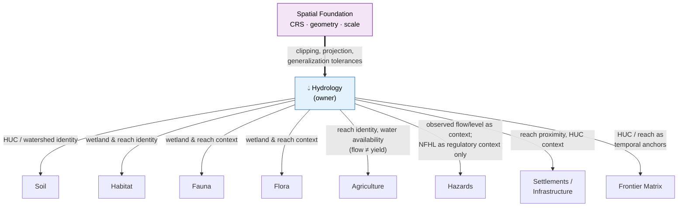

<!-- [KFM_META_BLOCK_V2]
doc_id: kfm://doc/<uuid-domain-hydrology-readme>
title: Hydrology Domain — README
type: domain_readme
version: v1
status: draft
owners: <hydrology-domain-stewards@kfm — assign in CODEOWNERS>
created: 2026-05-17
updated: 2026-05-17
policy_label: public
related:
  - docs/architecture/
  - docs/registers/DRIFT_REGISTER.md
  - contracts/domains/hydrology/
  - schemas/contracts/v1/domains/hydrology/
  - policy/domains/hydrology/
  - control_plane/domain_lane_register.yaml
  - kfm://source-id/DOM-HYD
  - kfm://source-id/ENCY
  - kfm://source-id/DIRRULES
  - kfm://source-id/BLD-COMP
  - kfm://source-id/IMPL-PIPE
tags: [kfm, domain, hydrology, watershed, huc, gauge, nhdplus, nfhl, evidence-bundle]
notes:
  - "Hydrology is the early proof lane per BLD-COMP §8 / IMPL-PIPE §14."
  - "Implementation maturity is PROPOSED until mounted-repo evidence is checked."
  - "NFHL is regulatory context only; never published as observed flooding."
[/KFM_META_BLOCK_V2] -->

# 💧 Hydrology — Domain README

> Evidence-bound, time-aware Kansas hydrology: watersheds, HUCs, reaches, gauges, observations, regulatory context, and flood-context overlays — **never** an emergency flood-warning system.

[](#status)
[-informational)](#authority-level)
[](#11-sensitivity-rights--publication-posture)
[](#1-scope--boundary)
[](#7-pipeline-shape-raw--published)
[](#10-validators-tests-and-fixtures-proposed)
[](#last-reviewed)

| Field             | Value                                                                 |
| ----------------- | --------------------------------------------------------------------- |
| **Status**        | CONFIRMED doctrine / PROPOSED implementation                          |
| **Authority**     | Canonical (documentation) — `docs/domains/hydrology/`                 |
| **Owners**        | `<hydrology-domain-stewards>` — _placeholder; assign in CODEOWNERS_   |
| **Lane role**     | Early proof lane (per `BLD-COMP §8`, `IMPL-PIPE §14`)                 |
| **Policy label**  | `public` (doctrine; per-artifact label still governs at publication)  |
| **Last reviewed** | 2026-05-17                                                            |

> [!NOTE]
> This README is **doctrinal documentation**, not the truth store. Object meaning lives in
> `contracts/domains/hydrology/`; machine shape in `schemas/contracts/v1/domains/hydrology/`;
> admissibility in `policy/domains/hydrology/`; lifecycle artifacts under `data/.../hydrology/`.
> Public surfaces consume **`apps/governed-api/`**, never canonical stores directly.

---

## Table of contents

1. [Scope & boundary](#1-scope--boundary)
2. [Repo fit & directory pattern](#2-repo-fit--directory-pattern)
3. [Ubiquitous language](#3-ubiquitous-language)
4. [Source families & source roles](#4-source-families--source-roles)
5. [Object families](#5-object-families)
6. [Cross-lane relations](#6-cross-lane-relations)
7. [Pipeline shape (RAW → PUBLISHED)](#7-pipeline-shape-raw--published)
8. [Map & viewing products](#8-map--viewing-products)
9. [API / contract / schema surfaces (PROPOSED)](#9-api--contract--schema-surfaces-proposed)
10. [Validators, tests, and fixtures (PROPOSED)](#10-validators-tests-and-fixtures-proposed)
11. [Sensitivity, rights, & publication posture](#11-sensitivity-rights--publication-posture)
12. [Governed AI behavior](#12-governed-ai-behavior)
13. [Publication, correction, & rollback](#13-publication-correction--rollback)
14. [Thin-slice plan](#14-thin-slice-plan)
15. [Verification backlog & open questions](#15-verification-backlog--open-questions)
16. [Related folders & docs](#16-related-folders--docs)
17. [ADRs](#17-adrs)

---

## 1. Scope & boundary

**CONFIRMED doctrine / PROPOSED implementation** _([DOM-HYD], [ENCY §7.2])._

Hydrology represents Kansas water systems as **evidence-bound, time-aware** hydrologic features, observations, and regulatory contexts. It is an early proof lane in the KFM build sequence — chosen because it exercises every governance primitive (source-role discipline, identity ambiguity, regulatory-vs-observed separation, NFHL handling, gauge time series, EvidenceBundle closure) in a single coherent slice _([BLD-COMP §8], [IMPL-PIPE §14])._

### What hydrology owns

> [!IMPORTANT]
> Ownership is **doctrinal**, not implementation-state. The mounted-repo realization is PROPOSED.

- Watersheds and HUC units (`Watershed`, `HUCUnit`).
- Stream/river identity and geometry (`HydroFeature`, `ReachIdentity`).
- In-situ observation sites (`GaugeSite`, `GroundwaterWell`).
- Hydrologic time series (`FlowObservation`, `WaterLevelObservation`, `WaterQualityObservation`, `AquiferObservation`, `Hydrograph`).
- Regulatory flood **context** (`NFHLZone`) — read explicitly as regulatory context, never as observed inundation.
- Topological analysis (`UpstreamTrace`).
- Cross-domain links surfaced from a hydrologic anchor (`WaterUseLink`, `DroughtLink`, `IrrigationLink`).

### What hydrology explicitly **does not** own

- **Emergency alerts & life-safety warnings.** Those are operational/hazards lane concerns and official-source territory. KFM is not an emergency warning system. _([DOM-HYD], [DOM-HAZ §§1–2])._
- **NFHL ≠ observed inundation.** Regulatory flood-hazard layers are not observed events, not forecasts, not hydraulic model output. The role separation is **fail-closed**. _([DOM-HYD], [ML-061-018])._
- **Soil, agriculture, geology, infrastructure** keep their own canonical claims; hydrology cites them, it does not absorb them. _([DOM-HYD])._
- **Modeled hydrograph reconstructions** are modeled outputs with a `ModelRunReceipt` — they are not relabeled as observations on publication. _([Atlas §24.1.1])._

> [!CAUTION]
> Collapsing **observed gauge readings**, **regulatory NFHL zones**, **modeled hydrographs**, and
> **operational warnings** into a single truth class is a publication-blocking violation. See
> [§11. Sensitivity, rights, & publication posture](#11-sensitivity-rights--publication-posture).

[⬆ Back to top](#-hydrology--domain-readme)

---

## 2. Repo fit & directory pattern

**CONFIRMED placement pattern** _([DIRRULES §12 Domain Placement Law])._ Hydrology is **not** a root folder — it is a **segment** inside each responsibility root.

### Lane pattern across responsibility roots — _PROPOSED tree (NEEDS VERIFICATION in mounted repo)_

```text
docs/domains/hydrology/                           ← this README + domain dossiers (canonical docs)
contracts/domains/hydrology/                      ← object meaning (.md): Watershed, ReachIdentity, …
schemas/contracts/v1/domains/hydrology/           ← JSON Schema (per ADR-0001 schema-home rule)
policy/domains/hydrology/                         ← admissibility (rego/OPA or equivalent)
tests/domains/hydrology/                          ← validator & policy enforcement tests
fixtures/domains/hydrology/                       ← golden / valid / invalid fixtures
packages/domains/hydrology/                       ← shared hydrology library code (if any)
pipelines/domains/hydrology/                      ← executable pipeline logic
pipeline_specs/hydrology/                         ← declarative pipeline spec
connectors/<source>/                              ← source-specific fetchers (e.g. usgs-water/, wbd/, nhdplus-hr/, nfhl/)
data/raw/hydrology/                               ← immutable source capture
data/work/hydrology/                              ← normalization workspace
data/quarantine/hydrology/                        ← failed-gate hold area
data/processed/hydrology/                         ← validated, public-safe candidates
data/catalog/domain/hydrology/                    ← catalog records
data/triplets/<...>/                              ← graph projection (cross-domain placement)
data/published/layers/hydrology/                  ← released artifacts (served via governed API)
data/registry/sources/hydrology/                  ← SourceDescriptor + source-role registry entries
data/receipts/<...>/  data/proofs/<...>/          ← receipts & proofs (sibling, not under hydrology)
release/candidates/hydrology/                     ← release decisions, manifests, rollback cards
```

> [!NOTE]
> The pattern itself is **CONFIRMED** by `directory-rules.md §12`. The actual existence of any
> given subdirectory or file is **NEEDS VERIFICATION** until inspected in the mounted repo.
> Anything not present yet remains **PROPOSED**.

### Lifecycle, end to end

```mermaid
flowchart LR
  subgraph Sources["Source families (data/registry/sources/hydrology/)"]
    direction TB
    SRC_USGSW["USGS Water Data API<br/>(EXT-USGS-WATER)"]
    SRC_WBD["WBD / HUC<br/>(EXT-WBD)"]
    SRC_NHD["NHDPlus HR / 3DHP<br/>(EXT-NHDHR)"]
    SRC_NFHL["FEMA NFHL / MSC<br/>(EXT-NFHL)"]
    SRC_3DEP["3DEP terrain<br/>(EXT-3DEP)"]
    SRC_STATE["State water /<br/>WQ / groundwater"]
  end

  Sources -- "connectors/*/" --> RAW
  RAW["data/raw/hydrology/<br/><i>SourceDescriptor exists</i>"]
  RAW --> WORK["data/work/hydrology/<br/><i>normalize geometry, time, identity</i>"]
  WORK -. "gate fails" .-> QUAR["data/quarantine/hydrology/<br/><i>reason recorded</i>"]
  WORK --> PROC["data/processed/hydrology/<br/><i>EvidenceRef + ValidationReport + digest closure</i>"]
  PROC --> CAT["data/catalog/domain/hydrology/<br/>+ data/triplets/<br/><i>EvidenceBundle + catalog/proof closure</i>"]
  CAT --> REL["release/candidates/hydrology/<br/><i>PromotionDecision + ReleaseManifest + RollbackCard</i>"]
  REL --> PUB["data/published/layers/hydrology/<br/><i>served via apps/governed-api/</i>"]

  classDef gate fill:#fff5e6,stroke:#b8860b,color:#000;
  classDef pub fill:#e8f5e9,stroke:#2e7d32,color:#000;
  class REL gate;
  class PUB pub;
```



> [!TIP]
> Promotion is a **governed state transition**, not a file move. Each arrow upward in the
> lifecycle requires its gate-specific evidence (`SourceDescriptor`, `ValidationReport`,
> `EvidenceBundle`, `PromotionDecision`, `ReleaseManifest`, `RollbackCard`).

[⬆ Back to top](#-hydrology--domain-readme)

---

## 3. Ubiquitous language

**CONFIRMED terms / PROPOSED field realization** _([DOM-HYD], [ENCY §7.2.C])._ Meaning inside this lane is constrained by source role, evidence, time, and release state. Detailed field-level realization belongs in `contracts/domains/hydrology/` Markdown.

| Term                           | Working definition (constrained by source role, evidence, time, release state) |
| ------------------------------ | ------------------------------------------------------------------------------ |
| **Watershed**                  | Drainage area bounded by surface-flow topology; KFM realization uses WBD/HUC anchors. |
| **HUCUnit**                    | A Hydrologic Unit identified by a HUC code at a specified digit level (HUC8/10/12). |
| **HydroFeature**               | Generic hydrographic feature (stream, river, lake, reservoir, wetland, canal). |
| **ReachIdentity**              | The stable identity of a stream reach across NHD vintages; ambiguous identity → ABSTAIN. |
| **GaugeSite**                  | A USGS Water Data monitoring location with site metadata (id, coords, datum, units). |
| **FlowObservation**            | An observed discharge reading (`00060`, cfs) at a `GaugeSite` and time. _Observed role._ |
| **WaterLevelObservation**      | An observed gage height / stage reading. _Observed role._                      |
| **WaterQualityObservation**    | An observed water-quality measurement with parameter code, unit, qualifier.    |
| **GroundwaterWell**            | A registered well location with construction/use metadata where rights permit. |
| **AquiferObservation**         | An observed aquifer-state reading (water level, withdrawal) bound to a well or aquifer. |
| **NFHLZone**                   | A FEMA-designated flood-hazard zone. _Regulatory role only — never observed event._ |
| **Hydrograph**                 | Time-series projection of flow or level; flagged Observed vs Modeled per `source_role`. |
| **UpstreamTrace**              | A network-traversal result identifying upstream/downstream reaches of a feature. |
| **WaterUseLink / DroughtLink / IrrigationLink** | Surfaced cross-domain edges anchored on a hydrologic feature.   |
| **Observed Flood Event**       | An observed inundation evidence record. _Distinct from `NFHLZone`._            |
| **Flood Context**              | Composite view of regulatory + observed + modeled flood material, kept role-separated. |

> [!IMPORTANT]
> "Source role" is a first-class attribute, not a stylistic tag. See
> [§4. Source families & source roles](#4-source-families--source-roles).

[⬆ Back to top](#-hydrology--domain-readme)

---

## 4. Source families & source roles

**CONFIRMED source families / PROPOSED governance instances** _([DOM-HYD §D], [ENCY §7.2.B])._ Each row carries an explicit role; rights & sensitivity are NEEDS VERIFICATION per source until reviewed.

| Source family                             | Source ID         | Typical role(s)                       | Rights / sensitivity                          | Freshness               | Status                |
| ----------------------------------------- | ----------------- | ------------------------------------- | --------------------------------------------- | ----------------------- | --------------------- |
| USGS Water Data APIs (`api.waterdata.usgs.gov`) | `EXT-USGS-WATER` | **observed** (flow, level, WQ)        | Public; rate-limits NEEDS VERIFICATION        | Near real-time + daily  | CONFIRMED ext. / PROPOSED impl. |
| USGS Watershed Boundary Dataset (WBD)     | `EXT-WBD`         | **authority** (HUC geography)         | Public; vintage-sensitive                     | Snapshot vintages       | CONFIRMED ext. / PROPOSED impl. |
| USGS NHDPlus HR / 3DHP                    | `EXT-NHDHR`       | **authority** (hydrography, network)  | Public; identity-ambiguity-sensitive          | Snapshot vintages       | CONFIRMED ext. / PROPOSED impl. |
| FEMA NFHL / MSC                           | `EXT-NFHL`        | **regulatory** (flood-hazard zones)   | Public; never relabel as observed flooding    | Localized, event-driven | CONFIRMED ext. / PROPOSED impl. |
| USGS 3DEP terrain                         | `EXT-3DEP`        | **authority/context** (terrain, derived hydro) | Public                                | Snapshot vintages       | CONFIRMED ext. / PROPOSED impl. |
| State water offices (Kansas DWR/KGS/KDHE) | _various_         | **observed / administrative**         | Mostly public; some restricted joins          | Varies                  | NEEDS VERIFICATION    |
| Water-quality programs                    | _various_         | **observed**                          | Public; parameter & QA metadata required      | Varies                  | NEEDS VERIFICATION    |
| Groundwater wells / aquifer records       | _various_         | **observed / administrative**         | Some restricted (well construction, owner)    | Varies                  | NEEDS VERIFICATION    |
| Irrigation / drought sources              | _various_         | **observed / aggregate / modeled**    | Public; aggregation receipts required         | Varies                  | NEEDS VERIFICATION    |
| Historical observed flood evidence        | _various_         | **observed (historical)**             | Public where archival; review where uncertain | One-shot / historical   | NEEDS VERIFICATION    |

> [!CAUTION]
> **Source-role anti-collapse** _([Atlas §24.1])._ A single source family may participate in
> multiple claims, but the role per claim is fixed at admission and validated on publication:
>
> - **Observed** (USGS gauge reading) ≠ **Regulatory** (NFHL zone)
> - **Modeled** (reconstructed hydrograph, suitability raster) ≠ **Observed**
> - **Aggregate** (HUC rollup) ≠ per-place truth
> - **Administrative** (state water-right roster) ≠ Observed event timeline
> - **Operational warning** ≠ KFM life-safety authority
>
> Role mismatch is a **deny condition**, not a quality issue. See `policy/domains/hydrology/`.

[⬆ Back to top](#-hydrology--domain-readme)

---

## 5. Object families

**CONFIRMED catalog / PROPOSED implementation** _([DOM-HYD §C, §E], [ENCY §7.2.C], [Atlas §4.E])._

Identity rule (PROPOSED, deterministic basis): `source_id + object_role + temporal_scope + normalized_digest`. Source / observed / valid / retrieval / release / correction times remain distinct where material.

| Object family             | Geometry                | Purpose                                                                 |
| ------------------------- | ----------------------- | ----------------------------------------------------------------------- |
| `Watershed`               | Polygon                 | Top-level drainage area; aggregation anchor.                            |
| `HUCUnit`                 | Polygon                 | HUC at a declared digit level (HUC8/10/12); cross-temporal anchor.      |
| `HydroFeature`            | Line / Polygon          | Hydrographic feature (stream, lake, reservoir, wetland).                |
| `ReachIdentity`           | Line (linked)           | Stable reach identity across NHD vintages; ambiguity → ABSTAIN.         |
| `GaugeSite`               | Point                   | USGS monitoring location with site metadata.                            |
| `FlowObservation`         | (linked to point + time)| Observed discharge reading at a site/time.                              |
| `WaterLevelObservation`   | (linked)                | Observed gage height / stage reading.                                   |
| `WaterQualityObservation` | (linked)                | Observed WQ parameter reading with qualifier & unit.                    |
| `GroundwaterWell`         | Point                   | Registered well with construction/use metadata (rights-sensitive).      |
| `AquiferObservation`      | (linked)                | Aquifer-state reading (level, withdrawal).                              |
| `NFHLZone`                | Polygon                 | FEMA regulatory flood-hazard zone; **regulatory role only.**            |
| `Hydrograph`              | Time series             | Flow or level series; Observed vs Modeled flagged per role.             |
| `UpstreamTrace`           | (line collection)       | Result of an upstream/downstream traversal.                             |
| `WaterUseLink`            | (edge)                  | Cross-domain link to agriculture/permits/withdrawals.                   |
| `DroughtLink`             | (edge)                  | Cross-domain link to drought monitor / context.                         |
| `IrrigationLink`          | (edge)                  | Cross-domain link to irrigation systems/permits.                        |

<details>
<summary><b>Field shape note (PROPOSED)</b></summary>

Every object family is expected to carry at minimum:

- `object_type`, `schema_version`, `object_id`
- `source_id`, `source_role` _(observed | regulatory | modeled | aggregate | administrative | candidate)_
- `geometry` (typed, CRS-tagged via Spatial Foundation rules)
- temporal fields: `observed_time`, `valid_time`, `source_time`, `retrieval_time`, `release_time`, `correction_time`
- `provisional_status` / qualifiers / parameter code / unit / uncertainty (where applicable)
- `evidence_ref` → resolves to an `EvidenceBundle`
- `spec_hash` (JCS+SHA-256 of canonical record)

Exact field names are NEEDS VERIFICATION against `schemas/contracts/v1/domains/hydrology/`.

</details>

[⬆ Back to top](#-hydrology--domain-readme)

---

## 6. Cross-lane relations

**CONFIRMED relations / PROPOSED bindings** _([Atlas §24.4.2])._ Each relation must preserve ownership, source role, sensitivity, and EvidenceBundle support.



| Related lane                    | Relation type                                  | Constraint                                                                                  |
| ------------------------------- | ---------------------------------------------- | ------------------------------------------------------------------------------------------- |
| Spatial Foundation _(upstream)_ | CRS, geometry, generalization, scale rules     | Hydrology consumes Spatial Foundation conventions, never overrides them.                    |
| Hazards                         | Flood, drought, warning, declaration context   | Observed flow/level is **context** for flood events; NFHL is **regulatory** context only.   |
| Soil                            | Soil moisture, hydrologic group, infiltration  | HUC / watershed identity bounds soil hydrologic-group context.                              |
| Agriculture                     | Irrigation, drought stress, crop-water context | Reach identity & water-availability bound irrigation; **observed flow is not a yield input** without modeling. |
| Settlements / Infrastructure    | Floodplain, bridges, dams, utilities exposure  | Reach proximity & HUC drive crossing analyses; do not override settlement identity.         |
| Habitat / Fauna / Flora         | Wetland / reach feeds habitat & occurrence context | Sensitive habitat / occurrence redaction rules still govern joins.                       |
| Frontier Matrix                 | HUC / reach as cross-temporal anchors          | Water-availability cells anchor on HUC / reach identity.                                    |

[⬆ Back to top](#-hydrology--domain-readme)

---

## 7. Pipeline shape (RAW → PUBLISHED)

**CONFIRMED doctrine / PROPOSED lane application** _([DIRRULES], [DOM-HYD §H], [ENCY §7.2])._ Promotion is a governed state transition, not a file move.

| Stage              | Handling                                                                                                | Gate                                                                                                          | Status     |
| ------------------ | ------------------------------------------------------------------------------------------------------- | ------------------------------------------------------------------------------------------------------------- | ---------- |
| **RAW**            | Capture immutable source payload (or reference) with source role, rights, sensitivity, citation, time, hash. | `SourceDescriptor` exists.                                                                                | PROPOSED   |
| **WORK / QUARANTINE** | Normalize schema, geometry, time, identity, evidence, rights, policy. Hold failures explicitly.    | Validation & policy gates pass, **or** quarantine reason recorded.                                            | PROPOSED   |
| **PROCESSED**      | Emit validated normalized objects, receipts, public-safe candidates.                                    | `EvidenceRef` resolvable + `ValidationReport` + digest (`spec_hash`) closure.                                  | PROPOSED   |
| **CATALOG / TRIPLET** | Emit catalog records, `EvidenceBundle`s, graph/triplet projections, release candidates.             | Catalog / proof closure passes.                                                                               | PROPOSED   |
| **PUBLISHED**      | Serve released public-safe artifacts through governed APIs and manifests.                               | `ReleaseManifest`, correction path, `RollbackCard`, policy/review state all present.                          | PROPOSED   |

> [!WARNING]
> Watchers and connectors **observe and propose**; they never publish. Writing to
> `data/processed/`, `data/catalog/`, or `data/published/` directly from a connector
> violates the watcher-as-non-publisher invariant.

[⬆ Back to top](#-hydrology--domain-readme)

---

## 8. Map & viewing products

**PROPOSED** _([DOM-HYD §G], [ENCY §7.2.E])._ All public surfaces consume governed APIs only; raw/work/quarantine and canonical stores are not exposed.

- HUC8 / HUC10 / HUC12 watershed drilldown.
- Stream / reach overlay.
- Gauge points with hydrograph panel.
- Flow / water-level time-slider.
- Water-quality layer with parameter & qualifier disclosure.
- Groundwater context (rights-permitting, with redaction).
- Irrigation / drought context overlays.
- **NFHL regulatory overlay** — labeled regulatory; never as observed event.
- **Non-emergency flood-context view** — combines observed, regulatory, and modeled material with explicit role badges.
- Upstream / downstream tracing tool.
- Cross-cutting: Evidence Drawer, time-aware state, trust badges, sensitivity-redacted view, correction / stale-state view, governed Focus Mode _([MAP-MASTER], [GAI])._

[⬆ Back to top](#-hydrology--domain-readme)

---

## 9. API / contract / schema surfaces (PROPOSED)

All surfaces below are **PROPOSED** _([DOM-HYD §J], [ENCY §7.2.J])._ Exact routes, DTO names, and schema file paths are UNKNOWN until verified against `apps/governed-api/` and `schemas/contracts/v1/domains/hydrology/`.

| Surface                        | Proposed DTO / artifact                                | Finite outcomes                       | Status   |
| ------------------------------ | ------------------------------------------------------ | ------------------------------------- | -------- |
| Feature / detail resolver      | `HydrologyDecisionEnvelope`                            | `ANSWER` / `ABSTAIN` / `DENY` / `ERROR` | PROPOSED |
| Layer manifest resolver        | `LayerManifest` + hydrology layer descriptor           | `ANSWER` / `DENY` / `ERROR`           | PROPOSED |
| Evidence Drawer payload        | `EvidenceDrawerPayload` + `EvidenceBundle` projection  | `ANSWER` / `ABSTAIN` / `DENY` / `ERROR` | PROPOSED |
| Focus Mode answer              | `RuntimeResponseEnvelope` + `AIReceipt`                | `ANSWER` / `ABSTAIN` / `DENY` / `ERROR` | PROPOSED |
| Evidence bundle fetch          | `GET /evidence/{evidence_ref}` → `EvidenceBundle`      | `ANSWER` / `DENY` / `ERROR`           | PROPOSED |
| Correction submit              | `POST /corrections` → `CorrectionNoticeCandidate`      | `ACCEPTED` / `DENY` / `ERROR`         | PROPOSED |
| Review decision                | `POST /review/.../decision` → `ReviewRecord`           | `ALLOW` / `RESTRICT` / `DENY` / `ERROR` | PROPOSED |

> [!NOTE]
> Schema responsibility root is `schemas/contracts/v1/...` per **ADR-0001 (schema-home rule)**.
> Any `contracts/<domain>/<x>.schema.json` is lineage / CONFLICTED until migrated.

[⬆ Back to top](#-hydrology--domain-readme)

---

## 10. Validators, tests, and fixtures (PROPOSED)

All entries below are **PROPOSED** _([DOM-HYD §K])._ Implementation against `tests/domains/hydrology/`, `fixtures/domains/hydrology/`, and `tools/validators/hydro/` is NEEDS VERIFICATION.

| Category                        | Validator / test                                                                                  | Status   |
| ------------------------------- | ------------------------------------------------------------------------------------------------- | -------- |
| Geometry & identity             | HUC12 fingerprint validation                                                                      | PROPOSED |
| Identity ambiguity              | NHDPlus HR identity-ambiguity tests (fail-closed on multi-COMID matches)                          | PROPOSED |
| Observation integrity           | USGS parameter / unit / qualifier / no-data tests                                                 | PROPOSED |
| Role separation                 | NFHL role-separation tests (deny when NFHL cited as observed/forecast)                            | PROPOSED |
| Evidence closure                | `EvidenceBundle` closure tests (every claim resolves to admissible support)                       | PROPOSED |
| Offline fixture                 | No-network hydrology proof fixture (deterministic, side-effect-free)                              | PROPOSED |
| COMID ↔ HUC12 crosswalk         | Structural, governance, and hydrologic-sanity gates (alignment-score floor, decision-reason enum) | PROPOSED |
| Source-head drift               | ETag / Last-Modified / content-hash drift detection                                               | PROPOSED |
| Stale-state                     | Stale source / stale release fixture → triggers `ABSTAIN` or stale badge                          | PROPOSED |
| `spec_hash` determinism         | JCS+SHA-256 canonicalization stability across environments                                        | PROPOSED |
| Trust-membrane                  | No public route reads from `data/raw/`, `data/work/`, `data/quarantine/`, or canonical stores     | PROPOSED |

<details>
<summary><b>Recommended negative-fixture catalog (PROPOSED)</b></summary>

```text
fixtures/domains/hydrology/
├── valid/
│   ├── huc12_kansas_sample.json
│   ├── usgs_gauge_obs_window.json
│   ├── nhdplus_reach_identity.json
│   └── nfhl_zone_context.json
└── invalid/
    ├── invalid_huc12_length.json          → DENY
    ├── missing_source_role.json           → DENY
    ├── nfhl_as_observed_event.json        → DENY
    ├── ambiguous_reach_identity.json      → ABSTAIN
    ├── missing_spec_hash.json             → DENY
    ├── raw_path_exposure.json             → DENY
    ├── stale_source_head.json             → ABSTAIN
    ├── unresolved_evidence_ref.json       → DENY
    └── parameter_unit_mismatch.json       → DENY
```

CI gate behavior expectations:

| Outcome    | Meaning                                |
| ---------- | -------------------------------------- |
| `ANSWER`   | Valid, authoritative.                  |
| `ABSTAIN`  | No defensible mapping / stale / ambiguous. |
| `DENY`     | Policy, role, or sensitivity violation. |
| `ERROR`    | Structural / runtime failure.          |

Exit-code contract for validators remains an **open ADR item** (see [§15](#15-verification-backlog--open-questions)).

</details>

[⬆ Back to top](#-hydrology--domain-readme)

---

## 11. Sensitivity, rights, & publication posture

**CONFIRMED / PROPOSED** _([DOM-HYD §I], [ENCY §7.2.I])._

> [!IMPORTANT]
> Hydrology denies unclear rights and flood-role misuse. **NFHL-as-observed-flood claims are
> denied.** Infrastructure and private-property implications (well locations, dam internals,
> water-right owner identity) require steward review before any public surface exposure.

Publication is **fail-closed**. Any of the following blocks public promotion:

- Unclear or unresolved rights state on a constituent source.
- Unresolved source role (`source_role` undefined or in conflict).
- Missing or unresolvable `EvidenceRef`.
- Unresolved sensitivity (well ownership, infrastructure exposure, restricted joins).
- Absent release state (`ReleaseManifest` or `RollbackCard` missing).
- Stale source-head without explicit stale-state handling.
- Operational warning content presented without official-source attribution and emergency-disclaimer posture.

Transforms applied to make material public-safe (generalization, redaction, aggregation) are recorded in the `EvidenceBundle` and reproducible from receipts.

[⬆ Back to top](#-hydrology--domain-readme)

---

## 12. Governed AI behavior

**CONFIRMED doctrine / PROPOSED implementation** _([GAI], [DOM-HYD §L])._

<details>
<summary><b>What AI <i>may</i> do for hydrology</b></summary>

- Summarize released hydrology `EvidenceBundle`s.
- Compare cited evidence across sources.
- Explain limitations, source roles, vintages, and uncertainty.
- Draft steward-review notes.
- Project Focus Mode answers grounded in resolved `EvidenceBundle`s.

</details>

<details>
<summary><b>What AI <i>must abstain or deny</i> on</b></summary>

- **ABSTAIN** when `EvidenceBundle` is missing, citations cannot be validated, source roles conflict, temporal scope is insufficient, or the request implies unsupported inference (e.g., predicting future flooding).
- **DENY** direct `data/raw/` / `data/work/` / `data/quarantine/` exposure, sensitive-location exposure, restricted personal/owner inference, emergency-alerting replacement, or uncited authoritative claims.
- Every response carries an `AIReceipt` and a `RuntimeResponseEnvelope` with finite outcome `ANSWER | ABSTAIN | DENY | ERROR`, `evidence_refs`, `policy_decision`, and `citation_validation`.

</details>

[⬆ Back to top](#-hydrology--domain-readme)

---

## 13. Publication, correction, & rollback

**CONFIRMED doctrine / PROPOSED implementation** _([DOM-HYD §M], [ENCY Appendix E])._

<details>
<summary><b>Required for any hydrology publication</b></summary>

- `ReleaseManifest` for the release.
- Resolvable `EvidenceBundle` for every public claim.
- `ValidationReport`(s) supporting normalization & integrity.
- `PolicyDecision` granting public exposure (rights, sensitivity, role checks pass).
- `ReviewRecord`(s) where steward review is required (e.g., new source admission, sensitive joins).
- `CorrectionNotice` path for downstream consumers.
- Stale-state rule + freshness handling.
- `RollbackCard` pointing to the previous release with a rehearsed rollback drill.

</details>

> [!TIP]
> If any required artifact is missing, the publication **does not advance** and the candidate
> remains at `release/candidates/hydrology/` with a recorded reason.

[⬆ Back to top](#-hydrology--domain-readme)

---

## 14. Thin-slice plan

**PROPOSED first credible slice** _([DOM-HYD §N], [ENCY §7.2.N], [BLD-COMP §8])._

> One Kansas **HUC12** fixture + one **USGS gauge** fixture + one **NHDPlus identity crosswalk**
> + **NFHL contextual overlay** + **hydrograph panel** + **`EvidenceBundle` closure** + **ABSTAIN**
> on ambiguous reach identity.

Recommended build order (mirrors KFM doctrine of validators → negative-path tests → policy → proof → publication):

1. `README.md` (this file).
2. Object & source-role contracts in `contracts/domains/hydrology/`.
3. JSON schemas in `schemas/contracts/v1/domains/hydrology/`.
4. Offline fixtures (valid + invalid) in `fixtures/domains/hydrology/`.
5. Validator CLI(s) in `tools/validators/hydro/`.
6. Negative-path tests in `tests/domains/hydrology/`.
7. CI gates wired (placeholder `.github/workflows/<name>.yml`).
8. Policy bundle in `policy/domains/hydrology/`.
9. Catalog/proof closure → `data/catalog/domain/hydrology/`, `data/proofs/`.
10. `ReleaseManifest` + `RollbackCard` rehearsal → first public-safe release.

[⬆ Back to top](#-hydrology--domain-readme)

---

## 15. Verification backlog & open questions

| # | Item                                                                                                  | Evidence that would settle it                                                                            | Status              |
| - | ----------------------------------------------------------------------------------------------------- | -------------------------------------------------------------------------------------------------------- | ------------------- |
| 1 | Confirm `docs/domains/hydrology/` exists in the mounted repo and follows the §15 README contract.     | Direct mounted-repo inspection.                                                                          | NEEDS VERIFICATION  |
| 2 | Confirm `schemas/contracts/v1/domains/hydrology/` is the schema home (ADR-0001).                      | Mounted schemas tree + accepted ADR-0001.                                                                | NEEDS VERIFICATION  |
| 3 | Validator exit-code contract (0 = PASS, 1 = FAIL, 2 = ERROR, 3 = ABSTAIN) — repo-wide consistency.    | ADR + tooling audit.                                                                                     | OPEN ADR            |
| 4 | Source-role anti-collapse ADR (formalize `observed ≠ regulatory ≠ modeled ≠ aggregate` enforcement).  | ADR drafted, accepted, and wired into policy + validators.                                               | OPEN ADR            |
| 5 | NHDPlus version lock (v2.1 vs HR vs 3DHP) — mixing snapshots without `nhdplus_version` is forbidden.  | SourceDescriptor schema + crosswalk validator coverage.                                                  | NEEDS VERIFICATION  |
| 6 | USGS Water Data API endpoint posture (legacy `waterservices.usgs.gov` vs `api.waterdata.usgs.gov`).    | Connector code review + SourceDescriptor entries.                                                        | NEEDS VERIFICATION  |
| 7 | `EvidenceBundle` extension fields for hydrology (`observation_basis`, `units`, `temporal_basis`).      | Confirmed schema diff in `schemas/contracts/v1/evidence/`.                                               | PROPOSED            |
| 8 | Sensitive-content posture for well locations, dam internals, infrastructure exposure.                  | `policy/sensitivity/` rules + tests under `policy/tests/`.                                               | NEEDS VERIFICATION  |
| 9 | Public-route discipline — verify `apps/explorer-web/` never reads `data/processed/hydrology/` directly. | Trust-membrane integration tests.                                                                      | NEEDS VERIFICATION  |
| 10| Hydrology connector list (USGS Water, WBD, NHDPlus HR, NFHL, …) and per-connector rights state.        | `data/registry/sources/hydrology/` entries.                                                              | NEEDS VERIFICATION  |
| 11| Source-role registry entry per source family (`role_authority`, `role_aggregation_unit`, `role_model_run_ref`). | `data/registry/sources/hydrology/<source>.yaml` + schema cross-check.                          | PROPOSED            |
| 12| Cadence policy — observational sources (USGS gauges) vs low-churn (WBD, NHDPlus HR snapshots).         | `policy/promotion/` cadence rules.                                                                      | OPEN ADR            |

[⬆ Back to top](#-hydrology--domain-readme)

---

## 16. Related folders & docs

**Doctrine & dossiers**

- `kfm_encyclopedia.pdf` §7.2 Hydrology — primary doctrinal source.
- `KFM_Domains_Culmination_Atlas_v1_1.pdf` §4 Hydrology + §24.1 Master Source-Role Anti-Collapse Register + §24.4.2 Edges owned by Hydrology.
- `KFM_Unified_Implementation_Architecture_Build_Manual.pdf` — domain-lane architecture; identifies hydrology as the early proof lane.
- `directory-rules.md` §12 (Domain Placement Law) + §15 (Required README Contract).

**Lane siblings (PROPOSED placements — NEEDS VERIFICATION)**

- [`contracts/domains/hydrology/`](../../../contracts/domains/hydrology/) — semantic object meaning.
- [`schemas/contracts/v1/domains/hydrology/`](../../../schemas/contracts/v1/domains/hydrology/) — JSON Schemas.
- [`policy/domains/hydrology/`](../../../policy/domains/hydrology/) — admissibility & publication policy.
- [`tests/domains/hydrology/`](../../../tests/domains/hydrology/) — enforcement tests.
- [`fixtures/domains/hydrology/`](../../../fixtures/domains/hydrology/) — valid & invalid fixtures.
- [`pipelines/domains/hydrology/`](../../../pipelines/domains/hydrology/) — pipeline logic.
- [`pipeline_specs/hydrology/`](../../../pipeline_specs/hydrology/) — declarative specs.
- [`data/registry/sources/hydrology/`](../../../data/registry/sources/hydrology/) — `SourceDescriptor` entries.
- [`release/candidates/hydrology/`](../../../release/candidates/hydrology/) — release decisions.
- [`tools/validators/hydro/`](../../../tools/validators/hydro/) — hydrology validators (e.g., COMID ↔ HUC12 crosswalk).

**Standards profiles**

- `docs/standards/PROV.md` — provenance vocabulary.
- `docs/standards/PMTILES.md`, `docs/standards/OGC-API-TILES.md` — public tile delivery posture for hydrology layers.
- `docs/standards/OAI-PMH.md`, `docs/standards/ISO-19115.md` — metadata harvest & crosswalk posture.

> [!NOTE]
> All link targets above are **PROPOSED** until verified in the mounted repo. Broken links are
> a drift signal; report via `docs/registers/DRIFT_REGISTER.md`.

[⬆ Back to top](#-hydrology--domain-readme)

---

## 17. ADRs

| ID                      | Title                                                  | Status                      |
| ----------------------- | ------------------------------------------------------ | --------------------------- |
| **ADR-0001**            | Schema-home rule (`schemas/contracts/v1/...` canonical) | Accepted (DIRRULES-referenced) |
| _ADR-TBD-source-role_   | Source-Role Preservation (`observed ≠ model ≠ regulatory`) | **Open / proposed**     |
| _ADR-TBD-exit-codes_    | Validator exit-code contract                            | **Open / proposed**         |
| _ADR-TBD-prov-naming_   | `PROV.md` vs `PROVENANCE.md` naming                     | **Open / proposed**         |
| _ADR-TBD-low-churn_     | Low-churn source policy (HEAD-only drift, annual promotion review) | **Open / proposed** |

[⬆ Back to top](#-hydrology--domain-readme)

---

### <a id="last-reviewed"></a>Last reviewed

`2026-05-17` — _initial draft authoring; pending review by hydrology stewards and Directory Rules conformance review._

> Older than 6 months → flag for review per `directory-rules.md` §15.

---

**Related docs:** [`docs/standards/`](../../standards/) · [`docs/runbooks/`](../../runbooks/) · [`docs/architecture/`](../../architecture/) · [`docs/registers/DRIFT_REGISTER.md`](../../registers/DRIFT_REGISTER.md) · [`directory-rules.md`](../../../directory-rules.md)

[⬆ Back to top](#-hydrology--domain-readme)
