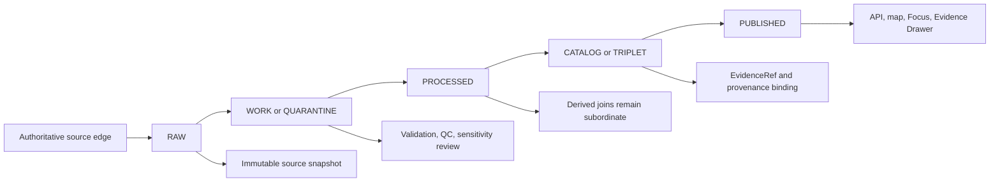
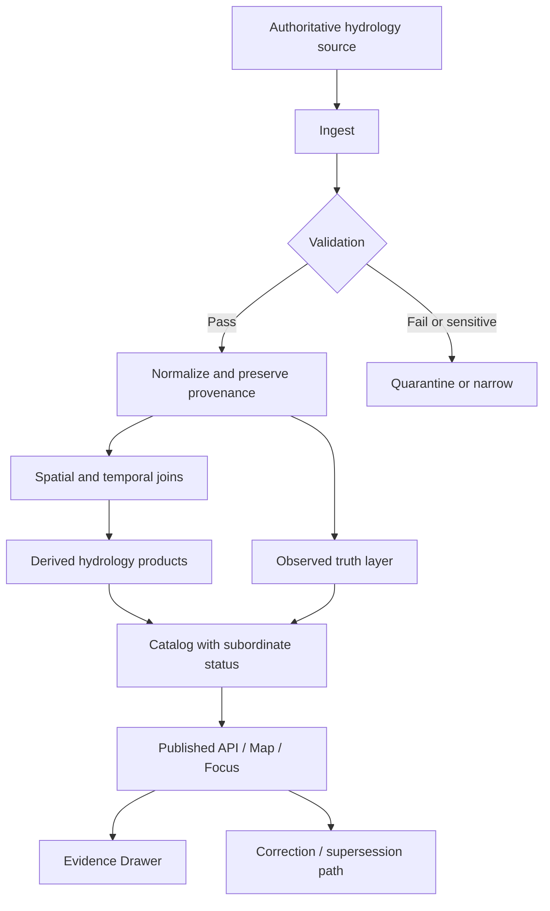

<!--
doc_id: NEEDS VERIFICATION
title: Hydrology Domain
type: standard
version: v1
status: draft
owners: [@bartytime4life, NEEDS VERIFICATION]
created: NEEDS VERIFICATION
updated: 2026-04-01
policy_label: public
related: [
  "docs/domains/README.md",
  "docs/governance/ROOT_GOVERNANCE.md",
  "docs/governance/ETHICS.md",
  "docs/governance/SOVEREIGNTY.md",
  "docs/standards/KFM_MARKDOWN_WORK_PROTOCOL.md",
  "docs/standards/markdown-rules.md",
  ".github/CODEOWNERS"
]
tags: [kfm, hydrology, water, governance, geospatial, evidence-first]
notes: [
  "Repo-mounted file paths and adjacent domain links require live verification before merge.",
  "Dataset examples below are domain scaffolding, not assertions of active ingestion.",
  "Owners, doc_id, and some related paths are placeholders pending repo confirmation."
]
-->

# Hydrology Domain

**Purpose:** Defines the KFM hydrology/water domain boundary, evidence posture, source hierarchy, and publication rules for surface water, groundwater, watersheds, drought-linked indicators, and water-system-adjacent layers.

<div align="left">

**Status:** `active` • **Owners:** `@bartytime4life` `NEEDS VERIFICATION`


</div>

**Repo fit:** `docs/domains/hydrology/README.md` — domain index for hydrology/water lanes; expected to align with `docs/domains/README.md` and governance standards listed above. **NEEDS VERIFICATION**

**Accepted inputs:** authoritative hydrologic measurements, watershed boundaries, groundwater observations, reservoir and drought-linked indicators, public-safe water system geography, provenance metadata, uncertainty/QC flags, and evidence references.

**Exclusions:** decorative map layers without provenance, uncited hydrologic claims, covertly derived “truth” layers that outrank source authority, exact sensitive infrastructure details without publication review, and any 3D/2.5D surface that weakens evidence, policy, or correction visibility.

---

## Quick jumps

- [Scope](#scope)
- [Repo fit](#repo-fit)
- [Inputs](#inputs)
- [Exclusions](#exclusions)
- [Operating model](#operating-model)
- [Authority and trust rules](#authority-and-trust-rules)
- [Hydrology source roster](#hydrology-source-roster)
- [Publication and sensitivity](#publication-and-sensitivity)
- [Directory shape](#directory-shape)
- [Quickstart](#quickstart)
- [Usage](#usage)
- [Canonical domain flow](#canonical-domain-flow)
- [Core entities](#core-entities)
- [Task list](#task-list)
- [FAQ](#faq)
- [Appendix](#appendix)

---

## Scope

The hydrology domain covers **water as observed, bounded, described, and responsibly published** across Kansas-relevant KFM surfaces.

This domain is expected to include, at minimum:

- **Surface water** — stream gages, discharge, stage, daily and continuous values, reservoir-linked measurements.
- **Groundwater** — wells, water-level observations, aquifer-linked interpretation, groundwater change indicators.
- **Hydrologic units** — watershed and subwatershed geometry used for spatial joins, aggregation, and map navigation.
- **Hydro-climate connectors** — drought, seasonality, precipitation-linked context, and paleohydrology-adjacent references where routed through appropriate analysis lanes.
- **Water systems adjacency** — public-safe service geographies and related infrastructure context where publication is permitted.

This domain does **not** declare every possible water-related dataset as fit for KFM publication. Admission remains governed by provenance quality, authority rank, sensitivity review, and correction handling.

[Back to top](#hydrology-domain)

---

## Repo fit

| Item | Value |
|---|---|
| Canonical path | `docs/domains/hydrology/README.md` |
| Parent | `docs/domains/README.md` **NEEDS VERIFICATION** |
| Governance anchors | `docs/governance/ROOT_GOVERNANCE.md`, `docs/governance/ETHICS.md`, `docs/governance/SOVEREIGNTY.md` |
| Standards anchors | `docs/standards/KFM_MARKDOWN_WORK_PROTOCOL.md`, `docs/standards/markdown-rules.md` |
| Typical downstreams | domain-specific analyses, dataset registries, published APIs, map surfaces, Evidence Drawer content |
| Typical upstreams | authoritative source endpoints, RAW snapshots, release manifests, catalog/provenance systems |

**CONFIRMED:** KFM doctrine expects domain docs to stay subordinate to governance and evidence contracts.

**INFERRED:** This file likely serves as the entry point for hydrology-specific subdocs, dataset notes, and publication rules within the repo.

**NEEDS VERIFICATION:** Adjacent child folders, linked dataset indexes, and actual implementation paths.

[Back to top](#hydrology-domain)

---

## Inputs

The domain accepts inputs that can survive KFM’s trust path:

| Input class | Examples | Minimum acceptance rule |
|---|---|---|
| Authoritative observations | streamflow, gage height, groundwater level measurements | Source identity, timestamp, units, and provenance must be preserved |
| Authoritative geometry | watershed/hydrologic-unit boundaries, approved public-safe service areas | Stable identifier and source version required |
| Historical summaries | percentiles, long-term statistics, approved baselines | Summary method and approval state must be explicit |
| Derived indicators | anomaly bands, HUC summaries, threshold exceedance flags | Must remain visibly derived and subordinate to source truth |
| Publication metadata | provenance records, QC flags, EvidenceRef links, release receipts | Required for consequential claims |
| Sensitivity controls | generalization class, withholding reason, steward review markers | Required when publication risk exists |

### Required minimum fields

The exact contract is **NEEDS VERIFICATION**, but hydrology assets should generally carry:

- `source_uri`
- `retrieved_at`
- `source_authority`
- `dataset_version` or equivalent receipt/hash
- `spatial_ref` / geometry metadata
- `time_start` / `time_end` or observation timestamp
- `units`
- `quality_state` / approval flag
- `license` or publication basis
- `EvidenceRef` or equivalent resolvable citation handle **INFERRED**

[Back to top](#hydrology-domain)

---

## Exclusions

The following are out of scope for this domain README and should not be implied as publishable by default:

- **Unverifiable water maps** assembled from screenshots, PDFs, or convenience exports without authoritative source resolution.
- **Derived-only surfaces** presented as if they were sovereign truth.
- **Sensitive infrastructure detail** published without explicit policy clearance.
- **3D/2.5D hydrology visuals** that hide uncertainty, encourage false precision, or weaken correction lineage.
- **Speculative historical reconstructions** not clearly labeled as modeled, inferred, or under review.
- **Behavioral or rights claims** about communities, landowners, or current systems without direct evidence and policy review.

> [!IMPORTANT]
> Hydrology is often treated as “neutral infrastructure data.” In KFM, it is still subject to evidence, exposure, and correction law.

[Back to top](#hydrology-domain)

---

## Operating model

Hydrology data should move through the same governed truth path used elsewhere in KFM.



### Domain expectations

- **RAW** preserves source payloads and source-visible semantics.
- **WORK / QUARANTINE** is where malformed, suspicious, or policy-sensitive records are held or narrowed.
- **PROCESSED** may normalize units, resolve geometry, and build joins.
- **CATALOG / TRIPLET** provides governed discoverability and lineage.
- **PUBLISHED** must expose enough evidence and status to avoid false certainty.

**CONFIRMED:** Consequential answers must remain evidence-resolvable.

**INFERRED:** Hydrology domain outputs should bind to the same release/correction artifacts referenced by root governance.

[Back to top](#hydrology-domain)

---

## Authority and trust rules

### Source hierarchy inside this domain

| Rank | Class | Examples | Publication posture |
|---|---|---|---|
| 1 | Authoritative observed truth | federal/state measurement services, approved boundaries, official well records | Highest authority for factual observation claims |
| 2 | Authoritative summaries | approved statistics, official historical summaries, state/federal derived baselines | Publish with method and approval state visible |
| 3 | KFM derived layers | HUC joins, anomaly calculations, cross-source harmonization | Must remain explicitly derived |
| 4 | Interpretive overlays | drought framing, narrative summaries, regional rollups | Useful, but never sovereign truth |

### Trust rules

1. **Observed outranks inferred.**
2. **Approved outranks provisional** when making long-horizon or percentile claims.
3. **Source authority outranks convenience.**
4. **Derived surfaces must show their dependency chain.**
5. **Policy narrowing is trust-preserving, not a failure.**

### Runtime posture

Finite outcomes should remain legible at the hydrology surface:

- `ANSWER`
- `ABSTAIN`
- `DENY`
- `ERROR`

> [!NOTE]
> “No safe publishable answer” is preferable to a polished but weakly evidenced hydrology statement.

[Back to top](#hydrology-domain)

---

## Hydrology source roster

This section is a domain pattern, not a live enforcement claim.

| Source family | Role | Typical examples | Status |
|---|---|---|---|
| Federal surface-water services | observed stream and stage measurements | site metadata, instantaneous values, daily values, statistics | **CONFIRMED as valid source class** |
| Federal hydrologic boundaries | watershed geometry and HUC hierarchy | HUC2–HUC12 boundaries | **CONFIRMED as valid source class** |
| State groundwater systems | well inventory, water levels, aquifer context | state geological survey well and water-level systems | **CONFIRMED as valid source class** |
| State water planning / service geography | public-safe administrative or service layers | public supply system boundaries, planning districts | **INFERRED** |
| Derived KFM hydrology products | anomaly, aggregation, evidence-bound map layers | HUC summaries, threshold flags, drought overlays | **PROPOSED / INFERRED** |

### Suggested roster fields

```json
{
  "source_id": "NEEDS_VERIFICATION",
  "title": "NEEDS VERIFICATION",
  "authority_class": "authoritative_observed | authoritative_summary | derived",
  "cadence": "NEEDS VERIFICATION",
  "spatial_key": "site_id | huc12 | well_id | system_id",
  "time_resolution": "instantaneous | daily | periodic | structural",
  "quality_state_field": "NEEDS VERIFICATION",
  "source_uri": "NEEDS VERIFICATION",
  "license_basis": "public_domain | public_safe | NEEDS_VERIFICATION",
  "publication_class": "public-safe | generalized | steward-only | withheld"
}
```

### Minimal admissibility test

A hydrology source should generally be rejected or quarantined if any of the following are missing:

- stable identity
- provenance path
- temporal semantics
- units
- geometry basis or join key
- policy basis for publication

[Back to top](#hydrology-domain)

---

## Publication and sensitivity

Hydrology often overlaps infrastructure, service geography, land use, and culturally sensitive locations. Publication is therefore not automatic.

### Exposure classes

| Class | Meaning | Typical use |
|---|---|---|
| `public-safe` | safe for open publication at stated precision | broad watershed layers, public stream gage data |
| `generalized` | useful but intentionally narrowed | buffered infrastructure context, reduced precision views |
| `steward-only` | available only to trusted review paths | sensitive operational overlays |
| `restricted precise view` | exact data limited by policy or agreement | precise sensitive facilities or controlled operational assets |
| `withheld` | not published on open surfaces | unsafe or insufficiently reviewed detail |

### Required publication distinctions

Hydrology outputs should distinguish:

- **observed vs derived**
- **approved vs provisional**
- **current vs historical baseline**
- **exact vs generalized geometry**
- **public-safe vs withheld detail**

> [!WARNING]
> Do not let convenience water-system layers, infrastructure footprints, or exact operational assets leak into public surfaces merely because they are “GIS-ready.”

[Back to top](#hydrology-domain)

---

## Directory shape

The exact tree is **NEEDS VERIFICATION**. The following shape is a doctrine-aligned target, not a claim of current repo contents.

```text
docs/
└── domains/
    ├── README.md
    └── hydrology/
        ├── README.md
        ├── datasets/
        │   ├── README.md
        │   ├── surface-water.md
        │   ├── groundwater.md
        │   ├── watersheds.md
        │   └── water-systems.md
        ├── publication/
        │   ├── README.md
        │   ├── sensitivity.md
        │   └── exposure-classes.md
        ├── schemas/
        │   ├── README.md
        │   └── hydrology-entity-patterns.md
        └── examples/
            ├── README.md
            └── evidence-safe-map-panels.md
```

[Back to top](#hydrology-domain)

---

## Quickstart

Use this domain README as the entry point before adding new hydrology content.

### For a new dataset note

1. Confirm the source is authoritative or clearly subordinate.
2. Record provenance and source semantics before transforming anything.
3. Decide the publication class before exposing precision.
4. Bind consequential claims to evidence references.
5. Mark all unverified implementation claims as `NEEDS VERIFICATION`.

### For a new map surface

1. Default to **2D**.
2. Show source authority and quality state.
3. Keep derived overlays visibly subordinate.
4. Provide a correction path or visible status if narrowed/withheld.
5. Avoid publication of exact sensitive infrastructure unless explicitly cleared.

### For a new API or Focus view

1. Require resolvable evidence for consequential claims.
2. Surface uncertainty and freshness.
3. Avoid collapsing provisional and approved data into one undifferentiated truth.
4. Preserve lineage across updates, withdrawals, or supersessions.

[Back to top](#hydrology-domain)

---

## Usage

### Example: domain-safe framing language

| Scenario | Preferred wording |
|---|---|
| Real-time stream value | “Observed provisional streamflow at source time…” |
| Historical comparison | “Compared against approved historical baseline…” |
| Derived anomaly layer | “KFM-derived anomaly computed from authoritative observations…” |
| Narrowed infrastructure view | “Generalized for public-safe publication…” |
| Missing support | “ABSTAIN — evidence bundle unavailable or insufficient…” |

### Example: claim labels

- **CONFIRMED** — directly supported by doctrine or visible repo evidence
- **INFERRED** — strongly implied by doctrine, not live-verified in repo
- **PROPOSED** — recommended target shape consistent with doctrine
- **UNKNOWN** — no reliable evidence in session
- **NEEDS VERIFICATION** — must be checked before merge/publication

### Example: minimum dataset note headings

```md
# Dataset Name

- Authority:
- Source URI:
- Spatial basis:
- Temporal basis:
- Quality / approval state:
- Publication class:
- Key exclusions:
- Evidence path:
- Correction handling:
```

[Back to top](#hydrology-domain)

---

## Canonical domain flow



This is the heart of the domain: **observed truth and derived convenience can coexist, but they must never become indistinguishable.**

[Back to top](#hydrology-domain)

---

## Core entities

The exact schemas are not visible in-session. The following table is a domain-aligned entity registry starter.

| Entity | Purpose | Canonical keys | Notes |
|---|---|---|---|
| `HydrologyObservation` | measured value at a time | `observation_id`, `source_id`, `observed_at` | observed truth |
| `HydrologyStation` | monitoring location | `station_id`, `authority_id` | stream gage, monitor, sensor site |
| `GroundwaterWell` | well identity and metadata | `well_id` | may be publication-gated |
| `HydrologicUnit` | watershed geometry | `huc`, `level` | structural spatial authority |
| `HydrologyStatistic` | approved historical summary | `stat_id`, `basis_period` | not the same as live observation |
| `HydrologyDerivedLayer` | subordinate derived output | `layer_id`, `method_id` | anomaly, rollup, threshold flags |
| `WaterServiceArea` | public-safe service geography | `system_id` | publication basis must be explicit |
| `HydrologyEvidenceBundle` | claim support package | `evidence_id` | binds claim to source and method |

[Back to top](#hydrology-domain)

---

## Task list

### Definition of done for this README

- [ ] Confirm `doc_id`, owners, and dates
- [ ] Verify parent/related paths exist
- [ ] Confirm whether hydrology has child folders already in repo
- [ ] Link actual dataset registry or schema docs if present
- [ ] Replace inferred entity names with confirmed schema names where available
- [ ] Add any repo-specific examples or screenshots
- [ ] Confirm whether public water system/service-area layers are actually in-scope
- [ ] Confirm actual publication classes used by this lane, if domain-specific refinements exist

### Follow-on docs that would likely help

- [ ] `docs/domains/hydrology/datasets/README.md`
- [ ] `docs/domains/hydrology/publication/sensitivity.md`
- [ ] `docs/domains/hydrology/schemas/README.md`
- [ ] `docs/domains/hydrology/examples/README.md`

[Back to top](#hydrology-domain)

---

## FAQ

### Is this README asserting active ingestion pipelines?
No. Any such claim would require live repo evidence. This file defines domain posture and expected boundaries only.

### Does this domain include drought and paleohydrology?
Potentially, but only where routed through appropriate analyses and with publication/sensitivity controls intact. Exact lane ownership is **NEEDS VERIFICATION**.

### Can derived hydrology layers be published?
Yes, if they stay visibly derived, cite their inputs/method, and do not outrank authoritative truth.

### Are water-system layers always public-safe?
No. Some may be public-safe at generalized precision; others may require narrowing, steward review, or withholding.

### Should hydrology maps default to 3D terrain?
No. KFM’s default surface is 2D. 3D carries extra burden and must not weaken evidence, policy, or correction visibility.

[Back to top](#hydrology-domain)

---

## Appendix

<details>
<summary><strong>Suggested authoring notes for future maintainers</strong></summary>

### Good domain doc behavior
- Names the lane clearly.
- States what belongs and what does not.
- Makes trust boundaries legible.
- Avoids pretending that a domain README is a schema, an API contract, or proof of active ingestion.

### Common mistakes to avoid
- Treating provisional values as settled truth.
- Publishing water infrastructure detail without policy review.
- Hiding derivation behind polished UI.
- Using historical summaries without stating basis period or approval semantics.
- Inferring repo implementation from doctrine without marking it `INFERRED` or `NEEDS VERIFICATION`.

### Merge caution
Before merge, verify:
- file path correctness
- adjacent docs
- owners/CODEOWNERS
- internal links
- any claimed domain children
- any dataset examples that might imply implementation

</details>

[Back to top](#hydrology-domain)