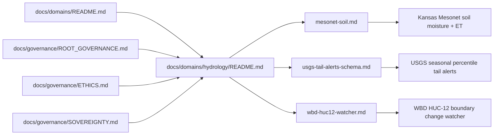
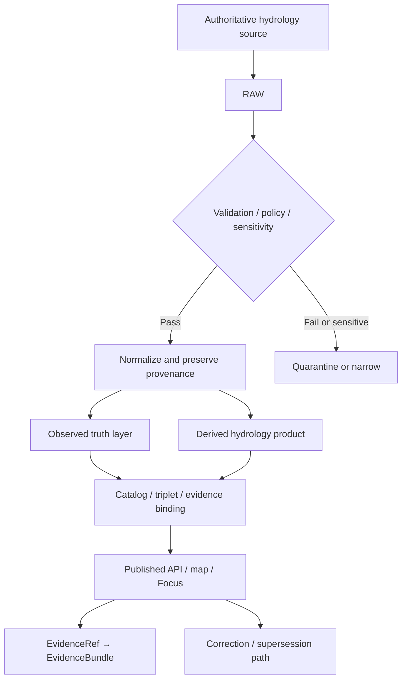

<!-- [KFM_META_BLOCK_V2]
doc_id: kfm://doc/REVIEW_REQUIRED_UUID
title: Hydrology Domain
type: standard
version: v1
status: draft
owners: [@bartytime4life]
created: REVIEW_REQUIRED_DATE
updated: REVIEW_REQUIRED_DATE
policy_label: public
related: [
  "docs/domains/README.md",
  "docs/domains/hydrology/mesonet-soil.md",
  "docs/domains/hydrology/usgs-tail-alerts-schema.md",
  "docs/domains/hydrology/wbd-huc12-watcher.md",
  "docs/governance/ROOT_GOVERNANCE.md",
  "docs/governance/ETHICS.md",
  "docs/governance/SOVEREIGNTY.md",
  "docs/standards/KFM_MARKDOWN_WORK_PROTOCOL.md",
  "docs/standards/markdown-rules.md",
  ".github/CODEOWNERS"
]
tags: [kfm, hydrology, water, governance, evidence-first]
notes: [
  "Current public hydrology subtree is verified on public main.",
  "Canonical created/updated dates need merge-time confirmation because file history includes delete/recreate events.",
  "Resolve the usgs-tail-alerts filename/path drift before treating either name as canonical."
]
[/KFM_META_BLOCK_V2] -->

# Hydrology Domain

Authoritative lane README for KFM hydrology scope, current public subtree, source-role discipline, and publication burden.

<div align="left">

**Status:** `active` · **Doc state:** `draft` · **Owners:** `@bartytime4life`


**Repo fit:** `docs/domains/hydrology/README.md` → parent [`../README.md`](../README.md) · child docs [`./mesonet-soil.md`](./mesonet-soil.md) · [`./usgs-tail-alerts-schema.md`](./usgs-tail-alerts-schema.md) · [`./wbd-huc12-watcher.md`](./wbd-huc12-watcher.md)

**Current public-main state:** the hydrology subtree is checked in and currently contains four files. Runtime contracts, catalog paths, watcher pipelines, and API surfaces remain a mix of checked-in docs and explicitly `PROPOSED` child-doc references.

**Accepted inputs:** lane boundary notes, source-family and source-role maps, hydrology-specific publication-burden guidance, child-doc indexing, evidence-safe phrasing, and clearly labeled `CONFIRMED` / `INFERRED` / `PROPOSED` / `UNKNOWN` updates.

**Exclusions:** raw source packages, runtime contracts, policy bundles, fixture logic, precise sensitive infrastructure detail, and speculative repo-shape claims presented as checked-in fact.

</div>

> [!IMPORTANT]
> This revision is grounded in the current public `main` tree, not just earlier PDF-session scaffolding. Keep checked-in hydrology files and visible path drift explicit; do not let proposed expansion folders masquerade as present repo state.

## Quick jumps

- [Scope](#scope)
- [Repo fit](#repo-fit)
- [Inputs](#inputs)
- [Exclusions](#exclusions)
- [Directory tree](#directory-tree)
- [Quickstart](#quickstart)
- [Usage](#usage)
- [Diagram](#diagram)
- [Tables](#tables)
- [Task list](#task-list)
- [FAQ](#faq)
- [Appendix](#appendix)

---

## Scope

The hydrology lane covers **water as observed, bounded, described, and responsibly published** across Kansas-relevant KFM surfaces.

At lane level, that includes:

- **Surface water** — stream gages, discharge, stage, daily and continuous values, reservoirs, flood stages, and watershed context.
- **Groundwater** — wells, water-level observations, aquifer-linked interpretation, and groundwater change indicators.
- **Hydrologic units and flood geometry** — watershed boundaries, HUC-derived joins, and flood-risk or flood-context geometry where the source role is clear.
- **Hydro-climate connectors** — drought-linked indicators, seasonal comparison baselines, and adjacent climate context where source authority and modeled status stay visible.
- **Water governance context** — public-safe regulatory or administrative water context, including state or local reporting that does not outrank direct observation.

This README is the lane boundary and navigation surface. It should help maintainers answer three questions quickly:

1. What belongs in hydrology, and what belongs in some other lane or artifact surface?
2. Which current public hydrology docs already exist here?
3. What remains `PROPOSED` or `NEEDS VERIFICATION` instead of checked-in repo reality?

### Truth labels used in this file

| Label | Use here |
|---|---|
| `CONFIRMED` | Supported by the current public repo tree or checked-in governance/docs surfaces |
| `INFERRED` | Conservative structural completion that fits KFM doctrine but is not directly proven as current runtime or repo reality |
| `PROPOSED` | Recommended doc structure, lane packaging, or follow-on artifact shape |
| `UNKNOWN` | Not verified strongly enough to state as current project fact |
| `NEEDS VERIFICATION` | Concrete detail to confirm before merge or cross-linking |

[Back to top](#hydrology-domain)

---

## Repo fit

| Item | Value |
|---|---|
| Canonical path | `docs/domains/hydrology/README.md` |
| Parent | [`../README.md`](../README.md) |
| Governance anchors | [`../../governance/ROOT_GOVERNANCE.md`](../../governance/ROOT_GOVERNANCE.md) · [`../../governance/ETHICS.md`](../../governance/ETHICS.md) · [`../../governance/SOVEREIGNTY.md`](../../governance/SOVEREIGNTY.md) |
| Standards anchors | [`../../standards/KFM_MARKDOWN_WORK_PROTOCOL.md`](../../standards/KFM_MARKDOWN_WORK_PROTOCOL.md) · [`../../standards/markdown-rules.md`](../../standards/markdown-rules.md) |
| Owner fallback | [`../../../.github/CODEOWNERS`](../../../.github/CODEOWNERS) currently covers `/docs/` under `@bartytime4life` |
| Current public children | [`./mesonet-soil.md`](./mesonet-soil.md) · [`./usgs-tail-alerts-schema.md`](./usgs-tail-alerts-schema.md) · [`./wbd-huc12-watcher.md`](./wbd-huc12-watcher.md) |
| Lane role | Hydrology boundary doc, child-doc index, source-family guide, publication-burden note |
| Typical downstreams | Source-specific hydrology docs, watchers, alert logic docs, map/evidence surfaces, lane-specific release notes |
| Typical upstreams | KFM governance doctrine, `docs/domains/README.md`, public hydrology source systems, review/policy rules |

> [!NOTE]
> The parent `docs/domains/README.md` still carries older `INFERRED / NEEDS VERIFICATION` tree language for many lanes. For hydrology, the subtree itself is now checked-in public-tree evidence, so this file should distinguish **current public reality** from **expansion intent** instead of repeating older placeholder trees wholesale.

[Back to top](#hydrology-domain)

---

## Inputs

This README accepts material that helps maintainers keep the hydrology lane truthful, navigable, and bounded.

| Input class | Examples | Acceptance rule |
|---|---|---|
| Lane boundary notes | what hydrology includes, excludes, and delegates | Must stay lane-wide and not impersonate contracts or runtime proof |
| Source-family maps | USGS, FEMA, KDHE, Kansas Mesonet, watershed programs | Must distinguish observed, administrative, and derived roles |
| Publication-burden guidance | public-safe, generalized, withheld, steward-only handling | Must stay aligned with governance and sovereignty docs |
| Child-doc indexing | checked-in hydrology files and their roles | Must reflect the current public tree, not a wished-for tree |
| Evidence-safe phrasing | claim language, caution wording, lane-wide interpretation notes | Must preserve provenance, uncertainty, and correction visibility |
| Proposed expansion notes | normalized subtree ideas, follow-on doc map, starter entities | Must remain explicitly `PROPOSED` or `NEEDS VERIFICATION` |

### Lane-wide minimums (`INFERRED` / `PROPOSED` until contract surfaces say otherwise)

Hydrology-facing records and examples in this doc should generally assume:

- `source_uri`
- `retrieved_at`
- `content_hash` or equivalent receipt/hash
- `source_authority`
- `time_start` / `time_end` or `observed_at`
- `spatial_ref` or stable join key
- `units`
- `quality_state`
- `license` or publication basis
- `EvidenceRef` or resolvable evidence handle

These are lane expectations, not checked-in schema claims.

[Back to top](#hydrology-domain)

---

## Exclusions

| This does **not** belong here | Put it with | Why |
|---|---|---|
| Raw source packages, snapshots, or extracted tables | RAW / WORK / CATALOG artifacts | Truth-path artifacts are not lane README content |
| JSON Schemas, valid/invalid fixtures, or policy bundles | Contract / schema / policy / test surfaces | Lane docs should reference enforcement, not replace it |
| Runtime route contracts, state ownership, or UI choreography | API / runtime / UI docs | This file is a lane boundary, not a runtime spec |
| Emergency warning or life-safety operations | Dedicated operational policy or alerting docs | Hydrology context is not automatically emergency authority |
| Precise sensitive infrastructure or location detail | Review flow, generalized release, steward-only surfaces | Public lane docs must not leak exact high-burden detail |
| Unverified pipeline, catalog, or API paths | Explicit `PROPOSED` notes or verification backlog | Do not turn documentation into false implementation evidence |

> [!WARNING]
> Hydrology is often treated as “neutral infrastructure data.” In KFM, it is still subject to evidence, exposure, correction, narrowing, and withholding rules.

[Back to top](#hydrology-domain)

---

## Directory tree

### Current public subtree (`CONFIRMED`)

```text
docs/
└── domains/
    ├── README.md
    └── hydrology/
        ├── README.md
        ├── mesonet-soil.md
        ├── usgs-tail-alerts-schema.md
        └── wbd-huc12-watcher.md
```

### Current public inventory

| File | Current role | Notes |
|---|---|---|
| [`README.md`](./README.md) | Lane boundary + child-doc index | Current public hydrology landing page |
| [`mesonet-soil.md`](./mesonet-soil.md) | Source-specific domain specification | Kansas Mesonet soil moisture + ET handling; explicitly source-grounded and explicit that live ingestion status remains unverified |
| [`usgs-tail-alerts-schema.md`](./usgs-tail-alerts-schema.md) | Alerting standard | Seasonal percentile alert design for USGS-monitored sites; emphasizes `ABSTAIN` when baseline is missing or stale |
| [`wbd-huc12-watcher.md`](./wbd-huc12-watcher.md) | Watcher / impact-event design | HUC-12 boundary change watcher; pipeline/catalog/API paths inside remain partly `PROPOSED` |

> [!WARNING]
> One visible path drift exists today: the checked-in file is `usgs-tail-alerts-schema.md`, but its own repo-fit text still points to `docs/domains/hydrology/usgs-tail-alerts.md`. Resolve the canonical filename before adding more cross-references.

<details>
<summary><strong>Proposed normalized expansion map (`PROPOSED` / `NEEDS VERIFICATION`)</strong></summary>

```text
docs/
└── domains/
    └── hydrology/
        ├── README.md
        ├── datasets/
        │   ├── README.md
        │   ├── surface-water.md
        │   ├── groundwater.md
        │   ├── watersheds.md
        │   └── water-systems.md
        ├── publication/
        │   ├── README.md
        │   ├── sensitivity.md
        │   └── exposure-classes.md
        ├── schemas/
        │   ├── README.md
        │   └── hydrology-entity-patterns.md
        └── examples/
            ├── README.md
            └── evidence-safe-map-panels.md
```

Keep this block aspirational until the repo actually checks these paths in.

</details>

[Back to top](#hydrology-domain)

---

## Quickstart

### When to edit **this** file

Edit `docs/domains/hydrology/README.md` when you need to:

1. change hydrology lane scope or exclusions;
2. add or remove checked-in hydrology child docs;
3. update lane-wide source-family or publication-burden guidance;
4. repair relative links, owner notes, or current public-tree descriptions;
5. surface a repo-visible drift that affects the lane index.

### When to edit a child doc instead

| Need | Edit |
|---|---|
| Kansas Mesonet soil moisture or ET source handling | [`./mesonet-soil.md`](./mesonet-soil.md) |
| Seasonal USGS percentile/tail alert logic | [`./usgs-tail-alerts-schema.md`](./usgs-tail-alerts-schema.md) |
| HUC-12 boundary change watcher behavior | [`./wbd-huc12-watcher.md`](./wbd-huc12-watcher.md) |
| Machine-checkable schema / fixture / policy work | Contract / schema / policy / test surfaces outside this subtree |

### Safe editing sequence

1. Read [`../README.md`](../README.md) for lane-level framing.
2. Read the relevant child doc if your change is source-specific.
3. Keep `CONFIRMED` repo facts separate from `PROPOSED` expansion.
4. Prefer relative links to checked-in files.
5. Do not add runtime, catalog, or API claims unless the current public tree actually proves them.

[Back to top](#hydrology-domain)

---

## Usage

### Lane operating model

Hydrology should follow the same governed path used elsewhere in KFM:

- **Source edge** preserves source identity and source-visible semantics.
- **RAW** keeps immutable payloads and retrieval facts.
- **WORK / QUARANTINE** handles validation, narrowing, suppression, or rejection.
- **PROCESSED** normalizes units, joins geometry, and preserves provenance.
- **CATALOG / TRIPLET** binds evidence, metadata, and release context.
- **PUBLISHED** stays downstream of policy, evidence resolution, and correction handling.

The lane rule worth keeping in view is simple:

> observed truth and derived convenience can coexist, but they must never become indistinguishable.

### What belongs here vs elsewhere

| If the change is about… | Put it here? | Better home |
|---|---:|---|
| lane boundary, source-role distinctions, public subtree inventory | Yes | `README.md` |
| Kansas Mesonet station observations and ET variables | No | `mesonet-soil.md` |
| USGS percentile-based tail conditions | No | `usgs-tail-alerts-schema.md` |
| WBD HUC-12 change watching and emitted impact events | No | `wbd-huc12-watcher.md` |
| runtime schemas, API payloads, watcher pipeline manifests | No | contract / runtime / pipeline surfaces |
| precise sensitive features or steward-only release detail | No | governed review / generalized downstream surface |

### Preferred framing language

| Scenario | Preferred wording |
|---|---|
| Real-time stream value | “Observed provisional streamflow at source time…” |
| Historical comparison | “Compared against approved historical baseline…” |
| Derived anomaly layer | “KFM-derived anomaly computed from authoritative observations…” |
| Narrowed infrastructure view | “Generalized for public-safe publication…” |
| Missing support | “ABSTAIN — evidence bundle unavailable or insufficient…” |

### Trust rules worth preserving

1. **Observed outranks inferred.**
2. **Approved baseline outranks provisional history** when percentile or seasonal comparison is in play.
3. **Source authority outranks convenience.**
4. **Derived surfaces must show their dependency chain.**
5. **Policy narrowing is trust-preserving, not a failure.**

[Back to top](#hydrology-domain)

---

## Diagram

### Current public hydrology doc map



### Canonical lane flow



[Back to top](#hydrology-domain)

---

## Tables

### Hydrology source classes

| Source class | Typical examples | Lane status | Publication note |
|---|---|---|---|
| Authoritative observed hydrology | USGS NWIS current observations, daily values, site metadata | `CONFIRMED` | Highest authority for direct factual observation claims |
| Hydrologic boundaries / flood context | WBD HUC hierarchy, FEMA NFHL | `CONFIRMED` | Structural geometry or regulatory context should stay distinct from live observations |
| State / local water governance context | KDHE, reservoir and watershed programs, local water reporting | `CONFIRMED` at source-family level | Administrative or regulatory context should not silently outrank direct measurement |
| Station agronomic / soil-water observations | Kansas Mesonet soil moisture and ET | `CONFIRMED` as checked-in child-doc topic | Trusted source for its own station observations; not parcel-sovereign truth |
| Derived KFM layers | HUC summaries, threshold flags, watcher emissions, alert outputs | `INFERRED` / `PROPOSED` | Must remain explicitly derived, evidence-bound, and correctable |

### Entity starter registry

| Entity | Purpose | Canonical keys | Notes |
|---|---|---|---|
| `HydrologyObservation` | measured value at a time | `observation_id`, `source_id`, `observed_at` | observed truth |
| `HydrologyStation` | monitoring location | `station_id`, `authority_id` | stream gage, monitor, sensor site |
| `GroundwaterWell` | well identity and metadata | `well_id` | may be publication-gated |
| `HydrologicUnit` | watershed geometry | `huc`, `level` | structural spatial authority |
| `HydrologyStatistic` | approved historical summary | `stat_id`, `basis_period` | not the same as live observation |
| `HydrologyDerivedLayer` | subordinate derived output | `layer_id`, `method_id` | anomaly, rollup, threshold flags |
| `WaterServiceArea` | public-safe service geography | `system_id` | publication basis must be explicit |
| `HydrologyEvidenceBundle` | claim support package | `evidence_id` | binds claim to source and method |

[Back to top](#hydrology-domain)

---

## Task list

### Definition of done for this README

- [ ] assign `doc_id`
- [ ] settle canonical `created` / `updated` values in the meta block
- [ ] confirm whether the current `/docs/` CODEOWNERS fallback is sufficient for this lane
- [ ] resolve the `usgs-tail-alerts-schema.md` vs `usgs-tail-alerts.md` path drift
- [ ] verify whether any live hydrology pipeline, catalog, or API paths now exist before linking them here
- [ ] decide whether the proposed expansion folders should be checked in or remain conceptual
- [ ] keep relative links aligned with the checked-in hydrology subtree
- [ ] ensure no runtime claim outruns current public evidence

### Good next docs only after they are real

- [ ] `docs/domains/hydrology/datasets/README.md`
- [ ] `docs/domains/hydrology/publication/sensitivity.md`
- [ ] `docs/domains/hydrology/schemas/README.md`
- [ ] `docs/domains/hydrology/examples/README.md`

[Back to top](#hydrology-domain)

---

## FAQ

### Is hydrology still the preferred first thin slice?
Yes. In current KFM doctrine, hydrology remains the clearest public-safe proof slice: place-rich, time-rich, operationally legible, and cross-layered without the heaviest exposure burden.

### Does this README prove live ingestion or publishing?
No. The current public tree proves lane docs exist. It does **not** by itself prove a live ingestion pipeline, catalog closure, API route, or public release object.

### Why separate the current public subtree from the proposed expansion map?
Because the repo now has a checked-in hydrology subtree, while many normalized expansion paths remain useful but unverified. Mixing the two would turn documentation into false repo evidence.

### Are water-system layers always public-safe?
No. Some may be public-safe at generalized precision; others may require narrowing, role-gating, or withholding.

### Should hydrology default to 3D or 2.5D presentation?
No. KFM’s authoritative shell is still 2D-first. Use 3D only when it materially improves reasoning and still inherits the same evidence, policy, and correction model.

[Back to top](#hydrology-domain)

---

## Appendix

<details>
<summary><strong>Starter review checklist for future maintainers</strong></summary>

### Good hydrology-lane README behavior

- names the lane clearly;
- distinguishes checked-in reality from planned structure;
- points readers to the right child doc fast;
- makes trust boundaries legible;
- refuses to impersonate runtime proof.

### Common mistakes to avoid

- treating provisional values as settled truth;
- publishing water infrastructure detail without policy review;
- hiding derivation behind polished UI;
- repeating proposed folder trees as if they already exist;
- adding runtime or pipeline claims without current public evidence.

### Merge caution

Before merge, verify:

- file path correctness
- internal relative links
- hydrology subtree inventory
- owner fallback or lane-specific owners
- any filename/path drift
- any new claim that sounds like live runtime behavior

</details>

[Back to top](#hydrology-domain)
