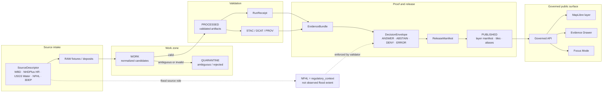

<!-- [KFM_META_BLOCK_V2]
doc_id: kfm://doc/TODO-generate-uuid
title: KFM Hydrology Domain
type: standard
version: v1
status: draft
owners: TODO: hydrology domain steward; documentation steward
created: 2026-04-22
updated: 2026-04-22
policy_label: TODO-public-or-restricted
related: [docs/domains/hydrology/ARCHITECTURE.md, docs/domains/hydrology/DATA_LIFECYCLE.md, docs/domains/hydrology/SOURCE_REGISTRY.md, docs/adr/ADR-0001-hydrology-schema-home.md]
tags: [kfm, hydrology, evidence-first, map-first, time-aware, governed]
notes: [Repo availability and owners need verification before publish, Adjacent related paths are proposed until mounted repo inspection]
[/KFM_META_BLOCK_V2] -->

# KFM Hydrology Domain

Hydrology is KFM’s first governed proof lane: a public-safe, time-aware, evidence-drill-through domain for proving the RAW → PUBLISHED trust path.

<a id="top"></a>

## Impact block

| Field | Value |
| --- | --- |
| Status | **experimental** / draft documentation |
| Owners | **TODO:** verify hydrology domain steward, documentation steward, policy steward |
| Path | `docs/domains/hydrology/README.md` |
| Badges |     |
| Quick jumps | [Scope](#scope) · [Repo fit](#repo-fit) · [Inputs](#inputs) · [Exclusions](#exclusions) · [Directory tree](#directory-tree) · [Flow](#governed-flow) · [Gates](#definition-of-done) · [Quickstart](#quickstart) |

> [!IMPORTANT]
> **NEEDS VERIFICATION:** This README is repo-ready content for the hydrology domain landing page. Adjacent paths, owners, schema homes, package commands, CI workflows, and route names must be verified in the mounted repository before this document is promoted beyond draft.

---

## Scope

The hydrology lane exists to prove KFM’s governed publication model with real spatial-temporal burden: source identity, hydrologic identity, observation time, regulatory context, catalog closure, proof objects, map delivery, Evidence Drawer explanation, Focus Mode abstention, and rollback.

**CONFIRMED doctrine:** hydrology is the preferred first proof lane because it is public-safe, time-aware, spatially legible, source-rich, and naturally suited to evidence drill-through.

**PROPOSED implementation:** build the first slice with fixture-first, no-network validation before any live connector, public alias, production watcher, model integration, or simulation product.

Hydrology includes:

| Area | Included posture |
| --- | --- |
| WBD / HUC watershed boundaries | Hydrologic-unit framing, especially HUC12, with hierarchy, source metadata, geometry/content fingerprinting, and reviewable diffs. |
| NHDPlus HR identity and hydrography | Governed identity bridge using Permanent Identifier where available, COMID only as a legacy compatibility key, and explicit split/merge/ambiguous outcomes. |
| USGS Water Data / NWIS observations | Streamflow and stage observations with parameter code, unit, timestamp, qualifier, approval/provisional state, freshness, and no-data reasons. |
| FEMA NFHL flood context | Regulatory flood hazard context only; never treated as observed inundation. |
| Terrain-derived hydrology | Deterministic derivatives from DEM sources with CRS, vertical datum, nodata, conditioning, algorithm, and rebuildability metadata. |
| Observed or historical flood evidence | Separate event evidence with event date, evidence type, provenance, confidence, and correction lineage. |

Hydrology does **not** collapse all water-adjacent material into a single “water layer.” Water quality, groundwater, wetlands, reservoirs, dams, hydraulic structures, hydroclimate, soil moisture, and allocation context are related but require separate source roles, schemas, and release burdens.

<p align="right"><a href="#top">Back to top ↑</a></p>

---

## Repo fit

This README is the landing page for `docs/domains/hydrology/`. It should orient maintainers, reviewers, and implementation agents. It should not replace schemas, source registries, run receipts, proof packs, catalog records, or API contracts.

| Relationship | Link / path | Status |
| --- | --- | --- |
| This file | `docs/domains/hydrology/README.md` | PROPOSED_CREATE |
| Architecture doc | [ARCHITECTURE.md](ARCHITECTURE.md) | PROPOSED_CREATE |
| Identity rules | [IDENTITY_MODEL.md](IDENTITY_MODEL.md) | PROPOSED_CREATE |
| Lifecycle rules | [DATA_LIFECYCLE.md](DATA_LIFECYCLE.md) | PROPOSED_CREATE |
| Source registry guide | [SOURCE_REGISTRY.md](SOURCE_REGISTRY.md) | PROPOSED_CREATE |
| API contract guide | [API_CONTRACTS.md](API_CONTRACTS.md) | PROPOSED_CREATE |
| Map/UI contract guide | [MAP_UI_CONTRACTS.md](MAP_UI_CONTRACTS.md) | PROPOSED_CREATE |
| Schema-home decision | [../../adr/ADR-0001-hydrology-schema-home.md](../../adr/ADR-0001-hydrology-schema-home.md) | P0 / NEEDS VERIFICATION |
| Hydrologic identity ADR | [../../adr/ADR-0002-hydrologic-identity-and-abstain.md](../../adr/ADR-0002-hydrologic-identity-and-abstain.md) | P0 / PROPOSED |
| Flood source-role ADR | [../../adr/ADR-0003-flood-source-role-separation.md](../../adr/ADR-0003-flood-source-role-separation.md) | P0 / PROPOSED |
| Public surface boundary ADR | [../../adr/ADR-0004-hydrology-public-surface-boundary.md](../../adr/ADR-0004-hydrology-public-surface-boundary.md) | P0 / PROPOSED |
| Source registry home | `../../../data/registry/hydrology/` | PROPOSED_CREATE |
| Preferred schema home | `../../../schemas/contracts/v1/hydrology/` | PROPOSED_CREATE pending ADR |
| Alternate schema home | `../../../contracts/hydrology/` | MISSING_NEEDS_VERIFICATION |
| Validators | `../../../tools/validators/hydrology/` | PROPOSED_CREATE |
| Tests | `../../../tests/hydrology/` and `../../../tests/fixtures/hydrology/` | PROPOSED_CREATE |
| Public API surface | `../../../apps/governed_api/openapi/hydrology.yaml` | PROPOSED / path convention unknown |
| Map/UI surface | `../../../apps/explorer_web/src/features/hydrology/` | PROPOSED / path convention unknown |

> [!NOTE]
> Repo path names such as `apps/governed_api/` and `apps/explorer_web/` are carried forward as proposed homes from hydrology planning material. If the mounted repository uses different naming, update this README through an ADR-backed path migration rather than silently duplicating surfaces.

<p align="right"><a href="#top">Back to top ↑</a></p>

---

## Inputs

### Inputs accepted by this docs directory

| Accepted input | Belongs here | Notes |
| --- | --- | --- |
| Domain orientation | `README.md` | High-level maintainer entrypoint. |
| Domain architecture | `ARCHITECTURE.md` | Bounded context, object families, trust surfaces, dependency seams. |
| Identity discipline | `IDENTITY_MODEL.md` | Permanent Identifier, COMID compatibility, ambiguity handling, ABSTAIN rules. |
| Lifecycle policy | `DATA_LIFECYCLE.md` | RAW → WORK/QUARANTINE → PROCESSED → CATALOG/TRIPLET → PUBLISHED. |
| Source registry explanation | `SOURCE_REGISTRY.md` | Human guide to source descriptors; machine descriptors live under `data/registry/hydrology/`. |
| API and UI explanations | `API_CONTRACTS.md`, `MAP_UI_CONTRACTS.md` | Human-facing contract documentation; machine contracts and fixtures live elsewhere. |
| Verification backlog | `VERIFICATION_BACKLOG.md` | Open checks, current unknowns, source-rights reviews, repo convention follow-ups. |

### Inputs accepted by the hydrology lane

| Accepted lane input | Canonical/proposed home | Required posture |
| --- | --- | --- |
| Source descriptors | `data/registry/hydrology/sources/*.yaml` | Include source role, steward, cadence, rights, URL, schema/version, and activation state. |
| Pinned no-network fixtures | `data/raw/hydrology/fixtures/` | Must be small, reviewable, rights-safe, and sufficient for validators. |
| Normalized working artifacts | `data/work/hydrology/{run_id}/` | Per-run, non-public, rebuildable intermediates. |
| Rejected or ambiguous artifacts | `data/quarantine/hydrology/{run_id}/` | Required for invalid observations and unresolved hydrologic identity. |
| Processed artifacts | `data/processed/hydrology/{spec_hash}/` | Validated, deterministic, versioned by content/spec identity. |
| Catalog records | `data/catalog/stac/hydrology/`, `data/catalog/dcat/hydrology/`, `data/prov/hydrology/` | STAC/DCAT/PROV closure required before release. |
| Receipts and proof objects | `data/receipts/hydrology/`, `data/proofs/hydrology/` | RunReceipt, EvidenceBundle, DecisionEnvelope, ReleaseManifest, correction, rollback. |
| Published delivery artifacts | `data/published/hydrology/{spec_hash}/` | Released artifacts only; public aliases must be governed state transitions. |

<p align="right"><a href="#top">Back to top ↑</a></p>

---

## Exclusions

| Does not belong here | Where it goes instead | Reason |
| --- | --- | --- |
| Secrets, API keys, credentials, tokens | Secret manager / deployment configuration | Never commit secrets to docs, registries, fixtures, or examples. |
| Direct public reads of RAW, WORK, or QUARANTINE data | Governed API over released artifacts and EvidenceBundle resolution | Public clients must not bypass the trust membrane. |
| NFHL as “observed flood extent” | `flood_context` schema and flood source-role ADR | FEMA NFHL is regulatory context, not observed inundation evidence. |
| Ambiguous COMID joins presented as resolved identity | Quarantine record or DecisionEnvelope with `ABSTAIN` | Hydrologic identity ambiguity is a legitimate negative outcome. |
| Hydrologic simulation as observation | Experimental model-card path, reviewed separately | Simulation requires model card, calibration, uncertainty, review state, and tests. |
| Broad “water blob” schemas | Lane-specific schemas and source-role contracts | Hydrology, wetlands, water quality, groundwater, structures, and soil moisture are not interchangeable. |
| Emergency or life-safety guidance | Official warning/alerting systems and source guidance | KFM may provide evidence context; it is not an emergency alert system. |
| Unreviewed public aliases | Promotion gate and ReleaseManifest path | Publication is a governed state transition, not a file move. |

<p align="right"><a href="#top">Back to top ↑</a></p>

---

## Directory tree

PROPOSED until verified in the mounted repository:

```text
docs/domains/hydrology/
├── README.md
├── ARCHITECTURE.md
├── IDENTITY_MODEL.md
├── DATA_LIFECYCLE.md
├── SOURCE_REGISTRY.md
├── API_CONTRACTS.md
├── MAP_UI_CONTRACTS.md
├── FILE_SYSTEM_PLAN.md
├── CANONICAL_PATHS.md
├── CONTINUITY_INVENTORY.md
├── PRESERVATION_MATRIX.md
├── MISSING_OR_PLANNED_FILES.md
├── VERIFICATION_BACKLOG.md
├── EXPANSION_BACKLOG.md
├── HYDROLOGY_CHANGELOG.md
├── RELEASE_INDEX.md
└── HYDROLOGY_EXPANSION_PLAN.md
```

Adjacent proposed control-plane homes:

```text
docs/adr/
├── ADR-0001-hydrology-schema-home.md
├── ADR-0002-hydrologic-identity-and-abstain.md
├── ADR-0003-flood-source-role-separation.md
└── ADR-0004-hydrology-public-surface-boundary.md

docs/runbooks/hydrology/
├── PROMOTION_RUNBOOK.md
├── ROLLBACK_RUNBOOK.md
├── SOURCE_REFRESH_RUNBOOK.md
└── NO_NETWORK_TEST_RUNBOOK.md

schemas/contracts/v1/hydrology/
data/registry/hydrology/
policy/hydrology/
tools/validators/hydrology/
tests/hydrology/
tests/fixtures/hydrology/
```

<p align="right"><a href="#top">Back to top ↑</a></p>

---

## Governed flow



The public surface is intentionally downstream. MapLibre renders released layers; the Evidence Drawer explains source role, limitations, freshness, correction lineage, and proof references; Focus Mode answers only after EvidenceBundle resolution and must abstain when support is insufficient.

<p align="right"><a href="#top">Back to top ↑</a></p>

---

## First thin slice

The first hydrology PR should stay narrow, reversible, and offline-testable.

| Slice component | First proof target | Required negative state |
| --- | --- | --- |
| WBD HUC12 fixture | One pinned Kansas HUC12 fixture with geometry/content fingerprint | `DENY` if source descriptor incomplete; `ERROR` if schema-home conflict unresolved |
| NHDPlus HR crosswalk fixture | Exact, split, merge, retired, no legacy, ambiguous cases | `ABSTAIN` on unresolved identity |
| USGS Water Data fixture | IV/DV samples for parameters such as discharge and stage | `ABSTAIN` or `DENY` when qualifiers, provisional state, units, timestamp, or no-data reason are missing |
| FEMA NFHL fixture | Regulatory flood context sample | `DENY` if labeled observed flood extent |
| Terrain fixture | Tiny DEM derivative manifest | `DENY` if CRS, vertical datum, nodata, algorithm, or source manifest is missing |
| Proof closure | EvidenceBundle + DecisionEnvelope + ReleaseManifest dry-run | `DENY` unresolved EvidenceRef, catalog ref, receipt, or provenance ref |

> [!WARNING]
> Do **not** widen the first PR to live probes, live source credentials, production terrain processing, public aliases, hydrologic simulation, or broad water-resource modeling. The first proof is a no-network governed path, not a live-data product.

<p align="right"><a href="#top">Back to top ↑</a></p>

---

## Source-role matrix

| Source family | Role | First-lane behavior |
| --- | --- | --- |
| WBD / HUC12 | Hydrologic-unit boundary and watershed packaging context | Preserve hierarchy, area fields, states, source version, geometry hash, and valid/as-of metadata. |
| NHDPlus HR | Hydrography identity and network context | Prefer Permanent Identifier; retain COMID as legacy compatibility; classify relationship and abstain on ambiguity. |
| USGS Water Data / NWIS | Observation and time-series evidence | Preserve site, parameter code, unit, qualifier, timestamp, time zone, approval/provisional status, freshness, and no-data state. |
| FEMA NFHL | Regulatory flood hazard context | Use `flood_context`; never publish as observed inundation. |
| 3DEP / DEM sources | Terrain-derived context | Treat outputs as rebuildable derivatives, not canonical observations. |
| Observed flood evidence | Event evidence | Require event date, evidence type, confidence, geometry provenance, correction lineage, and source role. |
| Water quality / groundwater / wetlands / structures | Expansion lanes or linked context | Do not include in the P0 proof slice unless separately scoped with source role and policy review. |

<p align="right"><a href="#top">Back to top ↑</a></p>

---

## Contract and proof objects

Minimum P0/P1 object families expected for the hydrology lane:

| Object | Proposed home | Why it matters |
| --- | --- | --- |
| `source_descriptor` | `schemas/contracts/v1/hydrology/source_descriptor.schema.json` | Makes source role, rights, cadence, steward, and activation state machine-checkable. |
| `huc12` | `schemas/contracts/v1/hydrology/huc12.schema.json` | Stabilizes hydrologic unit identity, geometry hash, bbox, and valid time. |
| `nhdhr_crosswalk` | `schemas/contracts/v1/hydrology/nhdhr_crosswalk.schema.json` | Records Permanent Identifier / COMID relationship and ambiguity class. |
| `hydro_site` | `schemas/contracts/v1/hydrology/hydro_site.schema.json` | Separates site metadata from observations. |
| `hydro_observation` | `schemas/contracts/v1/hydrology/hydro_observation.schema.json` | Preserves parameter, unit, value, qualifier, approval state, timestamp, and no-data reason. |
| `run_receipt` | `schemas/contracts/v1/hydrology/run_receipt.schema.json` | Captures process memory, inputs, outputs, actor, tool versions, status, and timestamps. |
| `evidence_bundle` | `schemas/contracts/v1/hydrology/evidence_bundle.schema.json` | Resolves claims to evidence refs, artifacts, catalog refs, provenance, limitations, and integrity. |
| `decision_envelope` | `schemas/contracts/v1/hydrology/decision_envelope.schema.json` | Forces finite outcomes: `ANSWER`, `ABSTAIN`, `DENY`, `ERROR`. |
| `release_manifest` | `schemas/contracts/v1/hydrology/release_manifest.schema.json` | Binds release ID, `spec_hash`, artifacts, catalogs, proofs, policy decision, and alias. |
| `catalog_matrix` | `schemas/contracts/v1/hydrology/catalog_matrix.schema.json` | Checks STAC/DCAT/PROV consistency and digest alignment. |
| `layer_manifest` | `schemas/contracts/v1/hydrology/layer_manifest.schema.json` | Connects published layer artifacts to style/source IDs, freshness, trust badge fields, and EvidenceBundle refs. |
| `evidence_drawer_payload` | `schemas/contracts/v1/hydrology/evidence_drawer_payload.schema.json` | Renders claim support, limitations, source chips, freshness, policy state, and correction/rollback state. |

<p align="right"><a href="#top">Back to top ↑</a></p>

---

## Definition of done

A hydrology PR is not done because a map draws. It is done when claims are inspectable and failure states are visible.

- [ ] Phase 0 repo scan has been run in the real checkout and recorded.
- [ ] Existing hydrology docs, schemas, policies, tests, and fixtures are inventoried before replacement.
- [ ] `ADR-0001-hydrology-schema-home.md` resolves `schemas/contracts/v1/` versus `contracts/`.
- [ ] Source descriptors exist for the first slice and are inactive until reviewed.
- [ ] Valid fixtures pass offline.
- [ ] Invalid fixtures fail offline with clear reason codes.
- [ ] HUC12 fingerprint validation uses normalized geometry/content, not metadata date alone.
- [ ] NHDPlus HR crosswalk ambiguity produces `ABSTAIN`, not silent identity.
- [ ] USGS observations preserve unit, parameter, qualifier/provisional state, timestamp, and no-data reason.
- [ ] NFHL cannot be labeled observed flood extent.
- [ ] EvidenceRef resolves to EvidenceBundle.
- [ ] STAC/DCAT/PROV catalog closure is checked before release dry-run.
- [ ] Public API routes do not expose RAW, WORK, QUARANTINE, unpublished candidates, private graph internals, vector indexes, or model runtime outputs.
- [ ] MapLibre layer manifests point only to published/released artifacts.
- [ ] Evidence Drawer payload includes source role, limitations, freshness, correction/rollback state, and proof refs.
- [ ] Focus Mode can return `ANSWER`, `ABSTAIN`, `DENY`, or `ERROR` with reason codes.
- [ ] Release dry-run emits ReleaseManifest, DecisionEnvelope, rollback reference, and no public alias unless explicitly promoted.
- [ ] Rollback path is documented and tested for alias movement without deleting immutable artifacts.

<p align="right"><a href="#top">Back to top ↑</a></p>

---

## Quickstart

These commands are intentionally verification-first. They should be run only after the real repository is mounted.

```bash
# 1. Confirm the checkout before editing docs.
git status --short
git branch --show-current
git rev-parse --show-toplevel

# 2. Inspect existing hydrology surfaces before creating replacements.
find docs/domains/hydrology docs/adr docs/runbooks/hydrology \
  schemas contracts data/registry/hydrology policy/hydrology \
  tools/validators/hydrology tests/hydrology tests/fixtures/hydrology \
  -maxdepth 4 -type f 2>/dev/null | sort

# 3. Check for path convention conflicts.
find . -maxdepth 4 \( \
  -path './schemas/contracts/v1/*' -o \
  -path './contracts/*' -o \
  -path './apps/governed_api/*' -o \
  -path './apps/governed-api/*' \
\) -print 2>/dev/null | sort
```

After validators exist, the no-network proof should be runnable without live credentials:

```bash
# NEEDS VERIFICATION: replace with the repo-native validator/test entrypoints.
python tools/validators/hydrology/validate_schema.py \
  --schema-dir schemas/contracts/v1/hydrology \
  --fixture-dir tests/fixtures/hydrology

python tools/validators/hydrology/validate_evidence_bundle.py \
  --proof-dir data/proofs/hydrology \
  --catalog-dir data/catalog

python tools/validators/hydrology/validate_flood_role_separation.py \
  --candidate-dir data/work/hydrology

python -m pytest tests/hydrology/test_e2e_fixture_proof.py
```

> [!CAUTION]
> The snippets above must not be treated as confirmed working commands until the actual repo package manager, validator language, Python version, and test runner are verified.

<p align="right"><a href="#top">Back to top ↑</a></p>

---

## Maintainer workflow

1. **Start with evidence inventory.** Check existing hydrology paths, prior docs, source descriptors, fixtures, schemas, and tests.
2. **Resolve schema-home authority.** Do not maintain divergent schema definitions in both `schemas/` and `contracts/`.
3. **Create or update source descriptors.** Keep descriptors inactive until rights, cadence, steward, and release posture are reviewed.
4. **Add small fixtures.** Prefer small pinned fixtures that exercise success and failure.
5. **Run offline validators.** The first green path should not require network access.
6. **Emit proof objects.** RunReceipt, EvidenceBundle, DecisionEnvelope, ReleaseManifest, CatalogMatrix, and rollback reference are the trust payload.
7. **Render governed UI payloads.** Evidence Drawer and MapLibre must consume released/gated payloads only.
8. **Use promotion as a state transition.** Public aliases move only after validation and review; artifacts are not deleted to “rollback.”

---

## FAQ

### Is hydrology “done” when HUC12 draws on the map?

No. A drawn layer is only a representation. The lane is useful when the layer resolves to source role, time, scope, EvidenceBundle, catalog/provenance closure, decision outcome, and rollback lineage.

### Can NFHL be used as a flood layer?

It can be used as **regulatory flood context**. It must not be labeled as observed flood extent or historical inundation evidence.

### Can Focus Mode summarize hydrology claims?

Yes, but only as bounded synthesis after EvidenceBundle resolution and policy checks. It must cite, abstain, deny, or error through the governed response envelope.

### Can live USGS or FEMA probes be added in the first PR?

No. The first PR should be fixture-first and no-network. Live probes come after source descriptors, rights review, validators, and CI conventions are verified.

### What happens when hydrologic identity is ambiguous?

The system must return or record `ABSTAIN` unless explicit evidence-backed disambiguation is present.

---

<details>
<summary>Appendix: working glossary</summary>

| Term | Meaning in this README |
| --- | --- |
| `ABSTAIN` | Finite outcome used when evidence is insufficient or identity is ambiguous. |
| `COMID` | Legacy compatibility key used in NHD/NHDPlus contexts; not sufficient alone for unresolved modern identity. |
| `DecisionEnvelope` | Runtime/release decision object with finite outcome, reason codes, obligations, and audit reference. |
| `EvidenceBundle` | Resolved support package linking claims to evidence refs, artifacts, catalogs, provenance, limitations, and integrity. |
| `HUC12` | Twelve-digit hydrologic unit; preferred small first proof fixture for watershed packaging. |
| `NFHL` | FEMA National Flood Hazard Layer; regulatory flood context, not observed flood evidence. |
| `Permanent Identifier` | Preferred NHDPlus HR identity anchor when available. |
| `ReleaseManifest` | Release object tying `spec_hash`, artifacts, catalogs, proofs, policy decision, and public alias. |
| `RunReceipt` | Process memory for a pipeline or validator run: inputs, outputs, tool versions, actor, status, and timestamps. |
| `SourceDescriptor` | Machine-readable source admission record including role, rights, cadence, steward, URL, schema/version, and activation state. |
| `spec_hash` | Deterministic identity for normalized specs, batches, or derived artifact families. |

</details>

<p align="right"><a href="#top">Back to top ↑</a></p>