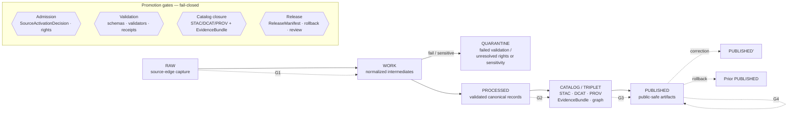

# Hydrology — Release Index

> Human-readable index and navigation map for governed Hydrology releases — release candidates, ReleaseManifests, PromotionDecisions, rollback cards, correction notices, and published artifacts. This page **explains and links**; it does not decide. Release authority lives in `release/` and `data/` per Directory Rules.

<!--
Badges are placeholders. Replace targets with the actual repository, workflow, and policy
endpoints once the repo is mounted and authoritative URLs are known.
-->


| Field | Value |
|---|---|
| **Status** | PROPOSED — doctrine CONFIRMED, implementation NEEDS VERIFICATION (no mounted repo this session) |
| **Doc type** | README-like — orientation, navigation, registry-style index |
| **Authority level** | `docs/` — explanatory and navigational. **Not** release authority. Release authority lives under `release/` and `data/`. |
| **Owners** | Hydrology steward(s) + Docs steward · *TODO: confirm against `CODEOWNERS`* |
| **Reviewers required** | Hydrology steward + Release reviewer (separate from author when materiality applies) |
| **Last reviewed** | 2026-05-18 — *TODO: wire to docs lastmod automation* |
| **Supersedes** | None — net-new index file |
| **Related doctrine** | `docs/doctrine/directory-rules.md`, `docs/doctrine/lifecycle-law.md`, `docs/doctrine/trust-membrane.md`, `docs/doctrine/truth-posture.md` |

---

## Mini-TOC

1. [Scope](#1-scope)
2. [Repo fit](#2-repo-fit)
3. [What this index records](#3-what-this-index-records)
4. [What does NOT belong here](#4-what-does-not-belong-here)
5. [Hydrology release lanes (PROPOSED tree)](#5-hydrology-release-lanes-proposed-tree)
6. [Release flow diagram](#6-release-flow-diagram)
7. [Release-state legend](#7-release-state-legend)
8. [Release register (template)](#8-release-register-template)
9. [Closure rules — what every Hydrology release must resolve](#9-closure-rules--what-every-hydrology-release-must-resolve)
10. [Sensitivity, rights, and publication posture](#10-sensitivity-rights-and-publication-posture)
11. [Quickstart — how to use this index](#11-quickstart--how-to-use-this-index)
12. [Verification backlog and open questions](#12-verification-backlog-and-open-questions)
13. [FAQ](#13-faq)
14. [Related docs](#14-related-docs)
15. [Appendix A — Source families and source-role doctrine](#appendix-a--source-families-and-source-role-doctrine)
16. [Appendix B — Hydrology-specific deny-by-default register](#appendix-b--hydrology-specific-deny-by-default-register)

---

## 1. Scope

This index is the **navigational entry point** for everything a reviewer, steward, or downstream consumer needs in order to locate, understand, or audit a Hydrology release.

**CONFIRMED doctrine:** Hydrology governs watersheds, HUC units, hydro features and reach identity, gauge sites, flow and water-level observations, water-quality observations, groundwater wells, NFHL regulatory flood context, observed flood events, hydrographs, and upstream/downstream traces — bound by source role, evidence, time, and release state, and explicitly *not* a flood-warning or life-safety system. [DOM-HYD] [ENCY]

**CONFIRMED doctrine:** Public-facing Hydrology artifacts reach the `PUBLISHED` state only when a `ReleaseManifest`, supporting `EvidenceBundle`, validation/policy support, review state (where required), correction path, stale-state rule, and rollback target all exist and resolve to one another. [ENCY Appendix E] [DOM-HYD]

> [!IMPORTANT]
> This file is **PROPOSED** in placement and is doctrinally consistent with `docs/domains/<domain>/` per Directory Rules §4 Step 3. Until the repo is mounted, every path quoted here is PROPOSED. Verify against mounted-repo evidence before treating any path or filename as canonical.

[Back to top](#hydrology--release-index)

---

## 2. Repo fit

**Upstream of this index** (sources of the records this index points at — PROPOSED locations):

- `release/candidates/hydrology/` — release candidate dossiers for Hydrology
- `release/manifests/` — `ReleaseManifest` records (organized by `release_id`)
- `release/promotion_decisions/` — `PromotionDecision` records
- `release/rollback_cards/` — Hydrology rollback artifacts
- `release/correction_notices/` — public correction notices touching Hydrology
- `release/withdrawal_notices/` — Hydrology withdrawals
- `release/signatures/` — DSSE / Sigstore artifacts for Hydrology releases
- `data/proofs/evidence_bundle/` and `data/proofs/proof_pack/` — Hydrology proof closure objects
- `data/catalog/stac/`, `data/catalog/dcat/`, `data/catalog/prov/`, `data/catalog/domain/hydrology/` — catalog records
- `data/published/layers/hydrology/`, `data/published/pmtiles/`, `data/published/geoparquet/` — published artifacts
- `data/receipts/release/` — release receipts
- `data/registry/sources/hydrology/` — Hydrology source descriptors

**Downstream of this index** (consumers that use it for navigation — PROPOSED):

- `apps/governed-api/` resolvers serving the Hydrology API surface (`HydrologyDecisionEnvelope`, `LayerManifest`, `EvidenceDrawerPayload`)
- `apps/explorer-web/` map and Evidence Drawer flows (read through the governed API; **never** directly from canonical stores)
- Steward review tools and the verification backlog
- Cross-domain documents that need to cite a specific Hydrology release

> [!NOTE]
> `docs/` **does not decide**. This page indexes and explains; the authoritative records live in `release/` and `data/`. If a discrepancy arises between this index and the authoritative records, the records win and this page is updated. [DIRRULES §13.5]

[Back to top](#hydrology--release-index)

---

## 3. What this index records

The index is intentionally narrow. It registers and links — it does not duplicate authoritative content.

| Record class | What we record here | Authoritative home (PROPOSED) |
|---|---|---|
| Release candidate | `release_id`, candidate dossier link, source descriptors covered, status | `release/candidates/hydrology/<release_id>/` |
| `ReleaseManifest` | `release_id`, manifest link, artifact digests summary, supersedes / superseded_by | `release/manifests/<release_id>.json` |
| `PromotionDecision` | Decision outcome (ANSWER / ABSTAIN / DENY / ERROR), reviewer, gate evidence ref | `release/promotion_decisions/<release_id>.json` |
| `EvidenceBundle` closure | Bundle id, validation report ref, policy decision ref | `data/proofs/evidence_bundle/<bundle_id>.json` |
| Published artifacts | Layer ids, PMTiles versioned filenames, COG/GeoParquet refs, sidecar digests | `data/published/layers/hydrology/`, `…/pmtiles/`, `…/geoparquet/` |
| Catalog closure | STAC / DCAT / PROV item refs, citation report | `data/catalog/stac/`, `…/dcat/`, `…/prov/`, `…/domain/hydrology/` |
| Rollback target | Prior `release_id`, rollback card link, verification status | `release/rollback_cards/<release_id>.json` |
| Correction notice | Notice id, scope of correction, supersession notes | `release/correction_notices/<notice_id>.json` |
| Withdrawal | Notice id, reason, public-facing impact | `release/withdrawal_notices/<notice_id>.json` |
| Signatures | DSSE / cosign artifact refs, Rekor index, key/cert identity | `release/signatures/<release_id>/` |

> [!TIP]
> The index entry for a release is the **shortest** thing that lets a reviewer reach every record above by following one or two links. If the index entry is growing into a narrative, that content belongs in a candidate dossier or an ADR, not here.

[Back to top](#hydrology--release-index)

---

## 4. What does NOT belong here

- Raw, work, quarantine, or unreleased candidate payloads. Those are governed by lifecycle phase rules. [DIRRULES §9.1]
- Schema definitions, contract definitions, or policy bundles. Those live under `schemas/`, `contracts/`, `policy/`.
- Test fixtures, validation reports, or pipeline run logs as primary content. Linked refs only.
- Live emergency-flood instructions, alerts, or warnings of any kind. KFM is **not** a life-safety authority and **must not** be used as one. [DOM-HYD] [ENCY §20.5]
- NFHL polygons presented as observed flood inundation. NFHL is regulatory context, not observation. [DOM-HYD]
- Exact, restricted, or steward-only geometry beyond what the release-state register allows for public exposure.
- AI-generated summaries treated as evidence. AI is interpretive, never the root truth source. [GAI]

[Back to top](#hydrology--release-index)

---

## 5. Hydrology release lanes (PROPOSED tree)

> [!WARNING]
> The tree below is **PROPOSED** and consistent with Directory Rules §12 (Domain Placement Law) and §9.2 (`release/` layout). Verify against mounted-repo evidence before treating it as canonical. Domain lanes live inside responsibility roots; the domain segment is `hydrology`. [DIRRULES §4 Step 3, §12]

```text
release/
├── candidates/
│   └── hydrology/                       # PROPOSED — release candidate dossiers
│       └── <release_id>/                # PROPOSED — one folder per candidate
├── manifests/                           # PROPOSED — all ReleaseManifests, keyed by release_id
├── promotion_decisions/                 # PROPOSED — PromotionDecision records
├── rollback_cards/                      # PROPOSED — rollback artifacts
├── correction_notices/                  # PROPOSED — public correction notices
├── withdrawal_notices/                  # PROPOSED — withdrawal records
├── signatures/                          # PROPOSED — DSSE / Sigstore artifacts
└── changelog/                           # PROPOSED — release-level changelog

data/
├── catalog/
│   ├── stac/                            # PROPOSED — STAC records (Hydrology items live here)
│   ├── dcat/                            # PROPOSED — DCAT records
│   ├── prov/                            # PROPOSED — PROV records
│   └── domain/
│       └── hydrology/                   # PROPOSED — Hydrology domain catalog
├── proofs/
│   ├── evidence_bundle/                 # PROPOSED — EvidenceBundle objects
│   ├── proof_pack/                      # PROPOSED — ProofPack objects
│   ├── validation_report/               # PROPOSED — validation reports
│   └── citation_validation/             # PROPOSED — citation validation reports
├── published/
│   ├── api_payloads/                    # PROPOSED — public-safe API payload snapshots
│   ├── layers/
│   │   └── hydrology/                   # PROPOSED — Hydrology published layers
│   ├── pmtiles/                         # PROPOSED — versioned PMTiles artifacts
│   └── geoparquet/                      # PROPOSED — GeoParquet artifacts
├── receipts/
│   └── release/                         # PROPOSED — release receipts
├── registry/
│   └── sources/
│       └── hydrology/                   # PROPOSED — Hydrology source descriptors
└── rollback/
    └── hydrology/
        └── <release_id>/                # PROPOSED — alias revert receipts, prior-state references

docs/
└── domains/
    └── hydrology/
        ├── README.md                    # PROPOSED — Hydrology domain landing
        ├── RELEASE_INDEX.md             # this file
        └── …                            # PROPOSED — domain-scoped docs
```

[Back to top](#hydrology--release-index)

---

## 6. Release flow diagram

The diagram below is a **doctrine-grounded** representation of the Hydrology release lifecycle. Lifecycle phases and gates follow KFM doctrine; exact tool wiring is PROPOSED. [ENCY §24] [DIRRULES §9.1]



> [!NOTE]
> Each gate is a **governed state transition**, not a file move. Closure means (i) required artifacts exist, (ii) every artifact resolves the artifacts it depends on (`EvidenceRef` → `EvidenceBundle`, `source_id` → `SourceDescriptor`, `model_id` → `ModelRunReceipt`), and (iii) the policy gate evaluated and recorded its decision. Missing any of these means the transition fails closed and the prior state is preserved. [ENCY §24.6.2]

[Back to top](#hydrology--release-index)

---

## 7. Release-state legend

| State | Meaning | Public surface? |
|---|---|---|
| `candidate` | Release dossier exists; gates pending or failing | No |
| `review` | Awaiting steward / release-reviewer sign-off | No |
| `approved` | All gates pass; promotion authorized | No (about to publish) |
| `published` | `ReleaseManifest` resolves; artifacts public-safe | Yes |
| `superseded` | Replaced by a newer release; correction notice issued | Read-only (historical) |
| `withdrawn` | Withdrawn from public surfaces; rollback target activated | No |
| `rolled_back` | Rollback card invoked; prior release reinstated | Yes (prior release) |
| `held` | Gate failed; held at prior state pending remediation | No change at public edge |

[Back to top](#hydrology--release-index)

---

## 8. Release register (template)

The table below is the **template** for the per-release rows this index will accumulate. Until the repo is mounted, the rows are illustrative placeholders. [STATUS: PROPOSED schema; UNKNOWN actual rows]

<!--
EDITORS: when adding a real release row, fill every column. If a field is unknown,
mark it UNKNOWN explicitly rather than leaving it blank or guessed.
-->

| Release ID | Scope | State | ReleaseManifest | EvidenceBundle | PromotionDecision | Rollback target | Correction(s) | Signatures | Notes |
|---|---|---|---|---|---|---|---|---|---|
| `hyd-YYYYMMDD-001` *(example — illustrative)* | Kansas HUC12 + 1 USGS gauge fixture + NHDPlus crosswalk + NFHL contextual overlay | `candidate` | *PROPOSED:* `release/manifests/hyd-YYYYMMDD-001.json` | *PROPOSED:* `data/proofs/evidence_bundle/…` | *PROPOSED:* `release/promotion_decisions/hyd-YYYYMMDD-001.json` | *UNKNOWN until prior release exists* | none | *PROPOSED:* DSSE / cosign + Rekor index | First credible Hydrology thin slice per [DOM-HYD]. NFHL renders as *regulatory context*; **never** as observed flood. |
| *…add rows here as releases land…* | | | | | | | | | |

> [!IMPORTANT]
> The single illustrative row above is **labeled as such**. It is not a record of any actual release. Do not cite this row as evidence that a release exists.

[Back to top](#hydrology--release-index)

---

## 9. Closure rules — what every Hydrology release must resolve

Every Hydrology release that reaches `PUBLISHED` must satisfy the following, in addition to KFM-wide gate doctrine. [DOM-HYD] [ENCY §24] [DIRRULES §9.1]

<details>
<summary><b>Closure rules — full list</b></summary>

1. **`SourceDescriptor` + `SourceActivationDecision`** for every source the release touches (USGS Water APIs, WBD/HUC, NHDPlus HR, FEMA NFHL/MSC, 3DEP, state water offices, water-quality programs, groundwater wells, irrigation/drought sources). [DOM-HYD §B]
2. **Source-role separation** is preserved. NFHL regulatory polygons MUST NOT be promoted as observed inundation. Operational warnings MUST NOT be treated as life-safety authority inside KFM. [DOM-HYD] [ENCY §20.5]
3. **Identity rules** for HUCUnit, HydroFeature, ReachIdentity, GaugeSite, FlowObservation, WaterLevelObservation, WaterQualityObservation, GroundwaterWell, NFHLZone — PROPOSED basis: source id + object role + temporal scope + normalized digest. [DOM-HYD §E]
4. **Temporal separation**: `observed_time`, `valid_time`, `source_time`, `retrieval_time`, `release_time`, and `correction_time` stay distinct where material. Provisional vs. final USGS status is preserved. [DOM-HYD §D]
5. **NHDPlus HR / WBD crosswalk** ambiguity is recorded with `alignment_score` and `decision_reason`. The release `ABSTAIN`s on ambiguous reach identity rather than collapsing it. [DOM-HYD §K] [external pattern reflected in project knowledge under PROPOSED]
6. **Validation report** binds to the release. PROPOSED validators include HUC12 fingerprint validation, NHDPlus HR identity ambiguity tests, USGS parameter/unit/qualifier/no-data tests, NFHL role-separation tests, and EvidenceBundle closure tests. [DOM-HYD §K]
7. **`EvidenceBundle` closure** — every `EvidenceRef` resolves to an `EvidenceBundle`; `source_id` resolves to `SourceDescriptor`; `model_id` resolves to `ModelRunReceipt`. [ENCY §24.6.2]
8. **Catalog closure** — STAC, DCAT, and PROV records exist, mutually reference each other, and reference the `EvidenceBundle` and `ReleaseManifest`. [ENCY] [BLD-GREEN §11, §19, §24]
9. **`ReleaseManifest`** exists, lists artifacts with digests, declares supersession or first-release status. [DIRRULES §9.2]
10. **`PromotionDecision`** is recorded; reviewer authority is separate from the original author when materiality applies. [ENCY §24.6.1]
11. **Rollback target** is identified and a `RollbackCard` exists before the release is treated as safely publishable. [ENCY §24.6.1]
12. **Correction path** is published: stale-state rule, supersession lineage, and downstream-derivative invalidation list are pre-staged. [ENCY §24.6.1]
13. **Signatures** — DSSE / cosign attestation, Rekor inclusion (where applicable), with `spec_hash` of the canonical sidecar matching the attested predicate. [PROPOSED operational pattern]
14. **Trust-membrane invariant** — no public client, no normal UI surface, and no released AI surface reaches `RAW`, `WORK`, `QUARANTINE`, canonical/internal stores, graph internals, vector indexes, source APIs, or direct model runtimes. The governed API is the only route to `ANSWER`. [GAI] [ENCY §24.6.2]

</details>

> [!CAUTION]
> Visual correctness is **not** release readiness. A Hydrology layer that renders is still unready if any of the closure links above is broken — missing evidence ref, unresolved provenance, unresolved policy, missing proof, or `ReleaseManifest` pointing to a phantom record. [KFM-IDX-REL-001]

[Back to top](#hydrology--release-index)

---

## 10. Sensitivity, rights, and publication posture

**CONFIRMED doctrine.** Unclear rights, unresolved source role, missing evidence, unresolved sensitivity, or absent release state **blocks** public promotion. [ENCY] [DIRRULES]

Hydrology-specific posture (CONFIRMED doctrine, PROPOSED enforcement):

- **Unclear rights** for a Hydrology source → deny public promotion until resolved.
- **Flood-role misuse** (NFHL-as-observed-flood, forecast-as-truth, KFM-as-alert-authority) → **deny by default**. [DOM-HYD] [ENCY §20.5]
- **Infrastructure / private-property implications** (e.g., gauge locations on private land, well owners) → require review and public-safe generalization before exposure.
- **Emergency-alert boundary** — Hydrology shares this with Hazards and Air: KFM **must not** be used as a life-safety instruction surface. [ENCY §20.5]

See [Appendix B](#appendix-b--hydrology-specific-deny-by-default-register) for the deny-by-default register.

[Back to top](#hydrology--release-index)

---

## 11. Quickstart — how to use this index

```text
1. Find the release.
   • Look up the release_id in the register table (§8).
   • The row links to the ReleaseManifest, EvidenceBundle, PromotionDecision,
     rollback target, signatures, and any corrections.

2. Trace evidence.
   • From ReleaseManifest → EvidenceBundle → SourceDescriptor(s).
   • Every cited claim resolves to evidence, not the other way around.

3. Verify integrity.
   • Match artifact digests in ReleaseManifest against published artifacts.
   • If signatures are present, verify DSSE / cosign and Rekor inclusion.
   • Confirm the sidecar spec_hash matches the attested predicate.

4. Check supersession & rollback.
   • If state is 'superseded' or 'rolled_back', follow the lineage links
     before quoting the release as current.

5. Respect the trust membrane.
   • Consume Hydrology data through the governed API, not via raw or
     canonical stores.
```

[Back to top](#hydrology--release-index)

---

## 12. Verification backlog and open questions

The items below carry forward from the Hydrology domain dossier and from generic release-doctrine verification. Each item is **NEEDS VERIFICATION** until checked against mounted-repo evidence. [DOM-HYD §N]

| Item | Evidence that would settle it | Status |
|---|---|---|
| Verify the actual schema home for `HydrologyDecisionEnvelope` and Hydrology object schemas | mounted-repo files, schemas, ADR-0001 reference | NEEDS VERIFICATION |
| Verify HUC12 fixture and fingerprint rule | repo fixtures, validators, tests | NEEDS VERIFICATION |
| Verify NHDPlus HR crosswalk and ambiguity `ABSTAIN` behavior | validator output, no-network fixture, decision-envelope tests | NEEDS VERIFICATION |
| Verify USGS Water normalizer + NFHL source-role separation | repo code, schemas, fixtures, test suite | NEEDS VERIFICATION |
| Verify Hydrology API resolver routes (`/hydrology/...`) | mounted `apps/governed-api/` source | NEEDS VERIFICATION |
| Verify MapLibre Hydrology layer adapter and `LayerManifest` shape | mounted `packages/maplibre/` + `LayerManifest` schema | NEEDS VERIFICATION |
| Confirm `release/candidates/hydrology/` exists and is the canonical home | mounted-repo directory listing | NEEDS VERIFICATION |
| Confirm `data/published/layers/hydrology/` is the canonical published-layer home | mounted-repo directory listing, release manifest fixtures | NEEDS VERIFICATION |
| Confirm signature workflow (cosign + Rekor) for Hydrology PMTiles | mounted CI workflow, signature artifacts | NEEDS VERIFICATION |
| Resolve `PROV.md` vs. `PROVENANCE.md` naming impact on Hydrology PROV records | ADR resolution + docs reference scan | NEEDS VERIFICATION |
| Determine which actor approves Hydrology promotion (steward role + authority recording) | governance ADR, CODEOWNERS, release register | UNKNOWN |

[Back to top](#hydrology--release-index)

---

## 13. FAQ

**Q. Is this file the place to publish a release?**
No. This file *indexes* releases. The authoritative `ReleaseManifest`, `PromotionDecision`, signatures, and rollback cards live under `release/`. Published artifacts live under `data/published/`. [DIRRULES §9.2]

**Q. Why is NFHL not an observed flood layer?**
NFHL is a regulatory flood-hazard mapping product, not a record of observed inundation. Collapsing them would misrepresent both regulatory exposure and real flood evidence and is denied by KFM doctrine. [DOM-HYD §B, §I] [ENCY §20.5]

**Q. What if a release fails one closure rule but seems fine to publish?**
It is not fine. The closure rules are *invariants*, not recommendations. A release that fails any closure rule fails closed and is held at the prior state. [ENCY §24.6.2]

**Q. Can AI write the release summary on this page?**
Generated language may help draft text, but the index **must** resolve to evidence — `ReleaseManifest`, `EvidenceBundle`, `PromotionDecision`, signatures. AI is interpretive, never the root truth source. [GAI]

**Q. What about historical Hydrology releases predating this index?**
Add a row per historical release, mark `state` accurately (`superseded`, `withdrawn`, `rolled_back`, or `published`), and link the existing manifests and proofs. If no `ReleaseManifest` exists for a historical artifact, mark it `UNKNOWN` and open a verification-backlog entry rather than fabricating a manifest.

**Q. How does this index handle cross-domain releases (e.g., Hydrology × Hazards)?**
Cross-domain releases are indexed by the domain whose `release_id` owns the artifact. A cross-link row in the other domain's `RELEASE_INDEX.md` references the canonical row here. Shared validators live under `tools/validators/<topic>/` per Directory Rules §12. [DIRRULES §12]

[Back to top](#hydrology--release-index)

---

## 14. Related docs

> Links below are **PROPOSED** until verified against the mounted repo. Replace each `TODO` with the canonical path when known.

- `docs/domains/hydrology/README.md` — Hydrology domain landing — *TODO: confirm path / create if absent*
- `docs/doctrine/directory-rules.md` — placement law for the lanes referenced here
- `docs/doctrine/lifecycle-law.md` — RAW → PUBLISHED governance — *TODO: confirm*
- `docs/doctrine/trust-membrane.md` — public-path discipline — *TODO: confirm*
- `docs/doctrine/truth-posture.md` — cite-or-abstain, truth labels — *TODO: confirm*
- `docs/architecture/governed-ai/README.md` — governed AI behavior for Hydrology — *TODO: confirm*
- `docs/standards/PROV.md` — provenance standard profile *(note: open ADR question on `PROV.md` vs `PROVENANCE.md`)*
- `docs/standards/ISO-19115.md` — geospatial metadata crosswalk
- `docs/standards/OGC-API-TILES.md`, `docs/standards/PMTILES.md` — tile / PMTiles standard profiles
- `docs/standards/OAI-PMH.md` — metadata harvest standard
- `docs/runbooks/hydrology/SOURCE_REFRESH_RUNBOOK.md` — *PROPOSED, mirrors the Fauna source-refresh runbook pattern*
- `release/candidates/hydrology/README.md` — canonical home for Hydrology candidates — *TODO: create per DIRRULES §15*

---

## Appendix A — Source families and source-role doctrine

**CONFIRMED source families** for Hydrology. [DOM-HYD §B] [ENCY Appendix D]

| Source family | Source role | Notes |
|---|---|---|
| USGS Water Data APIs (`api.waterdata.usgs.gov`) | Observation (primary) | Preserve site metadata, parameter code, unit, qualifier, provisional/final status |
| Legacy USGS `waterservices.usgs.gov` (NWIS) | Observation (transitional) | Project knowledge notes phase-out in 2026/2027; pin clients and plan migration |
| USGS WBD (Watershed Boundary Dataset) / HUC | Reference geometry | HUC12 is the working unit; carry alignment_score for crosswalks |
| USGS NHDPlus HR / 3DHP | Reference network + value-added attributes | ABSTAIN on ambiguous reach identity |
| FEMA NFHL / MSC | Regulatory context | **NOT observed flood**, **NOT life-safety**, **NOT alert authority** |
| 3DEP | Terrain raster context | Used for hydroenforced derivatives, not as observation |
| State water offices | Authoritative state records | Source-role determined per dataset |
| Water-quality programs | Observation (variable role) | Preserve method, detection limits, qualifiers |
| Groundwater wells | Observation + reference | Sensitivity review for ownership and precise location |
| Irrigation / drought sources | Mixed (varies) | Aggregations preferred over precise sub-parcel claims |

> [!NOTE]
> Source role MUST be declared in the `SourceDescriptor` and MUST NOT be inferred from convenience. A regulatory layer is not an observation; an operational warning is not life-safety authority inside KFM. [DOM-HYD] [BLD-COMP §8]

[Back to top](#hydrology--release-index)

---

## Appendix B — Hydrology-specific deny-by-default register

Selected entries from the global deny-by-default register that touch Hydrology releases. [ENCY §20.5]

| Failure mode | Default outcome | Required for non-default outcome |
|---|---|---|
| Unclear rights on a Hydrology source | `DENY` | Steward review + rights resolution + `SourceActivationDecision` |
| NFHL surfaced as observed flood | `DENY` | Not allowed — re-frame as regulatory context |
| KFM presented as emergency-alert authority | `DENY` | Not allowed under any framing |
| Missing `EvidenceBundle` closure for a release | `DENY` | Complete closure (see §9) |
| Catalog/release digest mismatch | `HOLD` / `DENY` / `ERROR` | Manifest fix + verifier re-run |
| Missing rollback target | `RELEASE_MANIFEST_INVALID` / `ROLLBACK_TARGET_MISSING` → fail closed | Supply rollback target + verify |
| Reach identity ambiguous after NHDPlus HR crosswalk | `ABSTAIN` | Record `alignment_score` + `decision_reason`; await steward decision |
| Uncited AI claim on a Hydrology Focus Mode answer | `ABSTAIN` / `DENY` | Resolve `EvidenceRef` → released `EvidenceBundle` |

[Back to top](#hydrology--release-index)

---

<sub>**Citation key.** [DOM-HYD] Hydrology domain dossier (KFM Domains Culmination Atlas) · [ENCY] KFM Encyclopedia · [DIRRULES] Directory Rules · [BLD-GREEN] Greenfield Building Plan · [BLD-COMP] Components Pass 10 · [IMPL-PIPE] Pipeline Implementation Manual · [GAI] Governed AI doctrine · [KFM-IDX-REL-001] Idea index — catalog closure.</sub>

---

> [!NOTE]
> **Doctrine vs. implementation.** Every claim about doctrine in this file is CONFIRMED against the attached KFM corpus. Every claim about repository paths, filenames, validator names, route names, or active enforcement is PROPOSED / NEEDS VERIFICATION until the repo is mounted and inspected.

**Last updated:** 2026-05-18 · **Maintainers:** Hydrology steward(s) + Docs steward *(TBD)* · [Back to top](#hydrology--release-index)
