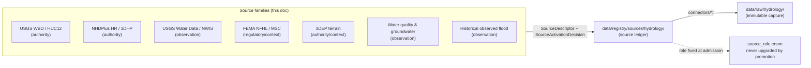

<!-- [KFM_META_BLOCK_V2]
doc_id: kfm://doc/domain-hydrology-source-families
title: Hydrology — Source Families
type: domain_readme
version: v1
status: draft
owners: <hydrology-source-steward> + <domain-steward>   # TODO confirm against CODEOWNERS
created: 2026-06-07
updated: 2026-06-07
policy_label: public
related:
  - ai-build-operating-contract.md
  - directory-rules.md
  - docs/domains/hydrology/README.md
  - docs/domains/hydrology/PUBLICATION_POSTURE.md
  - docs/domains/hydrology/RELEASE_INDEX.md
  - data/registry/sources/hydrology/
  - schemas/contracts/v1/source/source-descriptor.json   # PROPOSED home; ADR-0001 / DIRRULES §7.4
tags: [kfm, domain, hydrology, sources, source-role, usgs, wbd, nhdplus, nfhl, 3dep]
notes:
  - 'CONTRACT_VERSION = "3.0.0"'
  - "Source role is a first-class identity attribute, fixed at admission and never upgraded by promotion."
  - "NFHL is regulatory context; never observed flooding or life-safety authority."
  - "Per-source rights and current terms are NEEDS VERIFICATION; sensitive joins fail closed."
[/KFM_META_BLOCK_V2] -->

# 💧 Hydrology — Source Families

> The catalog of source families the Hydrology lane admits, the role each is allowed to carry, the rights and freshness posture for each, and the anti-collapse rules that keep an observation from being relabeled a regulation, model, or aggregate.

<!-- Badge targets are placeholders. Replace once the repo is mounted and authoritative URLs are known. -->


| Field | Value |
|---|---|
| **Status** | CONFIRMED doctrine / PROPOSED implementation |
| **Authority** | `docs/` — explanatory. The authoritative source ledger is `data/registry/sources/hydrology/`. |
| **Owners** | `<hydrology-source-steward>` + `<domain-steward>` — *placeholder; confirm in `CODEOWNERS`* |
| **Contract** | `CONTRACT_VERSION = "3.0.0"` (`ai-build-operating-contract.md` v3.0) |
| **Schema home** | `schemas/contracts/v1/source/source-descriptor.json` *(PROPOSED; ADR-0001 / DIRRULES §7.4)* |
| **Last reviewed** | 2026-06-07 |

> [!NOTE]
> This page **describes and links**; it does not admit sources. Admission is a governed transition
> recorded in `data/registry/sources/hydrology/` via a `SourceDescriptor` and a
> `SourceActivationDecision`. If this page and the registry disagree, the registry wins.

---

## Mini-TOC

1. [Scope](#1-scope)
2. [Repo fit](#2-repo-fit)
3. [Source-role vocabulary](#3-source-role-vocabulary)
4. [Hydrology source families](#4-hydrology-source-families)
5. [Anti-collapse rules for this lane](#5-anti-collapse-rules-for-this-lane)
6. [SourceDescriptor field surface](#6-sourcedescriptor-field-surface)
7. [Rights, sensitivity, and freshness posture](#7-rights-sensitivity-and-freshness-posture)
8. [What does NOT belong here](#8-what-does-not-belong-here)
9. [Verification backlog and open questions](#9-verification-backlog-and-open-questions)
10. [Related docs](#10-related-docs)
- [Appendix A — Per-family admission notes](#appendix-a--per-family-admission-notes)

---

## 1. Scope

This document catalogs the **source families** the Hydrology lane admits and the governance posture attached to each. A *source family* is a class of upstream provider (e.g., "USGS Water Data / NWIS"), distinct from an individual `SourceDescriptor` instance in the registry.

**CONFIRMED doctrine:** Hydrology source families are recorded in the Atlas §4.D key-source-families table, each able to carry **"authority / observation / context / model as source role requires"** — i.e. the role is assigned per claim at admission, not fixed per provider. Per-family rights and current terms are **NEEDS VERIFICATION**, and **sensitive joins fail closed**. [DOM-HYD §D] [ENCY]

**CONFIRMED doctrine:** Source role is a **first-class identity attribute**. An observed reading is not interchangeable with a modeled estimate; a regulatory determination is not an administrative compilation; an aggregate is not a per-place record; synthetic content is never observed reality. The lifecycle and governed API **fail closed** when these roles are conflated. [ENCY §24.1]

> [!IMPORTANT]
> Every path, filename, and schema reference here is **PROPOSED / NEEDS VERIFICATION** until the
> repo is mounted, except where explicitly marked CONFIRMED against Directory Rules or the Atlas.

[Back to top](#-hydrology--source-families)

---

## 2. Repo fit

```text
docs/domains/hydrology/SOURCE_FAMILIES.md     ← this file (CONFIRMED docs home, DIRRULES §12)
data/registry/sources/hydrology/              ← authoritative source ledger (SourceDescriptors)   [PROPOSED leaf]
schemas/contracts/v1/source/source-descriptor.json  ← SourceDescriptor schema home               [PROPOSED, ADR-0001]
connectors/<source>/                          ← per-source fetchers (usgs-water/, wbd/, nhdplus-hr/, nfhl/, 3dep/) [PROPOSED]
data/raw/hydrology/<source_id>/<run_id>/      ← immutable source capture                          [CONFIRMED pattern, DIRRULES §7.3]
```



> [!NOTE]
> Source families feed the **source ledger**; the ledger — not this page — is what the lifecycle
> reads. This page exists so a steward can see the whole family set and its posture at a glance.

[Back to top](#-hydrology--source-families)

---

## 3. Source-role vocabulary

**CONFIRMED doctrine** _([ENCY §24.1.1])._ KFM uses **seven canonical source-role classes**. The role is set on the `SourceDescriptor` at admission and is **preserved through every promotion** — promotion does not upgrade an observation to a regulation, a model to an aggregate, or a candidate to a verified record.

| Role | Definition | Hydrology example | Allowed downstream |
|---|---|---|---|
| **Observed** | A direct reading/measurement tied to a place and time | Stream-gauge stage reading | May feed modeled/aggregate products; never relabeled regulatory/administrative |
| **Regulatory** | An authoritative determination with legal/administrative force | NFHL flood-zone designation | Cite as regulatory context; never an observed event or modeled estimate |
| **Modeled** | A derived product from inputs/assumptions; uncertainty preserved | Hydrograph reconstruction | Cite with model identity + run receipt + bounds; never an observation |
| **Aggregate** | A summary/total/average over a unit; record fidelity lost | HUC-level rollup | Cite with aggregation receipt; never a per-place record |
| **Administrative** | A compiled agency record (registration/accounting) | Water-right roster / permit index | Cite as administrative context; never an observation or regulation |
| **Candidate** | A proposed record awaiting validation/review | Quarantined connector output | Cite as candidate only in WORK/QUARANTINE; never PUBLISHED without promotion |
| **Synthetic** | Simulation/reconstruction/AI output with no first-hand basis | AI-drafted EvidenceBundle summary | Carries Reality Boundary Note + Representation Receipt; never queried as observed reality |

> [!CAUTION]
> The Atlas §4.D hydrology table summarizes the per-family role span as
> **"authority / observation / context / model as source role requires."** Read "authority" and
> "context" as admission framings that resolve, per claim, into the seven canonical roles above.
> "Authority" typically realizes as `observed`/`regulatory` depending on the claim; "context" as
> `regulatory`/`administrative`. The canonical enum is the seven classes in this table. *(INFERRED
> reconciliation between the §4.D shorthand and the §24.1.1 canonical classes; PROPOSED until an
> ADR fixes the mapping — see [§9](#9-verification-backlog-and-open-questions).)*

[Back to top](#-hydrology--source-families)

---

## 4. Hydrology source families

**CONFIRMED source families** _([DOM-HYD §D], [ENCY])._ The "typical role(s)" column is an **INFERRED** reading of which canonical role each family most often carries; it does not narrow the Atlas's per-claim rule. Rights and current terms are **NEEDS VERIFICATION** per family; **sensitive joins fail closed**; freshness is **source-vintage or cadence specific**.

| Source family | Typical role(s) | Rights / sensitivity | Freshness | Status |
|---|---|---|---|---|
| **USGS WBD / HUC12** | authority → `observed` boundary geometry | NEEDS VERIFICATION; sensitive joins fail closed | vintage-specific (snapshot) | CONFIRMED family / PROPOSED impl |
| **NHDPlus HR / 3DHP-oriented hydrography** | authority → network + value-added attrs | NEEDS VERIFICATION; sensitive joins fail closed | vintage-specific (snapshot) | CONFIRMED family / PROPOSED impl |
| **USGS Water Data / NWIS** | `observed` (flow, level, WQ) | NEEDS VERIFICATION; sensitive joins fail closed | near-real-time + cadence | CONFIRMED family / PROPOSED impl |
| **FEMA NFHL / MSC** | `regulatory` / context | NEEDS VERIFICATION; sensitive joins fail closed | localized, event-driven | CONFIRMED family / PROPOSED impl |
| **3DEP terrain** | authority/context → `modeled` derivatives | NEEDS VERIFICATION; sensitive joins fail closed | vintage-specific (snapshot) | CONFIRMED family / PROPOSED impl |
| **Water quality & groundwater sources** | `observed` (+ `administrative` for well registries) | NEEDS VERIFICATION; well/owner detail sensitive | varies | CONFIRMED family / PROPOSED impl |
| **Historical observed flood evidence** | `observed` (historical) | NEEDS VERIFICATION; review where uncertain | one-shot / historical | CONFIRMED family / PROPOSED impl |

> [!NOTE]
> The seven families above are **exactly** the Atlas §4.D key-source-families set for Hydrology —
> nothing added, nothing dropped. Concrete provider instances within a family (e.g., Kansas
> DWR WIMAS/WRIS, KGS WWC5, WIZARD) are admission-time details for the registry and Appendix A,
> not new families. [DOM-HYD §D]

[Back to top](#-hydrology--source-families)

---

## 5. Anti-collapse rules for this lane

**CONFIRMED DENY conditions** _([ENCY §24.1.2])._ Each is a fail-closed condition, not a quality issue.

| Collapse pattern | Denied outcome | Required guardrail |
|---|---|---|
| **Modeled product labeled/queried as observed** (e.g., reconstructed hydrograph as a reading) | DENY at publication; ABSTAIN at AI | Run receipt + uncertainty surface + role-preserving DTO field |
| **Regulatory zone labeled as observed flood/event** (NFHL as inundation) | DENY publication of regulatory layer as event evidence | Separate regulatory-layer and observed-event lanes; UI banner |
| **Aggregate cited as per-place truth** (HUC rollup as a site reading) | DENY join from aggregate cell to single record; ABSTAIN at AI | Aggregation receipt; geometry-scope guard |
| **Administrative compilation cited as observation** (water-right roster as event timeline) | DENY publication of compilation as observed event | Source-role tag preserved; named admin types |
| **Candidate record exposed on a public surface** | DENY at trust membrane; route to QUARANTINE | Promotion gate; no PUBLISHED edge to WORK/QUARANTINE |
| **Synthetic content presented as observed reality** | DENY publication; HOLD for steward review; ABSTAIN at AI | Reality Boundary Note; Representation Receipt; UI badge |

> [!CAUTION]
> **The two highest-frequency Hydrology collapses are the first two rows.** A reconstructed
> hydrograph is **modeled**, not observed; an NFHL polygon is **regulatory**, not an observed
> flood. Both are denied at publication and trigger ABSTAIN at the AI surface. Additionally,
> KFM is **never** an emergency-alert / life-safety authority on Hydrology surfaces
> _([ENCY §20.4 emergency-alert boundary])._

[Back to top](#-hydrology--source-families)

---

## 6. SourceDescriptor field surface

**PROPOSED descriptor surface** _([ENCY §24.1.3]; illustrative, not authoritative)._ The canonical schema home defaults to `schemas/contracts/v1/source/source-descriptor.json` per Directory Rules §7.4 and ADR-0001 unless an accepted ADR relocates it. Actual field presence and names are **NEEDS VERIFICATION**.

| Field | Type / vocabulary | Required? | Notes |
|---|---|---|---|
| `source_role` | enum: `observed \| regulatory \| modeled \| aggregate \| administrative \| candidate \| synthetic` | MUST | Set at admission. Never edited in-place; corrections produce a **new descriptor** + `CorrectionNotice`. |
| `role_authority` | string (issuing body / model identity / steward) | MUST when role ∈ {regulatory, modeled, aggregate} | Disambiguates the authoring authority for cite text. |
| `role_aggregation_unit` | geometry-scope token (county, HUC, tract, year, …) | MUST when `source_role = aggregate` | Prevents geometry-scope drift on join. |
| `role_model_run_ref` | EvidenceRef → `ModelRunReceipt` | MUST when `source_role = modeled` | Pins inputs, parameters, version that produced the value. |
| `role_synthetic_basis` | `{ method, inputs, reality_boundary_note_ref }` | MUST when `source_role = synthetic` | Records what is and is not real in the carrier. |
| `role_candidate_disposition` | enum: `pending \| merged \| rejected \| quarantined` | MUST when `source_role = candidate` | Tracks promotion state; PUBLISHED edge forbidden until `merged`. |

<details>
<summary><b>Hydrology-relevant required-field implications</b></summary>

- A **3DEP-derived** hydro-enforced surface admitted as `modeled` MUST carry `role_model_run_ref`.
- An **NFHL** family admitted as `regulatory` MUST carry `role_authority` (FEMA).
- A **HUC-level rollup** admitted as `aggregate` MUST carry `role_aggregation_unit` (e.g., `HUC12`).
- A **quarantined connector batch** admitted as `candidate` MUST carry `role_candidate_disposition` and MUST NOT reach a PUBLISHED edge until `merged`.
- An **AI-drafted summary** of a Hydrology EvidenceBundle is `synthetic` and MUST carry `role_synthetic_basis` with a Reality Boundary Note ref.

*(All INFERRED from §24.1.3 field rules applied to the §4.D families; PROPOSED until schema-verified.)*

</details>

[Back to top](#-hydrology--source-families)

---

## 7. Rights, sensitivity, and freshness posture

**CONFIRMED doctrine / PROPOSED enforcement.** Across all seven Hydrology families:

- **Rights and current terms are NEEDS VERIFICATION** per family — admission MUST resolve rights before any public promotion. [DOM-HYD §D]
- **Sensitive joins fail closed** — a join that would expose well ownership, private-parcel implication, or sensitive infrastructure is denied by default until a sensitivity reviewer clears it. [DOM-HYD §I]
- **Freshness is source-vintage or cadence specific** — boundary/network families (WBD, NHDPlus HR) are snapshot-vintage; observation families (NWIS) are cadence-driven; a stale source past its declared tolerance triggers a stale-state marker, not a silent serve. [ENCY §24.8]
- **NFHL is never observed flooding and never life-safety authority** — regulatory role only. [DOM-HYD] [ENCY §20.4]

> [!IMPORTANT]
> Unclear rights, unresolved source role, missing evidence, unresolved sensitivity, or absent
> release state **blocks public promotion**. Route any genuinely sensitive disposition through the
> operating contract's §23.2 sensitive-domain decision matrix. See
> [`PUBLICATION_POSTURE.md`](./PUBLICATION_POSTURE.md) for the full lane posture. [ENCY] [DIRRULES]

[Back to top](#-hydrology--source-families)

---

## 8. What does NOT belong here

- Individual `SourceDescriptor` instances — those live in `data/registry/sources/hydrology/`, not in this catalog.
- Connector code, fetch logic, or credentials — those live under `connectors/` and secret stores.
- Object-family or schema definitions — see `contracts/domains/hydrology/` and `schemas/contracts/v1/...`.
- Release decisions or manifests — see `release/` and [`RELEASE_INDEX.md`](./RELEASE_INDEX.md).
- Any assertion that a source is *admitted* or *active* in the repo — that is registry state, NEEDS VERIFICATION here.
- New "source families" invented beyond the Atlas §4.D set — provider instances are admission details, not families.

[Back to top](#-hydrology--source-families)

---

## 9. Verification backlog and open questions

| ID | Item | Evidence that would settle it | Status |
|---|---|---|---|
| OQ-HYD-SRC-01 | Reconcile the §4.D "authority/context" shorthand with the §24.1.1 seven canonical roles for Hydrology. | ADR (ADR-S-04 source-role vocabulary) | OPEN ADR |
| OQ-HYD-SRC-02 | Confirm `schemas/contracts/v1/source/source-descriptor.json` is the SourceDescriptor home. | mounted schemas tree + ADR-0001 | NEEDS VERIFICATION |
| OQ-HYD-SRC-03 | Confirm `data/registry/sources/hydrology/` exists and lists per-family descriptors. | mounted-repo directory listing | NEEDS VERIFICATION |
| OQ-HYD-SRC-04 | Resolve per-family rights/current-terms state (USGS, FEMA, state water offices). | rights review + SourceActivationDecision records | NEEDS VERIFICATION |
| OQ-HYD-SRC-05 | Confirm `role_*` field names and required-when rules in the mounted schema. | mounted SourceDescriptor schema | NEEDS VERIFICATION |
| OQ-HYD-SRC-06 | Determine which state-water-office providers (WIMAS/WRIS, WWC5, WIZARD) are in scope as instances. | Components Pass 10 source inventory + registry | NEEDS VERIFICATION |
| OQ-HYD-SRC-07 | Per-family freshness cadence / stale-state tolerance values. | SourceDescriptor cadence fields + ADR | NEEDS VERIFICATION |

[Back to top](#-hydrology--source-families)

---

## 10. Related docs

- [`docs/domains/hydrology/README.md`](./README.md) — Hydrology domain landing
- [`docs/domains/hydrology/PUBLICATION_POSTURE.md`](./PUBLICATION_POSTURE.md) — lane publication posture
- [`docs/domains/hydrology/RELEASE_INDEX.md`](./RELEASE_INDEX.md) — governed release index
- `ai-build-operating-contract.md` — canonical operating contract (`CONTRACT_VERSION = "3.0.0"`)
- `directory-rules.md` — §7.3 connector capture, §7.4 schema home, §12 domain placement
- `data/registry/sources/hydrology/` — authoritative source ledger *(PROPOSED leaf)*
- `docs/standards/PROV.md` — provenance profile *(naming variance OPEN-DR-01)*

---

## Appendix A — Per-family admission notes

> [!NOTE]
> These notes are **PROPOSED / INFERRED** admission guidance, grounded in the Atlas §4.D families
> and §24.1 role doctrine. Concrete provider instances and rights states are NEEDS VERIFICATION.

<details>
<summary><b>USGS WBD / HUC12</b></summary>

- Typical admission role: **authority** boundary geometry (resolves toward `observed` boundary at the unit level).
- HUC12 is the working unit; carry watershed-boundary **vintage** and an `alignment_score` for crosswalks.
- Risk: watershed-boundary versioning — mixing vintages without a version tag is a drift signal.

</details>

<details>
<summary><b>NHDPlus HR / 3DHP-oriented hydrography</b></summary>

- Typical admission role: **authority** network + value-added attributes.
- ABSTAIN on ambiguous reach identity (multi-COMID matches); record `decision_reason`.
- Risk: NHD term/version churn; pin `nhdplus_version` and never mix snapshots silently.

</details>

<details>
<summary><b>USGS Water Data / NWIS</b></summary>

- Typical admission role: **observed** (flow, level, water-quality).
- CONFIRMED: USGS is the canonical authority for streamgage data (NWIS) and stream-network identity (NHDPlus). [Atlas KFM-P2-IDEA-0021]
- Preserve site metadata, parameter code, unit, qualifier, and **provisional vs. final** status.
- NEEDS VERIFICATION: any specific legacy-endpoint phase-out timeline — pin clients to a recorded API version regardless.

</details>

<details>
<summary><b>FEMA NFHL / MSC</b></summary>

- Admission role: **regulatory** / context — **never** `observed` flood, **never** life-safety authority.
- MUST carry `role_authority` (FEMA) and render with a regulatory banner.
- The single most important anti-collapse rule on this lane (see [§5](#5-anti-collapse-rules-for-this-lane)).

</details>

<details>
<summary><b>3DEP terrain</b></summary>

- Typical admission role: **authority/context** for terrain; hydro-enforced derivatives are **modeled** and MUST carry `role_model_run_ref`.
- Used for terrain-derived hydrology layers, not as observation.

</details>

<details>
<summary><b>Water quality & groundwater sources</b></summary>

- Typical admission role: **observed** measurements; well registries may be **administrative**.
- Sensitivity review required for well ownership and precise well location before public exposure.
- Preserve method, detection limits, and qualifiers.

</details>

<details>
<summary><b>Historical observed flood evidence</b></summary>

- Admission role: **observed** (historical) — distinct from the `NFHLZone` regulatory family and from modeled reconstructions.
- Public where archival; review where provenance is uncertain.

</details>

[Back to top](#-hydrology--source-families)

---

<sub>**Citation key.** [DOM-HYD] Hydrology domain dossier (KFM Domains Culmination Atlas §4) · [ENCY] KFM Encyclopedia · [DIRRULES] Directory Rules v1.3 · [GAI] Governed AI doctrine.</sub>

---

*Last updated: 2026-06-07 · `CONTRACT_VERSION = "3.0.0"` · status: `draft`* · [Back to top](#-hydrology--source-families)
