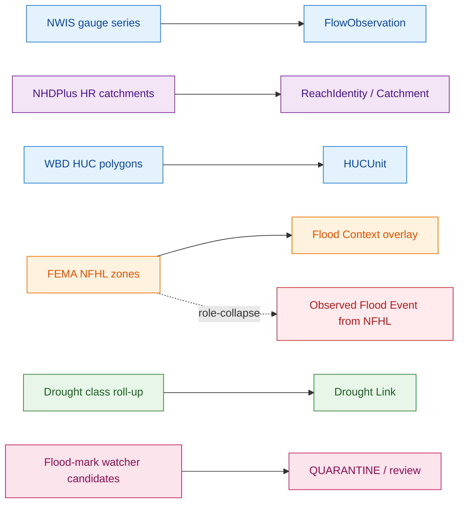
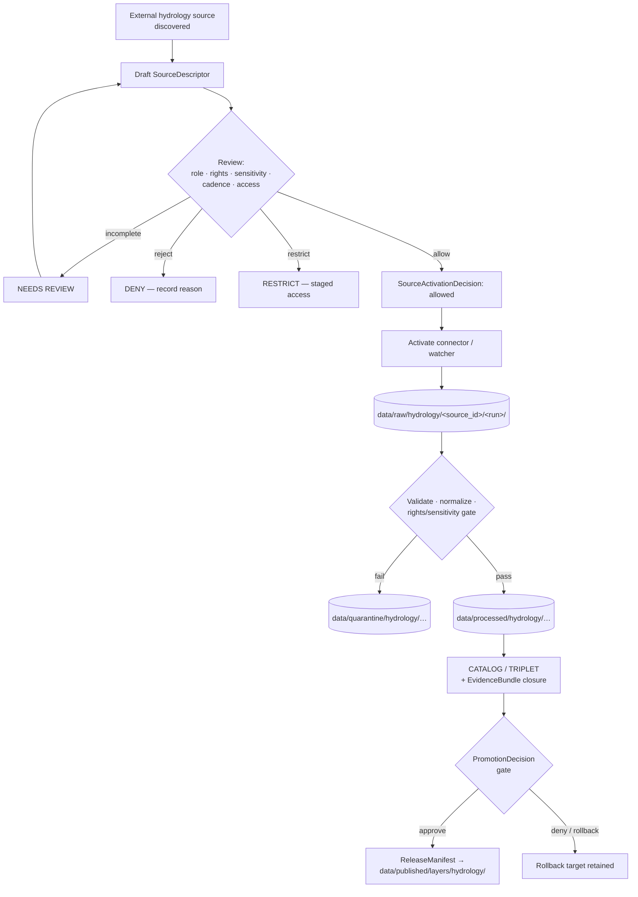

<!-- [KFM_META_BLOCK_V2]
doc_id: kfm://doc/source-registry-hydrology
title: Hydrology Source Registry
type: standard
version: v1
status: draft
owners: kfm-stewards-hydrology (PLACEHOLDER — owner team TBD)
created: 2026-05-18
updated: 2026-05-18
policy_label: public
related:
  - docs/domains/hydrology/README.md
  - docs/standards/PROV.md
  - data/registry/sources/hydrology/
  - schemas/contracts/v1/source/source-descriptor.json
  - policy/sensitivity/hydrology/
tags: [kfm, hydrology, sources, registry, governance]
notes:
  - Domain-segment doc per Directory Rules §12.
  - Data home for actual registry entries is data/registry/sources/hydrology/ (PROPOSED).
[/KFM_META_BLOCK_V2] -->

# Hydrology Source Registry

> The admission and authority-control surface for hydrology sources — identity, role, rights, cadence, sensitivity, and release class — before any source shapes public claims.


<!-- TODO: badge-target verification — CI/build/last-updated badges should be added when CI URLs are confirmed. -->

**Status:** draft · **Owners:** kfm-stewards-hydrology (PLACEHOLDER) · **Last updated:** 2026-05-18

---

## Contents

- [1. Scope and Purpose](#1-scope-and-purpose)
- [2. Repo Fit](#2-repo-fit)
- [3. Source Registry Doctrine](#3-source-registry-doctrine)
- [4. Registered Hydrology Source Families](#4-registered-hydrology-source-families)
- [5. Source-Role Discipline for Hydrology](#5-source-role-discipline-for-hydrology)
- [6. SourceDescriptor Field Shape (PROPOSED)](#6-sourcedescriptor-field-shape-proposed)
- [7. Admission Lifecycle and Activation Flow](#7-admission-lifecycle-and-activation-flow)
- [8. Rights, Sensitivity, and Deny-by-Default](#8-rights-sensitivity-and-deny-by-default)
- [9. Cadence and Source-Head Checks](#9-cadence-and-source-head-checks)
- [10. What This Registry Does Not Do](#10-what-this-registry-does-not-do)
- [11. Validation Gates (PROPOSED)](#11-validation-gates-proposed)
- [12. Open Questions and Verification Backlog](#12-open-questions-and-verification-backlog)
- [13. Related Docs](#13-related-docs)
- [Appendix A — Illustrative SourceDescriptor Sketch](#appendix-a--illustrative-sourcedescriptor-sketch)

---

## 1. Scope and Purpose

This document is the **human-facing reference for the hydrology source registry**. It records what sources are admitted to the hydrology lane, what role each may play in a claim, how it is governed across the KFM lifecycle, and what the registry intentionally refuses to do.

> [!IMPORTANT]
> **The source registry is an admission and authority-control surface, not a bibliography.** It records source identity, role, rights posture, access method, cadence, steward, sensitivity, freshness expectations, attribution requirements, and public-release class so source material can be admitted, quarantined, restricted, or denied before it shapes public claims. — *CONFIRMED doctrine.*

Scope is bounded by the hydrology domain charter: **watersheds, HUC units, hydrologic features, reaches, gauges, flow and level observations, water quality, groundwater context, regulatory flood context, observed flood evidence, drought and irrigation links** — and explicitly *excludes* emergency alerting, NFHL-as-observation collapses, and other domains' canonical claims (soil, agriculture, geology, infrastructure).

The doctrine is **CONFIRMED**. The implementation-layer specifics in this document — exact field names, file paths, validator commands, descriptor counts — are **PROPOSED** pending repo verification.

---

## 2. Repo Fit

This file lives at `docs/domains/hydrology/SOURCE_REGISTRY.md` per Directory Rules **§12 Domain Placement Law**: a domain is a segment inside a responsibility root, never a root itself.

```text
docs/domains/hydrology/SOURCE_REGISTRY.md        ← this doc (explanation)
data/registry/sources/hydrology/                  ← registry entries (data home, PROPOSED)
schemas/contracts/v1/source/source-descriptor.json← descriptor shape (PROPOSED)
contracts/source/SOURCE_DESCRIPTOR.md             ← descriptor meaning (PROPOSED)
policy/sensitivity/hydrology/                     ← sensitivity & rights policy (PROPOSED)
connectors/usgs/  connectors/fema/  …             ← source-specific fetchers
tests/domains/hydrology/sources/                  ← admission/role/rights tests (PROPOSED)
fixtures/domains/hydrology/sources/               ← valid + invalid fixtures (PROPOSED)
```

> [!NOTE]
> All sibling paths above are **PROPOSED** until verified against a mounted repo. Directory Rules §12 specifies the *pattern*; specific file presence is not asserted here.

**Authority class:** canonical (within `docs/`) · **Documentation as truth?** No — `docs/` *explains*; canonical decisions live in ADRs, the `control_plane/`, schemas, policy, and release manifests.

[⬆ Back to top](#contents)

---

## 3. Source Registry Doctrine

The hydrology source registry inherits the KFM cross-domain source registry doctrine without modification. The points below are **CONFIRMED** doctrine drawn from the Unified Implementation Architecture Build Manual, the Encyclopedia, and Directory Rules.

| Doctrine | Statement | Status |
|---|---|---|
| **Admission, not bibliography** | The registry decides whether a source may be used and how, not which sources are interesting. | CONFIRMED |
| **Descriptor before connector** | Every admitted source enters through a `SourceDescriptor`. Connectors and watchers remain inactive until a `SourceActivationDecision` exists. | CONFIRMED doctrine / PROPOSED flow |
| **Source role cannot be inferred from convenience** | A community-science occurrence source is not a legal-status authority; a regulatory flood layer is not observed flooding; an operational warning feed is not a KFM life-safety system. | CONFIRMED |
| **Unknown rights / unknown role = fail closed** | If rights, source role, access conditions, cadence, or release class are unrecorded, the safe state is quarantine, denial, restriction, or abstention. | CONFIRMED |
| **Watcher non-publisher invariant** | Watchers and pre-RAW events may observe and propose. They MUST NOT publish or admit material into public truth. | CONFIRMED |
| **Descriptor ≠ evidence** | The descriptor records *that the source exists* and *how it should be treated*. It does not record *what the source says* — that is `EvidenceBundle` territory. | CONFIRMED |

> [!CAUTION]
> The hydrology domain has an especially dangerous **role-collapse failure mode**: treating FEMA NFHL regulatory zones as observed inundation. The registry MUST keep regulatory, observed, and modeled flood material in distinct source-role lanes, and DENY publication that conflates them.

[⬆ Back to top](#contents)

---

## 4. Registered Hydrology Source Families

The source **families** below are CONFIRMED by KFM hydrology doctrine. Individual descriptor instances, endpoints, terms, contacts, and rate limits remain **NEEDS VERIFICATION** until current rights review and steward sign-off.

| Source Family | External Ref | Default Role(s) | Authority for | Not Authoritative for |
|---|---|---|---|---|
| USGS Watershed Boundary Dataset (WBD / HUC) | EXT-WBD | authority · context | HUC geometry; nested hydrologic units | observed flow; floodplain regulation |
| USGS NHDPlus High Resolution (NHDPlus HR / 3DHP) | EXT-NHDHR | authority · context · model | Stream/reach network identity; flow direction; catchment derivation | gauge observations; current flood extent |
| USGS Water Data / NWIS (`api.waterdata.usgs.gov`) | EXT-USGS-WATER | observation | Continuous and daily hydrologic time series; monitoring-location metadata | regulatory flood zones; emergency alerts |
| FEMA National Flood Hazard Layer (NFHL / MSC) | EXT-NFHL | regulatory · context | Effective regulatory flood-hazard zones (DFIRM/effective dates) | observed inundation; forecast |
| USGS 3DEP terrain | EXT-3DEP | authority · model-input | Elevation surface; terrain-derived hydrology | observed water level |
| State water offices (KS) | — | authority · administrative | Kansas-specific water use, permits, allocations | federal regulatory or scientific authority |
| Water quality programs (e.g., WQP/STORET-class) | — | observation · aggregate | Reported water-quality measurements with parameter codes | exceedance regulation per se |
| Groundwater well networks | — | observation | Water level / aquifer observations | aquifer-boundary regulatory truth |
| Historical observed flood evidence | — | observation · candidate | Past observed flood events with provenance | future flood prediction |
| Drought / irrigation link sources | — | context · aggregate | Drought monitor classes; irrigation-use linkages | per-parcel certainty |

> [!NOTE]
> External standards above are **EXTERNAL / EXTERNALLY CHECKED** per the KFM encyclopedia's source-ledger (`EXT-USGS-WATER`, `EXT-NHDHR`, `EXT-WBD`, `EXT-NFHL`, `EXT-3DEP`). The legacy `waterservices.usgs.gov` endpoint family is being phased out in favor of `api.waterdata.usgs.gov` (per New Ideas 5-8 packet); connector descriptors should target the modern endpoint with a fallback note for archived workflows.

> [!WARNING]
> **NFHL is a regulatory baseline, not a predictive flood model.** NFHL features carry `DFIRM_ID`, `VERSION_ID`, and `EFFECTIVE_DATE` as material attributes that must be preserved verbatim through normalization. NFHL **WMS** is visualization-only; analytical joins require the vector/feature service or archived source.

[⬆ Back to top](#contents)

---

## 5. Source-Role Discipline for Hydrology

KFM source roles form a finite vocabulary. The registry assigns one or more roles per source at admission; mismatch between role and claim type is a **DENY** condition, not a quality issue.

| Role | Means | Hydrology examples |
|---|---|---|
| `observed` | Direct measurement or witness with provenance | NWIS gauge readings; reported flood marks |
| `regulatory` | Effective by official authority for legal/regulatory purposes | NFHL flood-hazard zones; water-rights records |
| `modeled` | Output of a model run; must pin `ModelRunReceipt` | NHDPlus derived flow estimates; terrain-derived catchments |
| `aggregate` | Roll-up to a geometry-scope unit; must pin scope | HUC-12 county roll-ups; weekly drought class by county |
| `administrative` | Compilation by an administrative body | State permit registers; allocation summaries |
| `candidate` | Watcher- or scraper-emitted; not yet promoted | New flood-mark candidates; rights-change candidates |
| `synthetic` | Generated representation; must carry `RealityBoundaryNote` | Illustrative hydrograph reconstructions |



> [!TIP]
> A role-collapse fixture suite (e.g., *NFHL-cited-as-observed-event*) is high-value early test coverage. Pass 20 Part 2 lists this as **EXP-007** (Domain source-role matrices).

[⬆ Back to top](#contents)

---

## 6. SourceDescriptor Field Shape (PROPOSED)

The descriptor surface below is **PROPOSED** — it consolidates the cross-domain Atlas illustration with the SRC chapter expansions in Pass 20 Part 2 and the field set referenced in the Whole-UI Governed AI Expansion Report. Authoritative resolution requires an ADR or schema PR against `schemas/contracts/v1/source/source-descriptor.json`.

| Field | Type / Vocabulary | Required | Notes |
|---|---|---|---|
| `source_id` | string (stable) | MUST | Stable identity; never reused. |
| `source_role` | enum: `observed` \| `regulatory` \| `modeled` \| `aggregate` \| `administrative` \| `candidate` \| `synthetic` | MUST | Set at admission; corrections produce a new descriptor + `CorrectionNotice`. |
| `authority_scope` | string | MUST when role ∈ {regulatory, modeled, aggregate, administrative} | Issuing body / model identity / steward. |
| `provider` / `endpoint` | string | MUST | Current canonical URL; record fallback if any. |
| `retrieval_method` | enum: `http` \| `api` \| `ftp` \| `package` \| `manual` | MUST | Pairs with connector class. |
| `rights_state` | enum: `public` \| `open` \| `controlled` \| `restricted` \| `unknown` | MUST | Unknown rights fail closed. |
| `license_text_or_contact` | string | MUST | Text or contact reference; missing license is a DENY. |
| `sensitivity_state` | enum (registry-defined tiers) | MUST | Defaults follow §8 of this doc. |
| `update_cadence` | string (ISO-8601 duration or token) | MUST | Pairs with watcher cadence and freshness gates. |
| `version` / `source_vintage` | string | SHOULD | For dataset-style families with explicit vintages. |
| `source_head` | object: `{etag, last_modified, content_length, content_hash}` | SHOULD | Low-cost change detection only; not substantive validation. |
| `permitted_claims` | array of claim-types | MUST | What this source may support. |
| `not_authoritative_for` | array of claim-types | MUST | Anti-collapse declarations. |
| `role_aggregation_unit` | enum: `county` \| `huc12` \| `huc08` \| `tract` \| `year` \| `decade` \| … | MUST when role = `aggregate` | Geometry-scope token; prevents drift on join. |
| `role_model_run_ref` | `EvidenceRef` → `ModelRunReceipt` | MUST when role = `modeled` | Pins inputs, parameters, version. |
| `role_candidate_disposition` | enum: `pending` \| `merged` \| `rejected` \| `quarantined` | MUST when role = `candidate` | PUBLISHED edge forbidden until `merged`. |
| `steward` / `contact` | string | MUST | Named human or role mailbox. |
| `admissibility_limits` | object | SHOULD | Known caveats for downstream policy lookup. |

> [!NOTE]
> Names above are **PROPOSED**. Where field names differ in a mounted schema, the mounted schema wins and this table is updated.

[⬆ Back to top](#contents)

---

## 7. Admission Lifecycle and Activation Flow

The hydrology lane follows the KFM canonical lifecycle without exception:

> `RAW → WORK / QUARANTINE → PROCESSED → CATALOG / TRIPLET → PUBLISHED`

A source moves through admission **once** at registration, then its produced material moves through the lifecycle **continuously**.



The flow has three **CONFIRMED invariants**:

1. **Connectors emit only to `data/raw/` or `data/quarantine/`.** They MUST NOT write to `data/processed/`, `data/catalog/`, or `data/published/`.
2. **Promotion is a governed state transition, not a file move.** Each transition requires resolvable `EvidenceBundle`, `PolicyDecision`, and `PromotionDecision`.
3. **No public surface reads RAW / WORK / QUARANTINE or canonical stores.** Public clients consume `apps/governed-api/` only; the renderer is downstream of release.

[⬆ Back to top](#contents)

---

## 8. Rights, Sensitivity, and Deny-by-Default

Hydrology is, on the whole, **public-safe by default** — surface water observations, HUC polygons, and effective regulatory layers are typically open. The registry must still encode the cases that are not.

| Class | Hydrology examples | Default outcome | Required controls |
|---|---|---|---|
| Source-rights-limited | Licensed third-party hydrologic feeds; restricted state datasets | DENY public release until terms resolved | rights register; attribution; no public derivative if barred |
| Private landowner-sensitive | Private-well coordinates; private-water-use records | DENY exact/public if private or rights unclear | aggregation; permissions; policy review |
| Critical infrastructure adjacency | Exact dam, levee, intake, or treatment-plant geometries | RESTRICT/DENY public precision | public-safe aggregation; role-based access |
| Emergency-warning misuse | Use of forecast/warning feeds as life-safety alerts | DENY life-safety replacement; contextual-only with official redirection | not-for-life-safety disclaimer; issue/expiry freshness |
| Exact sensitive locations | Any exact point increasing harm risk in the hydrology context | DENY by default | redaction/generalization; audit |

> [!IMPORTANT]
> **Hydrology must not become an emergency alerting system.** Forecasts, warnings, and operational notices may be ingested as *context* with retained source role, but they MUST NOT be rendered or queried as KFM-issued life-safety guidance. UI surfaces carry a not-for-life-safety disclaimer with redirect to official sources.

[⬆ Back to top](#contents)

---

## 9. Cadence and Source-Head Checks

Hydrology source cadence varies sharply across the family list — from sub-hourly streamflow to multi-year regulatory revisions. The registry encodes cadence **per descriptor**, and pairs it with a watcher policy.

| Family | Typical cadence (PROPOSED defaults — NEEDS VERIFICATION per source) | Recommended watcher mode |
|---|---|---|
| NWIS instantaneous values (parameter `00060` etc.) | 5–60 min sensor cadence | rate-aware polling; sustained-anomaly sidecar |
| NWIS daily values | daily summary | daily ingest |
| WBD / HUC | annual or per-vintage | HEAD + version check |
| NHDPlus HR | per release | HEAD + version check |
| FEMA NFHL | event-driven, per `EFFECTIVE_DATE` change | per-county VERSION_ID watcher |
| 3DEP terrain | per release | manifest-checksum |
| Water-quality programs | reporting-cycle | scheduled batch |
| Drought classes | weekly | weekly poll |

> [!NOTE]
> **`source_head` is intake evidence, not validation.** HEAD success means the URL responded — not that the new content is admissible. ETag/Last-Modified alone is insufficient because publishers may re-publish under the same URL; content hash is stronger evidence where feasible.

A material-change sidecar pattern for streamflow (illustrative; **PROPOSED**):

```json
{
  "object_type": "SourceIntakeRecord",
  "schema_version": "v1",
  "domain": "hydrology",
  "source_id": "usgs-nwis-iv",
  "site": "<USGS_SITE_ID>",
  "parameter": "00060",
  "window_days": 7,
  "baseline_median": 0.0,
  "anomaly_ratio": 0.0,
  "publication_state": "WORK_CANDIDATE",
  "spec_hash": "<jcs-sha256>"
}
```

Watchers emit this sidecar with `publication_state: WORK_CANDIDATE`. Promotion to `PROCESSED` and beyond requires the standard validation + policy + review gates. Watchers are not publishers.

[⬆ Back to top](#contents)

---

## 10. What This Registry Does Not Do

> [!WARNING]
> The list below is a **non-negotiable** boundary for the hydrology source registry. Each item maps to a documented anti-pattern.

- **Does not** collapse regulatory NFHL zones into observed inundation or forecast.
- **Does not** infer source role from convenience (e.g., promoting a community report to legal authority).
- **Does not** publish from a watcher, scraper, connector, or pre-RAW event.
- **Does not** store source material itself — the descriptor records *that the source exists* and *how it should be treated*; content lives under `data/<phase>/hydrology/...`.
- **Does not** authorize bypassing `apps/governed-api/` for public clients.
- **Does not** act as a bibliography of "interesting" sources — registration implies admission posture.
- **Does not** carry generated AI summaries, narrative descriptions, or interpretive prose as descriptor content.
- **Does not** substitute for `EvidenceBundle`. A descriptor is not evidence.

[⬆ Back to top](#contents)

---

## 11. Validation Gates (PROPOSED)

The hydrology source registry should be checked by validators that **fail closed** on the conditions below. Specific validator names and exit codes are PROPOSED until verified against `tools/validators/source_descriptor/` and `tests/domains/hydrology/sources/`.

```text
Descriptor admission gate — DENY when:
  ─ missing source_id, source_role, rights_state, sensitivity_state, or update_cadence
  ─ rights_state = "unknown" and target release class is public
  ─ source_role = "regulatory" without authority_scope
  ─ source_role = "modeled" without role_model_run_ref
  ─ source_role = "aggregate" without role_aggregation_unit
  ─ source_role = "candidate" with PUBLISHED edge attempted
  ─ permitted_claims overlaps not_authoritative_for
  ─ license_text_or_contact absent

Source-head gate — ABSTAIN/ERROR when:
  ─ ETag rotates without content change
  ─ Last-Modified absent and content_hash unavailable
  ─ HEAD success used as substitute for validation pass

Role-claim join gate — DENY when:
  ─ NFHL feature joined as Observed Flood Event
  ─ NWIS site cited as regulatory authority
  ─ Aggregate cell joined as per-place truth
  ─ Candidate exposed on a public surface
```

A first thin-slice fixture pair (per Pass 20 EXP-001 / EXP-011 patterns):

- **Positive:** complete NWIS observation descriptor with rights, cadence, and `source_head` → ADMIT.
- **Negative:** NFHL descriptor with `permitted_claims` including `ObservedFloodEvent` → DENY with stated reason code.

[⬆ Back to top](#contents)

---

## 12. Open Questions and Verification Backlog

| Item | What would settle it | Status |
|---|---|---|
| Canonical schema home for `SourceDescriptor` (default per ADR-0001: `schemas/contracts/v1/source/source-descriptor.json`) | mounted repo inspection + ADR-0001 review | NEEDS VERIFICATION |
| Field names and required-when rules for `SourceDescriptor` | mounted repo schema + fixtures | NEEDS VERIFICATION |
| Source-role enum freezing (ADR-S-04 in master open-ADR backlog) | accepted ADR | OPEN |
| Sensitivity tier scheme (T0–T4 vs alternative — ADR-S-05) | accepted ADR | OPEN |
| `SourceActivationDecision` schema and review workflow | mounted repo + steward sign-off process | PROPOSED |
| Specific Kansas state-water-office source rights and terms | rights review per source | NEEDS VERIFICATION |
| USGS Water Data API versioning, rate limits, deprecation horizons for `waterservices.usgs.gov` | source documentation review per descriptor (phase-out timeframe noted as 2026/2027 in project knowledge) | NEEDS VERIFICATION |
| Per-county NFHL `VERSION_ID` cadence and watcher tolerance | initial 30-day false-trigger steward review | NEEDS VERIFICATION |
| Geoprivacy / generalization transform rules for groundwater wells on private land | policy authoring + fixture pair | PROPOSED |
| Outbox placement for hydrology watchers (e.g., `tools/ingest/hydrology_watch/`) | Directory Rules review + ADR if new root needed | PROPOSED |
| Mapping of `PROV.md` vs `PROVENANCE.md` naming convention for receipts referenced here | accepted ADR | OPEN |

[⬆ Back to top](#contents)

---

## 13. Related Docs

- [`docs/domains/hydrology/README.md`](./README.md) — domain README (PLACEHOLDER link; verify presence)
- [`docs/standards/PROV.md`](../../standards/PROV.md) — provenance terms used by `EvidenceBundle` and `RunReceipt`
- [`docs/runbooks/fauna/SOURCE_REFRESH_RUNBOOK.md`](../../runbooks/fauna/SOURCE_REFRESH_RUNBOOK.md) — adjacent runbook pattern; hydrology counterpart TBD
- `docs/architecture/governed-ai/FOCUS_FLOW.md` — how `EvidenceBundle` resolves at runtime (PROPOSED)
- `docs/sources/SOURCE_DESCRIPTOR_STANDARD.md` — cross-cutting descriptor standard (PROPOSED — referenced in Whole-UI Governed AI Expansion Report §15)
- `contracts/source/SOURCE_DESCRIPTOR.md` — descriptor meaning (PROPOSED)
- `schemas/contracts/v1/source/source-descriptor.json` — descriptor shape (PROPOSED)
- `policy/sensitivity/hydrology/` — hydrology sensitivity rules (PROPOSED)
- `data/registry/sources/hydrology/` — actual registry entries (PROPOSED)
- Directory Rules **§4 Placement Protocol**, **§12 Domain Placement Law**, **§15 README Contract**

<!-- TODO: replace PLACEHOLDER and PROPOSED links with verified paths after repo inspection. -->

[⬆ Back to top](#contents)

---

## Appendix A — Illustrative SourceDescriptor Sketch

> [!NOTE]
> The JSON below is **illustrative** for review. It is not an authoritative schema, not a fixture, and not implementation evidence. Field names follow the PROPOSED shape in §6.

<details>
<summary><strong>USGS NWIS instantaneous discharge — illustrative descriptor</strong></summary>

```json
{
  "object_type": "SourceDescriptor",
  "schema_version": "v1",
  "source_id": "usgs-nwis-iv-discharge",
  "source_role": "observed",
  "authority_scope": "U.S. Geological Survey, Water Resources Mission Area",
  "provider": "USGS Water Data",
  "endpoint": "https://api.waterdata.usgs.gov/...",
  "retrieval_method": "api",
  "rights_state": "public",
  "license_text_or_contact": "USGS public-domain water data — verify current terms",
  "sensitivity_state": "T0_public",
  "update_cadence": "PT15M",
  "version": "current",
  "source_head": {
    "etag": null,
    "last_modified": null,
    "content_length": null,
    "content_hash": null
  },
  "permitted_claims": [
    "FlowObservation",
    "WaterLevelObservation",
    "GaugeSite"
  ],
  "not_authoritative_for": [
    "NFHLZone",
    "RegulatoryFloodEvent",
    "EmergencyAlert"
  ],
  "steward": "kfm-stewards-hydrology",
  "admissibility_limits": {
    "provisional_status": "preserve_field",
    "qualifier_codes": "preserve_field",
    "time_zone": "UTC required"
  }
}
```

</details>

<details>
<summary><strong>FEMA NFHL effective flood-hazard zones — illustrative descriptor</strong></summary>

```json
{
  "object_type": "SourceDescriptor",
  "schema_version": "v1",
  "source_id": "fema-nfhl-effective",
  "source_role": "regulatory",
  "authority_scope": "Federal Emergency Management Agency — NFHL effective",
  "provider": "FEMA Map Service Center",
  "endpoint": "https://hazards.fema.gov/...",
  "retrieval_method": "api",
  "rights_state": "public",
  "license_text_or_contact": "FEMA public terms — verify per release",
  "sensitivity_state": "T0_public_regulatory",
  "update_cadence": "event-driven",
  "source_head": {
    "etag": null,
    "last_modified": null,
    "content_length": null,
    "content_hash": null
  },
  "permitted_claims": [
    "NFHLZone",
    "FloodContext"
  ],
  "not_authoritative_for": [
    "ObservedFloodEvent",
    "FloodForecast",
    "EmergencyAlert",
    "FlowObservation"
  ],
  "steward": "kfm-stewards-hydrology",
  "admissibility_limits": {
    "preserve_attributes": ["DFIRM_ID", "VERSION_ID", "EFFECTIVE_DATE"],
    "wms_use": "visualization_only",
    "analytic_use": "vector_or_archive_only"
  }
}
```

</details>

[⬆ Back to top](#contents)

---

**Related docs:** see [§13](#13-related-docs) · **Last updated:** 2026-05-18 · [⬆ Back to top](#contents)
