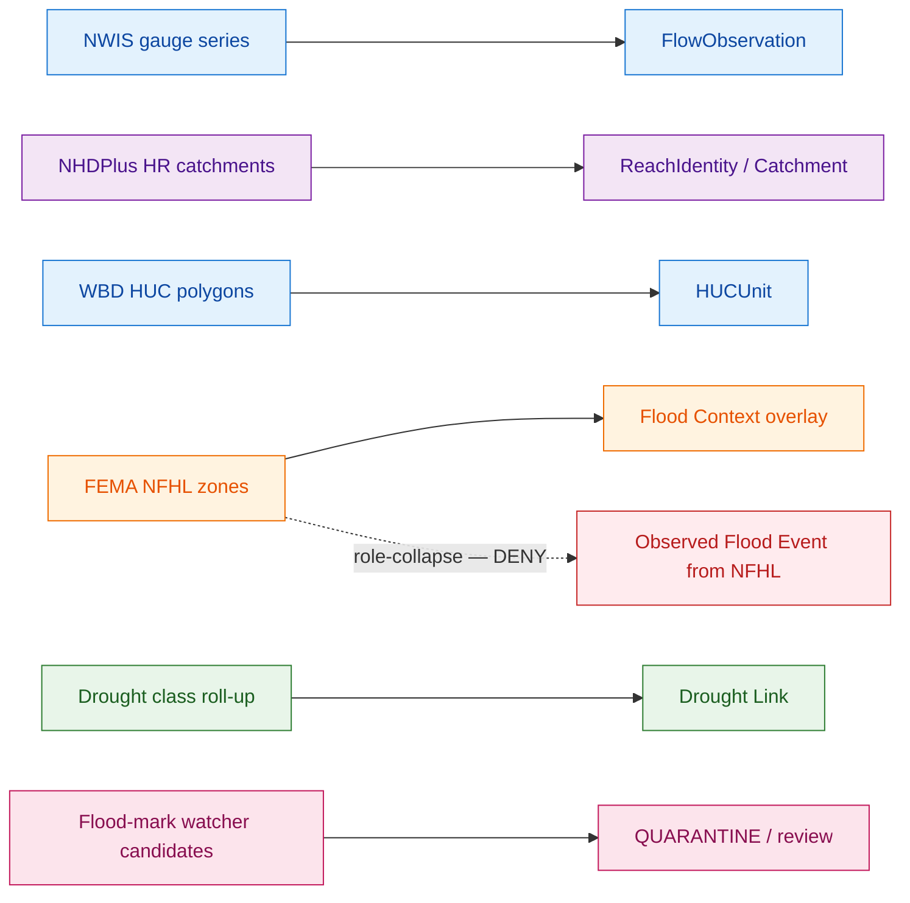
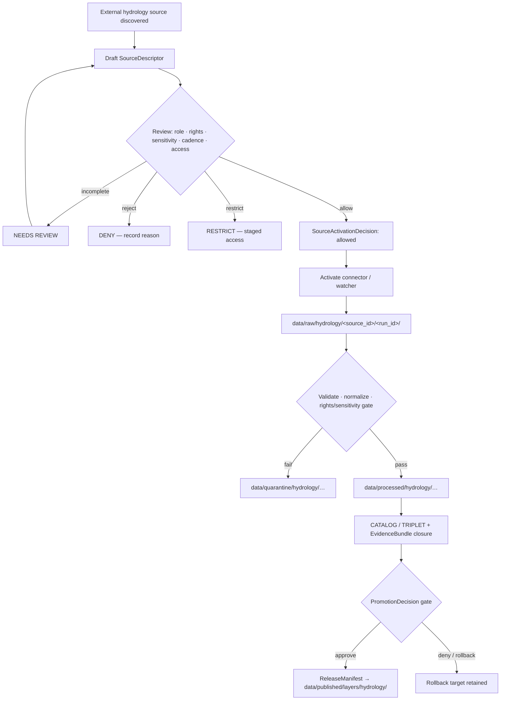

<!-- [KFM_META_BLOCK_V2]
doc_id: kfm://doc/source-registry-hydrology
title: Hydrology Source Registry
type: standard
version: v2
status: draft
owners: <hydrology-source-steward>   # PLACEHOLDER — confirm team/handle in CODEOWNERS
created: 2026-05-18
updated: 2026-06-07
policy_label: public
related:
  - ai-build-operating-contract.md
  - directory-rules.md
  - docs/domains/hydrology/README.md
  - docs/domains/hydrology/SOURCE_FAMILIES.md
  - docs/domains/hydrology/PUBLICATION_POSTURE.md
  - data/registry/sources/hydrology/
  - schemas/contracts/v1/source/source-descriptor.json
  - policy/sensitivity/hydrology/
tags: [kfm, hydrology, sources, registry, governance]
notes:
  - 'CONTRACT_VERSION = "3.0.0"'
  - "Domain-segment doc per Directory Rules §12; registry data home is data/registry/sources/hydrology/ (CONFIRMED pattern, §9.1)."
  - "Source role is a first-class identity attribute, fixed at admission, never upgraded by promotion."
  - "EXT-* source IDs are illustrative placeholders; they are NOT in the project source ledger (NEEDS VERIFICATION)."
[/KFM_META_BLOCK_V2] -->

# Hydrology Source Registry

> The admission and authority-control surface for hydrology sources — identity, role, rights, cadence, sensitivity, and release class — before any source shapes public claims.

<!-- Badge targets are placeholders. Add CI/build/last-updated badges when CI URLs are confirmed. -->


**Status:** draft · **Owners:** `<hydrology-source-steward>` (PLACEHOLDER) · **Last updated:** 2026-06-07 · **Contract:** `CONTRACT_VERSION = "3.0.0"`

---

## Contents

- [1. Scope and Purpose](#1-scope-and-purpose)
- [2. Repo Fit](#2-repo-fit)
- [3. Source Registry Doctrine](#3-source-registry-doctrine)
- [4. Registered Hydrology Source Families](#4-registered-hydrology-source-families)
- [5. Source-Role Discipline for Hydrology](#5-source-role-discipline-for-hydrology)
- [6. SourceDescriptor Field Shape (PROPOSED)](#6-sourcedescriptor-field-shape-proposed)
- [7. Admission Lifecycle and Activation Flow](#7-admission-lifecycle-and-activation-flow)
- [8. Rights, Sensitivity, and Deny-by-Default](#8-rights-sensitivity-and-deny-by-default)
- [9. Cadence and Source-Head Checks](#9-cadence-and-source-head-checks)
- [10. What This Registry Does Not Do](#10-what-this-registry-does-not-do)
- [11. Validation Gates (PROPOSED)](#11-validation-gates-proposed)
- [12. Open Questions and Verification Backlog](#12-open-questions-and-verification-backlog)
- [13. Related Docs](#13-related-docs)
- [Appendix A — Illustrative SourceDescriptor Sketch](#appendix-a--illustrative-sourcedescriptor-sketch)

---

## 1. Scope and Purpose

This document is the **human-facing reference for the hydrology source registry**. It records what sources are admitted to the hydrology lane, what role each may play in a claim, how it is governed across the KFM lifecycle, and what the registry intentionally refuses to do.

> [!IMPORTANT]
> **The source registry is an admission and authority-control surface, not a bibliography.** It records source identity, role, rights posture, access method, cadence, steward, sensitivity, freshness expectations, attribution requirements, and public-release class so source material can be admitted, quarantined, restricted, or denied before it shapes public claims. — *CONFIRMED doctrine.*

Scope follows the hydrology domain charter: **watersheds, HUC units, hydrologic features, reaches, gauges, flow and level observations, water quality, groundwater context, regulatory flood context, observed flood evidence, drought and irrigation links** — and explicitly *excludes* emergency alerting, NFHL-as-observation collapses, and other domains' canonical claims (soil, agriculture, geology, infrastructure). [DOM-HYD §A, §B]

The doctrine is **CONFIRMED**. Implementation specifics — exact field names, file paths, validator commands, descriptor counts, external endpoints, and any `EXT-*` identifiers — are **PROPOSED / NEEDS VERIFICATION** pending repo and rights review.

[⬆ Back to top](#contents)

---

## 2. Repo Fit

This file lives at `docs/domains/hydrology/SOURCE_REGISTRY.md` per Directory Rules **§12 Domain Placement Law**: a domain is a segment inside a responsibility root, never a root itself.

```text
docs/domains/hydrology/SOURCE_REGISTRY.md          ← this doc (explanation)
data/registry/sources/hydrology/                   ← registry entries (CONFIRMED pattern, §9.1; leaf NEEDS VERIFICATION)
schemas/contracts/v1/source/source-descriptor.json ← descriptor shape (PROPOSED home; ADR-0001 / §7.4)
contracts/source/SOURCE_DESCRIPTOR.md              ← descriptor meaning (PROPOSED)
policy/sensitivity/hydrology/                       ← sensitivity & rights policy (PROPOSED)
connectors/usgs/  connectors/fema/  …               ← source-specific fetchers (CONFIRMED root §7.3; leaves PROPOSED)
tests/domains/hydrology/sources/                    ← admission/role/rights tests (PROPOSED)
fixtures/domains/hydrology/sources/                 ← valid + invalid fixtures (PROPOSED)
```

> [!NOTE]
> `data/registry/sources/<domain>/` and `connectors/` are **CONFIRMED** patterns (Directory Rules §9.1, §7.3); the `hydrology` segment and specific file presence are **NEEDS VERIFICATION**. The schema home and descriptor-meaning paths are **PROPOSED** per ADR-0001 / §7.4.

**Authority class:** canonical (within `docs/`) · **Documentation as truth?** No — `docs/` *explains*; canonical decisions live in ADRs, `control_plane/`, schemas, policy, and the registry data home.

[⬆ Back to top](#contents)

---

## 3. Source Registry Doctrine

The hydrology source registry inherits the KFM cross-domain source-registry doctrine without modification. The points below are **CONFIRMED** doctrine drawn from the operating contract, the Unified Implementation Architecture Build Manual, the Encyclopedia, and Directory Rules.

| Doctrine | Statement | Status |
|---|---|---|
| **Admission, not bibliography** | The registry decides whether a source may be used and how, not which sources are interesting. | CONFIRMED |
| **Descriptor before connector** | Every admitted source enters through a `SourceDescriptor`. Connectors and watchers stay inactive until a `SourceActivationDecision` exists. | CONFIRMED doctrine / PROPOSED flow |
| **Source role cannot be inferred from convenience** | A community-science occurrence source is not a legal-status authority; a regulatory flood layer is not observed flooding; an operational warning feed is not a KFM life-safety system. | CONFIRMED |
| **Unknown rights / unknown role = fail closed** | If rights, source role, access conditions, cadence, or release class are unrecorded, the safe state is quarantine, denial, restriction, or abstention. | CONFIRMED |
| **Watcher non-publisher invariant** | Watchers and pre-RAW events may observe and propose. They MUST NOT publish or admit material into public truth. | CONFIRMED |
| **Role fixed at admission** | A source role is set on the `SourceDescriptor` at admission and **never upgraded by promotion** (modeled → observed, candidate → verified are separate governed transitions). | CONFIRMED |
| **Descriptor ≠ evidence** | The descriptor records *that the source exists* and *how it should be treated*. It does not record *what the source says* — that is `EvidenceBundle` territory. | CONFIRMED |

> [!CAUTION]
> The hydrology domain has an especially dangerous **role-collapse failure mode**: treating FEMA NFHL regulatory zones as observed inundation. The registry MUST keep regulatory, observed, and modeled flood material in distinct source-role lanes, and DENY publication that conflates them. [ENCY §24.1.2]

[⬆ Back to top](#contents)

---

## 4. Registered Hydrology Source Families

The source **families** below are CONFIRMED by KFM hydrology doctrine (Atlas §4.D, exact set). Individual descriptor instances, endpoints, terms, contacts, rate limits, and any `EXT-*` identifiers remain **NEEDS VERIFICATION** until current rights review and steward sign-off.

> [!CAUTION]
> The `EXT-*` identifiers in the next table are **illustrative placeholders for this doc**, not project-confirmed source-ledger IDs. The project corpus does **not** define `EXT-USGS-WATER`, `EXT-NHDHR`, `EXT-WBD`, `EXT-NFHL`, or `EXT-3DEP` (the MapLibre master self-check explicitly records "no `EXT-*` sources were used"). Treat the IDs as PROPOSED naming pending a real source-ledger entry.

| Source Family | Illustrative ID *(PROPOSED)* | Default Role(s) | Authority for | Not Authoritative for |
|---|---|---|---|---|
| USGS Watershed Boundary Dataset (WBD / HUC) | `ext-wbd` | authority · context | HUC geometry; nested hydrologic units | observed flow; floodplain regulation |
| USGS NHDPlus High Resolution (NHDPlus HR / 3DHP) | `ext-nhdhr` | authority · context · model | Stream/reach network identity; flow direction; catchment derivation | gauge observations; current flood extent |
| USGS Water Data / NWIS | `ext-usgs-water` | observed | Continuous and daily hydrologic time series; monitoring-location metadata | regulatory flood zones; emergency alerts |
| FEMA National Flood Hazard Layer (NFHL / MSC) | `ext-nfhl` | regulatory · context | Effective regulatory flood-hazard zones | observed inundation; forecast |
| USGS 3DEP terrain | `ext-3dep` | authority · model-input | Elevation surface; terrain-derived hydrology | observed water level |
| State water offices (KS) | — | authority · administrative | Kansas-specific water use, permits, allocations | federal regulatory or scientific authority |
| Water quality & groundwater programs | — | observed · aggregate | Reported water-quality / groundwater measurements with parameter metadata | exceedance regulation per se |
| Groundwater well networks | — | observed | Water level / aquifer observations | aquifer-boundary regulatory truth |
| Historical observed flood evidence | — | observed · candidate | Past observed flood events with provenance | future flood prediction |
| Drought / irrigation link sources | — | context · aggregate | Drought-monitor classes; irrigation-use linkages | per-parcel certainty |

> [!NOTE]
> CONFIRMED (Atlas `KFM-P2-IDEA-0021`): USGS is the canonical authority for streamgage data (NWIS) and stream-network identity (NHDPlus); KFM ingests USGS via documented APIs with explicit cadence handling. CONFIRMED tension (same card): USGS APIs occasionally restructure, so watchers MUST track API versions explicitly. **NEEDS VERIFICATION:** any specific legacy-endpoint (`waterservices.usgs.gov`) phase-out *timeline* — the corpus records the version-churn risk but not a dated sunset. Pin connectors to a recorded API version regardless, and verify the current endpoint against USGS documentation before asserting one.

> [!WARNING]
> **NFHL is a regulatory baseline, not a predictive flood model.** Treat NFHL feature attributes such as a DFIRM identifier, version identifier, and effective date as *material attributes to preserve verbatim through normalization* — *(these attribute names are EXTERNAL/illustrative, drawn from FEMA NFHL convention, not from project doctrine; confirm exact field names against the source before asserting them).* NFHL **WMS** is visualization-only; analytical joins require the vector/feature service or archived source. *(WMS-vs-feature-service distinction is EXTERNAL/illustrative.)*

[⬆ Back to top](#contents)

---

## 5. Source-Role Discipline for Hydrology

KFM source roles form a finite, CONFIRMED vocabulary of **seven canonical classes** _([ENCY §24.1.1])._ The registry assigns one or more roles per source at admission; a mismatch between role and claim type is a **DENY** condition, not a quality issue.

| Role | Means | Hydrology examples |
|---|---|---|
| `observed` | Direct measurement or first-hand record with provenance | NWIS gauge readings; reported flood marks |
| `regulatory` | Effective determination by official authority with legal/administrative force | NFHL flood-hazard zones |
| `modeled` | Output of a model run; must pin a `ModelRunReceipt` | terrain-derived catchments; reconstructed hydrographs |
| `aggregate` | Roll-up to a geometry-scope unit; must pin the scope | HUC-12 county roll-ups; weekly drought class by county |
| `administrative` | Compilation by an administrative body | water-right rosters; allocation summaries |
| `candidate` | Watcher- or scraper-emitted; not yet promoted | new flood-mark candidates; rights-change candidates |
| `synthetic` | Generated representation; must carry a `RealityBoundaryNote` | illustrative hydrograph reconstructions; AI-drafted notes |



> [!TIP]
> A role-collapse fixture suite (e.g., *NFHL-cited-as-observed-event*) is high-value early test coverage and directly exercises the §24.1.2 anti-collapse DENY conditions. *(The "EXP-007 / Pass 20 Part 2" reference in the prior draft is NEEDS VERIFICATION; the underlying anti-collapse rule is CONFIRMED.)*

[⬆ Back to top](#contents)

---

## 6. SourceDescriptor Field Shape (PROPOSED)

The descriptor surface below is **PROPOSED** _([ENCY §24.1.3]; illustrative, not authoritative)._ The canonical schema home defaults to `schemas/contracts/v1/source/source-descriptor.json` per Directory Rules §7.4 and ADR-0001 unless an accepted ADR relocates it. Field presence and names are **NEEDS VERIFICATION** against the mounted schema.

| Field | Type / Vocabulary | Required | Notes |
|---|---|---|---|
| `source_id` | string (stable) | MUST | Stable identity; never reused. |
| `source_role` | enum: `observed \| regulatory \| modeled \| aggregate \| administrative \| candidate \| synthetic` | MUST | Set at admission; corrections produce a new descriptor + `CorrectionNotice`. |
| `authority_scope` | string | MUST when role ∈ {regulatory, modeled, aggregate, administrative} | Issuing body / model identity / steward. |
| `provider` / `endpoint` | string | MUST | Current canonical URL; record fallback if any. |
| `retrieval_method` | enum: `http \| api \| ftp \| package \| manual` | MUST | Pairs with connector class. |
| `rights_state` | enum: `public \| open \| controlled \| restricted \| unknown` | MUST | Unknown rights fail closed. |
| `license_text_or_contact` | string | MUST | Text or contact reference; missing license is a DENY. |
| `sensitivity_state` | enum (registry-defined tiers) | MUST | Defaults follow §8; tier scheme is ADR-S-05 (OPEN). |
| `update_cadence` | string (ISO-8601 duration or token) | MUST | Pairs with watcher cadence and freshness gates. |
| `version` / `source_vintage` | string | SHOULD | For dataset-style families with explicit vintages. |
| `source_head` | object: `{etag, last_modified, content_length, content_hash}` | SHOULD | Low-cost change detection only; not substantive validation. |
| `permitted_claims` | array of claim-types | MUST | What this source may support. |
| `not_authoritative_for` | array of claim-types | MUST | Anti-collapse declarations. |
| `role_aggregation_unit` | enum: `county \| huc12 \| huc08 \| tract \| year \| decade \| …` | MUST when role = `aggregate` | Geometry-scope token; prevents drift on join. |
| `role_model_run_ref` | `EvidenceRef` → `ModelRunReceipt` | MUST when role = `modeled` | Pins inputs, parameters, version. |
| `role_candidate_disposition` | enum: `pending \| merged \| rejected \| quarantined` | MUST when role = `candidate` | PUBLISHED edge forbidden until `merged`. |
| `steward` / `contact` | string | MUST | Named human or role mailbox. |
| `admissibility_limits` | object | SHOULD | Known caveats for downstream policy lookup. |

> [!NOTE]
> The §24.1.3 Atlas surface confirms `source_role`, `role_authority`, `role_aggregation_unit`, `role_model_run_ref`, `role_synthetic_basis`, and `role_candidate_disposition`. Other fields above (`provider`, `retrieval_method`, `rights_state`, `permitted_claims`, etc.) are **INFERRED** registry conveniences, PROPOSED until the mounted schema confirms them. Where field names differ in the mounted schema, the schema wins and this table is updated. A `synthetic` source additionally requires `role_synthetic_basis` with a Reality Boundary Note ref (omitted from the table above for brevity; CONFIRMED in §24.1.3).

[⬆ Back to top](#contents)

---

## 7. Admission Lifecycle and Activation Flow

The hydrology lane follows the KFM canonical lifecycle without exception:

> `RAW → WORK / QUARANTINE → PROCESSED → CATALOG / TRIPLET → PUBLISHED`

A source moves through admission **once** at registration, then its produced material moves through the lifecycle **continuously**.



The flow has three **CONFIRMED invariants**:

1. **Connectors emit only to `data/raw/<domain>/<source_id>/<run_id>/` or `data/quarantine/`.** They MUST NOT write to `data/processed/`, `data/catalog/`, or `data/published/`. [DIRRULES §7.3]
2. **Promotion is a governed state transition, not a file move.** Each transition requires resolvable `EvidenceBundle`, `PolicyDecision`, and `PromotionDecision`.
3. **No public surface reads RAW / WORK / QUARANTINE or canonical stores.** Public clients consume `apps/governed-api/` only; the renderer (`apps/explorer-web/`) is downstream of release.

[⬆ Back to top](#contents)

---

## 8. Rights, Sensitivity, and Deny-by-Default

Hydrology is, on the whole, public-safe by default — surface-water observations, HUC polygons, and effective regulatory layers are typically open. The registry must still encode the cases that are not.

| Class | Hydrology examples | Default outcome | Required controls |
|---|---|---|---|
| Source-rights-limited | Licensed third-party feeds; restricted state datasets | DENY public release until terms resolved | rights register; attribution; no public derivative if barred |
| Private landowner-sensitive | Private-well coordinates; private water-use records | DENY exact/public if private or rights unclear | aggregation; permissions; policy review |
| Critical-infrastructure adjacency | Exact dam, levee, intake, or treatment-plant geometries | RESTRICT/DENY public precision | public-safe aggregation; role-based access |
| Emergency-warning misuse | Forecast/warning feeds used as life-safety alerts | DENY life-safety replacement; contextual-only with official redirection | not-for-life-safety disclaimer; issue/expiry freshness |
| Exact sensitive locations | Any exact point increasing harm risk in the hydrology context | DENY by default | redaction/generalization; audit |

> [!IMPORTANT]
> **Hydrology must not become an emergency-alerting system.** Forecasts, warnings, and operational notices may be ingested as *context* with retained source role, but they MUST NOT be rendered or queried as KFM-issued life-safety guidance. UI surfaces carry a not-for-life-safety disclaimer with redirect to official sources. [DOM-HYD] [ENCY §20.4 emergency-alert boundary]
>
> Route any genuinely sensitive disposition through the operating contract's §23.2 sensitive-domain decision matrix; see [`PUBLICATION_POSTURE.md`](./PUBLICATION_POSTURE.md).

[⬆ Back to top](#contents)

---

## 9. Cadence and Source-Head Checks

Hydrology source cadence varies sharply across the family list — from sub-hourly streamflow to multi-year regulatory revisions. The registry encodes cadence **per descriptor** and pairs it with a watcher policy.

| Family | Typical cadence *(PROPOSED defaults — NEEDS VERIFICATION per source)* | Recommended watcher mode |
|---|---|---|
| NWIS instantaneous values | sub-hourly sensor cadence | rate-aware polling; sustained-anomaly sidecar |
| NWIS daily values | daily summary | daily ingest |
| WBD / HUC | annual or per-vintage | HEAD + version check |
| NHDPlus HR | per release | HEAD + version check |
| FEMA NFHL | event-driven, per effective-date change | per-county version watcher |
| 3DEP terrain | per release | manifest-checksum |
| Water-quality programs | reporting-cycle | scheduled batch |
| Drought classes | weekly | weekly poll |

> [!NOTE]
> **`source_head` is intake evidence, not validation.** HEAD success means the URL responded — not that the new content is admissible. ETag/Last-Modified alone is insufficient because publishers may re-publish under the same URL; a content hash is stronger evidence where feasible.

A material-change sidecar pattern for streamflow (illustrative; **PROPOSED**):

```json
{
  "object_type": "SourceIntakeRecord",
  "schema_version": "v1",
  "domain": "hydrology",
  "source_id": "ext-usgs-water",
  "site": "<USGS_SITE_ID>",
  "parameter": "<USGS_PARAMETER_CODE>",
  "window_days": 7,
  "baseline_median": 0.0,
  "anomaly_ratio": 0.0,
  "publication_state": "WORK_CANDIDATE",
  "spec_hash": "<canonical-json-sha256>"
}
```

Watchers emit this sidecar with `publication_state: WORK_CANDIDATE`. Promotion to `PROCESSED` and beyond requires the standard validation + policy + review gates. **Watchers are not publishers.** *(The `WORK_CANDIDATE` queue-state name is PROPOSED — its canonical spelling is an open question; see [§12](#12-open-questions-and-verification-backlog).)*

[⬆ Back to top](#contents)

---

## 10. What This Registry Does Not Do

> [!WARNING]
> The list below is a **non-negotiable** boundary for the hydrology source registry. Each item maps to a documented anti-pattern.

- **Does not** collapse regulatory NFHL zones into observed inundation or forecast.
- **Does not** infer source role from convenience (e.g., promoting a community report to legal authority).
- **Does not** publish from a watcher, scraper, connector, or pre-RAW event.
- **Does not** store source material itself — the descriptor records *that the source exists* and *how it should be treated*; content lives under `data/<phase>/hydrology/...`.
- **Does not** authorize bypassing `apps/governed-api/` for public clients.
- **Does not** act as a bibliography of "interesting" sources — registration implies admission posture.
- **Does not** carry generated AI summaries, narrative descriptions, or interpretive prose as descriptor content.
- **Does not** substitute for `EvidenceBundle`. A descriptor is not evidence.

[⬆ Back to top](#contents)

---

## 11. Validation Gates (PROPOSED)

The hydrology source registry should be checked by validators that **fail closed** on the conditions below. Validator names, the orchestrator location, and exit-code mapping are **PROPOSED / OPEN** — the cross-tool exit-code contract is ADR-class (OPEN-DR-03), and the orchestrator location is itself contested (`tools/validate_all.py` per live-repo evidence vs. `tools/validators/...`, OPEN-DR-07).

```text
Descriptor admission gate — DENY when:
  ─ missing source_id, source_role, rights_state, sensitivity_state, or update_cadence
  ─ rights_state = "unknown" and target release class is public
  ─ source_role = "regulatory" without authority_scope
  ─ source_role = "modeled" without role_model_run_ref
  ─ source_role = "aggregate" without role_aggregation_unit
  ─ source_role = "candidate" with PUBLISHED edge attempted
  ─ source_role = "synthetic" without a RealityBoundaryNote ref
  ─ permitted_claims overlaps not_authoritative_for
  ─ license_text_or_contact absent

Source-head gate — ABSTAIN/ERROR when:
  ─ ETag rotates without content change
  ─ Last-Modified absent and content_hash unavailable
  ─ HEAD success used as a substitute for a validation pass

Role-claim join gate — DENY when:
  ─ NFHL feature joined as Observed Flood Event
  ─ NWIS site cited as regulatory authority
  ─ Aggregate cell joined as per-place truth
  ─ Candidate exposed on a public surface
```

A first thin-slice fixture pair:

- **Positive:** complete NWIS observation descriptor with rights, cadence, and `source_head` → ADMIT.
- **Negative:** NFHL descriptor with `permitted_claims` including `ObservedFloodEvent` → DENY with a stated reason code.

[⬆ Back to top](#contents)

---

## 12. Open Questions and Verification Backlog

| Item | What would settle it | Status |
|---|---|---|
| Canonical schema home for `SourceDescriptor` (default per ADR-0001: `schemas/contracts/v1/source/source-descriptor.json`) | mounted repo inspection + ADR-0001 review | NEEDS VERIFICATION |
| Field names and required-when rules for `SourceDescriptor` | mounted repo schema + fixtures | NEEDS VERIFICATION |
| Source-role enum freezing | accepted ADR (ADR-S-04) | OPEN ADR |
| Sensitivity tier scheme (T0–T4 vs alternative) | accepted ADR (ADR-S-05) | OPEN ADR |
| `SourceActivationDecision` schema and review workflow | mounted repo + steward sign-off process | PROPOSED |
| Validity of `EXT-*` source-ledger identifiers (none currently in the project corpus) | source-ledger entry creation + ADR | NEEDS VERIFICATION |
| Specific Kansas state-water-office source rights and terms (WIMAS/WRIS, WWC5, WIZARD) | rights review per source | NEEDS VERIFICATION |
| Current USGS Water Data endpoint, versioning, rate limits, and any legacy phase-out timeline | USGS documentation review per descriptor (no dated sunset in the corpus) | NEEDS VERIFICATION |
| Per-county NFHL effective-date/version cadence and watcher tolerance | initial false-trigger steward review window | NEEDS VERIFICATION |
| NFHL material attribute names (DFIRM/version/effective-date) and WMS-vs-feature-service rule | FEMA source documentation (EXTERNAL) + descriptor review | NEEDS VERIFICATION |
| Geoprivacy / generalization transform rules for groundwater wells on private land | policy authoring + fixture pair | PROPOSED |
| Canonical queue-state name for watcher output (`WORK_CANDIDATE` vs alternative) | ADR / registry-state schema | OPEN |
| Validator orchestrator location and exit-code contract | OPEN-DR-07 (orchestrator) + OPEN-DR-03 (exit codes) | OPEN ADR |
| `PROV.md` vs `PROVENANCE.md` naming for receipts referenced here | accepted ADR (OPEN-DR-01) | OPEN |

[⬆ Back to top](#contents)

---

## 13. Related Docs

- [`docs/domains/hydrology/README.md`](./README.md) — domain README
- [`docs/domains/hydrology/SOURCE_FAMILIES.md`](./SOURCE_FAMILIES.md) — source-family catalog and role doctrine
- [`docs/domains/hydrology/PUBLICATION_POSTURE.md`](./PUBLICATION_POSTURE.md) — lane publication posture
- `ai-build-operating-contract.md` — canonical operating contract (`CONTRACT_VERSION = "3.0.0"`)
- `directory-rules.md` — §4 Placement Protocol, §7.3 connectors, §7.4 schema home, §9.1 lifecycle/registry, §12 Domain Placement Law, §15 README Contract
- `docs/sources/` — cross-cutting source-descriptor standards and source families *(CONFIRMED root §6.x; specific files PROPOSED)*
- `docs/standards/PROV.md` — provenance terms used by `EvidenceBundle` and `RunReceipt` *(naming variance OPEN-DR-01)*
- `docs/runbooks/hydrology/SOURCE_REFRESH_RUNBOOK.md` — hydrology source-refresh runbook *(PROPOSED; mirrors the Fauna pattern; subfolder convention OPEN-DR-02)*
- `contracts/source/SOURCE_DESCRIPTOR.md` — descriptor meaning *(PROPOSED)*
- `schemas/contracts/v1/source/source-descriptor.json` — descriptor shape *(PROPOSED home; ADR-0001)*
- `policy/sensitivity/hydrology/` — hydrology sensitivity rules *(PROPOSED)*
- `data/registry/sources/hydrology/` — actual registry entries *(CONFIRMED pattern; leaf NEEDS VERIFICATION)*

[⬆ Back to top](#contents)

---

## Appendix A — Illustrative SourceDescriptor Sketch

> [!NOTE]
> The JSON below is **illustrative** for review. It is not an authoritative schema, not a fixture, and not implementation evidence. Field names follow the PROPOSED shape in §6. Endpoints and `source_id` values are placeholders — the project corpus does not assert specific URLs or `EXT-*` IDs.

<details>
<summary><strong>USGS NWIS instantaneous discharge — illustrative descriptor</strong></summary>

```json
{
  "object_type": "SourceDescriptor",
  "schema_version": "v1",
  "source_id": "ext-usgs-water-iv-discharge",
  "source_role": "observed",
  "authority_scope": "U.S. Geological Survey, Water Resources Mission Area",
  "provider": "USGS Water Data",
  "endpoint": "<USGS_WATER_DATA_ENDPOINT — verify current host>",
  "retrieval_method": "api",
  "rights_state": "public",
  "license_text_or_contact": "USGS public-domain water data — verify current terms",
  "sensitivity_state": "public",
  "update_cadence": "PT15M",
  "version": "current",
  "source_head": {
    "etag": null,
    "last_modified": null,
    "content_length": null,
    "content_hash": null
  },
  "permitted_claims": [
    "FlowObservation",
    "WaterLevelObservation",
    "GaugeSite"
  ],
  "not_authoritative_for": [
    "NFHLZone",
    "RegulatoryFloodEvent",
    "EmergencyAlert"
  ],
  "steward": "<hydrology-source-steward>",
  "admissibility_limits": {
    "provisional_status": "preserve_field",
    "qualifier_codes": "preserve_field",
    "time_zone": "UTC required"
  }
}
```

</details>

<details>
<summary><strong>FEMA NFHL effective flood-hazard zones — illustrative descriptor</strong></summary>

```json
{
  "object_type": "SourceDescriptor",
  "schema_version": "v1",
  "source_id": "ext-nfhl-effective",
  "source_role": "regulatory",
  "authority_scope": "Federal Emergency Management Agency — NFHL effective",
  "provider": "FEMA Map Service Center",
  "endpoint": "<FEMA_NFHL_ENDPOINT — verify current host>",
  "retrieval_method": "api",
  "rights_state": "public",
  "license_text_or_contact": "FEMA public terms — verify per release",
  "sensitivity_state": "public",
  "update_cadence": "event-driven",
  "source_head": {
    "etag": null,
    "last_modified": null,
    "content_length": null,
    "content_hash": null
  },
  "permitted_claims": [
    "NFHLZone",
    "FloodContext"
  ],
  "not_authoritative_for": [
    "ObservedFloodEvent",
    "FloodForecast",
    "EmergencyAlert",
    "FlowObservation"
  ],
  "steward": "<hydrology-source-steward>",
  "admissibility_limits": {
    "preserve_attributes": ["<DFIRM_ID>", "<VERSION_ID>", "<EFFECTIVE_DATE>"],
    "wms_use": "visualization_only",
    "analytic_use": "vector_or_archive_only"
  }
}
```

> The `preserve_attributes`, `wms_use`, and `analytic_use` values reflect FEMA NFHL convention (EXTERNAL/illustrative); confirm exact attribute names against the source before treating them as fields.

</details>

[⬆ Back to top](#contents)

---

<sub>**Citation key.** [DOM-HYD] Hydrology domain dossier (KFM Domains Culmination Atlas §4) · [ENCY] KFM Encyclopedia · [DIRRULES] Directory Rules v1.3 · [GAI] Governed AI doctrine · `KFM-P2-IDEA-0021` USGS-as-canonical-authority idea card.</sub>

---

**Related docs:** see [§13](#13-related-docs) · **Last updated:** 2026-06-07 · `CONTRACT_VERSION = "3.0.0"` · [⬆ Back to top](#contents)
