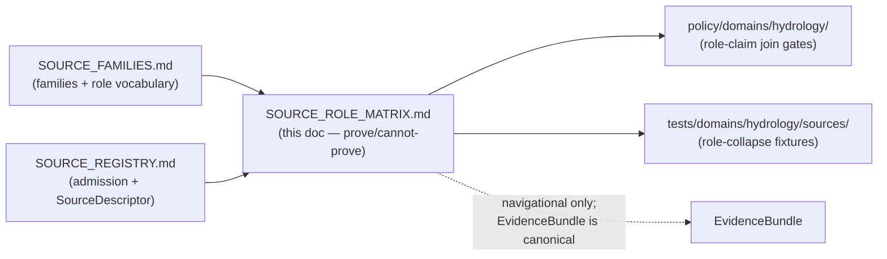
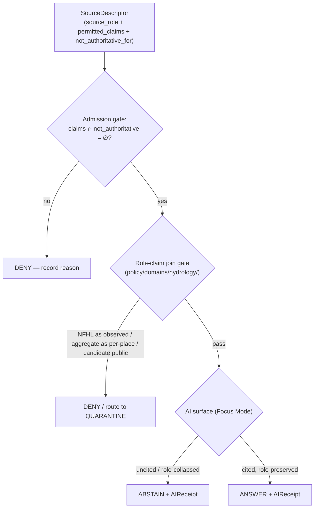

<!-- [KFM_META_BLOCK_V2]
doc_id: kfm://doc/domain-hydrology-source-role-matrix
title: Hydrology — Source-Role Matrix
type: standard
version: v1
status: draft
owners: <hydrology-source-steward> + <domain-steward>   # TODO confirm against CODEOWNERS
created: 2026-06-07
updated: 2026-06-07
policy_label: public
related:
  - ai-build-operating-contract.md
  - directory-rules.md
  - docs/domains/hydrology/README.md
  - docs/domains/hydrology/SOURCE_FAMILIES.md
  - docs/domains/hydrology/SOURCE_REGISTRY.md
  - docs/domains/hydrology/PUBLICATION_POSTURE.md
  - policy/domains/hydrology/
  - schemas/contracts/v1/source/source-descriptor.json
tags: [kfm, hydrology, source-role, matrix, anti-collapse, permitted-claims]
notes:
  - 'CONTRACT_VERSION = "3.0.0"'
  - "Defines what each Hydrology source can and cannot prove (Build Manual per-domain 'Source role matrix' deliverable)."
  - "Source role is a first-class identity attribute, fixed at admission, never upgraded by promotion."
  - "The single most dangerous lane collapse: NFHL regulatory zone cited as observed flood."
[/KFM_META_BLOCK_V2] -->

# 💧 Hydrology — Source-Role Matrix

> What each Hydrology source family is allowed to *prove*, what it is *not authoritative for*, and the role-collapse joins that must DENY. This is the lane's `permitted_claims` ↔ `not_authoritative_for` grid, keyed to the seven canonical source roles.

<!-- Badge targets are placeholders. Replace once the repo is mounted and authoritative URLs are known. -->


| Field | Value |
|---|---|
| **Status** | CONFIRMED doctrine / PROPOSED implementation |
| **Authority** | `docs/` — explanatory. Enforcement lives in `policy/domains/hydrology/` and the validators. |
| **Owners** | `<hydrology-source-steward>` + `<domain-steward>` — *placeholder; confirm in `CODEOWNERS`* |
| **Contract** | `CONTRACT_VERSION = "3.0.0"` (`ai-build-operating-contract.md` v3.0) |
| **Build Manual role** | Per-domain **"Source role matrix — defines what each source can and cannot prove"** deliverable |
| **Last reviewed** | 2026-06-07 |

> [!NOTE]
> This matrix is a **navigational reference**, not authority. The canonical source of any claim is its
> `EvidenceBundle`; the canonical role of any source is its `SourceDescriptor.source_role` in
> `data/registry/sources/hydrology/`. Where this matrix disagrees with the registry, the registry wins
> and this page is a drift entry. [ENCY §24 authority rule]

---

## Mini-TOC

1. [Scope](#1-scope)
2. [Repo fit](#2-repo-fit)
3. [The seven roles in one line](#3-the-seven-roles-in-one-line)
4. [Source-family → role matrix](#4-source-family--role-matrix)
5. [Object-family → required source-role matrix](#5-object-family--required-source-role-matrix)
6. [Prove / cannot-prove grid](#6-prove--cannot-prove-grid)
7. [Anti-collapse DENY conditions](#7-anti-collapse-deny-conditions)
8. [Cross-lane join guard](#8-cross-lane-join-guard)
9. [How the matrix is enforced](#9-how-the-matrix-is-enforced)
10. [What this matrix does NOT do](#10-what-this-matrix-does-not-do)
11. [Verification backlog and open questions](#11-verification-backlog-and-open-questions)
12. [Related docs](#12-related-docs)

---

## 1. Scope

This document is the Hydrology lane's **source-role matrix**: the per-family mapping of *what each source is allowed to prove* and *what it is explicitly not authoritative for*. It operationalizes the Build Manual's per-domain "Source role matrix" deliverable and the Atlas §24.1 Source-Role Anti-Collapse Register, narrowed to Hydrology.

**CONFIRMED doctrine:** Source role is a **first-class identity attribute**. An observed reading is not a modeled estimate; a regulatory determination is not an administrative compilation; an aggregate is not a per-place record; synthetic content is never observed reality. The lifecycle and governed API **fail closed** when roles are conflated. [ENCY §24.1]

**CONFIRMED doctrine:** The role of a source is set at admission (`SourceDescriptor`) and **preserved through every promotion** — promotion never upgrades an observation to a regulation, a model to an aggregate, or a candidate to a verified record. [ENCY §24.1.1]

> [!CAUTION]
> Hydrology appears in **three** of the seven Atlas §24.1.2 anti-collapse failure rows — modeled-as-observed,
> regulatory-as-observed, and (via cross-lane joins) aggregate-as-per-place. The lane's signature failure is
> **NFHL regulatory zone cited as observed flood**, which DENYs at publication and ABSTAINs at the AI surface.

[⬆ Back to top](#-hydrology--source-role-matrix)

---

## 2. Repo fit

```text
docs/domains/hydrology/SOURCE_ROLE_MATRIX.md   ← this doc (the prove/cannot-prove grid)
docs/domains/hydrology/SOURCE_FAMILIES.md       ← family catalog + role vocabulary (sibling)
docs/domains/hydrology/SOURCE_REGISTRY.md       ← admission/authority-control surface (sibling)
data/registry/sources/hydrology/                ← SourceDescriptors (role is set here)        [CONFIRMED pattern §9.1]
policy/domains/hydrology/                        ← OPA gates that enforce this matrix           [PROPOSED]
schemas/contracts/v1/source/source-descriptor.json ← source_role / permitted_claims fields    [PROPOSED, ADR-0001]
tests/domains/hydrology/sources/                 ← role-collapse fixtures and join-guard tests  [PROPOSED]
```



> [!NOTE]
> This matrix sits **between** the family catalog (what sources exist, what roles they may carry) and the
> policy/test layer (what the gates enforce). It is the human-readable bridge; the machine-readable truth is
> `permitted_claims` / `not_authoritative_for` on each `SourceDescriptor`.

[⬆ Back to top](#-hydrology--source-role-matrix)

---

## 3. The seven roles in one line

**CONFIRMED** _([ENCY §24.1.1])._ The canonical vocabulary, with the Hydrology exemplar for each.

| Role | One-line meaning | Hydrology exemplar |
|---|---|---|
| `observed` | Direct reading/measurement tied to place + time | Stream-gauge stage reading |
| `regulatory` | Authoritative determination with legal/administrative force | NFHL flood-zone designation |
| `modeled` | Derived from inputs/assumptions; uncertainty preserved | Hydrograph reconstruction; terrain-derived catchment |
| `aggregate` | Summary over a unit; per-record fidelity lost | HUC-level rollup; weekly drought class by county |
| `administrative` | Agency compilation (registration/accounting) | Water-right roster; allocation summary |
| `candidate` | Awaiting validation/review; not yet authoritative | Quarantined flood-mark from a watcher |
| `synthetic` | Simulation/reconstruction/AI; no first-hand basis | AI-drafted EvidenceBundle summary |

[⬆ Back to top](#-hydrology--source-role-matrix)

---

## 4. Source-family → role matrix

**CONFIRMED families** _([DOM-HYD §D])._ Each family carries one or more canonical roles, assigned **per claim at admission**. ✅ = a role this family commonly carries; ⛔ = a role this family must **never** be admitted under for this lane. Blank = not typical but not forbidden in principle. Per-claim role is what the `SourceDescriptor` records; this grid is the typical-case reading (INFERRED where not stated verbatim in the Atlas).

| Source family | `observed` | `regulatory` | `modeled` | `aggregate` | `administrative` | `candidate` | `synthetic` |
|---|:--:|:--:|:--:|:--:|:--:|:--:|:--:|
| USGS Water Data / NWIS | ✅ | ⛔ | | ✅ (daily stats) | | ✅ (raw intake) | ⛔ |
| USGS WBD / HUC12 | ✅ (boundary) | ⛔ | | ✅ (HUC unit) | | | ⛔ |
| NHDPlus HR / 3DHP | ✅ (network identity) | ⛔ | ✅ (derived flow/catchment) | | | | ⛔ |
| FEMA NFHL / MSC | ⛔ | ✅ | ⛔ | | | | ⛔ |
| 3DEP terrain | ✅ (elevation) | ⛔ | ✅ (hydro-enforced derivative) | | | | ⛔ |
| State water offices (KS) | ✅ | | | ✅ | ✅ (permits/allocations) | | ⛔ |
| Water quality & groundwater | ✅ | | | ✅ | ✅ (well registry) | | ⛔ |
| Historical observed flood evidence | ✅ (historical) | ⛔ | | | | ✅ (unverified marks) | ⛔ |
| Drought / irrigation link sources | | | ✅ | ✅ | | | |

> [!CAUTION]
> The hard ⛔ cells are the lane's role-floor: **NFHL is never `observed` or `modeled`** (it is regulatory), and
> **no Hydrology source family is admitted as `synthetic`** — synthetic carriers (AI summaries, reconstructions)
> are governed-AI / representation artifacts, not admitted sources. Any source admitted as `candidate` must not
> reach a PUBLISHED edge until `merged`.

[⬆ Back to top](#-hydrology--source-role-matrix)

---

## 5. Object-family → required source-role matrix

Which source role(s) a Hydrology **object family** may be built from. ✅ = valid basis; ⛔ = forbidden basis (a DENY if attempted). Object families are CONFIRMED in Atlas §4.E; the role bases below are **INFERRED** from §24.1.1 role definitions applied to each object, PROPOSED until contract-verified.

| Object family | `observed` | `regulatory` | `modeled` | `aggregate` | `administrative` |
|---|:--:|:--:|:--:|:--:|:--:|
| `FlowObservation` | ✅ | ⛔ | ⛔ | | |
| `WaterLevelObservation` | ✅ | ⛔ | ⛔ | | |
| `WaterQualityObservation` | ✅ | | | | |
| `GaugeSite` | ✅ | | | | ✅ (site registry) |
| `Watershed` / `HUCUnit` | ✅ (boundary) | | | ✅ (unit rollup) | |
| `HydroFeature` | ✅ | | ✅ (derived geometry) | | |
| `ReachIdentity` | ✅ | | ✅ (NHD-derived) | | |
| `GroundwaterWell` | ✅ | | | | ✅ (well registry) |
| `NFHLZone` | ⛔ | ✅ | ⛔ | | |
| `Observed Flood Event` | ✅ | ⛔ | ⛔ | | |
| `Hydrograph` | ✅ (observed series) | | ✅ (modeled series — flag it) | | |
| `UpstreamTrace` | | | ✅ (network traversal) | | |

> [!IMPORTANT]
> **`NFHLZone` and `Observed Flood Event` are deliberately mirror-image rows.** `NFHLZone` may be built *only*
> from a `regulatory` source and **never** from `observed`/`modeled`; `Observed Flood Event` may be built *only*
> from `observed` evidence and **never** from a `regulatory` (NFHL) basis. A row that crosses the ⛔ line is the
> canonical Hydrology role-collapse and DENYs. `Hydrograph` is the one object that legitimately spans
> `observed` and `modeled` — it MUST carry a role flag and (when modeled) a `role_model_run_ref`.

[⬆ Back to top](#-hydrology--source-role-matrix)

---

## 6. Prove / cannot-prove grid

**CONFIRMED downstream rules** _([ENCY §24.1.1] "allowed downstream role")._ This is the matrix's core: what each Hydrology source family is authoritative to prove, and what it explicitly is not. These map directly to `SourceDescriptor.permitted_claims` and `.not_authoritative_for`.

| Source family | May prove (`permitted_claims`) | NOT authoritative for (`not_authoritative_for`) |
|---|---|---|
| USGS Water Data / NWIS | `FlowObservation`, `WaterLevelObservation`, `WaterQualityObservation`, `GaugeSite` | `NFHLZone`, regulatory flood determination, emergency alert/forecast authority |
| USGS WBD / HUC12 | `HUCUnit`, `Watershed` boundary geometry | observed flow; floodplain regulation; observed flood extent |
| NHDPlus HR / 3DHP | `ReachIdentity`, network/flow-direction, derived catchment *(modeled)* | gauge observations; current/observed flood extent; regulatory zones |
| FEMA NFHL / MSC | `NFHLZone`, `Flood Context` (regulatory) | `Observed Flood Event`; flood forecast; flow observation; emergency alert |
| 3DEP terrain | elevation surface; terrain-derived hydrology *(modeled)* | observed water level; regulatory zones |
| State water offices (KS) | water use, permits, allocations *(observed/administrative)* | federal regulatory or scientific authority |
| Water quality & groundwater | reported WQ / groundwater measurements *(observed)* | exceedance *regulation* per se; aquifer-boundary regulatory truth |
| Historical observed flood evidence | past `Observed Flood Event` with provenance | future flood prediction; regulatory determination |
| Drought / irrigation link sources | drought-monitor classes; irrigation-use linkage *(context/aggregate)* | per-parcel certainty; per-place observation |

> [!TIP]
> Read each row as a contract: the left column is what a release built on this source may *claim*; the right
> column is what a validator must **DENY** if the release tries to claim it. The `permitted_claims` ∩
> `not_authoritative_for = ∅` rule (no overlap) is an admission-gate check in
> [`SOURCE_REGISTRY.md` §11](./SOURCE_REGISTRY.md#11-validation-gates-proposed).

[⬆ Back to top](#-hydrology--source-role-matrix)

---

## 7. Anti-collapse DENY conditions

**CONFIRMED** _([ENCY §24.1.2])._ The Atlas names seven collapse patterns; the rows below are the ones that fire on the Hydrology lane. Each is fail-closed.

| Collapse pattern | Denied outcome | Required guardrail |
|---|---|---|
| **Modeled product labeled/queried as observed** (reconstructed hydrograph as a reading) | DENY at publication; ABSTAIN at AI | Run receipt + uncertainty surface + role-preserving DTO field |
| **Regulatory zone labeled as observed flood/event** (NFHL as inundation) — *lane signature* | DENY publication of regulatory layer as event evidence | Separate regulatory-layer and observed-event lanes; UI banner |
| **Aggregate cited as per-place truth** (HUC rollup as a site reading) | DENY join from aggregate cell to single record; ABSTAIN at AI | Aggregation receipt; geometry-scope guard |
| **Administrative compilation cited as observation** (water-right roster as event timeline) | DENY publication of compilation as observed event | Source-role tag preserved; named admin types |
| **Candidate exposed on a public surface** (unverified flood-mark) | DENY at trust membrane; route to QUARANTINE | Promotion gate; no PUBLISHED edge to WORK/QUARANTINE |
| **Synthetic content presented as observed reality** (AI summary as evidence) | DENY publication; HOLD for steward review; ABSTAIN at AI | Reality Boundary Note; Representation Receipt; UI badge |

> [!CAUTION]
> Separately from role collapse: **KFM is never an emergency-alert / life-safety authority** on Hydrology
> surfaces. A forecast or warning feed may be admitted as `regulatory`/context with retained role, but it must
> never be rendered or queried as KFM-issued life-safety guidance. [ENCY §20.4 emergency-alert boundary]

[⬆ Back to top](#-hydrology--source-role-matrix)

---

## 8. Cross-lane join guard

**CONFIRMED / PROPOSED** _([Atlas §4.F]; cross-lane join doctrine §24.1.2 + ADR-S-14)._ Joins are where role collapse most often hides. A join is permitted only when **each side preserves its EvidenceBundle, source role, sensitivity, and release state**.

| Join | Role risk | Guard |
|---|---|---|
| Hydrology × Hazards | NFHL (`regulatory`) read as observed flood event | Keep regulatory and observed-event lanes distinct; banner |
| Hydrology × Agriculture | Observed flow used as a yield *input* without modeling | Flow is `observed`; yield linkage is `modeled`/`aggregate` — do not collapse |
| Hydrology × Soil | HUC `aggregate` joined as a per-place soil-moisture reading | Geometry-scope guard; aggregation receipt |
| Hydrology × Settlements/Infrastructure | Reach proximity implying exact dam/levee/intake geometry | Sensitivity review; public-safe generalization |
| Hydrology × Fauna/Flora (aquatic) | HUC join implying a sensitive occurrence location | Species sensitivity tier governs; HUC stays public-safe |

> [!WARNING]
> **Source-role collapse is the most common silent failure** — a modeled value cited as observation, an
> aggregate cited as per-place, an NFHL zone cited as an event — and it is a doctrine violation *even when the
> underlying data are correct*. Cross-lane join policy is ADR-class (ADR-S-14); until ratified, sensitive joins
> fail closed.

[⬆ Back to top](#-hydrology--source-role-matrix)

---

## 9. How the matrix is enforced

**CONFIRMED doctrine / PROPOSED implementation.** This matrix is descriptive; enforcement lives in three places:

1. **Admission gate** — `SourceDescriptor.permitted_claims` and `.not_authoritative_for` are set at admission and validated (no overlap; required `role_*` fields present). [ENCY §24.1.3] [`SOURCE_REGISTRY.md`](./SOURCE_REGISTRY.md)
2. **Role-claim join gate** — policy in `policy/domains/hydrology/` DENYs an NFHL feature joined as `Observed Flood Event`, an NWIS site cited as regulatory authority, an aggregate cell joined as per-place truth, or a candidate on a public surface. *(PROPOSED path.)*
3. **AI surface** — Focus Mode ABSTAINs/DENYs on role-collapsed or uncited claims and emits an `AIReceipt`; AI never relabels a role. [GAI]



[⬆ Back to top](#-hydrology--source-role-matrix)

---

## 10. What this matrix does NOT do

- **Does not** record what a source *says* — that is `EvidenceBundle` territory; this is `permitted_claims`/`not_authoritative_for` only.
- **Does not** override a `SourceDescriptor` — if the registry and this matrix disagree, the registry wins and this becomes a drift entry.
- **Does not** upgrade a role — promotion never turns `modeled` into `observed` or `candidate` into verified.
- **Does not** authorize NFHL as observed flood, or any source as `synthetic`, under any framing.
- **Does not** make KFM an emergency-alert authority.
- **Does not** assert that any specific source is admitted/active in the repo — that is registry state, NEEDS VERIFICATION.

[⬆ Back to top](#-hydrology--source-role-matrix)

---

## 11. Verification backlog and open questions

| ID | Item | Evidence that would settle it | Status |
|---|---|---|---|
| OQ-HYD-SRM-01 | Confirm `permitted_claims` / `not_authoritative_for` field names and the no-overlap admission check. | mounted SourceDescriptor schema + validator | NEEDS VERIFICATION |
| OQ-HYD-SRM-02 | Reconcile §4.D "authority/context" shorthand with the §24.1.1 seven canonical roles. | ADR (ADR-S-04 source-role vocabulary) | OPEN ADR |
| OQ-HYD-SRM-03 | Confirm the §5 object-family → role bases against `contracts/domains/hydrology/`. | mounted contracts | NEEDS VERIFICATION |
| OQ-HYD-SRM-04 | Confirm `policy/domains/hydrology/` is the role-claim join-gate home, and the rules implement §7. | mounted policy + tests | NEEDS VERIFICATION |
| OQ-HYD-SRM-05 | Cross-lane join policy: which joins require steward review, which DENY, which are open. | ADR (ADR-S-14) | OPEN ADR |
| OQ-HYD-SRM-06 | Confirm `Hydrograph` carries a role flag and (when modeled) `role_model_run_ref`. | mounted contracts + fixtures | NEEDS VERIFICATION |
| OQ-HYD-SRM-07 | Confirm the ✅/⛔ family-role cells against `data/registry/sources/hydrology/` descriptors once populated. | mounted registry | NEEDS VERIFICATION |

[⬆ Back to top](#-hydrology--source-role-matrix)

---

## 12. Related docs

- [`docs/domains/hydrology/README.md`](./README.md) — Hydrology domain landing
- [`docs/domains/hydrology/SOURCE_FAMILIES.md`](./SOURCE_FAMILIES.md) — family catalog + role vocabulary
- [`docs/domains/hydrology/SOURCE_REGISTRY.md`](./SOURCE_REGISTRY.md) — admission / authority-control surface
- [`docs/domains/hydrology/PUBLICATION_POSTURE.md`](./PUBLICATION_POSTURE.md) — lane publication posture
- `ai-build-operating-contract.md` — canonical operating contract (`CONTRACT_VERSION = "3.0.0"`)
- `directory-rules.md` — §7.4 schema home; §12 domain placement
- `policy/domains/hydrology/` — role-claim join gates *(PROPOSED)*
- `schemas/contracts/v1/source/source-descriptor.json` — `source_role` / `permitted_claims` fields *(PROPOSED home; ADR-0001)*

---

<sub>**Citation key.** [DOM-HYD] Hydrology domain dossier (KFM Domains Culmination Atlas §4) · [ENCY] KFM Encyclopedia · [DIRRULES] Directory Rules v1.3 · [GAI] Governed AI doctrine · [IMPL-PIPE] Unified Implementation Architecture Build Manual (per-domain "Source role matrix" deliverable).</sub>

---

*Last updated: 2026-06-07 · `CONTRACT_VERSION = "3.0.0"` · status: `draft`* · [⬆ Back to top](#-hydrology--source-role-matrix)
