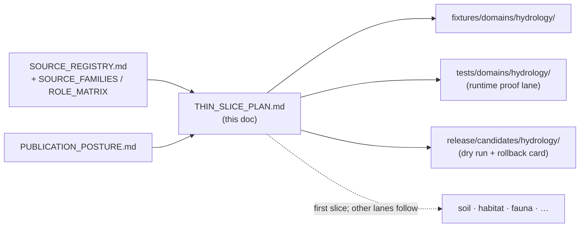
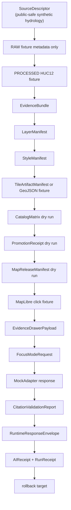
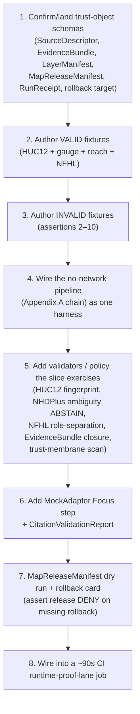

<!-- [KFM_META_BLOCK_V2]
doc_id: kfm://doc/hydrology-thin-slice-plan
title: Hydrology Domain — Thin Slice Plan
type: standard
version: v1
status: draft
owners: <hydrology-domain-steward> + <release-authority>   # PLACEHOLDER — assign before review
created: 2026-06-07
updated: 2026-06-07
policy_label: public
related:
  - ai-build-operating-contract.md
  - directory-rules.md
  - docs/domains/hydrology/README.md
  - docs/domains/hydrology/SOURCE_FAMILIES.md
  - docs/domains/hydrology/SOURCE_ROLE_MATRIX.md
  - docs/domains/hydrology/SOURCE_REGISTRY.md
  - docs/domains/hydrology/PUBLICATION_POSTURE.md
  - docs/domains/hydrology/RELEASE_INDEX.md
tags: [kfm, hydrology, thin-slice, proof-lane, huc12, evidence-bundle, no-network, runtime-proof]
notes:
  - 'CONTRACT_VERSION = "3.0.0"'
  - "Hydrology is the FIRST proof-bearing thin slice (Build Manual §10.2 / Phase 3; roadmap Phase 5) — a public-safe proof, not a sensitive-lane staged build."
  - "No-network fixtures only; no live USGS/FEMA connectors until the slice passes (Phase 9)."
  - "Guardrail: never label NFHL as observed flood."
  - "Canonical filename is THIN_SLICE_PLAN.md (matches the Flora lane); a short-named THIN_SLICE.md from a prior draft is superseded by this file."
[/KFM_META_BLOCK_V2] -->

# 💧 Hydrology Domain — Thin Slice Plan

> The smallest public-safe, no-network slice that proves the full KFM trust path end to end — `SourceDescriptor → EvidenceRef → EvidenceBundle → LayerManifest → MapReleaseManifest → public UI` — exercising one HUC12, one gauge, one NHDPlus crosswalk, and one NFHL regulatory overlay. A thin slice is a **proof, not a product**: it demonstrates the spine works before the lane broadens.

<!-- Badge targets are placeholders. Replace with real Shields.io endpoints (CI, last-updated) once wired. -->

[](#)
[](#)
[](#)
[](#)
[-2e7d32 "No live connectors until the slice passes")](#)
[](#)
[](#)

| Field | Value |
|---|---|
| **Status** | `draft` — PROPOSED plan / CONFIRMED doctrine |
| **Owners** | `<hydrology-domain-steward>` · `<release-authority>` *(PLACEHOLDER — assign before review)* |
| **Updated** | 2026-06-07 |
| **Lane** | Hydrology `[DOM-HYD]` — **public-safe lane**, geometry generally publishable with role/time citation |
| **Build position** | First domain proof slice (Build Manual §10.2 / Phase 3; roadmap Phase 5) — the spine other lanes depend on |
| **Authority** | `ai-build-operating-contract.md` v3.0 · `directory-rules.md` |

> [!IMPORTANT]
> Every path, fixture name, and route here is **PROPOSED / NEEDS VERIFICATION** until the repo is mounted.
> The *doctrine* (proof-first, no-network-first, the canonical pipeline, the finite outcomes, the guardrails)
> is **CONFIRMED**; the *implementation* is not.

---

## Contents

1. [Why a thin slice](#1-why-a-thin-slice)
2. [Repo fit](#2-repo-fit)
3. [The slice in one sentence](#3-the-slice-in-one-sentence)
4. [The canonical no-network pipeline](#4-the-canonical-no-network-pipeline)
5. [Deliverables](#5-deliverables)
6. [The acceptance assertions](#6-the-acceptance-assertions)
7. [Fixture set](#7-fixture-set)
8. [Build order](#8-build-order)
9. [Exit criteria](#9-exit-criteria)
10. [Guardrails and out-of-scope](#10-guardrails-and-out-of-scope)
11. [Rollback posture](#11-rollback-posture)
12. [Verification backlog and open questions](#12-verification-backlog-and-open-questions)
13. [Related docs](#13-related-docs)

---

## 1. Why a thin slice

**CONFIRMED doctrine.** The coherent KFM build sequence is **not** "build the UI" or "turn on AI" — it is **proof-first**: prove the trust spine with the smallest public-safe slice, then expand by lane. [IMPL-PIPE §10 / §23] Hydrology is the **first proof-lane candidate** because it exercises every governance primitive — source intake, geometry identity, observations, regulatory-vs-observed separation, catalog closure, map artifacts, Evidence Drawer, and rollback — in one coherent slice. [Atlas `KFM-P1-IDEA-0070`]

**CONFIRMED doctrine (runtime-proof-lane methodology).** A thin slice picks **one domain and one representative query**, instruments the entire path from `EvidenceBundle` admission through validator outcome through `DecisionEnvelope` emission, and asserts at each stage that the artifact has the expected **shape** and the expected **severity**. It is deliberately narrow — the goal is to prove the runtime stack works end to end, not to test exhaustively. The thin slice is what makes the proof cheap enough to keep running: a ~90-second CI job on a fixed bundle is a tractable continuous check. A runtime proof lane is **cross-component by construction** — the smallest integration that can detect a doctrinal regression. [Atlas `KFM-P6-IDEA-0001`]

> [!NOTE]
> **CONFIRMED tension.** Thin slices catch regressions well but catch first-time bugs poorly in domains they
> do not exercise; the corpus recommends *multiple* thin slices over one thick one. Hydrology is the first,
> not the only. Unlike the sensitive lanes (Flora, Fauna, Archaeology, People), Hydrology is a **public-safe**
> slice — its proof does not need to exercise the deny-by-default redaction path as its core (though it still
> tests sensitive-geometry DENY as a negative case).

[⬆ Back to top](#-hydrology-domain--thin-slice-plan)

---

## 2. Repo fit

```text
docs/domains/hydrology/THIN_SLICE_PLAN.md          ← this plan (CONFIRMED docs home, §12)
fixtures/domains/hydrology/                          ← valid + invalid no-network fixtures            [PROPOSED]
schemas/contracts/v1/source/source-descriptor.json   ← SourceDescriptor shape                         [PROPOSED, ADR-0001]
schemas/contracts/v1/proofs/run_receipt.schema.json  ← RunReceipt shape                               [CONFIRMED home per MAP-MASTER]
schemas/contracts/v1/release/rollback_target.schema.json ← rollback target shape                      [CONFIRMED home per MAP-MASTER]
tests/domains/hydrology/                             ← the runtime-proof-lane test(s)                 [PROPOSED]
data/processed/hydrology/                            ← the processed HUC12 fixture (no live fetch)    [CONFIRMED phase, §9.1]
data/proofs/evidence_bundle/                         ← EvidenceBundle closure object                  [PROPOSED leaf]
data/published/layers/hydrology/                     ← released fixture layer (dry run)               [CONFIRMED pattern, §9.1]
release/candidates/hydrology/                        ← release dry-run dossier + rollback card        [CONFIRMED dir, §9.2]
apps/governed-api/                                   ← evidence resolver + finite envelope            [PROPOSED]
apps/explorer-web/                                   ← MapLibre shell + Evidence Drawer (downstream)  [CONFIRMED shell, §11]
```



> [!NOTE]
> The slice spans many responsibility roots — that is the point: a runtime proof lane is cross-component.
> The `release/` and `data/` top-level layouts are CONFIRMED (Directory Rules §9.1–§9.2); the `hydrology`
> segments and specific fixture files are PROPOSED.

[⬆ Back to top](#-hydrology-domain--thin-slice-plan)

---

## 3. The slice in one sentence

**PROPOSED first credible slice** _([IMPL-PIPE §10.2], [Atlas roadmap Phase 5])._

> One Kansas **HUC12** public-safe fixture + **`SourceDescriptor`** + one **USGS gauge** fixture + one **NHDPlus identity crosswalk** + **NFHL contextual overlay** + **hydrograph panel** + **`EvidenceBundle` closure** + **`LayerManifest` / `MapReleaseManifest` dry run** + a click that resolves to an **Evidence Drawer payload** + a **finite Focus-Mode outcome** + a **rollback card** — and **ABSTAIN** on ambiguous reach identity.

The Build Manual states the first slice tersely: *"HUC12 public-safe fixture + SourceDescriptor + EvidenceBundle + LayerManifest + MapReleaseManifest dry run."* [IMPL-PIPE §10.2] Everything else above is the supporting cast that makes the click → drawer → Focus path testable.

> [!TIP]
> **County frame is a planning placeholder.** A specific Kansas HUC12 (e.g., in the Smoky Hill or Ellsworth-area
> watershed) may anchor the fixture, but the exact unit is a steward choice (OQ-HYD-TS-08), not asserted here.

[⬆ Back to top](#-hydrology-domain--thin-slice-plan)

---

## 4. The canonical no-network pipeline

**CONFIRMED doctrine** _([IMPL-PIPE Appendix A] "Minimal no-network proof slice")._ This is the exact end-to-end chain the slice instruments. No live connectors anywhere in it.



> [!TIP]
> The slice uses a **MockAdapter**, not a live model — governed-AI doctrine is "MockAdapter-first" (ADR-0010).
> The slice proves the *envelope and citation discipline*, not model quality. A live connector is Phase 9,
> long after this slice passes.

[⬆ Back to top](#-hydrology-domain--thin-slice-plan)

---

## 5. Deliverables

**CONFIRMED deliverable set** _([IMPL-PIPE Phase 3 "First domain proof slice"])._ For the hydrology slice, deliver:

| # | Deliverable | Role in the slice | Status |
|---|---|---|---|
| 1 | Domain README and architecture | Orientation + lane fit | partly done (see [`README.md`](./README.md)) |
| 2 | `SourceDescriptor` (public-safe synthetic hydrology) | Admission record; sets `source_role` | PROPOSED |
| 3 | Processed HUC12 fixture | The one public-safe geometry | PROPOSED |
| 4 | `EvidenceBundle` | Evidence closure for every claim | PROPOSED |
| 5 | `LayerManifest` | Public layer identity + evidence + time + trust badges | PROPOSED |
| 6 | `StyleManifest` | Style identity + hashes + accessibility | PROPOSED |
| 7 | `TileArtifactManifest` **or** GeoJSON fixture | The renderable artifact | PROPOSED |
| 8 | `MapReleaseManifest` dry run | Release decision for the map layer (no real publish) | PROPOSED |

Supporting (from the Appendix A chain): `CatalogMatrix` dry run, `PromotionReceipt` dry run, `EvidenceDrawerPayload`, `FocusModeRequest` + MockAdapter response, `CitationValidationReport`, `RuntimeResponseEnvelope`, `AIReceipt` + `RunReceipt`, and a **rollback target**. [IMPL-PIPE Appendix A]

> [!IMPORTANT]
> A release dry run with **no rollback target** does not pass. Missing `MapReleaseManifest` or rollback target
> is a release-queue anti-pattern — the surface cannot be rolled back and the release is not auditable. [ENCY §24.9.2]

[⬆ Back to top](#-hydrology-domain--thin-slice-plan)

---

## 6. The acceptance assertions

**CONFIRMED expected tests** _([IMPL-PIPE Appendix A])._ The slice is proven when these finite outcomes all hold on the fixture set. Outcomes are from the CONFIRMED envelope vocabulary (`ANSWER / ABSTAIN / DENY / ERROR`, plus `HOLD / PASS / FAIL` at gates). [ENCY §24.3]

| # | Assertion | Expected outcome | What it proves |
|---|---|---|---|
| 1 | Valid public-safe HUC12 fixture, evidence closed | `ANSWER` | Happy path resolves with citation + drawer |
| 2 | Missing `EvidenceBundle` | `ABSTAIN` | Cite-or-abstain: no evidence → no claim |
| 3 | Sensitive exact geometry | `DENY` | Sensitivity fail-closed |
| 4 | Unknown rights | `DENY` | Rights fail-closed |
| 5 | Policy engine unavailable | `ERROR` | Finite, actionable error; no silent fall-through |
| 6 | Release with missing rollback target | `DENY` (release) | No un-rollback-able public surface |
| 7 | UI attempts a direct model call | `DENY` | Trust membrane: no direct browser→model path |
| 8 | Public surface attempts a raw path | `DENY` | Trust membrane: no public RAW/WORK/QUARANTINE read |

Plus the lane-specific assertions the Build Manual thin-slice line and the anti-collapse register imply:

| 9 | Ambiguous reach identity (multi-COMID match) | `ABSTAIN` | NHDPlus identity ambiguity does not silently collapse |
| 10 | NFHL feature cited as `Observed Flood Event` | `DENY` | Regulatory-vs-observed anti-collapse [ENCY §24.1.2] |

> [!NOTE]
> Assertions 1–8 are the CONFIRMED Appendix A test set verbatim. Assertions 9–10 are **INFERRED** lane
> specializations grounded in the Build Manual first-slice line ("ABSTAIN on ambiguous reach identity") and the
> §24.1.2 anti-collapse register; they are PROPOSED until the fixtures exist.

[⬆ Back to top](#-hydrology-domain--thin-slice-plan)

---

## 7. Fixture set

**PROPOSED fixture catalog** (illustrative; deterministic, side-effect-free, no network). Mirrors the negative-fixture discipline: validators must exercise `DENY` / `ABSTAIN` / `ERROR` paths, not only the happy case. [Atlas `KFM-P1-PROG-0024`]

```text
fixtures/domains/hydrology/
├── valid/
│   ├── huc12_kansas_public_safe.json        → ANSWER (assertion 1)
│   ├── usgs_gauge_obs_window.json           → supports the hydrograph panel
│   ├── nhdplus_reach_identity.json          → ReachIdentity (single COMID)
│   └── nfhl_zone_context.json               → regulatory overlay (role-tagged)
└── invalid/
    ├── missing_evidence_bundle.json         → ABSTAIN (assertion 2)
    ├── sensitive_exact_geometry.json        → DENY    (assertion 3)
    ├── unknown_rights.json                  → DENY    (assertion 4)
    ├── policy_engine_unavailable.json       → ERROR   (assertion 5)
    ├── release_missing_rollback.json        → DENY    (assertion 6)
    ├── ui_direct_model_call.json            → DENY    (assertion 7)
    ├── public_raw_path.json                 → DENY    (assertion 8)
    ├── ambiguous_reach_identity.json        → ABSTAIN (assertion 9)
    └── nfhl_as_observed_event.json          → DENY    (assertion 10)
```

> [!CAUTION]
> Fixture filenames are **illustrative**, not Atlas-sourced. The fixture *behaviors* (the right-hand outcomes)
> are CONFIRMED for assertions 1–8 and INFERRED for 9–10.

[⬆ Back to top](#-hydrology-domain--thin-slice-plan)

---

## 8. Build order

**PROPOSED order**, mirroring KFM proof-first discipline (schemas → fixtures → validators → negative-path tests → policy → proof → release dry run). No live fetch until the slice passes (Phase 9). [IMPL-PIPE Phases 2–3, 8; Atlas `KFM-P1-PROG-0024` no-network-fixture-first]



[⬆ Back to top](#-hydrology-domain--thin-slice-plan)

---

## 9. Exit criteria

**CONFIRMED exit criteria** _([IMPL-PIPE §10 Phase 5 / Phase 3])._ The slice is done when:

- **E2E:** click feature → governed resolution → Evidence Drawer payload → finite Focus response → receipt is testable. [IMPL-PIPE Phase 3]
- All **ten assertions** in [§6](#6-the-acceptance-assertions) hold (eight CONFIRMED + two lane-specific).
- **No live connectors** are required — the entire chain runs on fixtures. [Atlas `KFM-P1-PROG-0024`]
- The `MapReleaseManifest` dry run can **publish dry-run and roll back dry-run**. [IMPL-PIPE Phase 8]
- The runtime-proof-lane harness runs as a **continuous (~90s) CI check** and fails the build on any shape/severity drift. [Atlas `KFM-P6-IDEA-0001`]
- **Phase-5 rollback posture honored:** the slice **never labels NFHL as observed flood**. [Atlas roadmap Phase 5]

[⬆ Back to top](#-hydrology-domain--thin-slice-plan)

---

## 10. Guardrails and out-of-scope

> [!CAUTION]
> **Hard guardrails for this slice:**
> - **No live connectors.** USGS Water, WBD, NHDPlus HR, FEMA NFHL, and 3DEP stay un-activated until the slice passes and rights/endpoints are verified (Phase 9). [Atlas `KFM-P1-PROG-0024`]
> - **NFHL is regulatory context, never observed flood** and never an emergency/life-safety surface. [DOM-HYD] [ENCY §20.4]
> - **No public raw path; no direct UI→model call.** The governed API is the only route to `ANSWER`. [GAI]
> - **No real publication.** Every release step is a *dry run*; `data/published/layers/hydrology/` holds only the fixture layer.

**Out of scope for the thin slice** (deferred to later phases):

- Live source connectors and watchers (Phase 9).
- Catalog federation / STAC-DCAT-PROV closure beyond the dry-run `CatalogMatrix` (Phase 4).
- Frontier-Matrix panels and cross-lane joins (Phase 9+).
- Additional hydrology objects beyond the slice (full water quality, groundwater, drought/irrigation links).

[⬆ Back to top](#-hydrology-domain--thin-slice-plan)

---

## 11. Rollback posture

**CONFIRMED doctrine / PROPOSED realization.** Because the slice never publishes for real, rollback is itself part of the *proof*:

- The `MapReleaseManifest` dry run MUST name a **rollback target** (`release_id`, prior-state reference, artifact digests, correction-notice slot) before the release step is treated as passing. [IMPL-PIPE Phase 8] [ENCY §24.6.1]
- Assertion 6 asserts that a release **missing** a rollback target DENYs — i.e. the slice proves the rollback gate works, not just that it exists.
- Reverting the slice is mechanical: remove the fixture layer from `data/published/layers/hydrology/`, retract the dry-run `MapReleaseManifest`, and preserve the rollback card and any `CorrectionNotice` in `release/`. No prior public state exists to restore (this is the first slice), so the rollback target points to the empty/pre-release baseline.

> [!NOTE]
> A correction (`PUBLISHED → PUBLISHED'`) is out of scope for the first slice since there is no prior release;
> the slice proves the *mechanism* (rollback card present, DENY on missing target), not a real correction event.

[⬆ Back to top](#-hydrology-domain--thin-slice-plan)

---

## 12. Verification backlog and open questions

| ID | Item | Evidence that would settle it | Status |
|---|---|---|---|
| OQ-HYD-TS-01 | Which exact hydrology fixture proves `EvidenceRef → EvidenceBundle → MapRelease` end to end? | mounted fixtures + harness | NEEDS VERIFICATION (Atlas `KFM-P1-IDEA-0070` open Q) |
| OQ-HYD-TS-02 | Confirm trust-object schema homes (`SourceDescriptor`, `EvidenceBundle`, `LayerManifest`, `MapReleaseManifest`). | mounted schemas + ADR-0001 | NEEDS VERIFICATION |
| OQ-HYD-TS-03 | Confirm the runtime-proof-lane harness location and the ~90s CI wiring. | mounted CI workflow + test dir | NEEDS VERIFICATION |
| OQ-HYD-TS-04 | Validator exit-code → finite-outcome mapping for the assertions. | ADR (OPEN-DR-03) | OPEN ADR |
| OQ-HYD-TS-05 | NHDPlus version lock for the reach-identity fixture (HR vs 3DHP). | SourceDescriptor + crosswalk validator | NEEDS VERIFICATION |
| OQ-HYD-TS-06 | Confirm `MockAdapter` contract and `AIReceipt` shape for the Focus-Mode step. | mounted governed-AI contracts (ADR-0010) | NEEDS VERIFICATION |
| OQ-HYD-TS-07 | Confirm assertions 9–10 (reach-ABSTAIN, NFHL-DENY) as fixtures, not just doctrine. | mounted fixtures + tests | PROPOSED |
| OQ-HYD-TS-08 | Which Kansas HUC12 anchors the fixture? | steward decision | PROPOSED |
| OQ-HYD-TS-09 | Supersede the short-named `THIN_SLICE.md` in favor of this `THIN_SLICE_PLAN.md`. | docs-steward review + DRIFT_REGISTER entry | NEEDS VERIFICATION |

[⬆ Back to top](#-hydrology-domain--thin-slice-plan)

---

## 13. Related docs

- [`docs/domains/hydrology/README.md`](./README.md) — Hydrology domain landing
- [`docs/domains/hydrology/SOURCE_FAMILIES.md`](./SOURCE_FAMILIES.md) — source families + role vocabulary
- [`docs/domains/hydrology/SOURCE_ROLE_MATRIX.md`](./SOURCE_ROLE_MATRIX.md) — prove / cannot-prove grid
- [`docs/domains/hydrology/SOURCE_REGISTRY.md`](./SOURCE_REGISTRY.md) — admission / authority control
- [`docs/domains/hydrology/PUBLICATION_POSTURE.md`](./PUBLICATION_POSTURE.md) — lane publication posture
- [`docs/domains/hydrology/RELEASE_INDEX.md`](./RELEASE_INDEX.md) — governed release index
- `ai-build-operating-contract.md` — canonical operating contract (`CONTRACT_VERSION = "3.0.0"`)
- `directory-rules.md` — §9.1 lifecycle/registry, §9.2 `release/`, §12 domain placement
- `KFM_Unified_Implementation_Architecture_Build_Manual` — §10.2 Hydrology, Phase 3, Appendix A no-network proof slice

---

<sub>**Citation key.** [DOM-HYD] Hydrology domain dossier (KFM Domains Culmination Atlas §4) · [ENCY] KFM Encyclopedia · [DIRRULES] Directory Rules v1.3 · [GAI] Governed AI doctrine · [IMPL-PIPE] Unified Implementation Architecture Build Manual · [MAP-MASTER] Master MapLibre Components-Functions-Features · `KFM-P1-IDEA-0070` hydrology proof lane · `KFM-P1-PROG-0024` no-network fixture-first · `KFM-P6-IDEA-0001` runtime-proof-lane thin-slice playbook.</sub>

---

*Last updated: 2026-06-07 · `CONTRACT_VERSION = "3.0.0"` · status: `draft`* · [⬆ Back to top](#-hydrology-domain--thin-slice-plan)
