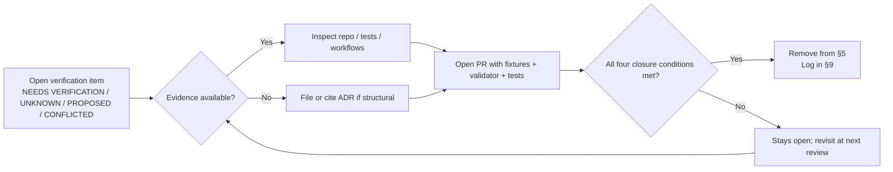

<!-- [KFM_META_BLOCK_V2]
doc_id: kfm://doc/domains/hydrology/verification-backlog
title: Hydrology — Verification Backlog
type: standard
subtype: register
version: v2
status: draft
owners: <hydrology-domain-steward — TODO>; <release-authority — TODO>; <policy-admin — TODO>
created: 2026-05-18
updated: 2026-06-07
policy_label: public
related:
  - ai-build-operating-contract.md
  - directory-rules.md
  - docs/domains/hydrology/README.md
  - docs/domains/hydrology/SOURCE_FAMILIES.md
  - docs/domains/hydrology/SOURCE_ROLE_MATRIX.md
  - docs/domains/hydrology/SOURCE_REGISTRY.md
  - docs/domains/hydrology/PUBLICATION_POSTURE.md
  - docs/domains/hydrology/RELEASE_INDEX.md
  - docs/domains/hydrology/THIN_SLICE_PLAN.md
  - docs/registers/VERIFICATION_BACKLOG.md
  - docs/registers/DRIFT_REGISTER.md
tags: [kfm, hydrology, register, verification, governance, backlog]
notes:
  - 'CONTRACT_VERSION = "3.0.0"'
  - "Domain-scoped backlog; rolls up into docs/registers/VERIFICATION_BACKLOG.md."
  - "All implementation-layer claims are PROPOSED until the repo is mounted and inspected."
  - "Cite-or-abstain applies; this file MUST NOT be cited as proof of implementation."
  - "Schema-home rule is ADR-0001 / Directory Rules §7.4 + §6.4 (not §13.1, which is an anti-pattern section)."
[/KFM_META_BLOCK_V2] -->

# Hydrology — Verification Backlog

Working register of unresolved and checkable items inside the hydrology domain lane. CONFIRMED doctrine, PROPOSED implementation. This is a backlog, not a release artifact.

> **Status:** draft &middot; **Owners:** `<hydrology-domain-steward — TODO>` &middot; **Last reviewed:** `2026-06-07` &middot; **Contract:** `CONTRACT_VERSION = "3.0.0"`

> [!NOTE]
> This register tracks **what would need to be true** for hydrology claims to advance through `RAW → WORK/QUARANTINE → PROCESSED → CATALOG/TRIPLET → PUBLISHED`. It records open verification items, not decisions. Decisions live in ADRs; receipts and proofs live in `data/receipts/` and `data/proofs/`. This page is a working list, not authority.

---

## Quick jump

- [1. Purpose & scope](#1-purpose--scope)
- [2. How to use this register](#2-how-to-use-this-register)
- [3. Verification-flow diagram](#3-verification-flow-diagram)
- [4. Status legend & priority scale](#4-status-legend--priority-scale)
- [5. Verification items](#5-verification-items)
  - [5.1 Source rights, terms, and freshness](#51-source-rights-terms-and-freshness)
  - [5.2 Identity, geometry, and crosswalk](#52-identity-geometry-and-crosswalk)
  - [5.3 Source-role separation](#53-source-role-separation)
  - [5.4 Catalog and proof closure](#54-catalog-and-proof-closure)
  - [5.5 Schema home and contracts](#55-schema-home-and-contracts)
  - [5.6 Policy, sensitivity, and life-safety boundary](#56-policy-sensitivity-and-life-safety-boundary)
  - [5.7 Governed API and renderer boundary](#57-governed-api-and-renderer-boundary)
  - [5.8 CI, validators, and rollback](#58-ci-validators-and-rollback)
  - [5.9 Watchers and delta detection](#59-watchers-and-delta-detection)
- [6. Negative fixtures expected (reference set)](#6-negative-fixtures-expected-reference-set)
- [7. Resolution paths](#7-resolution-paths)
- [8. Cross-references](#8-cross-references)
- [9. Change log](#9-change-log)

---

## 1. Purpose & scope

### Purpose

This file is the **hydrology lane's open-verification register**. It enumerates items that are `NEEDS VERIFICATION`, `UNKNOWN`, or `PROPOSED` for the hydrology domain, the evidence that would settle each, and which downstream gate or invariant the item unblocks. It feeds the global `docs/registers/VERIFICATION_BACKLOG.md` and is consumed by hydrology PRs as a checklist of "what's still open."

### What this register tracks

- Verification items specific to the **hydrology** lane (watersheds, HUC units, hydro features, reaches, gauges, flow/level observations, water quality, groundwater context, NFHL regulatory flood context, observed flood evidence). [CONFIRMED doctrine] [DOM-HYD] [ENCY]
- The evidence each item needs to be closed.
- The lifecycle gate, invariant, or release surface each item unblocks.

### What this register does **not** track

| Out of scope here | Lives in |
|---|---|
| Cross-domain backlog (non-hydrology) | `docs/registers/VERIFICATION_BACKLOG.md` |
| Cross-cutting doctrine drift | `docs/registers/DRIFT_REGISTER.md` |
| Final authority decisions | `docs/adr/` |
| Per-source rights, terms, cadence | `data/registry/sources/hydrology/` (CONFIRMED pattern §9.1; leaf NEEDS VERIFICATION) |
| Emitted run/release receipts | `data/receipts/`, `data/proofs/`, `release/` |
| Operational steps | `docs/runbooks/hydrology/` (PROPOSED) |

> [!IMPORTANT]
> This register is **not** the source of truth for whether something is implemented. The repository, its tests, workflows, and emitted receipts are. When this register and the repository disagree, the repository wins and a `DRIFT_REGISTER` entry is filed.

[Back to top](#hydrology--verification-backlog)

---

## 2. How to use this register

### Adding an item

1. Confirm the item is **hydrology-scoped**. Cross-domain items belong in the global backlog.
2. Pick the smallest narrowing of the claim that would settle it. "Verify hydrology" is too broad; "Verify `ReachIdentity` stability across NHDPlus refreshes" is the right size.
3. Assign one of: `NEEDS VERIFICATION`, `UNKNOWN`, `PROPOSED`, `CONFLICTED`. Never `CONFIRMED` (closed items are removed, not labeled closed).
4. State the evidence that would settle it (a file, a test, a manifest, a receipt, a workflow run, an ADR).
5. Link the gate, invariant, or release surface it unblocks.
6. Open a PR; reviewers check the placement and the resolution path.

### Closing an item

An item closes only when **all four** are present:

1. The named evidence is actually mounted or produced.
2. A reviewer with the relevant role has confirmed it.
3. Either an ADR or a PR (or both, for structural changes) carries the resolution.
4. Any released artifact that depended on the item has been re-validated.

When an item closes, remove it from §5 and add a one-line entry to §9 (Change log). IDs are stable; do not renumber on remove — leave gaps.

> [!TIP]
> If an item turns out to be unanswerable without an ADR, escalate it: file (or cite the existing) ADR, link it here, and keep the item open until the ADR is `accepted`.

[Back to top](#hydrology--verification-backlog)

---

## 3. Verification-flow diagram

> [!NOTE]
> **PROPOSED.** The diagram describes the intended workflow. Actual closure mechanics depend on repo conventions, CODEOWNERS, and ADR practice that are `NEEDS VERIFICATION` until the repository is mounted and inspected.

[Back to top](#hydrology--verification-backlog)

---

## 4. Status legend & priority scale

### Status labels (KFM truth posture)

| Label | Meaning |
|---|---|
| `CONFIRMED` | Verified this session from attached doctrine, repo evidence, tests, or receipts. Closed items are removed, not labeled `CONFIRMED` here. |
| `INFERRED` | Reasonably derivable from visible evidence but not directly stated. |
| `PROPOSED` | A design, path, or placement not yet verified in implementation. |
| `UNKNOWN` | Not resolvable without more evidence. |
| `NEEDS VERIFICATION` | Checkable, but not yet checked strongly enough to act as fact. |
| `CONFLICTED` | Sources disagree (e.g., doctrine vs. Atlas crosswalk), or doctrine and implementation appear inconsistent. Held until an ADR or drift entry resolves it. |
| `EXTERNAL` | Sourced from authoritative external research; never applies to KFM-internal claims. |

Defined in the KFM truth posture; see `ai-build-operating-contract.md` §8 and `directory-rules.md`. [CONFIRMED]

### Priority scale

| Priority | Meaning |
|---|---|
| **P0** | Blocks the first hydrology proof slice (the `THIN_SLICE_PLAN`: HUC12 + gauge + NHDPlus crosswalk + NFHL overlay + `EvidenceBundle` closure + drawer + finite Focus outcome + rollback). [IMPL-PIPE §10.2; ENCY] |
| **P1** | Blocks publication of any hydrology layer or correction-bearing artifact. |
| **P2** | Important for lane health but does not block first publication. |
| **P3** | Hygiene, documentation, or future-proofing. |

[Back to top](#hydrology--verification-backlog)

---

## 5. Verification items

> [!NOTE]
> Every "Affects / unblocks" column links to a downstream gate or invariant that the item gates. IDs are stable within the hydrology lane; do not renumber on remove — leave gaps.

### 5.1 Source rights, terms, and freshness

| ID | Item | Evidence that would settle it | Status | Priority | Affects / unblocks |
|---|---|---|---|---|---|
| `HYD-VB-001` | Verify USGS WBD / HUC12 rights, license, and current terms. | `data/registry/sources/hydrology/wbd.source.yaml` (PROPOSED) with license, terms-of-use URL, cadence, and last-checked date. | NEEDS VERIFICATION | P0 | `SourceDescriptor` admission; RAW lane gate. |
| `HYD-VB-002` | Verify NHDPlus HR / 3DHP-oriented hydrography rights and terms. | `data/registry/sources/hydrology/nhdplus_hr.source.yaml` (PROPOSED). | NEEDS VERIFICATION | P0 | Crosswalk admission (§5.2). |
| `HYD-VB-003` | Verify USGS Water Data API current endpoint and terms; confirm whether any legacy-endpoint phase-out window applies. | Current USGS Water Data API documentation; cutover (if any) captured in the source descriptor. **Note:** the corpus records that USGS APIs "occasionally restructure" and that watchers MUST track API versions, but states **no specific dated phase-out**; any "2026/2027" figure is unverified and EXTERNAL. Pin clients to a recorded API version regardless. | NEEDS VERIFICATION | P0 | Observation normalization (§5.3); endpoint stability. |
| `HYD-VB-004` | Verify FEMA NFHL / MSC rights and the strict requirement that NFHL stays **regulatory context**, not observed inundation. | Source descriptor + policy fixture asserting the role distinction; release-time validation refuses any release that collapses the two. | NEEDS VERIFICATION | P0 | Source-role anti-collapse invariant (§5.3). |
| `HYD-VB-005` | Verify 3DEP terrain rights and terrain-derived hydrology context handling (derivatives are `modeled`). | Source descriptor; documented derivative posture; `role_model_run_ref` on derived products. | NEEDS VERIFICATION | P1 | Terrain-derived hydrology layer publication. |
| `HYD-VB-006` | Verify state water office / KGS / groundwater well source rights and cadence (WIMAS/WRIS, WWC5, WIZARD as instances). | Per-source descriptors under `data/registry/sources/hydrology/` (PROPOSED). | NEEDS VERIFICATION | P2 | `Groundwater Well` family release. |
| `HYD-VB-007` | Verify water-quality program rights. | Source descriptor + redaction posture for sensitive joins. | NEEDS VERIFICATION | P2 | `Water Quality Observation` release. |
| `HYD-VB-008` | Verify historical observed-flood evidence rights and provenance posture. | Source descriptor + review record for historical sources. | NEEDS VERIFICATION | P2 | `Observed Flood Event` release. |
| `HYD-VB-009` | Verify the `EXT-*` source-ledger identifiers used in lane docs are real ledger entries (the project corpus currently defines none). | Source-ledger entry creation + ADR. | NEEDS VERIFICATION | P2 | Source-descriptor naming consistency. |

### 5.2 Identity, geometry, and crosswalk

| ID | Item | Evidence that would settle it | Status | Priority | Affects / unblocks |
|---|---|---|---|---|---|
| `HYD-VB-010` | Verify the Kansas HUC12 fixture exists, validates, and carries `geometry_valid` + canonical digest. | A passing `tests/domains/hydrology/` fixture under `fixtures/domains/hydrology/valid/` (PROPOSED). | NEEDS VERIFICATION | P0 | Thin-slice assertion 1. [IMPL-PIPE App. A] |
| `HYD-VB-011` | Verify COMID ↔ HUC12 crosswalk handling, including `ABSTAIN` on ambiguous reach identity. | Crosswalk validator + valid/invalid fixtures + `decision_reason` enumeration *(decision-reason tokens are PROPOSED/illustrative)*. | NEEDS VERIFICATION | P0 | Thin-slice assertion 9; ABSTAIN is the documented finite outcome. |
| `HYD-VB-012` | Verify NHDPlus version-drift handling (`v2.1` vs `HR`) is not silently mixed. | Manifest fields `nhdplus_version` and `wbd_snapshot` present and validator-enforced. | NEEDS VERIFICATION | P1 | Crosswalk reproducibility. |
| `HYD-VB-013` | Verify WBD snapshot lineage is carried on every crosswalk row. | Validator gate failing on missing `wbd_snapshot`. | NEEDS VERIFICATION | P1 | Cross-snapshot reproducibility. |
| `HYD-VB-014` | Verify `ReachIdentity` stability across upstream refreshes. | Identity rule test: same `source_id + object_role + temporal_scope + normalized_digest` → same identity. | NEEDS VERIFICATION | P1 | Identity invariant; promotion across refreshes. |
| `HYD-VB-015` | Define and verify the geometry-fingerprint canonicalization rule for hydrology geometries. | A documented canonicalization rule; validator coverage; cross-lane parity with Spatial Foundation. *(Canonicalization method, e.g. a canonical-JSON or WKB digest, is PROPOSED.)* | UNKNOWN | P1 | Cross-domain geometry comparison. |
| `HYD-VB-016` | Verify `coverage_scope` enforcement (e.g., CONUS vs non-CONUS) for the crosswalk validator. | Validator gate failing closed outside declared support. | NEEDS VERIFICATION | P2 | Out-of-scope publication denial. |
| `HYD-VB-017` | Verify multi-HUC candidate handling for coastal / braided systems. | Schema field + validator test. | NEEDS VERIFICATION | P2 | Edge-case correctness. |

### 5.3 Source-role separation

> [!IMPORTANT]
> The hydrology lane **MUST NOT** collapse: (a) NFHL regulatory flood zones, (b) observed inundation, (c) forecasts, and (d) emergency warnings into one truth class. This is a core doctrine constraint and a publication gate. [CONFIRMED] [DOM-HYD] [ENCY §24.1.2] — see [`SOURCE_ROLE_MATRIX.md`](./SOURCE_ROLE_MATRIX.md).

| ID | Item | Evidence that would settle it | Status | Priority | Affects / unblocks |
|---|---|---|---|---|---|
| `HYD-VB-020` | Verify NFHL regulatory zone vs observed inundation **role separation** at validator level. | Negative fixture: a record asserting NFHL is observed inundation MUST fail closed. | NEEDS VERIFICATION | P0 | Anti-collapse invariant; thin-slice assertion 10. |
| `HYD-VB-021` | Verify forecast / observation / warning role distinction. | Source descriptor `source_role` field + validator + release-time refusal for cross-role asserts. | NEEDS VERIFICATION | P0 | Anti-collapse invariant; hazards boundary (§5.6). |
| `HYD-VB-022` | Verify the USGS Water normalizer preserves source role on every emitted observation. | Normalizer test on `FlowObservation` and `WaterLevelObservation`. | NEEDS VERIFICATION | P1 | `FlowObservation` / `WaterLevelObservation` release. |
| `HYD-VB-023` | Resolve the §4.D "authority/context" shorthand vs the §24.1.1 seven canonical roles for hydrology source families. | ADR-S-04 (Source-role vocabulary v1). | CONFLICTED | P1 | Source-role vocabulary; recurs across all hydrology source docs. |

### 5.4 Catalog and proof closure

| ID | Item | Evidence that would settle it | Status | Priority | Affects / unblocks |
|---|---|---|---|---|---|
| `HYD-VB-030` | Verify `EvidenceBundle` resolution for at least one `HydroFeature` claim. | A round-trip: `EvidenceRef` → `EvidenceBundle` → citation validation pass. | NEEDS VERIFICATION | P0 | Catalog closure; renderer boundary; thin-slice assertion 1. |
| `HYD-VB-031` | Verify `ValidationReport` emission for one hydrology fixture run. | Emitted report under `data/proofs/` (PROPOSED) with required fields. | NEEDS VERIFICATION | P0 | Promotion gate. |
| `HYD-VB-032` | Verify `ReleaseManifest` / `MapReleaseManifest` closure for one published hydrology layer (HUC12 demo). | Manifest under `release/manifests/` (CONFIRMED dir §9.2) referencing `EvidenceBundle`, `PolicyDecision`, `PromotionDecision`, rollback target. | NEEDS VERIFICATION | P0 | First publication; thin-slice dry run. |
| `HYD-VB-033` | Verify `RunReceipt` emission for a hydrology pipeline run. | Receipt under `data/receipts/` (PROPOSED) per `schemas/contracts/v1/proofs/run_receipt.schema.json` (CONFIRMED home per MAP-MASTER). | NEEDS VERIFICATION | P1 | Reproducibility audit. |
| `HYD-VB-034` | Verify rollback target is reachable for a hydrology release. | Rollback drill receipt; prior `MapReleaseManifest` restored; per `schemas/contracts/v1/release/rollback_target.schema.json` (CONFIRMED home per MAP-MASTER). | NEEDS VERIFICATION | P1 | Reversibility invariant; thin-slice assertion 6. |

### 5.5 Schema home and contracts

| ID | Item | Evidence that would settle it | Status | Priority | Affects / unblocks |
|---|---|---|---|---|---|
| `HYD-VB-040` | Confirm the hydrology schema home. **Schema-home rule is ADR-0001 + Directory Rules §7.4 / §6.4:** the default machine-schema home is `schemas/contracts/v1/...`; a `contracts/<domain>/<x>.schema.json` is **lineage / CONFLICTED** and must migrate. | Live `ADR-0001` accepted; schemas present at the canonical path. | PROPOSED | P0 | All hydrology contracts; cross-domain joins. |
| `HYD-VB-040b` | Resolve the **domain-segment path conflict**: Directory Rules §12 uses `schemas/contracts/v1/domains/hydrology/` / `contracts/domains/hydrology/`; Atlas §24.13 crosswalk uses `schemas/contracts/v1/hydrology/` / `contracts/hydrology/` (no `domains/` segment). | ADR / Directory-Rules ↔ Atlas reconciliation; DRIFT_REGISTER entry (OPEN-DR-HYD-PATH). | CONFLICTED | P0 | All hydrology paths; recurs across the lane doc set. |
| `HYD-VB-041` | Verify `HydroCrosswalkManifest` schema is reviewed, fingerprinted, and used by the crosswalk validator. | Schema file at canonical path + positive/negative fixtures. *(Schema name is PROPOSED.)* | NEEDS VERIFICATION | P1 | §5.2. |
| `HYD-VB-042` | Verify the canonical object-family schemas exist: `Watershed`, `HUCUnit`, `HydroFeature`, `ReachIdentity`, `GaugeSite`, `FlowObservation`, `WaterLevelObservation`, `Water Quality Observation`, `Groundwater Well`, `NFHLZone`, `Observed Flood Event`. | Schema files at the canonical home + fixture coverage. The 11 family names are CONFIRMED doctrine (Atlas §4.E); their schema realizations are PROPOSED. [DOM-HYD] [ENCY] | NEEDS VERIFICATION | P1 | Catalog closure. |
| `HYD-VB-043` | Verify deterministic-identity rule (`source id + object role + temporal scope + normalized digest`) is implemented and tested for hydrology objects. | Identity test suite. The identity basis is CONFIRMED doctrine; field-level realization is PROPOSED. | NEEDS VERIFICATION | P1 | Identity invariant. |
| `HYD-VB-044` | Verify temporal model carries source / observed / valid / retrieval / release / correction times distinctly where material. | Schema field presence + temporal-validation fixture. The distinct-times rule is CONFIRMED doctrine (Atlas §4.E). | NEEDS VERIFICATION | P1 | Time-aware UI; correction lineage. |

### 5.6 Policy, sensitivity, and life-safety boundary

> [!WARNING]
> KFM is **never** an alert authority. Emergency / life-safety warnings are hazards / official-source concerns, not hydrology outputs. Any hydrology release path that could be confused with an emergency channel must fail closed. [CONFIRMED] [DOM-HYD] [DOM-HAZ] [ENCY §20.4 emergency-alert boundary]

| ID | Item | Evidence that would settle it | Status | Priority | Affects / unblocks |
|---|---|---|---|---|---|
| `HYD-VB-050` | Verify sensitive-join handling (e.g., rare-species locations × hydrology; private well/parcel × hydrology) fails closed at the policy layer. | Policy fixture + `PolicyDecision` denial under `policy/domains/hydrology/` (PROPOSED). | NEEDS VERIFICATION | P0 | Cross-domain sensitivity invariant; thin-slice assertion 3. |
| `HYD-VB-051` | Verify the life-safety / emergency-alert boundary is explicit in hydrology policy and release language. | Policy bundle + UI copy + release-time refusal of emergency-style framing. | NEEDS VERIFICATION | P0 | Life-safety invariant. |
| `HYD-VB-052` | Verify stale-state and freshness markers are surfaced for live hydrology layers (e.g., gauge offline → stale badge → ABSTAIN). | UI fixture + governed-API stale flag + tests. | NEEDS VERIFICATION | P1 | Trust-state UI. |

### 5.7 Governed API and renderer boundary

| ID | Item | Evidence that would settle it | Status | Priority | Affects / unblocks |
|---|---|---|---|---|---|
| `HYD-VB-060` | Verify hydrology routes flow through `apps/governed-api/` and not directly to canonical stores. | Route map + static check: no browser code imports raw-store / canonical-store clients. | NEEDS VERIFICATION | P0 | Trust-membrane invariant; thin-slice assertion 8. [DIRRULES §13.5] |
| `HYD-VB-061` | Verify the MapLibre hydrology `LayerManifest` adapter binds released layers only. The canonical web shell is `apps/explorer-web/` (CONFIRMED at commit `b6a279…`, §11), **not** `apps/web/`. | Layer manifest under `data/published/layers/hydrology/` (CONFIRMED pattern §9.1) + adapter test refusing unreleased layers. | NEEDS VERIFICATION | P0 | Renderer boundary; thin-slice assertion 1. |
| `HYD-VB-062` | Verify Evidence Drawer click-resolution for a hydrology feature returns a real `EvidenceBundle`. | Click → governed API → `EvidenceDrawerPayload` → `EvidenceBundle`; fixture test. | NEEDS VERIFICATION | P0 | Drawer behavior; thin-slice E2E. |
| `HYD-VB-063` | Verify no-RAW / no-WORK / no-QUARANTINE load test passes for hydrology layers. | Static check + browser test. | NEEDS VERIFICATION | P0 | Trust membrane; thin-slice assertion 8. |
| `HYD-VB-064` | Verify no-unreleased-tile-load test passes for hydrology. | Static check on `addSource` / `addLayer` artifact references; release-state validation. | NEEDS VERIFICATION | P0 | Release-state invariant. |
| `HYD-VB-065` | Verify time-aware behavior: source / retrieval / processing / release time fields distinguished in the time slider. | UI test with mixed time fields. | NEEDS VERIFICATION | P2 | Time slider correctness. |

### 5.8 CI, validators, and rollback

| ID | Item | Evidence that would settle it | Status | Priority | Affects / unblocks |
|---|---|---|---|---|---|
| `HYD-VB-070` | Verify negative fixtures exist for the hydrology validator (invalid HUC12 length, low alignment, missing provenance, role collapse). | Fixtures under `fixtures/domains/hydrology/invalid/` (PROPOSED) + failing tests; see §6 for the reference set. | NEEDS VERIFICATION | P0 | Fail-closed posture. |
| `HYD-VB-071` | Verify the hydrology validators are invoked by CI and emit machine-readable output. **Note:** CI calls the single orchestrator `tools/validate_all.py` (CONFIRMED at commit `b6a279…`); a nested `tools/validators/...` location is contested (OPEN-DR-07). The hydrology validator home path is therefore NEEDS VERIFICATION. | Validator + CI workflow calling `tools/validate_all.py` + sample run on a fixture. | NEEDS VERIFICATION | P0 | All hydrology gates. |
| `HYD-VB-072` | Verify the hydrology rollback drill produces a rollback card and restores the prior manifest. **Note:** rollback *decision* lives at `release/rollback_cards/` (CONFIRMED §9.2); alias-revert *receipts* at `data/rollback/hydrology/` (data plane) — the split is OPEN (DIRRULES §13.7). | Drill receipt; prior `ReleaseManifest` restored; cache invalidation recorded. | NEEDS VERIFICATION | P1 | Reversibility invariant. |
| `HYD-VB-073` | Verify hydrology policy under `policy/domains/hydrology/` is mirrored from canonical policy authority and not divergent. **Note:** `release/*.rego` is a CONFIRMED drift anti-pattern — policy lives under `policy/`, not `release/`. | Policy parity check (CI = runtime). | NEEDS VERIFICATION | P1 | Policy invariant. |
| `HYD-VB-074` | Verify the validator exit-code → finite-outcome contract for hydrology gates. | ADR (OPEN-DR-03, ADR-class per §2.4(5)). | OPEN ADR | P1 | All hydrology gate outcomes. |

### 5.9 Watchers and delta detection

| ID | Item | Evidence that would settle it | Status | Priority | Affects / unblocks |
|---|---|---|---|---|---|
| `HYD-VB-080` | Verify streamflow-anomaly watcher gates emit **observations / candidate decisions only** — never publish. | Watcher contract + receipt schema + negative test asserting watcher cannot mutate catalog. *(Specific anomaly thresholds are PROPOSED/illustrative.)* | NEEDS VERIFICATION | P2 | Watcher-as-non-publisher invariant. |
| `HYD-VB-081` | Verify NHD / WBD delta watcher behavior (additions, deletions, geometry shifts) emits proposed-work records, not direct catalog edits. | Delta-watcher contract + drift test. | NEEDS VERIFICATION | P2 | Lifecycle integrity. |
| `HYD-VB-082` | Verify thresholds and seeds are documented and not silently tunable (anti silent-threshold-drift). | Threshold file under version control + change-discipline tests. | NEEDS VERIFICATION | P2 | Reproducibility. |

[Back to top](#hydrology--verification-backlog)

---

## 6. Negative fixtures expected (reference set)

The validator's fail-closed posture requires negative fixtures. The set below is **PROPOSED** and serves as a reference for §5.2, §5.3, and §5.8 items. Final fixture content and reason-code spelling depend on schema realization and the exit-code contract (OPEN-DR-03).

<strong>Reference negative-fixture set (PROPOSED)</strong>

| Fixture | Trigger | Expected finite outcome | Thin-slice assertion |
|---|---|---|---|
| `missing_huc12_field` | Row omits `huc12`. | `DENY` / `FAIL` (missing required field) | — |
| `invalid_huc12_length` | `huc12` is not 12 digits (e.g., `"10270101"`). | `DENY` / `FAIL` | — |
| `low_alignment_heuristic` | Heuristic crosswalk with `alignment_score` below floor. | `ABSTAIN` (no defensible mapping) | 9 |
| `missing_provenance` | No `source_head` / `algorithm_version`. | `DENY` / `FAIL` | — |
| `missing_spec_hash` | No `spec_hash`. | `DENY` / `FAIL` | — |
| `unstable_identity` | Different output for same input across runs. | `FAIL` (identity drift) | — |
| `nfhl_as_observed` | NFHL record asserted as observed inundation. | `DENY` (role collapse) | 10 |
| `mixed_nhdplus_versions` | `v2.1` and `HR` rows merged with no version field. | `FAIL` (version drift) | — |
| `out_of_scope_coverage` | Row asserts out-of-coverage without explicit support. | `DENY` / `FAIL` | — |
| `unreleased_layer_load` | Browser/test attempts to load a layer without `ReleaseManifest`. | `DENY` (no release manifest) | 1 / 6 |
| `raw_path_access` | Code path reads from `data/raw/hydrology/` directly. | `DENY` (trust membrane) | 8 |
| `ambiguous_reach_identity` | Multi-COMID match. | `ABSTAIN` | 9 |

Negative fixtures are essential, not optional. Validators that pass every positive case but fail closed on no negative case do not prove the trust spine.

> [!CAUTION]
> Validator behavior described above is **PROPOSED**. Until the validator package and its CI integration are inspected in a mounted repo, the reason-code spellings and exit-code enumeration are illustrative and `NEEDS VERIFICATION` (exit-code contract is OPEN-DR-03). The finite-outcome column uses the CONFIRMED vocabulary (`ANSWER / ABSTAIN / DENY / ERROR` + `HOLD / PASS / FAIL`). [ENCY §24.3]

[Back to top](#hydrology--verification-backlog)

---

## 7. Resolution paths

| Item type | Smallest reversible resolution |
|---|---|
| Source rights / terms / freshness (§5.1) | Author a `SourceDescriptor` under `data/registry/sources/hydrology/`, link it from the hydrology README and `SOURCE_REGISTRY.md`. |
| Identity / crosswalk (§5.2) | Add a positive fixture, a negative fixture, and a validator gate; link both from the validator README. |
| Source-role separation (§5.3) | Add a negative fixture asserting the collapse case; tests must fail closed before validator emits `ANSWER`. Reconcile vocabulary via ADR-S-04. |
| Catalog / proof closure (§5.4) | Run the no-network fixture chain end-to-end (the `THIN_SLICE_PLAN` pipeline); produce `RunReceipt`, `ValidationReport`, `EvidenceBundle`, `PromotionDecision`, `ReleaseManifest`. |
| Schema home (§5.5) | Confirm ADR-0001 (`schemas/contracts/v1/...` per §7.4/§6.4); resolve the domains-segment conflict via ADR + DRIFT_REGISTER. |
| Policy / sensitivity (§5.6) | Add policy fixture + `PolicyDecision` deny case under `policy/domains/hydrology/`. |
| Governed API / renderer (§5.7) | Add a static check that browser code does not import canonical-store clients; add a test that `addSource`/`addLayer` refuses unreleased artifacts. |
| CI / validators / rollback (§5.8) | Wire the hydrology validator into CI via `tools/validate_all.py`; run a rollback drill. |
| Watchers / deltas (§5.9) | Define watcher contract; assert watcher emits receipts and candidate decisions only. |

> [!NOTE]
> "Smallest reversible resolution" reflects the change-discipline default: contracts, schemas, adapters, validators, registries, receipts, ADRs, tests, and docs tied to behavior. Broad rewrites are acceptable when explicitly requested.

[Back to top](#hydrology--verification-backlog)

---

## 8. Cross-references

### Within hydrology

- [`docs/domains/hydrology/README.md`](README.md) — domain landing page.
- [`docs/domains/hydrology/SOURCE_FAMILIES.md`](SOURCE_FAMILIES.md) — source families + role vocabulary.
- [`docs/domains/hydrology/SOURCE_ROLE_MATRIX.md`](SOURCE_ROLE_MATRIX.md) — prove / cannot-prove grid (§5.3 anchor).
- [`docs/domains/hydrology/SOURCE_REGISTRY.md`](SOURCE_REGISTRY.md) — admission / authority control (§5.1 anchor).
- [`docs/domains/hydrology/PUBLICATION_POSTURE.md`](PUBLICATION_POSTURE.md) — lane publication posture (§5.6 anchor).
- [`docs/domains/hydrology/RELEASE_INDEX.md`](RELEASE_INDEX.md) — governed release index (§5.4 anchor).
- [`docs/domains/hydrology/THIN_SLICE_PLAN.md`](THIN_SLICE_PLAN.md) — first proof slice (P0 items map to its assertions).
- `docs/runbooks/hydrology/SOURCE_REFRESH_RUNBOOK.md` — source refresh lifecycle (PROPOSED; subfolder convention OPEN-DR-02).
- `contracts/domains/hydrology/` — semantic Markdown (PROPOSED; path form CONFLICTED, HYD-VB-040b).
- `schemas/contracts/v1/domains/hydrology/` — canonical schemas (PROPOSED; path form CONFLICTED, HYD-VB-040b).

### Cross-cutting registers

- `docs/registers/VERIFICATION_BACKLOG.md` — global rollup; this file is its hydrology slice.
- `docs/registers/DRIFT_REGISTER.md` — file an entry when this register and the repo disagree (and for HYD-VB-040b, HYD-VB-009).
- `docs/doctrine/authority-ladder.md` — authority order.

### ADRs likely to touch this lane

- `ADR-0001` — schema home (`schemas/contracts/v1/...` canonical; §7.4/§6.4).
- `ADR-S-04` — **Source-role vocabulary v1** (the canonical home for the §4.D-vs-§24.1.1 reconciliation; HYD-VB-023). *(Not a TODO — this ADR ID already exists in the Master Open-ADR Backlog.)*
- `ADR-S-05` — Sensitivity tier scheme T0–T4 (touches §5.6).
- `OPEN-DR-03` — validator exit-code contract (HYD-VB-074).
- `OPEN-DR-07` — validator-orchestrator location (HYD-VB-071).
- `OPEN-DR-HYD-PATH` — domains-segment path conflict (HYD-VB-040b).

### Directory Rules basis

- `directory-rules.md` §4 (Placement Protocol), §6.4 / §7.4 (schema home), §9.1–§9.2 (lifecycle / `release/`), §12 (Domain Placement Law), §13 (Anti-Patterns), §15 (README Contract), §18 (Open Questions). [CONFIRMED]

### Doctrine / source citations

- `[DOM-HYD]` — Hydrology dossier (KFM Domains Culmination Atlas v1.1 §4).
- `[ENCY]` — KFM Encyclopedia.
- `[MAP-MASTER]` — Master MapLibre Components / Functions / Features.
- `[IMPL-PIPE]` — KFM Unified Implementation Architecture Build Manual.
- `[DIRRULES]` — `directory-rules.md`.

[Back to top](#hydrology--verification-backlog)

---

## 9. Change log

| Date | Item | Change | Reviewer |
|---|---|---|---|
| 2026-05-18 | n/a | Initial draft; all items opened in `NEEDS VERIFICATION` / `UNKNOWN` / `PROPOSED` state. | `<TODO>` |
| 2026-06-07 | v1 → v2 | Corrected schema-home citation (§7.4/§6.4 + ADR-0001, not §13.1); replaced ADR-`<TODO>` with canonical ADR-S-04; downgraded the USGS "2026/2027" phase-out to unverified/EXTERNAL (HYD-VB-003); added HYD-VB-009 (EXT-* ledger), HYD-VB-023 (source-role vocab CONFLICTED), HYD-VB-040b (domains-segment path CONFLICTED), HYD-VB-074 (exit-code ADR); linked P0 items to `THIN_SLICE_PLAN` assertions; reconciled validator-orchestrator (`tools/validate_all.py`, OPEN-DR-07) and rollback split (§9.2 vs data plane); added `CONFLICTED` to the status legend; pinned `CONTRACT_VERSION`. | `<TODO>` |

---

**Related docs:** [`README.md`](README.md) · [`SOURCE_REGISTRY.md`](SOURCE_REGISTRY.md) · [`SOURCE_ROLE_MATRIX.md`](SOURCE_ROLE_MATRIX.md) · [`PUBLICATION_POSTURE.md`](PUBLICATION_POSTURE.md) · [`THIN_SLICE_PLAN.md`](THIN_SLICE_PLAN.md) · [`docs/registers/VERIFICATION_BACKLOG.md`](../../registers/VERIFICATION_BACKLOG.md) · [`docs/registers/DRIFT_REGISTER.md`](../../registers/DRIFT_REGISTER.md) · [`directory-rules.md`](../../../directory-rules.md)

**Last updated:** 2026-06-07 &middot; `CONTRACT_VERSION = "3.0.0"` &middot; **Authority:** implementation-bearing register, not an ADR &middot; **Truth posture:** CONFIRMED doctrine / PROPOSED implementation &middot; [Back to top](#hydrology--verification-backlog)
