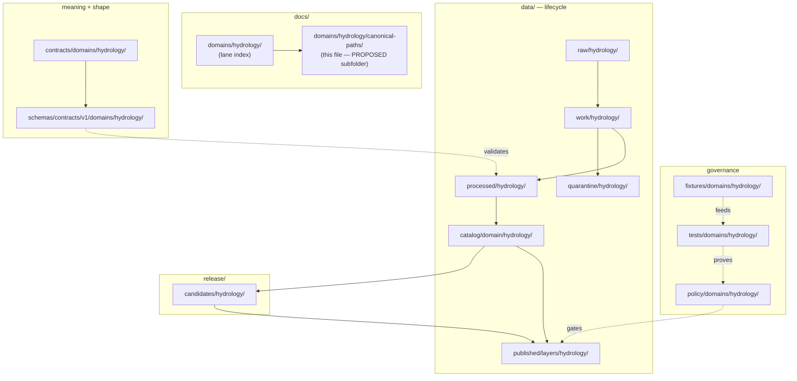

<!-- [KFM_META_BLOCK_V2]
doc_id: kfm://doc/<uuid>            # TODO: assign on admission
title: Hydrology — Canonical Paths
type: standard
version: v1
status: draft
owners: <hydrology-lane-steward>   # TODO: confirm owning role(s)
created: 2026-06-06
updated: 2026-06-06
policy_label: public
related:
  - directory-rules.md            # §12 Domain Placement Law (authority for paths)
  - docs/domains/hydrology/README.md           # PROPOSED — verify presence
  - docs/domains/hydrology/CANONICAL_PATHS.md  # PROPOSED — possible collision (OQ-HYD-PATHS-02)
  - ai-build-operating-contract.md             # CONTRACT_VERSION = "3.0.0"
tags: [kfm, hydrology, paths, directory-rules, lifecycle]
notes:
  - CONTRACT_VERSION = "3.0.0" pinned per ai-build-operating-contract.md v3.0.
  - PROPOSED parent folder `canonical-paths/` is NOT in Directory Rules §12; requires ADR (OQ-HYD-PATHS-01).
  - All repo-shaped paths PROPOSED until verified against a mounted repo.
[/KFM_META_BLOCK_V2] -->

<a id="top"></a>

# 💧 Hydrology — Canonical Paths

> The single, Directory-Rules-anchored map of **where every Hydrology-lane file belongs** across responsibility roots and lifecycle phases.

[](#)
[](#)
[](#)
[](#)
[](#)
[](#)

| Status | Owners | Last updated |
|---|---|---|
| `draft` | `<hydrology-lane-steward>` (TODO) | 2026-06-06 |

> [!IMPORTANT]
> **The parent folder `docs/domains/hydrology/canonical-paths/` is a `PROPOSED` convention.**
> Directory Rules §12 defines the Hydrology lane as `docs/domains/hydrology/` with files placed
> directly inside it; it does **not** define a `canonical-paths/` subfolder. This document is
> placed at the requested path but the subfolder convention is **not canonical** until ratified by
> ADR. See [Open question OQ-HYD-PATHS-01](#open-questions-register). A flat-file alternative
> (`docs/domains/hydrology/CANONICAL_PATHS.md`) may already be the intended home — possible
> collision tracked as [OQ-HYD-PATHS-02](#open-questions-register).

---

## Quick jump

- [1. Scope](#1-scope)
- [2. Repo fit](#2-repo-fit)
- [3. What belongs here](#3-what-belongs-here)
- [4. What does not belong here](#4-what-does-not-belong-here)
- [5. Canonical lane tree](#5-canonical-lane-tree)
- [6. Path-by-responsibility reference](#6-path-by-responsibility-reference)
- [7. Lifecycle phases under `data/`](#7-lifecycle-phases-under-data)
- [8. Object families → likely homes](#8-object-families--likely-homes)
- [9. Diagram — lane responsibility map](#9-diagram--lane-responsibility-map)
- [10. Placement protocol (the 5 steps)](#10-placement-protocol-the-5-steps)
- [11. Anti-patterns this lane must avoid](#11-anti-patterns-this-lane-must-avoid)
- [12. Slug & casing notes](#12-slug--casing-notes)
- [Open questions register](#open-questions-register)
- [Open verification backlog](#open-verification-backlog)
- [Changelog](#changelog-v0--v1)
- [Definition of done](#definition-of-done)
- [Related docs](#related-docs)

---

## 1. Scope

This document is the **path authority index** for the Hydrology domain lane. It answers one
question precisely: *given a Hydrology file, where does it belong?* It does **not** redefine
placement law — it applies `directory-rules.md` §12 (Domain Placement Law) to the Hydrology
lane and records the resulting canonical homes so contributors and reviewers can cite a single
table instead of re-deriving placement each time.

**Status of the rules below:** `CONFIRMED` (they are quoted/derived from Directory Rules §12).
**Status of any specific path's presence in the repo:** `PROPOSED` until verified against a
mounted repository.

> [!NOTE]
> Directory Rules win on every path conflict. If a path here ever diverges from
> `directory-rules.md`, the Rules are authoritative and the divergence is **drift** to be logged
> in `docs/registers/DRIFT_REGISTER.md`, not a local override.

[↑ Back to top](#top)

---

## 2. Repo fit

| | Path | Status |
|---|---|---|
| **This file** | `docs/domains/hydrology/canonical-paths/README.md` | `PROPOSED` (subfolder convention, OQ-HYD-PATHS-01) |
| **Lane index (upstream)** | `docs/domains/hydrology/README.md` | `PROPOSED` — verify presence |
| **Placement authority** | `directory-rules.md` §12 | `CONFIRMED` doctrine |
| **Operating contract** | `ai-build-operating-contract.md` (`CONTRACT_VERSION = "3.0.0"`) | `CONFIRMED` doctrine |
| **Domain atlas chapter** | Hydrology chapter (Domains Culmination Atlas) | `CONFIRMED` doctrine source |

**Upstream:** the Hydrology lane README and the domain atlas chapter set scope, object families,
and governance posture. **Downstream:** every responsibility-root lane segment listed in
[§5](#5-canonical-lane-tree) is the place where actual Hydrology files live; this doc points at
them, it does not contain them.

[↑ Back to top](#top)

---

## 3. What belongs here

- A faithful restatement of the Hydrology lane tree as defined by Directory Rules §12.
- A path-by-responsibility lookup table for contributors and reviewers.
- A mapping from Hydrology **object families** to their **likely** canonical homes (clearly
  labeled `PROPOSED` / `INFERRED` where Directory Rules does not name the object directly).
- The placement protocol applied to Hydrology, and the anti-patterns the lane must avoid.

## 4. What does not belong here

| Does **not** belong here | Goes instead to | Why |
|---|---|---|
| Actual schemas (`*.schema.json`) | `schemas/contracts/v1/domains/hydrology/` | Schema home is the only canonical shape authority (ADR-0001). |
| Object semantics (Markdown contracts) | `contracts/domains/hydrology/` | Meaning lives under `contracts/`, not in a docs index. |
| Policy / sensitivity rules | `policy/domains/hydrology/` (and `policy/sensitivity/...`) | Allow/deny/restrict decisions are policy, not docs. |
| Lifecycle data | `data/<phase>/hydrology/` | Data is governed by lifecycle phase, not by a docs folder. |
| Release manifests, rollback cards | `release/...` | Release decisions are trust-bearing records under `release/`. |
| General lane narrative / overview | `docs/domains/hydrology/README.md` | This file is a path index, not the lane landing page. |

> [!CAUTION]
> This is a **path index**, not a place to mirror schemas, policies, or data. Creating a parallel
> schema/policy/data home here would break the trust membrane (audit, validation, and rollback
> become ambiguous). See [§11](#11-anti-patterns-this-lane-must-avoid).

[↑ Back to top](#top)

---

## 5. Canonical lane tree

This is the Hydrology lane exactly as Directory Rules §12 prescribes it. `CONFIRMED` as the rule;
each path's **presence in the repo** is `PROPOSED` / `NEEDS VERIFICATION` until a mounted repo is
inspected.

```text
# Hydrology lane — Directory Rules §12 pattern (domain = SEGMENT, never a root)

docs/domains/hydrology/                      # human-facing lane index (this lane's docs)
contracts/domains/hydrology/                 # object-family semantics (meaning)
schemas/contracts/v1/domains/hydrology/      # JSON Schema (shape) — ADR-0001 home
policy/domains/hydrology/                     # allow / deny / restrict / abstain rules
tests/domains/hydrology/                      # enforceability proofs
fixtures/domains/hydrology/                   # valid / invalid sample data
packages/domains/hydrology/                   # shared lane code (if any)
pipelines/domains/hydrology/                  # executable pipeline logic
pipeline_specs/hydrology/                      # declarative pipeline config

data/raw/hydrology/                            # immutable source payloads / references
data/work/hydrology/                           # normalization in progress
data/quarantine/hydrology/                     # held failures, with reasons
data/processed/hydrology/                      # validated normalized objects + receipts
data/catalog/domain/hydrology/                 # catalog records, EvidenceBundles
data/published/layers/hydrology/               # released public-safe layer artifacts
data/registry/sources/hydrology/              # source registry slice for the lane

release/candidates/hydrology/                  # release candidate dossiers
```

> [!NOTE]
> The `<domain>` segment for this lane is **`hydrology`** (lowercase). No Hydrology slug drift was
> found in the evidence consulted (contrast Roads/Rail → `transport`, Settlements → `settlement`).
> See [§12](#12-slug--casing-notes).

[↑ Back to top](#top)

---

## 6. Path-by-responsibility reference

The owning root is chosen by **responsibility**, never by topic name (Directory Rules §3–§4).

| Responsibility | Canonical Hydrology path | Class | Status |
|---|---|---|---|
| Explain to humans | `docs/domains/hydrology/` | canonical | `CONFIRMED` rule / `NEEDS VERIFICATION` presence |
| Define object **meaning** | `contracts/domains/hydrology/` | canonical | `CONFIRMED` rule / `NEEDS VERIFICATION` presence |
| Define object **shape** | `schemas/contracts/v1/domains/hydrology/` | canonical (ADR-0001) | `CONFIRMED` rule / `NEEDS VERIFICATION` presence |
| Decide allow/deny/restrict/abstain | `policy/domains/hydrology/` | canonical | `CONFIRMED` rule / `NEEDS VERIFICATION` presence |
| Prove enforceability | `tests/domains/hydrology/` | canonical | `CONFIRMED` rule / `NEEDS VERIFICATION` presence |
| Golden / valid / invalid samples | `fixtures/domains/hydrology/` | canonical | `CONFIRMED` rule / `NEEDS VERIFICATION` presence |
| Shared lane code | `packages/domains/hydrology/` | canonical | `CONFIRMED` rule / `NEEDS VERIFICATION` presence |
| Executable pipeline logic | `pipelines/domains/hydrology/` | canonical | `CONFIRMED` rule / `NEEDS VERIFICATION` presence |
| Declarative pipeline config | `pipeline_specs/hydrology/` | canonical | `CONFIRMED` rule / `NEEDS VERIFICATION` presence |
| Lifecycle data | `data/<phase>/hydrology/` | canonical | `CONFIRMED` rule / `NEEDS VERIFICATION` presence |
| Catalog records / EvidenceBundles | `data/catalog/domain/hydrology/` | canonical | `CONFIRMED` rule / `NEEDS VERIFICATION` presence |
| Released layer artifacts | `data/published/layers/hydrology/` | canonical | `CONFIRMED` rule / `NEEDS VERIFICATION` presence |
| Source registry slice | `data/registry/sources/hydrology/` | canonical | `CONFIRMED` rule / `NEEDS VERIFICATION` presence |
| Release candidate dossiers | `release/candidates/hydrology/` | canonical | `CONFIRMED` rule / `NEEDS VERIFICATION` presence |

> [!TIP]
> **Cross-domain files** (e.g., a shared geometry validator used by hydrology × habitat × fauna)
> do **not** get a `hydrology` segment. They live under the lowest common responsibility root
> *without* a domain segment — e.g., `tools/validators/<topic>/...`, `schemas/contracts/v1/<topic>/...`
> (Directory Rules §12, "Multi-domain and cross-cutting files").

[↑ Back to top](#top)

---

## 7. Lifecycle phases under `data/`

`CONFIRMED` doctrine: Hydrology follows the lifecycle invariant. `PROPOSED` for the lane's
implementation status of each phase.

```text
RAW  →  WORK / QUARANTINE  →  PROCESSED  →  CATALOG / TRIPLET  →  PUBLISHED
```

| Phase | Hydrology path | Gate (PROPOSED minimum) |
|---|---|---|
| `RAW` | `data/raw/hydrology/` | `SourceDescriptor` exists (role, rights, sensitivity, citation, time, hash). |
| `WORK` / `QUARANTINE` | `data/work/hydrology/` · `data/quarantine/hydrology/` | Validation + policy gate pass, or quarantine reason recorded. |
| `PROCESSED` | `data/processed/hydrology/` | `EvidenceRef`, `ValidationReport`, digest closure exist. |
| `CATALOG` / `TRIPLET` | `data/catalog/domain/hydrology/` (+ `data/triplets/...` if used) | Catalog / proof closure passes; `EvidenceBundle` resolves. |
| `PUBLISHED` | `data/published/layers/hydrology/` | `ReleaseManifest`, correction path, rollback target, review/policy state exist. |

> [!IMPORTANT]
> **Promotion is a governed state transition, not a file move.** Moving a file from
> `data/work/hydrology/` to `data/published/layers/hydrology/` by hand is a lifecycle skip and an
> anti-pattern. Connectors emit to `RAW`/`QUARANTINE`; pipelines promote; watchers emit
> candidates and receipts only (watcher-as-non-publisher invariant).

[↑ Back to top](#top)

---

## 8. Object families → likely homes

Hydrology owns the object families below (`CONFIRMED` as the lane's families from the atlas).
Their concrete file homes follow the §6 responsibility map; the per-object placements are
`INFERRED` from the pattern and `PROPOSED` until verified.

| Object family | Shape (schema) | Meaning (contract) | Released layer (if public-safe) |
|---|---|---|---|
| `Watershed`, `HUCUnit` | `schemas/contracts/v1/domains/hydrology/` | `contracts/domains/hydrology/` | `data/published/layers/hydrology/` |
| `HydroFeature`, `ReachIdentity` | ″ | ″ | ″ |
| `GaugeSite` | ″ | ″ | ″ |
| `FlowObservation`, `WaterLevelObservation` | ″ | ″ | ″ |
| `Water Quality Observation` | ″ | ″ | ″ |
| `Groundwater Well` | ″ | ″ | ″ (see caution) |
| `NFHLZone` / `Flood Context` | ″ | ″ | ″ (regulatory context only) |
| `Observed Flood Event` | ″ | ″ | ″ (observed ≠ regulatory) |
| `Hydrograph`, `UpstreamTrace` | ″ | ″ | derivative; release-gated |

> [!CAUTION]
> **Sensitivity is not zero for Hydrology.** Per the atlas, this lane **denies unclear rights and
> flood-role misuse**, and **NFHL-as-observed-flood claims are denied**. Infrastructure and
> private-property implications require review, and sensitive joins fail closed. Public-safe
> release of any object above is gated; exact identifiers or coordinates that could enable harm
> (e.g., certain groundwater well or infrastructure-adjacent details) must be generalized or
> redacted before publication, with a `RedactionReceipt` recorded. Route disposition through the
> operating-contract §23.2 sensitive-domain matrix; do not re-derive it here.

[↑ Back to top](#top)

---

## 9. Diagram — lane responsibility map



> [!NOTE]
> The diagram reflects Directory Rules §12 responsibility boundaries and the lifecycle spine. It is
> structural, not a claim that these directories currently exist — that remains
> `NEEDS VERIFICATION` against a mounted repo.

[↑ Back to top](#top)

---

## 10. Placement protocol (the 5 steps)

Apply this before proposing, creating, moving, or renaming any Hydrology file (Directory Rules §4).

1. **Identify the responsibility** — pick exactly one primary responsibility; if a file has two,
   split it.
2. **Identify the lifecycle phase** (data only) — name the phase explicitly.
3. **Identify the domain** — `hydrology` is a **segment inside** a responsibility root, never a
   root itself.
4. **Confirm authority** — the owning root MUST already exist, or be created in the same change
   with a per-root README; a new canonical root, compatibility root, or `data/` sibling requires
   an ADR.
5. **Cite the rule** — name the Directory Rules section in the PR; if none justifies it, mark the
   path `PROPOSED` / `NEEDS VERIFICATION` and open a `DRIFT_REGISTER.md` or
   `VERIFICATION_BACKLOG.md` entry.

> **Reviewer's one-line check:** *"Does the path encode the right responsibility, the right
> lifecycle phase (if data), and the `hydrology` segment — and does this PR cite a rule for it?"*

[↑ Back to top](#top)

---

## 11. Anti-patterns this lane must avoid

| Anti-pattern | What goes wrong | Counter-rule |
|---|---|---|
| `hydrology/` as a **root folder** with its own `data/ schemas/ policy/` | Topic-root competes with responsibility roots; fragments the lifecycle | Domain is a **segment** inside responsibility roots (§12). |
| Schema authored under `contracts/` instead of `schemas/contracts/v1/...` | Two parallel shape homes; reviewers can't tell which is authoritative | Single schema home per ADR-0001; `contracts/` holds Markdown meaning only. |
| Lifecycle skip (`data/raw/hydrology/` → `data/published/...` directly) | Promotion gates bypassed; trust membrane broken | All phases run; promotion is a governed state transition. |
| Release manifests / receipts under `artifacts/` | Build scratch mixed with trust-bearing records | Trust records live under `data/` or `release/`; `artifacts/` is build/docs/QA scratch only. |
| Public client reads `data/processed/hydrology/` directly | Trust membrane bypassed | Public reads go through `apps/governed-api/`. |
| Connector or watcher publishes | Watcher-as-non-publisher invariant broken | Connectors emit to `raw`/`quarantine`; watchers emit candidates + receipts only; pipelines promote. |

[↑ Back to top](#top)

---

## 12. Slug & casing notes

- **Lane slug:** `hydrology` (lowercase, singular) across all responsibility roots. No drift
  surfaced in the evidence consulted.
- **Cross-lane contrast (for reviewer awareness):** other lanes show documented slug drift between
  docs lane name and schema path (e.g., Roads/Rail → `transport`, Settlements → `settlement`).
  Those are tracked elsewhere; Hydrology is **not** known to have such drift, but this remains
  `NEEDS VERIFICATION` until the repo is inspected.
- **This file's parent folder** (`canonical-paths/`) uses lowercase-kebab. Whether the canonical
  home is this subfolder + `README.md` or a flat `CANONICAL_PATHS.md` is unresolved — see
  [OQ-HYD-PATHS-01](#open-questions-register) and [OQ-HYD-PATHS-02](#open-questions-register).

[↑ Back to top](#top)

---

## Open questions register

| ID | Question | Owner role | Resolution path |
|---|---|---|---|
| OQ-HYD-PATHS-01 | Is `docs/domains/<domain>/canonical-paths/` a sanctioned subfolder convention? It is **not** in Directory Rules §12. | Docs steward + Directory Rules owner | ADR ratifying (or rejecting) the `canonical-paths/` subfolder; until then the convention is `PROPOSED`. |
| OQ-HYD-PATHS-02 | Collision risk: should the canonical home be `canonical-paths/README.md` or a flat `docs/domains/hydrology/CANONICAL_PATHS.md`? | Docs steward | Directory Rules check + repo inspection; pick one, alias/redirect the other, log in `DRIFT_REGISTER.md`. |
| OQ-HYD-PATHS-03 | Does Hydrology use `data/triplets/` (graph projections) in addition to `data/catalog/domain/hydrology/`? | Hydrology lane steward | Repo inspection of `data/triplets/`; add to §5/§7 if present. |
| OQ-HYD-PATHS-04 | Confirm there is no Hydrology slug drift (docs lane vs schema path) as exists for Roads/Settlements. | Hydrology lane steward | Mounted-repo scan of `schemas/contracts/v1/domains/`. |

## Open verification backlog

These items remain `NEEDS VERIFICATION` before promotion from `draft` to `published`:

1. Confirm `docs/domains/hydrology/README.md` exists and links to this file.
2. Verify presence of each canonical lane path in §5 against a mounted repo.
3. Confirm the schema home `schemas/contracts/v1/domains/hydrology/` exists (ADR-0001).
4. Confirm `data/triplets/` usage for the lane (OQ-HYD-PATHS-03).
5. Confirm there is no Hydrology slug drift (OQ-HYD-PATHS-04).
6. Resolve the `canonical-paths/` subfolder convention via ADR (OQ-HYD-PATHS-01) and the
   flat-file collision (OQ-HYD-PATHS-02).
7. Confirm owning role(s) for the `owners` field; replace the `<hydrology-lane-steward>` placeholder.

## Changelog v0 → v1

| Change | Type (per contract §37) | Reason |
|---|---|---|
| Initial Hydrology canonical-paths index | new | Provide a single Directory-Rules-anchored path map for the lane. |
| Flagged `canonical-paths/` subfolder as PROPOSED | new (governance note) | Subfolder is not in Directory Rules §12; requires ADR. |
| Mapped object families to likely homes | new | Speed reviewer placement checks; labeled INFERRED/PROPOSED. |

> **Backward compatibility.** New file; no anchors broken. If OQ-HYD-PATHS-02 resolves toward a
> flat `CANONICAL_PATHS.md`, this file should be redirected (not silently deleted) and the move
> logged in `docs/registers/DRIFT_REGISTER.md`.

## Definition of done

This document is done enough to enter the repository when:

- it is placed according to Directory Rules **or** an ADR sanctions the `canonical-paths/` subfolder (OQ-HYD-PATHS-01);
- a docs steward (and the Hydrology lane steward) reviews it;
- it is linked from `docs/domains/hydrology/README.md`;
- it does not conflict with accepted ADRs (esp. ADR-0001 schema home);
- the `canonical-paths/` convention and flat-file collision are logged in `docs/registers/DRIFT_REGISTER.md` until resolved;
- the `GENERATED_RECEIPT.json` planned for this artifact is wired into CI with `human_review.state` transitioning from `pending` to `approved`;
- future changes follow the operating contract's §37 lifecycle.

---

## Related docs

- `directory-rules.md` — §12 Domain Placement Law (authority for every path here)
- `docs/domains/hydrology/README.md` — lane index *(PROPOSED — verify)*
- `docs/domains/hydrology/CANONICAL_PATHS.md` — possible flat-file alternate *(PROPOSED — OQ-HYD-PATHS-02)*
- `ai-build-operating-contract.md` — `CONTRACT_VERSION = "3.0.0"`; §23.2 sensitive-domain matrix
- `docs/registers/DRIFT_REGISTER.md` · `docs/registers/VERIFICATION_BACKLOG.md` *(TODO — verify)*

*Last updated: 2026-06-06.*

[↑ Back to top](#top)
