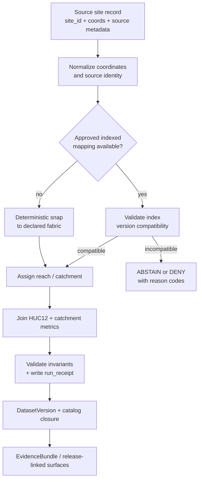

<!-- [KFM_META_BLOCK_V2]
doc_id: kfm://doc/hydrology/pipeline_spec
title: Hydrology Indexing & Analytics Pipeline
type: standard
version: v1
status: draft
owners: @bartytime4life
created: 2026-04-13
updated: 2026-04-14
policy_label: public
related: [./README.md, ./mesonet-soil.md, ./usgs-tail-alerts-schema.md, ./wbd-huc12-watcher.md, ../README.md, ../../../data/registry/README.md, ../../../data/work/README.md, ../../../data/catalog/README.md, ../../../contracts/README.md, ../../../schemas/README.md, ../../../policy/README.md, ../../../pipelines/wbd-huc12-watcher/README.md]
tags: [kfm, hydrology, nhdplus, wbd, nwis, streamcat, indexing, provenance]
notes: [Intended new domain-spec path inferred from the current public hydrology subtree; exact contract-home and execution-lane wiring remain review items.]
[/KFM_META_BLOCK_V2] -->

# Hydrology Indexing & Analytics Pipeline
Deterministic site → reach → watershed mapping and release-linked hydrologic analytics for KFM’s hydrology-first lane.

**Status:** `draft` · **Owners:** `@bartytime4life` · **Intended path:** `docs/domains/hydrology/hydrology-indexing-analytics-pipeline.md` *(INFERRED from the current public hydrology subtree)*  
     

**Repo fit:** `./README.md` · sibling specs `./mesonet-soil.md`, `./usgs-tail-alerts-schema.md`, `./wbd-huc12-watcher.md` · data surfaces `../../../data/registry/README.md`, `../../../data/work/README.md`, `../../../data/catalog/README.md` · authority neighbors `../../../contracts/README.md`, `../../../schemas/README.md`, `../../../policy/README.md` · execution neighbor `../../../pipelines/wbd-huc12-watcher/README.md`

**Quick jumps:** [Scope](#scope) · [Truth posture](#truth-posture) · [Accepted inputs](#accepted-inputs) · [Exclusions](#exclusions) · [Doctrine alignment](#doctrine-alignment) · [Source-role map](#source-role-map) · [Canonical keys](#canonical-keys-and-identity-surfaces) · [Decision grammar](#decision-grammar) · [Pipeline flow](#pipeline-flow) · [Mapping rules](#deterministic-mapping-rules) · [Contracts and artifacts](#contracts-and-artifacts) · [Validation](#validation-and-fail-closed-rules) · [Thin slice](#thin-slice-plan) · [Open verification items](#open-verification-items) · [Appendix](#appendix)

> [!IMPORTANT]
> This file is a **domain-and-integration specification**, not proof that a live site-to-reach ingestion pipeline, checked-in validator suite, or release workflow already exists on the active branch.

> [!NOTE]
> This spec uses lane-local mapping outcomes `ACCEPT | ABSTAIN | DENY | ERROR`. Promotion and runtime surfaces should continue to emit their own governed envelopes instead of collapsing those concerns into a single mapping result.

## Scope

This specification defines how KFM should map hydrologic observation points — streamgages, water-quality stations, public-safe sensors, and similar monitoring sites — onto a declared hydrographic fabric and derive stable watershed context from that mapping.

It covers:

- source admission and source-role separation for hydrologic indexing inputs
- deterministic site → reach → catchment → HUC12 mapping
- release-linked attachment of catchment and watershed analytics
- proof objects and catalog-closure expectations needed for a first hydrology slice
- fail-closed rules for ambiguity, version mismatch, and unsupported crosswalks

It does **not** cover:

- live emergency alerting
- unrestricted public publication of sensitive infrastructure detail
- groundwater or surface-water simulation engines as if they were already integrated runtime facts
- silent promotion of legacy hydrography indexes into a newer fabric without declared reconciliation rules

## Truth posture

| Label | How it is used here |
| --- | --- |
| **CONFIRMED** | KFM doctrine that hydrology is the preferred first proof lane; truth-path law; catalog-triplet closure; proof-object families; source-role discipline; and the visible public hydrology subtree. |
| **INFERRED** | The intended document placement under `docs/domains/hydrology/` and the use of this file as a sibling domain spec beside the checked-in hydrology docs. |
| **PROPOSED** | The exact site-indexing realization described here, including the preferred data-contract shapes, snapping rules, and artifact choreography. |
| **NEEDS VERIFICATION** | Exact checked-in loaders, validators, schema-home authority, workflow YAMLs, and any release automation claimed beyond the visible public repo surface. |
| **UNKNOWN** | Mounted implementation depth that was not surfaced in the current session. |

## Accepted inputs

This spec assumes the following input families are admissible when their source role, version, and rights posture are declared:

- **Observation points** with stable site identifiers, coordinates, coordinate reference system, source timestamp, and source identity
- **Hydrographic fabric records** that expose reach identifiers, catchments, network relationships, and version information
- **Hydrologic unit boundaries** for HUC12 joins and watershed context
- **Catchment and watershed metrics** that clearly distinguish direct, derived, and modeled values
- **Receipt-bearing supporting metadata** such as source version, ETag, retrieval timestamp, and spec hash inputs

## Exclusions

Do **not** use this spec to justify any of the following shortcuts:

- treating discovery mirrors or convenience indexes as sovereign truth
- silently mixing `NHDPlus v2.x`-indexed site addresses with an `NHDPlus HR` canonical fabric
- attaching modeled watershed metrics without a visible modeled-status marker
- publishing unresolved site mappings as if they were authoritative
- skipping receipts because the mapping appears “obvious” on a map

## Doctrine alignment

| KFM principle | Pipeline consequence |
| --- | --- |
| **Map-first** | The mapping product is spatial identity first: site, reach, catchment, and HUC12 are explicit and queryable. |
| **Evidence-first** | Every mapping decision must be reproducible from declared inputs, versioned fabric, and stored receipts. |
| **Fail-closed** | Ambiguous or version-incompatible mappings do not silently coerce to a plausible answer. |
| **Time-aware** | Fabric release, source snapshot, and revalidation time stay visible on every mapping output. |
| **Trust-visible publication** | Catalog records, receipts, and evidence bundles remain release-linked; discovery must not outrun proof. |
| **Observation-versus-model discipline** | Observed site measurements, hydrographic fabric, regulatory flood context, and modeled watershed metrics stay distinct. |

## Source-role map

| Source family | KFM source role | Primary use in this spec | Main caution |
| --- | --- | --- | --- |
| **USGS Water Data / NWIS** | direct observational / instrumented | Site identity, coordinates, observation linkage, gage context | Preserve support, units, and source timing; do not turn a site record into hydrographic truth by itself. |
| **USGS WBD HUC12** | hydrographic boundary / discovery and closure support | Watershed join and outward HUC12 context | Boundary freshness and meaningful change must be treated explicitly; metadata churn alone is not enough. |
| **USGS NHDPlus HR** | hydrographic analysis fabric | Reach, catchment, network topology, COMID, catchment linkage | Fabric release and companion WBD version must be declared. |
| **USGS NLDI or other indexed hydro services** | discovery / corroborative indexing | Candidate COMID lookup, navigation, corroboration | Current indexing may rely on `NHDPlus v2`; do not silently promote that to `HR` equivalence. |
| **USGS SWIM streamgage index (v2.1)** | corroborative indexed dataset | Legacy indexed gage-to-flowline evidence | Useful candidate evidence, but version reconciliation is mandatory before HR use. |
| **EPA StreamCat** | derived / mixed metric surface | Catchment and watershed metrics attached after mapping | Some metrics are directly tabulated; others are modeled or composite and must stay labeled. |
| **FEMA NFHL** *(optional)* | statutory / regulatory context | Flood-context overlays and downstream interpretive enrichment | Regulatory flood context is not the same as observed inundation or hydrographic fabric. |

## Canonical keys and identity surfaces

| Level | Key | Role | Status in this spec |
| --- | --- | --- | --- |
| Site subject | `site_id` | KFM-stable external subject key for the observation point | required |
| Source site key | `site_no` / source-native id | Source-preserving identifier when the site comes from NWIS or a partner system | source-dependent |
| Reach | `comid` | Reach identity on the declared hydrographic fabric | proposed default for NHDPlus-based mapping |
| Catchment | `featureid` or fabric catchment id | Catchment-level linkage for metrics and drainage context | fabric-dependent |
| Watershed | `huc12` | Hydrologic unit closure and external watershed reference | required for watershed context |
| Fabric release | `hydrofabric_version` | Declared hydrographic release or version family | required |
| Mapping spec | `spec_hash` | Canonical identity anchor for the mapping procedure and declared rules | required |
| Run proof | `run_receipt_ref` | Pointer to the machine-checkable receipt for this mapping run | required |

> [!TIP]
> Keep `site_id` stable even when the same source site is revalidated across newer fabric releases. Treat the mapping itself as versioned, not the subject identity.

## Decision grammar

| Outcome | Meaning | Typical trigger |
| --- | --- | --- |
| `ACCEPT` | The mapping is deterministic and passes all required checks. | Indexed mapping is version-compatible, or snap/join workflow resolves unambiguously. |
| `ABSTAIN` | The pipeline cannot safely commit a mapping. | No candidate reach, missing approved baseline, or unsupported crosswalk. |
| `DENY` | A contradictory or disallowed condition was detected. | Conflicting indexed-vs-fabric evidence, policy block, or mixed-version coercion attempt. |
| `ERROR` | The pipeline failed to evaluate safely. | Parse error, missing required source material, broken geometry, validator failure. |

## Pipeline flow



## Deterministic mapping rules

### 1. Normalize the site input first

Minimum required fields before any mapping attempt:

- `site_id`
- source-native site identifier when available
- coordinate pair plus declared CRS
- source system / source URI
- retrieval or source snapshot time
- source version or equivalent fetch evidence when available

Recommended normalization steps:

1. reproject coordinates to the declared working CRS for spatial matching
2. reject null-island or malformed coordinates
3. retain the original coordinate and the normalized coordinate side by side
4. preserve the source-native site key even when KFM uses a different `site_id`

### 2. Prefer explicit indexed evidence only when the version story is safe

Use an indexed site-to-flowline mapping **only** when all of the following are true:

- the index source is declared in a `SourceDescriptor`
- the hydrographic version is explicit
- the index can be used directly against the declared fabric **or** an approved crosswalk exists
- the indexed result does not conflict with other admitted evidence beyond declared tolerances

#### Version-compatibility rule

If the chosen canonical fabric is `NHDPlus HR`, then `NHDPlus v2.x`-indexed site mappings are **not** automatically authoritative for this pipeline. They may be used as:

- corroborative candidate evidence
- reviewer context
- a negative-path comparison input

They must **not** be promoted to HR truth without a documented reconciliation rule.

### 3. Deterministic snap path

When no approved indexed mapping exists, or when indexed evidence is only corroborative, use the snap path.

#### Proposed default snap procedure

1. search candidate flowlines within a declared tolerance radius
2. rank by minimum planar or geodesic distance in the declared working method
3. if distances tie within the declared epsilon, choose the lowest stable reach identifier
4. if no candidate satisfies tolerance, emit `ABSTAIN`

#### Proposed defaults

| Parameter | Default | Status |
| --- | --- | --- |
| Snap tolerance | `50 m` | PROPOSED starter default |
| Distance tie epsilon | `1e-6` in working units | PROPOSED |
| Tie-breaker | lowest `comid` after distance equality | PROPOSED |
| Output method tag | `snap_method_version=v1` | PROPOSED |

> [!CAUTION]
> If the project later introduces source-class filtering, perennial-only preferences, or flowline-type exclusions, those rules must be declared in the spec hash inputs. They must not remain hidden implementation behavior.

### 4. Catchment and HUC12 join

After reach assignment:

1. attach the declared catchment identifier from the chosen fabric
2. join the matching `HUC12` from the declared WBD release
3. record both the hydrofabric release and the WBD release used for the join
4. refuse silent fallback to a different watershed layer if the preferred join fails

### 5. Attribute attachment

Attach metrics in two clearly separated families:

| Metric family | Typical source | Rule |
| --- | --- | --- |
| **Local catchment metrics** | StreamCat `Cat`-style metrics or equivalent catchment values | Attach directly to the mapped catchment. |
| **Watershed / upstream metrics** | StreamCat `Ws`-style or other cumulative metrics | Prefer provider-published cumulative values when release-compatible. |

Recompute upstream metrics **only** when:

- the selected fabric release is not covered by the published metric release
- the needed metric is missing from the admitted source
- the recomputation method is itself versioned, receipted, and declared as derived

### 6. Proof writing and handoff

Every mapping run should write at least:

- a `run_receipt`
- a mapping output record or `DatasetVersion` candidate
- reason codes for non-`ACCEPT` outcomes
- outward references for catalog closure once a release candidate exists

## Contracts and artifacts

### Minimum proof objects for this slice

| Object | Why it exists | Minimum content |
| --- | --- | --- |
| `SourceDescriptor` | Declares the intake contract for WBD, NWIS, NHDPlus HR, StreamCat, and any corroborative index source | identity, owner/steward, access mode, cadence, rights posture, validation plan |
| `run_receipt` | Proves one mapping run happened and records exactly what it used | run id, inputs, outputs, timestamps, `spec_hash`, artifact refs |
| `DatasetVersion` | Carries one candidate or promoted mapping set | stable dataset id, version id, provenance links, time semantics |
| `CatalogClosure` | Links release-backed STAC, DCAT, and PROV records | identifiers, outward refs, release linkage |
| `EvidenceBundle` | Supports one claim or one site-centered drill-through surface | source basis, dataset refs, lineage summary, freshness, rights state |

### Proof quartet rule

| Proof surface | Required here? | Notes |
| --- | --- | --- |
| `spec_hash` | yes | Required for deterministic identity of the mapping rules and inputs. |
| `run_receipt` | yes | Required for every deterministic mapping run. |
| `ai_receipt` | only if AI is introduced | Omit for a purely deterministic pipeline; require it for any model-mediated proposal or summarization step. |
| Attestation refs | release-bearing only | Required once a mapping set is promoted or attached to a release proof surface. |

## Minimal output shape

### Mapping record

```json
{
  "site_id": "string",
  "source_site_id": "string",
  "orig_coord": ["lon", "lat"],
  "coord_crs": "string",
  "snapped_coord": ["lon", "lat"],
  "comid": "integer",
  "featureid": "string",
  "huc12": "string",
  "mapping_method": "INDEXED | SNAP",
  "mapping_source": "declared source id",
  "hydrofabric_version": "string",
  "wbd_version": "string",
  "candidate_count": "integer",
  "snap_distance_m": "number",
  "decision": "ACCEPT | ABSTAIN | DENY | ERROR",
  "reason_codes": ["string"],
  "spec_hash": "sha256:...",
  "run_receipt_ref": "kfm://receipt/...",
  "revalidated_at": "RFC3339 timestamp"
}
```

### Mapping receipt

```json
{
  "receipt_id": "kfm://receipt/hydrology/mapping/<uuid>",
  "run_id": "string",
  "input_refs": ["source descriptor ids or URIs"],
  "site_id": "string",
  "decision": "ACCEPT | ABSTAIN | DENY | ERROR",
  "artifacts": {
    "candidate_count": 0,
    "distance_metrics": {},
    "geometry_hash": "sha256:..."
  },
  "spec_hash": "sha256:...",
  "generated_at": "RFC3339 timestamp"
}
```

## Validation and fail-closed rules

| Condition | Outcome | Why |
| --- | --- | --- |
| Missing `site_id`, coordinate, or CRS | `ERROR` | The pipeline cannot safely evaluate. |
| No flowline within tolerance | `ABSTAIN` | Plausible guessing is forbidden. |
| Indexed mapping exists but hydrographic version is unresolved | `ABSTAIN` | Version ambiguity is a truth problem, not a convenience detail. |
| Indexed mapping conflicts materially with deterministic snap and no adjudication rule exists | `DENY` | Contradiction must stay visible. |
| Reach maps but catchment/HUC join fails under the declared release set | `DENY` | Broken closure should not publish partial truth. |
| Modeled or composite metrics arrive without modeled-status labeling | `DENY` | Observation-versus-model discipline was violated. |
| Same inputs + same versions + same `spec_hash` produce different outputs | `ERROR` | Determinism failed. |
| All required checks pass | `ACCEPT` | Mapping may continue toward release-linked packaging. |

### Determinism invariants

- same source snapshot + same hydrofabric release + same `spec_hash` → same mapping result
- same accepted mapping → same downstream catchment/HUC12 joins
- same released mapping set → stable STAC/DCAT/PROV closure unless correction or supersession occurs

## Release-bearing placement

| Surface | What belongs there |
| --- | --- |
| `data/registry/` | source descriptors for WBD, NHDPlus HR, NWIS, StreamCat, and any corroborative index source |
| `data/work/` | intermediate snap/join artifacts, reviewer diff material, validation outputs |
| `data/catalog/` | release-linked STAC, DCAT, and PROV closure |
| `contracts/` and settled schema-home lane | machine-checkable shapes for receipts, versions, and decision objects |
| `pipelines/` | lane-local execution material once a checked-in pipeline exists |
| `docs/domains/hydrology/` | human-readable boundary, burden, and integration specs |

## Thin-slice plan

1. **Land this spec as a sibling hydrology domain doc.**
   - Keep path and neighbor references explicit.
   - Do not claim checked-in execution depth that the branch does not show.

2. **Register first-wave sources.**
   - WBD HUC12
   - NHDPlus HR
   - USGS Water Data / NWIS
   - EPA StreamCat
   - any corroborative index source used for candidate evidence

3. **Prove one Kansas slice end to end.**
   - small HUC12 subset
   - 10–20 public-safe USGS sites
   - both positive and negative mapping cases

4. **Emit one proof-bearing bundle.**
   - one `run_receipt`
   - one `DatasetVersion` candidate
   - one STAC/DCAT/PROV closure set
   - one site-centered `EvidenceBundle`

5. **Exercise the negative path.**
   - no-candidate case
   - version-mismatch case
   - index-vs-snap conflict case
   - correction or supersession example

## Open verification items

- **Canonical hydrofabric decision:** is this slice standardizing on `NHDPlus HR`, an `NLDI`-indexed `NHDPlus v2` surface, or a future migration target such as 3DHP-linked hydrography?
- **Approved crosswalk rule:** if `v2.x` indexed site mappings are used, what exact adjudication or crosswalk policy makes them safe against the chosen canonical fabric?
- **Metric naming rule:** what exact StreamCat field-family naming should be treated as canonical in the repo for the chosen release?
- **Contract-home authority:** root `contracts/` and nested schema lanes both exist; the machine-authoritative home still needs branch-level confirmation.
- **Execution-lane placement:** whether this mapping pipeline belongs in a new hydrology execution lane or extends an existing watcher-adjacent pattern remains a repo-level decision.
- **Promotion enforcement depth:** the current public repo surface does not yet prove merge-blocking validators, workflow YAMLs, or release automation for this slice.

---

## Appendix

<details>
<summary><strong>Appendix A — Why this lane is worth proving first</strong></summary>

Hydrology is the most defensible first whole-system slice because it stays comparatively public-safe while still exercising:

- source descriptors
- source-role separation
- deterministic joins
- catalog-triplet closure
- site-centered evidence drill-through
- correction and rollback behavior

That makes it a strong place to prove KFM contracts, receipts, and trust-visible shell behavior before widening into higher-burden lanes.

</details>

<details>
<summary><strong>Appendix B — Reviewer checklist</strong></summary>

- [ ] Path and repo-fit links resolve from `docs/domains/hydrology/`
- [ ] Source-role labels remain explicit for each admitted source family
- [ ] Indexed-vs-snap version handling stays fail-closed
- [ ] `spec_hash` and `run_receipt` are required in every accepted example
- [ ] Modeled metrics stay visibly modeled
- [ ] One negative-path example exists before promotion claims are raised
- [ ] Any future execution lane or workflow claim is rechecked on the active branch

</details>

[Back to top](#hydrology-indexing--analytics-pipeline)