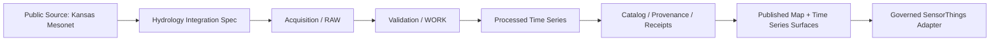
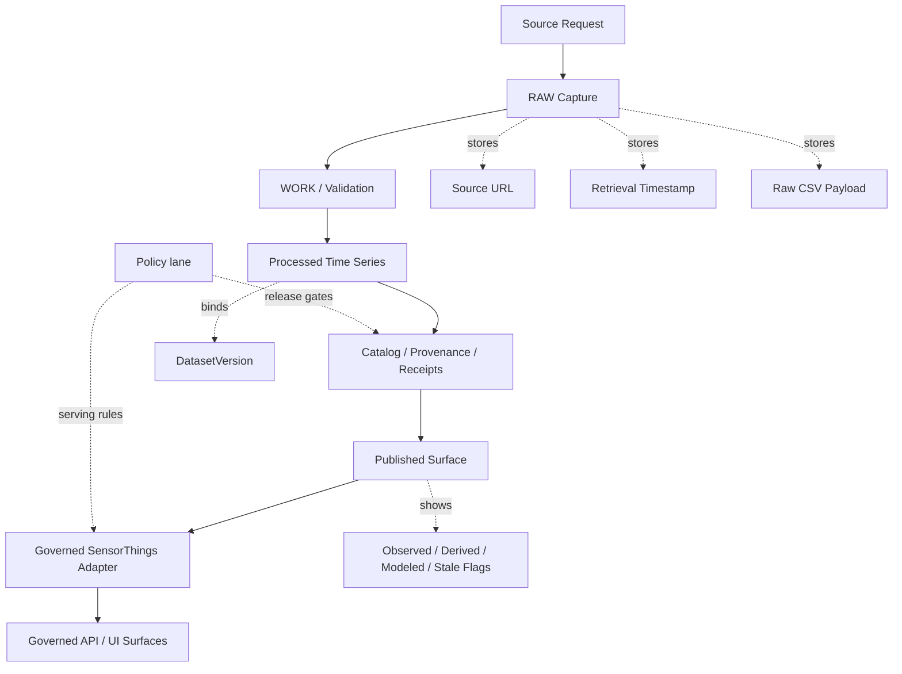
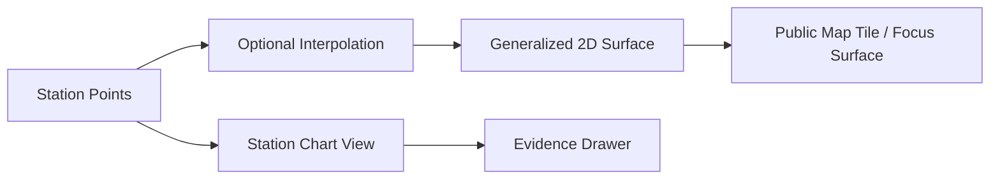

<!-- [KFM_META_BLOCK_V2]
doc_id: kfm://doc/<REVIEW_REQUIRED_UUID_NOT_CONFIRMED>
title: Kansas Mesonet Soil Moisture Integration Specification
type: standard
version: v1
status: draft
owners: @bartytime4life
created: 2026-04-11
updated: 2026-04-11
policy_label: public-safe
related: [docs/domains/README.md, docs/governance/ROOT_GOVERNANCE.md, docs/governance/ETHICS.md, contracts/README.md, data/registry/README.md, data/work/README.md, data/catalog/README.md, policy/README.md]
tags: [kfm, hydrology, mesonet, soil-moisture, sensorthings, provenance, evidence]
notes: [Merged from the Kansas Mesonet connector draft and the Kansas Mesonet soil moisture domain specification; repo paths and mounted implementation depth remain unverified in the current session; SensorThings is treated as a downstream serving adapter rather than the canonical store.]
[/KFM_META_BLOCK_V2] -->

<a id="top"></a>

# Kansas Mesonet Soil Moisture Integration Specification

**One-line purpose:** Define how Kansas Mesonet soil moisture observations and adjacent evapotranspiration data should be characterized, ingested, validated, governed, and published in KFM, with SensorThings treated only as a downstream serving surface.

**Status:** Draft  
**Owners:** @bartytime4life  
**Intended path:** `docs/domains/hydrology/mesonet-soil.md` *(NEEDS VERIFICATION)*


**Quick jumps:** [Scope](#scope) · [Truth posture](#truth-posture) · [Repo fit](#repo-fit) · [Inputs](#accepted-inputs) · [Source profile](#source-profile) · [Acquisition](#acquisition-pattern) · [Trust flow](#ingestion-and-trust-flow) · [Schema](#canonical-record-shape) · [Connector boundary](#connector-and-sensorthings-boundary) · [QA](#validation-and-quality-rules) · [Publication](#publication-and-trust-surface) · [Tasks](#task-list) · [FAQ](#faq)

---

## Scope

This document consolidates the strongest parts of the two source drafts into one governed specification for Kansas Mesonet soil moisture in KFM.

It covers:

- public source characterization
- accepted source classes and pull patterns
- variable and semantic mapping
- canonical record shape
- provenance and trust requirements
- validation and promotion gates
- station-first publication posture
- downstream SensorThings serving boundaries
- map and time-series use within hydrology-facing surfaces

It does **not** claim that a live ingestion pipeline, catalog entry, deployed API route, or public SensorThings runtime already exists in the repository.

> [!IMPORTANT]
> This specification assumes the governed path **Mesonet REST/CSV → RAW → WORK / VALIDATION → PROCESSED → CATALOG / RECEIPTS → published surfaces → downstream SensorThings adapter**. It does **not** assume a direct REST → SensorThings canonical write path.

> [!NOTE]
> This file should be treated as a **domain-and-integration specification**. Runtime schemas, loaders, validators, and serving adapters should remain separately versioned even if they are derived from the rules defined here.

---

## Truth posture

| Label | Meaning in this merged document |
|---|---|
| **CONFIRMED** | Directly supported by visible source documentation or preserved doctrine from the merged drafts |
| **INFERRED** | Strongly implied by doctrine or source behavior, but not directly verified in-repo |
| **PROPOSED** | Recommended target shape that fits KFM posture |
| **UNKNOWN** | No reliable implementation evidence surfaced in the current session |
| **NEEDS VERIFICATION** | Must be checked in the repository or against the current source before merge or release |

### Current-session posture

| Area | Status | Meaning |
|---|---|---|
| Source identity, endpoint family, soil-moisture fields, trust posture | **CONFIRMED** | Supported by the merged drafts |
| Canonical schema, validation profile, catalog linkage, SensorThings adapter shape | **PROPOSED** | Strongly suggested integration shape |
| Mounted repo paths, emitted schemas, tests, CI, deployed routes | **UNKNOWN** | Not surfaced in the current workspace |

---

## Repo fit

| Area | Fit |
|---|---|
| **Intended file/path** | `docs/domains/hydrology/mesonet-soil.md` *(NEEDS VERIFICATION)* |
| **Role** | Kansas Mesonet soil-moisture domain spec with explicit connector and serving-boundary rules |
| **Upstream** | External Kansas Mesonet REST and approved CSV exports, plus KFM source registration in `data/registry/` |
| **Canonical flow** | `RAW → WORK / QUARANTINE → PROCESSED → CATALOG → PUBLISHED` |
| **Downstream** | `data/work/`, `data/catalog/{stac,dcat,prov}/`, `data/receipts/`, station-facing map/time-series surfaces, and a governed SensorThings-compatible adapter |
| **Policy boundary** | Policy enforcement belongs to KFM policy and governed APIs, not to the source itself |
| **Implementation coupling** | Low at document level; moderate for ingestion, catalog, and serving contracts *(INFERRED)* |

**Adjacent references named by the merged drafts**

- `docs/domains/README.md`
- `docs/governance/ROOT_GOVERNANCE.md`
- `docs/governance/ETHICS.md`
- `contracts/README.md`
- `data/registry/README.md`
- `data/work/README.md`
- `data/catalog/README.md`
- `policy/README.md`

> [!CAUTION]
> This specification is not a source-use waiver. Source access, cadence, rights, citation requirements, and release posture must be recorded in KFM before any automated run is treated as a sanctioned integration.

---

## Accepted inputs

This specification is written for the following source classes:

1. **Kansas Mesonet REST CSV responses**
2. **Kansas Mesonet soil-moisture table/CSV exports**
3. **Kansas Mesonet evapotranspiration dashboard CSV exports**
4. **Station registry metadata** including station names, activity windows, and coordinates

Accepted observation intervals:

- `5min`
- `hour`
- `day`

Accepted station scopes:

- single station
- comma-separated station list
- network-level pull where source supports it

### Connector input rules

1. Use **explicit station or network scope**.
2. Use **explicit observation interval**.
3. Use **explicit time windows** for replayability.
4. Treat variable and unit mapping as a contract, not a best-effort guess.
5. Capture source metadata alongside data pulls so later receipts can resolve provenance cleanly.

---

## Exclusions

This document excludes:

- non-Mesonet soil sensor networks
- subsurface modeling pipelines not tied to observed Mesonet inputs
- irrigation recommendation logic as a decision engine
- 3D subsurface visualization standards
- unpublished or private source integrations
- claims of authoritative agronomic thresholds for every crop or soil type
- scraping undocumented HTML or ad hoc page parsing
- implicit discovery of stations or variables without recorded configuration
- direct canonical write into SensorThings

> [!CAUTION]
> Soil moisture values are **observed at stations**, not universally representative of surrounding parcels or fields. KFM publication should not overstate spatial precision beyond what observation density and interpolation method can support.

---

## Domain placement



---

## Source profile

### Source identity

| Field | Value |
|---|---|
| Source name | Kansas Mesonet |
| Steward | Kansas State University / Kansas Mesonet |
| Delivery mode | Public web pages + RESTful CSV services |
| Primary formats | CSV, HTML tables, map images |
| Observation focus | station weather, soil moisture, evapotranspiration |
| Access class | public-source |
| Authority posture | authoritative for its own published observations; not sovereign for parcel-specific field truth |

### Source posture in KFM

Kansas Mesonet should be treated as a **trusted observational source** for station-based soil moisture and ET context, while remaining subordinate to KFM rules for:

- provenance retention
- uncertainty visibility
- spatial generalization
- correction handling
- publication boundaries
- downstream policy review

### Public source facts

**CONFIRMED source facts preserved by the merge:**

- Mesonet exposes a REST page describing CSV access and required query parameters.
- Station observations are requested through `/rest/stationdata/`.
- Required `stationdata` parameters include station or network, interval, start time, and end time.
- Soil moisture is reported at **5 cm, 10 cm, 20 cm, and 50 cm**.
- The soil-moisture page exposes **VWC** and **percent saturation** values, plus **7-day change** fields.
- The evapotranspiration page includes a downloadable CSV surface.

---

## Source variables in scope

### Soil moisture variables

| Mesonet field | Meaning | KFM semantic class | Status |
|---|---|---|---|
| `VWC5CM` | volumetric water content at 5 cm | observed.soil.vwc.5cm | CONFIRMED |
| `VWC10CM` | volumetric water content at 10 cm | observed.soil.vwc.10cm | CONFIRMED |
| `VWC20CM` | volumetric water content at 20 cm | observed.soil.vwc.20cm | CONFIRMED |
| `VWC50CM` | volumetric water content at 50 cm | observed.soil.vwc.50cm | CONFIRMED |
| `PCNTSAT5CM` | percent saturation at 5 cm | observed.soil.pcntsat.5cm | CONFIRMED |
| `PCNTSAT10CM` | percent saturation at 10 cm | observed.soil.pcntsat.10cm | CONFIRMED |
| `PCNTSAT20CM` | percent saturation at 20 cm | observed.soil.pcntsat.20cm | CONFIRMED |
| `PCNTSAT50CM` | percent saturation at 50 cm | observed.soil.pcntsat.50cm | CONFIRMED |
| `DIFF7DAY5CM` | 7-day change at 5 cm | derived.soil.delta7d.5cm | CONFIRMED |
| `DIFF7DAY10CM` | 7-day change at 10 cm | derived.soil.delta7d.10cm | CONFIRMED |
| `DIFF7DAY20CM` | 7-day change at 20 cm | derived.soil.delta7d.20cm | CONFIRMED |
| `DIFF7DAY50CM` | 7-day change at 50 cm | derived.soil.delta7d.50cm | CONFIRMED |

### ET variables

Mesonet exposes an evapotranspiration dashboard and CSV download surface. This merged document does **not** lock a canonical ET field list until a verified header capture is committed into a fixture or schema.

| Group | KFM stance |
|---|---|
| ET dashboard availability | CONFIRMED |
| CSV availability | CONFIRMED |
| Exact ET field registry | NEEDS VERIFICATION |
| KFM ET canonical mapping | PROPOSED |

> [!NOTE]
> ET should be onboarded only after a header-level field capture is preserved in an adjacent schema, fixture, or source descriptor update.

---

## Units and semantics

| Measure | Expected semantics | Notes |
|---|---|---|
| VWC | unitless fraction (`m3/m3` style interpretation) | preserve source numeric values |
| Percent saturation | percent scale | expected 0–100, but retain source value verbatim before downstream normalization |
| 7-day change | source-defined difference metric | retain sign and source units as published |
| Timestamp | source observation timestamp | preserve exact source timestamp string and normalized UTC form |
| Station name | Mesonet station identifier or name token | preserve raw source station token |

### Semantic cautions

- Percent saturation is a **historically contextualized source-derived measure**, not a universal soil-physics constant for arbitrary off-station interpretation.
- Shallow sensors respond faster to rainfall; deeper sensors often respond more slowly and may remain elevated longer.
- Station values are affected by soil type, cover, placement, and local conditions.

---

## Acquisition pattern

### REST endpoints

| Endpoint | Use | Status |
|---|---|---|
| `/rest/stationdata/` | primary time-series CSV pull | CONFIRMED |
| `/rest/stationnames/` | station registry / coordinates | CONFIRMED |
| `/rest/stationactive/` | activity window by station and interval | CONFIRMED |
| `/rest/mostrecent` | latest ingest timestamp by interval | CONFIRMED |
| `/agriculture/soilmoist/` | soil-moisture dashboard/table/download | CONFIRMED |
| `/agriculture/et/` | evapotranspiration dashboard/download | CONFIRMED |

### Required `stationdata` parameters

| Parameter | Meaning | Example | Status |
|---|---|---|---|
| `stn` | station name or comma-separated list | `Butler,Clay` | CONFIRMED |
| `net` | network selector alternative to `stn` | `KSRE` | CONFIRMED |
| `int` | interval | `day` | CONFIRMED |
| `t_start` | first observation timestamp | `20160101000000` | CONFIRMED |
| `t_end` | last observation timestamp | `20160201000000` | CONFIRMED |
| `vars` | optional variable list | `TEMP2MAVG,PRECIP` | CONFIRMED |

### Example pull patterns

#### Single-station daily pull

```text
https://mesonet.k-state.edu/rest/stationdata/?stn=Manhattan&int=day&t_start=20250101000000&t_end=20250131000000&vars=VWC5CM,VWC10CM,VWC20CM,VWC50CM,PCNTSAT5CM,PCNTSAT10CM,PCNTSAT20CM,PCNTSAT50CM
```

#### Multi-station hourly pull

```text
https://mesonet.k-state.edu/rest/stationdata/?stn=Butler,Clay&int=hour&t_start=20250301000000&t_end=20250307230000&vars=VWC5CM,VWC10CM,VWC20CM,VWC50CM
```

#### Latest ingest discovery

```text
https://mesonet.k-state.edu/rest/mostrecent?int=day
```

### Pull strategy

**PROPOSED KFM strategy:**

1. pull station registry
2. pull station activity windows
3. determine latest safe acquisition watermark
4. ingest observation slices by interval
5. persist raw CSV byte payloads before transformation
6. normalize to canonical records
7. publish only after validation and provenance closure

---

## Ingestion and trust flow



### RAW requirements

Each acquisition event should preserve:

- source URL
- query string
- retrieval timestamp
- raw response bytes
- HTTP status or failure class
- content hash
- parser version
- interval and station scope requested
- approval or rights note
- run identifier

### WORK requirements

Validation should occur before promoting to processed form.

Minimum checks:

- CSV parse success
- required key columns present
- timestamp parse success
- station token present
- variable registry match or controlled drift detection
- numeric coercion result tracking
- duplicate row handling
- missingness summary
- quarantine on malformed or unsupported rows

### PROCESSED requirements

Processed records should be:

- timestamp-normalized
- station-normalized
- source-field-preserving
- provenance-linked
- safe for downstream filtering without losing source traceability
- stable enough to support catalog generation and later correction lineage

---

## Canonical record shape

### Core record

```json
{
  "source": {
    "provider": "Kansas Mesonet",
    "endpoint": "/rest/stationdata/",
    "retrieved_at": "2026-04-01T12:00:00Z",
    "content_hash": "sha256:NEEDS_VERIFICATION"
  },
  "station": {
    "source_name": "Manhattan",
    "network": "KSRE",
    "latitude": 39.0,
    "longitude": -96.0
  },
  "observation": {
    "timestamp_source": "2025-03-01 00:00:00",
    "timestamp_utc": "2025-03-01T06:00:00Z",
    "interval": "day"
  },
  "soil": {
    "vwc": {
      "5cm": 0.21,
      "10cm": 0.23,
      "20cm": 0.25,
      "50cm": 0.30
    },
    "pcntsat": {
      "5cm": 55.0,
      "10cm": 60.0,
      "20cm": 65.0,
      "50cm": 70.0
    },
    "delta7d": {
      "5cm": -0.02,
      "10cm": -0.01,
      "20cm": 0.00,
      "50cm": 0.01
    }
  },
  "trust": {
    "observation_class": "observed",
    "staleness": "fresh",
    "gap_filled": false,
    "modeled": false
  },
  "provenance": {
    "dataset_version": "NEEDS VERIFICATION",
    "evidence_ref": "NEEDS VERIFICATION"
  }
}
```

### Long-form observation example

For connector-side normalization, a flattened observation view is also acceptable if it resolves back to the same RAW snapshot and run receipt.

```json
{
  "source_id": "kansas-mesonet",
  "station_name": "Ashland Bottoms",
  "observed_at": "2016-01-01T00:00:00Z",
  "interval": "day",
  "variable_code": "VWC5CM",
  "value": 0.21,
  "unit": "source-declared",
  "raw_snapshot_sha256": "<sha256>",
  "run_receipt_ref": "<run-receipt>"
}
```

### Field mapping table

| KFM field | Source field | Required | Notes |
|---|---|---|---|
| `station.source_name` | `STATION` or station token | yes | exact source value preserved |
| `observation.timestamp_source` | `TIMESTAMP` | yes | exact source value preserved |
| `soil.vwc.5cm` | `VWC5CM` | no | nullable when absent |
| `soil.vwc.10cm` | `VWC10CM` | no | nullable when absent |
| `soil.vwc.20cm` | `VWC20CM` | no | nullable when absent |
| `soil.vwc.50cm` | `VWC50CM` | no | nullable when absent |
| `soil.pcntsat.5cm` | `PCNTSAT5CM` | no | nullable when absent |
| `soil.pcntsat.10cm` | `PCNTSAT10CM` | no | nullable when absent |
| `soil.pcntsat.20cm` | `PCNTSAT20CM` | no | nullable when absent |
| `soil.pcntsat.50cm` | `PCNTSAT50CM` | no | nullable when absent |
| `soil.delta7d.5cm` | `DIFF7DAY5CM` | no | dashboard-derived field family |
| `soil.delta7d.10cm` | `DIFF7DAY10CM` | no | dashboard-derived field family |
| `soil.delta7d.20cm` | `DIFF7DAY20CM` | no | dashboard-derived field family |
| `soil.delta7d.50cm` | `DIFF7DAY50CM` | no | dashboard-derived field family |

---

## Station registry handling

### Registry fields

**PROPOSED minimum station registry shape:**

| Field | Description |
|---|---|
| `station.source_name` | Mesonet station name |
| `station.network` | network code if present |
| `station.latitude` | source coordinate |
| `station.longitude` | source coordinate |
| `station.active_from` | first observation timestamp by interval |
| `station.active_to` | most recent observation timestamp by interval |
| `station.interval_seconds` | 300 / 3600 / 86400 where supplied |

### Registry rules

- treat station name as source key unless a stronger source identifier is available
- preserve source coordinates without silent reprojection drift
- do not infer station retirement solely from temporary source gaps
- refresh station registry before large backfills or new interval ingestion

---

## Connector and SensorThings boundary

SensorThings belongs in the serving layer, not the canonical truth layer.

### Boundary rules

- no direct Mesonet → public SensorThings shortcut
- no client bypass of KFM-governed storage and policy
- no SensorThings object treated as stronger than its underlying evidence and receipt chain
- no release claim without catalog and provenance closure

### Core mappings

| Mesonet concept | SensorThings entity | Connector note |
|---|---|---|
| **Station** | **Thing** | one physical site or station identity per Thing |
| **Sensor** | **Sensor** | use explicit sensor metadata where available; otherwise emit a clearly labeled logical sensor record |
| **Variable** | **Datastream** | **PROPOSED v1 key:** station × variable × interval × depth where applicable |
| **Measurement** | **Observation** | one timestamped measurement per Observation |

### Minimum adapter rule

The SensorThings-compatible adapter should read only from released artifacts produced after validation, not from RAW, ad hoc pulls, or unreviewed WORK outputs.

---

## Derived metrics

The following metrics are **optional, derived, and subordinate** to source observations.

| Metric | Definition | Status |
|---|---|---|
| root-zone mean VWC | mean of selected deeper depths | PROPOSED |
| shallow-to-deep gradient | compare upper and lower depth moisture | PROPOSED |
| drydown rate | slope over rolling window | PROPOSED |
| recharge pulse flag | positive shift following precipitation event | PROPOSED |
| anomaly score | deviation from local station history | PROPOSED |

> [!WARNING]
> Derived layers must never silently replace station observations as sovereign truth. Published surfaces should always distinguish **observed**, **derived**, and **modeled** products.

---

## Validation and quality rules

### Minimum validation gates

| Gate | Rule | Failure posture |
|---|---|---|
| source approval recorded | run has documented rights or consent posture | stop before automation proceeds |
| RAW snapshot captured | response file + fetch metadata + checksum written | stop; do not normalize |
| source response | non-empty CSV payload | hold in RAW; do not promote |
| header integrity | expected key columns present | quarantine pull |
| timestamp parse | all rows parse or are explicitly marked invalid | narrow or hold invalid rows |
| station integrity | station token present per row | hold invalid rows |
| station identity resolves | station roster or source metadata matches the pull | quarantine unresolved rows |
| variable and unit mapping resolves | each output row has a declared observable meaning | quarantine unsupported fields |
| numeric coercion | numeric fields parse or become nullable with error count | continue only if under threshold |
| duplicate rows | duplicates detected by station + timestamp + interval | de-duplicate with logged rule |
| schema drift | unseen variables or missing expected variables | mark `NEEDS VERIFICATION` and review |
| validation report passes | bundle is safe to promote to PROCESSED | remain in WORK / QUARANTINE |
| receipt + catalog linkage emitted | run can be reconstructed later | do not claim release readiness |
| adapter remains downstream-only | SensorThings reflects released state only | deny direct canonical shortcut |
| staleness | lag exceeds publication threshold | publish only with stale flag or abstain |

### QA notes

- Missing values must not be coerced to `0`.
- Out-of-range values should be flagged, not auto-corrected.
- Source changes in field naming require explicit registry update.
- Station-specific sensor anomalies should be tracked as quality annotations, not silently dropped unless policy requires exclusion.
- A failed run should stop safely without publishing partial truth.

---

## Publication and trust surface

### Publication classes

| Surface type | Allowed | Conditions |
|---|---|---|
| station time-series | yes | direct provenance retained |
| statewide 2D map | yes | interpolation method disclosed |
| dashboard summary | yes | freshness and uncertainty visible |
| parcel-specific claims | constrained | only with explicit caveats and evidence route |
| 3D subsurface scene | conditional | burden-bearing justification required |
| SensorThings serving surface | yes | only from released artifacts |

### Trust flags for consumers

Every published surface should support the following trust-facing distinctions where relevant:

| Flag | Meaning |
|---|---|
| `observed` | direct source observation |
| `derived` | computed from source observations |
| `modeled` | model-generated estimate |
| `stale` | source age exceeds freshness window |
| `gap_filled` | missing source values replaced or interpolated |
| `under_review` | quality concern not yet resolved |

### Evidence visibility

Consequential downstream claims should resolve back to:

- source endpoint and query
- retrieval event
- raw payload hash
- parser or transform version
- dataset version
- validation outcome
- run receipt or equivalent provenance object

---

## Spatial handling

### Mapping stance

KFM should default to **station view first**, then carefully derived surfaces.

Recommended spatial products:

- station point layers
- depth-specific statewide interpolated rasters
- generalized moisture condition maps
- station-level change maps over rolling windows

### Spatial cautions

- interpolation method must be documented
- station sparsity must be visible
- do not imply field-level certainty from coarse surfaces
- map legends must distinguish raw observation from inferred surface values



---

## Sensitivity and ethics posture

This source is public, but responsible publication still matters.

### Required posture

- preserve source attribution and citation requirements
- avoid overstating agronomic certainty
- make interpolation visible
- prefer generalization when users may mistake station data for parcel truth
- show uncertainty before persuasion
- correct visibly when source or transform issues are found

### Notable non-sensitive posture

This specification does **not** appear to trigger rare-species geoprivacy or archaeological site precision controls. Even so, hydrology claims should remain evidence-resolvable and uncertainty-visible.

---

## Usage examples

### Example: pull a daily station slice

```bash
curl "https://mesonet.k-state.edu/rest/stationdata/?stn=Manhattan&int=day&t_start=20250101000000&t_end=20250131000000&vars=VWC5CM,VWC10CM,VWC20CM,VWC50CM,PCNTSAT5CM,PCNTSAT10CM,PCNTSAT20CM,PCNTSAT50CM"
```

### Example: fetch station registry

```bash
curl "https://mesonet.k-state.edu/rest/stationnames/"
```

### Example: fetch latest ingest watermark

```bash
curl "https://mesonet.k-state.edu/rest/mostrecent?int=day"
```

### Example: minimal Python ingestion

```python
from __future__ import annotations

import csv
import io
import requests

URL = "https://mesonet.k-state.edu/rest/stationdata/"

params = {
    "stn": "Manhattan",
    "int": "day",
    "t_start": "20250101000000",
    "t_end": "20250131000000",
    "vars": ",".join([
        "VWC5CM", "VWC10CM", "VWC20CM", "VWC50CM",
        "PCNTSAT5CM", "PCNTSAT10CM", "PCNTSAT20CM", "PCNTSAT50CM",
    ]),
}

response = requests.get(URL, params=params, timeout=60)
response.raise_for_status()

reader = csv.DictReader(io.StringIO(response.text))
rows = list(reader)

print(f"rows={len(rows)}")
print(rows[0] if rows else "no rows")
```

---

## Implementation notes

### Recommended adjacent artifacts

| Artifact | Purpose | Status |
|---|---|---|
| dataset schema | canonical time-series contract | PROPOSED |
| source adapter | Mesonet REST puller | PROPOSED |
| validation profile | range, missingness, and schema-drift checks | PROPOSED |
| fixture CSVs | parser regression and contract testing | PROPOSED |
| publication manifest | release and trust metadata | PROPOSED |
| SensorThings adapter | downstream serving compatibility layer | PROPOSED |

### Suggested naming

| Concern | Suggested shape |
|---|---|
| source key | `source.mesonet.ksu.soil` |
| dataset key | `hydrology.mesonet.soil_moisture` |
| ET dataset key | `hydrology.mesonet.et` |
| station registry key | `hydrology.mesonet.station_registry` |

> [!NOTE]
> Key names above are recommendations only and should not be treated as in-repo truth until aligned with visible catalog conventions.

### Illustrative directory shape

**PROPOSED reference shape — illustrative only; not repo-verified**

```text
<mesonet-soil-root>/
├── docs/
│   └── domains/
│       └── hydrology/
│           └── mesonet-soil.md
├── config/
│   └── mesonet.source.yaml
├── scripts/
│   ├── fetch_mesonet_window.py
│   ├── normalize_mesonet_rows.py
│   ├── validate_mesonet_bundle.py
│   └── emit_work_receipt.py
├── schemas/
│   ├── station.schema.json
│   ├── soil_observation.schema.json
│   └── run_receipt.schema.json
├── examples/
│   ├── mesonet-window.csv
│   └── station-registry.csv
└── tests/
    ├── test_station_identity.py
    ├── test_variable_mapping.py
    └── test_quarantine_rules.py
```

---

## Task list

### Definition of done for an initial integration slice

- [ ] Confirm adjacent hydrology directory conventions in-repo
- [ ] Capture current `stationdata` CSV fixture for at least one station and interval
- [ ] Capture current station registry fixture
- [ ] Verify current ET CSV header set
- [ ] Author canonical schema for soil records
- [ ] Add parser and validation rules
- [ ] Persist RAW payload metadata and content hash
- [ ] Register dataset version and provenance path
- [ ] Publish a station-level chart view with trust flags
- [ ] Document interpolation method before any statewide raster publication
- [ ] Attach source approval or consent posture to the source descriptor
- [ ] Emit STAC/DCAT/PROV and run-receipt objects that resolve back to the source snapshot
- [ ] Keep the SensorThings adapter downstream-only
- [ ] Prove one thin slice end-to-end before widening scope

### Merge gates

- [ ] All in-repo references verified
- [ ] No unmarked implementation claims remain
- [ ] Variable registry matches current source
- [ ] Freshness and stale behavior documented
- [ ] Evidence route defined for published claims

---

## FAQ

### Is Mesonet soil moisture authoritative for all Kansas soils?
No. It is authoritative for the network’s published **station observations**, not for every parcel or field in Kansas.

### Why preserve both VWC and percent saturation?
They answer different questions. VWC preserves the direct water-content style measure; percent saturation adds source-defined historical context for how wet or dry a station-depth condition appears relative to the source’s framing.

### Can ET be integrated under this spec today?
Partially. The dashboard and CSV availability are in scope, but the **current ET field registry** still requires a verified header capture before a canonical ET schema is locked.

### Why separate RAW from processed time series?
Because KFM trust depends on being able to resolve downstream claims back to original source payloads, parse rules, validation outcomes, and later correction lineage.

### Why not write directly from Mesonet into SensorThings?
Because that would let a serving model become the de facto truth source. KFM doctrine prefers a governed evidence path first, then a serving adapter.

### Is this integration already implemented?
**UNKNOWN.** The current workspace did not surface repo code, tests, or workflows for this integration. This specification preserves the intended behavior without claiming mounted implementation.

### Should KFM publish interpolated statewide soil moisture maps?
Yes, conditionally. They should be clearly marked as generalized surfaces derived from station observations, with method and uncertainty visible.

### What happens when source fields drift?
The pipeline should fail closed into WORK / QUARANTINE, emit a validation report, and avoid silent promotion.

---

## Appendix A — Illustrative source descriptor fields

```yaml
source_id: kansas-mesonet
source_family: environmental-observation
access_mode: rest-or-approved-csv
cadence: 5min|hour|day
rights_posture: NEEDS_VERIFICATION
approval_ref: NEEDS_VERIFICATION
station_scope: explicit
variable_scope: explicit
normalization_target: long-form observations
raw_zone: data/raw/
work_zone: data/work/
processed_zone: data/processed/
catalog_targets:
  - stac
  - dcat
  - prov
serving_adapter: sensorthings-compatible
```

---

## Appendix B — Source onboarding checklist

| Step | Action |
|---|---|
| 1 | verify source citation and usage requirements |
| 2 | capture sample CSV payloads |
| 3 | record current field headers |
| 4 | define canonical schema |
| 5 | define validation thresholds |
| 6 | preserve RAW payloads and hashes |
| 7 | register dataset and provenance route |
| 8 | expose trust flags in publication surface |

---

## Appendix C — Open verification backlog

- Confirm the actual repo path for this merged specification.
- Confirm whether implementation belongs under `scripts/`, `tools/`, `apps/`, or `packages/`.
- Confirm whether a JSON Schema registry already exists for connector receipts and normalized observations.
- Confirm whether SensorThings is already present as an adapter, contract surface, or only a design target.
- Confirm whether soil-moisture ingestion uses the Mesonet soil-moisture page CSV, REST variables, or both.
- Confirm CI gates, policy fixtures, and release manifests once the repo tree is visible.
- Confirm current ET header set before locking an ET canonical schema.

---

## Appendix D — Public-source limitations

- Soil-moisture history beyond source-exposed online windows may require separate handling.
- Variable availability may differ by station or interval.
- Header order is not guaranteed by the source.
- Source page dashboards may expose values not yet formalized into the REST variable registry.

---

## Appendix E — What stayed intentionally restrained

This merged specification does **not** claim:

- live automation
- production-ready ingestion
- enforced policy coverage
- mounted test suites
- deployed SensorThings routes
- exact repo-relative links beyond what the source drafts already named

That restraint is deliberate. The goal is a stronger, consolidated governing document without pretending the implementation evidence is stronger than the current session showed.

---

[Back to top](#top)
