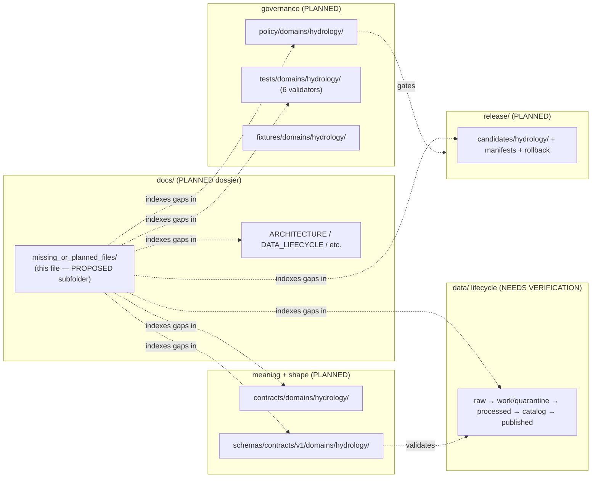

<!-- [KFM_META_BLOCK_V2]
doc_id: kfm://doc/<uuid>            # TODO: assign on admission
title: Hydrology — Missing or Planned Files
type: standard
version: v1
status: draft
owners: <hydrology-lane-steward>   # TODO: confirm owning role(s)
created: 2026-06-06
updated: 2026-06-06
policy_label: public
related:
  - directory-rules.md                                  # §12 Domain Placement Law (path authority)
  - docs/domains/hydrology/README.md                    # PROPOSED — verify presence
  - docs/domains/hydrology/canonical-paths/README.md    # PROPOSED — companion path index (OQ-HYD-PATHS-01)
  - ai-build-operating-contract.md                      # CONTRACT_VERSION = "3.0.0"
tags: [kfm, hydrology, planning, verification-backlog, missing-files, directory-rules]
notes:
  - CONTRACT_VERSION = "3.0.0" pinned per ai-build-operating-contract.md v3.0.
  - PROPOSED parent folder `missing_or_planned_files/` is NOT in Directory Rules §12; requires ADR (OQ-HYD-MPF-01).
  - This is a PLANNING register. Absence here is "not yet verified present," NOT "confirmed absent."
  - All repo-shaped paths PROPOSED / NEEDS VERIFICATION until inspected against a mounted repo.
[/KFM_META_BLOCK_V2] -->

# 💧 Hydrology — Missing or Planned Files

> The Hydrology lane's planning register: artifacts the lane is **expected to ship** under Directory Rules §12, their proposed homes, and what evidence would confirm each one exists.

| Status | Owners | Last updated |
|---|---|---|
| `draft` | `<hydrology-lane-steward>` (TODO) | 2026-06-06 |

> [!IMPORTANT]
> **This is a planning register, not a repo audit.** No repository is mounted in this session, so
> every "missing" entry below means **"not yet verified present"** — it does **not** assert the
> file is absent. Each row is `PLANNED` (expected by doctrine) or `NEEDS VERIFICATION` (checkable
> against a mounted repo). Treat the whole table as a verification worklist, not a fact about
> current repo state.

> [!CAUTION]
> **The parent folder `docs/domains/hydrology/missing_or_planned_files/` is a `PROPOSED`
> convention.** Directory Rules §12 defines the Hydrology lane as `docs/domains/hydrology/` with
> files placed directly inside it; it does **not** sanction a `missing_or_planned_files/`
> subfolder. This document is placed at the requested path, but the subfolder convention is not
> canonical until ratified by ADR. See [OQ-HYD-MPF-01](#open-questions-register).

---

## Quick jump

- [1. Scope](#1-scope)
- [2. Repo fit](#2-repo-fit)
- [3. How to read this register](#3-how-to-read-this-register)
- [4. Status legend](#4-status-legend)
- [5. Doctrine documents (lane dossier)](#5-doctrine-documents-lane-dossier)
- [6. Contracts & schemas](#6-contracts--schemas)
- [7. Policy & sensitivity](#7-policy--sensitivity)
- [8. Pipelines & connectors](#8-pipelines--connectors)
- [9. Validators, tests & fixtures](#9-validators-tests--fixtures)
- [10. Lifecycle data & catalog](#10-lifecycle-data--catalog)
- [11. API & map-UI surfaces](#11-api--map-ui-surfaces)
- [12. Release, correction & rollback](#12-release-correction--rollback)
- [13. Diagram — coverage by responsibility root](#13-diagram--coverage-by-responsibility-root)
- [14. Verification backlog (atlas N.)](#14-verification-backlog-atlas-n)
- [15. Suggested build order](#15-suggested-build-order)
- [Open questions register](#open-questions-register)
- [Open verification backlog](#open-verification-backlog)
- [Changelog](#changelog-v0--v1)
- [Definition of done](#definition-of-done)
- [Related docs](#related-docs)

---

## 1. Scope

This document enumerates the files the **Hydrology lane** is expected to carry to satisfy the
standard domain dossier pattern and the lifecycle/governance invariants — and flags which of them
are not yet confirmed present. It exists so a contributor can see, at a glance, *what the lane
still owes the repository* and *what proof would close each gap*.

It does **not** create those files, assert their current absence, or redefine where they belong.
Placement comes from `directory-rules.md` §12 (`CONFIRMED` as a rule); presence is
`NEEDS VERIFICATION` until a mounted repo is inspected.

> [!NOTE]
> Directory Rules win on every path question. If any proposed home here ever diverges from the
> Rules, the Rules are authoritative and the divergence is logged in
> `docs/registers/DRIFT_REGISTER.md`.

[↑ Back to top](#top)

---

## 2. Repo fit

| | Path | Status |
|---|---|---|
| **This file** | `docs/domains/hydrology/missing_or_planned_files/README.md` | `PROPOSED` (subfolder convention, OQ-HYD-MPF-01) |
| **Lane index (upstream)** | `docs/domains/hydrology/README.md` | `PROPOSED` — verify |
| **Companion path index** | `docs/domains/hydrology/canonical-paths/README.md` | `PROPOSED` — verify |
| **Placement authority** | `directory-rules.md` §12 | `CONFIRMED` doctrine |
| **Object/source/verification source** | Hydrology atlas chapter (Domains Culmination Atlas) | `CONFIRMED` doctrine source |

**Upstream:** the lane README and the canonical-paths index define scope and homes. **Downstream:**
the responsibility-root lane segments listed below are where each planned file actually lands;
this register only points at them.

[↑ Back to top](#top)

---

## 3. How to read this register

Each section maps to one responsibility root or lifecycle area. For every expected artifact:

- **Artifact** — what the lane is expected to ship.
- **Proposed home** — the Directory-Rules §12 path (`hydrology` is a *segment*, never a root).
- **Status** — `PLANNED` or `NEEDS VERIFICATION` (see [§4](#4-status-legend)).
- **Evidence that would settle it** — what to inspect in a mounted repo to confirm presence.

The catch-all evidence phrase used throughout — *"mounted repo files, schemas, registry entries,
tests, logs, emitted artifacts, review records, or release manifests"* — mirrors the atlas
verification-backlog convention.

## 4. Status legend

| Label | Meaning here |
|---|---|
| `PLANNED` | Doctrine expects this artifact; no presence claim is made either way. |
| `NEEDS VERIFICATION` | Checkable against a mounted repo; not yet checked this session. |
| `CONFIRMED` | (Reserved) Would require this-session repo evidence — **none available now.** |

> [!NOTE]
> No row is marked `CONFIRMED` present in this draft. Promoting any row to `CONFIRMED` requires
> inspecting a mounted repository in the session that makes the claim. Cross-session memory does
> not count.

[↑ Back to top](#top)

---

## 5. Doctrine documents (lane dossier)

Home: `docs/domains/hydrology/`. These are the human-facing lane docs that complete the standard
dossier pattern.

| Artifact | Proposed home | Status | Evidence that would settle it |
|---|---|---|---|
| Lane `README.md` (index) | `docs/domains/hydrology/README.md` | `NEEDS VERIFICATION` | repo file presence + links to siblings |
| `ARCHITECTURE.md` | `docs/domains/hydrology/ARCHITECTURE.md` | `PLANNED` | repo file presence |
| `CANONICAL_PATHS` (index) | `docs/domains/hydrology/canonical-paths/README.md` *(or flat `CANONICAL_PATHS.md`)* | `NEEDS VERIFICATION` | repo file presence; resolve OQ-HYD-PATHS-02 |
| `DATA_LIFECYCLE.md` | `docs/domains/hydrology/DATA_LIFECYCLE.md` | `PLANNED` | repo file presence |
| `IDENTITY_MODEL.md` | `docs/domains/hydrology/IDENTITY_MODEL.md` | `PLANNED` | repo file; identity-rule basis |
| `SOURCE_REGISTRY.md` | `docs/domains/hydrology/SOURCE_REGISTRY.md` | `PLANNED` | repo file; source families (§8) |
| `SENSITIVITY.md` / posture | `docs/domains/hydrology/SENSITIVITY.md` | `PLANNED` | repo file; §23.2 matrix linkage |
| `MAP_UI_CONTRACTS.md` | `docs/domains/hydrology/MAP_UI_CONTRACTS.md` | `PLANNED` | repo file; LayerManifest refs |
| `API_CONTRACTS.md` | `docs/domains/hydrology/API_CONTRACTS.md` | `PLANNED` | repo file; DTO names (§11) |
| `VERIFICATION_BACKLOG.md` | `docs/domains/hydrology/VERIFICATION_BACKLOG.md` | `PLANNED` | repo file; mirrors §14 |
| `PUBLICATION_AND_ROLLBACK.md` | `docs/domains/hydrology/PUBLICATION_AND_ROLLBACK.md` | `PLANNED` | repo file; ReleaseManifest refs |
| `RELEASE_INDEX.md` | `docs/domains/hydrology/RELEASE_INDEX.md` | `PLANNED` | repo file |
| This register | `docs/domains/hydrology/missing_or_planned_files/README.md` | `PROPOSED` (OQ-HYD-MPF-01) | ADR ratifying subfolder |

> [!NOTE]
> The dossier file set above is the **lane-standard pattern** observed across KFM domains, applied
> to Hydrology — it is `INFERRED` from that pattern, not a verbatim list from Directory Rules. Exact
> filenames and casing per the lane README are `NEEDS VERIFICATION`.

[↑ Back to top](#top)

---

## 6. Contracts & schemas

`CONFIRMED` doctrine: object **meaning** lives under `contracts/`; object **shape** lives under the
single schema home `schemas/contracts/v1/...` (ADR-0001). The object families below are
`CONFIRMED` as the lane's families (atlas E.); the per-object files are `PLANNED`.

| Object family | Meaning (`contracts/domains/hydrology/`) | Shape (`schemas/contracts/v1/domains/hydrology/`) | Status |
|---|---|---|---|
| `Watershed`, `HUCUnit` | `*.md` | `*.schema.json` | `PLANNED` |
| `HydroFeature`, `ReachIdentity` | `*.md` | `*.schema.json` | `PLANNED` |
| `GaugeSite` | `*.md` | `*.schema.json` | `PLANNED` |
| `FlowObservation`, `WaterLevelObservation` | `*.md` | `*.schema.json` | `PLANNED` |
| `Water Quality Observation` | `*.md` | `*.schema.json` | `PLANNED` |
| `Groundwater Well` | `*.md` | `*.schema.json` | `PLANNED` |
| `NFHLZone` / `Flood Context` | `*.md` | `*.schema.json` | `PLANNED` |
| `Observed Flood Event` | `*.md` | `*.schema.json` | `PLANNED` |
| `Hydrograph`, `UpstreamTrace` | `*.md` | `*.schema.json` | `PLANNED` |
| `HydrologyDecisionEnvelope` (DTO) | `*.md` | `*.schema.json` | `PLANNED` |

> [!IMPORTANT]
> Do **not** create a second schema home (e.g., under `contracts/` or `jsonschema/`). Shape is
> canonical only under `schemas/contracts/v1/...` per ADR-0001; `contracts/` holds Markdown meaning.

[↑ Back to top](#top)

---

## 7. Policy & sensitivity

Home: `policy/domains/hydrology/` (and shared `policy/sensitivity/...` where relevant). `CONFIRMED`
posture: Hydrology denies unclear rights and flood-role misuse; **NFHL-as-observed-flood claims are
denied**; infrastructure and private-property implications require review; sensitive joins fail
closed.

| Artifact | Proposed home | Status | Evidence that would settle it |
|---|---|---|---|
| Hydrology access/release policy | `policy/domains/hydrology/` | `PLANNED` | policy file + tests |
| NFHL role-separation policy (regulatory ≠ observed) | `policy/domains/hydrology/` | `PLANNED` | policy file + NFHL role-separation test |
| Sensitivity entry (private-land / infrastructure adjacency) | `policy/sensitivity/...` | `NEEDS VERIFICATION` | sensitivity policy entry exists or is missing |
| `RedactionReceipt` schema linkage | `schemas/contracts/v1/...` (shared) | `NEEDS VERIFICATION` | receipt schema home (see ADR-S-03) |

> [!CAUTION]
> Route any sensitive-content disposition (precise coordinates, well/infrastructure-adjacent
> identifiers, private-parcel joins) through the operating-contract **§23.2 sensitive-domain
> matrix** — do not re-derive disposition here. Public release of affected objects is gated;
> generalize/redact before publication and record a `RedactionReceipt`.

[↑ Back to top](#top)

---

## 8. Pipelines & connectors

`CONFIRMED` source families (atlas D.); connector/pipeline files are `PLANNED`. Connectors emit to
`RAW`/`QUARANTINE`; pipelines promote; **watchers emit candidates and receipts only**
(watcher-as-non-publisher).

| Artifact | Proposed home | Status |
|---|---|---|
| USGS WBD / HUC12 connector | `connectors/...` → `data/raw/hydrology/` | `PLANNED` |
| NHDPlus HR / 3DHP hydrography connector | `connectors/...` | `PLANNED` |
| USGS Water Data / NWIS connector | `connectors/...` | `PLANNED` |
| FEMA NFHL / MSC connector | `connectors/...` | `PLANNED` |
| 3DEP terrain connector | `connectors/...` | `PLANNED` |
| Water-quality / groundwater connectors | `connectors/...` | `PLANNED` |
| Historical observed-flood connector | `connectors/...` | `PLANNED` |
| Hydrology pipeline logic | `pipelines/domains/hydrology/` | `PLANNED` |
| Hydrology pipeline spec | `pipeline_specs/hydrology/` | `PLANNED` |

> [!NOTE]
> Source **rights and current terms** for every family above are `NEEDS VERIFICATION` per the
> atlas (sensitive joins fail closed). A connector must not be activated until its rights posture
> is settled.

[↑ Back to top](#top)

---

## 9. Validators, tests & fixtures

These six are named `PROPOSED` in the atlas (K.) and are the lane's core enforceability surface.
Homes follow §12: validators under `tools/validators/...`, tests under `tests/domains/hydrology/`,
fixtures under `fixtures/domains/hydrology/{valid,invalid}/`.

| Validator / test / fixture | Proposed home | Status |
|---|---|---|
| HUC12 fingerprint validation | `tools/validators/...` + `tests/domains/hydrology/` | `PLANNED` |
| NHDPlus HR identity-ambiguity tests (ABSTAIN behavior) | `tests/domains/hydrology/` | `PLANNED` |
| USGS parameter / unit / qualifier / no-data tests | `tests/domains/hydrology/` | `PLANNED` |
| NFHL role-separation tests | `tests/domains/hydrology/` | `PLANNED` |
| EvidenceBundle closure tests | `tests/domains/hydrology/` | `PLANNED` |
| No-network hydrology proof fixture | `fixtures/domains/hydrology/...` | `PLANNED` |

> [!TIP]
> The no-network proof fixture is the keystone for the **Hydrology proof-bearing thin slice**
> (HUC12 / gauge / NFHL fixture → EvidenceBundle → Evidence Drawer → rollback). Build it early; it
> makes the rest of the lane demonstrable without live sources.

[↑ Back to top](#top)

---

## 10. Lifecycle data & catalog

`CONFIRMED` doctrine / `PROPOSED` lane application: Hydrology follows
`RAW → WORK / QUARANTINE → PROCESSED → CATALOG / TRIPLET → PUBLISHED`. The directories below are
expected per §12; presence is `NEEDS VERIFICATION`.

| Phase / artifact | Proposed home | Status |
|---|---|---|
| `RAW` | `data/raw/hydrology/` | `NEEDS VERIFICATION` |
| `WORK` / `QUARANTINE` | `data/work/hydrology/` · `data/quarantine/hydrology/` | `NEEDS VERIFICATION` |
| `PROCESSED` | `data/processed/hydrology/` | `NEEDS VERIFICATION` |
| `CATALOG` / EvidenceBundles | `data/catalog/domain/hydrology/` | `NEEDS VERIFICATION` |
| Graph / triplet projection (if used) | `data/triplets/...` | `NEEDS VERIFICATION` (OQ-HYD-MPF-03) |
| `PUBLISHED` layer artifacts | `data/published/layers/hydrology/` | `NEEDS VERIFICATION` |
| Source registry slice | `data/registry/sources/hydrology/` | `NEEDS VERIFICATION` |

[↑ Back to top](#top)

---

## 11. API & map-UI surfaces

`CONFIRMED` doctrine / `PROPOSED` surfaces (atlas J.). Exact routes are `UNKNOWN`. All outcomes are
finite: `ANSWER / ABSTAIN / DENY / ERROR`. Public reads go through `apps/governed-api/`.

| Surface | DTO / artifact | Status |
|---|---|---|
| Hydrology feature/detail resolver | `HydrologyDecisionEnvelope` | `PLANNED`; route `UNKNOWN` |
| Hydrology layer manifest resolver | `LayerManifest` / domain layer descriptor | `PLANNED`; public-safe only |
| Hydrology Evidence Drawer payload | `EvidenceDrawerPayload` + `EvidenceBundle` projection | `PLANNED`; evidence + policy filtered |
| Hydrology Focus Mode answer | `RuntimeResponseEnvelope` + `AIReceipt` | `PLANNED`; AI never root truth |

> [!IMPORTANT]
> No fluent AI answer reaches the UI without envelope validation, and no public client may read
> `data/processed/hydrology/` directly. The renderer is a carrier, not a publication authority.

[↑ Back to top](#top)

---

## 12. Release, correction & rollback

`CONFIRMED` doctrine / `PROPOSED` implementation: Hydrology publication requires `ReleaseManifest`,
`EvidenceBundle`, validation/policy support, review state where required, correction path,
stale-state rule, and rollback target.

| Artifact | Proposed home | Status |
|---|---|---|
| Release candidate dossier | `release/candidates/hydrology/` | `PLANNED` |
| `ReleaseManifest` (per release) | `release/manifests/...` | `PLANNED` |
| `RollbackCard` / rollback target | `release/...` | `PLANNED` |
| `CorrectionNotice` path | `release/...` / `contracts/correction/...` | `PLANNED` |
| `GENERATED_RECEIPT.json` for this doc | (CI-wired; see Section 2 of delivery notes) | `PLANNED` |

[↑ Back to top](#top)

---

## 13. Diagram — coverage by responsibility root

> [!NOTE]
> The diagram shows which responsibility roots this register tracks, per Directory Rules §12. It is
> structural; it does not claim any directory currently exists (that is `NEEDS VERIFICATION`).

[↑ Back to top](#top)

---

## 14. Verification backlog (atlas N.)

These four items are carried verbatim from the Hydrology atlas chapter's *N. Verification backlog
and open questions* and are the authoritative gap list for the lane. Status `NEEDS VERIFICATION`
for all.

| Item to verify | Evidence that would settle it | Status |
|---|---|---|
| Verify HUC12 fixture and fingerprint rule. | mounted repo files, schemas, registry entries, tests, logs, emitted artifacts, review records, or release manifests | `NEEDS VERIFICATION` |
| Verify NHDPlus HR crosswalk and ambiguity ABSTAIN behavior. | mounted repo files, schemas, registry entries, tests, logs, emitted artifacts, review records, or release manifests | `NEEDS VERIFICATION` |
| Verify USGS Water normalizer and NFHL source-role separation. | mounted repo files, schemas, registry entries, tests, logs, emitted artifacts, review records, or release manifests | `NEEDS VERIFICATION` |
| Verify hydrology API and MapLibre layer adapter. | mounted repo files, schemas, registry entries, tests, logs, emitted artifacts, review records, or release manifests | `NEEDS VERIFICATION` |

[↑ Back to top](#top)

---

## 15. Suggested build order

`PROPOSED` sequence, aligned to the governance-spine-first roadmap (build governance before public
features). Smallest reversible step first.

<strong>Expand suggested build order</strong>

1. **Doctrine spine** — lane `README.md`, `SOURCE_REGISTRY.md`, this register, `VERIFICATION_BACKLOG.md`.
2. **Schemas + no-network fixtures** — core object-family schemas under the single schema home; `valid/`+`invalid/` fixtures (incl. negative cases: public RAW access, missing policy label, model output as evidence, NFHL-as-observed).
3. **Validators + policy gates** — the six §9 validators with reason-coded `DENY/ABSTAIN/ERROR/HOLD`; NFHL role-separation policy.
4. **No-network dry run** — EvidenceBundle closure with no publication target.
5. **Hydrology proof-bearing thin slice** — HUC12 / gauge / NFHL fixture → EvidenceBundle → Evidence Drawer → rollback. *Never label NFHL as observed flood.*
6. **Governed API + map-UI adapter** — resolvers behind `apps/governed-api/`; `LayerManifest` release.
7. **Release + rollback** — `ReleaseManifest`, correction path, rollback target.

[↑ Back to top](#top)

---

## Open questions register

| ID | Question | Owner role | Resolution path |
|---|---|---|---|
| OQ-HYD-MPF-01 | Is `docs/domains/<domain>/missing_or_planned_files/` a sanctioned subfolder? It is **not** in Directory Rules §12. | Docs steward + Directory Rules owner | ADR ratifying (or rejecting) the subfolder; flat `MISSING_OR_PLANNED_FILES.md` is the alternative. |
| OQ-HYD-MPF-02 | Exact lane-standard dossier filenames/casing (§5) — confirm against the lane README. | Hydrology lane steward | Mounted-repo scan of `docs/domains/hydrology/`. |
| OQ-HYD-MPF-03 | Does Hydrology use `data/triplets/` graph projections in addition to `data/catalog/domain/hydrology/`? | Hydrology lane steward | Repo inspection of `data/triplets/`. |
| OQ-HYD-MPF-04 | Receipt-schema home for `RedactionReceipt` / `GENERATED_RECEIPT` (shared vs per-domain). | Schema owner | Tracked as ADR-S-03 (receipt schema layout). |
| OQ-HYD-MPF-05 | Confirm no Hydrology slug drift (docs lane vs schema path) as exists for Roads/Settlements. | Hydrology lane steward | Mounted-repo scan of `schemas/contracts/v1/domains/`. |

## Open verification backlog

These items remain `NEEDS VERIFICATION` before promotion from `draft` to `published`:

1. Inspect a mounted repo and reclassify every `NEEDS VERIFICATION` row as present (`CONFIRMED`) or genuinely missing.
2. Confirm the lane README exists and links to this register.
3. Confirm the single schema home `schemas/contracts/v1/domains/hydrology/` (ADR-0001).
4. Confirm `data/triplets/` usage (OQ-HYD-MPF-03).
5. Confirm receipt-schema home (OQ-HYD-MPF-04 / ADR-S-03).
6. Confirm sensitivity policy entry presence for private-land/infrastructure adjacency.
7. Resolve the `missing_or_planned_files/` subfolder convention via ADR (OQ-HYD-MPF-01).
8. Confirm owning role(s); replace the `<hydrology-lane-steward>` placeholder.

## Changelog v0 → v1

| Change | Type (per contract §37) | Reason |
|---|---|---|
| Initial Hydrology missing/planned-files register | new | Single worklist of expected lane artifacts + verification evidence. |
| Carried atlas N. verification backlog verbatim (§14) | new | Authoritative gap list for the lane. |
| Flagged `missing_or_planned_files/` subfolder as PROPOSED | new (governance note) | Subfolder is not in Directory Rules §12; requires ADR. |

> **Backward compatibility.** New file; no anchors broken. If OQ-HYD-MPF-01 resolves toward a flat
> `MISSING_OR_PLANNED_FILES.md`, redirect (do not delete) and log the move in
> `docs/registers/DRIFT_REGISTER.md`.

## Definition of done

This document is done enough to enter the repository when:

- it is placed according to Directory Rules **or** an ADR sanctions the `missing_or_planned_files/` subfolder (OQ-HYD-MPF-01);
- a docs steward and the Hydrology lane steward review it;
- it is linked from `docs/domains/hydrology/README.md`;
- it does not conflict with accepted ADRs (esp. ADR-0001 schema home);
- the subfolder convention and any flat-file collision are logged in `docs/registers/DRIFT_REGISTER.md` until resolved;
- the `GENERATED_RECEIPT.json` planned in delivery notes is wired into CI with `human_review.state` transitioning from `pending` to `approved`;
- future changes follow the operating contract's §37 lifecycle.

---

## Related docs

- `directory-rules.md` — §12 Domain Placement Law (path authority)
- `docs/domains/hydrology/README.md` — lane index *(PROPOSED — verify)*
- `docs/domains/hydrology/canonical-paths/README.md` — companion path index *(PROPOSED — verify)*
- `docs/domains/hydrology/VERIFICATION_BACKLOG.md` — lane verification backlog *(PLANNED)*
- `ai-build-operating-contract.md` — `CONTRACT_VERSION = "3.0.0"`; §23.2 sensitive-domain matrix
- `docs/registers/DRIFT_REGISTER.md` · `docs/registers/VERIFICATION_BACKLOG.md` *(TODO — verify)*

*Last updated: 2026-06-06.*

[↑ Back to top](#top)
