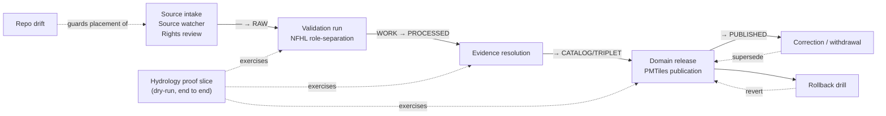

<!-- [KFM_META_BLOCK_V2]
doc_id: kfm://doc/<uuid>            # TODO: assign on admission
title: Hydrology — Runbooks Index
type: standard
version: v1
status: draft
owners: <hydrology-lane-steward>, <release-steward>   # TODO: confirm owning role(s)
created: 2026-06-06
updated: 2026-06-06
policy_label: public
related:
  - directory-rules.md                                  # §6.1.b runbooks placement contract; §12 Domain Placement Law
  - docs/domains/hydrology/README.md                    # PROPOSED — verify presence
  - docs/runbooks/                                       # CANONICAL runbook home per §6.1.b (see PLACEMENT CONFLICT)
  - KFM_Unified_Implementation_Architecture_Build_Manual.md   # §23 Runbooks to create
  - ai-build-operating-contract.md                      # CONTRACT_VERSION = "3.0.0"
tags: [kfm, hydrology, runbooks, operations, directory-rules]
notes:
  - CONTRACT_VERSION = "3.0.0" pinned per ai-build-operating-contract.md v3.0.
  - PLACEMENT CONFLICT — §6.1.b names docs/runbooks/ (not docs/domains/<domain>/runbooks/) as the runbook home. CONFLICTED (OQ-HYD-RB-01).
  - Subfolder convention (Pattern A vs B) is OPEN-DR-02; ADR needed.
  - All runbook files are PLANNED / NEEDS VERIFICATION until inspected against a mounted repo.
[/KFM_META_BLOCK_V2] -->

<a id="top"></a>

# 💧 Hydrology — Runbooks Index

> The Hydrology lane's operational playbooks: how to intake sources, promote through the lifecycle, publish the proof slice, and correct or roll back — each one evidence-first and fail-closed.

[](#)
[](#)
[](#)
[](#)
[-red)](#)
[](#)

| Status | Owners | Last updated |
|---|---|---|
| `draft` | `<hydrology-lane-steward>`, `<release-steward>` (TODO) | 2026-06-06 |

> [!WARNING]
> **Placement conflict — read before relying on this path.** Directory Rules **§6.1.b** names
> **`docs/runbooks/`** as the canonical home for operational procedures (source refresh, rollback
> drills, validation runs, incident response, steward review). It does **not** sanction
> `docs/domains/<domain>/runbooks/`. The requested path for this file therefore **conflicts** with
> the runbooks placement contract. This index is delivered at the requested path, but the
> divergence is `CONFLICTED` and must be resolved by ADR — see [OQ-HYD-RB-01](#open-questions-register).
> A compliant alternative is to keep this index at `docs/domains/hydrology/` and place the actual
> runbooks under `docs/runbooks/` (Pattern A: `docs/runbooks/hydrology/...`).

> [!CAUTION]
> The runbook **subfolder convention itself is unresolved (OPEN-DR-02).** Pattern A
> (`docs/runbooks/hydrology/<RUNBOOK>.md`) vs Pattern B (flat with domain prefix,
> `docs/runbooks/hydrology_source_refresh.md`). An ADR is needed to freeze the choice; new authors
> SHOULD prefer Pattern A. See [OQ-HYD-RB-02](#open-questions-register).

---

## Quick jump

- [1. Scope](#1-scope)
- [2. Placement & repo fit](#2-placement--repo-fit)
- [3. How runbooks work in KFM](#3-how-runbooks-work-in-kfm)
- [4. The lifecycle spine these runbooks operate on](#4-the-lifecycle-spine-these-runbooks-operate-on)
- [5. Hydrology runbook catalog](#5-hydrology-runbook-catalog)
- [6. Diagram — runbooks across the lifecycle](#6-diagram--runbooks-across-the-lifecycle)
- [7. Cross-cutting rules every Hydrology runbook honors](#7-cross-cutting-rules-every-hydrology-runbook-honors)
- [8. Hydrology-specific hazards each runbook must guard](#8-hydrology-specific-hazards-each-runbook-must-guard)
- [9. Gate-failure reason codes](#9-gate-failure-reason-codes)
- [Open questions register](#open-questions-register)
- [Open verification backlog](#open-verification-backlog)
- [Changelog](#changelog-v0--v1)
- [Definition of done](#definition-of-done)
- [Related docs](#related-docs)

---

## 1. Scope

This is the **index** for the Hydrology lane's operational runbooks. It lists each runbook the lane
is expected to carry, what it does, when to run it, and which governance gate it closes. It is an
orientation and routing document — it does **not** contain the step-by-step procedures themselves
(those are separate runbook files), and it does **not** encode policy (`policy/`) or object meaning
(`contracts/`).

**Status of the rules below:** `CONFIRMED` doctrine. **Status of any runbook file's presence:**
`PLANNED` / `NEEDS VERIFICATION` until inspected against a mounted repo.

[↑ Back to top](#top)

---

## 2. Placement & repo fit

| | Path | Status |
|---|---|---|
| **This index** | `docs/domains/hydrology/runbooks/README.md` | `CONFLICTED` with §6.1.b (OQ-HYD-RB-01) |
| **Canonical runbook home** | `docs/runbooks/` (Pattern A: `docs/runbooks/hydrology/`) | `CONFIRMED` rule (§6.1.b) |
| **Lane index (upstream)** | `docs/domains/hydrology/README.md` | `PROPOSED` — verify |
| **Placement authority** | `directory-rules.md` §6.1.b, §12, §18 OPEN-DR-02 | `CONFIRMED` doctrine |
| **Runbook catalog source** | Build Manual §23 ("Runbooks to create") | `CONFIRMED` doctrine source |

> [!NOTE]
> Runbooks **explain how to operate**; they live under `docs/runbooks/`. Object **meaning** lives
> in `contracts/`, machine **shape** in `schemas/`, allow/deny **decisions** in `policy/`, and
> **proof** in `tests/`. A runbook must not absorb any of those layers.

[↑ Back to top](#top)

---

## 3. How runbooks work in KFM

A KFM runbook is a deterministic operating procedure that drives a governed transition and leaves
**process memory** behind (receipts). Every Hydrology runbook:

- declares the **gate** it serves and the **receipt(s)** it emits;
- treats promotion as a **governed state transition**, never a manual file move;
- fails **closed** — if a required artifact, review, or policy decision is missing, the prior state
  is preserved;
- returns finite outcomes at gates: `ALLOW / DENY / HOLD / ERROR` (validators: `PASS / FAIL / ERROR`).

[↑ Back to top](#top)

---

## 4. The lifecycle spine these runbooks operate on

`CONFIRMED` doctrine: every transition is closed only when (i) required artifacts exist, (ii) each
required artifact *resolves* its dependencies (`EvidenceRef → EvidenceBundle`, `source_id →
SourceDescriptor`), and (iii) the policy gate recorded its decision.

```text
            Admission        Normalization        Validation        Catalog          Release
   (— → RAW) ───────► (RAW → WORK/QUARANTINE) ──► (WORK → PROCESSED) ──► (→ CATALOG/TRIPLET) ──► (→ PUBLISHED)
        │                      │                       │                    │                      │
   SourceDescriptor    TransformReceipt          ValidationReport      CatalogMatrix         ReleaseManifest
        + hash         + PolicyDecision          + RedactionReceipt    + EvidenceBundle      + rollback target
                       (QUARANTINE on fail)      (if sensitivity)      (proof closure)       + ReviewRecord
                                                                                                   │
                                                              Correction (PUBLISHED → PUBLISHED′)  │  Rollback (→ prior release)
                                                              CorrectionNotice + invalidation list │  RollbackCard + CorrectionNotice
```

[↑ Back to top](#top)

---

## 5. Hydrology runbook catalog

Each runbook is `PLANNED` for the lane. Proposed homes follow §6.1.b Pattern A
(`docs/runbooks/hydrology/`). Presence is `NEEDS VERIFICATION`.

| Runbook | Purpose (when to run) | Gate served | Key receipt(s) | Status |
|---|---|---|---|---|
| **Source intake** | Admit / deny / quarantine a new Hydrology source (WBD/HUC, NWIS, NFHL, NHDPlus HR, 3DEP). | Admission (— → RAW) | `SourceIntakeRecord`, `SourceDescriptor` | `PLANNED` |
| **Source watcher** | Configure a material-change watcher for a source family; emit candidates only. | Pre-RAW / Admission | `EventRunReceipt` | `PLANNED` |
| **Rights review** | Resolve license / terms / attribution / public-release posture (all families are rights `NEEDS VERIFICATION`). | Admission / Validation / Release | `ReviewRecord`, `PolicyDecision` | `PLANNED` |
| **NFHL role-separation** | Enforce that NFHL is regulatory **context**, never an observed-flood claim. | Validation / Catalog | `PolicyDecision`, `ValidationReport` | `PLANNED` |
| **Validation run** | Run the six lane validators (HUC12 fingerprint, NHDPlus identity, USGS parameter/unit, NFHL role, EvidenceBundle closure, no-network proof). | Validation (WORK → PROCESSED) | `ValidationReport` | `PLANNED` |
| **Evidence resolution** | Resolve `EvidenceRef → EvidenceBundle`; close digests. | Catalog closure | `EvidenceBundle`, `CitationValidationReport` | `PLANNED` |
| **Domain release** | Promote a Hydrology layer / report through the release gate; public-safe only. | Release (CATALOG → PUBLISHED) | `ReleaseManifest`, `PromotionReceipt`, `ReviewRecord` | `PLANNED` |
| **PMTiles publication** | Build, attest, host, verify Range/CORS for tiled Hydrology layers; rollback path. | Release | `TileArtifactManifest`, `ReleaseManifest` | `PLANNED` |
| **Hydrology proof slice** | Run the thin-slice end to end: HUC12 / gauge / NFHL fixture → EvidenceBundle → Evidence Drawer → rollback. *Never label NFHL observed flood.* | All gates (dry-run) | full receipt chain | `PLANNED` |
| **Correction / withdrawal** | Issue a `CorrectionNotice`, supersede a claim, invalidate caches, announce stale state. | Correction (PUBLISHED → PUBLISHED′) | `CorrectionNotice`, `ReviewRecord` | `PLANNED` |
| **Rollback drill** | Revert a failed release to a prior release; hold current state until rollback validated. | Rollback (→ prior release) | `RollbackCard`, `CorrectionNotice` | `PLANNED` |
| **Repo drift** | Record/resolve a path/schema/policy drift (incl. this index's placement conflict). | n/a (governance) | `DRIFT_REGISTER.md` entry | `PLANNED` |

> [!TIP]
> Build **Source intake → Validation run → Evidence resolution → Hydrology proof slice** first.
> Those four, plus the no-network proof fixture, make the lane demonstrable without activating any
> live USGS / FEMA connector — matching the governance-spine-first roadmap (Phase 5: Hydrology
> proof-bearing thin slice).

[↑ Back to top](#top)

---

## 6. Diagram — runbooks across the lifecycle



> [!NOTE]
> The diagram maps runbooks to the gates they serve; it does not assert any runbook file currently
> exists (that remains `NEEDS VERIFICATION`).

[↑ Back to top](#top)

---

## 7. Cross-cutting rules every Hydrology runbook honors

- **Trust membrane.** No public client, normal UI surface, or released AI surface may reach RAW,
  WORK, QUARANTINE, or canonical stores. Public reads go through `apps/governed-api/`; `PUBLISHED`
  is the only state from which the governed API emits `ANSWER`.
- **Watcher-as-non-publisher.** Connectors emit to `RAW`/`QUARANTINE`; watchers emit candidates and
  receipts only; pipelines promote.
- **Cite-or-abstain.** Any answer surface returns `ANSWER / ABSTAIN / DENY / ERROR`; uncited prose
  is forbidden.
- **Promotion is a state transition,** recorded with receipts — never a manual move.
- **Separation of duties** at release: release authority distinct from the original author when
  materiality applies.

[↑ Back to top](#top)

---

## 8. Hydrology-specific hazards each runbook must guard

| Hazard | Where it bites | Required guard |
|---|---|---|
| **NFHL treated as observed flood** | Validation / release / AI answer | Deny the claim; NFHL is regulatory context only. Proof slice rule: *never label NFHL observed flood.* |
| **KFM used as a life-safety alert authority** | Any answer surface | `DENY` — emergency instructions / alert authority are out of scope (deny-by-default register). |
| **Unresolved source rights** | Admission / release | All families are rights `NEEDS VERIFICATION`; do not activate a connector until rights resolve; sensitive joins fail closed. |
| **Regulatory vs observed confusion** | Catalog / map layer | Keep source roles separate; preserve role at admission (anti-collapse). |
| **Stale time series / provisional gauge data** | Publication | Stale-state rule + correction path; mark provisional. |
| **Watershed boundary versioning** | Identity / catalog | HUC12 fingerprint validation; pin geometry version. |
| **Private-land / infrastructure adjacency** | Publication | Route through operating-contract §23.2; generalize/redact; `RedactionReceipt` + steward review. |

> [!CAUTION]
> Sensitive-content disposition (precise coordinates, well or infrastructure-adjacent identifiers,
> private-parcel joins) is governed by the operating-contract **§23.2 sensitive-domain matrix** —
> runbooks apply it, they do not re-derive it. Public exposure of affected detail is denied by
> default and requires steward review plus a transform receipt.

[↑ Back to top](#top)

---

## 9. Gate-failure reason codes

`PROPOSED` catalog. When a runbook's gate fails closed, it records one of these and routes to the
recovery path.

<details>
<summary><strong>Expand reason-code catalog</strong></summary>

| Failure family | Reason code (`PROPOSED`) | Fires at | Recovery |
|---|---|---|---|
| Missing required artifact | `MISSING_RECEIPT`, `MISSING_EVIDENCE`, `MISSING_REVIEW` | Normalization / Validation / Catalog / Release | Re-emit receipt; re-run review; re-validate. |
| Schema / contract mismatch | `SCHEMA_MISMATCH`, `CONTRACT_DRIFT` | Normalization / Validation | Schema fix and/or ADR; re-run validator. |
| Rights / sensitivity unresolved | `RIGHTS_UNKNOWN`, `SENSITIVITY_UNRESOLVED` | Admission / Validation / Catalog / Release | Steward review; rights resolution; tier reassignment. |
| Source-role collapse risk | `ROLE_COLLAPSE`, `ROLE_DOWNCAST_FORBIDDEN` | Validation / Catalog / Release | Restore source role; refuse upcast. |
| Review state inadequate | `REVIEW_NEEDED`, `REVIEW_INSUFFICIENT`, `REVIEW_REJECTED` | Catalog / Release | Run required review; supply `ReviewRecord`. |
| Release infrastructure error | `RELEASE_MANIFEST_INVALID`, `ROLLBACK_TARGET_MISSING` | Release | Manifest fix; supply rollback target. |

</details>

[↑ Back to top](#top)

---

## Open questions register

| ID | Question | Owner role | Resolution path |
|---|---|---|---|
| OQ-HYD-RB-01 | This index sits at `docs/domains/hydrology/runbooks/`, but §6.1.b names `docs/runbooks/` as the runbook home. Which is canonical? | Docs steward + Directory Rules owner | ADR resolving runbook placement; until then `CONFLICTED`, logged in `DRIFT_REGISTER.md`. Likely outcome: index stays in the lane, runbook files live under `docs/runbooks/hydrology/`. |
| OQ-HYD-RB-02 | Runbook subfolder convention: Pattern A (`docs/runbooks/hydrology/<RUNBOOK>.md`) vs Pattern B (flat prefixed). | Docs steward | Tracked as OPEN-DR-02; ADR to freeze. Prefer Pattern A meanwhile. |
| OQ-HYD-RB-03 | Confirm the canonical runbook filenames/casing for the lane (e.g., `SOURCE_REFRESH_RUNBOOK.md`). | Hydrology lane steward | Mounted-repo scan of `docs/runbooks/`. |
| OQ-HYD-RB-04 | Receipt-schema home for `RedactionReceipt` / `PromotionReceipt` (shared vs per-domain). | Schema owner | Tracked as ADR-S-03 (receipt schema layout). |

## Open verification backlog

These items remain `NEEDS VERIFICATION` before promotion from `draft` to `published`:

1. Resolve the runbook placement conflict via ADR (OQ-HYD-RB-01) and freeze the subfolder convention (OQ-HYD-RB-02 / OPEN-DR-02).
2. Confirm which runbook files already exist under `docs/runbooks/` and reclassify each from `PLANNED` to present.
3. Confirm the lane README exists and links to this index.
4. Confirm the six lane validators (the Validation-run inputs) exist as tests/fixtures.
5. Confirm the no-network proof fixture that the proof-slice runbook depends on.
6. Confirm receipt-schema home (OQ-HYD-RB-04 / ADR-S-03).
7. Confirm owning role(s); replace the `<hydrology-lane-steward>` / `<release-steward>` placeholders.

## Changelog v0 → v1

| Change | Type (per contract §37) | Reason |
|---|---|---|
| Initial Hydrology runbooks index | new | Route operators to the lane's playbooks across the lifecycle. |
| Surfaced runbook placement conflict (§6.1.b) | new (governance note) | Requested path diverges from the canonical `docs/runbooks/` home; CONFLICTED. |
| Catalog mapped to gates + receipts + reason codes | new | Tie each runbook to the transition it closes and what it emits. |

> **Backward compatibility.** New file; no anchors broken. If OQ-HYD-RB-01 resolves toward
> `docs/runbooks/hydrology/`, redirect (do not delete) and log the move in
> `docs/registers/DRIFT_REGISTER.md`.

## Definition of done

This document is done enough to enter the repository when:

- the runbook placement conflict is resolved by ADR, or this index is relocated/cross-linked to comply with §6.1.b (OQ-HYD-RB-01);
- a docs steward and the Hydrology lane / release stewards review it;
- it is linked from `docs/domains/hydrology/README.md` and from `docs/runbooks/`;
- it does not conflict with accepted ADRs (esp. ADR-0001 schema home and the runbook-placement ADR);
- the placement conflict and subfolder convention are logged in `docs/registers/DRIFT_REGISTER.md` until resolved;
- the `GENERATED_RECEIPT.json` planned in delivery notes is wired into CI with `human_review.state` transitioning from `pending` to `approved`;
- future changes follow the operating contract's §37 lifecycle.

---

## Related docs

- `directory-rules.md` — §6.1.b runbooks placement contract; §12 Domain Placement Law; §18 OPEN-DR-02
- `docs/runbooks/` — canonical runbook home *(verify; Pattern A: `docs/runbooks/hydrology/`)*
- `docs/domains/hydrology/README.md` — lane index *(PROPOSED — verify)*
- `KFM_Unified_Implementation_Architecture_Build_Manual.md` — §23 Runbooks to create
- `ai-build-operating-contract.md` — `CONTRACT_VERSION = "3.0.0"`; §23.2 sensitive-domain matrix
- `docs/registers/DRIFT_REGISTER.md` *(TODO — verify)*

*Last updated: 2026-06-06.*

[↑ Back to top](#top)
