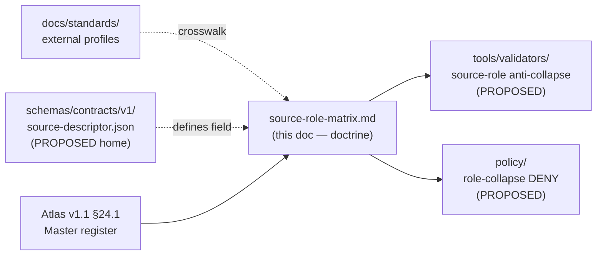
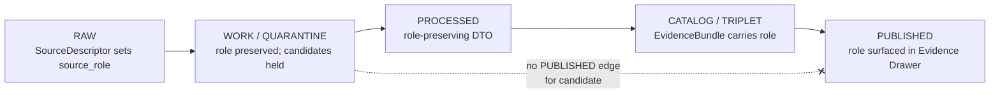

<!-- [KFM_META_BLOCK_V2]
doc_id: kfm://doc/hydrology-source-role-matrix
title: Hydrology Source-Role Matrix
type: standard
version: v1
status: draft
owners: <Hydrology domain steward — PLACEHOLDER>, <Source steward — PLACEHOLDER>
created: 2026-06-06
updated: 2026-06-06
policy_label: public
related: [ai-build-operating-contract.md, directory-rules.md, docs/domains/hydrology/README.md, schemas/contracts/v1/source/source-descriptor.json]
tags: [kfm, hydrology, source-role, anti-collapse, governance]
notes: [CONTRACT_VERSION = "3.0.0"; sources Atlas v1.1 §24.1 canonical roles + Hydrology dossier source families; schema home PROPOSED per ADR-0001]
[/KFM_META_BLOCK_V2] -->

<a id="top"></a>

# 💧 Hydrology Source-Role Matrix

> Which source role each Hydrology source family carries at admission, what it may legitimately become downstream, and where collapsing those roles is denied.


**Status:** `draft` · **Owners:** `<Hydrology domain steward — PLACEHOLDER>` / `<Source steward — PLACEHOLDER>` · **Updated:** 2026-06-06
**`CONTRACT_VERSION = "3.0.0"`** — governed by [`ai-build-operating-contract.md`](../../../ai-build-operating-contract.md) and [`directory-rules.md`](../../../directory-rules.md).

---

## Quick jump

- [1. Scope](#1-scope)
- [2. Repo fit](#2-repo-fit)
- [3. The seven canonical source roles](#3-the-seven-canonical-source-roles)
- [4. Hydrology source families → role](#4-hydrology-source-families--role)
- [5. Anti-collapse DENY conditions](#5-anti-collapse-deny-conditions-hydrology-cuts)
- [6. Role flow and the lifecycle](#6-role-flow-and-the-lifecycle)
- [7. SourceDescriptor field mapping](#7-sourcedescriptor-field-mapping-proposed)
- [8. Sensitivity and rights interaction](#8-sensitivity-and-rights-interaction)
- [9. Validators and tests](#9-validators-and-tests-proposed)
- [Open questions register](#open-questions-register)
- [Open verification backlog](#open-verification-backlog)
- [Changelog](#changelog-v0--v1)
- [Definition of done](#definition-of-done)
- [Related docs](#related-docs)

---

## 1. Scope

This matrix maps each **Hydrology** source family to its **source role** — the first-class
identity attribute set at admission and preserved through every promotion. It is the
Hydrology-lane projection of the cross-cutting **Master Source-Role Anti-Collapse Register**
(Atlas v1.1 §24.1). `[ENCY] [DOM-HYD]` — *CONFIRMED doctrine.*

> [!IMPORTANT]
> **Source role is fixed at admission and never upgraded by promotion.** Promotion does
> not turn a model into an observation, a regulatory determination into an observed event,
> an aggregate into a per-place record, or a candidate into a verified record. Those are
> *separate governed transitions* with their own evidence and review requirements.
> `[ENCY] [DIRRULES]` — *CONFIRMED doctrine.*

**What belongs here:** the role taxonomy as it applies to Hydrology source families;
the DENY conditions for Hydrology-specific role collapse; the descriptor fields that
carry role through the pipeline.

**What does not belong here:** object-family meaning (lives in `contracts/`), field-level
schema shape (lives in `schemas/`), and admit/deny/redact decisions as enforced policy
(lives in `policy/`). This doc is human-facing doctrine, not a validator or a schema.
`[DIRRULES §2.3]` — *CONFIRMED.*

[Back to top](#top)

## 2. Repo fit

> [!NOTE]
> **PROPOSED path.** This file is proposed at `docs/domains/hydrology/source-role-matrix.md`.
> Per Directory Rules §12 (Domain Placement Law), a domain lives as a **lane** inside a
> responsibility root — domain-facing doctrine belongs under `docs/domains/<domain>/`, not
> at repo root. `[DIRRULES §3, §12]` — *CONFIRMED rule.* Final placement and the existing
> Hydrology doc neighborhood are **NEEDS VERIFICATION** against a mounted repo.

```text
docs/
└── domains/
    └── hydrology/
        ├── README.md                  # lane landing page (PROPOSED present)
        ├── source-role-matrix.md       # ← this file
        ├── SOURCE_REGISTRY.md          # per-family source ledger (PROPOSED)
        └── ...                         # other Hydrology dossier docs (NEEDS VERIFICATION)
```



> [!CAUTION]
> The Mermaid diagram above reflects **responsibility boundaries**, not verified repo
> structure. Validator, policy, and schema homes are **PROPOSED** until checked against a
> mounted repository. Master tables in Atlas Chapter 24 are *navigational, not
> authoritative*; `EvidenceBundle` and the schemas/contracts remain canonical. `[ENCY]`

[Back to top](#top)

## 3. The seven canonical source roles

These seven roles are the **canonical source-role classes** (Atlas v1.1 §24.1.1). The set
is fixed; its vocabulary and evolution rule are an open ADR (ADR-S-04). `[ENCY]` —
*CONFIRMED doctrine.*

| Role | Definition (CONFIRMED) | Hydrology example | Allowed downstream role |
|---|---|---|---|
| **Observed** | Direct reading, measurement, or first-hand evidentiary record tied to a place and time. | Stream-gauge stage reading; NWIS site sample; field discharge measurement. | May feed modeled or aggregate products; **never** relabeled `regulatory` or `administrative`. |
| **Regulatory** | Authoritative determination by a governing body with legal or administrative force. | NFHL flood-zone designation; FEMA MSC flood map panel. | Cite as regulatory context; **never** labeled an observed event or a modeled estimate. |
| **Modeled** | Derived product from inputs, assumptions, or fitted parameters; uncertainty and input provenance must be preserved. | Hydrograph reconstruction; terrain-derived flow accumulation; flood-stage estimation surface. | Cite with model identity, run receipt, and bounds; **never** labeled an observation. |
| **Aggregate** | Published summary, total, or average over a unit; irreversible loss of individual-record fidelity. | HUC12 watershed summary; decadal water-budget normal; basin-scale withdrawal total. | Cite with aggregation receipt; **never** treated as a per-place record. |
| **Administrative** | Compiled record produced by an agency for administration, registration, or accounting — not necessarily observation or regulation. | Water-right registration roster; permit/well-log index compilation. | Cite as administrative context; **never** collapsed with observation or regulation. |
| **Candidate** | Proposed record awaiting validation, evidence resolution, dedup, or steward review; not yet authoritative. | Quarantined connector output; unmerged gauge-reading candidate; duplicate hydro-feature candidate. | May be cited as candidate evidence in `WORK / QUARANTINE`; **must not** appear in `PUBLISHED` without promotion. |
| **Synthetic** | Content generated by simulation, reconstruction, AI, or interpolation with no underlying first-hand observation. | Synthetic terrain/hydrology surface; AI-drafted summary of a Hydrology `EvidenceBundle`. | Carries Reality Boundary Note + Representation Receipt; **must never** be presented or queried as observed reality. |

> [!NOTE]
> Several USGS Hydrology source families (WBD/HUC12, NHDPlus HR, NWIS, FEMA NFHL, 3DEP) are
> recorded in the Hydrology dossier as carrying **multiple possible roles** —
> *authority / observation / context / model* — depending on the specific product and use.
> The role for a given admission is whichever one the SourceDescriptor pins, not a blanket
> family default. `[DOM-HYD] [ENCY]` — *CONFIRMED dossier reading.*

[Back to top](#top)

## 4. Hydrology source families → role

The role column below records the **role(s) the family can carry**, drawn from the
Hydrology dossier "Key source families" table. The exact role for any single admission is
set per-record at the SourceDescriptor. Rights, current terms, and sensitive-join posture
are **NEEDS VERIFICATION** per the dossier. `[DOM-HYD] [ENCY]`

| Source family | Role(s) at admission | Typical role collapse to deny | Rights / sensitivity | Freshness |
|---|---|---|---|---|
| **USGS WBD / HUC12** | authority · observation · context · **modeled/aggregate** when summarized | aggregate cited as per-place truth | requires rights + current terms — NEEDS VERIFICATION; sensitive joins fail closed | source-vintage / cadence specific |
| **NHDPlus HR / 3DHP-oriented hydrography** | authority · observation · context · model | modeled flowline treated as observed channel | requires rights + current terms — NEEDS VERIFICATION; sensitive joins fail closed | source-vintage / cadence specific |
| **USGS Water Data / NWIS** | **observation** (gauge/site readings) · context | modeled gap-fill labeled as observed reading | requires rights + current terms — NEEDS VERIFICATION; sensitive joins fail closed | source-vintage / cadence specific |
| **FEMA NFHL / MSC** | **regulatory** · context | regulatory zone labeled as an observed flood event | requires rights + current terms — NEEDS VERIFICATION; sensitive joins fail closed | source-vintage / cadence specific |
| **3DEP terrain** | observation (elevation) · **modeled** when terrain-derived hydrology is computed | terrain-derived hydrology labeled as observed channel | requires rights + current terms — NEEDS VERIFICATION; sensitive joins fail closed | source-vintage / cadence specific |
| **Water quality / groundwater sources** | observation · administrative (registries) · context | administrative compilation cited as observation | requires rights + current terms — NEEDS VERIFICATION; sensitive joins fail closed | source-vintage / cadence specific |
| **Historical observed flood evidence** | observation · context | historical context promoted to current event state | requires rights + current terms — NEEDS VERIFICATION; sensitive joins fail closed | source-vintage / cadence specific |

[Back to top](#top)

## 5. Anti-collapse DENY conditions (Hydrology cuts)

These are the failure modes from Atlas v1.1 §24.1.2 that name **Hydrology** among the
domains most at risk. Each is a DENY at the trust membrane and an ABSTAIN at the AI surface.
`[ENCY] [DOM-HYD]` — *CONFIRMED doctrine.*

| Collapse pattern | Denied outcome | Required guardrail |
|---|---|---|
| **Modeled** product labeled or queried as **observed** | DENY at publication; ABSTAIN at AI surface | Run receipt + uncertainty surface + role-preserving DTO field |
| **Regulatory** zone (e.g., NFHL) labeled as an **observed** flood / event | DENY publication of regulatory layer as event evidence | Separate regulatory-layer and observed-event lanes; UI banner |
| **Aggregate** (e.g., HUC12 summary) cited as a **per-place** truth | DENY join from aggregate cell to single record; ABSTAIN at AI | Aggregation receipt; geometry-scope guard; matrix-cell semantics |
| **Candidate** record exposed on a public surface | DENY at trust membrane; route to `QUARANTINE` | Promotion gate; no `PUBLISHED` edge to `WORK / QUARANTINE` |
| **Synthetic** surface presented as **observed** reality | DENY publication; HOLD for steward review; ABSTAIN at AI | Reality Boundary Note; Representation Receipt; UI badge |

> [!WARNING]
> **Regulatory ≠ observed event** is the highest-frequency Hydrology trap. An NFHL
> flood-zone designation is a *regulatory determination*, not evidence that a flood
> occurred. The regulatory-context layer and the observed-flood-event layer are separate
> lanes and must carry distinct source roles and UI banners. `[DOM-HYD] [DOM-HAZ] [DOM-AIR]`
>
> KFM is **not** an alert or life-safety instruction authority. Operational warning
> products are contextual only; expired operational context must not appear as current
> warning state. `[DOM-HAZ] [ENCY]`

[Back to top](#top)

## 6. Role flow and the lifecycle

Role is admitted with the SourceDescriptor at `RAW` and travels unchanged through the
governed lifecycle. Promotion is a **state transition, not a role change**. `[DIRRULES] [DOM-HYD] [ENCY]`



The lifecycle invariant — `RAW → WORK / QUARANTINE → PROCESSED → CATALOG / TRIPLET → PUBLISHED`
— is **CONFIRMED doctrine**; the per-stage gate detail for Hydrology is **PROPOSED** lane
application pending mounted-repo verification. `[DIRRULES] [DOM-HYD] [ENCY]`

[Back to top](#top)

## 7. SourceDescriptor field mapping (PROPOSED)

> [!NOTE]
> **PROPOSED schema home.** Source role is a `SourceDescriptor` field; the canonical schema
> home defaults to `schemas/contracts/v1/source/source-descriptor.json` per Directory Rules
> §7.4 and ADR-0001, unless an accepted ADR relocates it. Actual file presence and field
> names are **NEEDS VERIFICATION** — the surface below is illustrative, not authoritative.
> `[DIRRULES]`

<details>
<summary>Illustrative descriptor surface (Atlas v1.1 §24.1.3 — PROPOSED)</summary>

| Field | Type / vocabulary | Required? | Notes |
|---|---|---|---|
| `source_role` | enum: `observed \| regulatory \| modeled \| aggregate \| administrative \| candidate \| synthetic` | MUST | Set at admission. Never edited in-place; corrections produce a new descriptor + `CorrectionNotice`. |
| `role_authority` | string (issuing body / model identity / steward) | MUST when role ∈ {regulatory, modeled, aggregate} | Disambiguates authoring authority for cite text. |
| `role_aggregation_unit` | geometry-scope token (county, HUC, year, decade, …) | MUST when `source_role = aggregate` | Prevents geometry-scope drift on join. |
| `role_model_run_ref` | `EvidenceRef` → `ModelRunReceipt` | MUST when `source_role = modeled` | Pins inputs, parameters, and version that produced the value. |
| `role_synthetic_basis` | structured `{ method, inputs, reality_boundary_note_ref }` | MUST when `source_role = synthetic` | Records what is and is not real in the carrier. |
| `role_candidate_disposition` | enum: `pending \| merged \| rejected \| quarantined` | MUST when `source_role = candidate` | Tracks promotion state; `PUBLISHED` edge forbidden until merged. |

</details>

[Back to top](#top)

## 8. Sensitivity and rights interaction

> [!CAUTION]
> Unclear rights, unresolved source role, missing evidence, unresolved sensitivity, or
> absent release state **blocks public promotion**. Unknown source roles are quarantined.
> `[ENCY] [DIRRULES]` — *CONFIRMED doctrine.*

Hydrology is generally lower-sensitivity than Archaeology or People/DNA, but sensitive
joins still fail closed — for example, a join from an aggregate water-withdrawal cell to a
single parcel or living person routes through the People/Land sensitivity posture, not the
Hydrology default. Sensitive-domain disposition is governed by the operating contract
§23.2 decision matrix, not re-derived here. `[DOM-HYD] [DOM-PEOPLE] [ENCY]`

[Back to top](#top)

## 9. Validators and tests (PROPOSED)

The following enforcement surfaces are **PROPOSED** — doctrine names them; implementation
presence is **NEEDS VERIFICATION** against a mounted repo. `[DOM-HYD] [DOM-HAZ] [ENCY]`

- **Source-role anti-collapse tests** — assert no role-pair upcast (e.g., `modeled → observed`).
- **Regulatory-vs-observed lane test** — NFHL layer cannot be published as observed-event evidence.
- **Aggregate join guard** — DENY join from HUC12/aggregate cell to a single record.
- **Candidate exposure test** — no `PUBLISHED` edge reaches `WORK / QUARANTINE`.
- **Synthetic reality-boundary test** — synthetic surface requires Reality Boundary Note + Representation Receipt.

---

## Open questions register

| ID | Question | Owner role | Resolution path |
|---|---|---|---|
| OQ-HYD-SRM-01 | Is `docs/domains/hydrology/source-role-matrix.md` the canonical home, or should it live under a Hydrology dossier index? | Docs steward | Directory Rules §12 check / repo inspection |
| OQ-HYD-SRM-02 | Filename casing: `source-role-matrix.md` (hyphen) vs `SOURCE_ROLE_MATRIX.md` (upper-underscore)? | Docs steward | ADR / per-root README (cf. OPEN-DR-04) |
| OQ-HYD-SRM-03 | Which exact role does each multi-role USGS family pin per product (WBD, NHDPlus HR, NWIS, 3DEP)? | Source steward / Hydrology domain steward | SOURCE_REGISTRY + mounted-repo SourceDescriptor inspection |
| OQ-HYD-SRM-04 | Is the source-role enum frozen as the canonical vocabulary? | Domain steward | **ADR-S-04** (source-role vocabulary v1) |
| OQ-HYD-SRM-05 | Confirm SourceDescriptor schema home and field names. | Domain steward | **ADR-S-01** / mounted-repo schema inspection |

## Open verification backlog

These items remain `NEEDS VERIFICATION` before promotion from `draft` to `published`:

1. Final repo placement and filename casing of this file.
2. Presence and field names of `schemas/contracts/v1/source/source-descriptor.json`.
3. Rights and current-terms status for each listed source family.
4. Per-product role pinning for the multi-role USGS families.
5. Existence of the §9 validators / tests in the mounted repo.
6. Existing Hydrology doc neighborhood and the README links that should reference this matrix.

## Changelog v0 → v1

| Change | Type (per contract §37) | Reason |
|---|---|---|
| Initial Hydrology projection of the Master Source-Role Anti-Collapse Register | new | No prior Hydrology-lane source-role matrix located in project evidence |
| Adopted seven canonical roles verbatim from Atlas v1.1 §24.1.1 | reconciliation | Keep lane doc aligned with master register |
| Mapped Hydrology dossier source families to role(s) | gap closure | Make per-family role posture discoverable in-lane |

> **Backward compatibility.** This is a new doc; no prior anchors to preserve. Heading
> anchors and `#top` are stable from v1 onward.

## Definition of done

This document is done enough to enter the repository when:

- it is placed according to Directory Rules (OQ-HYD-SRM-01/02 resolved);
- a docs steward and the Hydrology domain/source stewards review it;
- it is linked from the Hydrology lane index / docs index;
- it does not conflict with accepted ADRs (notably ADR-S-01, ADR-S-04);
- any conflict with current repo conventions is logged in `docs/registers/DRIFT_REGISTER.md`;
- the `GENERATED_RECEIPT.json` planned in Section 2 is wired into CI;
- future changes follow the operating contract's §37 lifecycle.

---

## Related docs

- [`ai-build-operating-contract.md`](../../../ai-build-operating-contract.md) — operating law (`CONTRACT_VERSION = "3.0.0"`)
- [`directory-rules.md`](../../../directory-rules.md) — placement authority (§3, §7.4, §12, §2.4)
- `docs/domains/hydrology/README.md` — Hydrology lane landing page *(TODO — verify path)*
- `docs/domains/hydrology/SOURCE_REGISTRY.md` — per-family source ledger *(TODO — verify path)*
- Atlas v1.1 §24.1 — Master Source-Role Anti-Collapse Register *(reference view, not authority)*

---

*Last updated: 2026-06-06 · `CONTRACT_VERSION = "3.0.0"` · [Back to top](#top)*
