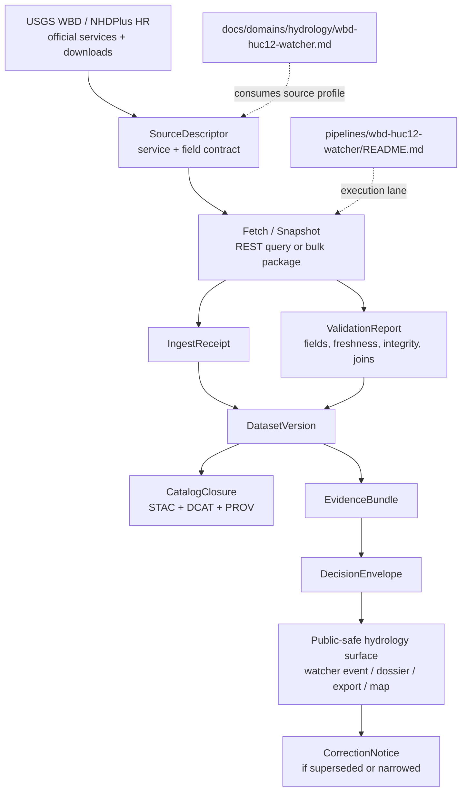

<!-- [KFM_META_BLOCK_V2]
doc_id: kfm://doc/REVIEW_REQUIRED_UUID
title: USGS Hydrography Services (WBD + NHDPlus HR)
type: standard
version: v1
status: draft
owners: @bartytime4life
created: REVIEW_REQUIRED_DATE
updated: REVIEW_REQUIRED_DATE
policy_label: REVIEW_REQUIRED_POLICY_LABEL
related: [docs/domains/hydrology/README.md, docs/domains/hydrology/wbd-huc12-watcher.md, pipelines/wbd-huc12-watcher/README.md, docs/operations/emit-only-watchers/REGISTRY.md, docs/operations/emit-only-watchers/SCHEMA_STUBS.md, contracts/README.md]
tags: [kfm, hydrology, hydrography, usgs, wbd, nhdplus-hr]
notes: [Target path was not explicitly provided in the request; this document is drafted as a proposed hydrology child doc, final path/name need confirmation. Owner reflects current public /docs fallback and narrower lane ownership needs verification.]
[/KFM_META_BLOCK_V2] -->

# USGS Hydrography Services (WBD + NHDPlus HR)

Federal hydrography source profile for KFM’s hydrology lane: what the services are, what they are good for, how they should be ingested, and what must stay explicit before anything is promoted.

> [!IMPORTANT]
> This document is a **source-and-service profile**, not a claim that a full WBD or NHDPlus HR runtime path is already implemented on current public `main`. It is designed to complement the existing hydrology lane docs—especially the WBD HUC-12 watcher materials—without duplicating watcher-specific diff logic.

> **Status:** Draft  
> **Owners:** `@bartytime4life` *(public `/docs/` fallback; narrower lane ownership needs verification)*  
> **Proposed path:** `docs/domains/hydrology/usgs-hydrography-services.md`  
> **Repo fit:** Hydrology domain reference for authoritative federal hydrography sources; upstream of watcher descriptors, ingest receipts, validation reports, catalog closure, and public-safe hydrology thin slices.  
> **Badges:**    

## Quick jump

[Scope](#scope) · [Repo fit](#repo-fit) · [Accepted inputs](#accepted-inputs) · [Exclusions](#exclusions) · [Source profile](#source-profile) · [Service surfaces](#service-surfaces) · [Field guidance](#field-guidance) · [KFM ingestion posture](#kfm-ingestion-posture) · [Diagram](#diagram) · [Quickstart](#quickstart-illustrative) · [Review gates](#review-gates) · [FAQ](#faq)

---

## Scope

This document covers the two federal hydrography families most directly relevant to KFM’s hydrology lane:

- **Watershed Boundary Dataset (WBD)** for hydrologic unit boundaries
- **NHDPlus High Resolution (NHDPlus HR)** for connected hydrography, catchments, and flow-network context

It is meant to answer four practical questions:

1. Which federal source should a KFM hydrology slice treat as authoritative for boundaries vs network structure?
2. Which live services and bulk-download surfaces should a watcher or ingest job use?
3. Which identifiers and fields are safe to anchor in lane-local contracts?
4. What evidence and review objects should be emitted before any source-derived output is promoted?

---

## Repo fit

### Where this doc belongs

| Surface | Role here | Status |
|---|---|---:|
| `docs/domains/hydrology/README.md` | Hydrology lane index and publication-burden entry point | **CONFIRMED** |
| `docs/domains/hydrology/wbd-huc12-watcher.md` | Lane-specific watcher doctrine for HUC-12 change detection | **CONFIRMED** |
| `pipelines/wbd-huc12-watcher/README.md` | Pipeline-local execution-facing note for the visible watcher lane | **CONFIRMED** |
| `docs/operations/emit-only-watchers/REGISTRY.md` | Registry expectations for governed watcher subjects | **CONFIRMED** |
| `docs/operations/emit-only-watchers/SCHEMA_STUBS.md` | Proposed trust objects and decision/evidence payload shapes | **CONFIRMED** |
| `contracts/README.md` | Contract-family overview for KFM trust objects | **CONFIRMED** |
| `docs/domains/hydrology/usgs-hydrography-services.md` | This source/service profile | **PROPOSED** |

### Upstream / downstream links

**Upstream**

- Official USGS WBD and hydrography service surfaces
- National Map download/distribution surfaces
- Layer-level REST query contracts

**Downstream**

- Source descriptors
- Ingest receipts
- Validation reports
- Dataset versions
- Catalog closure objects
- WBD watcher payloads
- Evidence bundles and decision envelopes for public-safe hydrology slices

---

## Accepted inputs

The following inputs belong here:

- Official **USGS WBD** service and download surfaces
- Official **USGS NHDPlus HR** service and download surfaces
- Layer-level REST field inventories for:
  - HUC-12 polygons
  - network flowlines
  - catchments
  - WBDHU12 views inside NHDPlus HR
- Source metadata relevant to:
  - cadence
  - refresh timing
  - query formats
  - service limitations
  - download packaging
- KFM-facing source-contract notes for watcher and ingestion planning

---

## Exclusions

The following do **not** belong in this document:

- WBD change-detection thresholds and event classification rules  
  → keep in `docs/domains/hydrology/wbd-huc12-watcher.md`
- NWIS streamgage logic, tail alerts, or station-specific hydrology ops  
  → keep in existing NWIS / tail-alert docs
- DEM conditioning, hydrologic enforcement, or terrain ETL implementation  
  → keep in terrain/hydrology workflow docs
- Story-node or Focus-mode synthesis logic  
  → keep in runtime / UX / evaluator docs
- State or local hydro datasets used as supplements or overrides  
  → document separately, with their own rights and support posture
- Claims that a release-bearing WBD/NHDPlus HR pipeline is already shipped on public `main`  
  → **UNKNOWN** until directly verified with checked-in contracts, workflows, artifacts, or proof packs

---

## Source profile

## 1) WBD — Watershed Boundary Dataset

**CONFIRMED role**

WBD is the national hydrologic-unit boundary dataset and the federal backbone for hierarchical watershed delineation. In official USGS language, it is a seamless dataset of hydrologic units and a companion dataset to NHD, and it is also a component used in NHDPlus HR. KFM should treat it as the authoritative source family for hydrologic-unit boundary geometry and HUC-coded spatial joins.  

**Why it matters in KFM**

- Strong place/time semantics
- Public-safe first-lane suitability
- Stable hierarchy for HUC-based aggregation
- Good fit for watcher-style diffing, catalog closure, and evidence-first publication

**Hierarchy**

- HUC2 — Region
- HUC4 — Subregion
- HUC6 — Basin
- HUC8 — Subbasin
- HUC10 — Watershed
- **HUC12 — Subwatershed**
- HUC14 / HUC16 — present in service inventories but not uniformly the same national planning default as HUC12

> [!NOTE]
> For KFM hydrology lane work, **HUC12 remains the best default operational unit** unless a narrower or broader burden is justified explicitly for the task.

---

## 2) NHDPlus HR — NHDPlus High Resolution

**CONFIRMED role**

NHDPlus HR is the hydrography network-and-catchment family that combines high-resolution NHD, nationally complete WBD, and elevation-derived context. Official service descriptions emphasize nationally seamless stream reaches, catchment areas, flow surfaces, and value-added attributes.

**Why it matters in KFM**

- Gives KFM a network-bearing hydrography surface, not just administrative watershed boundaries
- Supports flowline, catchment, and related hydrography joins
- Better fit than boundary-only products when the task requires connectivity or routing logic
- Natural companion to WBD-based watershed framing

**Use it when**

- tracing or graphing flow networks
- relating watersheds to stream reaches
- linking catchments to other place-based layers
- building public-safe hydrography context for dossiers or story surfaces
- preparing a future path to upstream/downstream navigation via related federal hydro APIs

---

## 3) Current federal context

**CONFIRMED**

The National Map hydrography access page states that **NHD was retired effective 2023-10-01** and points forward to current hydrography program surfaces, while WBD and NHDPlus HR remain available for download and map-service access. That means this doc should not recommend “raw NHD” as the default forward-looking baseline.

---

## Service surfaces

## Base service families

| Service family | Primary use | KFM posture |
|---|---|---|
| REST MapServer / layer query | Fast scripting, watcher pulls, field inspection, bounded refresh jobs | **Preferred for small governed fetches** |
| Dynamic WMS / WFS surfaces | Rendering and standards-oriented access where needed | **Situational** |
| National Map downloads | Baseline snapshots, rebuilds, offline packaging | **Preferred for snapshot/rebuild lanes** |

---

## Current endpoint inventory

| Surface | Confirmed purpose | Notes |
|---|---|---|
| `https://hydro.nationalmap.gov/arcgis/rest/services/wbd/MapServer` | WBD map service | Layer inventory includes HUC2–HUC16 surfaces |
| `.../wbd/MapServer/6` | **HUC12 / Subwatershed layer** | Best default operational unit for KFM hydrology thin slices |
| `https://hydro.nationalmap.gov/arcgis/rest/services/NHDPlus_HR/MapServer` | NHDPlus HR service | Nationally seamless network + catchments + boundary overlays |
| `.../NHDPlus_HR/MapServer/3` | `NetworkNHDFlowline` | Network-bearing flowline layer |
| `.../NHDPlus_HR/MapServer/10` | `NHDPlusCatchment` | Catchment polygons |
| `.../NHDPlus_HR/MapServer/12` | `WBDHU12` | WBD HUC12 view inside NHDPlus HR |
| National Map download viewer | bulk WBD / NHDPlus HR acquisition | Use for file geodatabase or shapefile snapshots |

---

## Query format and scale notes

### WBD service

- Query formats include:
  - `json`
  - `geojson`
  - `pbf`
- The service advertises a `MaxRecordCount` of 2000.
- Layer 6 is the HUC12 surface.

### NHDPlus HR service

- Layered REST queries are available on the MapServer.
- Flowline and catchment layers support direct feature querying.
- The official access page also describes dynamic-service availability and bulk-download paths.

> [!CAUTION]
> Neither WBD nor NHDPlus HR service surfaces should be treated as a sufficient basis for **site-specific regulatory determinations** on their own. The service metadata itself warns against that use. KFM should preserve those cautions in downstream descriptors, receipts, and public-facing notes.

---

## Field guidance

## WBD HUC12 layer guidance

**CONFIRMED current REST fields include** a HUC-coded key and descriptive/source metadata such as:

- `huc12`
- `name`
- `areasqkm`
- `areaacres`
- `states`
- `hutype`
- `humod`
- `tohuc`
- source metadata such as `sourcedatadesc`, `sourceoriginator`, `loaddate`

**KFM default guidance**

| Purpose | Preferred field |
|---|---|
| Stable watershed join key | `huc12` |
| Human label | `name` |
| Area summary | `areasqkm` |
| Cross-state awareness | `states` |
| Downstream hydrologic linkage | `tohuc` |

---

## NHDPlus HR network flowline guidance

**CONFIRMED current `NetworkNHDFlowline` layer fields include**:

- `permanent_identifier`
- `gnis_name`
- `reachcode`
- `ftype`
- `fcode`
- `nhdplusid`
- `vpuid`
- `streamleve`
- `streamorde`

**KFM default guidance**

| Purpose | Preferred field / note |
|---|---|
| Layer-local stable hydro object key | `nhdplusid` |
| Persistent source identifier | `permanent_identifier` |
| Reach linkage / hydro code | `reachcode` |
| Human-readable feature name | `gnis_name` |
| Feature typing | `ftype`, `fcode` |
| VPU partitioning | `vpuid` |

> [!IMPORTANT]
> Earlier hydrography prose often uses **COMID** informally when describing NHDPlus-era flowline identity. On the **currently inspected REST layer**, the visible field is `nhdplusid`, not `COMID`. KFM lane contracts should therefore pin the **actual current field names** from the inspected service or download package being used, rather than relying on legacy shorthand.

---

## NHDPlus catchment guidance

**CONFIRMED current `NHDPlusCatchment` layer fields include**:

- `nhdplusid`
- `sourcefc`
- `gridcode`
- `areasqkm`
- `vpuid`

**KFM default guidance**

| Purpose | Preferred field |
|---|---|
| Catchment join key | `nhdplusid` |
| Area summary | `areasqkm` |
| Source family trace | `sourcefc` |
| Partition / packaging scope | `vpuid` |

---

## Identity and join rules

### KFM lane-safe defaults

1. **Use `huc12` for HUC12 watershed joins**
2. **Use `nhdplusid` and/or `permanent_identifier` for current REST flowline/catchment joins**
3. Treat field choice as a **source-descriptor decision**, not free text in downstream code
4. Record all chosen join keys in:
   - source descriptor
   - ingest receipt
   - dataset version
   - validation report
5. Preserve any cross-surface aliasing explicitly if later packaging needs to bridge older NHDPlus terminology

---

## KFM ingestion posture

## Truth posture

| Claim type | Status |
|---|---:|
| WBD and NHDPlus HR are the relevant federal hydrography source families for this lane | **CONFIRMED** |
| Hydrology is the preferred first KFM thin slice | **CONFIRMED** |
| Current public repo proves a complete release-bearing hydrography pipeline | **UNKNOWN** |
| A source-profile child doc should exist for these services | **PROPOSED** |

---

## Recommended artifact flow

KFM’s central manuals repeatedly frame hydrology as a good first thin slice and define the canonical truth path as:

`Source edge -> RAW -> WORK / QUARANTINE -> PROCESSED -> CATALOG -> PUBLISHED`

For this source family, the smallest credible artifact set is:

| Trust object | Role in this lane | Status |
|---|---|---:|
| `SourceDescriptor` | declares service/download contract, identity, cadence, rights, support, publication intent | **PROPOSED for this lane** |
| `IngestReceipt` | proves fetch and landing occurred | **PROPOSED for this lane** |
| `ValidationReport` | records field, schema, freshness, and integrity checks | **PROPOSED for this lane** |
| `DatasetVersion` | authoritative candidate/promoted snapshot of a specific WBD/NHDPlus HR subject set | **PROPOSED for this lane** |
| `CatalogClosure` | STAC / DCAT / PROV outward metadata closure | **PROPOSED for this lane** |
| `EvidenceBundle` | support package for a claim, event, preview, or export | **PROPOSED for this lane** |
| `DecisionEnvelope` | machine-readable policy outcome for emit/publish/deny flows | **PROPOSED for this lane** |
| `CorrectionNotice` | preserves visible supersession when a refresh or error changes public output | **PROPOSED for this lane** |

> [!TIP]
> Keep this lane **source-first and contract-first**. The source profile should remain stable even if watcher logic, catalog packaging, or UI surfaces evolve.

---

## Required capture per fetch or snapshot

At minimum, a governed ingest should preserve:

- source URL or download reference
- layer ID or package identifier
- query parameters or download scope
- fetch timestamp
- `ETag` / `Last-Modified` when exposed
- service or package version signal
- response or package integrity digest
- selected join fields
- record count and geometry count summaries
- schema fingerprint / field inventory snapshot
- any legal or usage caveat carried by the service

---

## Relationship to the existing WBD watcher lane

This doc should not duplicate the watcher doctrine already documented elsewhere.

### This file should answer

- what WBD and NHDPlus HR are
- which service layers matter
- which join keys are safe
- what to capture from official sources
- what stays explicit before promotion

### The watcher doc should answer

- what counts as a meaningful HUC12 change
- how to classify Kansas signal vs noise
- how NWIS joins and event thresholds work
- when to emit alert, abstain, or correction
- how lane-local diffing is scored and reviewed

---

## Diagram



---

## Quickstart (illustrative)

> [!NOTE]
> These examples are **illustrative fetch patterns**, not confirmed checked-in repo scripts.

### 1) Query HUC12 polygons from WBD layer 6

```bash
curl "https://hydro.nationalmap.gov/arcgis/rest/services/wbd/MapServer/6/query?where=1%3D1&outFields=huc12%2Cname%2Careasqkm%2Cstates&f=geojson"
```

### 2) Query network flowlines from NHDPlus HR layer 3

```bash
curl "https://hydro.nationalmap.gov/arcgis/rest/services/NHDPlus_HR/MapServer/3/query?where=1%3D1&outFields=nhdplusid%2Cpermanent_identifier%2Creachcode%2Cgnis_name%2Cftype%2Cfcode&f=geojson"
```

### 3) Query catchments from NHDPlus HR layer 10

```bash
curl "https://hydro.nationalmap.gov/arcgis/rest/services/NHDPlus_HR/MapServer/10/query?where=1%3D1&outFields=nhdplusid%2Careasqkm%2Cvpuid&f=geojson"
```

### 4) Snapshot posture for rebuilds

Use National Map bulk downloads when the task needs:

- reproducible baseline rebuilds
- larger regional extracts
- offline analyst packaging
- lane-local GeoPackage / GeoParquet / catalog generation

---

## Review gates

Before this source family is treated as promotion-ready in KFM, verify:

- [ ] exact target file/path for this doc is confirmed
- [ ] source descriptor path and schema for hydrography lane are surfaced
- [ ] actual fetch script or watcher implementation references this source profile
- [ ] chosen join fields are pinned in fixtures or schemas
- [ ] layer IDs used in code match the current official services
- [ ] freshness expectations are codified and tested
- [ ] WBD vs NHDPlus HR usage boundaries are explicit in lane docs
- [ ] service caution language is preserved for non-regulatory use
- [ ] at least one hydrology slice emits receipt + validation + catalog closure + evidence bundle lineage
- [ ] correction path is documented for source refresh or downstream error

---

## Task list

### Near-term

- [ ] Confirm final doc path and link it from `docs/domains/hydrology/README.md`
- [ ] Add lane-local `SourceDescriptor` fixture for:
  - WBD HUC12
  - NHDPlus HR network flowlines
  - NHDPlus catchments
- [ ] Align `wbd-huc12-watcher.md` and `pipelines/wbd-huc12-watcher/README.md` on visible path naming if needed
- [ ] Add field-inventory fixture snapshots for service layers used operationally

### Later

- [ ] Add snapshot/rebuild guidance for National Map bulk packages
- [ ] Add explicit NLDI / related federal hydro API bridge notes where the lane actually uses them
- [ ] Add a lane-local correction note template for hydrography-source refreshes
- [ ] Add a public-safe glossary for `huc12`, `nhdplusid`, `reachcode`, `vpuid`, and catchment semantics

---

## FAQ

### Why HUC12?

Because it is a strong compromise between national consistency and operational usefulness. It is small enough to support meaningful local watershed logic while remaining stable enough for national source packaging and Kansas lane-wide reasoning.

### Why pair WBD with NHDPlus HR?

Because they solve different problems. WBD gives watershed boundaries and hierarchy; NHDPlus HR gives network-bearing hydrography and catchments.

### Why not just use “NHD”?

Because the current federal access guidance has moved on: NHD is retired as the forward program baseline, while WBD and NHDPlus HR remain accessible and relevant now.

### Should this doc define watcher thresholds?

No. Keep source/service doctrine here and watcher/event doctrine in the watcher doc.

### Is `COMID` the field to use?

Not by default in this document. The currently inspected REST layer exposes `nhdplusid` and related fields. Use the actual current field inventory of the source surface you are contracting against.

### Are these sources public domain?

The official hydrography pages describe these USGS hydrography products as public-domain federal data. Still preserve the service-level cautions, refresh timing, and any non-regulatory-use notes in downstream artifacts.

---

## Appendix A — current layer snapshot (service-facing)

<details>
<summary><strong>WBD MapServer layer inventory of immediate interest</strong></summary>

| Layer ID | Layer name |
|---:|---|
| 1 | Region |
| 2 | Subregion |
| 3 | Basin |
| 4 | Subbasin |
| 5 | Watershed |
| 6 | Subwatershed |
| 7 | HUC14 |
| 8 | HUC16 |

</details>

<details>
<summary><strong>NHDPlus HR layer inventory of immediate interest</strong></summary>

| Layer ID | Layer name |
|---:|---|
| 3 | `NetworkNHDFlowline` |
| 10 | `NHDPlusCatchment` |
| 12 | `WBDHU12` |

</details>

<details>
<summary><strong>Freshness caution to keep visible</strong></summary>

There is a **documented freshness mismatch** across official federal surfaces:

- the National Map access page describes more recent staged NHDPlus HR release information and says the service reflects the most up-to-date version of NHDPlus HR
- the currently inspected NHDPlus HR MapServer metadata still displays an older service-level “data refreshed” note

Do not smooth that away. Capture the exact source and timestamp used in each ingest receipt and validation report.

</details>

---

## Appendix B — language to keep stable

| Preferred KFM term | Use it for | Avoid |
|---|---|---|
| **source family** | WBD, NHDPlus HR as authoritative upstream datasets/services | calling every service a pipeline |
| **source surface** | specific REST layer, WMS/WFS endpoint, or download package | vague “API stuff” |
| **join key** | `huc12`, `nhdplusid`, `permanent_identifier`, etc. | “ID” without field name |
| **hydrology lane** | KFM operating lane | generic “water stuff” |
| **catalog closure** | outward STAC/DCAT/PROV completion | “metadata done” |
| **public-safe slice** | release-bearing first implementation wave | “toy demo” |

---

[Back to top](#usgs-hydrography-services-wbd--nhdplus-hr)
