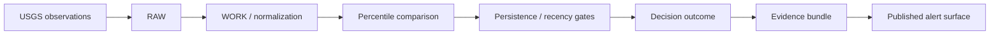
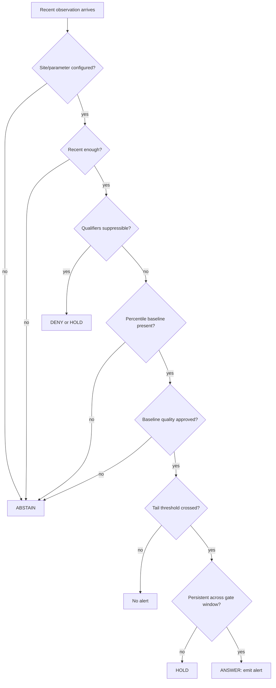
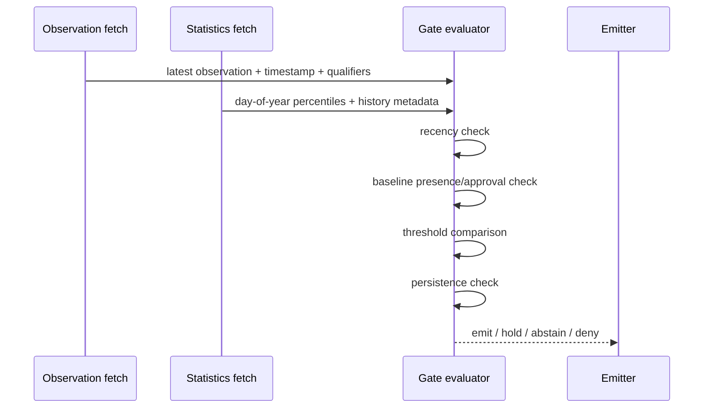

<!--
doc_id: NEEDS VERIFICATION
title: USGS Tail Alerts
type: standard
version: v1
status: draft
owners: [@bartytime4life, NEEDS VERIFICATION]
created: NEEDS VERIFICATION
updated: 2026-04-02
policy_label: public
related: [
  docs/domains/hydrology/README.md,
  docs/governance/ROOT_GOVERNANCE.md,
  docs/governance/ETHICS.md,
  docs/governance/SOVEREIGNTY.md
]
tags: [kfm, hydrology, usgs, streamflow, percentiles, alerting, evidence-first]
notes: [
  "Repo path and owners require in-repo confirmation before merge.",
  "Endpoint examples are based on current public USGS documentation and should be validated in CI/integration tests.",
  "This document defines alerting policy and contract shape; implementation bindings are PROPOSED unless verified in repo."
]
-->

# USGS Tail Alerts

One-line purpose: define an evidence-first, seasonally aware alerting standard for hydrologic tail conditions using USGS observations and approved historical percentile context.

> [!IMPORTANT]
> **Baseline rule:** percentile-driven alerts **must not** fire unless the comparison baseline is resolvable to **approved** USGS historical statistics. If the percentile baseline is missing, stale, or not quality-assured, the system must **ABSTAIN** rather than guess.

## Status / Ownership

**Status:** draft  
**Owners:** @bartytime4life, NEEDS VERIFICATION  
**Repo fit:** `docs/domains/hydrology/usgs-tail-alerts.md`  
**Upstream:** `docs/domains/hydrology/README.md`  
**Governance anchors:** `docs/governance/ROOT_GOVERNANCE.md`, `docs/governance/ETHICS.md`, `docs/governance/SOVEREIGNTY.md`


**Quick jump:** [Scope](#scope) · [Repo fit](#repo-fit) · [Inputs](#accepted-inputs) · [Exclusions](#exclusions) · [Decision model](#decision-model) · [Alert contract](#alert-contract) · [API patterns](#api-patterns) · [Task list](#task-list) · [FAQ](#faq)

---

## Scope

This standard defines how KFM should detect and emit **tail-condition hydrologic alerts** for USGS-monitored sites, with emphasis on streamflow but a structure reusable for other numeric water observations where a seasonal historical baseline exists.

The key design choice is intentional:

- **Current conditions** may be recent and provisional.
- **Historical percentile baselines** must come from **approved** historical records.
- **Alerts** are only valid when recent values can be compared against a trustworthy, seasonally appropriate baseline.

This document focuses on **day-of-year seasonal percentile comparisons** such as:

- below the **5th percentile** → seasonally unusual low condition
- above the **95th percentile** → seasonally unusual high condition

These comparisons are useful because they preserve **seasonal context** instead of treating January and July as if they share the same hydrologic expectations.

---

## Repo fit

| Item | Value |
|---|---|
| Intended path | `docs/domains/hydrology/usgs-tail-alerts.md` |
| Domain | Hydrology / water systems |
| Primary downstream consumers | domain watchers, ingest/normalization layers, alert evaluation jobs, focus/evidence surfaces |
| Upstream dependencies | USGS current observations, USGS daily values, USGS historical statistics |
| Trust posture | public-facing logic may summarize results, but alert causality must remain evidence-resolvable |
| Evidence requirement | consequential alert claims should resolve to a bundle containing site, parameter, timestamps, values, percentile basis, and gating outcomes |

### Placement model



---

## Accepted inputs

This standard expects a site-parameter-timeseries context that can support the following fields.

| Input | Purpose | Status |
|---|---|---|
| `site_id` | USGS monitoring location identifier | CONFIRMED |
| `parameter_code` | USGS parameter identifier such as discharge | CONFIRMED |
| recent observations | latest current values for candidate alert detection | CONFIRMED |
| observation timestamp | freshness / recency gate | CONFIRMED |
| qualifier metadata | suppressions for ice, equipment, estimated, or other caution states | INFERRED |
| daily value approval metadata | distinguish approved vs provisional daily values where used | CONFIRMED |
| day-of-year percentile table | seasonal historical baseline | CONFIRMED |
| record-length metadata | minimum viable baseline checks | PROPOSED |
| site context metadata | notes on regulation, intermittence, or known interpretation limits | PROPOSED |

---

## Exclusions

This document does **not** define:

- flood-warning operations or life-safety public warning policy
- rating-curve engineering review
- direct replacement of USGS authoritative dissemination
- long-horizon drought classification frameworks
- non-seasonal anomaly detection based on arbitrary global thresholds
- any rule that silently upgrades provisional observations into sovereign truth

> [!WARNING]
> A tail alert is **contextual evidence**, not a sovereign declaration of hydrologic fact. Public surfaces should preserve distinctions among **observed**, **provisional**, **approved baseline**, **stale**, and **suppressed** conditions.

---

## Operating doctrine

### Why day-of-year percentiles

USGS day-of-year statistics represent the expected conditions for a generic numeric day of the year at a location based on **approved historical observations**. For seasonal hydrology, that is the correct baseline class for “unusual-for-this-time-of-year” detection.

### Why approved-only baselines

Using provisional or mixed-quality history to define percentiles weakens trust and can create false comparisons. The baseline itself must be quality-assured before it can govern alert decisions.

### Why persistence is mandatory

Hydrologic telemetry can show brief excursions due to instrument behavior, transmission timing, regulation changes, or short-lived events. A persistence gate reduces noisy single-point threshold crossings.

### Why abstention is a feature

KFM governance prefers a visible **ABSTAIN** to a false claim. Missing percentile data, stale observations, or unresolved quality state are trust-preserving reasons to withhold alert emission.

---

## Decision model

### Finite outcomes

This standard maps naturally to KFM’s finite outcomes:

| Outcome | Meaning in this standard |
|---|---|
| `ANSWER` | a valid alert condition is supported and emitted |
| `ABSTAIN` | insufficient trustworthy basis to evaluate or publish |
| `DENY` | policy or rule explicitly forbids emission under present conditions |
| `ERROR` | execution or integration failure prevented evaluation |

### Decision ladder



---

## Normative rules

### 1) Baseline rule

**CONFIRMED:** day-of-year percentile statistics are based on approved historical observations.  
**Normative requirement:** KFM alert evaluators **must** treat missing, unresolved, or non-approved percentile baselines as **non-emittable**.

```text
IF percentile baseline is missing OR non-resolvable:
  outcome = ABSTAIN
```

### 2) Seasonal-comparison rule

**CONFIRMED:** for seasonal tail alerts, KFM should compare recent observations to the corresponding **day-of-year** percentile values for the same site and parameter.

```text
comparison_day = numeric day-of-year of observation time
baseline = percentile(site, parameter, comparison_day)
```

### 3) Recency rule

**PROPOSED:** current candidate observations should be considered valid only if the latest usable observation is within a bounded recency window, recommended at **72–96 hours** max depending on cadence and site class.

```text
IF now - latest_observation_time > recency_limit:
  outcome = ABSTAIN
```

### 4) Persistence rule

**PROPOSED:** threshold exceedance must persist for multiple intervals before emission. Recommended defaults:

- continuous data: at least **3 consecutive qualifying readings**
- daily mode: at least **2 consecutive daily values** when operating on daily signals

```text
IF threshold_crossing_count < persistence_min:
  status = HOLD
```

### 5) Suppression rule

**INFERRED / PROPOSED:** if observation qualifiers indicate known distortion states (for example ice effect, equipment issues, estimated-only context where policy forbids use), the evaluator should suppress or narrow the alert.

### 6) Minimum-history rule

**PROPOSED:** only use percentile baselines when the site/parameter has enough approved historical record to make the statistic meaningful. A recommended starting requirement is **10+ years**, with stricter thresholds for public statistical displays where appropriate.

### 7) Interpretation rule for regulated/intermittent systems

**PROPOSED:** regulated rivers, diversions, intermittent streams, and heavily engineered systems should carry an interpretation note or reduced-confidence flag. Tail percentile crossings may still be real, but their meaning can differ from unregulated basins.

---

## Recommended default thresholds

| Setting | Recommended default | Status |
|---|---:|---|
| Low tail threshold | `p05` | PROPOSED |
| High tail threshold | `p95` | PROPOSED |
| Recency limit | `96h` | PROPOSED |
| Persistence minimum | `3 consecutive readings` | PROPOSED |
| Minimum record length | `10 years` | PROPOSED |
| Suppression on severe qualifiers | `true` | PROPOSED |

> [!NOTE]
> These defaults are intentionally conservative. Repository-specific watchers may tighten or relax them, but any divergence should be documented beside the implementation or in an ADR.

---

## Alert classes

| Alert class | Trigger condition | Semantic meaning |
|---|---|---|
| `seasonal_low_tail` | recent value `< p05` and persistent | unusually low for this time of year |
| `seasonal_high_tail` | recent value `> p95` and persistent | unusually high for this time of year |
| `seasonal_low_watch` | recent value `< p10` and persistent | low-side watch, less severe |
| `seasonal_high_watch` | recent value `> p90` and persistent | high-side watch, less severe |

### Severity guidance

| Percentile zone | Suggested severity |
|---|---|
| below 10th / above 90th | watch |
| below 5th / above 95th | alert |
| below 1st / above 99th | extreme, only if baseline support is strong |

**PROPOSED:** extremes below `p01` or above `p99` should require stronger persistence or additional review because tails can be sensitive to sparse history.

---

## Data sources

### Source classes

| Source class | Use | Trust role |
|---|---|---|
| recent/current observations | detect current candidate condition | transient / often provisional |
| daily values | stable recent context, can include approval metadata | intermediate |
| historical statistics | approved seasonal percentile baseline | governing comparison baseline |

### Source policy

- **Current observations** may provide the candidate value.
- **Historical statistics** govern whether the candidate is unusual.
- **Daily approved values** may be used for additional persistence checks or fallback context, but they do not replace the seasonal percentile baseline.

---

## API patterns

> [!CAUTION]
> Endpoint and field examples below are **integration examples**, not a claim that these exact request shapes are already implemented in-repo.

### Current observations example

```http
https://waterservices.usgs.gov/nwis/iv/?format=json&sites=06887500&parameterCd=00060&period=P2D
```

### Daily values example

```http
https://waterservices.usgs.gov/nwis/dv/?format=json&sites=06887500&parameterCd=00060&startDT=2026-01-01&endDT=2026-12-31
```

### Statistics example

```http
https://waterservices.usgs.gov/nwis/stat/?format=json&sites=06887500&statReportType=daily&statTypeCd=percentile
```

### Field mapping sketch

| Concept | Typical field / location | Status |
|---|---|---|
| recent value | service-specific `value` | CONFIRMED |
| observation timestamp | service-specific time field | CONFIRMED |
| daily approval state | `approval_status` in modern API schema | CONFIRMED |
| percentile value | service-specific percentile columns / fields | INFERRED |
| quality qualifier | service-specific qualifier field(s) | CONFIRMED |
| last modified | service metadata where available | CONFIRMED |

---

## Evaluation algorithm

### High-level logic



### Pseudocode

```python
from dataclasses import dataclass
from typing import Literal, Optional


Decision = Literal["ANSWER", "ABSTAIN", "DENY", "ERROR", "NONE", "HOLD"]


@dataclass
class Observation:
    value: float
    observed_at: str
    qualifiers: list[str]


@dataclass
class PercentileBaseline:
    p05: Optional[float]
    p10: Optional[float]
    p90: Optional[float]
    p95: Optional[float]
    approved_basis: bool
    record_years: Optional[int]


def evaluate_tail_condition(
    latest: Observation,
    baseline: PercentileBaseline,
    recency_ok: bool,
    persistence_ok: bool,
    suppress: bool,
) -> tuple[Decision, Optional[str]]:
    if suppress:
        return ("DENY", None)

    if not recency_ok:
        return ("ABSTAIN", None)

    if not baseline.approved_basis:
        return ("ABSTAIN", None)

    if baseline.p05 is None or baseline.p95 is None:
        return ("ABSTAIN", None)

    if latest.value < baseline.p05:
        if not persistence_ok:
            return ("HOLD", "seasonal_low_tail")
        return ("ANSWER", "seasonal_low_tail")

    if latest.value > baseline.p95:
        if not persistence_ok:
            return ("HOLD", "seasonal_high_tail")
        return ("ANSWER", "seasonal_high_tail")

    return ("NONE", None)
```

---

## Alert contract

**PROPOSED:** emitted alerts should serialize a trust-visible record like the following.

```json
{
  "alert_id": "NEEDS_VERIFICATION",
  "site_id": "06887500",
  "parameter_code": "00060",
  "observed_at": "2026-04-02T12:00:00Z",
  "decision": "ANSWER",
  "alert_class": "seasonal_low_tail",
  "current_value": 41.2,
  "baseline": {
    "kind": "day_of_year_percentile",
    "comparison_day": 93,
    "p05": 55.0,
    "p95": 481.0,
    "approved_basis": true,
    "record_years": 27
  },
  "gates": {
    "recency_ok": true,
    "persistence_ok": true,
    "suppressed": false
  },
  "status_labels": [
    "observed",
    "baseline_approved",
    "seasonal_context"
  ],
  "evidence_ref": "NEEDS_VERIFICATION"
}
```

### Contract notes

| Field | Purpose |
|---|---|
| `decision` | preserves finite outcome state |
| `alert_class` | human- and machine-readable category |
| `baseline` | shows exactly what comparison governed the result |
| `gates` | makes trust-visible why the alert did or did not emit |
| `evidence_ref` | link to resolvable evidence bundle / drawer |

---

## Evidence bundle minimums

**PROPOSED:** a consequential alert should be traceable to an evidence package containing at least:

- site identifier and site metadata snapshot
- parameter code and unit
- observation value, timestamp, and qualifiers
- percentile comparison day and percentile values used
- approval/quality basis statement for the baseline
- persistence window and observations considered
- evaluator version / ruleset identifier
- emission timestamp
- correction / supersession lineage if revised or withdrawn

---

## Failure modes and handling

| Failure mode | Response | Reason |
|---|---|---|
| percentile row missing for day | `ABSTAIN` | no trustworthy baseline |
| baseline quality unresolved | `ABSTAIN` | cannot prove the comparison |
| observation stale | `ABSTAIN` | present condition unknown |
| qualifier suppression active | `DENY` or `HOLD` | policy blocks or narrows use |
| single-point spike only | `HOLD` | insufficient persistence |
| integration exception | `ERROR` | execution failure, not hydrologic decision |

---

## Publication and wording guidance

### Public-safe phrasing

Use wording that preserves uncertainty and lineage:

- “Current flow is **below the seasonal 5th percentile baseline** for this day of year at this site.”
- “Condition is based on **recent observations compared with approved historical statistics**.”
- “Alert withheld because **seasonal percentile context was unavailable**.”

### Avoid

- “USGS confirms drought here.”
- “This station is definitely abnormal.”
- “Historical baseline proves extreme conditions.”  
  These overstate what the signal means.

---

## Directory shape

```text
docs/
└── domains/
    └── hydrology/
        ├── README.md
        └── usgs-tail-alerts.md
```

**NEEDS VERIFICATION:** implementation-adjacent files may also live under a watcher/spec/contracts area, but that path was not verified in-session.

---

## Quickstart

### Implementation checklist

- [ ] fetch recent observation(s) for configured site/parameter
- [ ] fetch day-of-year percentile baseline
- [ ] verify baseline is present and quality-assured
- [ ] apply recency gate
- [ ] apply suppression/qualifier gate
- [ ] compare against `p05/p95` or configured thresholds
- [ ] apply persistence gate
- [ ] emit finite outcome with evidence reference
- [ ] persist correction lineage for revisions/withdrawals

### Minimal decision skeleton

```text
recent observation
  -> recency gate
  -> qualifier gate
  -> percentile baseline presence gate
  -> baseline approval gate
  -> threshold comparison
  -> persistence gate
  -> ANSWER / HOLD / ABSTAIN / DENY / ERROR
```

---

## Usage

### Example decision table

| Current value | p05 | p95 | Recency ok | Persistence ok | Result |
|---:|---:|---:|---|---|---|
| 41.2 | 55.0 | 481.0 | yes | yes | `ANSWER: seasonal_low_tail` |
| 41.2 | 55.0 | 481.0 | yes | no | `HOLD` |
| 600.0 | 55.0 | 481.0 | yes | yes | `ANSWER: seasonal_high_tail` |
| 600.0 | NA | 481.0 | yes | yes | `ABSTAIN` |
| 600.0 | 55.0 | 481.0 | no | yes | `ABSTAIN` |

### Recommended watcher modes

| Mode | Description |
|---|---|
| continuous-tail | evaluate recent continuous/current values against seasonal baseline |
| daily-tail | evaluate most recent daily values against same day-of-year daily baseline |
| mixed-context | use current values for early detection, daily values for persistence/context |

---

## Task list

### Merge gates

- [ ] confirm doc owner(s)
- [ ] confirm final path in mounted repo
- [ ] verify whether hydrology standards already define watcher contract names
- [ ] align alert contract with any existing KFM `DecisionEnvelope` or evidence contract
- [ ] verify how correction notices are modeled for withdrawn alerts
- [ ] add implementation reference links once code paths are verified
- [ ] add test fixture examples for missing baseline, stale data, and suppressed qualifiers

### Suggested tests

- [ ] emits `ABSTAIN` when percentile baseline is missing
- [ ] emits `ABSTAIN` when baseline approval is unresolved
- [ ] emits `HOLD` on single excursion
- [ ] emits `ANSWER` only after configured persistence threshold
- [ ] emits `DENY` when suppression qualifiers match policy
- [ ] records evidence fields used in decision
- [ ] preserves correction lineage on revised or withdrawn alert

---

## FAQ

### Why not use one fixed percentile for the whole year?

Because seasonality matters. A discharge value that is ordinary in spring can be exceptional in late summer. Day-of-year percentiles keep the comparison honest.

### Can provisional current observations still participate?

Yes, **for candidate detection**. The governing baseline must still be approved historical statistics, and public wording should not erase the provisional character of current observations where that matters.

### What happens if USGS returns `NA` or the station has weak history?

The evaluator should **ABSTAIN** or narrow the product. Lack of a trustworthy baseline is a trust signal, not an inconvenience to hide.

### Is this only for discharge?

No. The pattern can generalize to other numeric hydrologic variables where a seasonal historical percentile baseline exists and interpretation is defensible.

### Does a tail alert imply a hazard warning?

No. This standard expresses statistical context, not a public-safety warning regime.

---

## Appendix

### Truth labels used here

| Label | Meaning |
|---|---|
| `CONFIRMED` | directly supported by cited USGS documentation |
| `INFERRED` | strongly implied by source behavior or schema, but not fully session-verified as implementation |
| `PROPOSED` | recommended KFM policy or contract shape, not proven active in repo |
| `NEEDS VERIFICATION` | owner/path/implementation details require mounted-repo confirmation |

### Related future docs

- `docs/domains/hydrology/README.md`
- `docs/domains/hydrology/usgs-site-roster.md` — NEEDS VERIFICATION
- `docs/domains/hydrology/usgs-observation-quality.md` — PROPOSED
- `docs/domains/hydrology/usgs-statistics-ingest.md` — PROPOSED

<p align="right"><a href="#usgs-tail-alerts">Back to top</a></p>
