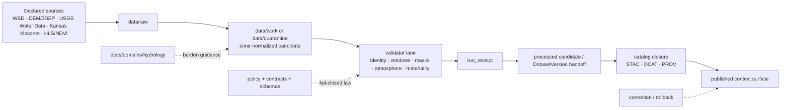

<!-- [KFM_META_BLOCK_V2]
doc_id: kfm://doc/NEEDS-VERIFICATION
title: Vegetation-Hydrology Baselines
type: standard
version: v1
status: draft
owners: NEEDS-VERIFICATION
created: YYYY-MM-DD
updated: YYYY-MM-DD
policy_label: NEEDS-VERIFICATION
related: [./README.md, ./kdhe/303d-2026-submission.md, ../../../pipelines/hls-ndvi/README.md, ../../../pipelines/wbd-huc12-watcher/README.md, ../../../tools/validators/vegetation_change/README.md, ../../../tools/air_quality/smoke_gate/README.md, ../../../data/registry/README.md, ../../../data/receipts/README.md, ../../../data/proofs/README.md, ../../../data/catalog/stac/README.md, ../../../policy/README.md, ../../../schemas/README.md, ../../../tests/reproducibility/README.md]
tags: [kfm, hydrology, vegetation, ndvi, hls, baselines, spec_hash]
notes: [Hydrology-first doctrine is CONFIRMED. Vegetation and Earth-observation context are viable but burden-heavier and must keep knowledge-character labeling explicit. Exact owners, dates, schema-home authority, active workflow callers, and mounted execution depth remain NEEDS VERIFICATION.]
[/KFM_META_BLOCK_V2] -->

<a id="top"></a>

# Vegetation-Hydrology Baselines

Boundary-setting guidance for joining vegetation and Earth-observation context to hydrology-first KFM work without collapsing source roles, burden classes, or truth states.

> [!NOTE]
> **Status:** `draft`  
> **Path:** `docs/domains/hydrology/vegetation-hydrology-baselines.md`  
> **Role:** domain-level baseline and interpretation guide for vegetation-aware hydrology work  
> **Truth posture:** hydrology-first doctrine is strong; vegetation/EO context is viable but burden-heavier; exact mounted schema paths, lane inventory, and executable depth of adjacent HLS/NDVI or validator surfaces remain `NEEDS VERIFICATION`  
> **Quick jumps:** [Why this doc exists](#why-this-doc-exists) · [Repo fit](#repo-fit) · [Current evidence posture](#current-evidence-posture) · [Baseline classes](#baseline-classes) · [Join rules](#join-rules) · [Candidate package](#candidate-package) · [Lifecycle placement](#lifecycle-placement) · [Validation gates](#validation-gates) · [Failure, correction, and rollback](#failure-correction-and-rollback) · [Exclusions](#exclusions) · [Open verification items](#open-verification-items)


---

## Why this doc exists

KFM is explicit that **hydrology is the first proof lane**. It is also explicit that **vegetation, air/climate, and Earth-observation context are useful but burden-heavier**, especially when observed, modeled, anomaly-derived, and regulatory layers start to blur together.

This file exists to define the safe join between those two facts.

It should help a maintainer answer one practical question:

**How do we let vegetation-aware context support hydrology-facing claims without letting HLS/NDVI, smoke/aerosol qualifiers, climate anomalies, soils, or station telemetry quietly become one undifferentiated “environmental truth surface”?**

### What this document does

| This document does | This document does **not** do |
|---|---|
| define baseline classes and join rules | claim mounted execution or released production behavior |
| keep hydrology, vegetation, atmosphere, soils, and regulatory surfaces distinct | settle unresolved schema-home authority |
| describe the smallest credible candidate package | own publication, signing, or catalog closure |
| identify validation expectations before promotion | replace lane-local pipeline or validator READMEs |
| make burden and truth posture visible at the domain level | convert convenience joins into authoritative truth |

> [!IMPORTANT]
> `USGS Water Data`, `Kansas Mesonet`, `WBD HUC12`, `FEMA NFHL`, `HLS/NDVI`, smoke/aerosol contradiction results, and climate-anomaly overlays do **not** enter with the same evidentiary status.  
> If the package hides that difference, it is not a baseline package. It is an ambiguity package.

[Back to top](#top)

---

## Repo fit

This file belongs in `docs/domains/hydrology/` because it is primarily a **domain burden and interpretation** document, not a lane-local execution guide.

| Surface | Relationship | Current posture |
|---|---|---|
| [`./README.md`](./README.md) | Parent hydrology domain index | hydrology domain is clearly intended and repeatedly surfaced; exact mounted branch content still needs verification |
| [`./kdhe/303d-2026-submission.md`](./kdhe/303d-2026-submission.md) | Sibling hydrology submission guide showing domain-doc depth | confirmed path family in repo-facing materials; exact active-branch content still bounded |
| [`../../../pipelines/hls-ndvi/README.md`](../../../pipelines/hls-ndvi/README.md) | Upstream vegetation/EO execution-near lane | `CONFIRMED` path; runtime depth `NEEDS VERIFICATION` |
| [`../../../pipelines/wbd-huc12-watcher/README.md`](../../../pipelines/wbd-huc12-watcher/README.md) | Hydrology watcher analogue for public-safe, zone-aware diffs | `CONFIRMED` path; runtime depth `NEEDS VERIFICATION` |
| [`../../../tools/validators/vegetation_change/README.md`](../../../tools/validators/vegetation_change/README.md) | Contract-first validator lane for county/HUC12 vegetation-change candidates | `CONFIRMED` path; executable inventory beyond `README.md` is still staged |
| [`../../../tools/air_quality/smoke_gate/README.md`](../../../tools/air_quality/smoke_gate/README.md) | Adjacent atmospheric contradiction pattern | `CONFIRMED` as an adjacent surface in repo-facing docs; runtime depth `NEEDS VERIFICATION` |
| [`../../../data/registry/README.md`](../../../data/registry/README.md) | Source-admission layer | authoritative home for source identity, cadence, rights, and intake posture |
| [`../../../data/receipts/README.md`](../../../data/receipts/README.md) | Process-memory boundary | where `run_receipt`-style machine memory belongs |
| [`../../../data/proofs/README.md`](../../../data/proofs/README.md) | Release-grade proof boundary | where signing and proof travel belong |
| [`../../../data/catalog/stac/README.md`](../../../data/catalog/stac/README.md) | Outward catalog surface | release metadata and closure live downstream, not here |
| [`../../../policy/README.md`](../../../policy/README.md) | Default-deny logic | policy ownership stays there |
| [`../../../schemas/README.md`](../../../schemas/README.md) | Shared schema registry | shape ownership stays there |
| [`../../../tests/reproducibility/README.md`](../../../tests/reproducibility/README.md) | Repeat-run and bounded-drift evidence | useful once a first vegetation-hydrology case exists |

> [!TIP]
> This document should **link to execution** rather than impersonate execution.  
> Domain guidance belongs here; lane wiring, validators, receipts, proofs, and release closure should stay with the surfaces that already own them.

---

## Current evidence posture

| Claim | Posture | Working implication |
|---|---|---|
| Hydrology is the first proof lane | **CONFIRMED** | vegetation-aware work should support hydrology-first proof, not displace it |
| Vegetation / EO context is viable but must carry strict knowledge-character labeling | **CONFIRMED** | observed, modeled, anomaly-derived, and regulatory surfaces must stay visibly distinct |
| Soils/agriculture and soil moisture are currently the strongest next watcher territories after hydrology | **CONFIRMED / INFERRED** | this doc should not silently absorb the full soils or soil-moisture lane |
| `pipelines/hls-ndvi/README.md` is a visible public-tree lane | **CONFIRMED path / NEEDS VERIFICATION runtime** | safe to link as an upstream execution-near surface |
| `tools/validators/vegetation_change/README.md` is a visible validator lane | **CONFIRMED path / NEEDS VERIFICATION runtime** | safe to align candidate-shape and gate vocabulary to it |
| `Kansas Mesonet` is a complementary Kansas-first source for station and soil-moisture context | **CONFIRMED source role** | useful for contextual joins, but not a free-for-all ingestion surface |
| Exact machine contract for a `VegetationHydrologyBaseline` object is checked in and canonical | **UNKNOWN / NEEDS VERIFICATION** | use illustrative package shapes only; do not pretend a verified schema already exists |

---

## Baseline classes

The word **baseline** is overloaded. In this domain it should stay split.

| Baseline class | Typical sources | Knowledge character | Use in hydrology work | Keep visible | Status |
|---|---|---|---|---|---|
| **Structural hydrology baseline** | `WBD HUC12`, declared watershed or county geometry, DEM/3DEP-derived hydrology | boundary, grouping, or terrain-derived context | defines the zone family and support surface for summaries | grouping class, datum, acquisition year, derived-vs-authoritative posture | **CONFIRMED** |
| **Hydrology observation baseline** | `USGS Water Data`; `Kansas Mesonet` where admitted; corroborative families such as `SCAN`, `USCRN`, or `SMAP` when clearly labeled | direct observation / measurement or explicitly labeled comparison context | streamflow, wetness, drought, stage, precipitation, or soil-moisture support | unit, interval, time basis, depth, preliminary/QC posture | **CONFIRMED / INFERRED** |
| **Regulatory flood baseline** | `FEMA NFHL` | regulatory context | flood-status framing and regulatory caution | regulatory-not-live distinction | **CONFIRMED** |
| **Vegetation / EO context baseline** | `HLS/NDVI`, HLS-VI-style zonal summaries, mask-aware vegetation deltas | context-rich observed/derived summary | drought/wetness, cover-condition, or resilience context by `county` or `huc12` | observed window, baseline window, mask accounting, source family | **CONFIRMED concept / PROPOSED packaging** |
| **Atmospheric contradiction context** | smoke / aerosol / air-quality gate results | qualification or contradiction surface, not hidden support | explains when vegetation summaries are weakened or withheld | explicit contradiction result or explicit absence reason | **CONFIRMED concept / PROPOSED packaging** |
| **Soils and moisture baseline** | `SSURGO`, `gSSURGO`, `gNATSGO`, `SDA`, `Kansas Mesonet`, `SCAN`, `SMAP` | authoritative baseline plus telemetry context | ecohydrology, infiltration, drought, or land-condition interpretation | join keys, scale, refresh cadence, direct-vs-derived distinction | **CONFIRMED / INFERRED** |

### Working rule

A vegetation-hydrology baseline should normally be read as:

**hydrology-anchored geometry + explicit time windows + vegetation context + explicit atmospheric qualification + downstream trust handoff**

—not as a raw scene package, not as a narrative surface, and not as a substitute for hydrology observation or regulatory truth.

[Back to top](#top)

---

## Join rules

### 1. Anchor the geometry in hydrology, not in imagery

Choose **one** public-safe zone family per candidate:

- `county`, **or**
- `huc12`

Do not mix both in the same outward claim unless the relation between them is itself the subject of review.

### 2. Keep time as a pair, not a vibe

Every candidate should preserve:

- **one observed window**
- **one baseline/reference window**

This keeps vegetation summaries tied to a declared hydrologic question instead of a vague “greenness trend.”

### 3. Keep source roles explicit

At minimum, a joined package should preserve the difference between:

- `USGS Water Data` → federal hydrology observation
- `Kansas Mesonet` → Kansas-first station / soil-moisture context
- `WBD HUC12` → hydrologic grouping and basin context
- `FEMA NFHL` → regulatory flood context
- `HLS/NDVI` → vegetation/EO summary context
- smoke / aerosol result → qualification or contradiction surface

### 4. Keep soils and moisture adjacent, not silently absorbed

A vegetation-hydrology package may **reference** soils or moisture baselines, but it should not quietly erase:

- `SSURGO` vs `gSSURGO` vs `gNATSGO`
- `VWC` vs `percent saturation`
- station-backed moisture vs gridded satellite moisture
- direct observation vs derived index

### 5. Keep one deterministic identity

The candidate should carry **one deterministic** `spec_hash` derived from canonicalized content.

That identity should bind the package to:

- its zone family
- its time windows
- its declared source families
- its mask and atmosphere summary
- its evidence / receipt handoff

### 6. Keep publication downstream

This document assumes the following split remains visible:

- **source admission** upstream
- **normalization / validation** in lanes and tools
- **receipt** as process memory
- **proof** as release-grade trust object
- **catalog closure** after promotion
- **publication** last

> [!CAUTION]
> A visually persuasive NDVI delta by itself is not a hydrology baseline.  
> It becomes usable only after zone support, time basis, mask burden, atmosphere context, and downstream trust handoff are explicit.

---

## Candidate package

A good first-wave subject is a **review packet**, not a raw image stack.

### Smallest credible first package

- one zone family (`county` **or** `huc12`)
- one observed window
- one baseline/reference window
- one deterministic `spec_hash`
- one mask accounting summary
- one explicit atmospheric context result
- one hydrology anchor (`WBD HUC12`, declared county geometry, or hydrology observation family)
- one receipt / evidence handoff bundle

### Illustrative package sketch

```yaml
kind: VegetationHydrologyBaselineCandidate   # illustrative only
version: v1                                  # illustrative only

scope:
  zone_family: huc12
  zone_ref: "102600030504"
  public_safe: true

windows:
  observed:
    start: 2026-06-01T00:00:00Z
    end: 2026-06-30T23:59:59Z
  baseline:
    start: 2025-06-01T00:00:00Z
    end: 2025-06-30T23:59:59Z

source_roles:
  hydrology_boundary:
    family: wbd_huc12
  hydrology_observation:
    family: usgs_water_data
  vegetation_context:
    family: hls_ndvi
    product_kind: zonal_summary
  atmosphere_context:
    family: smoke_gate
    result: quarantine            # pass | quarantine | deny | error
  optional_station_context:
    family: kansas_mesonet
    quantity_kind: vwc
    depth_cm: 10

support:
  mask_accounting:
    cloud_pct: 8.1
    shadow_pct: 1.4
    water_pct: 2.2
    unmasked_pct: 88.3
  zone_support_summary:
    enough_support: true
  prior_release_ref: kfm://release/NEEDS-VERIFICATION

identity:
  spec_hash: sha256:NEEDS-VERIFICATION

handoff:
  evidence_refs:
    - kfm://evidence/NEEDS-VERIFICATION
  run_receipt_ref: kfm://receipt/NEEDS-VERIFICATION
```

> [!NOTE]
> The sketch above is **illustrative only**.  
> It is a packaging aid, not a claim that a canonical checked-in schema already exists at this exact name or path.

[Back to top](#top)

---

## Lifecycle placement

This document is not the pipeline. It names the seam between domain interpretation and execution.



### Reading rule

- **This file** governs burden, boundary, and package clarity.
- **Pipelines** fetch, normalize, and watch.
- **Validators** fail closed on weak support.
- **Receipts** record process memory.
- **Proofs** travel later.
- **Catalog closure** and **publication** happen downstream.

---

## Validation gates

A vegetation-hydrology candidate should not move forward on “looks plausible.”

| Gate | Minimum expectation | Typical failure posture |
|---|---|---|
| **Identity** | declared source families, zone family, and deterministic `spec_hash` | `deny` if identity is missing or unstable |
| **Time basis** | observed window and baseline/reference window are explicit | `quarantine` if windows are unclear; `deny` if claimed comparison has no baseline |
| **Zone support** | candidate declares `county` or `huc12` support cleanly | `deny` if spatial claim exceeds support |
| **Mask accounting** | cloud / shadow / water / unmasked support is visible and reviewable | `quarantine` if support is weak or hidden |
| **Atmosphere context** | smoke / aerosol contradiction result is explicit, or explicit absence reason is present | `quarantine` when qualification is missing |
| **Source-role labeling** | hydrology observation, vegetation summary, station context, and regulatory context remain visibly distinct | `deny` if roles collapse into one truth surface |
| **Station / moisture semantics** | when station-backed context is used, unit, interval, depth, and preliminary/QC posture are explicit | `quarantine` or `deny` depending on severity |
| **Evidence handoff** | `evidence_refs` and `run_receipt_ref` are present before downstream promotion | `deny` if trust linkage is absent |
| **Materiality** | if change is claimed, prior-comparison basis is explicit | `quarantine` if change exists but comparison basis is weak |
| **Finite result grammar** | local validator outcomes remain narrow and machine-readable | `error` if the validator cannot determine validity |

### Recommended local result set

Keep the validator lane narrow and separate from runtime or release outcomes.

| Result | Meaning | Downstream implication |
|---|---|---|
| `pass` | candidate is structurally valid and ready for stronger downstream review | may continue |
| `quarantine` | candidate is incomplete, atmospherically compromised, weakly supported, or missing declared linkage | hold in work/review |
| `deny` | candidate violates a declared invariant or explicit rule | block until corrected |
| `error` | validator could not determine validity because input or execution failed | fail closed and investigate |

> [!IMPORTANT]
> `pass/quarantine/deny/error` here are **validator-surface** outcomes.  
> They are not the same thing as runtime or publication outcomes such as `ANSWER/ABSTAIN/DENY/ERROR` or later release-state verbs.

[Back to top](#top)

---

## Failure, correction, and rollback

This document does not own correction or rollback mechanics, but it should still name the expectation.

### Failure posture

A candidate should **not** advance when any of the following are true:

- observed and baseline windows are missing or ambiguous
- mask accounting is omitted
- atmosphere contradiction is hidden
- direct observation and derived context are flattened into one claim
- station/moisture values are present without unit, interval, or depth
- `run_receipt` / evidence linkage is absent

### Correction and rollback expectation

If a later released surface used a weak or malformed vegetation-hydrology package, the downstream release-bearing surfaces should be able to show at least one of:

- a visible correction
- a superseding release
- a rollback note
- a correction-linked audit trail

This document therefore assumes **correction lineage remains first-class**, even though the actual release mechanics stay outside this file.

---

## Exclusions

The following should **not** become the normal path for this document or for the baseline package it defines:

- raw HLS scene discovery or download
- atmosphere-model generation or smoke science implementation
- pixel-level experimentation notebooks
- free-form browser-side zonal analytics
- parcel-scale or exact-point sensitive disclosure
- publication or promotion actions
- attestation, Rekor, or signing verification
- policy bundle ownership
- contract-schema ownership
- narrative generation or final interpretive claims
- silent repair of malformed candidates
- silent mixing of `SSURGO`, `gSSURGO`, `gNATSGO`, `Kansas Mesonet`, `SMAP`, climate anomalies, and HLS summaries into one “baseline” object

> [!WARNING]
> Early KFM should prefer **explicit context overlays** and **clear baseline joins** over highly interpretive vegetation narratives.

---

## Related contracts, policy, and tests

| Surface | Why it matters here |
|---|---|
| [`../../../data/registry/README.md`](../../../data/registry/README.md) | source admission and source-role posture should be declared upstream |
| [`../../../data/receipts/README.md`](../../../data/receipts/README.md) | `run_receipt` is process memory, not publication |
| [`../../../data/proofs/README.md`](../../../data/proofs/README.md) | proof travel and signing belong downstream |
| [`../../../data/catalog/stac/README.md`](../../../data/catalog/stac/README.md) | outward closure happens after validation and promotion |
| [`../../../tools/validators/vegetation_change/README.md`](../../../tools/validators/vegetation_change/README.md) | strongest adjacent candidate-shape and gate vocabulary |
| [`../../../tools/air_quality/smoke_gate/README.md`](../../../tools/air_quality/smoke_gate/README.md) | atmosphere contradiction should arrive explicitly |
| [`../../../policy/README.md`](../../../policy/README.md) | default-deny logic belongs there |
| [`../../../schemas/README.md`](../../../schemas/README.md) | machine shape authority belongs there |
| [`../../../tests/reproducibility/README.md`](../../../tests/reproducibility/README.md) | later rerun/digest stability belongs there |
| [`../../../pipelines/hls-ndvi/README.md`](../../../pipelines/hls-ndvi/README.md) | upstream execution-near lane for HLS/NDVI summaries |
| [`../../../pipelines/wbd-huc12-watcher/README.md`](../../../pipelines/wbd-huc12-watcher/README.md) | watcher analogue for public-safe hydrology grouping and diff logic |

---

## Open verification items

The following must stay visible until direct active-branch evidence is surfaced:

- exact `doc_id`, `owners`, `created`, `updated`, and `policy_label`
- whether `docs/domains/hydrology/vegetation-hydrology-baselines.md` already existed on the active branch before this draft
- exact checked-in schema path for any vegetation-hydrology candidate or validator object
- canonical schema-home authority between `contracts/` and `schemas/`
- exact mounted content and maturity of `pipelines/hls-ndvi/README.md`
- exact mounted content and active caller path for `tools/validators/vegetation_change/README.md`
- exact active path and runtime maturity of the atmospheric contradiction gate
- whether current branch already emits `run_receipt`, `EvidenceBundle`, or catalog closure for a vegetation-aware hydrology slice
- exact workflow YAML, required-check status, and release-gate wiring for any adjacent lane
- exact correction / rollback surface used for vegetation-aware hydrology releases

[Back to top](#top)

---

## Appendix

<details>
<summary><strong>Review checklist before moving this file toward <code>review</code></strong></summary>

Use these questions before replacing placeholders or widening the scope.

### Boundary questions

1. Is the package still **hydrology-anchored**, or did the imagery surface quietly become sovereign?
2. Is the subject still **public-safe** (`county` or `huc12`)?
3. Are **observed** and **baseline** windows explicit?
4. Are **mask burden** and **atmosphere contradiction** visible?
5. Are `USGS Water Data`, `Kansas Mesonet`, `WBD HUC12`, `FEMA NFHL`, and `HLS/NDVI` still clearly distinguishable by role?

### Trust-surface questions

6. Did we preserve **receipt ≠ proof ≠ catalog ≠ publication**?
7. Did we add any language that implies emitted artifacts, workflow enforcement, or production automation that the branch does not prove?
8. Did we move schema or policy authority into a domain doc by accident?
9. If a candidate fails, is the fail-closed path visible?
10. If a release later needs correction, is the correction expectation still named?

### Scope questions

11. Did this doc quietly absorb the full soils or soil-moisture lane?
12. Did this doc quietly absorb the full air/climate lane?
13. Is this still a **baseline and join** guide rather than a free-form EO strategy memo?

</details>

<details>
<summary><strong>One-sentence operating summary</strong></summary>

A vegetation-hydrology baseline in KFM should be a **hydrology-anchored, zone-bounded, time-explicit, mask-aware, atmosphere-qualified, source-role-explicit candidate package with deterministic identity and downstream trust handoff**.

</details>
