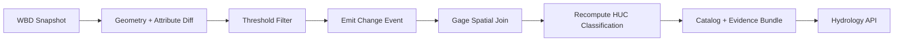

<!--
doc_id: KFM-HYDRO-WBD-WATCHER
title: WBD HUC-12 Change Detection & Hydrologic Impact Watcher
type: standard
version: v1
status: draft
owners: [@bartytime4life]  # NEEDS VERIFICATION
created: 2026-04-02
updated: 2026-04-02
policy_label: public
related:
  - docs/domains/hydrology/README.md
  - docs/governance/ROOT_GOVERNANCE.md
  - docs/standards/KFM_MARKDOWN_WORK_PROTOCOL.md
tags: [kfm, hydrology, wbd, change-detection, provenance, evidence-first]
notes:
  - Paths and owners NEEDS VERIFICATION before merge
-->

# 🌊 WBD HUC-12 Watcher
**Purpose:** Detect meaningful watershed boundary changes and emit evidence-backed impact events (with affected USGS gages and recomputed classifications).

---

## 🚦 Status
| Field | Value |
|------|------|
| Status | 🧪 draft |
| Owners | @bartytime4life *(NEEDS VERIFICATION)* |
| Scope | Kansas-first, scalable national |
| Trust Mode | Evidence-first / emit-only |

---

## 🔗 Repo Fit
| Layer | Path | Role |
|------|------|------|
| Domain | `docs/domains/hydrology/` | Hydrologic authority |
| Pipeline | `pipelines/wbd-watcher/` *(PROPOSED)* | Diff + event emission |
| Catalog | `data/catalog/hydrology/` *(PROPOSED)* | Evidence + lineage |
| API | `services/hydrology-api/` *(PROPOSED)* | Event exposure |

---

## 📥 Accepted Inputs
- WBD HUC-12 snapshots (USGS TNM)
- USGS streamgage index + NWIS daily flow
- Optional: NHD / NHDPlus flowlines

---

## 🚫 Exclusions
- No inferred hydrologic truth without evidence
- No silent geometry overrides
- No derived layers superseding authoritative WBD

---

# 🧠 System Overview



---

# 📦 Data Model

## HUC Baseline Record
```json
{
  "huc12": "string",
  "spec_hash": "string",
  "product_version": "string",
  "last_modified": "timestamp",
  "geom_hash": "string",
  "attrs_hash": "string"
}
```

---

## Change Event (DecisionEnvelope-aligned)
```json
{
  "event_id": "uuid",
  "huc12": "string",
  "detected_at": "timestamp",
  "deltas": {
    "area_pct": "number",
    "centroid_shift_m": "number",
    "topology_changed": "boolean",
    "attrs_changed": ["string"]
  },
  "thresholds_triggered": ["string"],
  "evidence_refs": [
    {"product": "WBD", "version": "string", "id": "string"}
  ],
  "affected_gages": [
    {
      "site_no": "string",
      "name": "string",
      "nwis_url": "string"
    }
  ],
  "classification_update": {
    "previous": "PERENNIAL|EPHEMERAL",
    "new": "PERENNIAL|EPHEMERAL",
    "confidence": "number"
  },
  "outcome": "ANSWER|ABSTAIN|DENY|ERROR"
}
```

---

# 🔍 Diff Engine

## Geometry Diff Rules
| Metric | Threshold | Meaning |
|--------|----------|--------|
| Area change | > 0.1% | Significant boundary change |
| Centroid shift | > 10–50 m | Spatial relocation |
| Topology change | boolean | Ring/vertex change |

## Attribute Diff Rules
Watch:
- NAME
- HUType
- parent linkage

---

## Geometry Hash (deterministic)
```python
def geom_hash(geom):
    geom = orient(geom)
    geom = round_coords(geom, precision=6)
    return sha256(geom.wkb)
```

---

# 🧪 Event Emission Rules

Emit ONLY if:

```
(area_pct > threshold)
OR (centroid_shift > threshold)
OR (topology_changed == true)
OR (attrs_changed not empty)
```

Otherwise → NO EVENT

---

# 📡 Impact Detection

## Spatial Join
- Point-in-polygon join of USGS gages → HUC-12

## Output
- station id
- station name
- NWIS link

---

# 🌾 Kansas Classification Logic

## Rule Set (Flow Persistence)

| Metric | Threshold |
|-------|----------|
| Median daily flow | > 0 |
| Zero-flow days | ≤ 5% |
| Monthly persistence | ≥ 8 months active |

---

## Classification

```
IF all thresholds met → PERENNIAL
ELSE → EPHEMERAL
```

---

## Evidence Artifact
```json
{
  "huc12": "string",
  "classification": "PERENNIAL",
  "inputs": {
    "gage_ids": ["..."],
    "flow_series_range": "..."
  },
  "metrics": {
    "median_flow": "number",
    "zero_flow_pct": "number",
    "active_months": "number"
  },
  "spec_hash": "string",
  "computed_at": "timestamp"
}
```

---

# 🧾 Provenance + Governance

## Truth Labels
- CONFIRMED → WBD geometry + metadata
- INFERRED → classification derived from flow
- PROPOSED → thresholds adjustable
- NEEDS VERIFICATION → repo wiring

---

## Trust Rules
- Derived classifications NEVER override WBD geometry
- All outputs must trace:
  - Snapshot → Diff → Event → EvidenceBundle
- Corrections must preserve lineage (CorrectionNotice)

---

# 📊 API Surface (PROPOSED)

## GET `/hydrology/huc12/{id}/changes`
Returns:
- Change history
- Evidence refs
- Impact summary

## GET `/hydrology/huc12/{id}/classification`
Returns:
- Current classification
- Metrics
- Confidence

---

# ⚙️ Implementation Sketch

```python
for huc in wbd_new:
    old = baseline[huc.id]

    delta = diff(old, huc)

    if not triggers(delta):
        continue

    event = build_event(huc, delta)

    event.affected_gages = spatial_join(gages, huc)

    event.classification_update = recompute_classification(huc)

    emit(event)
```

---

# ✅ Task List

- [ ] WBD ingestion + snapshot hashing
- [ ] Geometry diff engine
- [ ] Attribute diff engine
- [ ] Event emitter (DecisionEnvelope)
- [ ] Gage join pipeline
- [ ] Kansas classifier module
- [ ] EvidenceBundle builder
- [ ] API exposure
- [ ] CI validation (diff determinism)

---

# 📌 Definition of Done

- Deterministic diffs across runs
- All events include EvidenceRef + lineage
- No silent updates
- Classification reproducible from inputs

---

# ❓ FAQ

### Why thresholded diffs?
Prevents noise from trivial geometry edits.

### Why emit-only?
Aligns with KFM “finite outcomes” rule.

### Why gage join?
Links boundary changes to real hydrologic impact.

---

# 📚 Appendix

## Key Concepts
- HUC-12 = subwatershed unit
- Flow persistence = % of time water is present
- EvidenceBundle = traceable proof package

---

⬆️ Back to top
