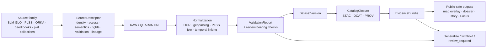

<!-- [KFM_META_BLOCK_V2]
doc_id: kfm://doc/NEEDS-VERIFICATION-land-tenure-readme
title: Land Tenure
type: standard
version: v1
status: draft
owners: NEEDS VERIFICATION
created: YYYY-MM-DD
updated: YYYY-MM-DD
policy_label: public
related: [NEEDS-VERIFICATION:../README.md, NEEDS-VERIFICATION:../../README.md, NEEDS-VERIFICATION:contracts/source/, NEEDS-VERIFICATION:catalogs/, NEEDS-VERIFICATION:story-surfaces/]
tags: [kfm, land-tenure, cadastral, plss, parcels, deeds, plats]
notes: [Target path requested for this document is docs/domains/land-tenure/README.md., Current-session repo verification was PDF-only rather than a mounted checkout., Underlying parcel and cadastral materials may require restricted or generalized handling even if this README itself is public.]
[/KFM_META_BLOCK_V2] -->

<a id="top"></a>

# Land Tenure

Governed domain index for Kansas patents, PLSS, parcels, deeds, plats, and chain-of-title context.

> [!NOTE]
> **Status:** experimental  
> **Owners:** NEEDS VERIFICATION  
>      
> **Quick jumps:** [Scope](#scope) · [Repo fit](#repo-fit) · [Accepted inputs](#accepted-inputs) · [Exclusions](#exclusions) · [Current verified snapshot](#current-verified-snapshot) · [Directory tree](#directory-tree) · [Quickstart](#quickstart) · [Diagram](#diagram) · [Core source families](#core-source-families) · [Task list](#task-list--definition-of-done) · [FAQ](#faq)  
> **Repo fit:** `docs/domains/land-tenure/README.md` is the requested domain entry point for this lane. Upstream and downstream neighbors beyond this target path remain **NEEDS VERIFICATION** until the mounted repository tree is directly inspected.  
> **Accepted inputs:** source descriptors, source-family notes, legal-description handling rules, PLSS join guidance, evidence-linkage patterns, public-safe publication rules, and domain-facing references for patents, parcels, deeds, and plats.  
> **Exclusions:** unsupported ownership claims, silent person-level exposure, undocumented parcel exports, speculative chain-of-title synthesis, and any statement that treats unverified repo structure or implementation depth as settled fact.

> [!IMPORTANT]
> This lane is **review-bearing by design**. Identity resolution, OCR/geoparsing, temporal linking, and person-or-parcel exposure must stay visibly governed rather than being flattened into a generic “land layer.”

> [!WARNING]
> Current-session evidence confirms the **doctrine** of the land-tenure lane, not the live mounted implementation behind it. Treat all adjacent paths, owners, workflows, schemas, and fixture locations below as **NEEDS VERIFICATION** unless explicitly marked otherwise.

## Scope

The land-tenure lane covers the Kansas materials KFM consistently treats as part of its structural operating model:

- patents and land grants
- PLSS / township-range-section framing
- parcels, plats, and deeds
- chain-of-title context
- legal land descriptions and their geospatial joins
- evidence-linked historical and contemporary land overlays

This README is the routing surface for **how those materials should be admitted, described, handled, and published safely** inside KFM.

It is not a substitute for a deeds manual, a county parcel handbook, a legal title guide, or a generic zoning notebook.

[Back to top](#top)

## Repo fit

| Path / surface | Role here | Relationship |
| --- | --- | --- |
| `docs/domains/land-tenure/README.md` | this file | target domain index for the land-tenure lane |
| `docs/domains/` | probable parent domain hub | upstream **NEEDS VERIFICATION** |
| `contracts/source/` | probable home for source-intake contracts such as `SourceDescriptor` | adjacent contract surface **PROPOSED path; NEEDS VERIFICATION** |
| `catalogs/` or release metadata surfaces | probable home for STAC / DCAT / PROV closure | downstream **NEEDS VERIFICATION** |
| story / dossier / Focus surfaces | outward consumers of public-safe land-tenure outputs | downstream **NEEDS VERIFICATION** |

### What belongs here

This lane should own or route:

- source-family guidance for land-tenure inputs
- handling rules for legal descriptions and PLSS joins
- lane-specific publication burdens
- public-safe output patterns for maps, dossiers, stories, and Focus surfaces
- cross-references to source descriptors, evidence bundles, and release-safe examples

### What belongs elsewhere

Keep the following in neighboring lanes or contract surfaces instead:

- generic source-onboarding doctrine
- cross-cutting policy registries
- repo-wide QA and CI guidance
- broad archives or oral-history reuse policy
- hydrology, hazards, ecology, or service-geography content that only incidentally touches land

## Accepted inputs

This lane should accept material such as:

- **BLM GLO land patent** source notes and descriptors
- **PLSS grid** handling notes and georeferencing rules
- **ORKA / county parcel GIS** intake notes for current parcel context
- **deed books** and **plat collections** where provenance, rights, and OCR posture are explicit
- **legal land description** parsing rules and PLSS-join examples
- **public-safe derivative patterns** for land-tenure maps, story overlays, and dossier context
- **release-facing metadata hooks** for STAC, DCAT, PROV, EvidenceBundle, and related proof objects

## Exclusions

This lane should not become a home for:

- unreviewed person-level ownership publication
- parcel dumps with hidden rights or precision problems
- OCR text treated as final truth without confidence and review context
- synthetic historical parcel timelines presented as settled fact
- zoning or land-use content that is not actually tied to land-tenure evidence handling
- generic “property law” prose with no KFM contract or publication consequence
- statements about repo shape, workflows, schemas, or runtime behavior that have not been directly verified

## Current verified snapshot

### CONFIRMED

- KFM treats **land tenure, cadastral history, parcels, plats, and deeds** as a structural Kansas operating lane.
- The lane’s representative source families include **BLM GLO**, **PLSS**, **ORKA / county parcel GIS**, **deed books**, and **plat collections**.
- This lane is explicitly marked as **review-bearing** because identity resolution, OCR/geoparsing, and temporal linking are not low-risk transforms.
- KFM’s source-onboarding posture is **contract-first**, not “download first, explain later.”
- KFM expects outward metadata and lineage closure to link **STAC**, **DCAT**, and **PROV** rather than treating them as competing systems.

### INFERRED

- Some KFM materials indicate partial work toward historical land overlays, deed/plat integration, and contemporary vector ETL for parcel and boundary context.
- Public-safe outputs for this lane likely feed map, dossier, story, and Focus surfaces rather than existing as a standalone raw-record browser.
- A land-tenure thin slice would likely need at least: one source descriptor, one legal-description/PLSS normalization example, one dataset version, one catalog closure, and one evidence bundle.

### UNKNOWN / NEEDS VERIFICATION

- Whether `docs/domains/land-tenure/` already contains subdirectories beyond this README
- Exact neighboring docs and relative links
- Actual owners / CODEOWNERS assignment
- Existing schema, fixture, validator, and workflow locations
- Whether a live release-proof example already exists for this lane
- The exact implementation depth of deed/plat timeline integration

[Back to top](#top)

## Directory tree

### Current verified minimum

```text
docs/
└── domains/
    └── land-tenure/
        └── README.md
```

### PROPOSED starter shape (NEEDS VERIFICATION)

```text
docs/
└── domains/
    └── land-tenure/
        ├── README.md
        ├── references/
        │   └── source-families-and-codes.md
        ├── sources/
        │   └── source-registry.md
        ├── examples/
        │   ├── source_descriptor.blm-glo.example.json
        │   └── legal-description.plss-join.example.md
        └── stories/
            └── homesteading-waves.md
```

The starter shape above is intentionally small. It is meant to support **descriptor-first admission**, **one worked example**, and **one public-safe narrative slice** before this lane expands.

## Quickstart

1. Start with a **source descriptor**, not a file pile.
2. Declare the source’s **support**, **time semantics**, **rights posture**, and **publication intent** before intake.
3. For legal descriptions, document the **PLSS join strategy** and any unresolved ambiguity.
4. Treat person- or parcel-level exposure as **restricted / generalized by default** unless review says otherwise.
5. Link every outward-facing claim to a release-safe evidence path.

### Illustrative starter descriptor

```yaml
source_id: land.blm_glo.patents
title: Kansas land patents
provider: Bureau of Land Management
spatial_frame: PLSS
time_semantics: issue_date
modeled_vs_observed: statutory_record
publication_intent: public_safe_summary_plus_evidence_linkage
review_triggers:
  - owner-name exposure
  - unresolved legal-description join
  - OCR ambiguity
  - parcel-level precision beyond allowed audience
```

> [!TIP]
> Keep the first slice narrow. One source family + one join pattern + one public-safe output is more aligned with KFM than a broad “land data hub” that outruns its evidence and review model.

## Usage

### Use this README when the work is about

- how KFM should admit and govern land-tenure sources
- how a legal description becomes mappable without hiding uncertainty
- how parcel or patent data becomes public-safe context
- how story, dossier, or Focus outputs should inherit release, rights, and review posture

### Route elsewhere when the work is about

- general KFM contract doctrine
- repo-wide policy registries
- broad archive ingestion unrelated to land identity
- purely contemporary zoning or planning classifications without cadastral context
- county-specific deed transcription operations that need their own runbook

### Truth labels used in this lane

| Label | Meaning here |
| --- | --- |
| **CONFIRMED** | supported by the attached KFM doctrinal corpus visible in the current session |
| **INFERRED** | strongly implied by multiple KFM materials but not directly repo-verified |
| **PROPOSED** | recommended document or directory shape consistent with doctrine |
| **UNKNOWN / NEEDS VERIFICATION** | not directly verified from the mounted repository, schemas, workflows, or runtime proof |

## Diagram



The key rule is visible in the flow itself: **review-bearing transforms sit before outward publication**, not after it.

[Back to top](#top)

## Core source families

| Source family | What it contributes | Typical handling posture | Notes |
| --- | --- | --- | --- |
| **BLM GLO land patents** | historical patent records, patentee names, issue dates, legal descriptions | public-domain source; outward person/parcel exposure still needs lane-aware handling | strong candidate for a first historical thin slice |
| **PLSS grid** | township-range-section frame for georeferencing legal descriptions | low-risk supporting grid; stable reference scaffold | essential join surface for legal descriptions and patents |
| **ORKA / county parcel GIS** | current parcel ownership and property context | **restricted / generalized by default** for outward use | access and county terms may vary |
| **Deed books / Register of Deeds archives** | transfer history, chain-of-title context, mortgages, recorded instruments | review-bearing; OCR, reuse rights, and name exposure matter | high-value but higher-friction source family |
| **Plat collections** | historical survey/plat context, parcel layout, subdivision history | review-bearing; georeferencing and scan provenance matter | useful for time-aware overlays |
| **Kansas DASC / Geoportal** | supporting PLSS, boundary, and land-cover context | supporting source, not sole tenure truth | helpful for joins and contextual overlays |

## Publication burden and handling matrix

| Material type | Default outward posture | Why |
| --- | --- | --- |
| Patent metadata summary | public-safe with evidence linkage | historic record with strong public interest, but still needs context and time semantics |
| Raw parcel-level ownership detail | generalized or withheld unless reviewed | person-level exposure and county-term variation can matter |
| Legal land description text | review-bearing | parsing and georeferencing can introduce false precision |
| OCR of deed or plat text | review-bearing + confidence-aware | OCR errors can silently distort ownership or chronology |
| Linked owner timeline | review-bearing / often restricted | temporal linking and identity resolution raise evidentiary stakes |
| Historical plat overlay | public-safe only when provenance and georeferencing are explicit | scan lineage and map-fit uncertainty must remain visible |

> [!IMPORTANT]
> “Public-safe” in KFM does **not** mean “raw by default.” It means the representation is appropriate to audience, rights posture, precision limits, and review state.

## Minimum descriptor expectations for this lane

| Field family | What this lane especially needs |
| --- | --- |
| **Identity** | stable source id, provider, steward/contact, canonical source reference |
| **Access** | fetch mode, county or source variability, rate / lookup constraints |
| **Semantics** | grain, support, time basis, legal-description conventions, modeled-vs-observed classification |
| **Rights and sensitivity** | license / public-record posture, redistribution limits, owner-name exposure rules, precision constraints |
| **Validation** | OCR checks, legal-description parse checks, temporal sanity, join confidence, duplicate / conflict rules |
| **Lineage** | raw artifact family, transform chain, PLSS join logic, outbound catalog closure expectations |

## Worked lane posture

### A good first thin slice

A strong starter slice for this lane would likely be:

1. **BLM GLO land patents**
2. one documented **PLSS join pattern**
3. one governed **DatasetVersion**
4. one outward **CatalogClosure**
5. one **EvidenceBundle** driving a public-safe story or map context block

### A bad first thin slice

Avoid starting with a broad “all Kansas parcels through time” promise. That would combine the hardest parts of the lane—identity resolution, county variability, OCR, legal-description parsing, rights posture, and temporal linking—before the review and proof objects are visible enough to trust.

## Task list / definition of done

- [ ] Owners verified from mounted repo evidence
- [ ] Adjacent upstream / downstream doc paths verified
- [ ] At least one source descriptor example exists for a land-tenure source family
- [ ] PLSS join guidance is documented with one worked example
- [ ] Public-safe vs restricted handling rule is explicitly written for parcel and deed material
- [ ] One example evidence path is shown from source intake to outward land-tenure output
- [ ] Any adjacent schema / validator / fixture locations are linked only after direct verification
- [ ] README remains aligned with the lane’s review-bearing burden and does not overclaim implementation depth

## FAQ

### Is this lane only about current parcels?

No. KFM’s land-tenure lane explicitly includes **patents, PLSS, parcels, plats, deeds, chain-of-title context, and legal descriptions**.

### Are parcel or cadastral materials public-safe by default?

No. This lane should assume **generalization, withholding, or review** where person-level exposure, county terms, or precision risks matter.

### Why is PLSS so central here?

Because legal land descriptions often become mappable only after a **township-range-section** interpretation or join. Without that, “location” can sound precise while staying operationally ambiguous.

### Does this README prove that KFM already has a full land-history pipeline running?

No. The doctrine and source families are well supported, but mounted implementation depth in the current session remains **UNKNOWN / NEEDS VERIFICATION**.

### Is zoning part of this lane?

Not by default. Include zoning only when it is directly relevant to cadastral or land-tenure interpretation and when the evidence path is explicit.

[Back to top](#top)

## Appendix

<details>
<summary><strong>Open verification backlog</strong></summary>

| Item | Why it matters | Current status |
| --- | --- | --- |
| Adjacent path inventory | prevents fake links and false repo fit claims | NEEDS VERIFICATION |
| Live schema / fixture locations | determines whether examples should point to real contracts | NEEDS VERIFICATION |
| Workflow / CI coverage | determines whether gate language is descriptive or enforced | NEEDS VERIFICATION |
| Existing land-tenure subdocs | avoids overwriting or duplicating stronger local docs | NEEDS VERIFICATION |
| Release-proof example for this lane | needed to move from doctrine to verified operational proof | NEEDS VERIFICATION |
| Public-safe vs precise comparison flow | required for higher-risk publication cases | NEEDS VERIFICATION |

</details>

<details>
<summary><strong>Illustrative output families for land-tenure work</strong></summary>

```text
SourceDescriptor
IngestReceipt
ValidationReport
DatasetVersion
CatalogClosure
EvidenceBundle
ReviewRecord
ReleaseManifest / ReleaseProofPack
CorrectionNotice
```

These families are lane-relevant because the land-tenure lane is not just a source list. It is a governed path from source admission to outward claim.

</details>
