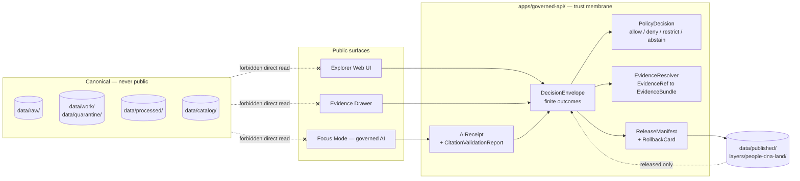

<!-- [KFM_META_BLOCK_V2]
doc_id: kfm://doc/people-dna-land/api-contracts
title: People / Genealogy / DNA / Land — API Contracts
type: standard
version: v1
status: draft
owners: <People/DNA/Land domain steward — TODO>, <Governed API owner — TODO>, <privacy / consent steward — TODO>
created: 2026-05-18
updated: 2026-06-06
policy_label: restricted
related:
  # NEEDS VERIFICATION — paths PROPOSED until checked against a mounted repo
  - docs/domains/people-dna-land/README.md
  - docs/domains/people-dna-land/sublanes/README.md
  - docs/runbooks/people-dna-land/PROMOTION_RUNBOOK.md
  - docs/standards/PROV.md
  - directory-rules.md
  - ai-build-operating-contract.md
  - schemas/contracts/v1/domains/people-dna-land/
  - policy/domains/people-dna-land/
tags: [kfm, domain, api, contracts, people, genealogy, dna, land, trust-membrane]
notes:
  # CONTRACT_VERSION = "3.0.0"
  # Routes, app paths, schema URIs, CI badge targets are PROPOSED until verified in a mounted repo.
  # Segment reconciliation: Directory Rules §12 uses people-dna-land; Atlas §24.13 crosswalk uses a shorter people/ segment for schemas/policy. Open ADR (Q-4 / OQ-PEOPLE-DNA-11).
  # Domain-level doc (NOT a sublane doc); the sublanes/ ADR does not govern its placement, but it cross-links it.
[/KFM_META_BLOCK_V2] -->

# People / Genealogy / DNA / Land — API Contracts

> Governed-API contract surfaces for the **People / DNA / Land** domain — the trust-membrane shape every public, semi-public, and AI surface MUST consume to reach this domain's evidence. Living-person fields, DNA-derived outputs, raw kit/vendor IDs, and private person↔parcel joins are **deny-by-default**; surfaces never return canonical store paths, RAW/WORK/QUARANTINE payloads, or unbounded model generations.


| Field | Value |
|---|---|
| **Status** | `draft` (doctrine grounded; implementation **PROPOSED** unless repo verified) |
| **Owners** | People/DNA/Land domain steward · Governed API owner · privacy / consent steward *(named owners — `NEEDS VERIFICATION`)* |
| **Contract** | `CONTRACT_VERSION = "3.0.0"` |
| **Authority root (PROPOSED)** | `apps/governed-api/` (trust membrane) · `schemas/contracts/v1/domains/people-dna-land/` · `policy/domains/people-dna-land/` |
| **Lifecycle anchor** | `RAW → WORK/QUARANTINE → PROCESSED → CATALOG/TRIPLET → PUBLISHED` *(CONFIRMED doctrine)* |
| **Last updated** | 2026-06-06 |

---

## Contents

1. [Purpose & scope](#1-purpose--scope)
2. [Repo fit](#2-repo-fit)
3. [Trust-membrane posture](#3-trust-membrane-posture)
4. [Governed surface inventory](#4-governed-surface-inventory)
5. [`PeopleDNALandDecisionEnvelope` — feature / detail resolver](#5-peopledndalanddecisionenvelope--feature--detail-resolver)
6. [Layer manifest resolver](#6-layer-manifest-resolver)
7. [Evidence Drawer payload](#7-evidence-drawer-payload)
8. [Focus Mode (governed AI) surface](#8-focus-mode-governed-ai-surface)
9. [Correction submission](#9-correction-submission)
10. [Review decision surface](#10-review-decision-surface)
11. [Finite outcome semantics](#11-finite-outcome-semantics)
12. [Sensitivity & deny-default matrix](#12-sensitivity--deny-default-matrix)
13. [Forbidden behaviors](#13-forbidden-behaviors)
14. [Validators, fixtures, negative-path tests](#14-validators-fixtures-negative-path-tests)
15. [Cross-domain edges](#15-cross-domain-edges)
16. [Open questions & verification backlog](#16-open-questions--verification-backlog)
17. [Related docs](#17-related-docs)
18. [Appendix — illustrative envelope shapes](#18-appendix--illustrative-envelope-shapes)

---

## 1. Purpose & scope

This document specifies the **governed-API contract surfaces** that the People / Genealogy / DNA / Land domain exposes for public clients, semi-public surfaces (the Explorer web UI, Evidence Drawer, Focus Mode), and steward-facing tooling. It is **not** a route inventory of the running system — exact routes, framework, app path, and middleware are **PROPOSED / NEEDS VERIFICATION** until a mounted repo can be inspected. It **is** the doctrinal and design contract those routes MUST conform to when they are built or audited.

In scope: the set of surface families and what each returns; the finite outcome envelope every surface MUST return; the deny-default posture for living-person, DNA-derived, raw-kit-ID, and private person↔parcel content; the cross-cutting object families (`EvidenceBundle`, `EvidenceRef`, `PolicyDecision`, `AIReceipt`, `LayerManifest`, `ReleaseManifest`, `RollbackCard`) this domain composes with; and the forbidden behaviors that would collapse the trust membrane.

Out of scope: the internal pipeline shape (RAW→PUBLISHED — see the Promotion Runbook); source-family rights and intake-tier rules (see the domain `README.md`); renderer / MapLibre layer behaviors; and JSON-Schema form (see `schemas/contracts/v1/domains/people-dna-land/`, PROPOSED home).

> [!IMPORTANT]
> *People / DNA / Land* is one of KFM's most sensitive domains. The defaults here are deliberately strict: **deny first, redact and aggregate by exception, and never let fluent AI generation stand in for evidence, policy, review state, or release state.** Implementations MAY widen access only under an explicit, reviewed, recorded policy gate — never silently.

[Back to top](#contents)

---

## 2. Repo fit

This document sits in the **`docs/`** responsibility root because its primary job is to explain a contract to humans. Its **downstream peers** live in `contracts/`, `schemas/`, `policy/`, and `apps/governed-api/`; its **upstream peer** is the domain `README.md`.

| Surface | PROPOSED path | Class | Authority |
|---|---|---|---|
| This document | `docs/domains/people-dna-land/API_CONTRACTS.md` | Standard doc | Contract doctrine |
| Domain landing | `docs/domains/people-dna-land/README.md` | Standard doc | Domain doctrine |
| Promotion runbook | `docs/runbooks/people-dna-land/PROMOTION_RUNBOOK.md` | Operational | Promotion lifecycle |
| Object semantics | `contracts/domains/people-dna-land/` | Canonical | Object meaning |
| Machine schemas | `schemas/contracts/v1/domains/people-dna-land/` | Canonical | Object shape *(per ADR-0001 default)* |
| Domain policy | `policy/domains/people-dna-land/` | Canonical | Admissibility / release |
| Consent policy | `policy/domains/people-dna-land/consent/` *(or `policy/consent/people/` per Atlas §24.13 — see note)* | Canonical | Consent / revocation |
| Tests | `tests/domains/people-dna-land/` | Canonical | Enforcement proof |
| Fixtures | `fixtures/domains/people-dna-land/` *or* `tests/fixtures/people-dna-land/` | Canonical | Golden / negative |
| Public trust membrane | `apps/governed-api/` | Canonical | Public route home |
| Public renderer | `apps/explorer-web/` *(consumes governed API only)* | Canonical | Render surface |

> [!NOTE]
> **Segment reconciliation (open ADR).** The Atlas §24.13 crosswalk uses a shorter `people/`
> segment (`schemas/contracts/v1/people/`, `policy/sensitivity/people/`, `policy/consent/people/`)
> while Directory Rules §12 lists **`people-dna-land`** as the canonical domain segment. Both are
> PROPOSED and they diverge; this is tracked as Q-4 below and as OQ-PEOPLE-DNA-11 in the sublane
> docs. A one-line ADR should freeze the form. Until then, both spellings are **NEEDS
> VERIFICATION** wherever they appear. Do not create both as parallel homes (§2.4(5)).

[Back to top](#contents)

---

## 3. Trust-membrane posture

The People / DNA / Land domain participates in the same governed-API trust membrane every KFM domain uses, but applies the **strictest** defaults of any non-archaeology domain. The membrane rule is doctrine, not preference:

```text
Public client / UI / AI surface
        |
        v
   apps/governed-api/   <- enforcement: release state, policy, evidence, rights, sensitivity
        |
        v
   released artifacts only (data/published/, layer manifests, EvidenceBundles)
        |
        v
   never: data/raw/, data/work/, data/quarantine/, canonical stores, direct model output
```

| Rule | Status | Source |
|---|---|---|
| Public clients consume **governed APIs only**; never canonical stores, raw tiles, or internal triplets. | CONFIRMED doctrine | Atlas §24.6.2; KFM-P1-FEAT-0038 |
| Every governed response is a **finite envelope** including outcome, evidence_refs, policy_decision, rights_posture, and release_state. Deny is a first-class outcome. | CONFIRMED doctrine | Atlas §24.3 |
| AI answers are **API outcomes, not sovereign generations**; AI never replaces evidence, policy, review, source authority, or release state. | CONFIRMED doctrine | GAI; operating contract §9.2 |
| Living-person output, DNA-derived output, raw kit/vendor IDs, and DNA segments are **denied or restricted by default**; assessor/tax records and parcel geometry are **not title truth**. | CONFIRMED doctrine | DOM-PEOPLE §I; ENCY |
| Unclear rights, unresolved source role, missing evidence, unresolved sensitivity, or absent release state **blocks public promotion**. | CONFIRMED doctrine | ENCY; DIRRULES |
| `PUBLISHED` is the **only** state from which the governed API may emit `ANSWER`. | CONFIRMED doctrine | Atlas §24.6.2 |

> [!WARNING]
> **`DENY` is correct behavior, not a bug.** A People/DNA/Land surface that returns `DENY` because consent is missing, the release manifest is absent, the source role is unresolved, or the request would expose a living-person field has done its job. Reviewers MUST resist pressure to widen access at the surface layer; widening requires a policy gate, evidence, review record, and recorded promotion decision **upstream**.



[Back to top](#contents)

---

## 4. Governed surface inventory

The domain exposes **six** governed-API surface families. Every family returns a finite envelope and a resolvable `EvidenceRef` set, or it returns `ABSTAIN` / `DENY` / `ERROR`. All routes, methods, and path shapes below are **PROPOSED**; exact routes are `UNKNOWN` until the repo is mounted and `apps/governed-api/` is inspected.

| # | Surface family | DTO / envelope | Outcomes | Status |
|---|---|---|---|---|
| §5 | Feature / detail resolver | `PeopleDNALandDecisionEnvelope` (extends `DecisionEnvelope`) | `ANSWER` / `ABSTAIN` / `DENY` / `ERROR` | **PROPOSED** governed API surface; exact route **UNKNOWN** |
| §6 | Layer manifest resolver | `LayerManifest` (domain layer descriptor) | `ANSWER` / `DENY` / `ERROR` | **PROPOSED**; public-safe release only |
| §7 | Evidence Drawer payload | `EvidenceDrawerPayload` + `EvidenceBundle` projection | `ANSWER` / `ABSTAIN` / `DENY` / `ERROR` | **PROPOSED**; evidence and policy filtered |
| §8 | Focus Mode (governed AI) | `RuntimeResponseEnvelope` + `AIReceipt` + `CitationValidationReport` | `ANSWER` / `ABSTAIN` / `DENY` / `ERROR` | **PROPOSED**; AI never root truth |
| §9 | Correction submission | `CorrectionNoticeCandidate` | `ANSWER` (accepted) / `DENY` / `ERROR` | **PROPOSED** |
| §10 | Review decision | `ReviewRecord` + `PolicyDecision` | `ALLOW` / `RESTRICT` / `DENY` / `HOLD` / `ERROR` | **PROPOSED**; steward-only |

> [!NOTE]
> The correction and review surfaces use the canonical outcome vocabulary, not bespoke
> labels. A correction submission that is queued returns `ANSWER` carrying a
> `CorrectionNoticeCandidate` reference (the earlier draft's `ACCEPTED` is not in the finite
> set — Atlas §24.3.1). The review surface emits the **gate** outcomes `ALLOW / RESTRICT /
> DENY / HOLD / ERROR`, which are `PolicyDecision`-class, distinct from the public envelope's
> `ANSWER / ABSTAIN / DENY / ERROR`. [Atlas §24.3.1; operating contract §8]

Each surface family below names its **inputs**, **output envelope**, **finite outcomes**, **required artifacts on `ANSWER`**, **explicit deny reasons it MUST return**, and **forbidden return values**. Field-level JSON shapes are illustrative; binding schemas live (or will live) under `schemas/contracts/v1/domains/people-dna-land/` and the cross-cutting `…/evidence/`, `…/policy/`, `…/ai/`, `…/map/` homes.

[Back to top](#contents)

---

## 5. `PeopleDNALandDecisionEnvelope` — feature / detail resolver

**Purpose.** Resolve a clicked / requested People/DNA/Land feature (person assertion, residence event, parcel version, ownership interval, etc.) to a finite envelope carrying the evidence, policy, release, and rights posture needed to render it on a public surface.

**Inputs (PROPOSED):**

- `feature_id` — opaque, released identifier (**never** a raw GEDCOM ID, kit/vendor ID, internal store path, or directly mappable PII).
- `layer_id` — released `LayerManifest` reference for the layer the feature belongs to.
- `time_window` (optional) — bounded valid/observation time scope.
- `user_role` / capability claim — used by `PolicyDecision`, not embedded in the public answer.

**Output:** `PeopleDNALandDecisionEnvelope` — an extension of the cross-cutting `DecisionEnvelope` that always carries:

| Field | Purpose | Required on `ANSWER` |
|---|---|---|
| `outcome` | One of `ANSWER` · `ABSTAIN` · `DENY` · `ERROR` | always |
| `evidence_refs[]` | `EvidenceRef` pointers; MUST resolve to released `EvidenceBundle`(s) | on `ANSWER` |
| `policy_decision` | `PolicyDecision` reference (allow / deny / restrict / abstain / error + reasons + obligations) | always |
| `rights_posture` | Source-role rights summary (authority / observed / context / modeled) | on `ANSWER` |
| `release_state` | Bound `ReleaseManifest` reference | on `ANSWER` |
| `correction_link` | Link to active `CorrectionNotice` if any | when applicable |
| `rollback_target` | Pointer to `RollbackCard` for the bound release | on `ANSWER` |
| `sensitivity` | Public-safe tier label (`T0` / `T1` / `T2`); never reveals upstream `T3`/`T4` content | on `ANSWER` |
| `stale_state` | Stale-source indicator if applicable | when applicable |
| `confidence_or_scope` | Bounded confidence / narrowed-scope hint | optional |

**Outcomes — required deny reasons** (machine-readable; additional codes may exist):

`living_person_without_consent` · `dna_or_genomic_payload_restricted` · `raw_kit_or_vendor_id_in_request_or_response` · `private_person_parcel_join_denied` · `assessor_or_tax_record_as_title_claim` · `parcel_geometry_as_title_boundary_claim` · `unresolved_evidence_ref` · `unresolved_source_role` · `unresolved_rights_or_terms` · `missing_release_manifest` · `consent_revoked` · `sensitivity_unresolved`

**Forbidden return values.** A `PeopleDNALandDecisionEnvelope` MUST NEVER include: direct names, exact dates of birth, raw GEDCOM identifiers, family IDs; DNA segment data, raw kit/vendor identifiers, triangulation data, chromosome-painting data; exact burial coordinates for non-public cemeteries / sacred sites; raw assessor / tax-roll PII or unredacted parcel-owner joins for living persons; internal store paths (`data/raw/...`, `data/work/...`, `data/quarantine/...`, `data/catalog/...`); unreleased candidate records (anything without a bound `ReleaseManifest`).

> [!CAUTION]
> The deny codes above are an enforceable surface contract, not advisory. A `PolicyDecision` allowing release of any of these without a recorded `ReviewRecord` and consent or aggregation gate is treated as a **policy violation**, not a permissible exception.

See [§11](#11-finite-outcome-semantics) for outcome definitions and [§18](#18-appendix--illustrative-envelope-shapes) for an illustrative JSON shape.

[Back to top](#contents)

---

## 6. Layer manifest resolver

**Purpose.** Return a `LayerManifest` for a released People / DNA / Land map layer, or refuse if the layer is not in a public-safe release state.

**Inputs (PROPOSED):** `layer_id` (released layer identifier); `release_id` (optional — request a specific bound release for reproducibility / rollback).

**Output:** `LayerManifest` carrying at minimum:

| Field | Purpose |
|---|---|
| `layer_id`, `title`, `geometry_type` | Layer identity |
| `source_id` / `source_refs[]` | Bound `SourceDescriptor`(s) and source-role labels |
| `evidence_ref_field` | Per-feature evidence-pointer field name |
| `temporal_fields` | Valid / observation / release time fields |
| `policy_label` | `public` / `restricted` / `internal` / `aggregate_only` |
| `release_state` | `PUBLISHED` (only valid public-surface value) |
| `sensitivity_default` | Tier label for the layer as a whole |
| `aggregation_or_redaction_profile` | Named redaction / generalization / k-anonymity profile applied |
| `correction_link` | Active corrections, if any |
| `rollback_target` | `RollbackCard` reference |
| `attribution` | Source attribution string(s) |

**Outcomes:** `ANSWER` / `DENY` / `ERROR` — **no `ABSTAIN`**. (CONFIRMED — Atlas §24.3.2: the layer manifest resolver either has a `ReleaseManifest` or it does not; serving WORK/CATALOG layers to public clients is the forbidden behavior.)

**Domain-specific layer families** (PROPOSED, must be public-safe at the layer level): historical person profile maps (public-only persons); residence/event timelines (generalized or county-level when needed); migration paths with uncertainty bands; land parcel context with **explicit title-truth disclaimer** field; chain-of-title summaries (public instruments only); land-instrument timeline views. *Restricted lanes never on a public layer manifest:* DNA/consent review, living-person review.

> [!IMPORTANT]
> A `LayerManifest` returned to a public client MUST carry an explicit `sensitivity_default` and `aggregation_or_redaction_profile`. Layers that depend on **style-only hiding** for sensitive geometry are forbidden — the sensitive-geometry deny rule applies before tile generation.

[Back to top](#contents)

---

## 7. Evidence Drawer payload

**Purpose.** Power the Evidence Drawer for a clicked People / DNA / Land feature: surface the resolved `EvidenceBundle`, source posture, citations, policy / review / release state, stale state, and correction links.

**Inputs (PROPOSED):** `feature_id` / `layer_id` (released identifiers only); `evidence_ref` (optional direct pointer); `user_role` / capability claim.

**Output:** `EvidenceDrawerPayload` — a governed projection of `EvidenceBundle` plus surrounding policy / release context. Required on `ANSWER`: resolved `EvidenceBundle` reference(s) and a public-safe projection of claims and citations; source-role badges (authority / observed / context / modeled) for every cited source; `PolicyDecision` summary with reasons and obligations; `release_state` and `release_id`; `stale_state` when applicable; active `CorrectionNotice` links; related Story Nodes (if released); limitations / caveats ("assessor records are observations, not title truth", etc.) where the claim warrants it.

**Outcomes:** `ANSWER` / `ABSTAIN` / `DENY` / `ERROR`.

| Outcome | Triggers (illustrative, non-exhaustive) |
|---|---|
| `ANSWER` | Bundle resolved, policy allow, release published, citation validation pass. |
| `ABSTAIN` | Evidence missing or insufficient; citation cannot be validated; source roles conflict; stale source with no released alternative. |
| `DENY` | Living-person field requested without consent; DNA payload; raw GEDCOM ID in request; assessor-as-title claim; private person↔parcel join. |
| `ERROR` | Malformed query, missing schema, contract violation, infrastructure failure. |

> [!TIP]
> The Evidence Drawer is the **trust-visible** surface where uncertainty, source posture, and limitations belong. If a claim has to be hedged, hedge it in the drawer projection, not in the popup or the AI answer. A popup MAY summarize the drawer; a popup MUST NOT replace it. [Atlas §24.9.2 — popup-as-drawer-substitute is an anti-pattern]

[Back to top](#contents)

---

## 8. Focus Mode (governed AI) surface

**Purpose.** Answer evidence-bounded natural-language questions about released People / DNA / Land material. AI is **interpretive**, not authoritative; `EvidenceBundle` outranks generated language.

**Request:** `FocusModeRequest` carrying `question`, `MapContextEnvelope` (released layers, viewport, time window, selected feature IDs), explicit `evidence_refs[]`, `policy_context`, and `user_role`. **No** raw model client from the browser; **no** RAW / WORK / direct-model paths.

**Response:** `FocusModeResponse` — a `RuntimeResponseEnvelope` extension with finite outcome, an `AIReceipt` reference, and a bound `CitationValidationReport`.

| Field | Purpose | Required on `ANSWER` |
|---|---|---|
| `outcome` | `ANSWER` / `ABSTAIN` / `DENY` / `ERROR` | always |
| `answer_text` | The generated answer; cite-or-abstain | on `ANSWER` |
| `citations[]` | EvidenceBundle citations resolving every load-bearing claim | on `ANSWER` |
| `abstain_reason` | Why no answer was generated | on `ABSTAIN` |
| `deny_reason` | Machine-readable code matching §5's deny vocabulary | on `DENY` |
| `policy_decisions[]` | Bound `PolicyDecision` references | always |
| `confidence_or_scope` | Bounded confidence / scope narrowing | optional |
| `limitations[]` | "Assessor records are not title truth"; "DNA inference restricted"; etc. | as applicable |
| `ai_receipt_ref` | `AIReceipt` pointer (provider, model, prompt/context hash, citation report ID) | always |

**Domain-specific deny vocabulary** Focus Mode MUST honor:

- ABSTAIN — `evidence_missing` · `citation_unvalidated` · `source_roles_conflict` · `temporal_scope_insufficient` · `inference_unsupported`.
- DENY — every code listed in [§5](#5-peopledndalanddecisionenvelope--feature--detail-resolver), plus the cross-cutting `raw_or_work_or_quarantine_access`, `restricted_personal_or_dna_inference`, and `uncited_authoritative_claim`.

**Permitted Focus Mode behaviors** (CONFIRMED doctrine, PROPOSED implementation): summarize released People/DNA/Land `EvidenceBundle`s; compare evidence across released sources; explain limitations of an assertion (e.g., parcel geometry ≠ title boundary); draft steward-review notes. [DOM-PEOPLE §L]

**Forbidden Focus Mode behaviors:** inferring living-person identities, kinship, or DNA relationships beyond released material; naming a living person, exact DOB, GEDCOM ID, kit/vendor ID, or DNA segment in any output; stating an assessor record proves title; claiming exact burial coordinates for non-public cemeteries; substituting fluent prose for `EvidenceBundle`, `PolicyDecision`, `ReviewRecord`, or `ReleaseManifest`.

> [!WARNING]
> A `FocusModeResponse` without a resolvable `AIReceipt` and a passing `CitationValidationReport` is **not a valid `ANSWER`**. The runtime MUST coerce to `ABSTAIN` and emit the receipt rather than ship the prose. [CONFIRMED — operating contract §9.2; Atlas §24.9.2]

[Back to top](#contents)

---

## 9. Correction submission

**Purpose.** Accept a public-or-internal correction claim against a released People/DNA/Land feature, layer, or claim. Corrections are first-class governance objects — they are how this domain stays correctable.

**Inputs (PROPOSED):** `target_ref` (released feature/layer/claim, opaque public ID); `correction_class` (`factual` · `attribution` · `sensitivity` · `rights` · `withdrawal` · `supersession`); `claimed_evidence_refs[]`; `submitter_role` (public / verified contributor / steward); description (text or structured).

**Output:** `CorrectionNoticeCandidate` reference + acknowledgement envelope.

**Outcomes:** `ANSWER` (queued) / `DENY` / `ERROR`.

- `ANSWER` — candidate queued for steward review; submitter receives a `CorrectionNoticeCandidate` ID; the public correction link surfaces in future `EvidenceDrawerPayload` responses for the target.
- `DENY` — submission references unreleased material; attempts to add living-person identifiers; would re-disclose previously-redacted PII; violates a consent-revocation status.
- `ERROR` — schema violation, infrastructure failure.

> [!NOTE]
> A queued correction returns `ANSWER` carrying the candidate reference — not a bespoke
> `ACCEPTED` value (which is not in the finite outcome set, Atlas §24.3.1). Acceptance into the
> queue is **not** a verdict: a correction notice does not become public lineage until a
> `ReviewRecord` lands and a release decision supersedes, withdraws, or annotates the target.
> Until then, the target MAY surface a "pending correction" state in the drawer.

[Back to top](#contents)

---

## 10. Review decision surface

**Purpose.** Record a steward / reviewer / rights-holder decision on a queued People / DNA / Land item (source activation, consent, sensitivity, correction, promotion, rollback). Steward-only — it does not appear in the public client.

**Inputs (PROPOSED):** `queue` (`source` · `rights` · `sensitivity` · `consent` · `correction` · `promotion` · `rollback`); `item_id`; decision payload (`allow` / `restrict` / `deny` / `hold` + reasons + obligations + required artifacts); reviewer identity / role / capability claim (audited).

**Output:** `ReviewRecord` + linked `PolicyDecision`.

**Outcomes (gate-class, `PolicyDecision`):** `ALLOW` / `RESTRICT` / `DENY` / `HOLD` / `ERROR`.

| Outcome | Effect |
|---|---|
| `ALLOW` | Item proceeds; downstream gate(s) may still block. |
| `RESTRICT` | Item proceeds under named restriction (aggregated only, county-level only, named-party access only). |
| `DENY` | Item is refused; reason recorded; correction lineage preserved. |
| `HOLD` | Promotion / release / correction paused pending review; surface remains in prior state; **no silent rollback or replacement**. |
| `ERROR` | Schema / contract / infrastructure failure. |

> [!IMPORTANT]
> Reviewer separation of duties applies once maturity justifies it: the steward who **proposes** a promotion is not the steward who **decides** the release. This is doctrine (Atlas §24.9.3; operating contract); the API does not strictly enforce it yet, but `ReviewRecord` schemas leave room for distinct `proposer` and `decider` identities, and CI policy gates MAY refuse same-identity promotion in sensitive lanes (PROPOSED; tracked as ADR-S-09).

[Back to top](#contents)

---

## 11. Finite outcome semantics

Every governed surface returns one of the cross-cutting outcomes. The semantics below are **CONFIRMED doctrine** for the whole system (Atlas §24.3.1); the People/DNA/Land triggers in §5–§10 are the domain's specialization.

| Outcome | When | Required artifacts | Public-surface effect |
|---|---|---|---|
| `ANSWER` | Evidence sufficient, policy permits, release state allows, review state (if required) recorded. | `EvidenceBundle` resolved · `PolicyDecision = allow` · `ReleaseManifest` applies. | Substantive answer + drawer + citations. |
| `ABSTAIN` | Evidence insufficient or incomplete; cannot cite; stale with no released alternative. | `AIReceipt` with reason; **no claim emitted**. | Non-substantive note + reason. Never invents. |
| `DENY` | Policy, rights, sensitivity, or release state forbids the answer. Sensitive lanes default here. | `PolicyDecision = deny + reason_code` · `AIReceipt` records denial. | Denial reason; alternative non-restricted surface where possible. |
| `ERROR` | Cannot evaluate — missing schema, malformed query, contract violation, infrastructure failure. | Finite error envelope with diagnostic code; **no claim leakage**. | Actionable error; never silently falls through to a different lane. |
| `HOLD` (review) | Promotion / release / correction paused pending steward, rights-holder, or policy review. | `ReviewRecord pending` · `PolicyDecision = hold`. | Internal surface; public state unchanged. |
| `PASS` / `FAIL` (validator) | Internal validator outcome. | `ValidationReport`. | Internal only; does not directly emit a public answer. |

> [!CAUTION]
> Surfaces MUST NEVER fall through silently between outcomes (e.g., return an empty `ANSWER` when the correct outcome is `ABSTAIN`, or return `ERROR` when the correct outcome is `DENY`). Silent fallthrough is a contract violation — clients depend on the deny path being **visibly** the deny path. [Atlas §24.3.1]

> [!NOTE]
> The operating contract also defines two optional `RuntimeResponseEnvelope` extensions —
> `NARROWED` (answer within a tighter scope than requested) and `BOUNDED` (answer with explicit
> confidence/coverage bounds). These are extensions of `ANSWER`, not separate public outcomes;
> this domain MAY use them via `confidence_or_scope`. [operating contract §8]

[Back to top](#contents)

---

## 12. Sensitivity & deny-default matrix

This domain's defaults are deliberately strict. The table summarizes class-level tier defaults and the **only** allowed transforms toward public exposure. Tier transitions follow Atlas §24.5.3 (a tier upgrade toward public always needs both a transform receipt and a `ReviewRecord`).

| Object class | Default tier | Allowed transforms (PROPOSED) | Required gates | Citation |
|---|---|---|---|---|
| Living-person fields | **T4 deny** | Aggregation by tract or county + `AggregationReceipt` → T1 | Consent **or** aggregation gate + `ReviewRecord` | DOM-PEOPLE; Atlas §24.5.3 |
| Raw DNA segment data | **T4 deny** | No transform releases this to a public tier; T3 only under explicit named research agreement | Named consent + `ReviewRecord` + `PolicyDecision` | DOM-PEOPLE; Atlas §24.5 |
| Raw kit / vendor IDs | **T4 deny** | No public-tier transform | Internal only | DOM-PEOPLE |
| Private person↔parcel join | **T4 deny** | Generalized parcel + de-identified person → T2 only | `RedactionReceipt` + `ReviewRecord` | DOM-PEOPLE; Atlas §24.5 |
| GEDCOM raw payload | **T4** (RAW only) | Never directly published, mapped, or exposed via identifiers | Extraction → governed claims → `EvidenceBundle` → `OverlayPointer` | DOM-PEOPLE |
| Exact burial coordinates (sensitive cemeteries / sacred sites) | **T4** | Generalization + steward review → T2 / T1 | `RedactionReceipt` + `ReviewRecord` | DOM-PEOPLE; DOM-ARCH |
| Public historical persons (deceased; rights clear) | T1 / T0 | Direct release | `EvidenceBundle` + `ReleaseManifest` | DOM-PEOPLE |
| Public land instruments (patents, deeds; rights clear) | T1 / T0 | Direct release with **"not title truth"** disclaimer on derived parcel geometry | `EvidenceBundle` + `ReleaseManifest` | DOM-PEOPLE |
| Assessor / tax-roll records | T2 — released as **administrative**, not title truth | Source-role anti-collapse enforced | `EvidenceBundle` + role label + disclaimer | DOM-PEOPLE; Atlas §24.1 |

**Standard public projection** (illustrative) — what a public client receives for a person/parcel feature when answer is allowed:

```json
{
  "outcome": "ANSWER",
  "overlay_pointer": "overlay://<opaque-nonce>",
  "policy_label": "public",
  "sensitivity": "T1",
  "rights_posture": "open",
  "retention": "P90D",
  "no_reidentification": true,
  "evidence_refs": ["kfm://evidence/<bundle-id>"]
}
```

**Forbidden in public projections:** names, exact DOBs, GEDCOM/family IDs, kit/vendor IDs, DNA segments, exact burial coordinates, raw assessor/tax payload.

[Back to top](#contents)

---

## 13. Forbidden behaviors

Surface-level failure modes that constitute trust-membrane violations. **Non-negotiable.** (Cross-referenced to Atlas §24.9.2 trust-membrane anti-patterns.)

| # | Forbidden behavior | Why it fails |
|---|---|---|
| 1 | A public client reading `data/raw/`, `data/work/`, `data/quarantine/`, `data/catalog/`, or any canonical store directly. | Public route MUST go through `apps/governed-api/` (trust membrane). |
| 2 | A connector writing to `data/processed/` or `data/published/`. | Connectors emit to `data/raw/` or `data/quarantine/`; pipelines promote. |
| 3 | A worker writing to `data/catalog/` or `data/published/`. | Watcher-as-non-publisher invariant — workers emit receipts and candidate decisions only. |
| 4 | Returning an `ANSWER` without a resolvable `EvidenceBundle`. | Cite-or-abstain rule. |
| 5 | Returning an `ANSWER` for an unreleased candidate (no bound `ReleaseManifest`). | `PUBLISHED` is the only state that may emit `ANSWER`. |
| 6 | Embedding names, exact DOBs, GEDCOM/family IDs, kit IDs, DNA segments, or exact burial coordinates in any public payload. | Living-person / DNA / sensitive-geometry defaults. |
| 7 | A Focus Mode answer without an `AIReceipt` and passing `CitationValidationReport`. | AI is interpretive; uncited generation is forbidden. |
| 8 | Equating an assessor or tax-roll record with title. | Source-role anti-collapse. |
| 9 | Equating parcel geometry with a title boundary. | Geometry-role boundary. |
| 10 | Hiding sensitive geometry by **style only** at render time. | Sensitive geometry is generalized, redacted, delayed, or denied **before tile generation**. |
| 11 | A popup acting as Evidence Drawer substitute. | Popups may summarize; claims resolve through the drawer. |
| 12 | Returning an `ERROR` to mask a `DENY`, or an empty `ANSWER` to mask an `ABSTAIN`. | Silent fallthrough breaks downstream surface contracts. |
| 13 | Returning consent-revoked content because of cache. | Revocation triggers embargo and cache invalidation downstream. |
| 14 | Treating a `docs/` page as the source of a canonical decision. | Promote to ADR or `control_plane/` register. |

[Back to top](#contents)

---

## 14. Validators, fixtures, negative-path tests

Surface conformance is proven by **fixture-backed validators** that run in CI before any contract is treated as enforced. The list is **PROPOSED** until tests are observed in a mounted repo.

**Schema / shape validators:** `DecisionEnvelope` / `PeopleDNALandDecisionEnvelope` shape; `LayerManifest` / `EvidenceDrawerPayload` / `FocusModeRequest` / `FocusModeResponse` / `AIReceipt` / `CitationValidationReport` / `PolicyDecision` / `ReviewRecord` / `CorrectionNoticeCandidate` shapes; `EvidenceRef` resolves to a released `EvidenceBundle`; `ReleaseManifest` references on every `ANSWER`.

**Domain-specific negative-path fixtures** *(every one MUST exist and MUST fail closed)*:

| Fixture | Expected outcome | What it proves |
|---|---|---|
| `living_person_export.json` | `DENY` | Living-person field requested → denied. |
| `dna_payload_export.json` | `DENY` | DNA payload requested → denied. |
| `raw_kit_id_request.json` | `DENY` | Raw kit/vendor ID anywhere in input or output → denied. |
| `raw_gedcom_overlay.json` | `DENY` | Raw GEDCOM identifier in overlay → denied. |
| `expired_consent_receipt.json` | `DENY` | Expired consent → denied. |
| `revoked_consent_receipt.json` | `DENY` | Revoked consent → denied (and downstream cache invalidated). |
| `missing_retention.json` | `DENY` | Consent receipt without retention bound → denied. |
| `exact_burial_coordinates.json` | `DENY` | Exact sensitive cemetery coordinate → denied (style-only hiding insufficient). |
| `assessor_as_title.json` | `DENY` | Assessor record framed as title proof → denied. |
| `parcel_geometry_as_title.json` | `DENY` | Parcel geometry equated to title boundary → denied. |
| `private_person_parcel_join.json` | `DENY` | Living-person↔parcel join → denied. |
| `unresolved_evidence_ref.json` | `ABSTAIN` | Bundle pointer fails to resolve → abstain. |
| `stale_source_no_alternative.json` | `ABSTAIN` | Stale source with no released alternative → abstain. |
| `unreleased_candidate.json` | `DENY` | Candidate without `ReleaseManifest` → denied. |
| `invalid_signature.json` | `ERROR` | DSSE signature invalid → error envelope; **no claim leakage**. |
| `valid_public_overlay.json` | `ANSWER` | Released, consent-clear, public-safe overlay → answer + drawer payload. |

**Cross-cutting negative-path tests:** public route reading a canonical store → reject in CI; `RuntimeResponseEnvelope` returning a non-finite outcome value → reject; `FocusModeResponse` without bound `AIReceipt` → reject; `EvidenceDrawerPayload` without resolvable `EvidenceBundle` → reject.

[Back to top](#contents)

---

## 15. Cross-domain edges

The People / DNA / Land surfaces compose with other domains under strict constraints. Every cross-edge MUST preserve ownership, source role, sensitivity, and `EvidenceBundle` support. [Atlas §16.F]

| Edge | Direction | Relation | Constraint |
|---|---|---|---|
| People/DNA/Land ↔ Settlements | bidirectional | residence, cemetery, school, court, county, township, place relation | Residence events anchor settlement membership; **living-person fields fail closed**. |
| People/DNA/Land ↔ Roads/Rail | bidirectional | migration, access, movement | Sensitivity preserved across the join. |
| People/DNA/Land ↔ Archaeology | bidirectional | historic person, land, documentary, cultural-place context | Cultural affiliations cited with rights, sovereignty, and steward review. |
| People/DNA/Land ↔ Agriculture | bidirectional | farm, land use, producer-adjacent context | `LandParcel` context may bound field-candidate joins; **private person↔parcel joins denied by default**. |
| People/DNA/Land → Frontier Matrix | one-way | aggregated population observations feed matrix cells | Aggregation receipts required; matrix cells do not edit person assertions. Frontier↔People/Land edge forbids living/DNA/title leakage. |
| Frontier Matrix → People/DNA/Land | (not allowed direction) | — | Matrix cells are derivatives; they do not become person-truth. |

[Back to top](#contents)

---

## 16. Open questions & verification backlog

**NEEDS VERIFICATION** until a mounted repo settles them. Track in `docs/registers/VERIFICATION_BACKLOG.md`.

| # | Item | Evidence that would settle it | Status |
|---|---|---|---|
| Q-1 | Exact governed-API route names and HTTP methods. | `apps/governed-api/src/routes/*` inspection. | NEEDS VERIFICATION |
| Q-2 | Backend framework (Node/TS, Python/FastAPI, other) and OpenAPI vs GraphQL. | `apps/governed-api/` package manifest. | NEEDS VERIFICATION |
| Q-3 | Schema home: `schemas/contracts/v1/domains/people-dna-land/` vs `schemas/contracts/v1/people/`. | Repo inspection + ADR-0001 application. | NEEDS VERIFICATION |
| Q-4 | Naming form: `people-dna-land` (Directory Rules §12) vs `people` (Atlas §24.13 crosswalk). | One-line ADR; observed repo state. | **CONFLICTED** (= OQ-PEOPLE-DNA-11) |
| Q-5 | Consent-receipt schema home: `schemas/governance/...` vs `schemas/contracts/v1/...`. | Repo inspection + ADR-0001 / ADR-S-03. | NEEDS VERIFICATION |
| Q-6 | OPA / Conftest / cosign / DSSE tool pins for People/DNA/Land policies. | `policy/`, `tools/`, CI workflow inspection. | NEEDS VERIFICATION |
| Q-7 | Living-person policy bundle implementation. | `policy/domains/people-dna-land/` + tests. | NEEDS VERIFICATION |
| Q-8 | DNA consent / revocation enforcement implementation. | consent policy + fixtures + tests. | NEEDS VERIFICATION |
| Q-9 | Land-instrument chain logic. | `contracts/domains/people-dna-land/` + tests. | NEEDS VERIFICATION |
| Q-10 | Geometry-role boundary logic (parcel ≠ title boundary). | Schema + validators + tests. | NEEDS VERIFICATION |
| Q-11 | UI / API restricted-field no-leak behavior. | Integration tests, fixtures, runtime logs. | NEEDS VERIFICATION |
| Q-12 | CODEOWNERS for this domain's contract files. | `.github/CODEOWNERS`. | NEEDS VERIFICATION |
| Q-13 | Reviewer separation-of-duties enforcement (proposer ≠ decider) for sensitive promotions. | Policy bundle + CI gate (ADR-S-09). | OPEN |
| Q-14 | Whether `OverlayPointer` is its own governed surface or a field within `EvidenceDrawerPayload`. | Schema + envelope examples. | OPEN |

[Back to top](#contents)

---

## 17. Related docs

- `docs/domains/people-dna-land/README.md` — domain landing, scope, sources, posture *(PROPOSED; NEEDS VERIFICATION)*
- `docs/domains/people-dna-land/sublanes/README.md` — sublanes index *(PROPOSED; convention pending the `sublanes/` ADR)*
- `docs/adr/ADR-NNNN-sublanes-docs-convention.md` — `sublanes/` convention ADR *(proposed; relevant to the segment-naming Q-4)*
- `docs/runbooks/people-dna-land/PROMOTION_RUNBOOK.md` — lifecycle promotion procedure *(PROPOSED)*
- `docs/runbooks/people-dna-land/VALIDATION_RUNBOOK.md` · `…/ROLLBACK_RUNBOOK.md` — *(TODO — to be created)*
- `docs/architecture/` — cross-cutting trust-membrane doctrine *(exact filename NEEDS VERIFICATION; corpus uses `trust-membrane.md` under `docs/doctrine/` in some trees)*
- [`docs/standards/PROV.md`](../../standards/PROV.md) — provenance standard profile
- [`directory-rules.md`](../../../directory-rules.md) — §12 Domain Placement Law (source for the `people-dna-land` segment)
- [`ai-build-operating-contract.md`](../../../ai-build-operating-contract.md) — operating law (`CONTRACT_VERSION = "3.0.0"`; §8 finite outcomes, §9.2 trust objects)
- Cross-domain surfaces: `docs/domains/settlements-infrastructure/`, `docs/domains/archaeology/`, `docs/domains/agriculture/`, `docs/domains/roads-rail-trade/` *(PROPOSED; NEEDS VERIFICATION)*

[Back to top](#contents)

---

## 18. Appendix — illustrative envelope shapes

> The shapes below are **illustrative**, not binding. Binding shapes live in `schemas/contracts/v1/...` (PROPOSED). Fields are subject to schema review.

<details>
<summary><b>Illustrative <code>PeopleDNALandDecisionEnvelope</code> (ANSWER case)</b></summary>

```json
{
  "object_type": "PeopleDNALandDecisionEnvelope",
  "schema_version": "v1",
  "envelope_id": "env-pdl-2026-06-06-0001",
  "outcome": "ANSWER",
  "feature_id": "kfm://feature/people-dna-land/<opaque-released-id>",
  "layer_id": "kfm://layer/people-dna-land/historical-persons-1860-1920",
  "release_state": "PUBLISHED",
  "release_manifest_ref": "kfm://release/people-dna-land/2026-05-15",
  "rollback_target": "kfm://rollback/people-dna-land/2026-05-15.rollback.json",
  "policy_decision": {
    "decision_id": "pd-pdl-2026-06-06-0001",
    "outcome": "allow",
    "policy_id": "kfm.policy.people_dna_land.public_release.v1",
    "reasons": ["public_historical_person", "evidence_closure_passed"],
    "obligations": ["display_source_role_badges", "display_correction_link_if_any"]
  },
  "rights_posture": "open",
  "sensitivity": "T1",
  "evidence_refs": ["kfm://evidence/<bundle-id-a>", "kfm://evidence/<bundle-id-b>"],
  "stale_state": null,
  "correction_link": null,
  "confidence_or_scope": { "scope": "released_only" }
}
```

</details>

<details>
<summary><b>Illustrative <code>PeopleDNALandDecisionEnvelope</code> (DENY case — living-person request)</b></summary>

```json
{
  "object_type": "PeopleDNALandDecisionEnvelope",
  "schema_version": "v1",
  "envelope_id": "env-pdl-2026-06-06-0002",
  "outcome": "DENY",
  "deny_reason": "living_person_without_consent",
  "policy_decision": {
    "decision_id": "pd-pdl-2026-06-06-0002",
    "outcome": "deny",
    "policy_id": "kfm.policy.people_dna_land.living_person.v1",
    "reasons": ["living_person_default_deny", "consent_receipt_not_present"],
    "obligations": []
  },
  "evidence_refs": [],
  "alternative_surface": {
    "type": "aggregated_layer",
    "layer_id": "kfm://layer/people-dna-land/aggregate-county-1990-2020"
  }
}
```

</details>

<details>
<summary><b>Illustrative <code>FocusModeResponse</code> (ABSTAIN case — citation cannot be validated)</b></summary>

```json
{
  "object_type": "FocusModeResponse",
  "schema_version": "v1",
  "outcome": "ABSTAIN",
  "abstain_reason": "citation_unvalidated",
  "answer_text": null,
  "citations": [],
  "policy_decisions": ["kfm://policy-decision/<id>"],
  "limitations": ["Underlying EvidenceBundle could not be resolved at request time."],
  "ai_receipt_ref": "kfm://ai-receipt/<id>",
  "citation_validation_report_ref": "kfm://citation-report/<id>"
}
```

</details>

<details>
<summary><b>Illustrative public projection (what a public client actually receives)</b></summary>

```json
{
  "outcome": "ANSWER",
  "overlay_pointer": "overlay://9f2a-7d1c-...",
  "policy_label": "public",
  "sensitivity": "T1",
  "rights_posture": "open",
  "retention": "P90D",
  "no_reidentification": true,
  "evidence_refs": ["kfm://evidence/<bundle-id>"],
  "correction_link": null,
  "stale_state": null
}
```

Note the absence of: names, exact DOBs, GEDCOM IDs, family IDs, kit IDs, DNA segments, exact coordinates, internal store paths.

</details>

---

**Last updated:** 2026-06-06 · **Doc id:** `kfm://doc/people-dna-land/api-contracts` · **Status:** draft · **Doc class:** standard · `CONTRACT_VERSION = "3.0.0"`

[Back to top](#contents)
