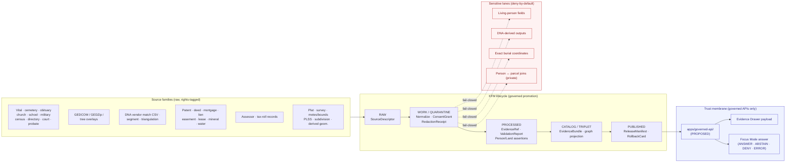

<!-- [KFM_META_BLOCK_V2]
doc_id: kfm://doc/domains/people-dna-land/architecture
title: People / Genealogy / DNA / Land Ownership — Domain Architecture
type: standard
version: v1
status: draft
owners: <docs-steward + people-dna-land domain stewards — TODO confirm via CODEOWNERS>
created: 2026-05-18
updated: 2026-05-18
policy_label: public
related:
  - docs/domains/README.md
  - docs/doctrine/directory-rules.md
  - docs/doctrine/trust-membrane.md
  - docs/doctrine/lifecycle-law.md
  - contracts/domains/people-dna-land/ (PROPOSED)
  - schemas/contracts/v1/people/ (PROPOSED)
  - policy/sensitivity/people/ (PROPOSED)
  - policy/consent/people/ (PROPOSED)
  - tools/ingest/genealogy/README.md (PROPOSED)
tags: [kfm, domain, people, genealogy, dna, land, sensitive, assertion-first]
notes:
  - Living-person, DNA, raw-kit, and exact-burial outputs are deny-by-default.
  - Assessor / tax records are NOT title truth; parcel geometry is NOT title boundary proof.
  - All repo paths are PROPOSED until verified against a mounted repo and Directory Rules.
[/KFM_META_BLOCK_V2] -->

# People / Genealogy / DNA / Land Ownership — Domain Architecture

> Assertion-first, evidence-bound, privacy-aware governance for person, genealogy, DNA, and land-ownership claims across Kansas Frontier Matrix — with default denial for living-person and DNA-derived outputs.

<!-- Badges: targets are placeholders pending CI/owners verification. -->


<!-- TODO: replace with live Shields.io endpoints once CI workflows and CODEOWNERS are confirmed. -->


**Status:** `draft` · **Owners:** `<docs-steward + people-dna-land stewards — TODO>` · **Last updated:** `2026-05-18`

> [!IMPORTANT]
> This domain owns some of KFM's most consequential restrictions. Living-person fields, DNA / genomic outputs, raw kit or vendor identifiers, exact burial coordinates, and person↔parcel joins are **deny-by-default**. Assessor or tax records are not equivalent to title; parcel geometry is not title-boundary proof. When in doubt: quarantine, generalize, delay, or deny — never silently publish.

---

## Contents

- [1. Mission and boundary](#1-mission-and-boundary)
- [2. Scope and explicit non-ownership](#2-scope-and-explicit-non-ownership)
- [3. Ubiquitous language](#3-ubiquitous-language)
- [4. Bounded-context diagram](#4-bounded-context-diagram)
- [5. Canonical object families](#5-canonical-object-families)
- [6. Source families and source roles](#6-source-families-and-source-roles)
- [7. Spatial and temporal model](#7-spatial-and-temporal-model)
- [8. Pipeline shape: RAW → PUBLISHED](#8-pipeline-shape-raw--published)
- [9. Sensitivity, rights, and publication posture](#9-sensitivity-rights-and-publication-posture)
- [10. Cross-lane relations](#10-cross-lane-relations)
- [11. API, contract, and schema surfaces](#11-api-contract-and-schema-surfaces)
- [12. Governed AI behavior for this domain](#12-governed-ai-behavior-for-this-domain)
- [13. Validators, tests, and fixtures](#13-validators-tests-and-fixtures)
- [14. Publication, correction, and rollback](#14-publication-correction-and-rollback)
- [15. Directory Rules placement](#15-directory-rules-placement)
- [16. Open questions and verification backlog](#16-open-questions-and-verification-backlog)
- [17. Related docs](#17-related-docs)

---

## 1. Mission and boundary

**`CONFIRMED` doctrine / `PROPOSED` implementation.** This domain represents people, genealogy, DNA evidence, and land ownership as **assertion-first, evidence-bound, privacy-aware claims** with strong default denial for living-person and DNA / genomic data. It owns person assertions, identity resolution, genealogy relations, family groups, life and residence events, migrations, land-ownership assertions, deed and title instruments, assessor and tax records, parcels, temporal ownership, and DNA match evidence.

It **must not** infer living-person or DNA relationships publicly without policy approval, and it **must not** equate assessor records or parcel geometry with title truth.

Doctrinal anchors: KFM Encyclopedia §7.14, Culmination Atlas §16, Unified Manual §6.13 (`[DOM-PEOPLE]`, `[ENCY]`, `[UNIFIED]`).

> [!NOTE]
> The lane is described in the corpus as one of the strongest illustrations of "evidence is insufficient for publication by itself." A relationship hypothesis, DNA match, lineage inference, person assertion, or land-ownership statement can affect privacy, family identity, living persons, legal interests, and cultural sensitivity. This domain is deliberately governance-heavy.

---

## 2. Scope and explicit non-ownership

### 2.1 What this domain owns

`CONFIRMED` doctrine / `PROPOSED` implementation. The owned object families are:

`PersonAssertion`, `PersonCanonical`, `PersonIdentityCandidate`, `NameAssertion`, `GenealogyRelationship`, `RelationshipAssertion`, `FamilyGroup`, `LifeEvent`, `ResidenceEvent`, `MigrationEvent`, `LandOwnershipAssertion`, `DeedInstrument`, `TitleInstrument`, `AssessorRecord`, `TaxRecord`, `ParcelVersion`, `OwnershipInterval`, `DNAMatchEvidence`, `DNASegment`, `DNAKitToken`, `ConsentGrant`, `RevocationReceipt`, `RelationshipHypothesis`, `ReviewRecord`. `[DOM-PEOPLE]` `[ENCY]`

### 2.2 What this domain explicitly does **not** own

| Adjacent lane | Why it is **not** owned here |
|---|---|
| **Settlements / Infrastructure** | Owns legal-municipality, census-place, infrastructure-asset, service-area, and condition semantics. |
| **Roads / Rail / Trade** | Owns route, corridor, network-graph, and historic-route semantics. |
| **Archaeology / Cultural Heritage** | Owns site, survey, oral-history, exact-location-denial, and steward-review semantics. |
| **Hydrology · Soil · Agriculture · Hazards · Spatial Foundation** | Provide context only; **must not** weaken living-person, DNA, title, or parcel-boundary controls. |
| **Frontier Matrix** | Owns county-year analytical panels; this domain feeds residence/population observations as inputs only. |

`CONFIRMED` doctrine: Settlements, roads, archaeology, hydrology, agriculture, hazards, and spatial foundation provide context but do not weaken living-person, DNA, title, or parcel-boundary controls. `[DOM-PEOPLE]` `[ENCY]`

[⬆ back to top](#contents)

---

## 3. Ubiquitous language

`CONFIRMED` terms / `PROPOSED` field realization. These terms are used inside this bounded context with meaning constrained by source role, evidence, time, and release state. Preserve casing and compound forms exactly. `[DOM-PEOPLE]` `[ENCY]` `[DDD]`

| Term | Meaning inside this bounded context |
|---|---|
| **PersonAssertion** | A claim that a person existed with given attributes at a given time, evidence-bound and source-role-tagged. Never a canonical person record on its own. |
| **PersonCanonical** | A reconciled person identity resolved from multiple `PersonAssertion`s and accepted via review. Internal-only by default for living persons. |
| **NameAssertion** | A claim of a name, alias, or variant for a person within a specific source and time. |
| **PersonIdentityCandidate** | A pre-reconciliation grouping suggesting multiple assertions may refer to the same person. Not a confirmation. |
| **LifeEvent** | Birth, death, baptism, marriage, divorce, naturalization, or comparable life event, asserted with evidence. |
| **ResidenceEvent** | A residency claim at a place over a time interval, evidence-bound. |
| **MigrationEvent** | A movement between residences/places with temporal scope and uncertainty. |
| **GenealogyRelationship** / **RelationshipAssertion** | An evidence-bound assertion of relationship (parent, child, spouse, sibling, etc.); remains a hypothesis until reviewed. |
| **FamilyGroup** | A reviewed grouping of `RelationshipAssertion`s under a stewarded canonical view. |
| **RelationshipHypothesis** | A proposed but not-yet-reviewed relationship, often DNA-derived; remains restricted by default. |
| **DNAMatchEvidence** | DNA match record from a vendor or registry. Restricted by default; raw kit/vendor IDs are not public. |
| **DNASegment** | A specific DNA segment record; never public. |
| **DNAKitToken** | An opaque, internal-only handle for a DNA kit. Raw kit/vendor identifiers must not be logged or exposed. |
| **ConsentGrant** | Holder-controlled consent (issuer, subject pseudonym, purposes, scope, retention, revocation pointer). Releasable only when explicitly scoped. |
| **RevocationReceipt** | Tamper-evident record that a previously granted consent has been revoked; enforced at dereference time. |
| **LandOwnershipAssertion** | A claim that a person, entity, or assertion held an interest in a parcel over a time interval. Distinct from title truth. |
| **DeedInstrument** / **TitleInstrument** / **LandInstrument** | A recorded legal instrument (patent, deed, mortgage, lien, easement, lease, mineral, water, access, probate) bound to source role and rights. |
| **AssessorRecord** / **TaxRecord** | Property roll record from an assessor or tax authority. **Not title truth.** |
| **ParcelVersion** | A versioned parcel-geometry snapshot. **Not a title-boundary proof** on its own. |
| **OwnershipInterval** | A temporally bounded ownership claim derived from `LandInstrument`s, with `valid_time` and `source_time`. |
| **LegalDescription** | A metes-and-bounds or PLSS textual description; carries its own provenance and uncertainty. |
| **LandParcel** | The current bounded-context use of a parcel reference; meaning constrained by source role, evidence, time, and release state. |
| **ReviewRecord** | Steward / reviewer decision and reasoning tied to a state transition (admission, promotion, redaction, correction, rollback). |

> [!TIP]
> External standards (GEDCOM, schema.org `Person`, W3C PROV, FAIR/CARE) are **crosswalk targets**, not authority. They never overwrite KFM terminology — `PersonAssertion` is not a GEDCOM `INDI`, and a `LandOwnershipAssertion` is not a county-recorder DTO.

[⬆ back to top](#contents)

---

## 4. Bounded-context diagram

`PROPOSED` rendering. The diagram below reflects doctrine boundaries; route names, package names, and store identifiers are illustrative until a mounted-repo scan confirms them.



> [!NOTE]
> `NEEDS VERIFICATION`: actual route names (`apps/governed-api/...`), package boundaries, and per-feature drawer payload shapes are `PROPOSED` until repo inspection. The diagram captures the **doctrinal** flow.

[⬆ back to top](#contents)

---

## 5. Canonical object families

`CONFIRMED` term / `PROPOSED` implementation. Identity rules are deterministic: `source_id` + `object_role` + `temporal_scope` + normalized digest. Temporal handling keeps `source_time`, `observed_time`, `valid_time`, `retrieval_time`, `release_time`, and `correction_time` distinct where material. `[DOM-PEOPLE]` `[ENCY]`

| Object family | Purpose | Identity rule | Temporal handling |
|---|---|---|---|
| `PersonAssertion` | Source-bound claim of a person | `PROPOSED` deterministic basis: source id + object role + temporal scope + normalized digest | `CONFIRMED` six-time discipline preserved |
| `PersonCanonical` | Reviewed canonical person record | same | same |
| `NameAssertion` | Source-bound name / alias claim | same | same |
| `LifeEvent` | Birth / death / marriage / etc. with evidence | same | same |
| `ResidenceEvent` | Residency over an interval | same | same |
| `MigrationEvent` | Movement between residences | same | same |
| `GenealogyRelationship` | Evidence-bound relationship assertion | same | same |
| `FamilyGroup` | Reviewed relationship aggregation | same | same |
| `LandOwnershipAssertion` | Temporal ownership claim | same | same |
| `DeedInstrument` / `TitleInstrument` | Recorded legal instrument | same | same |
| `AssessorRecord` / `TaxRecord` | Roll record (not title truth) | same | same |
| `ParcelVersion` | Parcel geometry snapshot | same | same |
| `OwnershipInterval` | Time-bounded ownership derivation | same | same |
| `DNAMatchEvidence` | Vendor / registry match record | same | same |
| `DNASegment` | DNA segment data (never public) | same | same |
| `RelationshipHypothesis` | Pre-review relationship proposal | same | same |
| `ReviewRecord` | Steward / reviewer decision | same | same |

> [!CAUTION]
> `AssessorRecord` and `TaxRecord` are **never** to be rendered as title truth. `ParcelVersion` is **never** to be rendered as title boundary proof. Any UI badge, API field, or Focus Mode summary that conflates these is a doctrine violation.

[⬆ back to top](#contents)

---

## 6. Source families and source roles

`CONFIRMED` / `PROPOSED`. Source rights and current terms are `NEEDS VERIFICATION` per source; sensitive joins **fail closed**. `[DOM-PEOPLE]` `[ENCY]`

| Source family | Typical role(s) | Rights / sensitivity | Cadence |
|---|---|---|---|
| Vital · cemetery · burial · obituary · church · school · military · census · directory · court · probate | `authority` / `observation` / `context` / `model` per source role | Rights + current terms `NEEDS VERIFICATION`; sensitive joins fail closed | Source-vintage or cadence specific |
| GEDCOM / GEDZip / tree overlays | `observation` / `context` (treated as hypothesis) | Living-person fields + raw identifiers restricted | Per upload |
| DNA vendor match CSV / segment / triangulation data | `observation` (restricted-by-default) | Raw kit / vendor IDs not public; consent required | Per upload |
| Patent / deed / mortgage / lien / easement / lease / mineral / water / access / probate instruments | `authority` / `observation` | Per recorder; some restrictions apply | Source-cadence specific |
| Assessor and tax-roll records | `observation` / `context` (**not** title) | Per assessor terms | Annual / per cadence |
| Plat / survey / metes-bounds / PLSS / subdivision / derived geometry | `authority` / `observation` / `model` | Per source; geometry-as-truth carefully bounded | Source-cadence specific |

> [!IMPORTANT]
> Treat GEDCOM as **RAW only.** Never directly publish, directly map, or directly expose GEDCOM identifiers. Promotion path: `GEDCOM → RAW → evidence extraction → governed claims → EvidenceBundle → policy review → OverlayPointer → published runtime envelope.`

[⬆ back to top](#contents)

---

## 7. Spatial and temporal model

`CONFIRMED` doctrine / `PROPOSED` implementation:

- **Spatial.** Residences, parcels, and land claims have spatial scope but **must not** be equated with title truth. Parcel geometry is a versioned representation, not a legal boundary. Burial-site exact coordinates are restricted; public exposure requires generalization or denial.
- **Temporal.** Every assertion keeps `source_time`, `observed_time`, `valid_time`, `retrieval_time`, `release_time`, and `correction_time` distinct where material. `OwnershipInterval`s use bitemporal modeling (valid + source) so chain-of-title reconstructions are correctable.
- **Uncertainty.** Genealogy relations and DNA-derived inferences are first-class **hypotheses** with confidence bounds; they are not promoted to canonical relationships without review.

`[DOM-PEOPLE]` `[ENCY]` `[REF-TEMPDB]`

[⬆ back to top](#contents)

---

## 8. Pipeline shape: RAW → PUBLISHED

`CONFIRMED` lifecycle doctrine / `PROPOSED` lane application. People / DNA / Land follows the canonical KFM invariant, with promotion as a **governed state transition** — not a file move. `[DIRRULES]` `[DOM-PEOPLE]` `[ENCY]`

| Stage | Handling | Gate | Status |
|---|---|---|---|
| **RAW** | Capture immutable source payload (or reference) with source role, rights, sensitivity, citation, time, and hash. | `SourceDescriptor` exists. | `PROPOSED` |
| **WORK / QUARANTINE** | Normalize schema, geometry, time, identity, evidence, rights, and policy. Hold failures. Issue `ConsentGrant` / `RedactionReceipt` as required. | Validation + policy gate passes, or `quarantine_reason` is recorded. | `PROPOSED` |
| **PROCESSED** | Emit validated normalized objects, transform receipts, and public-safe candidates. | `EvidenceRef` resolves; `ValidationReport` passes; digest closure exists. | `PROPOSED` |
| **CATALOG / TRIPLET** | Emit catalog records, `EvidenceBundle`s, graph / triplet projections, and release candidates. | Catalog + proof closure passes. | `PROPOSED` |
| **PUBLISHED** | Serve released, public-safe artifacts through governed APIs and manifests. | `ReleaseManifest` + rollback target + correction path + `ReviewRecord` (where required) exist. | `PROPOSED` |

<details>
<summary><strong>Promotion Gates A–G (KFM-wide, applied to this lane)</strong></summary>

`CONFIRMED` doctrine: every released item flows through the KFM Promotion Gate matrix.

| Gate | Purpose | Emits | Pass rule (fail-closed) |
|---|---|---|---|
| **A** | STAC / Evidence validation | `evidence_ref` + `spec_hash` | Valid STAC / `EvidenceRef`; spec hash reproducible |
| **B** | Policy (OPA / Conftest) | `policy_report.json` | No `deny` results; required `allow` satisfied |
| **C** | Artifact signing | DSSE / cosign attestation | Signature present; subject digest bound |
| **D** | Attestation verification | `verify_report.json` | Verified vs subject; trusted issuer |
| **E** | Steward approval | `approval_token.json` (RunReceipt-ready) | Token valid, in window, bound to same `spec_hash` |
| **F** | Integration / smoke | `runtime_smoke.json` | All checks pass; **no PII / sensitivity leaks** |
| **G** | Publish ledger | `ledger_entry.json` + `run_receipt.json` | Entry committed; pointers resolvable; immutable |

For this domain, Gate F additionally enforces no living-person field leak, no raw GEDCOM identifier leak, no DNA segment exposure, and no exact burial coordinates in published payloads.

`PROPOSED` per-gate CI job names follow the KFM `gatehouse` composite pattern; exact names are `NEEDS VERIFICATION` until repo inspection.

</details>

[⬆ back to top](#contents)

---

## 9. Sensitivity, rights, and publication posture

`CONFIRMED` / `PROPOSED`: Living-person output and DNA-derived outputs are denied or restricted by default; raw kit / vendor IDs and DNA segments are not public; assessor / tax records and parcel geometry are not title truth. `[DOM-PEOPLE]` `[ENCY]`

`CONFIRMED` doctrine: Unclear rights, unresolved source role, missing evidence, unresolved sensitivity, or absent release state **blocks** public promotion. `[ENCY]` `[DIRRULES]`

### 9.1 MUST-DENY conditions

> [!CAUTION]
> The following conditions **must deny** publication. Fail-closed defaults apply.

| Condition | Result |
|---|---|
| Missing `ConsentGrant` / consent receipt | **DENY** |
| Missing retention bound | **DENY** |
| Unknown subject scope | **DENY** |
| Living-person field without explicit, scoped consent | **DENY** |
| DNA / genomic payload in public path | **DENY** |
| Exact burial coordinates in public export | **DENY** |
| Raw GEDCOM identifiers in overlay or tile | **DENY** |
| Unresolved `EvidenceRef` | **DENY** |
| Publication before promotion | **DENY** |
| Revoked consent (`RevocationReceipt` present) | **DENY** |
| Missing `spec_hash` | **DENY** |
| Invalid DSSE signature | **DENY** |
| Person ↔ parcel join exposing private linkage | **DENY** |
| `AssessorRecord` / `TaxRecord` rendered as title | **DENY** |
| `ParcelVersion` rendered as title-boundary proof | **DENY** |

### 9.2 Sensitivity tier defaults

`PROPOSED` tier mapping (subject to ADR-S-05 sensitivity tier scheme):

| Object family | Default tier | Notes |
|---|---|---|
| `PersonAssertion` (living) | **T4** (restricted) | Requires consent + review for any public exposure |
| `PersonAssertion` (deceased, historic) | T1 / T2 | Tier rises with proximity, fame, or sensitive context |
| `DNAMatchEvidence`, `DNASegment` | **T4** | Never public |
| `RelationshipHypothesis` | **T3** | Promotes only via review |
| `LandOwnershipAssertion` (historic) | T1 / T2 | With evidence and rights |
| `AssessorRecord`, `TaxRecord` | T2 | Never title truth |
| Exact burial coordinates | **T4** | Generalize before any public surface |

> [!NOTE]
> `NEEDS VERIFICATION`: the canonical sensitivity tier scheme (T0–T4) is doctrine-significant and gated by ADR-S-05. Tier defaults above are best-fit mappings pending adoption.

[⬆ back to top](#contents)

---

## 10. Cross-lane relations

`CONFIRMED` / `PROPOSED`: every relation **must** preserve ownership, source role, sensitivity, and `EvidenceBundle` support. Cross-lane joins that bypass these are denied by default. `[DOM-PEOPLE]` `[ENCY]`

| This domain | Related lane | Relation type | Constraint |
|---|---|---|---|
| People / DNA / Land | **Settlements / Infrastructure** | Residence, cemetery, school, court, county, township, place relation | Living-person fields **fail closed** at the join |
| People / DNA / Land | **Roads / Rail / Trade** | Migration, access, movement | Sensitive route handling preserved |
| People / DNA / Land | **Archaeology / Cultural Heritage** | Historic person, land, documentary, cultural-place context | Steward-reviewed and rights-bounded |
| People / DNA / Land | **Agriculture** | Farm, land use, producer-adjacent context (with privacy) | Private person ↔ parcel joins **denied by default** |
| People / DNA / Land | **Frontier Matrix** | Aggregated population observations feed matrix cells | Aggregation receipts required |

Where v1.0 of the Culmination Atlas conflicts with later supplements, **v1.0 governs** and the conflict is filed against the supplement. `[DIRRULES]` `[ENCY]`

[⬆ back to top](#contents)

---

## 11. API, contract, and schema surfaces

`PROPOSED` governed-API surface. Routes, payload field names, and store boundaries are `UNKNOWN` until repo inspection. All public access goes through `apps/governed-api/` per Directory Rules §7.1; canonical stores are never client-reachable. `[DIRRULES]` `[GAI]`

| Endpoint or artifact | DTO / schema | Finite outcomes | Status |
|---|---|---|---|
| `People/DNA/Land` feature / detail resolver | `PeopleDNALandDecisionEnvelope` | `ANSWER` / `ABSTAIN` / `DENY` / `ERROR` | `PROPOSED` route; name `UNKNOWN` |
| `People/DNA/Land` layer manifest resolver | `LayerManifest` / domain layer descriptor | `ANSWER` / `DENY` / `ERROR` | `PROPOSED`; public-safe release only |
| `People/DNA/Land` Evidence Drawer payload | `EvidenceDrawerPayload` + `EvidenceBundle` projection | `ANSWER` / `ABSTAIN` / `DENY` / `ERROR` | `PROPOSED`; evidence + policy filtered |
| `People/DNA/Land` Focus Mode answer | `RuntimeResponseEnvelope` + `AIReceipt` | `ANSWER` / `ABSTAIN` / `DENY` / `ERROR` | `PROPOSED`; AI is never root truth |
| Consent receipt | `ConsentGrant` schema | `valid` / `revoked` / `expired` | `PROPOSED`; holder-controlled VC compatible |
| Overlay pointer (public-safe) | `OverlayPointer` schema | dereferenced server-side under policy | `PROPOSED`; opaque, short-lived |
| Schema responsibility root | `schemas/contracts/v1/people/` | finite validator outcomes (`PASS` / `FAIL`) | `PROPOSED`; verify with Directory Rules + ADR-0001 |

### 11.1 Public runtime envelope shape (illustrative)

`PROPOSED` envelope; field names are illustrative until contract verification.

```json
{
  "outcome": "ANSWER",
  "overlay_pointer": "overlay://9f2a...",
  "policy_label": "public",
  "retention": "P90D",
  "no_reidentification": true,
  "evidence_bundle_refs": [
    "kfm://evidence/..."
  ],
  "release_state": "PUBLISHED",
  "rollback_target": "kfm://release/.../rollback"
}
```

The envelope **never** carries: names, raw lineage IDs, exact coordinates, raw GEDCOM payloads, DNA segments, kit/vendor identifiers, or family identifiers.

> [!IMPORTANT]
> Deny is a **first-class outcome**, not an error condition. Narrowed and bounded answers are also legitimate outcomes. The trust membrane prefers a labeled refusal over a fluent guess.

[⬆ back to top](#contents)

---

## 12. Governed AI behavior for this domain

`CONFIRMED` doctrine / `PROPOSED` implementation. `[GAI]` `[DOM-PEOPLE]` `[ENCY]`

| AI surface behavior | Allowed | Forbidden |
|---|---|---|
| Summarize released `EvidenceBundle`s | ✅ | — |
| Compare evidence across released claims | ✅ | — |
| Explain limitations and source-role posture | ✅ | — |
| Draft steward-review notes | ✅ | — |
| Generate living-person identity inferences | — | ❌ |
| Generate DNA-derived relationship inferences | — | ❌ |
| Cite uncited / unresolved claims | — | ❌ |
| Synthesize chain-of-title in a definitive voice | — | ❌ Use hypothesis framing |
| Render exact burial coordinates | — | ❌ |

When evidence is insufficient, the AI must **ABSTAIN** with a reason; when policy / rights / sensitivity / release state blocks, the AI must **DENY** with a reason code. Every Focus Mode answer carries an `AIReceipt`.

[⬆ back to top](#contents)

---

## 13. Validators, tests, and fixtures

`PROPOSED` validator set. Each becomes a fixture-backed test with deterministic inputs. `[DOM-PEOPLE]` `[ENCY]`

| Validator | Purpose |
|---|---|
| Person assertion evidence test | Every `PersonAssertion` resolves to an `EvidenceRef` |
| GEDCOM import rights / living-flag test | Imports cannot publish living-person fields without consent |
| DNA consent and raw-ID no-log test | Raw kit / vendor IDs never appear in logs or exports |
| Revocation cleanup test | `RevocationReceipt` invalidates downstream renders + caches |
| Legal-description and chain-of-title gap test | Gaps in instrument chains are surfaced, not papered over |
| Assessor-as-title denial test | `AssessorRecord` cannot satisfy a title query |
| Parcel-as-boundary denial test | `ParcelVersion` cannot satisfy a title-boundary query |
| Graph projection safety test | Sensitive edges (living, DNA, private person↔parcel) are absent from public graph |
| Reidentification-risk score test | Combined uniqueness × spatial × temporal × density × small-community risk gates emit `ANSWER` / `GENERALIZE` / `DELAY` / `DENY` |

<details>
<summary><strong>Recommended negative-path fixtures</strong> (PROPOSED, illustrative)</summary>

| Fixture | Expected outcome |
|---|---|
| `expired_receipt.json` | FAIL |
| `revoked_receipt.json` | FAIL |
| `living_person_export.json` | FAIL |
| `missing_retention.json` | FAIL |
| `raw_gedcom_overlay.json` | FAIL |
| `unresolved_evidence_ref.json` | FAIL |
| `exact_burial_coordinates.json` | FAIL |
| `invalid_signature.json` | FAIL |
| `assessor_as_title.json` | FAIL |
| `parcel_as_boundary.json` | FAIL |
| `valid_public_overlay.json` | PASS |

</details>

[⬆ back to top](#contents)

---

## 14. Publication, correction, and rollback

`CONFIRMED` doctrine / `PROPOSED` implementation. People / DNA / Land publication requires `ReleaseManifest`, `EvidenceBundle`, validation / policy support, review state where required, a correction path, a stale-state rule, and a rollback target. `[ENCY Appendix E]` `[DOM-PEOPLE]`

### 14.1 Three-layer separation (architectural invariant)

> [!IMPORTANT]
> Keep these three layers explicitly separate. Collapsing them is how genealogy systems drift into unsourced folklore.

1. **Canonical human assertions** — internal only. Examples: person existed, relationship claim, event claim, location claim. **Never public by default.**
2. **Evidence layer** — `EvidenceBundle`-backed. Examples: census image, church record, obituary, gravestone image, archive citation. **Immutable lineage.**
3. **Publication / experience layer** — derived and policy-filtered. Examples: map overlays, timelines, story exports, graph views, scene annotations, public tile layers. **Always downstream carriers — never sovereign truth.**

### 14.2 Correction and rollback

- A `CorrectionNotice` enumerates what changed, why, and which derivatives are invalidated.
- A `RollbackCard` records the rollback target and reason; previous release state is preserved while current release is repointed.
- Any tier downgrade (toward less public) may proceed on `CorrectionNotice` alone. Tier upgrades require both a transform receipt and a `ReviewRecord`.
- Revocation invalidates caches, tiles, and overlays; render-time enforcement is required.

[⬆ back to top](#contents)

---

## 15. Directory Rules placement

`PROPOSED` placement, per Directory Rules §§4–6, §12 (Domain Placement Law). The domain appears as a **segment** inside each responsibility root, never as a root itself. `[DIRRULES]`

| Responsibility root | Path segment (PROPOSED) | Purpose |
|---|---|---|
| `docs/` | `docs/domains/people-dna-land/` | Human-facing architecture, runbooks, ADRs (this file lives here) |
| `contracts/` | `contracts/domains/people-dna-land/` | Object **meaning** for this lane |
| `schemas/` | `schemas/contracts/v1/people/` *(per ADR-0001 schema-home)* | Machine-checkable **shape** |
| `policy/` | `policy/sensitivity/people/`, `policy/consent/people/`, `policy/release/people/` *(if needed)* | Allow / deny / restrict / abstain / review |
| `tests/` | `tests/domains/people-dna-land/` | Enforceable proofs |
| `fixtures/` | `fixtures/domains/people-dna-land/` (or `tests/fixtures/...`) | Golden / valid / invalid samples |
| `tools/` | `tools/ingest/genealogy/`, `tools/validators/genealogy/` | Repo-wide validators / ingest helpers |
| `pipelines/` | `pipelines/domains/people-dna-land/` | Executable pipeline logic |
| `pipeline_specs/` | `pipeline_specs/people-dna-land/` | Declarative pipeline configuration |
| `data/` | `data/raw/people-dna-land/<source_id>/<run_id>/` → `…/work` → `…/quarantine` → `…/processed` → `…/catalog/...` → `…/published/...` | Lifecycle artifacts |
| `release/` | `release/candidates/people-dna-land/` | Release decisions, correction notices, rollback cards |
| `runtime/` | `runtime/...` adapters (behind governed API) | Local adapter / harness |

> [!NOTE]
> All paths are `PROPOSED` and require verification against a mounted repo. The schema-home default (`schemas/contracts/v1/...`) follows ADR-0001; any deviation needs its own ADR. Folder name preference for this doc tree is `people-dna-land` (matching the `docs/domains/` listing in Directory Rules §6.1).

[⬆ back to top](#contents)

---

## 16. Open questions and verification backlog

`NEEDS VERIFICATION` items. Each becomes a backlog row resolvable by mounted-repo inspection, ADR adoption, or steward decision. `[DOM-PEOPLE]` `[ENCY]`

| # | Item to verify | Evidence that would settle it | Status |
|---:|---|---|---|
| 1 | Living-person policy scope (definition, edge cases, decedent transitions) | Mounted policy files, schemas, registry entries, tests, emitted artifacts, review records, release manifests | `NEEDS VERIFICATION` |
| 2 | DNA consent / revocation enforcement at render time | Same as above + revocation cleanup tests + cache invalidation hooks | `NEEDS VERIFICATION` |
| 3 | Land instrument chain logic (gaps, conflicts, supersession) | Mounted validators + chain-of-title fixtures | `NEEDS VERIFICATION` |
| 4 | Geometry-role boundary logic (`ParcelVersion` vs. title) | Mounted contracts + parcel-as-boundary denial tests | `NEEDS VERIFICATION` |
| 5 | UI / API restricted-field no-leak behavior | E2E tests + restricted-field fixtures | `NEEDS VERIFICATION` |
| 6 | Exact route names for governed-API endpoints | Mounted `apps/governed-api/` source | `UNKNOWN` |
| 7 | Sensitivity tier scheme adoption (T0–T4) | ADR-S-05 outcome | `NEEDS VERIFICATION` |
| 8 | Reidentification-risk score thresholds | Steward decision + tested fixtures | `UNKNOWN` |
| 9 | Folder-name convention: `people-dna-land/` vs. `people/` | ADR or repo convention scan | `PROPOSED` |
| 10 | `PROV.md` vs. `PROVENANCE.md` naming (cross-doc) | ADR resolution | `NEEDS VERIFICATION` |

### Suggested ADR candidates

- **ADR — Consent Receipts as first-class governance objects**
- **ADR — Overlay Pointer public-safe publication model**
- **ADR — Living-Person Restriction Defaults**
- **ADR — Revocation Status List Strategy**
- **ADR — Derived Story Layers Are Non-Canonical**
- **ADR — Reidentification Risk Score Gate**

[⬆ back to top](#contents)

---

## 17. Related docs

<!-- TODO: validate relative paths once docs/ tree is mounted. -->

- [`docs/domains/README.md`](../README.md) — Domain index
- [`docs/doctrine/directory-rules.md`](../../doctrine/directory-rules.md) — Path authority and responsibility roots
- [`docs/doctrine/trust-membrane.md`](../../doctrine/trust-membrane.md) — Public path discipline `(TODO)`
- [`docs/doctrine/lifecycle-law.md`](../../doctrine/lifecycle-law.md) — RAW → PUBLISHED invariant `(TODO)`
- [`docs/doctrine/truth-posture.md`](../../doctrine/truth-posture.md) — Cite-or-abstain `(TODO)`
- [`docs/standards/PROV.md`](../../standards/PROV.md) — W3C PROV-O profile *(see open question #10)*
- [`docs/adr/`](../../adr/) — Accepted ADRs
- [`contracts/domains/people-dna-land/`](../../../contracts/domains/people-dna-land/) — Object meaning `(PROPOSED)`
- [`schemas/contracts/v1/people/`](../../../schemas/contracts/v1/people/) — Machine schemas `(PROPOSED)`
- [`policy/sensitivity/people/`](../../../policy/sensitivity/people/) — Sensitivity policy `(PROPOSED)`
- [`policy/consent/people/`](../../../policy/consent/people/) — Consent policy `(PROPOSED)`
- [`tools/ingest/genealogy/README.md`](../../../tools/ingest/genealogy/README.md) — GEDCOM ingest boundaries `(PROPOSED)`

---

<sub>**Last updated:** 2026-05-18 · **Doc id:** `kfm://doc/domains/people-dna-land/architecture` · **Version:** `v1` · **Status:** `draft` · [⬆ back to top](#people--genealogy--dna--land-ownership--domain-architecture)</sub>
