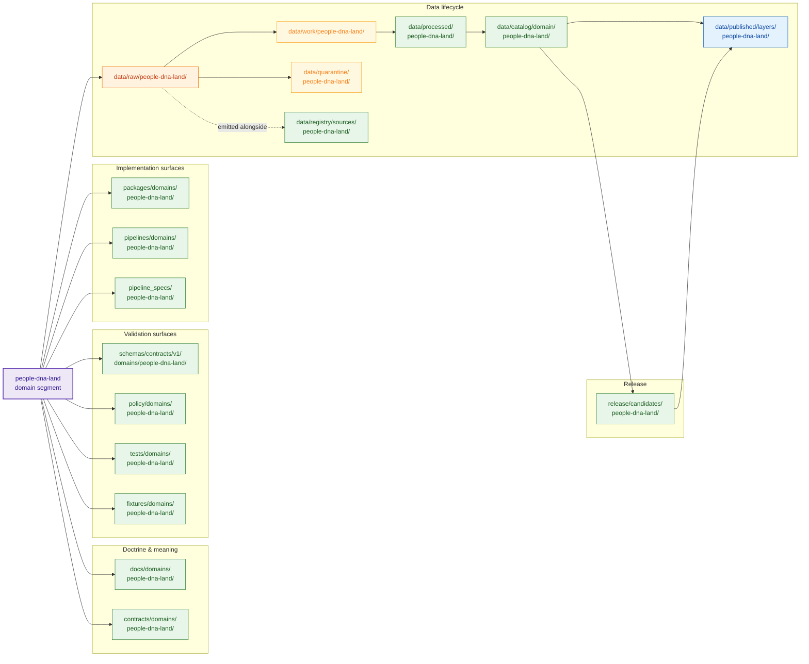

<!-- [KFM_META_BLOCK_V2]
doc_id: kfm://doc/people-dna-land/canonical-paths
title: Canonical Paths — People / Genealogy / DNA / Land Domain
type: standard
version: v1
status: draft
owners: <people-dna-land domain steward — TODO via CODEOWNERS>, <docs steward — TODO>
created: 2026-05-18
updated: 2026-06-06
policy_label: restricted
related:
  # NEEDS VERIFICATION — repo presence PROPOSED until checked against a mounted repo
  - directory-rules.md
  - ai-build-operating-contract.md
  - docs/domains/people-dna-land/README.md
  - docs/domains/people-dna-land/ARCHITECTURE.md
  - docs/domains/people-dna-land/API_CONTRACTS.md
  - docs/adr/ADR-NNNN-sublanes-docs-convention.md
  - docs/registers/DRIFT_REGISTER.md
  - docs/registers/VERIFICATION_BACKLOG.md
  - docs/adr/ADR-0001-schema-home.md
tags: [kfm, domain, people-dna-land, canonical-paths, governance, directory-rules]
notes:
  # CONTRACT_VERSION = "3.0.0"
  # Doctrine grounded in directory-rules.md §3, §6.3-6.5, §7, §12; Encyclopedia §7.14; Atlas Ch. 16, §24.13.
  # Repo presence of any path is PROPOSED until verified against a mounted repository.
  # Surface conflict between Directory Rules and Atlas §24.13 crosswalk on schema-home segment shape, domain segment name, and consent lane.
[/KFM_META_BLOCK_V2] -->

# Canonical Paths — People / Genealogy / DNA / Land Domain

Authoritative mapping of the `people-dna-land` domain segment to every responsibility-root lane under KFM’s Domain Placement Law, with truth labels, sensitivity controls, and reviewer guidance.

> **Status:** draft · **Owners:** <people-dna-land stewards — TODO confirm via `CODEOWNERS`> · **Last updated:** 2026-06-06 · **`CONTRACT_VERSION = "3.0.0"`**

> [!IMPORTANT]
> **Deny-default by doctrine.** The People / DNA / Land lane is one of KFM’s most consequential domains. Living-person identity, DNA / genomic evidence, DNA-derived relationship inferences, exact residence geometry, raw kit / vendor IDs, and unresolved title claims are **denied or restricted by default** unless legal basis, rights, consent, sensitivity policy, evidence closure, review state, and release state are all proven. Assessor / tax records are **not** title truth; parcel geometry is **not** title-boundary proof. This document organizes *paths only*; it does not relax any of those obligations.

> [!WARNING]
> **Repo state is not asserted.** The rules below are CONFIRMED doctrine from `directory-rules.md` and the People / DNA / Land dossier. The **presence** of any specific path in the current KFM repository is **PROPOSED / NEEDS VERIFICATION** until inspected on a mounted working tree. Do not cite this document as proof that a path exists.

-----

## Contents

- [1. Purpose & scope](#1-purpose--scope)
- [2. Doctrinal authority](#2-doctrinal-authority)
- [3. Domain identity](#3-domain-identity)
- [4. Lane fan-out](#4-lane-fan-out)
- [5. Canonical path lanes (domain-segmented)](#5-canonical-path-lanes-domain-segmented)
  - [5.1 Doctrine and meaning](#51-doctrine-and-meaning)
  - [5.2 Validation surfaces](#52-validation-surfaces)
  - [5.3 Implementation surfaces](#53-implementation-surfaces)
  - [5.4 Data lifecycle lanes](#54-data-lifecycle-lanes)
  - [5.5 Release lanes](#55-release-lanes)
- [6. Cross-cutting (non-domain-segmented) lanes](#6-cross-cutting-non-domain-segmented-lanes)
- [7. Sensitivity, rights, and consent surfaces](#7-sensitivity-rights-and-consent-surfaces)
- [8. Reviewer’s path-validation checklist](#8-reviewers-path-validation-checklist)
- [9. Conflicts surfaced](#9-conflicts-surfaced)
- [10. Open questions & verification backlog](#10-open-questions--verification-backlog)
- [11. Related docs](#11-related-docs)
- [Appendix A. Placement-protocol walkthroughs](#appendix-a-placement-protocol-walkthroughs)

-----

## 1. Purpose & scope

This document is the **canonical-path reference** for the People / Genealogy / DNA / Land domain (segment name: `people-dna-land`). It performs three jobs:

1. **Names** every responsibility-root lane the domain may occupy, with CONFIRMED rule citations and PROPOSED repo-state labels.
1. **Tags** each lane with its lifecycle phase, authority class, and sensitivity posture so reviewers can place new files without re-deriving Directory Rules from first principles.
1. **Surfaces** the small, real conflicts between `directory-rules.md` and the Domains Culmination Atlas’s responsibility-root crosswalk (§24.13) so future ADRs can resolve them, rather than letting drift accumulate.

**Out of scope.** This document does not define schemas, contracts, policy bundles, or test fixtures themselves; it only states **where** they live. It is not the source-of-truth for living-person, DNA, consent, or title doctrine — those live in the People / DNA / Land dossier (`[DOM-PEOPLE]`), the KFM Encyclopedia §7.14, the deny-by-default sensitivity register, and forthcoming policy bundles.

> [!NOTE]
> A README-equivalent **orientation** document for this domain — explaining purpose, object families, source families, and contributor expectations — should live at `docs/domains/people-dna-land/README.md`. This file is the **path register**; the README is the **doorway**; `ARCHITECTURE.md` is the **design**; `API_CONTRACTS.md` is the **surface contract**.

[⬆ Back to top](#contents)

-----

## 2. Doctrinal authority

Path placement in KFM follows a strict authority order. For this domain, the relevant order is:

|Order|Authority                                                                          |Status                                          |Citation                                                  |
|-----|-----------------------------------------------------------------------------------|------------------------------------------------|----------------------------------------------------------|
|1    |`directory-rules.md` — placement law and lifecycle invariant                       |**CONFIRMED**                                   |`directory-rules.md` §2.5, §3, §6.3–6.5, §7, §12          |
|2    |Accepted ADRs amending Directory Rules (e.g., **ADR-0001** schema home)            |**CONFIRMED doctrine**                          |`directory-rules.md` §6.4, §17; *Unified Build Manual* §10|
|3    |KFM Encyclopedia §7.14 — People / Genealogy / DNA / Land mission, boundary, objects|**CONFIRMED doctrine / PROPOSED implementation**|`KFM_Encyclopedia` §7.14                                  |
|4    |Domains Culmination Atlas Ch. 16 and §24.13 — domain dossier and crosswalk         |**CONFIRMED doctrine / PROPOSED placement**     |Atlas Ch. 16, §24.13                                      |
|5    |Per-root `README.md` files (the §15 README contract)                               |**CONFIRMED contract / PROPOSED presence**      |`directory-rules.md` §15                                  |

**Conflict rule** (CONFIRMED, `directory-rules.md` §2.5): *Directory Rules wins on path and responsibility-root questions.* Accepted ADRs may amend Directory Rules when explicit and not superseded. Domain dossiers and prior reports are lineage / PROPOSED for placement, not new canon. This document follows that rule and flags every divergence in [§9](#9-conflicts-surfaced).

[⬆ Back to top](#contents)

-----

## 3. Domain identity

|Field                                     |Value                                                                              |Status                                |Source                                                                     |
|------------------------------------------|-----------------------------------------------------------------------------------|--------------------------------------|---------------------------------------------------------------------------|
|**Domain segment name**                   |`people-dna-land`                                                                  |**CONFIRMED**                         |`directory-rules.md` §12 (named instance), §6.5 (`policy/domains/` listing)|
|**Display name**                          |People / Genealogy / DNA / Land Ownership                                          |**CONFIRMED doctrine**                |Encyclopedia §7.14; Atlas Ch. 16                                           |
|**Citation short name**                   |`[DOM-PEOPLE]`                                                                     |**CONFIRMED**                         |Atlas Master Source Ledger                                                 |
|**Authority root for human doctrine**     |`docs/domains/people-dna-land/`                                                    |**CONFIRMED rule / PROPOSED presence**|`directory-rules.md` §3, §12                                               |
|**Sensitivity default class (cross-lane)**|**T4 deny-default** for living-person, DNA, exact land/identity                    |**CONFIRMED doctrine**                |Atlas §24.5; Encyclopedia                                                  |
|**Lifecycle invariant applies**           |RAW → WORK / QUARANTINE → PROCESSED → CATALOG / TRIPLET → PUBLISHED                |**CONFIRMED**                         |`directory-rules.md` §3; Atlas Ch. 16 §H                                   |
|**Trust membrane**                        |Public reads route through `apps/governed-api/`, never directly to canonical stores|**CONFIRMED doctrine**                |`directory-rules.md` §7.1; anti-pattern table                              |

> [!NOTE]
> Two alternate segment forms appear in the corpus: `people` (Atlas §24.13 crosswalk) and `people-dna-land` (Directory Rules §6.5, §12). This document follows **Directory Rules** and uses `people-dna-land` everywhere; see [§9.2](#9-conflicts-surfaced). The `docs/domains/<domain>/sublanes/` documentation convention is governed by the separate `sublanes/` ADR (ADR-NNNN), not by this register.

[⬆ Back to top](#contents)

-----

## 4. Lane fan-out

The Domain Placement Law forbids a domain from becoming a root folder. Instead, the domain appears as a **segment** inside the responsibility roots that own each kind of file. The diagram below is the doctrinal shape, not a claim about the current repo.

> [!TIP]
> Cross-domain files (e.g., a validator shared with Settlements or Archaeology) live **without** the `people-dna-land` segment, under the lowest common responsibility root. See `directory-rules.md` §12 “multi-domain and cross-cutting files” and [§6](#6-cross-cutting-non-domain-segmented-lanes) below.

[⬆ Back to top](#contents)

-----

## 5. Canonical path lanes (domain-segmented)

The tables below are the path register. **Rules**: CONFIRMED unless noted. **Repo presence**: PROPOSED unless verified on a mounted repository. Verification belongs in `docs/registers/VERIFICATION_BACKLOG.md`.

### 5.1 Doctrine and meaning

|Path                                |Owns                                                                                                                                 |Authority class|Rule citation               |Repo presence|
|------------------------------------|-------------------------------------------------------------------------------------------------------------------------------------|---------------|----------------------------|-------------|
|`docs/domains/people-dna-land/`     |Human-facing domain dossier, runbooks, this file                                                                                     |Canonical      |`directory-rules.md` §3, §12|PROPOSED     |
|`contracts/domains/people-dna-land/`|Object-meaning Markdown for `Person Assertion`, `Land Ownership Assertion`, `DNA Match Evidence`, etc. (semantic, not machine schema)|Canonical      |`directory-rules.md` §6.3   |PROPOSED     |

> [!NOTE]
> Per `directory-rules.md` §6.3–6.4 and the anti-pattern table: **`contracts/`** holds *meaning* (Markdown), **`schemas/`** holds *machine shape* (JSON Schema). Maintaining both `contracts/.../*.schema.json` and `schemas/.../*.schema.json` is drift — `schemas/contracts/v1/...` wins per **ADR-0001**.

### 5.2 Validation surfaces

|Path                                           |Owns                                                                   |Authority class     |Rule citation                 |Repo presence|
|-----------------------------------------------|-----------------------------------------------------------------------|--------------------|------------------------------|-------------|
|`schemas/contracts/v1/domains/people-dna-land/`|JSON Schema (machine shape) for People / DNA / Land object families    |Canonical (ADR-0001)|`directory-rules.md` §6.4, §17|PROPOSED     |
|`policy/domains/people-dna-land/`              |Per-domain allow / deny / restrict / abstain rules (Rego or equivalent)|Canonical           |`directory-rules.md` §6.5     |PROPOSED     |
|`tests/domains/people-dna-land/`               |Proof that schemas + policy + contracts are enforceable end-to-end     |Canonical           |`directory-rules.md` §3, §12  |PROPOSED     |
|`fixtures/domains/people-dna-land/`            |Golden, valid, and invalid test inputs for the domain                  |Canonical           |`directory-rules.md` §3, §12  |PROPOSED     |

**Verification posture (`people-dna-land`-specific, PROPOSED).** Tests under `tests/domains/people-dna-land/` SHOULD include at minimum: person-assertion evidence closure; GEDCOM import rights and living-flag handling; DNA consent and raw-kit / vendor-ID no-log behavior; consent-revocation cleanup; legal-description and chain-of-title gap detection; **assessor-as-title denial**; and graph-projection safety (no public surfacing of restricted edges). Source: Atlas Ch. 16 §K.

### 5.3 Implementation surfaces

|Path                                |Owns                                                                                                                                   |Authority class|Rule citation                 |Repo presence|
|------------------------------------|---------------------------------------------------------------------------------------------------------------------------------------|---------------|------------------------------|-------------|
|`packages/domains/people-dna-land/` |Reusable libraries for identity resolution, ownership-interval math, chain-of-title reasoning, etc. — only if reused across deployables|Canonical      |`directory-rules.md` §7.2     |PROPOSED     |
|`pipelines/domains/people-dna-land/`|Executable pipeline logic (ingest, normalize, validate, catalog, publish) for People / DNA / Land sources                              |Canonical      |`directory-rules.md` §7.4     |PROPOSED     |
|`pipeline_specs/people-dna-land/`   |Declarative pipeline configuration — note the **absence** of the `domains/` segment under this root                                    |Canonical      |`directory-rules.md` §7.4, §12|PROPOSED     |

> [!CAUTION]
> **Connectors do not get a `connectors/domains/<domain>/` lane.** Per `directory-rules.md` §7.3 (CONFIRMED — connectors are organized by *source family*, e.g., `connectors/census/`, `connectors/kansas/`, and **do not publish**), a People / DNA / Land ingest pipeline composes connectors that may emit into `data/raw/people-dna-land/`, but the connectors themselves live elsewhere. Connectors **MUST NOT** write to `data/processed/`, `data/catalog/`, or `data/published/`.

### 5.4 Data lifecycle lanes

The lifecycle invariant `RAW → WORK / QUARANTINE → PROCESSED → CATALOG / TRIPLET → PUBLISHED` is **CONFIRMED** doctrine. Each phase appears as a domain-segmented lane under `data/`. Receipts, proofs, registry, and rollback are emitted *alongside* lifecycle directories — they do not replace them.

|Path                                    |Lifecycle phase     |What lives here                                                                                                                                           |Rule citation                                |Repo presence|
|----------------------------------------|--------------------|----------------------------------------------------------------------------------------------------------------------------------------------------------|---------------------------------------------|-------------|
|`data/raw/people-dna-land/`             |RAW                 |Immutable source payloads or references with source role, rights, sensitivity, citation, time, and hash                                                   |`directory-rules.md` §3, §12; Atlas Ch. 16 §H|PROPOSED     |
|`data/work/people-dna-land/`            |WORK                |In-progress normalization (schema, geometry, time, identity, evidence, rights, policy)                                                                    |`directory-rules.md` §3, §12                 |PROPOSED     |
|`data/quarantine/people-dna-land/`      |QUARANTINE          |Held failures with recorded quarantine reason                                                                                                             |`directory-rules.md` §3, §12                 |PROPOSED     |
|`data/processed/people-dna-land/`       |PROCESSED           |Validated normalized objects, public-safe candidates with `EvidenceRef`, `ValidationReport`, digest closure                                               |`directory-rules.md` §3, §12; Atlas Ch. 16 §H|PROPOSED     |
|`data/catalog/domain/people-dna-land/`  |CATALOG             |Catalog records, `EvidenceBundle` projections, graph / triplet projections, release candidates — note **singular `domain/`** segment under `data/catalog/`|`directory-rules.md` §3, §12                 |PROPOSED     |
|`data/published/layers/people-dna-land/`|PUBLISHED           |Released public-safe layer artifacts served via the governed API                                                                                          |`directory-rules.md` §3, §12                 |PROPOSED     |
|`data/registry/sources/people-dna-land/`|REGISTRY (alongside)|Source descriptors and source-activation state for People / DNA / Land sources                                                                            |`directory-rules.md` §3, §12                 |PROPOSED     |

> [!IMPORTANT]
> **Lifecycle skip is an anti-pattern** (`directory-rules.md` anti-pattern table). A pipeline writing directly from `data/raw/people-dna-land/` to `data/published/layers/people-dna-land/` violates the invariant. Promotion is a **governed state transition**, not a file move. For this domain, gates must additionally screen living-person status, DNA restriction, source terms, evidence closure, temporal validity, title / assessor / geometry source-role distinction, sensitivity policy, review state, release manifest, correction path, and rollback target. Source: Atlas Ch. 16 §I; *Unified Build Manual* §10.14.

### 5.5 Release lanes

|Path                                 |Owns                                                       |Authority class|Rule citation               |Repo presence|
|-------------------------------------|-----------------------------------------------------------|---------------|----------------------------|-------------|
|`release/candidates/people-dna-land/`|Per-domain release **candidates** awaiting promotion review|Canonical      |`directory-rules.md` §3, §12|PROPOSED     |

The *manifest*, *correction*, and *rollback* artifacts for People / DNA / Land releases are **not** domain-segmented at this level — they live in cross-cutting release lanes (see [§6](#6-cross-cutting-non-domain-segmented-lanes)).

[⬆ Back to top](#contents)

-----

## 6. Cross-cutting (non-domain-segmented) lanes

Some artifacts that *concern* People / DNA / Land live in **non-domain-segmented** homes by doctrine. Placing them under a `people-dna-land/` subfolder would create parallel authority and is an anti-pattern.

|Path                                          |What it holds for this domain                                                                                                          |Rule citation                                       |Repo presence  |
|----------------------------------------------|---------------------------------------------------------------------------------------------------------------------------------------|----------------------------------------------------|---------------|
|`data/receipts/`                              |Ingest receipts, transform receipts (including **redaction receipts** for living-person / DNA / land-geometry transforms), run receipts|`directory-rules.md` anti-pattern table; Atlas §24.2|PROPOSED       |
|`data/proofs/`                                |Resolved `EvidenceBundle` payloads referenced by `EvidenceRef`                                                                         |`directory-rules.md` §19 glossary                   |PROPOSED       |
|`release/manifests/`                          |`ReleaseManifest` artifacts (the *release decision*, distinct from the released artifact in `data/published/`)                         |`directory-rules.md` §19                            |PROPOSED       |
|`release/correction_notices/`                 |`CorrectionNotice` artifacts for People / DNA / Land claims                                                                            |`directory-rules.md` §19                            |PROPOSED       |
|`release/rollback_cards/`                     |`RollbackCard` decision artifacts                                                                                                      |`directory-rules.md` §19                            |PROPOSED       |
|`data/rollback/`                              |Alias-revert receipts (data-plane) — sibling to the decision in `release/rollback_cards/`                                              |`directory-rules.md` §18 OPEN                       |PROPOSED / OPEN|
|`policy/sensitivity/`                         |Cross-cutting **sensitivity class** definitions (living-person, DNA / genomics, etc.)                                                  |`directory-rules.md` §6.5                           |PROPOSED       |
|`policy/rights/`                              |Cross-cutting rights status and license enforcement                                                                                    |`directory-rules.md` §6.5                           |PROPOSED       |
|`policy/promotion/`                           |Promotion-gate policy applied at lifecycle transitions                                                                                 |`directory-rules.md` §6.5                           |PROPOSED       |
|`policy/release/`                             |Release-gate policy applied at PUBLISHED                                                                                               |`directory-rules.md` §6.5                           |PROPOSED       |
|`policy/runtime/`                             |Runtime gate policy (Focus Mode, evidence resolution, abstain)                                                                         |`directory-rules.md` §6.5                           |PROPOSED       |
|`control_plane/source_authority_register.yaml`|Source-authority entries for People / DNA / Land sources                                                                               |`directory-rules.md` §6.2                           |PROPOSED       |
|`control_plane/domain_lane_register.yaml`     |Domain-lane register that should list `people-dna-land`                                                                                |`directory-rules.md` §6.2                           |PROPOSED       |
|`apps/governed-api/`                          |Public trust path; all public reads of People / DNA / Land artifacts MUST route here                                                   |`directory-rules.md` §7.1                           |PROPOSED       |

> [!CAUTION]
> **Trust content does not live in `artifacts/`** (`directory-rules.md` anti-pattern table). Release manifests, evidence bundles, signed receipts, correction notices, and rollback cards belonging to this domain live in `data/receipts/`, `data/proofs/`, `release/`, or `data/published/` — **never** under `artifacts/`.

[⬆ Back to top](#contents)

-----

## 7. Sensitivity, rights, and consent surfaces

People / DNA / Land carries multiple deny-default classes. The table below maps each class to the policy / data paths most directly responsible. Class assignment itself is CONFIRMED doctrine; specific transform profiles and gates are PROPOSED.

|Sensitivity class                                                                           |Default outcome (CONFIRMED)                                                                                  |Required controls (CONFIRMED)                                                   |Likely policy / data home (PROPOSED)                                                                           |
|--------------------------------------------------------------------------------------------|-------------------------------------------------------------------------------------------------------------|--------------------------------------------------------------------------------|---------------------------------------------------------------------------------------------------------------|
|**Living persons** — personal data, residences, identity assertions                         |**DENY** public exact / identifying output unless legal basis, consent / review, and release state are proven|Privacy review; redaction; aggregate; staged access                             |`policy/domains/people-dna-land/living_persons/`; `policy/sensitivity/`; redaction receipts in `data/receipts/`|
|**DNA / genomics** — DNA matches, genomic inference, living-person relatives                |**DENY** by default; restricted steward / research only with policy approval                                 |Separate restricted store; **no public AI inference**; consent token enforcement|`policy/domains/people-dna-land/dna/`; out-of-public-tree restricted store (location PROPOSED, NEEDS ADR)      |
|**Private landowner-sensitive data** — field boundaries, owner identity, operations         |**DENY** exact / public when private or rights are unclear                                                   |Aggregation; permissions; policy review                                         |`policy/domains/people-dna-land/land_rights/`; cross-reference `policy/sensitivity/`                           |
|**Source-rights-limited records** — licensed, restricted, no-redistribution, uncertain terms|**DENY** public release until terms resolved                                                                 |Rights register; attribution; no public derivative if barred                    |`policy/rights/`; `data/registry/sources/people-dna-land/`                                                     |

**Hard rules to encode in `policy/domains/people-dna-land/`** (CONFIRMED doctrine, Atlas Ch. 16 §I; Encyclopedia §7.14):

- **Assessor / tax records are NOT title truth.** A test under `tests/domains/people-dna-land/` must explicitly DENY any public claim that equates assessor records (source role `administrative`) with title.
- **Parcel geometry is NOT title-boundary proof** without source role and evidence support.
- **Raw DNA kit / vendor IDs and DNA segments are NOT public.**
- **Relationship hypotheses remain hypotheses** until evidence and review support a stronger claim.
- **Public AI inference over living-person / DNA evidence is denied by default.** Governed AI may ABSTAIN, DENY, or answer only over released `EvidenceBundle` payloads. Source: Atlas Ch. 16 §L.

> [!WARNING]
> **Consent-lane placement is genuinely open.** `consent` *is* named as a policy concern that belongs under `policy/` (the `policy/` root covers “geoprivacy, consent, promotion-gate, runtime” rules), and the Atlas §24.13 crosswalk lists `policy/consent/people/` for this domain. What is **not** settled is whether `policy/consent/` is a top-level sibling lane (alongside `policy/sensitivity/`, `policy/rights/`) or whether consent rules nest under `policy/domains/people-dna-land/consent/`. Creating a **new top-level** `policy/consent/` lane is ADR-class (§2.4); nesting under the existing `policy/domains/people-dna-land/` is not. Until an ADR decides, prefer the domain-nested form and track the question in `VERIFICATION_BACKLOG.md`. See [§9.3](#9-conflicts-surfaced).

[⬆ Back to top](#contents)

-----

## 8. Reviewer’s path-validation checklist

Use this list when a PR adds, moves, or renames a path that involves People / DNA / Land. It is the reviewer checklist from `directory-rules.md`, specialized for this domain.

- [ ] **Responsibility identified.** The file maps to exactly one §4 Step 1 category (docs, contracts, schemas, policy, tests, fixtures, packages, pipelines, pipeline_specs, data, release).
- [ ] **Right root.** The chosen root matches that responsibility.
- [ ] **Lifecycle phase correct** (data only). The file is in the right phase and does **not** skip phases (lifecycle-skip anti-pattern).
- [ ] **Domain segment correct.** The domain appears as the `people-dna-land` segment — *not* as a root, *not* under another domain, *not* under `people/` (Atlas form), and *not* split into `people/`, `dna/`, `land/` siblings.
- [ ] **No new root without ADR.** Any new canonical or compatibility root (e.g., a proposed top-level `policy/consent/`) carries an ADR reference.
- [ ] **No parallel authority.** No new home for schemas / contracts / policy / sources / registries / releases / proofs / receipts without ADR (§2.4(5)).
- [ ] **README present.** Affected folders satisfy `directory-rules.md` §15.
- [ ] **Trust content placement.** Release manifests, evidence bundles, signed receipts, correction notices, and rollback cards live in `data/receipts/`, `data/proofs/`, or `release/` — never `artifacts/`.
- [ ] **Public path discipline.** Routes go through `apps/governed-api/`, never to canonical stores directly.
- [ ] **Sensitivity posture preserved.** Living-person and DNA-derived outputs default to DENY; assessor / parcel content is not surfaced as title truth; raw kit / vendor IDs are not surfaced at all.
- [ ] **Source-role distinction preserved.** Patent vs. deed vs. assessor (`administrative`) vs. parcel-geometry (`modeled`) sources are not collapsed (Atlas §24.1).
- [ ] **Rule cited in PR description.** PR names the Rules section that justifies the placement; if no section justifies it, the path is marked PROPOSED and a `DRIFT_REGISTER.md` or `VERIFICATION_BACKLOG.md` entry is opened.

> [!TIP]
> One-line reviewer check (from `directory-rules.md` §4): *“Does the path encode the right responsibility, the right lifecycle phase (if data), and the right domain segment — and does this PR cite a rule for it?”*

[⬆ Back to top](#contents)

-----

## 9. Conflicts surfaced

Three real conflicts exist between authoritative project documents. Per `directory-rules.md` §2.5, Directory Rules wins on path questions, but these inconsistencies should be resolved by ADR rather than smoothed over — and logged in `DRIFT_REGISTER.md`.

### 9.1 Schema-home segment shape

|Source                        |Stated path for this domain                    |Status              |
|------------------------------|-----------------------------------------------|--------------------|
|`directory-rules.md` §6.4, §12|`schemas/contracts/v1/domains/people-dna-land/`|**Wins** (canonical)|
|Atlas §24.13 crosswalk row 16 |`schemas/contracts/v1/people/`                 |Lineage / PROPOSED  |

The Atlas crosswalk omits the `/domains/` segment under `schemas/contracts/v1/`. Directory Rules and the repository-structure guiding document consistently include it. **This document uses the Directory Rules form.** Tracking item: Atlas §24.12 **ADR-S-01** covers schema-home confirmation broadly.

### 9.2 Domain segment name

|Source                                                                                            |Segment used     |Status              |
|--------------------------------------------------------------------------------------------------|-----------------|--------------------|
|`directory-rules.md` §6.5 (`policy/domains/` listing) and §12 (Domain Placement Law instance list)|`people-dna-land`|**Wins** (canonical)|
|Atlas §24.13 crosswalk row 16                                                                     |`people`         |Lineage / PROPOSED  |

The Atlas uses the short form `people` only in the responsibility-root crosswalk; the dossier text consistently uses “People / DNA / Land”. **This document uses `people-dna-land`** consistently with the explicit Directory Rules listings. (This is the same conflict tracked as Q-4 / OQ-PEOPLE-DNA-11 in the API_CONTRACTS and ARCHITECTURE docs.)

### 9.3 Consent-policy lane

|Source                                                     |Proposed home                                                                                                                                                                                                                                                                  |Status                                  |
|-----------------------------------------------------------|-------------------------------------------------------------------------------------------------------------------------------------------------------------------------------------------------------------------------------------------------------------------------------|----------------------------------------|
|Atlas §24.13 crosswalk row 16                              |`policy/consent/people/`                                                                                                                                                                                                                                                       |PROPOSED — uses a `policy/consent/` lane|
|`directory-rules.md` §6.5 + repo-structure `policy/` README|`policy/` covers consent as a named concern, but the **enumerated** sub-lanes shown are `core/`, `sensitivity/`, `domains/`, `ai/`, `maplibre/`, `release/` (plus `rights/`, `promotion/`, `runtime/` elsewhere); a standalone `consent/` lane is **not** explicitly enumerated|Partially open                          |

**Correction to a prior overstatement:** it is **not** accurate to say “no `policy/consent/` lane exists in doctrine.” Consent is explicitly named as a `policy/` concern (geoprivacy, **consent**, promotion-gate, runtime), and the Atlas crosswalk does list `policy/consent/people/`. The genuine open question is narrower: **is `consent/` a top-level sibling lane or a sub-lane under `policy/domains/people-dna-land/`?** Creating a new **top-level** `policy/consent/` is ADR-class (§2.4(1)); a domain-nested `policy/domains/people-dna-land/consent/` is not. Pending an ADR, prefer the domain-nested form.

[⬆ Back to top](#contents)

-----

## 10. Open questions & verification backlog

These items belong in `docs/registers/VERIFICATION_BACKLOG.md` until resolved. All are **NEEDS VERIFICATION** or **OPEN** unless marked otherwise.

|#        |Item                                                                                                                                                             |What would settle it                   |Status                       |
|---------|-----------------------------------------------------------------------------------------------------------------------------------------------------------------|---------------------------------------|-----------------------------|
|VB-PDL-01|Does the live repo actually contain `docs/domains/people-dna-land/`, and is a domain README present?                                                             |Mounted repo + tree inspection         |NEEDS VERIFICATION           |
|VB-PDL-02|Schema-home shape: confirm `schemas/contracts/v1/domains/people-dna-land/` per Directory Rules vs. `schemas/contracts/v1/people/` per Atlas                      |ADR-0001 text + mounted repo (ADR-S-01)|NEEDS VERIFICATION           |
|VB-PDL-03|Existence and contents of `policy/domains/people-dna-land/` (sub-lanes for `living_persons/`, `dna/`, `land_rights/`, `consent/`)                                |Mounted repo + policy bundle           |NEEDS VERIFICATION           |
|VB-PDL-04|Consent-policy home: top-level `policy/consent/` lane (ADR) vs. domain-nested `policy/domains/people-dna-land/consent/`                                          |ADR                                    |OPEN / NEEDS VERIFICATION    |
|VB-PDL-05|Restricted-store path for raw DNA kit / vendor IDs and DNA segments — out of public tree by doctrine; exact home not yet specified                               |ADR + mounted repo                     |OPEN                         |
|VB-PDL-06|Steward authority and confidentiality regime for People / DNA / Land (CODEOWNERS, review records, access tiers; SoD threshold per ADR-S-09)                      |CODEOWNERS + review-record evidence    |NEEDS VERIFICATION           |
|VB-PDL-07|Cross-domain cross-references with Settlements, Roads / Rail, Archaeology, Agriculture (Atlas Ch. 16 §F) — placement of cross-domain validators                  |Mounted repo + validator inventory     |NEEDS VERIFICATION           |
|VB-PDL-08|Whether `data/rollback/` is a sibling of lifecycle phases (Directory Rules §18 OPEN)                                                                             |ADR                                    |OPEN                         |
|VB-PDL-09|Per-root README presence for every canonical root touched by this domain                                                                                         |Mounted repo                           |NEEDS VERIFICATION           |
|VB-PDL-10|Concrete redaction profile names (e.g., `living_persons_k_anonymity_grid`, `parcel_centroid_only`) and their home under `policy/sensitivity/profiles/` (PROPOSED)|Policy bundle + fixtures               |PROPOSED / NEEDS VERIFICATION|
|VB-PDL-11|`sublanes/` documentation convention (does this register’s `docs/domains/people-dna-land/` host a `sublanes/` subtree?)                                          |ADR-NNNN (drafted)                     |PROPOSED                     |

[⬆ Back to top](#contents)

-----

## 11. Related docs

- `directory-rules.md` — Canonical placement law and lifecycle invariant (CONFIRMED).
- `ai-build-operating-contract.md` — operating law (`CONTRACT_VERSION = "3.0.0"`).
- `docs/domains/people-dna-land/README.md` — Domain orientation (PROPOSED, may not yet exist).
- `docs/domains/people-dna-land/ARCHITECTURE.md` — Domain architecture / design.
- `docs/domains/people-dna-land/API_CONTRACTS.md` — Governed-API surface contract.
- `docs/adr/ADR-NNNN-sublanes-docs-convention.md` — `sublanes/` documentation convention ADR.
- `docs/adr/ADR-0001-schema-home.md` — Schema-home rule (CONFIRMED doctrine; specific filename PROPOSED).
- `docs/registers/DRIFT_REGISTER.md` — Drift entries for path / authority conflicts.
- `docs/registers/VERIFICATION_BACKLOG.md` — Outstanding verification items, including VB-PDL-01 through VB-PDL-11 above.
- `contracts/domains/people-dna-land/` · `schemas/contracts/v1/domains/people-dna-land/` · `policy/domains/people-dna-land/` — object meaning / shape / policy (PROPOSED).
- `KFM_Encyclopedia` §7.14 — People, Genealogy, DNA, and Land Ownership domain definition.
- Atlas Ch. 16, §24.13 — Domain dossier and responsibility-root crosswalk.
- *Unified Implementation Architecture Build Manual* §10.14 — Schema and contract plan; ADR-0001 reconciliation.

[⬆ Back to top](#contents)

-----

## Appendix A. Placement-protocol walkthroughs

<strong>A.1 — A new schema for <code>Land Ownership Assertion</code></strong> (click to expand)

Applying `directory-rules.md` §4 placement protocol to a new JSON Schema for `Land Ownership Assertion`:

1. **Identify the responsibility.** Defines an object’s machine shape → `schemas/`.
1. **Identify the lifecycle phase.** Not applicable (schema, not lifecycle data).
1. **Identify the domain.** People / DNA / Land → segment `people-dna-land`. Under `schemas/`, the domain lives at `schemas/contracts/v1/domains/people-dna-land/` (Directory Rules §6.4, §12).
1. **Confirm authority.** That directory must already exist or be created with a per-root README (§15). No ADR needed unless this introduces a new sibling under `data/` or a new top-level root.
1. **Cite the rule.** PR description cites `directory-rules.md` §6.4 (schema home) + §12 (Domain Placement Law).

**Proposed path:** `schemas/contracts/v1/domains/people-dna-land/land_ownership_assertion.schema.json` — **PROPOSED**.

<strong>A.2 — A new redaction receipt for parcel-centroid generalization</strong> (click to expand)

1. **Identify the responsibility.** Lifecycle data emitting proof of a transform → `data/` (specifically `data/receipts/`).
1. **Identify the lifecycle phase.** Receipts are emitted alongside lifecycle phases. Not RAW; not PROCESSED — a `receipts/` sibling.
1. **Identify the domain.** Receipts are typically **not** domain-segmented at the top level. The receipt carries `EvidenceRef` and source identity; the home is `data/receipts/`, sub-organized by receipt type or run unless the per-root README specifies otherwise.
1. **Confirm authority.** `data/receipts/` is a canonical lane. No ADR needed.
1. **Cite the rule.** PR cites the anti-pattern table (“trust content in `artifacts/`”) and the receipts lane.

**Proposed path family:** `data/receipts/<run-or-receipt-class>/...` — **PROPOSED**; per-folder organization NEEDS VERIFICATION.

<strong>A.3 — A new policy bundle for DNA consent revocation</strong> (click to expand)

1. **Identify the responsibility.** Decides allow / deny / restrict / abstain → `policy/`.
1. **Identify the lifecycle phase.** Not data.
1. **Identify the domain.** Per-domain policy → `policy/domains/people-dna-land/` (Directory Rules §6.5). A consent-specific sub-lane could be `policy/domains/people-dna-land/consent/`.
1. **Confirm authority.** Sub-lane creation under `policy/domains/people-dna-land/` does **not** require an ADR; creating a new top-level `policy/consent/` lane **does** (see [§9.3](#9-conflicts-surfaced)).
1. **Cite the rule.** PR cites §6.5 (`policy/` shape) and §2.4 (no parallel authority / new root without ADR).

**Proposed path:** `policy/domains/people-dna-land/consent/dna_consent_revocation.rego` — **PROPOSED**. Cross-reference Atlas Ch. 16 §K test list.

<strong>A.4 — Anti-pattern example: what NOT to do</strong> (click to expand)

The following placements are **anti-patterns** and would be rejected at review:

- `people-dna-land/` at repo root with subfolders `data/`, `schemas/`, `policy/`, `docs/` — violates Domain Placement Law (§12, domain-folder-at-root anti-pattern).
- `schemas/people-dna-land/...` — wrong root prefix; schema home is `schemas/contracts/v1/domains/...` per ADR-0001.
- `contracts/people-dna-land/land_ownership_assertion.schema.json` — schema in `contracts/`; per §6.4 schemas live under `schemas/`, contracts hold Markdown only.
- `artifacts/release/people-dna-land/release_manifest.json` — release manifests live in `release/manifests/`, never `artifacts/`.
- `connectors/domains/people-dna-land/census/` — connectors are organized by source family, not by KFM domain (§7.3).
- Pipeline writing `data/raw/people-dna-land/` → `data/published/layers/people-dna-land/` directly — lifecycle skip.
- Public client (`apps/explorer-web/`) reading `data/processed/people-dna-land/` directly — trust-membrane violation; routes go through `apps/governed-api/` (§7.1).

-----

> [!NOTE]
> **Document discipline.** This file is governance, not commentary. Material changes to canonical paths require an ADR per `directory-rules.md` §2.4. Typo and clarification fixes are routine PRs. Every change MUST update the `updated:` field in the KFM Meta Block.

-----

### Footer

**Related:** [`directory-rules.md`](../../../directory-rules.md) · [`docs/domains/people-dna-land/README.md`](./README.md) · [`docs/registers/VERIFICATION_BACKLOG.md`](../../registers/VERIFICATION_BACKLOG.md) · [`docs/adr/`](../../adr/) — *all path targets PROPOSED; verify on mounted repo.*

**Last reviewed:** 2026-06-06 · **Doc version:** v1 (draft) · **Authority class:** Standard / Canonical-path register · **Domain:** `people-dna-land` · `CONTRACT_VERSION = "3.0.0"`

[⬆ Back to top](#contents)