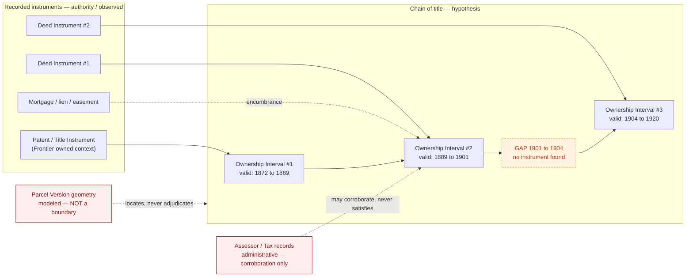

<!-- [KFM_META_BLOCK_V2]
doc_id: kfm://doc/people-dna-land/chain-of-title-notes
title: Chain-of-Title Notes — People / Genealogy / DNA / Land Domain
type: notes
version: v0.1
status: draft
owners: <people-dna-land domain steward — TODO via CODEOWNERS>, <land/title reviewer — TODO>, <docs steward — TODO>
created: 2026-06-06
updated: 2026-06-06
policy_label: restricted
related:
  # NEEDS VERIFICATION — repo paths PROPOSED until checked against a mounted repo
  - docs/domains/people-dna-land/ARCHITECTURE.md
  - docs/domains/people-dna-land/API_CONTRACTS.md
  - docs/domains/people-dna-land/CANONICAL_PATHS.md
  - docs/domains/people-dna-land/sublanes/land/README.md
  - directory-rules.md
  - ai-build-operating-contract.md
tags: [kfm, domain, people-dna-land, land, chain-of-title, ownership-interval, title, hypothesis]
notes:
  # CONTRACT_VERSION = "3.0.0"
  # Chain-of-title is an EVIDENCE-LINKED HYPOTHESIS, never a definitive legal record or a title opinion.
  # Two hard rules: assessor/tax records are NOT title truth; parcel geometry is NOT a title boundary.
  # KFM does not issue title opinions, quiet title, or legal advice; this doc is a modeling/reasoning note.
  # Frontier Matrix owns Land Office Record + Public Land Record (Atlas Ch.17 §B), not this domain.
[/KFM_META_BLOCK_V2] -->

# Chain-of-Title Notes — People / Genealogy / DNA / Land Domain

> How KFM models a **chain of title** as an assertion-first, evidence-linked **hypothesis** — a reconstructed sequence of ownership intervals derived from recorded instruments, with gaps preserved rather than bridged. KFM does **not** produce title opinions, certify ownership, or give legal advice.


**Status:** `draft` · **Owners:** *land/title reviewer; people-dna-land steward — TODO* · **Last updated:** *2026-06-06* · **`CONTRACT_VERSION = "3.0.0"`**

> [!CAUTION]
> **KFM does not issue title opinions.** Nothing in this domain certifies who owns a parcel, resolves a boundary dispute, clears a defect, or substitutes for a title search, abstract, or attorney’s opinion. A KFM chain of title is a **research reconstruction** — a hypothesis built from cited evidence, carrying its own uncertainty and gaps. Treating it as a legal determination is a misuse of the system.

-----

## Contents

- [1. What a chain of title is here](#1-what-a-chain-of-title-is-here)
- [2. The two hard rules](#2-the-two-hard-rules)
- [3. Object model](#3-object-model)
- [4. Building the chain](#4-building-the-chain)
- [5. Gaps, conflicts, and uncertainty](#5-gaps-conflicts-and-uncertainty)
- [6. Bitemporal ownership intervals](#6-bitemporal-ownership-intervals)
- [7. Source roles and the anti-collapse rule](#7-source-roles-and-the-anti-collapse-rule)
- [8. Public exposure posture](#8-public-exposure-posture)
- [9. Governed AI behavior](#9-governed-ai-behavior)
- [10. Validators and fixtures](#10-validators-and-fixtures)
- [11. Worked example](#11-worked-example)
- [12. Open questions](#12-open-questions)
- [13. Related docs](#13-related-docs)

-----

## 1. What a chain of title is here

**CONFIRMED doctrine / PROPOSED implementation.** “Chain-of-title reasoning” is named in this domain’s purpose alongside land instruments and ownership intervals (Atlas Ch. 16 §A). In KFM terms, a chain of title is a **temporally ordered sequence of `Ownership Interval`s** for one `Parcel Version` lineage, each interval **derived from** one or more recorded `LandInstrument`s (`Deed Instrument`, `Title Instrument`, patent, mortgage, lien, easement, lease, mineral, water, access, probate) and bound to an `EvidenceBundle`.

The chain is an **assertion**, not a fact:

- Each link is a `Land Ownership Assertion` — a claim that some party held an interest over a time interval, sourced and evidence-bound.
- The chain as a whole is a **hypothesis** about succession, with explicit confidence and explicit gaps.
- Promotion of any link to a public surface is a **governed state transition**, never a file move, and never a title determination.

> [!NOTE]
> The domain owns `Land Ownership Assertion`, `Deed Instrument`, `Title Instrument`, `Assessor Record`, `TaxRecord`, `Parcel Version`, `Ownership Interval`, `LegalDescription`, and `LandInstrument` (Atlas Ch. 16 §B/§C/§E). It does **not** own `Land Office Record` or `Public Land Record` — those belong to **Frontier Matrix** (Atlas Ch. 17 §B). A federal land patent enters the chain as cited Frontier-owned context at the origin link, not as a People/DNA/Land-owned object.

[Back to top](#contents)

-----

## 2. The two hard rules

These are the load-bearing constraints for everything below. Both are CONFIRMED doctrine (Atlas Ch. 16 §I; named as validators in §K).

> [!IMPORTANT]
> **Rule 1 — Assessor and tax records are NOT title truth.** An `Assessor Record` or `TaxRecord` records who the taxing authority *billed*, not who *held title*. It is admitted with source role `administrative` and may corroborate occupancy or possession, but it can **never** by itself satisfy an ownership or title claim. A public claim that equates an assessor record with title is denied (the “assessor-as-title denial” validator, §K).

> [!IMPORTANT]
> **Rule 2 — Parcel geometry is NOT a title boundary.** A `Parcel Version` is a versioned geometry *representation* — a snapshot of how some authority drew the parcel at some time. It is admitted with source role `modeled` (or `administrative`/`authority` depending on origin) and is **never** a legal boundary determination. The authoritative boundary, where one exists, lives in the `LegalDescription` (metes-and-bounds / PLSS text) and its own provenance — and even that is research evidence, not an adjudication.

Both rules exist because the most common failure mode in genealogy/land systems is **source-role collapse**: letting a convenient, map-ready, or tax-roll artifact stand in for a legal fact it cannot support.

[Back to top](#contents)

-----

## 3. Object model

CONFIRMED terms / PROPOSED field realization. Identity follows the domain-uniform deterministic basis (`source_id + object_role + temporal_scope + normalized_digest`); the six-time discipline (source, observed, valid, retrieval, release, correction) is kept distinct where material (Atlas Ch. 16 §E).

|Object                         |Role in the chain                                                   |Source role(s)                            |Status                         |
|-------------------------------|--------------------------------------------------------------------|------------------------------------------|-------------------------------|
|`LandInstrument` (umbrella)    |The recorded act that moves or encumbers an interest                |`authority` / `observed`                  |CONFIRMED term / PROPOSED field|
|`Deed Instrument`              |Conveyance instrument (grantor → grantee)                           |`authority` / `observed`                  |CONFIRMED term / PROPOSED field|
|`Title Instrument`             |Instrument bearing on title state (patent, decree, etc.)            |`authority` / `observed`                  |CONFIRMED term / PROPOSED field|
|`Land Ownership Assertion`     |One link: a party held an interest over an interval, evidence-bound |derived                                   |CONFIRMED term / PROPOSED field|
|`Ownership Interval`           |The temporal span of a link (bitemporal: valid + source)            |derived                                   |CONFIRMED term / PROPOSED field|
|`Parcel Version`               |Versioned parcel geometry snapshot (**not** a boundary proof)       |`modeled` / `administrative` / `authority`|CONFIRMED term / PROPOSED field|
|`LegalDescription`             |Metes-and-bounds / PLSS textual description, with its own provenance|`authority` / `observed`                  |CONFIRMED term / PROPOSED field|
|`Assessor Record` / `TaxRecord`|Possession/occupancy corroboration (**not** title)                  |`administrative`                          |CONFIRMED term / PROPOSED field|


> [!NOTE]
> `ReviewRecord`, `EvidenceBundle`, `EvidenceRef`, `CorrectionNotice`, and `RollbackCard` are cross-cutting governance objects (Atlas §24.2 / Encyclopedia), not land-owned. The chain *references* them; it does not define them.



[Back to top](#contents)

-----

## 4. Building the chain

PROPOSED reconstruction procedure; the lifecycle gates are CONFIRMED doctrine (`RAW → WORK/QUARANTINE → PROCESSED → CATALOG/TRIPLET → PUBLISHED`).

1. **Admit instruments.** Each recorded instrument enters as RAW with a `SourceDescriptor` (source role, rights, sensitivity, citation, time, hash). Rights and current terms are `NEEDS VERIFICATION` per source; sensitive joins fail closed.
1. **Extract assertions.** Normalize each instrument into one or more `Land Ownership Assertion`s with grantor/grantee parties (referenced as `PersonCanonical`/`Person Assertion`, never re-keyed), interest type, and a candidate `Ownership Interval`.
1. **Order and link.** Sort assertions by valid-time; attempt to connect grantee of link *n* to grantor of link *n+1*. A successful connection is an **inferred** edge with confidence; it is not promoted to a definitive succession without review.
1. **Attach corroboration.** `Assessor Record` / `TaxRecord` may attach to an interval as `administrative` corroboration of possession — flagged explicitly as **not** title-bearing.
1. **Bind geometry.** Associate the relevant `Parcel Version` and `LegalDescription`, carrying the “geometry ≠ boundary” caveat as a first-class field.
1. **Resolve evidence.** Every link’s `EvidenceRef` must resolve to a released `EvidenceBundle` before any public exposure (cite-or-abstain).
1. **Review and promote.** Promotion to a public chain view requires `ReviewRecord` where materiality applies, `ReleaseManifest`, correction path, and rollback target.

[Back to top](#contents)

-----

## 5. Gaps, conflicts, and uncertainty

This is the heart of the doc. The governing invariant:

> [!IMPORTANT]
> **Preserve gaps; do not bridge them.** When no instrument connects two intervals, the chain records an explicit **gap** with its time span and a reason (no instrument found, instrument illegible, source not yet searched, rights-restricted source). KFM **never** silently interpolates a missing owner, infers a conveyance that has no instrument, or closes a gap to make the chain look complete. A bridged gap is a fabricated fact. (This is the modeling analogue of the DDD *Assertions* discipline: state the invariant — “every interval is instrument-backed or explicitly a gap” — and let it fail loudly.)

Handling matrix (PROPOSED):

|Situation                                     |Representation                                       |Outcome on a public query                                      |
|----------------------------------------------|-----------------------------------------------------|---------------------------------------------------------------|
|Instrument-backed link                        |`Ownership Interval` + resolved `EvidenceBundle`     |`ANSWER` (with source-role badges)                             |
|No connecting instrument                      |Explicit **gap** node with span + reason             |`ANSWER` that *names the gap*; never invents an owner          |
|Conflicting instruments (two deeds, same span)|Both assertions retained; `CONFLICTED` marker        |`ANSWER` surfacing the conflict, or `ABSTAIN` if unresolvable  |
|Only assessor/tax evidence for a span         |`administrative` corroboration; **no ownership link**|`ABSTAIN` on ownership; possession context only                |
|Rights-restricted instrument                  |held in QUARANTINE                                   |`DENY` / `ABSTAIN` per policy; gap reason = “rights-restricted”|
|Illegible / ambiguous `LegalDescription`      |uncertainty carried on the link                      |`ANSWER` with explicit uncertainty, or `ABSTAIN`               |


> [!TIP]
> A chain with honest gaps is **more** trustworthy than a chain with none. Reviewers should be suspicious of a “complete” chain — completeness is often the signature of silent bridging.

[Back to top](#contents)

-----

## 6. Bitemporal ownership intervals

CONFIRMED: the six-time discipline keeps `source_time`, `observed_time`, `valid_time`, `retrieval_time`, `release_time`, and `correction_time` distinct where material (Atlas Ch. 16 §E). For ownership the two that carry the most weight are:

- **`valid_time`** — when the interest was actually held (the real-world span the instrument establishes).
- **`source_time`** — when the instrument was recorded / the record was made (often *after* the conveyance; recording lag is itself evidence).

Keeping these separate is what makes chain-of-title reconstructions **correctable**: a newly found instrument can revise a `valid_time` without rewriting history, because the prior state is preserved and the change flows through `CorrectionNotice` + (for tier changes) `ReviewRecord`. Collapsing valid-time into recording-time is a provenance error that quietly corrupts succession ordering.

> [!NOTE]
> Recording lag matters in practice: a deed executed in 1889 but recorded in 1893 has `valid_time` starting 1889 and `source_time` 1893. Sorting the chain by `source_time` would misorder it. Sort by `valid_time`; carry `source_time` as evidence of recording behavior and as a tiebreak.

[Back to top](#contents)

-----

## 7. Source roles and the anti-collapse rule

Source role is fixed at admission and **never upgraded by promotion** (Atlas §24.1 anti-collapse register). For the land chain this means:

|Source                             |Canonical role                 |What it can support                              |What it can NOT support                           |
|-----------------------------------|-------------------------------|-------------------------------------------------|--------------------------------------------------|
|Patent, deed, decree               |`authority` / `observed`       |An ownership/conveyance assertion (with evidence)|A boundary adjudication beyond its own description|
|Assessor / tax roll                |`administrative`               |Possession/occupancy corroboration               |Title or ownership, on its own (Rule 1)           |
|Parcel geometry layer              |`modeled` (or `administrative`)|Locating/visualizing a parcel                    |A legal boundary (Rule 2)                         |
|Plat / survey / PLSS               |`authority` / `observed`       |A `LegalDescription` and its uncertainty         |An unqualified present-day boundary               |
|GEDCOM / tree note of “family land”|`modeled` / `candidate`        |A research lead / hypothesis                     |Any ownership claim without an instrument         |

Citing an `administrative` assessor record as if it were `authority`-grade title evidence is the canonical source-role collapse this domain is built to prevent.

[Back to top](#contents)

-----

## 8. Public exposure posture

`restricted` by default. The land chain sits in a deny-first domain, and chain-of-title output adds its own constraints:

- **Living-person owners fail closed.** A current or recent owner who is a living person defaults to **T4**; public exposure requires the consent/aggregation path (`AggregationReceipt` + `ReviewRecord`, Atlas §24.5.3). Historic, deceased owners with clear rights are T1/T2.
- **Private person↔parcel joins are denied by default.** Linking a named living person to a specific parcel on a public surface is denied unless a policy decision permits it at the requested specificity.
- **Geometry never published as boundary.** Any public parcel layer carries an explicit “not title truth / not a legal boundary” disclaimer field; style-only hiding of sensitive geometry is forbidden (transform before tile generation).
- **No definitive-voice title claims.** Public chain views are framed as reconstructions with gaps and confidence, never as “X owns this” or “the boundary is here.”

[Back to top](#contents)

-----

## 9. Governed AI behavior

CONFIRMED doctrine (Atlas Ch. 16 §L; GAI). Finite outcomes: `ANSWER` / `ABSTAIN` / `DENY` / `ERROR`; every Focus Mode answer carries an `AIReceipt`; an answer without a passing `CitationValidationReport` is coerced to `ABSTAIN`.

|AI action on a chain of title                              |Outcome                        |
|-----------------------------------------------------------|-------------------------------|
|Summarize a released chain, gaps included                  |`ANSWER`                       |
|Explain why a gap exists / what evidence would close it    |`ANSWER`                       |
|Explain that an assessor record is not title (Rule 1)      |`ANSWER`                       |
|State who “owns” a parcel in a definitive voice            |`DENY` — use hypothesis framing|
|Bridge a gap by inferring an unrecorded conveyance         |`DENY` — fabrication           |
|Treat parcel geometry as the legal boundary (Rule 2)       |`DENY`                         |
|Name a living owner / private person↔parcel link           |`DENY`                         |
|Answer when the chain’s `EvidenceBundle` cannot be resolved|`ABSTAIN`                      |

[Back to top](#contents)

-----

## 10. Validators and fixtures

PROPOSED; two of these are named CONFIRMED validators in Atlas Ch. 16 §K. Homes use the **whole-domain** `people-dna-land` segment per Directory Rules §12 (not subdivided by sublane).

|Validator / fixture                            |Proves                                                                                                                         |Status                                  |
|-----------------------------------------------|-------------------------------------------------------------------------------------------------------------------------------|----------------------------------------|
|**Legal-description & chain-of-title gap test**|Gaps are surfaced explicitly and never bridged; instrument chains with missing links fail the “complete chain” assertion loudly|CONFIRMED validator (§K) / PROPOSED impl|
|**Assessor-as-title denial test**              |An `Assessor Record` / `TaxRecord` cannot satisfy a title or ownership query                                                   |CONFIRMED validator (§K) / PROPOSED impl|
|Parcel-as-boundary denial test                 |A `Parcel Version` cannot satisfy a title-boundary query                                                                       |PROPOSED                                |
|Valid-time vs source-time ordering test        |The chain sorts by `valid_time`; recording lag does not misorder succession                                                    |PROPOSED                                |
|Conflicting-instrument retention test          |Two instruments over the same span are both retained and flagged `CONFLICTED`, never silently de-duplicated                    |PROPOSED                                |
|Living-owner fail-closed test                  |A living-person owner never appears on a public surface without the consent/aggregation gate                                   |PROPOSED                                |
|Private person↔parcel join denial test         |The join is denied at the public surface by default                                                                            |PROPOSED                                |
|Evidence-closure test                          |Every public chain link resolves to a released `EvidenceBundle`                                                                |PROPOSED                                |

<details>
<summary><strong>Recommended negative-path fixtures</strong> (PROPOSED, illustrative)</summary>

|Fixture                           |Expected outcome                    |
|----------------------------------|------------------------------------|
|`assessor_as_title.json`          |DENY / FAIL                         |
|`parcel_geometry_as_boundary.json`|DENY / FAIL                         |
|`bridged_gap_inferred_owner.json` |FAIL — gap must remain explicit     |
|`source_time_sorted_chain.json`   |FAIL — must sort by valid_time      |
|`conflicting_deeds_same_span.json`|retained + CONFLICTED (not de-duped)|
|`living_owner_public_export.json` |DENY                                |
|`unresolved_chain_evidence.json`  |ABSTAIN                             |
|`valid_public_historic_chain.json`|ANSWER / PASS                       |

</details>

[Back to top](#contents)

-----

## 11. Worked example

> **Illustrative only** — fabricated 19th/early-20th-century parties, no living persons, no real coordinates. Shows the doctrinal shape, not a verified record.

```text
Parcel lineage: PV-0007 (geometry = modeled; NOT a boundary)
LegalDescription: "NE 1/4, Sec 14, T16S, R8W" (PLSS; authority/observed)

OwnershipInterval #1   valid: 1872-05-01 .. 1889-03-12   source: 1872 patent (Frontier-owned context)
  party(grantee): PersonCanonical#A   evidence: EvidenceBundle/patent-1872   confidence: high

OwnershipInterval #2   valid: 1889-03-12 .. 1901-07-?? source: deed recorded 1889-06 (recording lag)
  party: PersonCanonical#B   grantor=A grantee=B   evidence: EvidenceBundle/deed-1889
  corroboration: TaxRecord 1890-1900 (administrative; possession only, NOT title)

GAP  1901-07 .. 1904-02   reason: no connecting instrument found
  -> chain ANSWERS with the gap named; NO owner is invented for this span

OwnershipInterval #3   valid: 1904-02-?? .. 1920-..   source: deed recorded 1904
  party: PersonCanonical#C   grantor=UNKNOWN grantee=C   evidence: EvidenceBundle/deed-1904
  note: grantor does not match B -> CONFLICTED succession; flagged for review

# A public Focus Mode query "who owned PV-0007 in 1902?" returns:
#   ABSTAIN — "Within an unresolved gap (1901-1904); no instrument establishes ownership for 1902."
# It does NOT name B (interval ended 1901) and does NOT name C (interval began 1904).
```

[Back to top](#contents)

-----

## 12. Open questions

|ID       |Item                                                                                                                 |Evidence that would settle it                  |Status            |
|---------|---------------------------------------------------------------------------------------------------------------------|-----------------------------------------------|------------------|
|OQ-COT-01|Land-instrument chain logic (gap detection, conflict handling, supersession) implementation                          |Mounted validators + chain-of-title fixtures   |NEEDS VERIFICATION|
|OQ-COT-02|Geometry-role boundary logic (`Parcel Version` ≠ title boundary) enforcement                                         |Schema + parcel-as-boundary denial test        |NEEDS VERIFICATION|
|OQ-COT-03|How `Ownership Interval` confidence is scored and whether a threshold gates “definitive succession”                  |Policy/contract + review console               |NEEDS VERIFICATION|
|OQ-COT-04|Exact field shape of `LandInstrument` / `Ownership Interval` (bitemporal fields, interest-type enum)                 |`schemas/contracts/v1/domains/people-dna-land/`|NEEDS VERIFICATION|
|OQ-COT-05|How Frontier-owned `Land Office Record` / `Public Land Record` are cited at the origin link without ownership leakage|Cross-lane join policy (ADR-S-14)              |NEEDS VERIFICATION|
|OQ-COT-06|Living-owner determination rule for land (age/decedent transition)                                                   |Sensitivity policy + tests                     |NEEDS VERIFICATION|
|OQ-COT-07|Whether this note lives at `sublanes/land/README.md` or as a standalone domain-level note                            |`sublanes/` ADR (ADR-NNNN)                     |PROPOSED          |

[Back to top](#contents)

-----

## 13. Related docs

- [`./ARCHITECTURE.md`](./ARCHITECTURE.md) — domain architecture (object families, lifecycle, sensitivity)
- [`./API_CONTRACTS.md`](./API_CONTRACTS.md) — governed-API surface contract (deny vocabulary, finite outcomes)
- [`./CANONICAL_PATHS.md`](./CANONICAL_PATHS.md) — path register and conflict log
- `./sublanes/land/README.md` — Land sublane *(path pending the `sublanes/` ADR, ADR-NNNN)*
- [`directory-rules.md`](../../../directory-rules.md) — placement law (§3, §12)
- [`ai-build-operating-contract.md`](../../../ai-build-operating-contract.md) — operating law (`CONTRACT_VERSION = "3.0.0"`)
- Atlas Ch. 16 (`[DOM-PEOPLE]`) §A/§B/§C/§E/§I/§K/§L · Ch. 17 (Frontier Matrix, owns Land Office / Public Land records) · §24.1 (source-role anti-collapse) · §24.5.3 (tier transitions)

-----

**Last updated:** 2026-06-06 · **Doc id:** `kfm://doc/people-dna-land/chain-of-title-notes` · **Status:** `draft` · `CONTRACT_VERSION = "3.0.0"` · [Back to top](#contents)