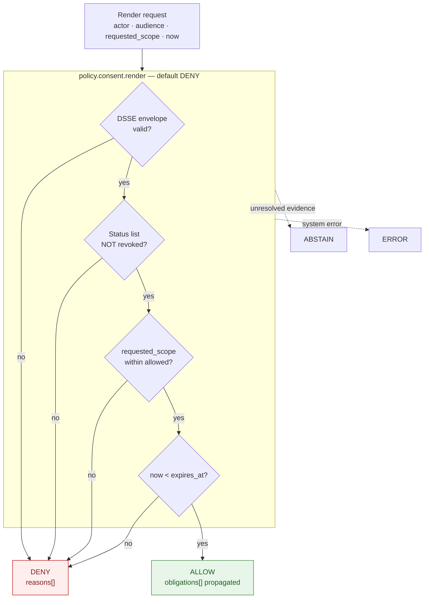

<!-- [KFM_META_BLOCK_V2]
doc_id: kfm://doc/people-dna-land/consent
title: Consent — People / Genealogy / DNA / Land Domain
type: standard
version: v0.1
status: draft
owners: <people-dna-land domain steward — TODO via CODEOWNERS>, <privacy / consent steward — TODO>, <rights-holder liaison — TODO>
created: 2026-06-06
updated: 2026-06-06
policy_label: restricted
related:
  # NEEDS VERIFICATION — repo paths PROPOSED until checked against a mounted repo
  - docs/domains/people-dna-land/ARCHITECTURE.md
  - docs/domains/people-dna-land/API_CONTRACTS.md
  - docs/domains/people-dna-land/CANONICAL_PATHS.md
  - directory-rules.md
  - ai-build-operating-contract.md
tags: [kfm, domain, people-dna-land, consent, revocation, dna, living-person, render-gate]
notes:
  # CONTRACT_VERSION = "3.0.0"
  # KEYSTONE: consent does NOT publish data. A ConsentGrant constrains what a render gate may materialize; it is not a permission to publish. Publication still requires a ReleaseManifest + promotion review.
  # ConsentSidecar / ConsentDecision render gate / Bitstring Status List machinery is CONFIRMED doctrine at the idea-card level but PROPOSED implementation (KFM-P5-PROG-0005/0006/0007). Repo presence unverified.
  # Consent-lane placement (policy/consent/ top-level vs policy/domains/people-dna-land/consent/) is an open ADR.
  # Multi-party consent shape is an explicit corpus open question.
[/KFM_META_BLOCK_V2] -->

# Consent — People / Genealogy / DNA / Land Domain

> How KFM models, enforces, and revokes **consent** for living-person and DNA-derived material. The keystone rule: **consent does not publish data.** A `ConsentGrant` is a holder-controlled *constraint* on what a render gate may materialize — never a standing permission to publish. Publication still requires evidence closure, a `ReleaseManifest`, and promotion review.


**Status:** `draft` · **Owners:** *privacy/consent steward; people-dna-land steward; rights-holder liaison — TODO* · **Last updated:** *2026-06-06* · **`CONTRACT_VERSION = "3.0.0"`**

> [!IMPORTANT]
> **Consent does NOT publish data.** This is the single most important rule in this document. A `ConsentGrant` permits *nothing* on its own — it is a constraint package that the runtime checks *before each render* to decide what it is allowed to show. A record can have valid consent and still be denied publication for missing evidence, missing release state, or unresolved rights. Conversely, no amount of evidence or release readiness overrides a missing, expired, or revoked consent. The two gates are independent and both must pass.

> [!WARNING]
> **Implementation is PROPOSED.** The consent machinery below (`ConsentSidecar`, the `policy.consent.render` gate, Bitstring Status List revocation, VC formats) is CONFIRMED *doctrine* in the KFM corpus (idea cards KFM-P5-PROG-0005/0006/0007; Pass-10 C6-07/C6-08/C9-02..04) but its presence and behavior in the live repository are **NEEDS VERIFICATION**. `ConsentGrant` and `RevocationReceipt` are CONFIRMED ubiquitous-language terms (Atlas Ch. 16 §C); the detailed object shapes are PROPOSED.

-----

## Contents

- [1. Scope](#1-scope)
- [2. The keystone rule](#2-the-keystone-rule)
- [3. Consent objects](#3-consent-objects)
- [4. The consent render gate](#4-the-consent-render-gate)
- [5. Consent lifecycle](#5-consent-lifecycle)
- [6. Revocation, tombstones, and cache invalidation](#6-revocation-tombstones-and-cache-invalidation)
- [7. Verifiable Credential formats](#7-verifiable-credential-formats)
- [8. Upstream consent flows](#8-upstream-consent-flows)
- [9. Where consent rules live](#9-where-consent-rules-live)
- [10. Governed AI behavior](#10-governed-ai-behavior)
- [11. Validators and fixtures](#11-validators-and-fixtures)
- [12. Open questions](#12-open-questions)
- [13. Related docs](#13-related-docs)

-----

## 1. Scope

**CONFIRMED doctrine / PROPOSED implementation.** This document covers consent for the People / Genealogy / DNA / Land domain — the lane where living-person data and DNA-derived material concentrate. Consent here is **explicit, machine-readable, immutable once issued, and revocable**, enforced at the per-render level rather than assumed at publication time.

In scope: what a consent record is and is not; the objects (`ConsentGrant`, `RevocationReceipt`, and the proposed `ConsentSidecar` / `ConsentDecision`); how the render gate consumes them; the consent lifecycle from grant to revocation; revocation propagation (tombstones, cache invalidation); credential formats; and upstream consent flows (FamilySearch, DTC genomic, GA4GH).

Out of scope: the full sensitivity tier scheme (see `ARCHITECTURE.md` §9 and Atlas §24.5); the governed-API envelope contract (see `API_CONTRACTS.md`); rights/licensing that is *not* consent (those are `policy/rights/`, a separate concern); and legal advice on consent law in any jurisdiction.

> [!NOTE]
> **Consent ≠ rights ≠ sensitivity.** Three distinct gates: **rights** (is KFM licensed to use the source at all?), **sensitivity** (what tier / transform does the content require?), and **consent** (has the data subject authorized this specific use, and not revoked it?). A public render must clear all three. This document is only about the third.

[Back to top](#contents)

-----

## 2. The keystone rule

> [!IMPORTANT]
> **A `ConsentGrant` is a constraint, not a permission.** The corpus is firm: *“consent does NOT publish data … the sidecar is a constraint package; publication still requires a ReleaseManifest and a Promotion Gate G approval.”* (KFM-P5-PROG-0005.)

What this means in practice:

- Consent does **not** make data public. It scopes what a render gate *may* materialize **if** publication is independently authorized.
- Consent is checked **on every render**, not once at publication. Revocation therefore has immediate runtime effect — it is not a database row that may be stale.
- Consent **fails closed**. Missing, unverifiable, expired, or revoked consent yields `DENY` (or `ABSTAIN` on unresolved evidence), never a silent allow.
- Consent is **independent of evidence and release state**. All three gates (consent, evidence closure, release) must pass; none substitutes for another.

This inverts the common (broken) pattern where “the data is published, so consent is assumed.” In KFM consent is a separate, immutable, revocable object the runtime consults before showing anything.

[Back to top](#contents)

-----

## 3. Consent objects

CONFIRMED terms (`ConsentGrant`, `RevocationReceipt` — Atlas Ch. 16 §C) / PROPOSED field realization. The `ConsentSidecar` and `ConsentDecision` are CONFIRMED-doctrine idea cards (KFM-P5-PROG-0005/0007), PROPOSED as implementation.

|Object                            |What it is                                                                                                                                                                                                                                                                     |Status                         |
|----------------------------------|-------------------------------------------------------------------------------------------------------------------------------------------------------------------------------------------------------------------------------------------------------------------------------|-------------------------------|
|**`ConsentGrant`**                |Holder-controlled consent record: issuer, subject pseudonym, purposes, finite scope, retention, revocation pointer. Releasable only when explicitly scoped.                                                                                                                    |CONFIRMED term / PROPOSED field|
|**`RevocationReceipt`**           |Tamper-evident record that a prior `ConsentGrant` has been revoked; enforced at dereference / render time.                                                                                                                                                                     |CONFIRMED term / PROPOSED field|
|**`ConsentSidecar`** *(PROPOSED)* |Immutable, content-addressed JSON object pairing a holder Verifiable Credential, a DSSE-signed consent receipt, and a Bitstring Status List entry; carries finite scope, `retention.expires_at`, and a list of sensitivity-class redaction obligations enforced at render time.|PROPOSED (KFM-P5-PROG-0005)    |
|**`ConsentDecision`** *(PROPOSED)*|The finite output of the consent render gate: `{decision_id, outcome ∈ {ALLOW, DENY, ABSTAIN, ERROR}, reasons[], obligations[], evaluated_at}`. Mirrors the `DecisionEnvelope` shape.                                                                                          |PROPOSED (KFM-P5-PROG-0007)    |
|**`DNAKitToken`** *(cross-ref)*   |Opaque internal-only handle for a DNA kit; raw kit/vendor IDs are never logged or exposed. Consent scopes what may be derived from the kit, not the kit ID itself.                                                                                                             |CONFIRMED term / PROPOSED field|

<details>
<summary><strong>PROPOSED <code>ConsentSidecar</code> shape</strong> (idea-card doctrine — KFM-P5-PROG-0005, PROPOSED)</summary>


> Illustrative; the binding schema (if adopted) would live at `schemas/contracts/v1/consent/consent_sidecar.schema.json` per the idea card. Field names are PROPOSED.

```json
{
  "consent_sidecar_id": "<opaque>",
  "spec_hash": "<JCS + SHA-256>",
  "holder_vc": {
    "vc_format": "sdjwt-vc | ldp-vc-bbs2023",
    "vc_uri": "<uri>",
    "vc_digest": "<digest>"
  },
  "receipt": {
    "dsse_envelope_uri": "<uri>",
    "dsse_envelope_digest": "<digest>"
  },
  "status": {
    "status_list_uri": "<uri>",
    "status_list_index": 0,
    "status_purpose": "revocation | suspension"
  },
  "scope": "public_render | generalize_render | restricted_render | review_required",
  "retention": { "policy": "<policy-id>", "expires_at": "<ISO8601>" },
  "obligations": [ { "type": "<class>", "op": "<redact|generalize|...>", "level": "<optional>" } ],
  "created_at": "<ISO8601>",
  "integrity": { "sidecar_digest": "<digest>" }
}
```

The sidecar is content-addressed (OCI or versioned S3) by its `sidecar_digest`. **`obligations[]` on the sidecar is the source of truth**; the `ConsentDecision.obligations[]` is the runtime evaluation of them.

</details>

[Back to top](#contents)

-----

## 4. The consent render gate

PROPOSED (KFM-P5-PROG-0007), CONFIRMED-doctrine. The OPA package `policy.consent.render` consumes a `ConsentSidecar` (or an `EvidenceBundle` with an embedded sidecar reference) plus a render-request context `{actor, audience, requested_scope, now}` and emits a finite `ConsentDecision`.

**Four checks, all must pass (default-deny):**

1. **DSSE envelope valid** — the consent receipt’s signature verifies.
1. **Not revoked** — the Bitstring Status List bit for this credential is `0` (a `1` for `revocation` purpose denies).
1. **Scope sufficient** — `requested_scope ⊆ allowed scope` (`public_render` / `generalize_render` / `restricted_render` / `review_required`).
1. **Within retention** — `now < retention.expires_at`.



> [!IMPORTANT]
> An `ALLOW` from the consent gate **only** clears the consent constraint. It propagates the sidecar’s `obligations[]` (redact, generalize, etc.) to the consumer, which MUST enforce them. The render still does not happen unless evidence closure and release state independently pass — the keystone rule (§2).

[Back to top](#contents)

-----

## 5. Consent lifecycle

PROPOSED lifecycle; the lifecycle invariant and fail-closed gates are CONFIRMED doctrine.

|Stage                   |What happens                                                                                                                        |Fail-closed behavior                                         |
|------------------------|------------------------------------------------------------------------------------------------------------------------------------|-------------------------------------------------------------|
|**Solicit / issue**     |Holder issues a typed, signed consent (VC); KFM issuer verifies and records issuance metadata.                                      |No grant → no consent → DENY on any consent-bearing render.  |
|**Admit**               |`ConsentGrant` (and proposed sidecar) admitted with scope, retention, obligations; bound to the subject pseudonym, never to raw PII.|Missing retention bound → DENY. Unknown subject scope → DENY.|
|**Enforce (per render)**|`policy.consent.render` evaluated on every request; obligations propagated on `ALLOW`.                                              |Any failed check → DENY; unresolved → ABSTAIN.               |
|**Suspend**             |Status-list bit flipped with `status_purpose: suspension` (temporary, reversible).                                                  |Suspended → DENY until cleared.                              |
|**Revoke**              |Status-list bit flipped with `status_purpose: revocation` (final, irreversible); `RevocationReceipt` issued.                        |Revoked → DENY + tombstone + cache invalidation (§6).        |
|**Expire**              |`now ≥ retention.expires_at`.                                                                                                       |Expired → DENY; re-consent required to restore.              |

[Back to top](#contents)

-----

## 6. Revocation, tombstones, and cache invalidation

CONFIRMED doctrine (Pass-10 C6-08 revocation; C5-09 tombstones), PROPOSED implementation. Revocation is a **first-class operation**, not a deletion afterthought.

On revocation:

- **Flip the status-list bit** (`revocation`). The render gate denies on the next request — revocation requires no re-issuing of dependent credentials, just a single bit flip at the stable status-list URI.
- **Issue a signed tombstone** (C5-09): revoked content is replaced by a tombstone carrying a reason and, where applicable, a replacement pointer — never silently dropped.
- **Append to the ledger**: a new `spec_hash` + `run_receipt` records the supersession.
- **Invalidate caches**: trigger PMTiles index bump / tile-server purge / cache invalidation webhooks so previously rendered tiles do not survive and leak retracted content.
- **Issue a `RevocationReceipt`** as the tamper-evident record of the event.

> [!CAUTION]
> **Revocation that does not invalidate caches is incomplete.** Stale tiles can leak retracted content after the bit is flipped. The corpus is explicit that the invalidation hooks MUST be tested before the revocation pathway is relied upon. If a revocation or status endpoint is unreachable for an extended window, rendering MUST fail closed even at the cost of user inconvenience.

[Back to top](#contents)

-----

## 7. Verifiable Credential formats

CONFIRMED doctrine (Pass-10 C6-07; KFM-P5-PROG-0006), PROPOSED implementation. Two recommended formats; the per-domain pinning is left open.

|Format             |Use case                                           |Property                                                                              |
|-------------------|---------------------------------------------------|--------------------------------------------------------------------------------------|
|**SD-JWT-VC**      |Embedded / mobile; broadly supported, JSON-friendly|Selective disclosure via salted hashes; more mature tooling as of mid-2026            |
|**LDP-VC BBS-2023**|Higher-assurance flows                             |Unlinkable proofs + selective disclosure (e.g., prove “over 18” without revealing DOB)|

Revocation uses the **W3C Bitstring Status List**: each VC carries a `credentialStatus` with `statusListCredential` (URI) + `statusListIndex` (bit position); the status list is itself a signed VC, so the check is a verifiable lookup. Status purposes: `revocation` (final, irreversible) and `suspension` (temporary, reversible).

> [!NOTE]
> Selective disclosure matters for privacy: it lets a holder prove the minimum necessary (an age threshold, a relationship class) without leaking the underlying field. Without it, every consent flow over-discloses. The format choice (SD-JWT-VC vs BBS-2023) and whether KFM self-hosts the status list vs uses a public registry are both open (privacy argues self-hosted; auditability argues public).

[Back to top](#contents)

-----

## 8. Upstream consent flows

CONFIRMED doctrine (Pass-10 C9-02/C9-03/C9-04), PROPOSED implementation. Consent originates upstream and must be carried, not assumed.

|Upstream                                                  |Consent mechanism                                        |KFM handling                                                                                                                                                              |
|----------------------------------------------------------|---------------------------------------------------------|--------------------------------------------------------------------------------------------------------------------------------------------------------------------------|
|**FamilySearch API**                                      |OAuth2 with consent scopes; GA4GH Passport claim at fetch|Record grant scope, access-token *fingerprint* (never the token), Passport claim, response checksum under a run-receipt. User revocation → tombstone + cache invalidation.|
|**DTC genomic exports** (23andMe, AncestryDNA, MyHeritage)|User-controlled raw export under explicit consent        |Raw genotype **never republished**; only aggregate / k-anonymized derived data crosses the publication boundary. Consent scopes what may be derived.                      |
|**GA4GH AAI / DUO**                                       |Passport visas; consent-scope → DUO code mapping         |Consent introspected on every access decision; fail closed when introspection cannot complete.                                                                            |


> [!CAUTION]
> **Retention after revocation is an open policy question.** The corpus does not yet specify how long KFM may keep an upstream response in RAW after consent is revoked, or whether a tombstone suffices vs. physical purge of the underlying object. Treat this as `NEEDS VERIFICATION` (OQ-CONSENT-04) and prefer the more conservative path (purge) pending an ADR. The death-of-a-consenting-user case (consent becomes ambiguous) is also unresolved — default to embargo + escalate, not surface.

[Back to top](#contents)

-----

## 9. Where consent rules live

PROPOSED placement; the lane question is genuinely open (carried from `CANONICAL_PATHS.md` §9.3).

|Artifact                                    |Proposed home                                                                                            |Status                    |
|--------------------------------------------|---------------------------------------------------------------------------------------------------------|--------------------------|
|Consent render policy                       |`policy/consent/render.rego` (idea-card path) **or** `policy/domains/people-dna-land/consent/render.rego`|PROPOSED / lane-conflicted|
|Consent render tests                        |`tests/policy/consent/render_test.rego`                                                                  |PROPOSED                  |
|`ConsentSidecar` schema                     |`schemas/contracts/v1/consent/consent_sidecar.schema.json` (cross-cutting consent home)                  |PROPOSED                  |
|`ConsentGrant` / `RevocationReceipt` schemas|`schemas/contracts/v1/consent/` (cross-cutting) **or** domain schema home                                |PROPOSED                  |


> [!WARNING]
> **Consent-lane placement is an open ADR.** Consent is explicitly named as a `policy/` concern, and the Atlas §24.13 crosswalk lists `policy/consent/people/`; the idea cards suggest a cross-cutting `policy/consent/` and `schemas/contracts/v1/consent/`. What is unsettled is whether `consent/` is a **top-level sibling lane** (creating it is ADR-class, Directory Rules §2.4(1)) or **nests under** `policy/domains/people-dna-land/consent/`. Pending an ADR, prefer the domain-nested form for domain-specific rules and reserve a cross-cutting `consent/` home only if an ADR establishes it. Do not create both as parallel authority homes (§2.4(5)). Tracked as VB-PDL-04 in `CANONICAL_PATHS.md`.

[Back to top](#contents)

-----

## 10. Governed AI behavior

CONFIRMED doctrine (Atlas Ch. 16 §L; GAI). Finite outcomes `ANSWER` / `ABSTAIN` / `DENY` / `ERROR`; every Focus Mode answer carries an `AIReceipt`.

|AI action touching consent-bearing material                                                           |Outcome                            |
|------------------------------------------------------------------------------------------------------|-----------------------------------|
|Explain what consent scope applies to a released, consent-cleared item                                |`ANSWER`                           |
|Explain that consent was revoked / why content is unavailable                                         |`ANSWER` (no restricted content)   |
|Output living-person or DNA-derived material under valid, in-scope consent **and** independent release|`ANSWER` (obligations enforced)    |
|Output the same material with missing / expired / revoked consent                                     |`DENY`                             |
|Treat the presence of data as implied consent                                                         |`DENY` — violates the keystone rule|
|Infer or reconstruct a revoked subject’s data from cached / derived sources                           |`DENY`                             |
|Answer when consent evidence (DSSE / status list) cannot be resolved                                  |`ABSTAIN`                          |

[Back to top](#contents)

-----

## 11. Validators and fixtures

PROPOSED; homes use the **whole-domain** `people-dna-land` segment (or the cross-cutting `consent/` home if an ADR establishes it). The render-gate test path `tests/policy/consent/render_test.rego` is from the idea card.

|Validator / fixture          |Proves                                                            |Status                                  |
|-----------------------------|------------------------------------------------------------------|----------------------------------------|
|DSSE-validity test           |An invalid consent-receipt signature denies                       |PROPOSED                                |
|Revocation-bit test          |A revoked status-list bit denies on the next render               |PROPOSED                                |
|Scope-subset test            |`requested_scope ⊄ allowed` denies                                |PROPOSED                                |
|Retention-expiry test        |`now ≥ expires_at` denies                                         |PROPOSED                                |
|Default-deny test            |Absent / unparseable sidecar denies (never silent allow)          |PROPOSED                                |
|Revocation-cleanup test      |Revocation invalidates downstream renders + caches within TTL     |PROPOSED (carried from ARCHITECTURE §13)|
|Consent-does-not-publish test|Valid consent with **no** `ReleaseManifest` still does not publish|PROPOSED                                |
|Obligation-propagation test  |Sidecar `obligations[]` are enforced by the consumer on `ALLOW`   |PROPOSED                                |
|Token-fingerprint test       |Upstream access tokens are stored as fingerprints, never raw      |PROPOSED                                |

<details>
<summary><strong>Recommended negative-path fixtures</strong> (PROPOSED, illustrative)</summary>

|Fixture                                 |Expected outcome                     |
|----------------------------------------|-------------------------------------|
|`invalid_dsse_receipt.json`             |DENY                                 |
|`revoked_status_bit.json`               |DENY                                 |
|`expired_consent.json`                  |DENY                                 |
|`scope_exceeds_grant.json`              |DENY                                 |
|`missing_retention.json`                |DENY                                 |
|`consent_valid_no_release_manifest.json`|not published (consent ≠ publication)|
|`raw_token_logged.json`                 |FAIL                                 |
|`valid_in_scope_released.json`          |ALLOW + obligations                  |

</details>

[Back to top](#contents)

-----

## 12. Open questions

|ID           |Item                                                                                                                                                           |Evidence that would settle it          |Status                   |
|-------------|---------------------------------------------------------------------------------------------------------------------------------------------------------------|---------------------------------------|-------------------------|
|OQ-CONSENT-01|Consent-lane placement: top-level `policy/consent/` vs `policy/domains/people-dna-land/consent/`; consent schema home                                          |ADR (= VB-PDL-04)                      |OPEN / NEEDS VERIFICATION|
|OQ-CONSENT-02|VC format pinning (SD-JWT-VC vs BBS-2023) per use case                                                                                                         |ADR + mounted repo                     |NEEDS VERIFICATION       |
|OQ-CONSENT-03|Status list: KFM self-hosted vs public registry                                                                                                                |ADR (privacy vs auditability tradeoff) |OPEN                     |
|OQ-CONSENT-04|Retention after revocation — tombstone sufficient, or physical purge of underlying object?                                                                     |FamilySearch/DTC retention policy + ADR|OPEN                     |
|OQ-CONSENT-05|**Multi-party consent** — e.g., a genealogy/DNA claim where several living relatives have a stake. The corpus does **not** specify a multi-party sidecar shape.|ADR + schema design                    |OPEN                     |
|OQ-CONSENT-06|Consenting-user death → consent ambiguity. Default: embargo + escalate, surface, or purge?                                                                     |Sensitivity policy + ADR               |OPEN                     |
|OQ-CONSENT-07|Revocation-introspection cache TTL                                                                                                                             |Render-gate config + tests             |NEEDS VERIFICATION       |
|OQ-CONSENT-08|Whether obligations are enforced pre- or post-envelope emission                                                                                                |Render-gate + consumer contract        |NEEDS VERIFICATION       |
|OQ-CONSENT-09|Whether this doc lives here or folds into `sublanes/dna/README.md` / a consent section                                                                         |`sublanes/` ADR (ADR-NNNN)             |PROPOSED                 |

[Back to top](#contents)

-----

## 13. Related docs

- [`./ARCHITECTURE.md`](./ARCHITECTURE.md) — domain architecture (sensitivity tiers, MUST-DENY conditions)
- [`./API_CONTRACTS.md`](./API_CONTRACTS.md) — governed-API surface (consent-revoked deny codes, finite outcomes)
- [`./CANONICAL_PATHS.md`](./CANONICAL_PATHS.md) — consent-lane placement conflict (§9.3, VB-PDL-04)
- `./sublanes/dna/README.md` — DNA sublane *(path pending the `sublanes/` ADR, ADR-NNNN)*
- [`directory-rules.md`](../../../directory-rules.md) — placement law (§6.5 `policy/`, §2.4 ADR triggers)
- [`ai-build-operating-contract.md`](../../../ai-build-operating-contract.md) — operating law (`CONTRACT_VERSION = "3.0.0"`)
- Corpus anchors: Atlas Ch. 16 §C (`ConsentGrant`, `RevocationReceipt`, `DNAKitToken`) · §L (governed AI) · §24.5.3 (tier transitions) · KFM-P5-PROG-0005/0006/0007 (sidecar, VC formats, render gate) · Pass-10 C6-07 (consent tokens), C6-08 (revocation/cache), C5-09 (tombstones), C9-02/03/04 (FamilySearch / DTC / GA4GH)

-----

**Last updated:** 2026-06-06 · **Doc id:** `kfm://doc/people-dna-land/consent` · **Status:** `draft` · `CONTRACT_VERSION = "3.0.0"` · [Back to top](#contents)