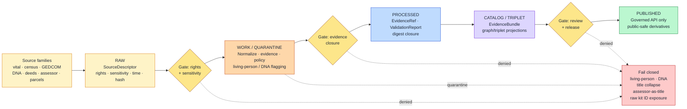

<!-- [KFM_META_BLOCK_V2]
doc_id: kfm://doc/people-dna-land/continuity-inventory
title: People / DNA / Land — Continuity Inventory
type: standard
version: v1
status: draft
owners: <People/DNA/Land domain steward — TODO via CODEOWNERS>, <sensitivity reviewer — TODO>, <docs steward — TODO>
created: 2026-05-18
updated: 2026-06-06
policy_label: restricted
related:
  # NEEDS VERIFICATION — repo paths PROPOSED until checked against a mounted repo
  - docs/domains/people-dna-land/README.md
  - docs/domains/people-dna-land/ARCHITECTURE.md
  - docs/domains/people-dna-land/CANONICAL_PATHS.md
  - docs/registers/DRIFT_REGISTER.md
  - docs/registers/VERIFICATION_BACKLOG.md
  - directory-rules.md
  - ai-build-operating-contract.md
tags: [kfm, domain, people-dna-land, continuity, governance, sensitivity]
notes:
  # CONTRACT_VERSION = "3.0.0"
  # All repo-shaped paths are PROPOSED pending Directory Rules verification and mounted-repo inspection.
  # Living-person fields and DNA-derived outputs are denied or restricted by default.
  # Assessor records are NOT title truth; parcel geometry is NOT title-boundary proof.
  # This is doctrine/lineage/design-pressure, NOT an implementation manifest (operating contract §8 LINEAGE/EXPLORATORY labels).
[/KFM_META_BLOCK_V2] -->

# People / DNA / Land — Continuity Inventory

Single-source register of prior gains, doctrinal commitments, and proposed implementation pressure for the People/DNA/Land domain — carried forward as doctrine, lineage, or design pressure without being mistaken for current implementation.


> **Status:** draft · **Owners:** TBD (Domain steward · Sensitivity reviewer · Docs steward) · **Last updated:** 2026-06-06 · **`CONTRACT_VERSION = "3.0.0"`**

> [!IMPORTANT]
> **Sensitivity posture is non-negotiable.** Living-person assertions, DNA-derived relationship inferences, raw vendor kit identifiers, and DNA segment data are **denied or restricted by default**. Assessor and tax records are **not** title truth. Parcel geometry is **not** title-boundary proof. Any continuity item that bends these invariants must travel through an ADR — never through a documentation rewrite. <sup>[DOM-PEOPLE] [ENCY §7.14]</sup>

-----

## Contents

- [1. Purpose and doctrinal anchor](#1-purpose-and-doctrinal-anchor)
- [2. Scope and explicit non-ownership](#2-scope-and-explicit-non-ownership)
- [3. Classification vocabulary](#3-classification-vocabulary)
- [4. Continuity flow diagram](#4-continuity-flow-diagram)
- [5. Inventory — doctrinal posture](#5-inventory--doctrinal-posture)
- [6. Inventory — object families](#6-inventory--object-families)
- [7. Inventory — source families](#7-inventory--source-families)
- [8. Inventory — cross-lane relations](#8-inventory--cross-lane-relations)
- [9. Inventory — sensitivity, rights, and publication controls](#9-inventory--sensitivity-rights-and-publication-controls)
- [10. Inventory — pipeline, lifecycle, and proof closure](#10-inventory--pipeline-lifecycle-and-proof-closure)
- [11. Inventory — API, UI, and governed-AI surfaces](#11-inventory--api-ui-and-governed-ai-surfaces)
- [12. Inventory — validators, tests, and fixtures](#12-inventory--validators-tests-and-fixtures)
- [13. Inventory — publication, correction, rollback](#13-inventory--publication-correction-rollback)
- [14. Verification backlog](#14-verification-backlog)
- [15. Open questions and ADR triggers](#15-open-questions-and-adr-triggers)
- [16. Related docs](#16-related-docs)
- [17. Appendix — source attribution legend](#17-appendix--source-attribution-legend)

-----

## 1. Purpose and doctrinal anchor

A continuity inventory records what KFM has already gained for a domain and what behavior must be preserved when implementation arrives. It is **doctrine and design pressure**, not an implementation manifest. The principle is canonized in the operating contract’s truth-label set, which reserves `LINEAGE` (“prior artifact preserving history, rationale, or continuity; not current authority by itself”) and `EXPLORATORY` (“idea inventory or design pressure; not admitted canon”) for exactly this purpose, and in the atlas doctrine that an atlas/inventory “must not become the authority for evidence, policy, promotion, or implementation maturity.” <sup>[operating contract §8] [KFM-P1-IDEA-0001]</sup>

This document inventories prior gains for the People/DNA/Land domain across nine surfaces — posture, objects, sources, cross-lane relations, sensitivity, pipeline, surfaces, validators, and publication — each carrying:

- **Surface or prior gain** — what was established
- **Classification** — how it must be carried forward (see §3)
- **Evidence basis** — the corpus source that grounds it
- **Preserved next behavior** — what implementation must honor

> [!NOTE]
> The KFM domain identifier `people-dna-land` is the canonical kebab-case form per `directory-rules.md` §12, alongside `hydrology`, `soil`, `fauna`, `flora`, `habitat`, `geology`, `atmosphere`, `roads-rail-trade`, `settlements-infrastructure`, `archaeology`, `hazards`, and `agriculture`. The Atlas §24.13 crosswalk uses a shorter `people` segment for schemas/policy; that divergence is **CONFLICTED** with Directory Rules and is tracked as a shared open question (see §15, and OQ-PEOPLE-DNA-11 in the sibling docs). Directory Rules governs path questions. <sup>[DIRRULES §12, §2.5]</sup>

[Back to top](#contents)

-----

## 2. Scope and explicit non-ownership

### 2.1 What this domain owns

CONFIRMED doctrine: People/DNA/Land owns assertion-first, evidence-bound, privacy-aware claims about people, genealogy, DNA evidence, and historical land ownership. <sup>[DOM-PEOPLE] [ENCY §7.14]</sup>

|Owned concern                                                       |Authority                    |Citation    |
|--------------------------------------------------------------------|-----------------------------|------------|
|Person assertions, identity resolution, canonical person records    |This domain                  |[ENCY §7.14]|
|Genealogy relationships, family groups, life events                 |This domain                  |[ENCY §7.14]|
|Residence events, migration events, temporal residence overlap      |This domain                  |[ENCY §7.14]|
|Land-ownership assertions, deeds, title instruments                 |This domain                  |[ENCY §7.14]|
|Assessor records, tax records, parcel versions, ownership intervals |This domain                  |[ENCY §7.14]|
|DNA match evidence, DNA segments, kit tokens, consent and revocation|This domain (restricted lane)|[DOM-PEOPLE]|
|Living-person and DNA restriction posture                           |This domain                  |[DOM-PEOPLE]|

### 2.2 What this domain does NOT own

CONFIRMED / PROPOSED non-ownership: adjacent lanes provide context but do not weaken this domain’s controls. <sup>[DOM-PEOPLE]</sup>

|Concern                                                     |Owning lane                      |
|------------------------------------------------------------|---------------------------------|
|Frontier definitions, county-year panels, geography versions|Frontier Matrix                  |
|**Land Office Record, Public Land Record**                  |Frontier Matrix (Atlas Ch. 17 §B)|
|Route and corridor semantics                                |Roads / Rail                     |
|Legal and infrastructure status of settlements              |Settlements / Infrastructure     |
|Archaeological site location authority                      |Archaeology                      |
|Hydrology, soil, agriculture, hazards spatial foundation    |Respective domains               |


> [!CAUTION]
> Adjacent-lane context **must not** become a back-door for living-person, DNA, title, or parcel-boundary exposure. If a cross-lane relation appears to require relaxing these controls, the requirement triggers an ADR — not a relaxation. The Frontier↔People/Land edge carries public-land/land-office context **without living/DNA/title leakage** (Atlas §17.F). <sup>[DOM-PEOPLE] [Atlas §17.F]</sup>

[Back to top](#contents)

-----

## 3. Classification vocabulary

Continuity classifications, adapted to this domain. These are a **documentation device** for tracking carry-forward intent; the underlying authority is the operating contract’s `LINEAGE` / `PROPOSED` / `DENY` truth labels (§8). <sup>[operating contract §8]</sup>

|Classification             |Meaning                                                           |When to use                                                                                           |
|---------------------------|------------------------------------------------------------------|------------------------------------------------------------------------------------------------------|
|**KEEP AND EXTEND**        |Doctrine is sound; implementation should extend it as-is          |Trust-membrane invariants, RAW→PUBLISHED lifecycle, EvidenceBundle resolution, Evidence Drawer pattern|
|**KEEP AS LINEAGE**        |Captures prior intent; not an implementation directive            |Domain blueprint PDFs, exploratory packets, earlier path proposals                                    |
|**WRAP WITH ADAPTER**      |Useful surface that must sit behind a governed boundary           |DNA vendor data, GEDCOM imports, third-party trees, raw assessor feeds                                |
|**KEEP AND EXTEND / DEFER**|Doctrine kept; concrete realization deferred                      |Restricted DNA review UI, living-person review workflow                                               |
|**DEFER UNTIL ADR**        |Implementation suppressed until a directional decision is recorded|Schema-home choice, separation-of-duties matrix, ai-receipt retention                                 |
|**DENY BY DEFAULT**        |Capability exists in doctrine only as a denial path               |Living-person DNA inference, exact-precision land join with private records                           |
|**REPLACE OR SUPERSEDE**   |Prior pattern conflicts with current doctrine                     |(None for this domain at this revision)                                                               |

[Back to top](#contents)

-----

## 4. Continuity flow diagram

PROPOSED structural view. The diagram shows how prior gains flow through the governed lifecycle, with sensitivity gates that **fail closed** at every transition. Illustrative; concrete validators, routes, and policy bundles remain PROPOSED until repo evidence verifies them. <sup>[DOM-PEOPLE] [DIRRULES]</sup>



[Back to top](#contents)

-----

## 5. Inventory — doctrinal posture

|Prior gain                                                                   |Classification                       |Evidence basis            |Preserved next behavior                                                                                                 |
|-----------------------------------------------------------------------------|-------------------------------------|--------------------------|------------------------------------------------------------------------------------------------------------------------|
|Assertion-first modeling (`Person Assertion` separate from `PersonCanonical`)|**KEEP AND EXTEND**                  |[DOM-PEOPLE] [ENCY §7.14] |All person/relationship/land claims start as assertions; canonicalization is a governed transition, not a write-through.|
|Evidence-bound claims with confidence                                        |**KEEP AND EXTEND**                  |[DOM-PEOPLE] [ENCY §7.14] |Each assertion resolves to an `EvidenceRef` that hydrates to an `EvidenceBundle`; unresolvable evidence → ABSTAIN.      |
|Privacy-aware default-deny posture                                           |**KEEP AND EXTEND · DENY BY DEFAULT**|[DOM-PEOPLE §I]           |Living-person and DNA-derived outputs are denied or restricted by default; ALLOW is the rare governed exception.        |
|Title-versus-geometry distinction                                            |**KEEP AND EXTEND**                  |[DOM-PEOPLE §I]           |`Parcel Version` is a geometry version, not title truth; `Assessor Record` is `administrative`, not title authority.    |
|Temporal time-class discipline                                               |**KEEP AND EXTEND**                  |[DOM-PEOPLE] [Atlas §16.E]|Source, observed, valid, retrieval, release, and correction times remain distinct where material.                       |
|Relationship hypotheses stay hypotheses                                      |**KEEP AND EXTEND**                  |[DOM-PEOPLE]              |`Relationship Hypothesis` never silently graduates to `Genealogy Relationship` without governed review.                 |
|Cite-or-abstain truth posture                                                |**KEEP AND EXTEND**                  |[GAI] [DOM-PEOPLE]        |Focus Mode and any AI summary cites a resolvable `EvidenceBundle` or ABSTAINS.                                          |
|Governed-AI subordination to evidence                                        |**KEEP AND EXTEND**                  |[GAI] [ENCY]              |`EvidenceBundle` outranks generated language; AI emits `AIReceipt` with finite outcome ANSWER/ABSTAIN/DENY/ERROR.       |
|Source role fixed at admission, never upgraded                               |**KEEP AND EXTEND**                  |[Atlas §24.1]             |Source-role anti-collapse: assessor (`administrative`) never upcast to title authority.                                 |

[Back to top](#contents)

-----

## 6. Inventory — object families

CONFIRMED domain terminology / PROPOSED field realization. Object families come from Encyclopedia §7.14 and Atlas §16; their schema and contract homes remain PROPOSED pending Directory Rules verification. <sup>[ENCY §7.14] [Atlas §16.E] [DIRRULES §6.3-6.4]</sup>

<details>
<summary><b>Click to expand the full object family inventory</b></summary>

|Object family                                            |Purpose                                                |Classification                              |Identity rule (PROPOSED)                                    |
|---------------------------------------------------------|-------------------------------------------------------|--------------------------------------------|------------------------------------------------------------|
|`Person Assertion`                                       |Claim about a person from a single source role         |KEEP AND EXTEND                             |source id + object role + temporal scope + normalized digest|
|`PersonCanonical`                                        |Reconciled person record from corroborated assertions  |KEEP AND EXTEND                             |governed merge of assertion identities                      |
|`Person Identity Candidate`                              |Pending merge or split candidate                       |KEEP AND EXTEND / DEFER                     |candidate hash + steward review                             |
|`NameAssertion`                                          |Source-grounded name claim with vintage and orthography|KEEP AND EXTEND                             |source id + person ref + temporal scope                     |
|`LifeEvent`                                              |Birth, death, marriage, baptism, naturalization, etc.  |KEEP AND EXTEND                             |source id + event role + temporal scope                     |
|`Residence Event`                                        |Time-bounded residence assertion                       |KEEP AND EXTEND                             |source id + person ref + interval                           |
|`Migration Event`                                        |Movement between residences with uncertainty           |KEEP AND EXTEND                             |source id + person ref + interval + path                    |
|`Genealogy Relationship` / `RelationshipAssertion`       |Source-supported family relation                       |KEEP AND EXTEND                             |source id + endpoints + relation type                       |
|`Relationship Hypothesis`                                |DNA- or pattern-derived relation candidate             |DENY BY DEFAULT (public) / KEEP AS REVIEW   |hypothesis hash + evidence refs                             |
|`FamilyGroup`                                            |Reconciled household / family unit                     |KEEP AND EXTEND                             |governed cluster identity                                   |
|`DNA Match Evidence`                                     |Vendor-reported match evidence (restricted)            |WRAP WITH ADAPTER · DENY BY DEFAULT (public)|source id + match ref + consent ref                         |
|`DNASegment`                                             |Segment-level evidence (restricted, not public)        |DENY BY DEFAULT (public)                    |sealed identifier; never surfaced raw                       |
|`DNAKitToken`                                            |Opaque kit reference; never publicized                 |DENY BY DEFAULT (public)                    |sealed identifier                                           |
|`ConsentGrant`                                           |Recorded permission for DNA / living-person use        |KEEP AND EXTEND                             |grantor id + scope + temporal validity                      |
|`RevocationReceipt`                                      |Recorded revocation; triggers cleanup                  |KEEP AND EXTEND                             |grantor id + scope + revocation time                        |
|`Land Ownership Assertion`                               |Claim of ownership at a time, from a source            |KEEP AND EXTEND                             |source id + parcel ref + interval                           |
|`Deed Instrument` / `Title Instrument` / `LandInstrument`|Recorded instrument as evidence                        |KEEP AND EXTEND                             |source id + instrument id + recording time                  |
|`Assessor Record` / `TaxRecord`                          |`administrative`-role record; **not** title truth      |WRAP WITH ADAPTER                           |source id + record id + tax year                            |
|`Parcel Version` / `LandParcel`                          |Geometry version; **not** title-boundary proof         |KEEP AND EXTEND                             |parcel id + geometry version + valid time                   |
|`Ownership Interval`                                     |Derived interval between assertions                    |KEEP AND EXTEND                             |computed; never sovereign                                   |
|`LegalDescription`                                       |Metes/bounds/PLSS text as evidence                     |KEEP AND EXTEND                             |source id + normalized description hash                     |

</details>


> [!NOTE]
> `ReviewRecord` is **not** a People/DNA/Land-owned object family. It is a cross-cutting governance receipt (Atlas §24.2 receipt catalog — steward/rights-holder/policy review of admission, redaction, promotion, release). This domain *triggers and references* it; it does not own or define it. <sup>[Atlas §24.2]</sup>

> [!NOTE]
> Identity rules are PROPOSED. Atlas §16.E specifies a deterministic basis of `source id + object role + temporal scope + normalized digest`. Final canonicalization (JCS vs URDNA2015) is unresolved across the corpus and is an open ADR item — see §15. <sup>[Atlas §16.E]</sup>

[Back to top](#contents)

-----

## 7. Inventory — source families

PROPOSED admissibility / CONFIRMED source-role doctrine. Source roles use the canonical seven-role vocabulary (`observed`, `regulatory`, `modeled`, `aggregate`, `administrative`, `candidate`, `synthetic`; Atlas §24.1). Each family enters the lane only when source role, rights, and sensitivity are resolved; unresolved rights or sensitive joins **fail closed**. <sup>[DOM-PEOPLE] [Atlas §16.D, §24.1]</sup>

|Source family                                                        |Role classes                            |Rights / sensitivity                                       |Classification                              |
|---------------------------------------------------------------------|----------------------------------------|-----------------------------------------------------------|--------------------------------------------|
|Vital records (birth, marriage, death)                               |authority · observed                    |jurisdiction-dependent; living-person fields restricted    |KEEP AND EXTEND                             |
|Cemetery, burial, obituary, church                                   |observed · context                      |usually public-historical; cultural sensitivity may apply  |KEEP AND EXTEND                             |
|School, military, directory, court, probate                          |observed · context                      |usually public-historical; recent records may be restricted|KEEP AND EXTEND                             |
|Census                                                               |authority · observed                    |jurisdiction-dependent privacy window                      |KEEP AND EXTEND                             |
|GEDCOM / GEDZip / tree overlays                                      |modeled · candidate                     |rights NEEDS VERIFICATION; living-flag enforcement required|WRAP WITH ADAPTER                           |
|DNA vendor match CSV / segment / triangulation                       |observed (restricted)                   |**RESTRICTED**; consent and revocation gated               |WRAP WITH ADAPTER · DENY BY DEFAULT (public)|
|Patent, deed, mortgage, lien, easement, lease, mineral, water, access|authority · observed                    |usually public-historical; mineral/water may be sensitive  |KEEP AND EXTEND                             |
|Assessor and tax roll records                                        |administrative                          |**never title truth**; recent records may be restricted    |WRAP WITH ADAPTER                           |
|Plat, survey, metes/bounds, PLSS, subdivision, derived geometry      |authority · observed · modeled (derived)|usually public; geometry is not title proof                |KEEP AND EXTEND                             |


> [!WARNING]
> **Source-role anti-collapse:** an `Assessor Record` (`administrative`) upcast to authoritative title is a release-blocking violation. The validator catalog (§12) carries this as a required negative test. <sup>[DOM-PEOPLE] [Atlas §16.K, §24.1]</sup>

[Back to top](#contents)

-----

## 8. Inventory — cross-lane relations

CONFIRMED / PROPOSED relations. Each relation must preserve source role, sensitivity, and EvidenceBundle support. Adjacent lanes are context providers; they do not relax this domain’s controls. <sup>[DOM-PEOPLE] [Atlas §16.F]</sup>

|Related lane                    |Relation type                                                    |Classification                   |Constraint carried forward                                                                                     |
|--------------------------------|-----------------------------------------------------------------|---------------------------------|---------------------------------------------------------------------------------------------------------------|
|**Settlements / Infrastructure**|Residence · cemetery · school · court · county · township · place|KEEP AND EXTEND                  |Place reference must not leak living-person residence at exact precision.                                      |
|**Roads / Rail / Trade**        |Migration · access · movement                                    |KEEP AND EXTEND                  |Migration paths surface uncertainty; never imply real-time movement of living persons.                         |
|**Archaeology**                 |Historic person · land · documentary · cultural-place context    |KEEP AND EXTEND · DEFER PRECISION|Exact archaeological location authority remains in the Archaeology lane and is denied by default.              |
|**Agriculture**                 |Farm · land use · producer-adjacent context                      |KEEP AND EXTEND                  |Producer-adjacent joins require privacy review; living producer records restricted.                            |
|**Frontier Matrix**             |Aggregate population · county-year panel · public-land context   |KEEP AS LINEAGE                  |Aggregate context only; never bidirectional flow of individual assertions; no living/DNA/title leakage (§17.F).|

[Back to top](#contents)

-----

## 9. Inventory — sensitivity, rights, and publication controls

CONFIRMED doctrine. These controls are the strongest in the People/DNA/Land lane and are **non-negotiable** without an ADR. <sup>[DOM-PEOPLE §I] [ENCY §7.14]</sup>

|Control                                             |Classification                   |Evidence basis         |Preserved next behavior                                                                                                                                         |
|----------------------------------------------------|---------------------------------|-----------------------|----------------------------------------------------------------------------------------------------------------------------------------------------------------|
|Living-person output denied or restricted by default|KEEP AND EXTEND · DENY BY DEFAULT|[DOM-PEOPLE §I]        |Any surface that could expose living-person fields denies until policy and review explicitly allow; T4→T1 via AggregationReceipt + ReviewRecord (Atlas §24.5.3).|
|DNA-derived outputs denied or restricted by default |KEEP AND EXTEND · DENY BY DEFAULT|[DOM-PEOPLE §I]        |DNA-derived identity or relationship outputs require authorized evidence, consent, and steward review.                                                          |
|Raw vendor kit IDs / DNA segments never public      |KEEP AND EXTEND · DENY BY DEFAULT|[DOM-PEOPLE]           |Sealed at admission; never surfaced through public-safe derivatives.                                                                                            |
|Assessor / tax records ≠ title truth                |KEEP AND EXTEND                  |[DOM-PEOPLE §I]        |Validators reject source-role collapse; release blocked when upcast.                                                                                            |
|Parcel geometry ≠ title-boundary proof              |KEEP AND EXTEND                  |[DOM-PEOPLE §I]        |Geometry surfaces carry a “not title truth” distinction separating geometry version from ownership claim.                                                       |
|Consent and revocation enforced end-to-end          |KEEP AND EXTEND / DEFER          |[DOM-PEOPLE]           |`ConsentGrant` admission and `RevocationReceipt` cleanup are tested as deny-and-purge paths (see CONSENT_MODEL / CONSENT_REGISTER).                             |
|Unclear rights → fail closed                        |KEEP AND EXTEND                  |[DOM-PEOPLE] [DIRRULES]|Admission, validation, catalog, and release all reject unresolved `RIGHTS_UNKNOWN`.                                                                             |
|Cultural / rights-holder review required            |KEEP AND EXTEND                  |[DOM-PEOPLE] [DOM-ARCH]|Sovereignty, cultural-heritage, and consent-based release decisions route through a rights-holder representative.                                               |
|Separation of duties for release                    |KEEP AND EXTEND / DEFER          |[Atlas §24.9.3]        |Author of a release candidate is not the release authority for living-person or DNA materials (ADR-S-09).                                                       |


> [!IMPORTANT]
> A claim can be well-sourced and still unsafe to publish. A location can be accurate and still require redaction. KFM treats public exposure as a **governed state**, not an automatic reward for data quality. <sup>[ENCY]</sup>

[Back to top](#contents)

-----

## 10. Inventory — pipeline, lifecycle, and proof closure

CONFIRMED doctrine / PROPOSED lane realization. The People/DNA/Land lane follows the unbroken KFM lifecycle: **RAW → WORK/QUARANTINE → PROCESSED → CATALOG/TRIPLET → PUBLISHED**, with promotion as a governed state transition, never a file move. <sup>[DIRRULES] [DOM-PEOPLE] [Atlas §16.H]</sup>

|Stage                |Handling                                                                                                     |Gate                                                                            |Classification |
|---------------------|-------------------------------------------------------------------------------------------------------------|--------------------------------------------------------------------------------|---------------|
|**RAW**              |Capture immutable source payload or reference with source role, rights, sensitivity, citation, time, and hash|`SourceDescriptor` exists                                                       |KEEP AND EXTEND|
|**WORK / QUARANTINE**|Normalize schema, geometry, time, identity, evidence, rights, policy; hold failures                          |Validation and policy gate pass, or quarantine reason recorded                  |KEEP AND EXTEND|
|**PROCESSED**        |Emit validated normalized objects, receipts, public-safe candidates                                          |`EvidenceRef`, `ValidationReport`, digest closure                               |KEEP AND EXTEND|
|**CATALOG / TRIPLET**|Emit catalog records, `EvidenceBundle`, graph / triplet projections, release candidates                      |Catalog / proof closure passes                                                  |KEEP AND EXTEND|
|**PUBLISHED**        |Serve released public-safe artifacts via governed APIs and manifests                                         |`ReleaseManifest`, correction path, rollback target, review / policy state exist|KEEP AND EXTEND|


> [!NOTE]
> Proposed data homes follow Directory Rules §12: `data/raw/people-dna-land/`, `data/work/people-dna-land/`, `data/quarantine/people-dna-land/`, `data/processed/people-dna-land/`, `data/catalog/domain/people-dna-land/`, `data/published/layers/people-dna-land/`, `data/registry/sources/people-dna-land/`. All paths are **PROPOSED** until a mounted repo is inspected. <sup>[DIRRULES §12]</sup>

[Back to top](#contents)

-----

## 11. Inventory — API, UI, and governed-AI surfaces

PROPOSED surfaces. Routes, DTO names, and component homes remain UNKNOWN without a mounted repo; recorded here as design pressure, not implementation. Finite outcomes use the canonical set (Atlas §24.3). <sup>[DOM-PEOPLE] [Atlas §16.J, §24.3]</sup>

|Surface                                  |Outcomes                              |Classification         |Notes                                                                                                                                                                       |
|-----------------------------------------|--------------------------------------|-----------------------|----------------------------------------------------------------------------------------------------------------------------------------------------------------------------|
|People/DNA/Land feature / detail resolver|ANSWER / ABSTAIN / DENY / ERROR       |KEEP AND EXTEND        |DTO: `PeopleDNALandDecisionEnvelope` (PROPOSED). Exact route UNKNOWN.                                                                                                       |
|Layer manifest resolver                  |ANSWER / DENY / ERROR                 |KEEP AND EXTEND        |Public-safe release only; no canonical/internal stores reachable (no ABSTAIN — §24.3.2).                                                                                    |
|Evidence Drawer payload                  |ANSWER / ABSTAIN / DENY / ERROR       |KEEP AND EXTEND        |Evidence and policy filtered; living-person and DNA fields redacted in public scope.                                                                                        |
|Focus Mode answer                        |ANSWER / ABSTAIN / DENY / ERROR       |KEEP AND EXTEND        |AI is never root truth; emits `AIReceipt`; no passing `CitationValidationReport` → coerce to ABSTAIN.                                                                       |
|Correction submit                        |ANSWER (queued) / DENY / ERROR        |KEEP AND EXTEND / DEFER|A queued correction returns `ANSWER` carrying a `CorrectionNoticeCandidate` (not a bespoke `ACCEPTED` — §24.3.1). Living-person corrections route through additional review.|
|Review queue surface                     |ALLOW / RESTRICT / DENY / HOLD / ERROR|KEEP AND EXTEND / DEFER|Gate-class `PolicyDecision` outcomes (distinct from the public envelope). Read-only console first; write surfaces deferred.                                                 |
|Restricted DNA / consent review view     |(internal)                            |KEEP AND EXTEND / DEFER|Not part of public path; admission-gated.                                                                                                                                   |
|Living-person review view                |(internal)                            |KEEP AND EXTEND / DEFER|Steward and rights-holder review surface.                                                                                                                                   |
|Historic person profile map              |ANSWER                                |KEEP AND EXTEND        |Public-safe historical-only by default; living-person fields redacted.                                                                                                      |
|Migration paths with uncertainty         |ANSWER                                |KEEP AND EXTEND        |Uncertainty surfaced; never implies real-time movement.                                                                                                                     |
|Chain-of-title summary                   |ANSWER / ABSTAIN                      |KEEP AND EXTEND        |Title gaps and source-role distinctions visible to the user (see CHAIN_OF_TITLE_NOTES).                                                                                     |
|Parcel / title distinction inspector     |ANSWER                                |KEEP AND EXTEND        |Always shows the assessor-vs-title boundary.                                                                                                                                |

**Governed-AI behavior for this domain (CONFIRMED doctrine):**

- **MAY:** Summarize released `EvidenceBundle` content; compare sources; explain limitations; draft steward-review notes.
- **MUST ABSTAIN:** When `EvidenceBundle` is missing, citations cannot be validated, source roles conflict, or temporal scope is insufficient.
- **MUST DENY:** Direct RAW/WORK/QUARANTINE access; restricted personal / DNA inference; uncited authoritative claims; emergency-alert replacement.

<sup>[GAI] [DOM-PEOPLE §L] [Atlas §16.L]</sup>

[Back to top](#contents)

-----

## 12. Inventory — validators, tests, and fixtures

PROPOSED test surfaces, CONFIRMED doctrinal need. Each test exists as a stated requirement in the domain dossier; implementation status is UNKNOWN until a mounted repo verifies them. Homes use the **whole-domain** `people-dna-land` segment per §12. <sup>[DOM-PEOPLE] [Atlas §16.K]</sup>

```text
PROPOSED test catalogue — People/DNA/Land
-----------------------------------------------------------------
[ ] Person assertion evidence tests
[ ] GEDCOM import rights / living-flag tests
[ ] DNA consent and raw-ID no-log tests
[ ] Revocation cleanup tests
[ ] Legal-description and chain-of-title gap tests
[ ] Assessor-as-title denial test (source-role anti-collapse)
[ ] Parcel-geometry vs. title-boundary anti-collapse test
[ ] Graph projection safety tests (no living-person leakage via joins)
[ ] Sensitivity validator: living-person field redaction
[ ] Policy deny tests: restricted DNA inference
[ ] Public-safe redaction / generalization receipts
[ ] Stale-state handling tests
[ ] No-network fixture suite (synthetic personae only)
[ ] Non-regression suite for prior lineage assertions
-----------------------------------------------------------------
Proposed homes: tests/domains/people-dna-land/
                fixtures/domains/people-dna-land/
                policy/domains/people-dna-land/
Status: PROPOSED | Directory Rules §12 compliant | NEEDS VERIFICATION
```

> [!TIP]
> A strong **first** People/DNA/Land artifact is a no-network fixture covering: (a) a historic land assertion, (b) a living-person denial, (c) a DNA-derived hypothesis denial. This is the cheapest path to making the lane’s controls executable rather than aspirational. <sup>[ENCY]</sup>

[Back to top](#contents)

-----

## 13. Inventory — publication, correction, rollback

CONFIRMED doctrine / PROPOSED implementation. Every published artifact in this lane requires the full publication support stack. <sup>[ENCY Appendix E] [DOM-PEOPLE §M] [Atlas §16.M]</sup>

|Required support             |Classification         |Notes                                                                                |
|-----------------------------|-----------------------|-------------------------------------------------------------------------------------|
|`ReleaseManifest`            |KEEP AND EXTEND        |Issued by release authority; distinct from authorship when materiality applies.      |
|`EvidenceBundle` resolution  |KEEP AND EXTEND        |All claims hydrate from `EvidenceRef`; abstention on missing bundle.                 |
|Validation / policy support  |KEEP AND EXTEND        |Passes recorded; failures quarantined with reason.                                   |
|Review state (where required)|KEEP AND EXTEND / DEFER|Living-person and DNA materials require rights-holder review (`ReviewRecord`).       |
|Correction path              |KEEP AND EXTEND        |`CorrectionNotice` admissible after publication; derivatives tracked and invalidated.|
|Stale-state rule             |KEEP AND EXTEND        |Time-class freshness surfaced; stale records flagged.                                |
|Rollback target              |KEEP AND EXTEND        |`RollbackCard` records prior release reachable; rollback drills exercised.           |

[Back to top](#contents)

-----

## 14. Verification backlog

NEEDS VERIFICATION items inherited from Atlas §16.N. Each is checkable only against mounted repo files, schemas, registry entries, tests, logs, emitted artifacts, review records, or release manifests. <sup>[Atlas §16.N]</sup>

|#  |Item to verify                                                          |Evidence that would settle it                                                                          |Status               |
|---|------------------------------------------------------------------------|-------------------------------------------------------------------------------------------------------|---------------------|
|V1 |Living-person policy in force                                           |`policy/domains/people-dna-land/` bundle + denial fixtures                                             |NEEDS VERIFICATION   |
|V2 |DNA consent / revocation enforcement                                    |`ConsentGrant` admission test + `RevocationReceipt` cleanup test                                       |NEEDS VERIFICATION   |
|V3 |Land instrument chain logic                                             |Chain-of-title fixture + gap detection test                                                            |NEEDS VERIFICATION   |
|V4 |Geometry-role boundary logic                                            |Parcel-vs-title anti-collapse test                                                                     |NEEDS VERIFICATION   |
|V5 |UI / API restricted-field no-leak behavior                              |Component / E2E redaction test + governed-API filter                                                   |NEEDS VERIFICATION   |
|V6 |Schema home for domain DTOs                                             |ADR conformance against `schemas/contracts/v1/domains/people-dna-land/` (PROPOSED) vs Atlas `…/people/`|NEEDS VERIFICATION   |
|V7 |Separation-of-duties for release authority                              |Workflow rule + reviewer-not-author check (ADR-S-09)                                                   |NEEDS VERIFICATION   |
|V8 |Canonical-form decision (JCS vs URDNA2015) for assertion digests        |ADR + implemented canonicalizer                                                                        |UNKNOWN — ADR pending|
|V9 |Governed-AI receipt retention policy                                    |`AIReceipt` retention rule + sampling audit                                                            |UNKNOWN — ADR pending|
|V10|Cross-lane redaction floor (Settlements, Archaeology, Agriculture joins)|Cross-lane fixture suite (ADR-S-14 cross-lane join policy)                                             |NEEDS VERIFICATION   |

[Back to top](#contents)

-----

## 15. Open questions and ADR triggers

PROPOSED ADR triggers. None should be answered inside this inventory; each warrants its own ADR or registered drift entry. <sup>[DIRRULES §2.4, §2.5]</sup>

1. **Canonicalization for assertion identity** — JCS or URDNA2015 for `Person Assertion` and related digests? Atlas §16.E specifies a deterministic basis but does not pick a canonical form. <sup>[Atlas §16.E]</sup>
1. **Domain segment reconciliation** — `people-dna-land` (Directory Rules §12) vs. `people` (Atlas §24.13 crosswalk). Directory Rules governs path questions; record the supersession formally. (= OQ-PEOPLE-DNA-11.) <sup>[DIRRULES §12, §2.5]</sup>
1. **Schema home for domain DTOs** — confirm `schemas/contracts/v1/domains/people-dna-land/` per ADR-0001; flag any lineage entries in `contracts/<domain>/` as CONFLICTED. (= ADR-S-01.) <sup>[DIRRULES §2.4(3)]</sup>
1. **Separation-of-duties matrix realization** — codify which actions require author ≠ approver (living-person and DNA materials are strong candidates). (= ADR-S-09.) <sup>[Atlas §24.9.3]</sup>
1. **DNA review surface scope** — is the restricted DNA review surface an `apps/` UI, a `runtime/` admin tool, or both? Defer until repo conventions verified.
1. **Cross-lane redaction floor** — minimum redaction tier when this domain participates in Settlements, Archaeology, or Agriculture joins. (= ADR-S-14.)
1. **Living-person classification source** — how is “living” determined operationally (date heuristic, explicit flag, external authority)? Currently UNKNOWN; needs domain steward decision.
1. **Consent and revocation retention** — how long are `RevocationReceipt` records kept after derived data is purged? (= OQ-CONSENT-04.)
1. **AIReceipt retention and sampling** — what fraction of Focus Mode responses are audit-sampled? Where do receipts live?
1. **Title-truth attestation** — when (if ever) does KFM emit a title-truth claim, and which jurisdictional / legal review gates it? Default posture is to never emit such claims; ADR if that ever changes.
1. **`sublanes/` documentation convention** — does this domain’s `docs/domains/people-dna-land/` host a `sublanes/` subtree? (= ADR-NNNN, drafted.)
1. **Consent-lane placement** — top-level `policy/consent/` vs `policy/domains/people-dna-land/consent/`. (= VB-PDL-04 / OQ-CONSENT-01.)

[Back to top](#contents)

-----

## 16. Related docs

PROPOSED neighbors. All paths PROPOSED pending Directory Rules verification and mounted-repo inspection.

- [`./README.md`](./README.md) — domain landing page · **PROPOSED · NEEDS VERIFICATION**
- [`./ARCHITECTURE.md`](./ARCHITECTURE.md) — domain architecture
- [`./API_CONTRACTS.md`](./API_CONTRACTS.md) — governed-API surface contract
- [`./CANONICAL_PATHS.md`](./CANONICAL_PATHS.md) — path register and conflict log
- [`./CHAIN_OF_TITLE_NOTES.md`](./CHAIN_OF_TITLE_NOTES.md) — chain-of-title-as-hypothesis notes
- [`./CONSENT_MODEL.md`](./CONSENT_MODEL.md) · [`./CONSENT_REGISTER.md`](./CONSENT_REGISTER.md) — consent doctrine + operational register
- `docs/registers/DRIFT_REGISTER.md` — drift entries (incl. `people-dna-land` ↔ `people` segment) · **PROPOSED**
- `docs/registers/VERIFICATION_BACKLOG.md` — V1–V10 above propagate here · **PROPOSED**
- `docs/adr/` — ADRs for canonical-form choice, schema home, sep-of-duties, sublanes, consent lane · **PROPOSED**
- [`directory-rules.md`](../../../directory-rules.md) — §12 Domain Placement Law (CONFIRMED authority for this doc’s path)
- [`ai-build-operating-contract.md`](../../../ai-build-operating-contract.md) — operating law (`CONTRACT_VERSION = "3.0.0"`; §8 truth labels)
- Atlas §16 (`[DOM-PEOPLE]`) · §17 (Frontier Matrix) · §24.1/§24.2/§24.3/§24.5/§24.9 · Encyclopedia §7.14

[Back to top](#contents)

-----

## 17. Appendix — source attribution legend

<details>
<summary><b>Click to expand source short-code legend</b></summary>

|Short code    |Source                                                                             |Authority role                   |
|--------------|-----------------------------------------------------------------------------------|---------------------------------|
|`[DOM-PEOPLE]`|People / Genealogy / DNA / Land Ownership domain dossier (Atlas Ch. 16)            |Domain doctrine                  |
|`[ENCY]`      |KFM Encyclopedia (§7.14 for this domain)                                           |System-wide doctrine             |
|`[Atlas]`     |KFM Domains Culmination Atlas v1.1 (Ch. 16 for this domain; Ch. 24 master sections)|Cumulative domain atlas          |
|`[DIRRULES]`  |`directory-rules.md`                                                               |Directory and placement authority|
|`[GAI]`       |Governed AI doctrine                                                               |AI behavior authority            |
|`[DOM-ARCH]`  |Archaeology domain dossier (cited for cultural/sovereignty review)                 |Adjacent-domain doctrine         |

</details>


> [!NOTE]
> Two policy short-codes used in an earlier draft (`[POL-003]` / `[POL-004]`, referencing specific Pass-20 idea-card IDs `KFM-IDX-POL-003/004`) could not be verified at that precision in this session and have been replaced with the directly-anchored doctrine ([DOM-PEOPLE §I] living-person/DNA restriction; [Atlas §24.9.3] separation-of-duties; [DOM-ARCH] cultural review). If those card IDs are confirmed against a mounted corpus index, they can be reinstated as the precise citation.

<details>
<summary><b>Click to expand proposed directory placement summary</b> (per Directory Rules §12)</summary>

```text
docs/domains/people-dna-land/                    # this doc and siblings
contracts/domains/people-dna-land/               # PROPOSED — object meaning (Markdown)
schemas/contracts/v1/domains/people-dna-land/    # PROPOSED — JSON Schema
policy/domains/people-dna-land/                  # PROPOSED — admissibility / release policy
tests/domains/people-dna-land/                   # PROPOSED — enforceability proof
fixtures/domains/people-dna-land/                # PROPOSED — golden / valid / invalid
packages/domains/people-dna-land/                # PROPOSED — shared library (if needed)
pipelines/domains/people-dna-land/               # PROPOSED — executable pipeline logic
pipeline_specs/people-dna-land/                  # PROPOSED — declarative pipeline config
data/raw/people-dna-land/                        # PROPOSED — lifecycle phase
data/work/people-dna-land/                       # PROPOSED — lifecycle phase
data/quarantine/people-dna-land/                 # PROPOSED — lifecycle phase
data/processed/people-dna-land/                  # PROPOSED — lifecycle phase
data/catalog/domain/people-dna-land/             # PROPOSED — catalog records
data/published/layers/people-dna-land/           # PROPOSED — public-safe release
data/registry/sources/people-dna-land/           # PROPOSED — source registry
release/candidates/people-dna-land/              # PROPOSED — release candidates
```

All paths above are **PROPOSED** and conform to the pattern stated in `directory-rules.md` §12. None are claimed as current implementation; mounted-repo inspection is required to promote any to CONFIRMED. The Atlas §24.13 crosswalk’s shorter `people/` segment for schemas/policy is the CONFLICTED alternative (see §15 item 2). <sup>[DIRRULES §12]</sup>

</details>

-----

**Related docs:** [§16 above](#16-related-docs) · **Last updated:** 2026-06-06 · **Owners:** TBD — Domain steward · Sensitivity reviewer · Docs steward · `CONTRACT_VERSION = "3.0.0"` · [Back to top](#contents)