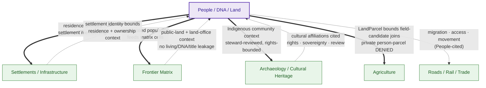

<!-- [KFM_META_BLOCK_V2]
doc_id: kfm://doc/people-dna-land/cross-lane-relations
title: Cross-Lane Relations — People / Genealogy / DNA / Land Domain
type: standard
version: v1
status: draft
owners: <People/DNA/Land domain steward — TODO via CODEOWNERS>, <sensitivity reviewer — TODO>, <docs steward — TODO>
created: 2026-06-06
updated: 2026-06-06
policy_label: restricted
related:
  # NEEDS VERIFICATION — repo paths PROPOSED until checked against a mounted repo
  - docs/domains/people-dna-land/ARCHITECTURE.md
  - docs/domains/people-dna-land/API_CONTRACTS.md
  - docs/domains/people-dna-land/CANONICAL_PATHS.md
  - docs/domains/people-dna-land/CHAIN_OF_TITLE_NOTES.md
  - docs/domains/people-dna-land/CONSENT_MODEL.md
  - directory-rules.md
  - ai-build-operating-contract.md
tags: [kfm, domain, people-dna-land, cross-lane, edges, joins, sensitivity, governance]
notes:
  # CONTRACT_VERSION = "3.0.0"
  # Every cross-lane relation MUST preserve ownership, source role, sensitivity, and EvidenceBundle support (Atlas §16.F).
  # Edge OWNERSHIP matters: an edge is owned by exactly one lane (Atlas §24.4 lattice). People owns 4 edges (§24.4.14); is consumer on others (§24.4.12/13/15).
  # Living-person fields fail closed across every boundary; private person-parcel joins denied by default.
  # Where the §24.4 lattice and §16.F per-domain list conflict, §16.F (v1.0) governs and the conflict is filed.
[/KFM_META_BLOCK_V2] -->

# Cross-Lane Relations — People / Genealogy / DNA / Land Domain

> The formal edge specification for how People/DNA/Land connects to adjacent KFM lanes: which edges this domain **owns**, which it merely **consumes**, the direction and relation type of each, and the constraint every edge must preserve. The governing rule: **every cross-lane relation must preserve ownership, source role, sensitivity, and `EvidenceBundle` support** — and living-person and DNA fields **fail closed** across every boundary.

**Status:** `draft` · **Owners:** *domain steward; sensitivity reviewer; docs steward — TODO* · **Last updated:** *2026-06-06* · **`CONTRACT_VERSION = "3.0.0"`**

> [!IMPORTANT]
> **A cross-lane edge is never a privacy bypass.** Adjacent lanes provide *context*; they do not relax this domain’s controls. Living-person fields fail closed at every join; private person↔parcel joins are denied by default; DNA-derived material never crosses a lane boundary to a public surface. If a cross-lane relation appears to *require* relaxing these controls, that requirement triggers an ADR — never a relaxation. [DOM-PEOPLE] [Atlas §16.F]

-----

## Contents

- [1. Scope](#1-scope)
- [2. The universal edge constraint](#2-the-universal-edge-constraint)
- [3. Edge ownership: owner vs consumer](#3-edge-ownership-owner-vs-consumer)
- [4. Edge map](#4-edge-map)
- [5. Edges this domain OWNS](#5-edges-this-domain-owns)
- [6. Edges where this domain is the CONSUMER](#6-edges-where-this-domain-is-the-consumer)
- [7. The residence edge: dual ownership](#7-the-residence-edge-dual-ownership)
- [8. Citing-domain sensitivity defaults](#8-citing-domain-sensitivity-defaults)
- [9. Forbidden cross-lane behaviors](#9-forbidden-cross-lane-behaviors)
- [10. Governed AI across lanes](#10-governed-ai-across-lanes)
- [11. Validators and fixtures](#11-validators-and-fixtures)
- [12. Open questions](#12-open-questions)
- [13. Related docs](#13-related-docs)

-----

## 1. Scope

**CONFIRMED doctrine / PROPOSED implementation.** This document specifies the cross-lane edges of the People/DNA/Land domain — the relations it has with Settlements/Infrastructure, Roads/Rail, Archaeology, Agriculture, and Frontier Matrix. It draws on two CONFIRMED corpus sources that must be read together:

- **Atlas §16.F** — the People/DNA/Land domain’s own per-domain relation list (the authoritative full edge list).
- **Atlas §24.4** — the cross-lane **edge-ownership lattice**, which assigns each edge to exactly one owning lane.

Where the §24.4 lattice and the §16.F per-domain list diverge, **§16.F (v1.0) governs** and the divergence is filed as a conflict, per the corpus completeness note. [Atlas §16.F, §24.4]

Out of scope: the intra-domain object model (see `ARCHITECTURE.md`); the governed-API surface (see `API_CONTRACTS.md`); chain-of-title internals (see `CHAIN_OF_TITLE_NOTES.md`); consent mechanics (see `CONSENT_MODEL.md`).

[Back to top](#contents)

-----

## 2. The universal edge constraint

Every cross-lane relation in this domain — owned or consumed, inbound or outbound — MUST preserve **all four** of:

1. **Ownership** — the edge belongs to exactly one lane; the non-owning lane does not redefine it.
1. **Source role** — the canonical role (`observed`, `administrative`, `modeled`, etc.; §24.1) is carried across the join and never upgraded.
1. **Sensitivity** — the stricter of the two lanes’ tiers applies; living-person and DNA fields fail closed.
1. **`EvidenceBundle` support** — the relation resolves to evidence; an unresolvable cross-lane claim ABSTAINs.

> [!CAUTION]
> This is the single rule repeated verbatim across the entire Atlas §16.F table: *“relation must preserve ownership, source role, sensitivity, and EvidenceBundle support.”* It is not advisory. A join that drops any of the four is a release-blocking violation. [Atlas §16.F]

[Back to top](#contents)

-----

## 3. Edge ownership: owner vs consumer

The most important distinction in this document, and the one most easily blurred: **an edge is owned by exactly one lane.** The §24.4 lattice phrases every edge as “Owner → consumes from owner → relation,” meaning the owner defines the edge and other lanes *consume* it under the owner’s constraint.

For People/DNA/Land this produces two classes:

- **Edges this domain OWNS** (§24.4.14): this domain defines the relation and its constraint. Four edges: → Settlements, → Frontier Matrix, → Archaeology, → Agriculture.
- **Edges where this domain is the CONSUMER**: another lane owns the edge; this domain consumes it under *that* lane’s constraint. Notably Settlements-owned (settlement identity bounds residence), Archaeology-owned (cultural affiliation), and Frontier-owned (public-land context).

> [!NOTE]
> Some pairs have edges in **both** directions, owned by **different** lanes — the residence relation between People and Settlements is the clearest case (§7). This is not a contradiction: People owns “residence events anchor settlement membership,” and Settlements owns “settlement identity bounds residence and ownership context.” Two distinct, complementary edges. [Atlas §24.4.12, §24.4.14]

[Back to top](#contents)

-----

## 4. Edge map

PROPOSED rendering of CONFIRMED edges. Solid arrows = edges this domain owns; dashed = edges this domain consumes (owned elsewhere). Every edge carries the §2 constraint.

[Back to top](#contents)

-----

## 5. Edges this domain OWNS

CONFIRMED (Atlas §24.4.14). This domain defines these four edges and their constraints.

|→ Consuming lane                   |Relation (CONFIRMED)                                |Constraint this domain enforces                                                                |Citation        |
|-----------------------------------|----------------------------------------------------|-----------------------------------------------------------------------------------------------|----------------|
|**Settlements / Infrastructure**   |Residence events anchor settlement membership       |**Living-person fields fail closed** at the join                                               |[Atlas §24.4.14]|
|**Frontier Matrix**                |Aggregated population observations feed matrix cells|Aggregation receipts required; individual assertions never flow as cells; no living/DNA leakage|[Atlas §24.4.14]|
|**Archaeology / Cultural Heritage**|Indigenous community context                        |**Steward-reviewed and rights-bounded**; sovereignty rules apply                               |[Atlas §24.4.14]|
|**Agriculture**                    |`LandParcel` context may bound field-candidate joins|**Private person↔parcel joins denied by default**                                              |[Atlas §24.4.14]|

> [!IMPORTANT]
> On the Frontier Matrix edge, the flow is **one-way and aggregate**: this domain *feeds* aggregated population observations into matrix cells; matrix cells are analytical releases with their own evidence and rollback, and they **do not** edit person assertions back. Individual person/DNA/title assertions never become matrix cells. [Atlas §24.4.14, §24.4.15]

[Back to top](#contents)

-----

## 6. Edges where this domain is the CONSUMER

CONFIRMED. Another lane owns the edge; this domain consumes it under that lane’s constraint. This domain does **not** redefine these edges.

|Owning lane                        |Relation (owner’s definition)                                                                                    |Constraint the owner enforces                                                         |Citation               |
|-----------------------------------|-----------------------------------------------------------------------------------------------------------------|--------------------------------------------------------------------------------------|-----------------------|
|**Settlements / Infrastructure**   |Settlement identity (Township, GhostTown, Townsite, Reservation Community) bounds residence and ownership context|Settlement identity is settlement-owned; this domain references it, never redefines it|[Atlas §24.4.12]       |
|**Archaeology / Cultural Heritage**|Cultural affiliations cited with rights, sovereignty, and steward review                                         |Exact archaeological site coordinates denied; affiliation use is steward-gated        |[Atlas §24.4.13]       |
|**Frontier Matrix**                |Public-land and land-office context (Frontier owns `Land Office Record`, `Public Land Record`)                   |Provided **without living/DNA/title leakage** (§17.F)                                 |[Atlas §17.F, §24.4.15]|
|**Roads / Rail / Trade**           |Migration, access, movement context                                                                              |Movement context only; never implies real-time movement of living persons             |[Atlas §16.F]          |

> [!NOTE]
> **The Roads/Rail edge is People-cited, not Roads-owned.** Atlas §16.F lists People→Roads/Rail (migration/access/movement), but the Roads-owned edge lattice (§24.4.11) assigns Roads’ owned edges to Settlements, Frontier, and Archaeology — **not** an explicitly Roads-owned edge back to People. So this domain cites Roads/Rail corridors as migration context; the relation lives in this domain’s §16.F list. This asymmetry is flagged as OQ-XLANE-02. [Atlas §16.F, §24.4.11]

[Back to top](#contents)

-----

## 7. The residence edge: dual ownership

The People↔Settlements residence relation is the clearest example of **two distinct edges, owned by two different lanes** — and getting it right matters because residence is the most common cross-lane join in the domain.

|Edge                |Owner                         |Definition                                                  |Constraint                             |
|--------------------|------------------------------|------------------------------------------------------------|---------------------------------------|
|People → Settlements|**People/DNA/Land** (§24.4.14)|“Residence events anchor settlement membership”             |Living-person fields fail closed       |
|Settlements → People|**Settlements** (§24.4.12)    |“Settlement identity bounds residence and ownership context”|Settlement identity is settlement-owned|

Read together: a `Residence Event` (owned here) references a settlement entity (owned there) by opaque id. This domain says *which person resided where, when*; Settlements says *what that place is*. Neither lane writes into the other; both edges carry the §2 constraint; the living-person fail-closed rule applies on this domain’s side regardless of direction.

> [!CAUTION]
> Do not collapse these into one edge or let one lane define both. A `Residence Event` that embedded settlement identity, or a settlement record that embedded living-person residence at exact precision, would be a boundary violation. The join is by reference, gated by sensitivity. [Atlas §24.4.12, §24.4.14]

[Back to top](#contents)

-----

## 8. Citing-domain sensitivity defaults

CONFIRMED (Atlas §24.14 object-family × domain matrix). When another lane cites this domain’s objects, the sensitivity default that travels with the object is fixed:

|Object cited across a lane          |Citing lanes                     |Sensitivity default (CONFIRMED)                                |
|------------------------------------|---------------------------------|---------------------------------------------------------------|
|`Person Assertion` / `NameAssertion`|Settlements, Frontier Matrix     |**T1 / T2** (living-person fields **denied**); **aggregate T0**|
|`DNA Match Evidence` / `DNASegment` |(none — restricted lane)         |**T4** — never crosses to a public surface                     |
|`Land Ownership Assertion`          |Agriculture, Frontier (aggregate)|T1/T2 historic; private person↔parcel **denied**               |
|`Parcel Version` geometry           |Agriculture, Settlements         |`modeled`; never a title boundary                              |

> [!IMPORTANT]
> The rule is **the stricter tier wins**. A `Person Assertion` cited by Settlements does not become more public by virtue of the join — living-person fields stay denied, and only aggregate (T0) or historic non-living (T1/T2) content crosses. The citing lane inherits this domain’s restriction; it cannot loosen it. [Atlas §24.14]

[Back to top](#contents)

-----

## 9. Forbidden cross-lane behaviors

These are release-blocking violations. Non-negotiable without an ADR. [Atlas §16.F, §24.9.2]

|# |Forbidden                                                                                |Why                                                                  |
|--|-----------------------------------------------------------------------------------------|---------------------------------------------------------------------|
|1 |A cross-lane join that exposes a living-person field                                     |Living-person fails closed across every boundary.                    |
|2 |A private person↔parcel join on a public surface                                         |Denied by default (§24.4.14).                                        |
|3 |DNA-derived material crossing a lane boundary to a public surface                        |DNA is a restricted lane; never crosses.                             |
|4 |This domain redefining an edge another lane owns (e.g., re-asserting settlement identity)|Edge ownership is singular (§24.4).                                  |
|5 |Frontier Matrix cells flowing back to edit person assertions                             |The Frontier feed is one-way aggregate (§24.4.14/15).                |
|6 |Exact archaeological site coordinates surfaced via a People/Land join                    |Site coords denied; Archaeology owns the affiliation edge (§24.4.13).|
|7 |Source-role upgrade across a join (e.g., assessor `administrative` → title `authority`)  |Source role fixed at admission (§24.1).                              |
|8 |A cross-lane claim with no resolvable `EvidenceBundle`                                   |Cite-or-abstain.                                                     |
|9 |Loosening this domain’s sensitivity tier by routing through a citing lane                |Stricter tier wins (§24.14).                                         |
|10|Settlement identity embedded in a `Residence Event` (or vice versa)                      |Join by reference only (§7).                                         |

[Back to top](#contents)

-----

## 10. Governed AI across lanes

CONFIRMED doctrine (Atlas §16.L; GAI). AI may traverse cross-lane edges only over **released** material, under the stricter tier, with finite outcomes `ANSWER` / `ABSTAIN` / `DENY` / `ERROR`.

|AI action across a lane boundary                                         |Outcome                                 |
|-------------------------------------------------------------------------|----------------------------------------|
|Summarize a released residence→settlement relation (historic, non-living)|`ANSWER`                                |
|Explain why a person↔parcel join is unavailable                          |`ANSWER` (no restricted content)        |
|Infer a living person’s residence via a Settlements join                 |`DENY`                                  |
|Surface a DNA-derived relationship via any cross-lane path               |`DENY`                                  |
|Reconstruct an archaeological site location via a People/Land join       |`DENY`                                  |
|Treat a Frontier matrix cell as a person-level fact                      |`DENY` — cells are aggregate derivatives|
|Answer when the cross-lane `EvidenceBundle` cannot resolve               |`ABSTAIN`                               |

[Back to top](#contents)

-----

## 11. Validators and fixtures

PROPOSED; homes use the **whole-domain** `people-dna-land` segment per §12. Cross-lane tests are the highest-value negative tests in the domain because joins are inference-risk multipliers (Atlas §24.10).

|Validator / fixture                    |Proves                                                                                        |Status  |
|---------------------------------------|----------------------------------------------------------------------------------------------|--------|
|Living-person fail-closed-at-join test |No cross-lane join exposes a living-person field                                              |PROPOSED|
|Private person↔parcel join denial test |The Agriculture/Settlements join denies private person↔parcel by default                      |PROPOSED|
|DNA-no-cross-boundary test             |DNA-derived material never crosses to a public surface via any lane                           |PROPOSED|
|Edge-ownership test                    |This domain does not write/redefine an edge owned elsewhere (Settlements/Archaeology/Frontier)|PROPOSED|
|Frontier one-way-aggregate test        |Matrix cells never flow back to edit person assertions                                        |PROPOSED|
|Stricter-tier test                     |A cited `Person Assertion` keeps the stricter tier; living fields stay denied                 |PROPOSED|
|Source-role-no-upgrade-across-join test|Assessor (`administrative`) is not upgraded to title via a cross-lane path                    |PROPOSED|
|Residence-by-reference test            |`Residence Event` references settlement identity by opaque id, never embeds it                |PROPOSED|
|Cross-lane evidence-closure test       |Every cross-lane claim resolves to a released `EvidenceBundle` or ABSTAINs                    |PROPOSED|

<strong>Recommended negative-path fixtures</strong> (PROPOSED, illustrative)

|Fixture                                     |Expected outcome        |
|--------------------------------------------|------------------------|
|`living_person_via_settlement_join.json`    |DENY                    |
|`private_person_parcel_via_agriculture.json`|DENY                    |
|`dna_crosses_to_public.json`                |DENY                    |
|`people_rewrites_settlement_identity.json`  |FAIL (edge ownership)   |
|`matrix_cell_edits_person.json`             |FAIL (one-way aggregate)|
|`assessor_upgraded_to_title_via_join.json`  |FAIL (source-role)      |
|`residence_embeds_settlement_identity.json` |FAIL (join by reference)|
|`historic_residence_settlement.json`        |ANSWER / PASS           |

[Back to top](#contents)

-----

## 12. Open questions

|ID         |Item                                                                                                           |Evidence that would settle it                      |Status            |
|-----------|---------------------------------------------------------------------------------------------------------------|---------------------------------------------------|------------------|
|OQ-XLANE-01|Cross-lane join policy — which joins require steward review, which are denied, which are open                  |ADR-S-14 (cross-lane join policy)                  |OPEN              |
|OQ-XLANE-02|Roads/Rail edge asymmetry: People-cited (§16.F) but not Roads-owned (§24.4.11) — is there a missing owned edge?|Mounted corpus reconciliation; ADR                 |NEEDS VERIFICATION|
|OQ-XLANE-03|Cross-lane redaction floor: minimum tier when this domain joins Settlements / Archaeology / Agriculture        |Sensitivity policy + cross-lane fixtures (ADR-S-14)|NEEDS VERIFICATION|
|OQ-XLANE-04|§24.4 lattice vs §16.F per-domain list divergences for this domain (completeness reconciliation)               |Mounted corpus diff; DRIFT_REGISTER                |NEEDS VERIFICATION|
|OQ-XLANE-05|How aggregated-population feed to Frontier enforces minimum-cell suppression (k-anonymity)                     |Aggregation policy + tests (C6-06)                 |NEEDS VERIFICATION|
|OQ-XLANE-06|Whether cross-lane edges are stored as graph edges and how graph-projection safety is enforced                 |Graph schema + projection-safety test              |NEEDS VERIFICATION|

[Back to top](#contents)

-----

## 13. Related docs

- [`./ARCHITECTURE.md`](./ARCHITECTURE.md) — domain architecture (object families, §10 cross-lane summary)
- [`./API_CONTRACTS.md`](./API_CONTRACTS.md) — governed-API surface (§15 cross-domain edges)
- [`./CANONICAL_PATHS.md`](./CANONICAL_PATHS.md) — path register and segment-naming conflict
- [`./CHAIN_OF_TITLE_NOTES.md`](./CHAIN_OF_TITLE_NOTES.md) — land edge to Frontier-owned land-office records
- [`./CONSENT_MODEL.md`](./CONSENT_MODEL.md) · [`./CONTINUITY_INVENTORY.md`](./CONTINUITY_INVENTORY.md)
- [`directory-rules.md`](../../../directory-rules.md) — placement law (§12)
- [`ai-build-operating-contract.md`](../../../ai-build-operating-contract.md) — operating law (`CONTRACT_VERSION = "3.0.0"`)
- Atlas anchors: §16.F (People/DNA/Land per-domain relations) · §24.4.11–§24.4.15 (edge-ownership lattice) · §17.F (Frontier↔People/Land edge) · §24.14 (object-family × domain sensitivity) · §24.9.2 (trust-membrane anti-patterns) · §24.10 (cross-lane inference risk)

-----

**Last updated:** 2026-06-06 · **Doc id:** `kfm://doc/people-dna-land/cross-lane-relations` · **Status:** `draft` · `CONTRACT_VERSION = "3.0.0"` · [Back to top](#contents)