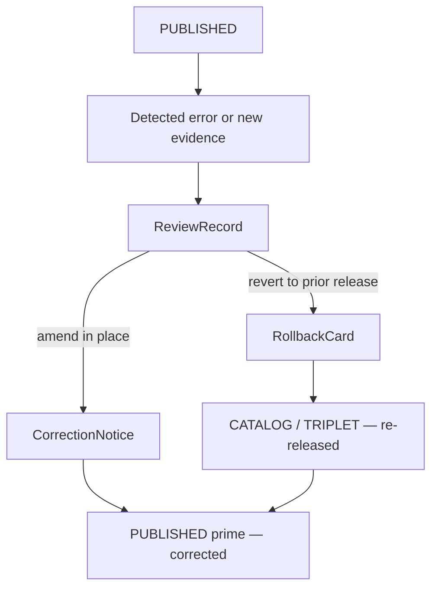

<!-- [KFM_META_BLOCK_V2]
doc_id: kfm://doc/people-dna-land/data-lifecycle
title: People / Genealogy / DNA / Land — Data Lifecycle
type: standard
version: v2
status: draft
owners: [TODO: domain steward — People/Genealogy/DNA/Land; TODO: release authority; TODO: rights-holder rep]
created: 2026-05-18
updated: 2026-06-07
policy_label: public
related:
  - docs/doctrine/lifecycle-law.md
  - docs/doctrine/trust-membrane.md
  - docs/doctrine/directory-rules.md          # Directory Rules v1.3
  - ai-build-operating-contract.md            # CONTRACT_VERSION = "3.0.0"
  - docs/domains/people-dna-land/README.md
  - docs/standards/PROV.md
  - schemas/contracts/v1/people/              # PROPOSED canonical schema slug per Atlas §24.13
  - policy/sensitivity/people/
  - policy/consent/people/
tags: [kfm, lifecycle, people, genealogy, dna, land, governance, sensitivity, consent]
notes:
  - CONTRACT_VERSION = "3.0.0" pinned per ai-build-operating-contract.md v3.0.
  - Sensitivity posture (living-person / DNA deny-by-default) is doctrine-confirmed; implementation paths are PROPOSED.
  - SLUG CONFLICT: docs lane uses people-dna-land; canonical schema/policy slug is people (Atlas §24.13). Tracked as OQ-PEOPLE-SLUG-01; ADR pending. Both slugs appear below, each labeled.
  - GATE-LETTER CONFLICT: two A-G gate matrices exist in the corpus (Pass-10 C5-01 vs Build-Manual §6.2 / Unified-Doctrine §8). Surfaced in §5; tied to ADR-S-08.
  - Verify against mounted repo, ADRs, and policy bundles before treating any path, gate letter, or schema home as canonical.
[/KFM_META_BLOCK_V2] -->

# People / Genealogy / DNA / Land — Data Lifecycle

> Governed lifecycle reference for the **People / Genealogy / DNA / Land Ownership** domain — how source material moves from intake to release under KFM’s deny-by-default posture for living-person, DNA, and land-title claims.

[](#)
[](./README.md)
[](../../../ai-build-operating-contract.md)
[](../../doctrine/lifecycle-law.md)
[](#6-sensitivity-tiers-and-domain-invariants)
[](#6-sensitivity-tiers-and-domain-invariants)
[](#6-sensitivity-tiers-and-domain-invariants)
[](#)
[](#)

|Status|Owners                                                       |Last updated|
|------|-------------------------------------------------------------|------------|
|draft |TODO — domain steward + release authority + rights-holder rep|2026-06-07  |


> [!IMPORTANT]
> **Living-person, DNA, genomic, and DNA-derived relationship or identity outputs are denied or restricted by default.** Raw `DNAKitToken`s and DNA segments are never public artifacts. Assessor/tax records are not title truth. Parcel geometry is not title-boundary proof. These invariants hold at every lifecycle phase and are gate-enforced, not advisory. [DOM-PEOPLE] [ENCY]

> [!CAUTION]
> **Sensitive domain.** This document touches living people, genealogy, DNA/genomic data, private land, and land-ownership assertions — five categories of the operating contract’s §23.2 sensitive-domain matrix simultaneously. The **most restrictive applicable row** governs any given object. This doc names object *families* and *governance rules only*; it MUST NOT carry living-person identifiers, raw `DNAKitToken`s, DNA segment endpoints, or precise person-parcel joins. Disposition defers to §23.2; it is not re-derived here.

-----

## Quick links

- [1. Purpose and scope](#1-purpose-and-scope)
- [2. Repo fit and path map](#2-repo-fit-and-path-map)
- [3. Lifecycle overview](#3-lifecycle-overview)
- [4. Stage-by-stage handling](#4-stage-by-stage-handling)
- [5. Promotion gates for this domain](#5-promotion-gates-for-this-domain)
- [6. Sensitivity tiers and domain invariants](#6-sensitivity-tiers-and-domain-invariants)
- [7. Source families and source roles](#7-source-families-and-source-roles)
- [8. Object families and identity rules](#8-object-families-and-identity-rules)
- [9. Required receipts per phase](#9-required-receipts-per-phase)
- [10. Cross-lane handoff](#10-cross-lane-handoff)
- [11. Failure-closed scenarios](#11-failure-closed-scenarios)
- [12. Validators, tests, and fixtures](#12-validators-tests-and-fixtures)
- [13. Correction, rollback, and stale state](#13-correction-rollback-and-stale-state)
- [14. Open questions register](#14-open-questions-register)
- [15. Open verification backlog](#15-open-verification-backlog)
- [16. Changelog](#16-changelog)
- [17. Definition of done](#17-definition-of-done)
- [18. Related docs](#18-related-docs)

-----

## 1. Purpose and scope

**CONFIRMED doctrine / PROPOSED implementation.** This document specifies how KFM’s lifecycle invariant — `RAW → WORK / QUARANTINE → PROCESSED → CATALOG / TRIPLET → PUBLISHED` — is applied inside the People / Genealogy / DNA / Land domain. It is the operational counterpart to the doctrinal lifecycle law and the domain-specific instance of the universal pipeline gate reference. [DIRRULES] [DOM-PEOPLE] [ENCY]

**In scope.** Intake, normalization, validation, catalog closure, release, correction, and rollback for: `Person Assertion`, `Person Identity Candidate`, `NameAssertion`, `LifeEvent`, `Residence Event`, `Migration Event`, `Genealogy Relationship` / `RelationshipAssertion`, `FamilyGroup`, `Relationship Hypothesis`, `DNA Match Evidence`, `DNASegment`, `DNAKitToken`, `ConsentGrant`, `RevocationReceipt`, `Land Ownership Assertion`, `Deed Instrument`, `Title Instrument`, `LandInstrument`, `LegalDescription`, `Assessor Record`, `TaxRecord`, `LandParcel` / `Parcel Version`, and `Ownership Interval`. [DOM-PEOPLE] [ENCY]

**Out of scope.** Per the domain’s explicit non-ownership clause, the following lanes provide context but never weaken living-person, DNA, title, or parcel-boundary controls: [DOM-PEOPLE]

- **Settlements / Infrastructure** owns legal status and infrastructure status (cemeteries, schools, courts, county/township legal boundaries).
- **Roads / Rail / Trade** owns route/corridor semantics for movement.
- **Archaeology / Cultural Heritage** owns site and cultural-context handling, including burial-site geoprivacy and sovereignty review.
- **Agriculture** owns farm and land-use claims that are not ownership assertions.

This domain interacts with all four (see [§10](#10-cross-lane-handoff)) but does not absorb their authority.

[↑ Back to top](#quick-links)

-----

## 2. Repo fit and path map

> [!NOTE]
> Per Directory Rules v1.3 (Domain Placement Law), the domain name is a **segment** inside each responsibility root, never a root folder. All paths below are **PROPOSED** until verified against a mounted repository.

> [!WARNING]
> **Unresolved slug drift (CONFLICTED — `OQ-PEOPLE-SLUG-01`).** The canonical schema/contract/policy slug for this lane is **`people`** (`schemas/contracts/v1/people/`, `policy/sensitivity/people/`, `policy/consent/people/`) per the Atlas §24.13 responsibility-root crosswalk. The human-facing docs lane is variously rendered **`people-dna-land`**. “Genealogy” appears as a policy lane name in some references. The externally presented lane name is **unsettled** and must be fixed by ADR before any of these slugs is treated as canonical. Both forms appear below, each labeled; do not silently normalize one into the other. [Atlas §24.13] [DEEP-RESEARCH slug-drift register]

```text
# Human-facing docs lane — slug UNSETTLED (people-dna-land shown; canonical TBD by ADR)
docs/domains/people-dna-land/
├── README.md                       # domain orientation (separate doc)
├── DATA_LIFECYCLE.md               # this file
├── SENSITIVITY.md                  # PROPOSED — sensitivity tier rules
└── SOURCE_FAMILIES.md              # PROPOSED — source-role detail

# Responsibility roots — canonical slug is `people` per Atlas §24.13 (PROPOSED until repo-verified)
contracts/people/                          # object meaning (Markdown)
schemas/contracts/v1/people/               # machine shape (JSON Schema), ADR-0001 schema home
policy/sensitivity/people/                 # sensitivity / deny-by-default bundles
policy/consent/people/                     # consent + revocation policy (DNA / living-person)
tests/domains/people-dna-land/             # enforcement proof — docs-lane slug; NEEDS VERIFICATION
fixtures/domains/people-dna-land/          # valid / invalid samples — NEEDS VERIFICATION
pipelines/domains/people-dna-land/         # executable pipeline logic — NEEDS VERIFICATION
pipeline_specs/people-dna-land/            # declarative pipeline config — NEEDS VERIFICATION

data/raw/people-dna-land/<source_id>/<run_id>/
data/work/people-dna-land/<run_id>/
data/quarantine/people-dna-land/<reason>/<run_id>/
data/processed/people-dna-land/<dataset_id>/<version>/
data/catalog/domain/people-dna-land/
data/published/layers/people-dna-land/     # public-safe layers only
data/registry/sources/people-dna-land/
release/candidates/people-dna-land/
```

> [!CAUTION]
> The `data/`, `tests/`, `fixtures/`, and `pipelines/` segments above reuse the docs-lane slug (`people-dna-land`) while the contracts/schemas/policy roots use `people`. **This is itself an instance of the slug drift** — Directory Rules require the domain segment to be consistent across responsibility roots. Whether the data/test lane slug should follow `people` or `people-dna-land` is part of `OQ-PEOPLE-SLUG-01`. Until the ADR lands, treat every slug above as `PROPOSED / CONFLICTED`.

**Compatibility note (PROPOSED).** No People/DNA/Land compatibility roots are expected outside the canonical layout. Any prior root-level `people/`, `genealogy/`, `dna/`, or `land/` folder is a Directory Rules §3 “domain folder at repo root” anti-pattern and migrates under the §2.4 / §2.5 drift process (open a `DRIFT_REGISTER.md` entry). [DIRRULES]

[↑ Back to top](#quick-links)

-----

## 3. Lifecycle overview

**CONFIRMED doctrine.** Promotion is a **governed state transition**, not a file move. A path-level move that bypasses validators, policy gates, evidence-bundle creation, catalog closure, and release-decision recording is a violation of the invariant regardless of which directory the bytes ended up in. [DIRRULES] [ENCY]

```mermaid
flowchart LR
    subgraph PRERAW["Pre-RAW — PROPOSED admission edge"]
        E[EventEnvelope]
        P[prefilter output]
        R[EventRunReceipt]
        E --> P --> R
    end

    R --> A[RAW]
    A -->|normalize and classify| B[WORK]
    A -->|defect detected| Q[QUARANTINE]
    Q -.->|correction| B
    B -->|validation plus redaction pass| C[PROCESSED]
    C -->|evidence plus catalog closure| D[CATALOG / TRIPLET]
    D -->|release decision plus review| F[PUBLISHED]

    F -.->|correction| F2["PUBLISHED prime"]
    F -.->|rollback| D

    classDef high fill:#fce4e4,stroke:#c0392b,color:#2b2b2b
    classDef med fill:#fff3cd,stroke:#a07a00,color:#2b2b2b
    classDef pub fill:#e0f0e0,stroke:#2d8f4e,color:#2b2b2b
    class A,Q high
    class B,C med
    class D,F,F2 pub
```



Reading note: every transition requires the artifacts named in [§4](#4-stage-by-stage-handling) and [§9](#9-required-receipts-per-phase). Transitions without those artifacts **fail closed**. The pre-RAW admission edge mirrors the cross-cutting `EventEnvelope → EventRunReceipt` pattern and is PROPOSED for this lane.

[↑ Back to top](#quick-links)

-----

## 4. Stage-by-stage handling

The table below summarizes how each lifecycle phase handles People/DNA/Land material, aligned to the Atlas universal lifecycle-gate reference (§24.6.1). Detailed receipts are in [§9](#9-required-receipts-per-phase); detailed gate logic is in [§5](#5-promotion-gates-for-this-domain). [Atlas §24.6.1] [DOM-PEOPLE]

|Stage                |Handling                                                                                                                                                                                                                                                                                                           |Entry condition                                                                                                                           |Stage status|
|---------------------|-------------------------------------------------------------------------------------------------------------------------------------------------------------------------------------------------------------------------------------------------------------------------------------------------------------------|------------------------------------------------------------------------------------------------------------------------------------------|------------|
|**RAW**              |Capture immutable source payload or reference under source identity (vital, cemetery, obituary, census, GEDCOM/GEDZip, DNA vendor match CSV, patent/deed/mortgage instruments, assessor rolls, plat/PLSS geometry) with source role, rights, sensitivity, citation, time, and content hash. Never a public surface.|`SourceDescriptor` exists (role, authority, rights, sensitivity, cadence); payload/reference hash recorded.                               |PROPOSED    |
|**WORK**             |Normalize schema, geometry, time, identity, evidence, rights, and policy. Resolve provisional person/name assertions. Hold any defects in QUARANTINE rather than promoting silently.                                                                                                                               |`TransformReceipt`; `ValidationReport` (working set); `PolicyDecision`.                                                                   |PROPOSED    |
|**QUARANTINE**       |Hold material with rights, sensitivity, validation, source-role, evidence, temporal, or policy defects until corrected. Quarantine reason is recorded; nothing silently promotes.                                                                                                                                  |Recorded quarantine reason code and steward-review pointer.                                                                               |PROPOSED    |
|**PROCESSED**        |Emit validated normalized objects, receipts, and public-safe candidates. Living-person and DNA-derived material remains classified per [§6](#6-sensitivity-tiers-and-domain-invariants).                                                                                                                           |`ValidationReport` pass; `RedactionReceipt` where sensitivity applies; `AggregationReceipt` where applies; `EvidenceRef` / digest closure.|PROPOSED    |
|**CATALOG / TRIPLET**|Emit catalog records (STAC/DCAT/PROV/domain), `EvidenceBundle`s, graph/triplet projections, and release candidates. Graph projections must pass safety tests (no living-person re-identification, no DNA leakage).                                                                                                 |`CatalogMatrix` entry; `EvidenceBundle`; graph projection safety.                                                                         |PROPOSED    |
|**PUBLISHED**        |Serve released, public-safe artifacts through governed APIs and manifests only. Direct public reads of RAW/WORK/QUARANTINE/PROCESSED are forbidden by the trust membrane.                                                                                                                                          |`ReleaseManifest`; rollback target; correction path; `ReviewRecord` where required.                                                       |PROPOSED    |


> [!CAUTION]
> A **path-level move** from `data/raw/` directly to `data/published/` is a Directory Rules lifecycle-skip anti-pattern and is invalid regardless of how clean the source looked. Promotion only happens through the gates. [DIRRULES]

[↑ Back to top](#quick-links)

-----

## 5. Promotion gates for this domain

> [!WARNING]
> **Gate-lettering conflict (CONFLICTED — `OQ-PEOPLE-GATE-01`, tied to ADR-S-08).** The corpus contains **two distinct A–G gate matrices** that assign different meanings to the same letters, and Pass-10 explicitly notes that “a single canonical labelling is needed.” This document presents **both** rather than silently picking one. Treat the gate *sequence and required evidence* as the doctrine; treat the *letters* as conventional until ADR-S-08 resolves them. [Pass-10 C5-01] [BUILD-MANUAL §6.2] [UNIFIED §8]

### 5.1 The two lettering schemes

<details>
<summary><strong>Scheme A — Pass-10 C5-01 (CONFIRMED as a corpus matrix)</strong></summary>

|Gate |Generic intent        |Machine check (Pass-10)                     |
|-----|----------------------|--------------------------------------------|
|**A**|Structure & Metadata  |MetaBlock presence, zone correctness        |
|**B**|Schemas & Contracts   |Schema + OpenAPI validation                 |
|**C**|Policy Parity         |Conftest/OPA, CI = runtime                  |
|**D**|Security & Sensitivity|Sensitivity + license scans                 |
|**E**|Data Quality          |DQ profilers/assertions with thresholds     |
|**F**|Provenance & Lineage  |Receipt + lineage validation                |
|**G**|Reviewability         |CODEOWNERS human + policy approval (two-key)|

</details>

<details>
<summary><strong>Scheme B — Build Manual §6.2 / Unified Doctrine §8 (CONFIRMED as a corpus matrix)</strong></summary>

|Gate |Purpose                    |Required proof                                         |
|-----|---------------------------|-------------------------------------------------------|
|**A**|Source identity            |`SourceDescriptor` validation report                   |
|**B**|Rights & terms             |`RightsReviewRecord`                                   |
|**C**|Sensitivity                |`PolicyDecision` + transform receipts                  |
|**D**|Schema / contract          |`SchemaValidationReport`                               |
|**E**|Evidence closure           |`EvidenceBundle` + `CitationValidationReport`          |
|**F**|Catalog / provenance       |`CatalogMatrixReport`                                  |
|**G**|Review / release / rollback|`PromotionReceipt` + `ReleaseManifest` + `RollbackCard`|

</details>

### 5.2 Domain-specific gate checks (scheme-neutral)

The checks below are stated against the **intent** of each gate, so they survive whichever lettering ADR-S-08 ratifies. Each is `PROPOSED` for this lane.

|Gate intent                           |People/DNA/Land specifics (PROPOSED)                                                                                                                                                                                                            |Fail-closed effect                              |
|--------------------------------------|------------------------------------------------------------------------------------------------------------------------------------------------------------------------------------------------------------------------------------------------|------------------------------------------------|
|**Source identity & structure**       |`SourceDescriptor` and dataset metadata reference one of the recognized source roles (`authority`, `observation`, `context`, `model`). No bare GEDCOM dumps.                                                                                    |Hold at WORK; missing-metadata reason.          |
|**Rights & terms**                    |License/terms/contact/attribution obligations resolved; vendor terms for DNA sources current; **sensitive joins fail closed**.                                                                                                                  |`QUARANTINE`; rights-unresolved reason.         |
|**Schema & contract**                 |Validates against `schemas/contracts/v1/people/*.schema.json` (PROPOSED slug) including `PersonAssertion`, `GenealogyRelationship` / `RelationshipAssertion`, `LandOwnershipAssertion`, `DNAMatchEvidence`, `ConsentGrant`, `RevocationReceipt`.|Hold at WORK; schema-diff reason.               |
|**Policy parity**                     |Living-person / DNA / consent / steward-review / assessor-as-title / sensitive-join policies evaluate identically in Conftest (CI) and at runtime (PDP).                                                                                        |Block promotion; parity-diff reason.            |
|**Security & sensitivity**            |Deny if any of: living-person not screened; DNA segment in public-bound payload; raw `DNAKitToken` in any non-RAW artifact; unresolved, expired, or revoked `ConsentGrant`.                                                                     |Hard fail; route to QUARANTINE or steward queue.|
|**Data quality**                      |Identity-resolution confidence at/above threshold; source-role conflict resolved; temporal validity coherent (source/observed/valid/retrieval/release/correction times distinct where material).                                                |Hold at PROCESSED; structured FAIL.             |
|**Evidence / provenance / lineage**   |Every published claim resolves: claim → `EvidenceRef` → `EvidenceBundle` (source descriptors, citations, receipts, `PolicyDecision`, review state, release state). Chain-of-title timelines show gaps explicitly.                               |Hold at CATALOG; unresolved-evidence reason.    |
|**Reviewability / release / rollback**|For sensitive lanes (any tier ≥ T2): domain steward **and** release authority approve. Living-person and DNA review require named reviewer authority with valid scope. Release authority distinct from author where materiality applies.        |Hold at CATALOG; missing-review reason.         |


> [!IMPORTANT]
> The sensitivity check is strictly **additive** with the policy-parity check: sensitivity-class checks run even when policy parity passes. A failure in either is sufficient to deny promotion. [Pass-10 C5-02 default-deny]

[↑ Back to top](#quick-links)

-----

## 6. Sensitivity tiers and domain invariants

**CONFIRMED domain invariants** ([DOM-PEOPLE] [ENCY]):

1. **Living-person output and DNA-derived outputs are denied or restricted by default.**
1. **Raw `DNAKitToken`s and DNA segments are not public.**
1. **Assessor/tax records are not title truth.**
1. **Parcel geometry is not title-boundary proof** without source role and evidence.
1. **Relationship hypotheses remain hypotheses**, not canonical assertions, until evidence and review support promotion.
1. **`Person Assertion` is separate from `PersonCanonical`.** Conflation is a data-corruption risk (DDD identity discipline: “mistaken identity can lead to data corruption”).

### 6.1 Tier scheme (CONFIRMED scheme / PROPOSED definitions, Atlas §24.5.1)

This lane uses the Atlas-canonical **T0–T4** tier scheme. A tier upgrade (toward more public) requires **both** a transform receipt and a review record; a tier downgrade (toward less public) needs only a `CorrectionNotice` plus `ReviewRecord`. [Atlas §24.5.1, §24.5.3]

|Tier  |Name (Atlas)|Definition (Atlas, PROPOSED)                                                                               |Default audience                                 |
|------|------------|-----------------------------------------------------------------------------------------------------------|-------------------------------------------------|
|**T0**|Open        |Public-safe with no transformation required; standard release only.                                        |Any public client via governed API               |
|**T1**|Generalized |Public-safe only after generalization, fuzzing, aggregation, or redaction; transform reviewed and recorded.|Any public client via governed API               |
|**T2**|Reviewer    |Released only to authenticated reviewers or domain stewards; policy-bounded; correction path active.       |Stewards, reviewers, named research collaborators|
|**T3**|Restricted  |Released only under named agreement (rights, sovereignty, or consent) and recorded.                        |Named authorized parties only                    |
|**T4**|Denied      |Not released to any audience; existence of a record may be released only as steward review permits.        |—                                                |


> [!NOTE]
> A separate **0–5 sensitivity rubric** (`sensitivity_rank`, Pass-10 C6-01) also appears in the corpus and is extensible to people. It is a *different* taxonomy from the T0–T4 publication tiers above. For publication-tier decisions in this lane, T0–T4 (Atlas §24.5) is authoritative; the 0–5 rubric is a record-level classification input. The relationship between the two schemes is itself open (`OQ-PEOPLE-TIER-01`). [Pass-10 C6-01] [Atlas §24.5]

### 6.2 Domain tier matrix (CONFIRMED in Atlas §24.5.2)

These rows are the Atlas-anchored default tiers and allowed transforms for this lane — they replace any looser local guidance.

|Object class                                         |Default tier|Allowed transform (PROPOSED)                                                         |Required gates                                   |
|-----------------------------------------------------|------------|-------------------------------------------------------------------------------------|-------------------------------------------------|
|Living-person fields                                 |**T4**      |Aggregation by tract or county + `AggregationReceipt` → T1                           |Consent **or** aggregation gate + `ReviewRecord` |
|Raw DNA segment data                                 |**T4**      |No transform releases to a public tier; **T3 only** under explicit research agreement|Named consent + `ReviewRecord` + `PolicyDecision`|
|Private person-parcel join                           |**T4**      |Generalized parcel + de-identified person → **T2 only**                              |`RedactionReceipt` + `ReviewRecord`              |
|Historical-person profile / event timeline (deceased)|T0 / T1     |Generalization where residual sensitivity applies                                    |Standard gates; `RedactionReceipt` if T1         |
|Chain-of-title summary (with documented gaps)        |T0 / T1     |“Not title proof” qualification badge                                                |Standard gates                                   |


> [!WARNING]
> The tier of a record is set by its source role, sensitivity flags, and consent state — **never by its directory path**. Putting a DNA segment into `data/published/` is not how it becomes public; it never becomes public. [Atlas §24.5]

### 6.3 Doctrinal “shall-not” list for this domain

- A pipeline **shall not** read RAW/WORK/QUARANTINE directly from any public artifact path.
- An export **shall not** include raw GEDCOM identifiers, `DNAKitToken`s, or DNA segment endpoints in public-safe payloads.
- A graph projection **shall not** expose stable cross-correlatable identifiers for living persons, genomic subjects, or sealed records — use opaque holder references, pairwise/blinded indexes.
- A connector **shall not** publish; connectors emit to `data/raw/` or `data/quarantine/` only.
- A watcher **shall not** publish; watchers emit receipts and candidate decisions only. [UNIFIED]

[↑ Back to top](#quick-links)

-----

## 7. Source families and source roles

**CONFIRMED / PROPOSED.** Recognized source families and the source roles each can validly carry. Source-role assignment is governed; an assessor record cannot become an `authority` role for title truth. Rights and current terms are **NEEDS VERIFICATION** per jurisdiction, and **sensitive joins fail closed**. [DOM-PEOPLE] [ENCY]

|Source family                                                                                      |Valid source roles                                               |Default rights / sensitivity                                                      |Cadence               |
|---------------------------------------------------------------------------------------------------|-----------------------------------------------------------------|----------------------------------------------------------------------------------|----------------------|
|Vital records (birth/death)                                                                        |`authority`, `observation`                                       |Rights NEEDS VERIFICATION; living-person fields sensitive                         |Source-vintage        |
|Cemetery / burial / obituary                                                                       |`observation`, `context`                                         |Public-safe for deceased; burial-site geoprivacy may apply (cross-ref Archaeology)|Source-vintage        |
|Church / school / military / court / probate                                                       |`authority`, `observation`, `context`                            |Rights NEEDS VERIFICATION; sealed-record handling required                        |Source-vintage        |
|Census / city directory                                                                            |`observation`, `context`                                         |Generally public after release window; living-person derivation restricted        |Decadal / annual      |
|GEDCOM / GEDZip / tree overlays                                                                    |`observation`, `model`                                           |Hypotheses by default; **never an `authority` role**                              |Per submission        |
|DNA vendor match CSV / segment / triangulation                                                     |`observation`, `model`                                           |T3/T4 by default; `ConsentGrant` required; raw `DNAKitToken`s never public        |Per kit / event       |
|Patent / deed / mortgage / lien / easement / lease / mineral / water / access / probate instruments|`authority` (instrument), `observation` (derived ownership claim)|Generally public; chain-of-title closure must be evidenced                        |Source-vintage        |
|Assessor / tax roll                                                                                |`observation`, `context`                                         |**Never `authority` for title**; rights vary                                      |Annual / cyclical     |
|Plat / survey / metes & bounds / PLSS / subdivision / derived geometry                             |`authority` (survey), `observation` (parcel-version geometry)    |Public-safe for historical; living-owner privacy applies                          |Per survey / amendment|


> [!CAUTION]
> **Assessor-as-title denial.** Any `Land Ownership Assertion` whose only supporting evidence is an `Assessor Record` or `TaxRecord` is denied as an authoritative ownership claim. It may be retained as `observation` with explicit “not title proof” qualification. [DOM-PEOPLE]

[↑ Back to top](#quick-links)

-----

## 8. Object families and identity rules

**CONFIRMED** that times stay distinct: source, observed, valid, retrieval, release, and correction times each carry independent semantics where material. **PROPOSED** that the deterministic identity basis is `source_id + object_role + temporal_scope + normalized_digest`. [DOM-PEOPLE] [ENCY]

> [!NOTE]
> Object names below follow the Atlas ubiquitous-language table exactly (`Person Assertion`, `PersonCanonical`, `RelationshipAssertion`, `DNAKitToken`, `ConsentGrant`, `RevocationReceipt`, `LandParcel`, `LegalDescription`, `LandInstrument`). Earlier drafts of this doc used `ConsentReceipt`; the canonical consent terms are **`ConsentGrant`** (grant) and **`RevocationReceipt`** (revocation). This is corrected below and noted in the changelog. [DOM-PEOPLE]

<details>
<summary><strong>Full object family table (click to expand)</strong></summary>

|Object                                            |Purpose                                      |Identity rule (PROPOSED)                                 |Typical tier                             |
|--------------------------------------------------|---------------------------------------------|---------------------------------------------------------|-----------------------------------------|
|`Person Assertion`                                |Source-bound claim about a person            |source_id + role + temporal_scope + digest               |T0 (deceased) / T4 (living)              |
|`Person Identity Candidate`                       |Candidate match prior to canonical resolution|candidate_id + evidence_refs                             |T2–T4                                    |
|`PersonCanonical`                                 |Resolved canonical person (post-review)      |resolved IRI; tracks contributing assertions             |T0 (deceased) / T4 (living)              |
|`NameAssertion`                                   |Source-bound name spelling/variant           |source_id + role + temporal_scope + digest               |T0 / T1                                  |
|`LifeEvent`                                       |Birth, baptism, marriage, death, etc.        |source_id + role + temporal_scope + digest               |T0–T4 by content                         |
|`Residence Event`                                 |Place of residence at a time                 |source_id + role + temporal_scope + digest               |T0–T1                                    |
|`Migration Event`                                 |Movement between places                      |source_id + role + temporal_scope + digest               |T0–T1                                    |
|`Genealogy Relationship` / `RelationshipAssertion`|Parent/child/spouse/sibling assertion        |source_id + role + temporal_scope + digest               |T0–T4                                    |
|`FamilyGroup`                                     |Aggregated kin group                         |derived from resolved relationships                      |T0–T4                                    |
|`Relationship Hypothesis`                         |Scored hypothesis, not canonical             |hypothesis_id + evidence_refs                            |T2–T4                                    |
|`DNA Match Evidence`                              |Vendor match record                          |source_id + opaque kit reference                         |T3–T4                                    |
|`DNASegment`                                      |Raw segment data                             |source_id + opaque reference                             |T4                                       |
|`DNAKitToken`                                     |Opaque kit reference token                   |token id; never public                                   |T4                                       |
|`ConsentGrant`                                    |Subject consent envelope                     |signed; status/TTL ref                                   |per-subject (pointer-only when published)|
|`RevocationReceipt`                               |Consent revocation record                    |revocation_id; signed; ledger ref                        |per-subject                              |
|`Land Ownership Assertion`                        |Ownership claim across an interval           |source_id + role + temporal_scope + digest               |T0–T1                                    |
|`Deed Instrument`                                 |Recorded deed                                |source_id + instrument_id + digest                       |T0                                       |
|`Title Instrument`                                |Title-conveying instrument                   |source_id + instrument_id + digest                       |T0                                       |
|`LandInstrument`                                  |General land instrument (CONFIRMED term)     |source_id + instrument_id + digest                       |T0                                       |
|`LegalDescription`                                |Legal description of land (CONFIRMED term)   |constrained by source role, evidence, time, release state|T0                                       |
|`Assessor Record`                                 |Assessor roll entry                          |source_id + role + temporal_scope + digest               |T0 (with caveat)                         |
|`TaxRecord`                                       |Tax roll entry                               |source_id + role + temporal_scope + digest               |T0 (with caveat)                         |
|`LandParcel` / `Parcel Version`                   |Geometry version                             |source_id + parcel_id + version                          |T0                                       |
|`Ownership Interval`                              |Time-bounded ownership                       |derived; pointers to instruments                         |T0–T1                                    |
|`ReviewRecord`                                    |Steward review evidence                      |review_id; signed; scope-bounded                         |per-record                               |

</details>


> [!NOTE]
> `LegalDescription` and `LandInstrument` are CONFIRMED domain terms whose field realization is PROPOSED. Their meaning is constrained by source role, evidence, time, and release state. [DOM-PEOPLE]

[↑ Back to top](#quick-links)

-----

## 9. Required receipts per phase

**CONFIRMED doctrine** that receipts are governance memory; receipts created earlier remain referenced (not duplicated) at later phases via `EvidenceRef`. The table below shows the normally-emitted phase for each receipt class in this lane. [Atlas §24] [UNIFIED]

|Receipt              |RAW|WORK / QUAR.|PROCESSED|CATALOG / TRIPLET|PUBLISHED          |
|---------------------|:-:|:----------:|:-------:|:---------------:|:-----------------:|
|`SourceDescriptor`   |•  |•           |•        |•                |•                  |
|`TransformReceipt`   |   |•           |•        |•                |                   |
|`RedactionReceipt`   |   |•           |•        |•                |                   |
|`AggregationReceipt` |   |•           |•        |•                |                   |
|`ConsentGrant`       |•  |•           |•        |•                |pointer-only       |
|`RevocationReceipt`  |•  |•           |•        |•                |•                  |
|`ValidationReport`   |   |•           |•        |                 |                   |
|`EvidenceBundle`     |   |            |•        |•                |(referenced)       |
|`PolicyDecision`     |•  |•           |•        |•                |•                  |
|`ReviewRecord`       |   |•           |•        |•                |                   |
|`ReleaseManifest`    |   |            |         |•                |•                  |
|`CorrectionNotice`   |   |            |         |                 |•                  |
|`RollbackCard`       |   |            |         |                 |•                  |
|`AIReceipt`          |   |            |         |                 |• (Focus Mode only)|
|`RealityBoundaryNote`|   |            |•        |•                |•                  |


> [!TIP]
> Living-person and DNA workflows additionally require a `ConsentGrant` that resolves on every dereference, plus a reachable `RevocationReceipt` ledger. Revocation reachability is a sensitivity-gate check, not a side concern: if the revocation endpoint is unreachable, rendering **fails closed**. [Pass-10 C6-08]

[↑ Back to top](#quick-links)

-----

## 10. Cross-lane handoff

**CONFIRMED / PROPOSED.** Relations to other domains must preserve ownership, source role, sensitivity, and `EvidenceBundle` support. [DOM-PEOPLE]

|This domain    |Related lane|Relation type                                                       |Required preservation                                                  |
|---------------|------------|--------------------------------------------------------------------|-----------------------------------------------------------------------|
|People/DNA/Land|Settlements |Residence, cemetery, school, court, county/township, place relations|Source role; legal vs. observational distinction stays with Settlements|
|People/DNA/Land|Roads/Rail  |Migration, access, movement                                         |Route/corridor semantics remain Roads/Rail authority                   |
|People/DNA/Land|Archaeology |Historic person, land, documentary, cultural-place context          |Cultural sensitivity, burial geoprivacy, steward/sovereignty review    |
|People/DNA/Land|Agriculture |Farm, land use, producer-adjacent context                           |Privacy of producer/operator data                                      |


> [!IMPORTANT]
> A cross-lane relation **never** elevates a sensitive People/DNA/Land claim. If a Settlements feature requires a person identifier, the person reference is opaque, with sensitivity governed by this lane. [DOM-PEOPLE]

[↑ Back to top](#quick-links)

-----

## 11. Failure-closed scenarios

These are the conditions under which People/DNA/Land material **does not** proceed. Each is a fail-closed gate. Outcomes use the finite-outcome vocabulary (`ANSWER / ABSTAIN / DENY / ERROR`, plus `HOLD / QUARANTINE`).

|#   |Condition                                                                               |Outcome                                       |Where caught          |
|----|----------------------------------------------------------------------------------------|----------------------------------------------|----------------------|
|F-01|`SourceDescriptor` missing or rights `UNKNOWN`/`NOASSERTION`                            |`DENY` admission                              |Pre-RAW / RAW         |
|F-02|GEDCOM upload lacks living-person screening                                             |`QUARANTINE`                                  |RAW → WORK            |
|F-03|DNA vendor file lacks `ConsentGrant` or consent revoked                                 |`DENY`                                        |RAW → WORK            |
|F-04|Raw `DNAKitToken` appears in any non-RAW artifact                                       |`DENY` + steward incident                     |WORK / PROCESSED      |
|F-05|`Land Ownership Assertion` supported only by `Assessor Record` and labeled `authority`  |`DENY`                                        |WORK / PROCESSED      |
|F-06|Chain-of-title has unevidenced gap, but record claims completeness                      |`DENY`                                        |PROCESSED             |
|F-07|Parcel geometry presented as title-boundary proof without survey source role            |`DENY`                                        |PROCESSED / CATALOG   |
|F-08|`EvidenceRef` does not resolve to a complete `EvidenceBundle`                           |`ABSTAIN` (Focus Mode) / `DENY` (release)     |CATALOG / Runtime     |
|F-09|Graph projection contains stable identifier for living-person or genomic subject        |`DENY` + projection rebuild                   |CATALOG / TRIPLET     |
|F-10|Release request without `ReviewRecord` (sensitive tier) or with same author and releaser|`DENY`                                        |CATALOG → PUBLISHED   |
|F-11|Published artifact downstream of stale source (source head changed)                     |`ABSTAIN` + stale-state badge (`SOURCE_STALE`)|Runtime               |
|F-12|Correction-only request lacking `CorrectionNotice` and `invalidates[]` derivative list  |`DENY`                                        |PUBLISHED → PUBLISHED′|
|F-13|Revocation endpoint unreachable at render time for a consent-gated record               |`DENY` (fail closed)                          |Runtime               |

[↑ Back to top](#quick-links)

-----

## 12. Validators, tests, and fixtures

**PROPOSED test set** — each item is a gate-anchored validator family. The Atlas names these validator families directly for this domain. Test path is `tests/domains/people-dna-land/...` (PROPOSED slug; see §2 slug conflict). [DOM-PEOPLE]

- Person-assertion evidence tests (PROPOSED)
- GEDCOM import rights / living-flag tests (PROPOSED)
- DNA consent and raw-ID no-log tests (PROPOSED)
- Consent revocation cleanup tests (PROPOSED)
- Legal-description and chain-of-title gap tests (PROPOSED)
- Assessor-as-title denial tests (PROPOSED)
- Graph projection safety tests (PROPOSED)
- UI/API restricted-field no-leak tests (PROPOSED)

### 12.1 Recommended negative fixtures (PROPOSED)

|Fixture                                    |Expected outcome                         |
|-------------------------------------------|-----------------------------------------|
|`gedcom_with_living_person_no_screen.ged`  |`DENY` / `QUARANTINE`                    |
|`dna_match_no_consent_grant.csv`           |`DENY`                                   |
|`ownership_assertion_assessor_only.json`   |`DENY`                                   |
|`parcel_as_title_proof.json`               |`DENY`                                   |
|`published_payload_with_raw_kit_token.json`|`DENY`                                   |
|`graph_export_living_person_stable_id.json`|`DENY`                                   |
|`release_without_review_record.json`       |`DENY`                                   |
|`chain_of_title_unevidenced_gap.json`      |`DENY`                                   |
|`evidence_ref_unresolved.json`             |`ABSTAIN` (Focus Mode) / `DENY` (release)|
|`revocation_endpoint_unreachable.json`     |`DENY` (fail closed)                     |


> [!NOTE]
> Negative fixtures are the canonical proof that doctrine is enforceable. Default-deny means the **absence of evidence blocks promotion** — this is the structural bedrock of evidence-first governance. [Pass-10 C5-02]

[↑ Back to top](#quick-links)

-----

## 13. Correction, rollback, and stale state

**CONFIRMED doctrine.** Publication is a governed state, not a terminal one. Correction and rollback are first-class operations. [Atlas §24]



|Operation                      |Required artifacts                                                                                             |Effect on derivatives                                                                                                         |
|-------------------------------|---------------------------------------------------------------------------------------------------------------|------------------------------------------------------------------------------------------------------------------------------|
|**Correction** (in place)      |`CorrectionNotice` with `claim_ref`, `prior_release_ref`, `change_summary`, `invalidates[]`, `review_ref`, time|Listed derivatives marked invalid; downstream caches purged                                                                   |
|**Rollback** (to prior release)|`RollbackCard` with `release_id`, `rollback_to`, `reason`, `invalidates[]`, `review_ref`, time                 |Current release pointer returns to prior; rollback drill records confirm reachability                                         |
|**Tier downgrade** (any → T4)  |`CorrectionNotice` + `ReviewRecord`                                                                            |Always permitted; precedes derivative invalidation; correction alone is sufficient (no transform receipt needed for downgrade)|


> [!WARNING]
> A correction that **adds** information that should not have been public (e.g., late discovery that a person was living, or a record was sealed) requires immediate tier downgrade plus derivative invalidation, plus a `RevocationReceipt` where consent state changed — not a softer in-place edit. [Atlas §24.5.3] [Pass-10 C6-08]

[↑ Back to top](#quick-links)

-----

## 14. Open questions register

|ID                  |Question                                                                                                                                                              |Owner role                   |Resolution path                                                      |
|--------------------|----------------------------------------------------------------------------------------------------------------------------------------------------------------------|-----------------------------|---------------------------------------------------------------------|
|OQ-PEOPLE-SLUG-01   |Canonical lane slug: docs `people-dna-land` vs schema/policy `people`; “genealogy” as policy lane. Which is canonical, and must data/test/pipeline segments follow it?|Docs steward + domain steward|ADR + Directory Rules check + `DRIFT_REGISTER.md` entry; Atlas §24.13|
|OQ-PEOPLE-GATE-01   |Which A–G gate lettering is canonical (Pass-10 C5-01 vs Build-Manual §6.2 / Unified §8)?                                                                              |Governance reviewer          |ADR-S-08                                                             |
|OQ-PEOPLE-TIER-01   |Relationship between Atlas T0–T4 publication tiers and the Pass-10 0–5 `sensitivity_rank` rubric.                                                                     |Domain steward               |ADR / sensitivity-policy doc                                         |
|OQ-PEOPLE-CONSENT-01|Is `ConsentGrant` / `RevocationReceipt` People-local or repo-wide; receipt schema home (`schemas/contracts/v1/receipts/` vs `…/people/receipts/`)?                    |Schema owner                 |ADR-S-03                                                             |
|OQ-PEOPLE-ROLE-01   |Source-role enum stability for this domain (`authority`/`observation`/`context`/`model`).                                                                             |Source steward               |ADR-S-04                                                             |
|OQ-PEOPLE-IDENT-01  |Are `Relationship Hypothesis` and `PersonCanonical` separable post-resolution, and how does `Person Identity Candidate` mediate?                                      |Domain steward               |Schema + resolver design + ADR                                       |

[↑ Back to top](#quick-links)

-----

## 15. Open verification backlog

These items remain `NEEDS VERIFICATION` before promotion from `draft` to `published`:

1. Living-person policy specifics (jurisdiction-aware) — settled by `policy/sensitivity/people/living_person.rego` (PROPOSED) + fixtures + ADR.
1. DNA consent / revocation enforcement (status-list reachability) — `ConsentGrant` schema + revocation ledger + runtime verifier + fail-closed test.
1. Land-instrument chain logic (gap detection) — validator + fixtures (valid chain, gap, conflicting deeds).
1. Geometry-role boundary logic (survey vs. assessor vs. parcel-derived) — validator + fixture matrix.
1. UI/API restricted-field no-leak behavior — E2E test + payload audit.
1. Schema home and consent-receipt location — ADR-S-03.
1. Canonical lane slug across all responsibility roots — `OQ-PEOPLE-SLUG-01` / ADR.
1. Canonical gate lettering — `OQ-PEOPLE-GATE-01` / ADR-S-08.

[↑ Back to top](#quick-links)

-----

## 16. Changelog

|Change                                                                                                                                                               |Type (per contract §37)|Reason                                                                               |
|---------------------------------------------------------------------------------------------------------------------------------------------------------------------|-----------------------|-------------------------------------------------------------------------------------|
|Surfaced schema/docs slug drift (`people` vs `people-dna-land`) as `OQ-PEOPLE-SLUG-01`; relabeled responsibility-root paths to `people`, kept docs/data lanes labeled|reconciliation         |Atlas §24.13 crosswalk and deep-research slug-drift register were not reflected in v1|
|Surfaced two competing A–G gate matrices; presented both; made domain checks scheme-neutral                                                                          |reconciliation         |Pass-10 C5-01 and Build-Manual §6.2 disagree on letters; v1 silently adopted one     |
|Corrected tier definitions (T2 = Reviewer, T3 = Restricted) to Atlas §24.5.1; replaced local tier table with Atlas §24.5.2 domain rows                               |clarification          |v1 tier descriptions diverged from Atlas-canonical scheme                            |
|Replaced invented `ConsentReceipt` with canonical `ConsentGrant` + `RevocationReceipt`; added `DNAKitToken`, `Person Identity Candidate`, `RelationshipAssertion`    |reconciliation         |Atlas ubiquitous-language table is the source of truth for object names              |
|Added `CONTRACT_VERSION = "3.0.0"` badge and meta-block pin; added §23.2 sensitive-domain CAUTION                                                                    |gap closure            |Doctrine-adjacent doc must pin contract version and route sensitive disposition      |
|Restructured tail into the four doctrine companion sections (Open Qs, Verification, Changelog, DoD)                                                                  |housekeeping           |Align with doctrine-doc companion pattern                                            |
|Added F-13 (revocation-endpoint unreachable → fail closed)                                                                                                           |gap closure            |Pass-10 C6-08 render-time revocation enforcement                                     |


> **Backward compatibility.** Heading anchors changed where section numbering was renumbered (companion sections appended; Open-questions section moved from §14 to §14–§17). Quick-links updated accordingly. Object-name corrections (`ConsentReceipt` → `ConsentGrant`/`RevocationReceipt`) are breaking for any consumer that referenced the old name; flagged for the `GENERATED_RECEIPT.json` reviewer.

[↑ Back to top](#quick-links)

-----

## 17. Definition of done

This document is done enough to enter the repository when:

- it is placed according to Directory Rules (docs lane slug resolved per `OQ-PEOPLE-SLUG-01`);
- a docs steward **and** the domain steward (plus rights-holder rep, given DNA/living-person scope) review it;
- it is linked from the domain README and the doctrine/docs index;
- it does not conflict with accepted ADRs (notably ADR-S-08 gate lettering and the slug ADR);
- the slug, gate-letter, and tier-rubric conflicts are logged in `docs/registers/DRIFT_REGISTER.md`;
- the `GENERATED_RECEIPT.json` planned in the delivery notes is wired into CI with `human_review.state: approved`;
- future changes follow the operating contract’s §37 lifecycle.

[↑ Back to top](#quick-links)

-----

## 18. Related docs

- `docs/doctrine/lifecycle-law.md` — CONFIRMED lifecycle invariant
- `docs/doctrine/trust-membrane.md` — public surfaces consume governed APIs only
- `docs/doctrine/directory-rules.md` — Directory Rules v1.3, Domain Placement Law
- `ai-build-operating-contract.md` — operating contract v3.0 (`CONTRACT_VERSION = "3.0.0"`)
- `docs/domains/people-dna-land/README.md` — domain orientation (TODO — separate doc)
- `docs/domains/people-dna-land/SENSITIVITY.md` — sensitivity tier rules (PROPOSED)
- `docs/domains/people-dna-land/SOURCE_FAMILIES.md` — source-role detail (PROPOSED)
- `docs/standards/PROV.md` — provenance crosswalk
- `docs/runbooks/people-dna-land/SOURCE_REFRESH_RUNBOOK.md` — runbook (TODO)
- `schemas/contracts/v1/people/` — machine schemas (PROPOSED canonical slug)
- `policy/sensitivity/people/` · `policy/consent/people/` — OPA bundles (PROPOSED)
- `tests/domains/people-dna-land/` — enforcement proof (PROPOSED slug)

-----

<sub>**Last updated:** 2026-06-07 · **Status:** draft · **CONTRACT_VERSION:** 3.0.0 · **Owners:** TODO (domain steward) · [↑ Back to top](#quick-links)</sub>