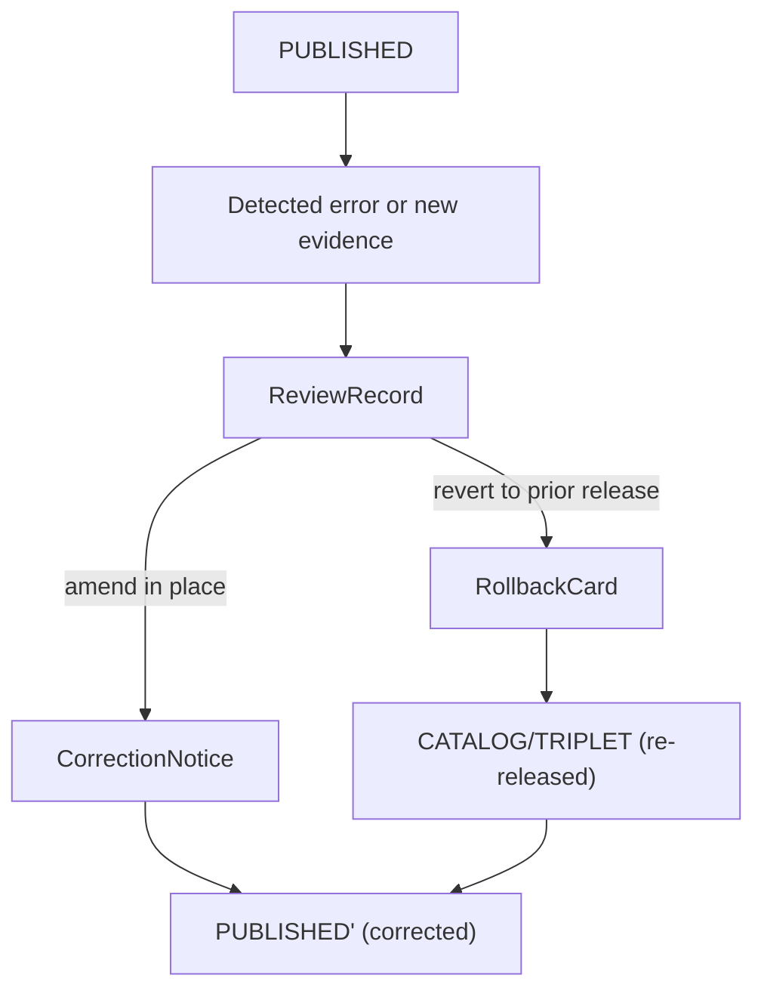

<!-- [KFM_META_BLOCK_V2]
doc_id: kfm://doc/people-dna-land/data-lifecycle
title: People/DNA/Land — Data Lifecycle
type: standard
version: v1
status: draft
owners: [TODO: domain steward — People/DNA/Land]
created: 2026-05-18
updated: 2026-05-18
policy_label: public
related:
  - docs/doctrine/lifecycle-law.md
  - docs/doctrine/trust-membrane.md
  - docs/doctrine/directory-rules.md
  - docs/domains/people-dna-land/README.md
  - docs/standards/PROV.md
  - schemas/contracts/v1/domains/people-dna-land/
  - policy/domains/people-dna-land/
tags: [kfm, lifecycle, people, dna, land, genealogy, governance, sensitivity]
notes:
  - Sensitivity posture (living-person/DNA deny-by-default) is doctrine-confirmed; implementation paths are PROPOSED.
  - Verify against mounted repo, ADRs, and policy bundles before treating any path or gate name as canonical.
[/KFM_META_BLOCK_V2] -->

# People/DNA/Land — Data Lifecycle

> Governed lifecycle reference for the **People / Genealogy / DNA / Land Ownership** domain — how source material moves from intake to release under KFM's deny-by-default posture for living-person, DNA, and land-title claims.

[](#)
[](./README.md)
[](../../doctrine/lifecycle-law.md)
[](#sensitivity-tiers-and-domain-invariants)
[](#sensitivity-tiers-and-domain-invariants)
[](#sensitivity-tiers-and-domain-invariants)
[](#)
[](#)

| Status | Owners | Last updated |
|---|---|---|
| draft | TODO — People/DNA/Land domain steward + policy admin | 2026-05-18 |

> [!IMPORTANT]
> **Living-person, DNA, genomic, and DNA-derived relationship or identity outputs are denied or restricted by default.** Raw kit/vendor IDs and DNA segments are never public artifacts. Assessor/tax records are not title truth. Parcel geometry is not title-boundary proof. These invariants hold at every lifecycle phase and are gate-enforced, not advisory.

---

## Quick links

- [1. Purpose and scope](#1-purpose-and-scope)
- [2. Repo fit and path map](#2-repo-fit-and-path-map)
- [3. Lifecycle overview](#3-lifecycle-overview)
- [4. Stage-by-stage handling](#4-stage-by-stage-handling)
- [5. Promotion gates (A–G) for this domain](#5-promotion-gates-ag-for-this-domain)
- [6. Sensitivity tiers and domain invariants](#6-sensitivity-tiers-and-domain-invariants)
- [7. Source families and source roles](#7-source-families-and-source-roles)
- [8. Object families and identity rules](#8-object-families-and-identity-rules)
- [9. Required receipts per phase](#9-required-receipts-per-phase)
- [10. Cross-lane handoff](#10-cross-lane-handoff)
- [11. Failure-closed scenarios](#11-failure-closed-scenarios)
- [12. Validators, tests, and fixtures](#12-validators-tests-and-fixtures)
- [13. Correction, rollback, and stale state](#13-correction-rollback-and-stale-state)
- [14. Open questions and verification backlog](#14-open-questions-and-verification-backlog)
- [15. Related docs](#15-related-docs)

---

## 1. Purpose and scope

**CONFIRMED doctrine / PROPOSED implementation.** This document specifies how KFM's lifecycle invariant — `RAW → WORK / QUARANTINE → PROCESSED → CATALOG / TRIPLET → PUBLISHED` — is applied inside the People/DNA/Land domain. It is the operational counterpart to the doctrinal lifecycle law and the domain-specific instance of the gate matrix.

**In scope.** Intake, normalization, validation, catalog closure, release, correction, and rollback for: person assertions, name assertions, life/residence/migration events, genealogy relationships, family groups, DNA match evidence, DNA segments, land instruments (patents, deeds, mortgages, liens, easements, leases, mineral, water, access, probate), assessor and tax-roll records, parcel geometry versions, and ownership intervals.

**Out of scope.**

- **Settlements** owns legal status and infrastructure status (cemeteries, schools, courts, county/township legal boundaries).
- **Roads/Rail** owns route/corridor semantics for movement.
- **Archaeology** owns site and cultural-context handling, including burial-site geoprivacy.
- **Agriculture** owns farm and land-use claims that are not ownership assertions.

This domain interacts with all four (see [§10](#10-cross-lane-handoff)) but does not absorb their authority.

[↑ Back to top](#peopledna-land--data-lifecycle)

---

## 2. Repo fit and path map

> [!NOTE]
> Per Directory Rules §12 (Domain Placement Law), the domain name is a **segment** inside each responsibility root, never a root folder. All paths below are **PROPOSED** until verified against a mounted repository.

```text
docs/domains/people-dna-land/
├── README.md                       # domain orientation (separate doc)
├── DATA_LIFECYCLE.md               # this file
├── SENSITIVITY.md                  # PROPOSED — sensitivity tier rules
└── SOURCE_FAMILIES.md              # PROPOSED — source-role detail

contracts/domains/people-dna-land/  # object meaning (Markdown)
schemas/contracts/v1/domains/people-dna-land/   # machine shape (JSON Schema)
policy/domains/people-dna-land/                 # OPA bundles, sensitivity, rights
tests/domains/people-dna-land/                  # enforcement proof
fixtures/domains/people-dna-land/               # valid / invalid samples
pipelines/domains/people-dna-land/              # executable pipeline logic
pipeline_specs/people-dna-land/                 # declarative pipeline config

data/raw/people-dna-land/<source_id>/<run_id>/
data/work/people-dna-land/<run_id>/
data/quarantine/people-dna-land/<reason>/<run_id>/
data/processed/people-dna-land/<dataset_id>/<version>/
data/catalog/domain/people-dna-land/
data/published/layers/people-dna-land/          # public-safe layers only
data/registry/sources/people-dna-land/
release/candidates/people-dna-land/
```

**Compatibility note (PROPOSED).** No People/DNA/Land compatibility roots are expected outside the canonical layout. Any prior root-level `people/`, `genealogy/`, `dna/`, or `land/` folder is a Directory Rules §13.4 anti-pattern and migrates per §14.2.

[↑ Back to top](#peopledna-land--data-lifecycle)

---

## 3. Lifecycle overview

**CONFIRMED doctrine.** Promotion is a **governed state transition**, not a file move. A path-level move that bypasses validators, policy gates, evidence-bundle creation, catalog closure, and release-decision recording is a violation of the invariant regardless of which directory the bytes ended up in. [DIRRULES]

```mermaid
flowchart LR
    subgraph "Pre-RAW (PROPOSED admission edge)"
        E[event_envelope]
        P[prefilter_output]
        R[event_run_receipt]
        E --> P --> R
    end

    R --> A[RAW]
    A -->|normalize / classify| B[WORK]
    A -->|defect detected| Q[QUARANTINE]
    Q -.->|correction| B
    B -->|validation + redaction pass| C[PROCESSED]
    C -->|evidence + catalog closure| D[CATALOG / TRIPLET]
    D -->|release decision + review| F[PUBLISHED]

    F -.->|correction| F2[PUBLISHED']
    F -.->|rollback| D

    classDef high fill:#fce4e4,stroke:#c0392b,color:#2b2b2b
    classDef med fill:#fff3cd,stroke:#a07a00,color:#2b2b2b
    classDef pub fill:#e0f0e0,stroke:#2d8f4e,color:#2b2b2b
    class A,Q high
    class B,C med
    class D,F,F2 pub
```



Reading note: every transition requires the artifacts named in [§4](#4-stage-by-stage-handling) and [§9](#9-required-receipts-per-phase). Transitions without those artifacts **fail closed**.

[↑ Back to top](#peopledna-land--data-lifecycle)

---

## 4. Stage-by-stage handling

The table below summarizes how each lifecycle phase handles People/DNA/Land material. Detailed receipt requirements are in [§9](#9-required-receipts-per-phase); detailed gate logic is in [§5](#5-promotion-gates-ag-for-this-domain).

| Stage | Handling | Entry gate | Stage status |
|---|---|---|---|
| **RAW** | Capture immutable source payload or reference under source identity (vital, cemetery, obituary, census, GEDCOM/GEDZip, DNA vendor match CSV, patent/deed/mortgage instruments, assessor rolls, plat/PLSS geometry) with source role, rights, sensitivity, citation, time, and content hash. Never a public surface. | `SourceDescriptor` exists; rights and sensitivity provisionally tagged. | PROPOSED |
| **WORK** | Normalize schema, geometry, time, identity, evidence, rights, and policy. Resolve provisional person/name assertions. Hold any defects in QUARANTINE rather than promoting silently. | `TransformReceipt`; `ValidationReport` (working set); `PolicyDecision`. | PROPOSED |
| **QUARANTINE** | Hold material with rights, sensitivity, validation, source-role, evidence, temporal, or policy defects until corrected. Quarantine reason is recorded; nothing silently promotes. | Recorded `quarantine_reason` and review pointer. | PROPOSED |
| **PROCESSED** | Emit validated normalized objects, receipts, and public-safe candidates. Living-person and DNA-derived material remains classified per [§6](#6-sensitivity-tiers-and-domain-invariants). | `ValidationReport` pass; `RedactionReceipt` where sensitivity applies; `AggregationReceipt` where applies. | PROPOSED |
| **CATALOG / TRIPLET** | Emit catalog records (STAC/DCAT/PROV/domain), `EvidenceBundles`, graph/triplet projections, and release candidates. Graph projections must pass safety tests (no living-person re-identification, no DNA leakage). | `CatalogMatrix` entry; `EvidenceBundle`; graph projection safety. | PROPOSED |
| **PUBLISHED** | Serve released, public-safe artifacts through governed APIs and manifests only. Direct public reads of RAW/WORK/QUARANTINE/PROCESSED are forbidden by the trust membrane. | `ReleaseManifest`; rollback target; correction path; `ReviewRecord` where required. | PROPOSED |

> [!CAUTION]
> A **path-level move** from `data/raw/` directly to `data/published/` is a Directory Rules §13.5 "Lifecycle skip" anti-pattern and is invalid regardless of how clean the source looked. Promotion only happens through the gates.

[↑ Back to top](#peopledna-land--data-lifecycle)

---

## 5. Promotion gates (A–G) for this domain

**CONFIRMED doctrine.** KFM enforces a seven-gate matrix between authoring and publication: (A) Structure and Metadata, (B) Schemas and Contracts, (C) Policy Parity, (D) Security and Sensitivity, (E) Data Quality, (F) Provenance and Lineage, and (G) Reviewability with two-key approval. The table below specifies what each gate checks for People/DNA/Land. [Pass-10 §C5-01]

| Gate | Generic intent | People/DNA/Land specifics (PROPOSED) | Fail-closed effect |
|---|---|---|---|
| **A — Structure & Metadata** | KFM Meta Block, doc/file zones, naming. | `SourceDescriptor` and dataset metadata reference one of the recognized People/DNA/Land source roles (`authority`, `observation`, `context`, `model`). No bare GEDCOM dumps. | Hold at WORK; missing-metadata reason. |
| **B — Schemas & Contracts** | Object shape validates against canonical schema. | Validates against `schemas/contracts/v1/domains/people-dna-land/*.schema.json` (PROPOSED) including `PersonAssertion`, `GenealogyRelationship`, `LandOwnershipAssertion`, `DNAMatchEvidence`, `ConsentReceipt`. | Hold at WORK; schema-diff reason. |
| **C — Policy Parity** | Same OPA bundle pinned in CI and runtime. | Living-person / DNA / consent / steward-review / assessor-as-title / sensitive-join policies evaluate identically in Conftest and at runtime. | Block promotion; parity-diff reason. |
| **D — Security & Sensitivity** | Sensitivity scans, license check, raw-ID gates. | Deny if any of: living-person not screened, DNA segment in public-bound payload, raw vendor kit ID in any non-RAW artifact, unresolved consent, expired consent, revoked consent. | Hard fail; route to QUARANTINE or steward queue. |
| **E — Data Quality** | DQ profiler thresholds, completeness, conflict detection. | Identity resolution confidence at or above threshold; source-role conflict resolved; temporal validity coherent (source/observed/valid/retrieval/release/correction times distinct where material). | Hold at PROCESSED; structured FAIL. |
| **F — Provenance & Lineage** | `EvidenceRef` resolves to `EvidenceBundle`; receipts present; canonical hash matches. | Every published claim resolves: claim → `EvidenceRef` → `EvidenceBundle` containing source descriptors, citations, receipts, `PolicyDecision`, review state, release state. Chain-of-title timelines must show gaps explicitly. | Hold at CATALOG; unresolved-evidence reason. |
| **G — Reviewability** | Two-key approval; separation of release authority from author. | For sensitive lanes (any tier ≥ T2): domain steward **and** release authority approve. Living-person and DNA review require named reviewer authority with valid scope. | Hold at CATALOG; missing-review reason. |

> [!IMPORTANT]
> Gate **D** for this domain is strictly additive with Gate **C**: sensitivity-class checks run even when policy parity passes. A failure in either is sufficient to deny promotion.

[↑ Back to top](#peopledna-land--data-lifecycle)

---

## 6. Sensitivity tiers and domain invariants

**CONFIRMED domain invariants** ([DOM-PEOPLE] [ENCY] [UNIFIED]):

1. **Living-person output and DNA-derived outputs are denied or restricted by default.**
2. **Raw kit/vendor IDs and DNA segments are not public.**
3. **Assessor/tax records are not title truth.**
4. **Parcel geometry is not title-boundary proof** without source role and evidence.
5. **Relationship hypotheses remain hypotheses**, not canonical assertions, until evidence and review support promotion.
6. **Person assertions are separate from canonical person records.** Conflation is a data-corruption risk.

### 6.1 Tier scheme (PROPOSED, aligned to Atlas T0–T4)

The People/DNA/Land lane uses the same T0–T4 scheme described in the Domains Culmination Atlas. A tier upgrade (toward more public) requires both a transform receipt and a review record; a tier downgrade (toward less public) needs only a correction notice.

| Tier | Description | Typical People/DNA/Land content | Public exposure |
|---|---|---|---|
| **T0** | Released public-safe artifact | Historical-person profile, residence/event timeline (deceased), chain-of-title summary with documented gaps | Public, governed-API only |
| **T1** | Redacted public-safe | Generalized residence point, name-only obituary excerpt, parcel context with explicit "not title proof" badge | Public, governed-API; transform receipt |
| **T2** | Restricted aggregate | County-aggregate genealogy counts, anonymized migration aggregates | Researcher access; staged |
| **T3** | Steward review only | Specific living-person assertion under research authority; DNA review materials | Steward role; no public surface |
| **T4** | Sealed / denied | Raw DNA segments, kit IDs, unresolved-consent records, sealed records (adoption, sealed court) | None until tier change |

> [!WARNING]
> The tier of a record is set by its source role, sensitivity flags, and consent state — **never by its directory path**. Putting a DNA segment into `data/published/` is not how it becomes public; it never becomes public.

### 6.2 Doctrinal "shall-not" list for this domain

- A pipeline **shall not** read RAW/WORK/QUARANTINE directly from any public artifact path.
- An export **shall not** include raw GEDCOM identifiers, vendor kit IDs, or DNA segment endpoints in public-safe payloads.
- A graph projection **shall not** expose stable cross-correlatable identifiers for living persons, genomic subjects, or sealed records (use opaque holder references, pairwise DIDs, or blinded indexes — see New Ideas 5-8 *Separate Consent From Identity*).
- A connector **shall not** publish; connectors emit to `data/raw/` or `data/quarantine/` only.
- A watcher **shall not** publish; watchers emit receipts and candidate decisions only.

[↑ Back to top](#peopledna-land--data-lifecycle)

---

## 7. Source families and source roles

**CONFIRMED / PROPOSED.** The table below lists recognized People/DNA/Land source families and the source roles each can validly carry. Source-role assignment is governed; an assessor record cannot become an `authority` role for title truth. [DOM-PEOPLE] [ENCY]

| Source family | Valid source roles | Default rights / sensitivity | Cadence |
|---|---|---|---|
| Vital records (birth/death) | `authority`, `observation` | Rights NEEDS VERIFICATION per jurisdiction; living-person fields sensitive | Source-vintage |
| Cemetery / burial / obituary | `observation`, `context` | Public-safe for deceased; burial site geoprivacy may apply (cross-ref Archaeology) | Source-vintage |
| Church / school / military / court / probate | `authority`, `observation`, `context` | Rights NEEDS VERIFICATION; sealed-record handling required | Source-vintage |
| Census / city directory | `observation`, `context` | Generally public after release window; living-person derivation restricted | Decadal / annual |
| GEDCOM / GEDZip / tree overlays | `observation`, `model` | Hypotheses by default; never an `authority` role | Per submission |
| DNA vendor match CSV / segment / triangulation | `observation`, `model` | T3/T4 by default; consent required; raw IDs never public | Per kit / event |
| Patent / deed / mortgage / lien / easement / lease / mineral / water / access / probate instruments | `authority` (for the instrument itself), `observation` (for derived ownership claims) | Generally public; chain-of-title closure must be evidenced | Source-vintage |
| Assessor / tax roll | `observation`, `context` | **Never `authority` for title**; rights vary | Annual / cyclical |
| Plat / survey / metes & bounds / PLSS / subdivision / derived geometry | `authority` (for the survey), `observation` (for parcel-version geometry) | Public-safe for historical; living-owner privacy applies | Per survey / amendment |

> [!CAUTION]
> **Assessor-as-title denial.** Any `LandOwnershipAssertion` whose only supporting evidence is an `AssessorRecord` or `TaxRecord` is denied as authoritative ownership claim. It may be retained as `observation` with explicit "not title proof" qualification. [DOM-PEOPLE]

[↑ Back to top](#peopledna-land--data-lifecycle)

---

## 8. Object families and identity rules

**CONFIRMED** that times stay distinct: source, observed, valid, retrieval, release, and correction times each carry independent semantics. **PROPOSED** that the deterministic identity basis is `source_id + object_role + temporal_scope + normalized_digest`. [DOM-PEOPLE] [ENCY]

<details>
<summary><strong>Full object family table (click to expand)</strong></summary>

| Object | Purpose | Identity rule (PROPOSED) | Typical tier |
|---|---|---|---|
| `PersonAssertion` | Source-bound claim about a person | source_id + role + temporal_scope + digest | T0 (deceased) / T3 (living) |
| `PersonCanonical` | Resolved canonical person (post-review) | resolved IRI; tracks contributing assertions | T0 (deceased) / T3 (living) |
| `NameAssertion` | Source-bound name spelling/variant | source_id + role + temporal_scope + digest | T0 / T1 |
| `LifeEvent` | Birth, baptism, marriage, death, etc. | source_id + role + temporal_scope + digest | T0–T3 by content |
| `ResidenceEvent` | Place of residence at a time | source_id + role + temporal_scope + digest | T0–T1 |
| `MigrationEvent` | Movement between places | source_id + role + temporal_scope + digest | T0–T1 |
| `GenealogyRelationship` | Parent/child/spouse/sibling assertion | source_id + role + temporal_scope + digest | T0–T3 |
| `FamilyGroup` | Aggregated kin group | derived from resolved relationships | T0–T3 |
| `RelationshipHypothesis` | Scored hypothesis, not canonical | hypothesis_id + evidence_refs | T2–T3 |
| `DNAMatchEvidence` | Vendor match record | source_id + opaque kit reference | T3–T4 |
| `DNASegment` | Raw segment data | source_id + opaque reference | T4 |
| `LandOwnershipAssertion` | Ownership claim across an interval | source_id + role + temporal_scope + digest | T0–T1 |
| `DeedInstrument` | Recorded deed | source_id + instrument_id + digest | T0 |
| `TitleInstrument` | Title-conveying instrument | source_id + instrument_id + digest | T0 |
| `AssessorRecord` | Assessor roll entry | source_id + role + temporal_scope + digest | T0 (with caveat) |
| `TaxRecord` | Tax roll entry | source_id + role + temporal_scope + digest | T0 (with caveat) |
| `ParcelVersion` | Geometry version | source_id + parcel_id + version | T0 |
| `OwnershipInterval` | Time-bounded ownership | derived; pointers to instruments | T0–T1 |
| `ReviewRecord` | Steward review evidence | review_id; signed; scope-bounded | per-record |
| `ConsentReceipt` (PROPOSED) | Subject consent envelope | DSSE-signed; status-list ref | per-subject |

</details>

> [!NOTE]
> `LegalDescription` and `LandInstrument` are CONFIRMED domain terms whose field realization is PROPOSED. Their meaning is constrained by source role, evidence, time, and release state. [DOM-PEOPLE]

[↑ Back to top](#peopledna-land--data-lifecycle)

---

## 9. Required receipts per phase

**CONFIRMED doctrine** that receipts are governance memory; receipts created earlier remain referenced (not duplicated) at later phases via `EvidenceRef`. The table below shows the normally-emitted phase for each receipt class in People/DNA/Land. [Atlas §24.2.2]

| Receipt | RAW | WORK / QUAR. | PROCESSED | CATALOG / TRIPLET | PUBLISHED |
|---|:-:|:-:|:-:|:-:|:-:|
| `SourceDescriptor` | • | • | • | • | • |
| `TransformReceipt` |  | • | • | • |  |
| `RedactionReceipt` |  | • | • | • |  |
| `AggregationReceipt` |  | • | • | • |  |
| `ConsentReceipt` (PROPOSED) | • | • | • | • | pointer-only |
| `ValidationReport` |  | • | • |  |  |
| `EvidenceBundle` |  |  | • | • | (referenced) |
| `PolicyDecision` | • | • | • | • | • |
| `ReviewRecord` |  | • | • | • |  |
| `ReleaseManifest` |  |  |  | • | • |
| `CorrectionNotice` |  |  |  |  | • |
| `RollbackCard` |  |  |  |  | • |
| `AIReceipt` |  |  |  |  | • (Focus Mode only) |
| `RealityBoundaryNote` |  |  | • | • | • |

> [!TIP]
> Living-person and DNA workflows additionally require a `ConsentReceipt` (PROPOSED) that resolves on every dereference. Revocation reachability is a Gate-D check, not a side concern. See New Ideas 5-8 *Consent Gate Flow* for the verification flow.

[↑ Back to top](#peopledna-land--data-lifecycle)

---

## 10. Cross-lane handoff

**CONFIRMED / PROPOSED.** Relations to other domains must preserve ownership, source role, sensitivity, and `EvidenceBundle` support. [DOM-PEOPLE]

| This domain | Related lane | Relation type | Required preservation |
|---|---|---|---|
| People/DNA/Land | Settlements | Residence, cemetery, school, court, county/township, place relations | Source role; legal vs. observational distinction stays with Settlements |
| People/DNA/Land | Roads/Rail | Migration, access, movement | Route/corridor semantics remain Roads/Rail authority |
| People/DNA/Land | Archaeology | Historic person, land, documentary, cultural-place context | Cultural sensitivity, burial geoprivacy, steward review |
| People/DNA/Land | Agriculture | Farm, land use, producer-adjacent context | Privacy of producer/operator data |

> [!IMPORTANT]
> A cross-lane relation **never** elevates a sensitive People/DNA/Land claim. If a Settlements feature requires a person identifier, the person reference is opaque, with sensitivity governed by this lane.

[↑ Back to top](#peopledna-land--data-lifecycle)

---

## 11. Failure-closed scenarios

These are the conditions under which People/DNA/Land material **does not** proceed. Each is a fail-closed gate.

| # | Condition | Outcome | Where caught |
|---|---|---|---|
| F-01 | `SourceDescriptor` missing or rights `UNKNOWN`/`NOASSERTION` | `DENY` admission | Pre-RAW / RAW |
| F-02 | GEDCOM upload lacks living-person screening | `QUARANTINE` | RAW → WORK |
| F-03 | DNA vendor file lacks `ConsentReceipt` or consent revoked | `DENY` | RAW → WORK |
| F-04 | Raw kit/vendor ID appears in any non-RAW artifact | `DENY` + steward incident | WORK / PROCESSED |
| F-05 | `LandOwnershipAssertion` supported only by `AssessorRecord` and labeled `authority` | `DENY` | WORK / PROCESSED |
| F-06 | Chain-of-title has unevidenced gap, but record claims completeness | `DENY` | PROCESSED |
| F-07 | Parcel geometry presented as title-boundary proof without survey source role | `DENY` | PROCESSED / CATALOG |
| F-08 | `EvidenceRef` does not resolve to a complete `EvidenceBundle` | `ABSTAIN` (Focus Mode) / `DENY` (release) | CATALOG / Runtime |
| F-09 | Graph projection contains stable identifier for living-person or genomic subject | `DENY` + projection rebuild | CATALOG / TRIPLET |
| F-10 | Release request without `ReviewRecord` (sensitive tier) or with same author and releaser | `DENY` | CATALOG → PUBLISHED |
| F-11 | Published artifact downstream of stale source (source head changed) | `ABSTAIN` + stale-state badge | Runtime |
| F-12 | Correction-only request lacking `CorrectionNotice` and `invalidates[]` derivative list | `DENY` | PUBLISHED → PUBLISHED' |

[↑ Back to top](#peopledna-land--data-lifecycle)

---

## 12. Validators, tests, and fixtures

**PROPOSED test set** — each item is a Gate-anchored validator family. Test path is `tests/domains/people-dna-land/...` (PROPOSED). [DOM-PEOPLE]

- Person assertion evidence tests (PROPOSED)
- GEDCOM import rights/living-flag tests (PROPOSED)
- DNA consent and raw-ID no-log tests (PROPOSED)
- Consent revocation cleanup tests (PROPOSED)
- Legal-description and chain-of-title gap tests (PROPOSED)
- Assessor-as-title denial tests (PROPOSED)
- Graph projection safety tests (PROPOSED)
- UI/API restricted-field no-leak tests (PROPOSED)

### 12.1 Recommended negative fixtures (PROPOSED)

| Fixture | Expected outcome |
|---|---|
| `gedcom_with_living_person_no_screen.ged` | `DENY` / `QUARANTINE` |
| `dna_match_no_consent_receipt.csv` | `DENY` |
| `ownership_assertion_assessor_only.json` | `DENY` |
| `parcel_as_title_proof.json` | `DENY` |
| `published_payload_with_raw_kit_id.json` | `DENY` |
| `graph_export_living_person_stable_id.json` | `DENY` |
| `release_without_review_record.json` | `DENY` |
| `chain_of_title_unevidenced_gap.json` | `DENY` |
| `evidence_ref_unresolved.json` | `ABSTAIN` (Focus Mode) / `DENY` (release) |

> [!NOTE]
> Negative fixtures are the canonical proof that doctrine is enforceable. Per the Idea Index, fail-closed governance is structurally bedrock — the absence of evidence blocks promotion.

[↑ Back to top](#peopledna-land--data-lifecycle)

---

## 13. Correction, rollback, and stale state

**CONFIRMED doctrine.** Publication is a governed state, not a terminal one. Correction and rollback are first-class operations. [Atlas §24]



| Operation | Required artifacts | Effect on derivatives |
|---|---|---|
| **Correction** (in place) | `CorrectionNotice` with `claim_ref`, `prior_release_ref`, `change_summary`, `invalidates[]`, `review_ref`, time | Listed derivatives marked invalid; downstream caches purged |
| **Rollback** (to prior release) | `RollbackCard` with `release_id`, `rollback_to`, `reason`, `invalidates[]`, `review_ref`, time | Current release pointer returns to prior; rollback drill records confirm reachability |
| **Tier downgrade** (any → T4) | `CorrectionNotice` + `ReviewRecord` | Always permitted; precedes derivative invalidation; correction alone is sufficient |

> [!WARNING]
> A correction that **adds** information that should not have been public (e.g., late discovery that a person was living, or a record was sealed) requires immediate tier downgrade plus derivative invalidation, not a softer in-place edit.

[↑ Back to top](#peopledna-land--data-lifecycle)

---

## 14. Open questions and verification backlog

NEEDS VERIFICATION — settled by mounted repo evidence (schemas, registry entries, policy bundles, tests, logs, release manifests) or by ADR.

| Item | Evidence that would settle it | Status |
|---|---|---|
| Living-person policy specifics (jurisdiction-aware) | `policy/domains/people-dna-land/living_person.rego` + fixtures + ADR | NEEDS VERIFICATION |
| DNA consent / revocation enforcement (status list reachability) | Consent schema + revocation list + runtime verifier + fail-closed test | NEEDS VERIFICATION |
| Land instrument chain logic (gap detection) | Validator + fixtures (valid chain, gap, conflicting deeds) | NEEDS VERIFICATION |
| Geometry-role boundary logic (survey vs. assessor vs. parcel-derived) | Validator + fixture matrix | NEEDS VERIFICATION |
| UI/API restricted-field no-leak behavior | E2E test + payload audit | NEEDS VERIFICATION |
| Receipt schema home: `schemas/contracts/v1/receipts/` vs. `schemas/contracts/v1/<domain>/receipts/` | ADR (Atlas open-ADR backlog ADR-S-03) | OPEN |
| Source-role enum stability for this domain | ADR (Atlas open-ADR backlog ADR-S-04) | OPEN |
| Whether `ConsentReceipt` is People/DNA/Land-local or repo-wide | ADR | OPEN |
| Whether `RelationshipHypothesis` and `PersonCanonical` are separable post-resolution | Schema + resolver design + ADR | OPEN |

[↑ Back to top](#peopledna-land--data-lifecycle)

---

## 15. Related docs

- `docs/doctrine/lifecycle-law.md` — CONFIRMED lifecycle invariant
- `docs/doctrine/trust-membrane.md` — public surfaces consume governed APIs only
- `docs/doctrine/directory-rules.md` — Domain Placement Law (§12)
- `docs/domains/people-dna-land/README.md` — domain orientation (TODO — separate doc)
- `docs/domains/people-dna-land/SENSITIVITY.md` — sensitivity tier rules (PROPOSED)
- `docs/domains/people-dna-land/SOURCE_FAMILIES.md` — source-role detail (PROPOSED)
- `docs/standards/PROV.md` — provenance crosswalk
- `docs/runbooks/people-dna-land/SOURCE_REFRESH_RUNBOOK.md` — runbook (TODO)
- `schemas/contracts/v1/domains/people-dna-land/` — machine schemas (PROPOSED)
- `policy/domains/people-dna-land/` — OPA bundles (PROPOSED)
- `tests/domains/people-dna-land/` — enforcement proof (PROPOSED)

---

<sub>**Last updated:** 2026-05-18 · **Status:** draft · **Owners:** TODO (domain steward) · [↑ Back to top](#peopledna-land--data-lifecycle)</sub>
