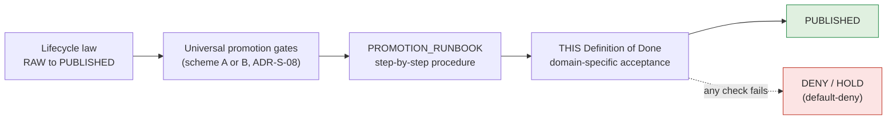

<!-- [KFM_META_BLOCK_V2]
doc_id: kfm://doc/people-dna-land/definition-of-done
title: People / Genealogy / DNA / Land — Definition of Done
type: standard
version: v1
status: draft
owners: [TODO: domain steward — People/Genealogy/DNA/Land; TODO: release authority; TODO: sensitivity reviewer; TODO: rights-holder rep; TODO: docs steward]
created: 2026-06-07
updated: 2026-06-07
policy_label: public
related:
  - docs/domains/people-dna-land/DATA_LIFECYCLE.md
  - docs/runbooks/people-dna-land/PROMOTION_RUNBOOK.md
  - docs/doctrine/lifecycle-law.md
  - docs/doctrine/trust-membrane.md
  - docs/doctrine/directory-rules.md            # Directory Rules v1.3
  - ai-build-operating-contract.md              # CONTRACT_VERSION = "3.0.0"
  - schemas/contracts/v1/people/                # PROPOSED canonical schema slug per Atlas §24.13
  - policy/sensitivity/people/
  - policy/consent/people/
tags: [kfm, definition-of-done, people, genealogy, dna, land, promotion, governance, sensitivity, consent]
notes:
  - CONTRACT_VERSION = "3.0.0" pinned per ai-build-operating-contract.md v3.0.
  - Definition of Done is PROPOSED doctrine (Pass-10 C14-05); the corpus names the need but does not enumerate per-domain checklists. This is the People-lane enumeration.
  - DoD gates promotion from CATALOG to PUBLISHED; it does not replace the lifecycle gates, it composes them.
  - SLUG CONFLICT (OQ-PEOPLE-SLUG-01) and GATE-LETTER CONFLICT (OQ-PEOPLE-GATE-01 / ADR-S-08) inherited from DATA_LIFECYCLE.md; checklist is written scheme-neutral.
  - Consent terms are ConsentGrant + RevocationReceipt (Atlas ubiquitous language); not ConsentReceipt.
  - Verify against mounted repo, ADRs, CI workflows, and policy bundles before treating any path, gate letter, schema, or CI check name as canonical.
[/KFM_META_BLOCK_V2] -->

# People / Genealogy / DNA / Land — Definition of Done

> The per-domain promotion-readiness contract. A People/DNA/Land artifact is **done** — eligible to move from `CATALOG / TRIPLET` to `PUBLISHED` — only when every check below is satisfiable and recorded. Absence of evidence is a `DENY`, not a pass.

[-a07a00)](#1-purpose-and-status)

|Status|Owners                                                                                             |Last updated|
|------|---------------------------------------------------------------------------------------------------|------------|
|draft |TODO — domain steward + release authority + sensitivity reviewer + rights-holder rep + docs steward|2026-06-07  |

> [!IMPORTANT]
> This Definition of Done **composes** the universal promotion gates and the lifecycle law; it does not weaken them. Where a shared envelope (run receipt, gate matrix, evidence closure) already applies repo-wide, this doc adds only the **domain-specific** checks that the corpus says differ per domain — living-person screening, DNA `ConsentGrant` verification, assessor-as-title denial, chain-of-title gap discipline, and graph-projection safety. [Pass-10 C14-05] [DOM-PEOPLE]

> [!CAUTION]
> **Sensitive domain.** This lane spans five §23.2 categories (living people, genealogy, DNA/genomic, private land, ownership). The **most restrictive applicable row** governs any object. This checklist names governance conditions only; it MUST NOT carry living-person identifiers, raw `DNAKitToken`s, DNA segment endpoints, or precise person-parcel joins. Disposition defers to operating contract §23.2.

-----

## Quick links

- [1. Purpose and status](#1-purpose-and-status)
- [2. How this DoD composes other gates](#2-how-this-dod-composes-other-gates)
- [3. The checklist](#3-the-checklist)
- [4. Required receipts and their evidence shape](#4-required-receipts-and-their-evidence-shape)
- [5. Sensitivity gate detail](#5-sensitivity-gate-detail)
- [6. Separation-of-duties requirements](#6-separation-of-duties-requirements)
- [7. Failure reason codes](#7-failure-reason-codes)
- [8. Worked acceptance walkthrough](#8-worked-acceptance-walkthrough)
- [9. CI wiring (PROPOSED)](#9-ci-wiring-proposed)
- [10. Open questions register](#10-open-questions-register)
- [11. Open verification backlog](#11-open-verification-backlog)
- [12. Changelog](#12-changelog)
- [13. Definition of done for this document](#13-definition-of-done-for-this-document)
- [14. Related docs](#14-related-docs)

-----

## 1. Purpose and status

**CONFIRMED need / PROPOSED enumeration.** The KFM corpus establishes the Definition of Done as a **per-domain checklist of receipts, schemas, gates, and tests that must be satisfied before a domain artifact can be promoted from `CATALOG` to `PUBLISHED`**, so that promotion is a documented event rather than a tacit judgment. The corpus marks the *concept* `CONFIRMED` but the *per-domain checklists* `PROPOSED` because it names the need without enumerating them. This document is the People/Genealogy/DNA/Land enumeration. [Pass-10 C14-05]

**Why per-domain.** The shared envelope (run receipt, the universal gate matrix) applies to every domain; the domain-specific checks differ. The corpus explicitly cites genealogical records as needing consent verification that other domains do not. This lane therefore carries the heaviest sensitivity and consent obligations of any KFM domain. [Pass-10 C14-05] [DOM-PEOPLE]

**Scope of “artifact.”** A People/DNA/Land artifact is any released object family from the domain dossier — `Person Assertion`, `PersonCanonical`, `NameAssertion`, `LifeEvent`, `Residence Event`, `Migration Event`, `Genealogy Relationship` / `RelationshipAssertion`, `FamilyGroup`, `Relationship Hypothesis`, `DNA Match Evidence`, `Land Ownership Assertion`, `Deed Instrument`, `Title Instrument`, `LandInstrument`, `LegalDescription`, `Assessor Record`, `TaxRecord`, `LandParcel` / `Parcel Version`, `Ownership Interval` — plus any layer, Evidence Drawer payload, or graph projection derived from them. [DOM-PEOPLE]

[↑ Back to top](#quick-links)

-----

## 2. How this DoD composes other gates

This checklist is the **final acceptance layer**. Earlier governance has already run by the time an artifact reaches it.

|Layer                 |Owns                                                                               |This DoD’s relationship                                  |
|----------------------|-----------------------------------------------------------------------------------|---------------------------------------------------------|
|`lifecycle-law.md`    |The invariant `RAW → WORK / QUARANTINE → PROCESSED → CATALOG / TRIPLET → PUBLISHED`|DoD presupposes it; runs at the final transition         |
|Universal gate matrix |The seven-gate sequence and required evidence                                      |DoD references it scheme-neutrally; does not re-letter it|
|`DATA_LIFECYCLE.md`   |Domain stage handling, tiers, receipts, failure-closed scenarios                   |DoD is the acceptance checklist that doc’s gates imply   |
|`PROMOTION_RUNBOOK.md`|The operator procedure for executing promotion                                     |DoD is the pass/fail contract the runbook checks against |

> [!NOTE]
> **Gate-letter conflict inherited.** Two A–G gate matrices exist in the corpus (Pass-10 C5-01 vs Build-Manual §6.2 / Unified §8); a canonical lettering is pending ADR-S-08. This checklist is written against gate **intent**, so it survives whichever lettering is ratified. [Pass-10 C5-01] [BUILD-MANUAL §6.2] [`OQ-PEOPLE-GATE-01`]

[↑ Back to top](#quick-links)

-----

## 3. The checklist

**Default-deny.** Every box must be checkable `YES` with a recorded artifact. A box that cannot be evidenced is a `DENY`, not a deferred concern. Boxes are grouped by gate intent; status of each check is `PROPOSED` for this lane until repo-verified. [Pass-10 C5-02] [DOM-PEOPLE]

### 3.1 Identity, structure, and metadata

- [ ] KFM Meta Block v2 present and zone-correct.
- [ ] `SourceDescriptor` exists and names a recognized source role (`authority` / `observation` / `context` / `model`); no bare GEDCOM dump.
- [ ] Deterministic identity recorded (PROPOSED basis: `source_id + object_role + temporal_scope + normalized_digest`).
- [ ] `Person Assertion` is kept distinct from `PersonCanonical`; no conflation (DDD identity discipline — mistaken identity corrupts data).

### 3.2 Rights and terms

- [ ] License / terms / contact / attribution obligations resolved; not `RIGHTS_UNKNOWN` / `NOASSERTION`.
- [ ] DNA-source vendor terms current and permit the intended use.
- [ ] No `sensitive join` that is denied by policy (e.g., private person × parcel) is present in the release payload.

### 3.3 Schema and contract

- [ ] Validates against `schemas/contracts/v1/people/*.schema.json` (PROPOSED slug — see `OQ-PEOPLE-SLUG-01`).
- [ ] Relevant object schemas validate: `PersonAssertion`, `GenealogyRelationship` / `RelationshipAssertion`, `LandOwnershipAssertion`, `DNAMatchEvidence`, `ConsentGrant`, `RevocationReceipt`.
- [ ] Temporal fields coherent: source / observed / valid / retrieval / release / correction times distinct where material.

### 3.4 Policy parity

- [ ] The same OPA bundle (pinned by digest) that gates this artifact in CI also gates it at runtime (PDP); CI = runtime.
- [ ] Living-person, DNA, consent, steward-review, assessor-as-title, and sensitive-join rules all evaluate identically in both.

### 3.5 Security and sensitivity (additive — see [§5](#5-sensitivity-gate-detail))

- [ ] Living persons screened; no living-person identity in a public-bound payload.
- [ ] No DNA segment in any public-bound payload; no raw `DNAKitToken` in any non-RAW artifact.
- [ ] `ConsentGrant` present, unexpired, unrevoked for every consent-gated record; `RevocationReceipt` ledger reachable.
- [ ] Tier assignment matches Atlas §24.5.2 defaults (living-person fields T4; raw DNA T4; private person-parcel join T4) and any upgrade carries the required transform + review receipts.

### 3.6 Data quality

- [ ] Identity-resolution confidence at or above threshold (threshold value: TODO — corpus is thin on per-domain numbers).
- [ ] Source-role conflict resolved; no `ROLE_COLLAPSE` / `ROLE_DOWNCAST_FORBIDDEN`.
- [ ] Chain-of-title gaps shown explicitly; no record claims completeness over an unevidenced gap.
- [ ] `Assessor Record` / `TaxRecord` not labeled `authority` for title.

### 3.7 Evidence, provenance, and lineage

- [ ] Every published claim resolves: claim → `EvidenceRef` → complete `EvidenceBundle` (source descriptors, citations, receipts, `PolicyDecision`, review state, release state).
- [ ] Catalog closure complete (STAC / DCAT / PROV / domain); `CatalogMatrix` entry present.
- [ ] Graph / triplet projection passes safety tests: no stable cross-correlatable identifier for living persons, genomic subjects, or sealed records.

### 3.8 Reviewability, release, and rollback

- [ ] `ReviewRecord` present for any tier ≥ T2 (domain steward) and rights-holder rep for living-person / DNA scope.
- [ ] Release authority is distinct from the artifact author where materiality applies (two-key).
- [ ] `ReleaseManifest` present with rollback target; correction path defined; rollback drill confirms reachability.

[↑ Back to top](#quick-links)

-----

## 4. Required receipts and their evidence shape

Receipts are governance memory; earlier receipts are **referenced** at later phases via `EvidenceRef`, not duplicated. Required content shapes below are the Atlas-stated (PROPOSED) shapes. [Atlas §24] [DOM-PEOPLE]

|Receipt             |Required when                                               |Required content (PROPOSED shape)                                                                                            |
|--------------------|------------------------------------------------------------|-----------------------------------------------------------------------------------------------------------------------------|
|`SourceDescriptor`  |Always                                                      |role, authority, rights, sensitivity, cadence, payload/reference hash                                                        |
|`RedactionReceipt`  |Any T1 public-safe transform of sensitive content           |`policy_ref`, `redaction_method`, `kept_fields`, `removed_fields`, `geometry_transform`, `reviewer`                          |
|`AggregationReceipt`|Living-person fields aggregated to tract/county for T1      |`geometry_scope`, `time_scope`, `aggregation_method`, `input_source_refs`, `suppression_rule`, `output_unit`                 |
|`ConsentGrant`      |Any DNA / living-person consent-gated record                |signed grant; scope; TTL; status-list / revocation reference (pointer-only when published)                                   |
|`RevocationReceipt` |Consent revoked, or revocation ledger entry                 |`revocation_id`; revoked spec_hashes / scope; issued time; signature; provenance refs                                        |
|`ReviewRecord`      |Tier ≥ T2; sensitive-lane publication; correction acceptance|`reviewer`, `role`, `decision` (ALLOW / RESTRICT / DENY / HOLD), `evidence_refs[]`, `policy_ref`, time                       |
|`PolicyDecision`    |Every governed gate                                         |`policy_id`, `target_object`, `decision`, `reason_code`, time, `evidence_refs[]`                                             |
|`ValidationReport`  |WORK→PROCESSED; release closure                             |`validator_id`, `target`, `passes[]`, `failures[]`, time, `deterministic_inputs`                                             |
|`EvidenceBundle`    |Every public claim                                          |resolved evidence package backing the claim                                                                                  |
|`ReleaseManifest`   |PUBLISHED transition                                        |`release_id`, `contents[]`, digests, `evidence_refs[]`, `rollback_target`, time                                              |
|`CorrectionNotice`  |Post-publication correction                                 |`claim_ref`, `prior_release_ref`, `change_summary`, `invalidates[]`, `review_ref`, time                                      |
|`RollbackCard`      |Revert to prior release                                     |`release_id`, `rollback_to`, `reason`, `invalidates[]`, `review_ref`, time                                                   |
|`AIReceipt`         |Any Focus Mode answer touching this lane                    |`prompt_scope`, `evidence_refs[]`, `policy_ref`, `outcome` (ANSWER / ABSTAIN / DENY / ERROR), `reason_code`, `model_id`, time|

[↑ Back to top](#quick-links)

-----

## 5. Sensitivity gate detail

The sensitivity gate is **additive** to policy parity: it runs even when parity passes, and a failure in either denies promotion. Tier defaults below are CONFIRMED in Atlas §24.5.2. [Atlas §24.5.2] [Pass-10 C5-02]

|Object class                                   |Default tier|Only allowed path to public-safe                                                 |Required gates                                   |
|-----------------------------------------------|------------|---------------------------------------------------------------------------------|-------------------------------------------------|
|Living-person fields                           |**T4**      |Aggregation by tract/county + `AggregationReceipt` → T1                          |Consent **or** aggregation gate + `ReviewRecord` |
|Raw DNA segment data                           |**T4**      |No transform reaches a public tier; **T3 only** under explicit research agreement|Named consent + `ReviewRecord` + `PolicyDecision`|
|Private person-parcel join                     |**T4**      |Generalized parcel + de-identified person → **T2 only**                          |`RedactionReceipt` + `ReviewRecord`              |
|Historical-person profile / timeline (deceased)|T0 / T1     |Generalization where residual sensitivity applies                                |Standard gates; `RedactionReceipt` if T1         |
|Chain-of-title summary                         |T0 / T1     |“Not title proof” qualification                                                  |Standard gates                                   |

> [!WARNING]
> A record’s tier is set by source role, sensitivity flags, and consent state — **never by directory path**. A DNA segment in `data/published/` does not become public; it never becomes public. A tier *upgrade* (toward public) needs both a transform receipt and a review record; a *downgrade* needs only a `CorrectionNotice` + `ReviewRecord`. [Atlas §24.5]

[↑ Back to top](#quick-links)

-----

## 6. Separation-of-duties requirements

**CONFIRMED operating-law invariant:** KFM separates policy-significant release duties when maturity justifies it. For this lane, the following roles are required to be distinct for any tier ≥ T2 release. [Atlas §24.7] [ENCY]

|Action                                      |May author also approve?                                              |Required reviewer(s)                    |
|--------------------------------------------|----------------------------------------------------------------------|----------------------------------------|
|Source admission (— → RAW)                  |Yes for routine; **No** when rights / sovereignty / consent unresolved|Source steward                          |
|Redaction / generalization / tier decision  |No                                                                    |Sensitivity reviewer                    |
|Living-person / DNA release decision        |No                                                                    |Rights-holder representative            |
|Promotion to PUBLISHED (materiality applies)|No                                                                    |Release authority (distinct from author)|
|Correction / rollback of a published claim  |No                                                                    |Correction reviewer                     |
|Focus Mode answer / AI-drafted note         |n/a (AI is never root truth)                                          |AI surface steward (audit)              |

[↑ Back to top](#quick-links)

-----

## 7. Failure reason codes

When a check fails, the `PolicyDecision` records a reason code. These are the lane-relevant codes drawn from the Atlas failure-mode register (PROPOSED set; verify exact strings against the mounted policy bundle).

|Reason code                                                |Triggered by                                               |Remediation                                         |
|-----------------------------------------------------------|-----------------------------------------------------------|----------------------------------------------------|
|`RIGHTS_UNKNOWN` / `SENSITIVITY_UNRESOLVED`                |Rights or sensitivity not resolved at a gate               |Steward review; rights resolution; tier reassignment|
|`CONSENT_MISSING` / `CONSENT_REVOKED` / `CONSENT_EXPIRED`  |DNA / living-person record without valid `ConsentGrant`    |Obtain / refresh grant, or deny                     |
|`RAW_TOKEN_LEAK`                                           |Raw `DNAKitToken` in a non-RAW artifact                    |Remove token; steward incident                      |
|`ASSESSOR_AS_TITLE`                                        |Ownership claim authority-labeled on assessor-only evidence|Downcast to `observation`; add “not title proof”    |
|`CHAIN_GAP_UNEVIDENCED`                                    |Title chain claims completeness over a gap                 |Surface gap explicitly                              |
|`ROLE_COLLAPSE` / `ROLE_DOWNCAST_FORBIDDEN`                |Source-role upcast attempted                               |Restore source role; refuse upcast                  |
|`REVIEW_NEEDED` / `REVIEW_INSUFFICIENT` / `REVIEW_REJECTED`|Required review absent or inadequate                       |Run required review; supply `ReviewRecord`          |
|`GRAPH_REIDENTIFICATION`                                   |Projection exposes stable living-person / genomic ID       |Rebuild projection with opaque references           |
|`RELEASE_MANIFEST_INVALID` / `ROLLBACK_TARGET_MISSING`     |Release infrastructure error                               |Fix manifest; supply rollback target                |
|`CORRECTION_DERIVATIVES_UNRESOLVED`                        |Correction lineage broken                                  |Resolve derivatives; supersession entry             |

[↑ Back to top](#quick-links)

-----

## 8. Worked acceptance walkthrough

*Illustrative, not sourced from a specific repo record.* A deceased-person residence timeline assembled from census + city-directory sources, targeting T1 public release.

1. **Identity/structure** — `SourceDescriptor`s present, both `observation` role; Meta Block valid. ✅
1. **Rights** — census public after release window; directory rights NEEDS VERIFICATION → resolved by steward. ✅
1. **Schema** — validates `Residence Event`, `Person Assertion`. ✅
1. **Policy parity** — living-person rule fires `not_living` (subject deceased); parity CI = runtime. ✅
1. **Sensitivity** — residence points generalized to block level; `RedactionReceipt` emitted (kept: name, decade; removed: exact address). Tier T1. ✅
1. **Data quality** — identity-resolution confidence above threshold; no role collapse. ✅
1. **Evidence** — `EvidenceRef` → `EvidenceBundle` resolves with both source descriptors + citations. ✅
1. **Reviewability** — `ReviewRecord` by domain steward; `ReleaseManifest` with rollback target; release authority ≠ author. ✅

Outcome: `ANSWER` — promote to PUBLISHED at T1. Had any single box failed, the outcome would be `DENY` / `HOLD`.

[↑ Back to top](#quick-links)

-----

## 9. CI wiring (PROPOSED)

> [!NOTE]
> All CI names, paths, and check IDs below are **PROPOSED / NEEDS VERIFICATION** until confirmed against a mounted repo, `CODEOWNERS`, and `.github/workflows/`.

- A blocking CI check evaluates this DoD at the `CATALOG → PUBLISHED` transition and fails closed on any unchecked box.
- The check reads the same digest-pinned OPA bundle used at runtime (policy parity).
- A README/policy sync-check fails the merge if the policy bundle advances without a corresponding update here (mirrors the Quality README sync-check pattern).
- The DoD check is named in branch-protection required-checks so auto-merge cannot fire without it.

[↑ Back to top](#quick-links)

-----

## 10. Open questions register

|ID                  |Question                                                                                                                                             |Owner role           |Resolution path                       |
|--------------------|-----------------------------------------------------------------------------------------------------------------------------------------------------|---------------------|--------------------------------------|
|OQ-PEOPLE-DOD-01    |Identity-resolution confidence threshold and per-tier DQ numbers (corpus is thin on quantitative thresholds)                                         |Domain steward       |ADR / DQ-policy doc                   |
|OQ-PEOPLE-DOD-02    |How does a shared-rule change (e.g., new sensitivity rule) propagate into this checklist — single source + per-domain extension, or independent file?|Docs steward         |Pass-10 C14-05 open question; ADR     |
|OQ-PEOPLE-DOD-03    |Is the DoD versioned with the policy bundle or independently?                                                                                        |Docs steward         |ADR                                   |
|OQ-PEOPLE-SLUG-01   |Canonical lane slug (`people` vs `people-dna-land`) across responsibility roots                                                                      |Docs + domain steward|ADR; Atlas §24.13; `DRIFT_REGISTER.md`|
|OQ-PEOPLE-GATE-01   |Canonical A–G gate lettering (Pass-10 C5-01 vs Build-Manual §6.2)                                                                                    |Governance reviewer  |ADR-S-08                              |
|OQ-PEOPLE-CONSENT-01|Single canonical KFM consent envelope (corpus fragments consent across tokens, GA4GH, OAuth introspection, revocation)                               |Schema owner         |ADR                                   |

[↑ Back to top](#quick-links)

-----

## 11. Open verification backlog

These remain `NEEDS VERIFICATION` before this doc is promoted from `draft` to `published`:

1. Exact OPA reason-code strings and bundle digest — verify against mounted policy bundle.
1. CI check name, workflow file, and branch-protection wiring — verify against `.github/workflows/` and repo settings.
1. Schema file names and slug (`people` vs `people-dna-land`) — `OQ-PEOPLE-SLUG-01` / ADR.
1. Gate lettering — `OQ-PEOPLE-GATE-01` / ADR-S-08.
1. Identity-resolution confidence threshold value — `OQ-PEOPLE-DOD-01`.
1. Consent envelope reconciliation — `OQ-PEOPLE-CONSENT-01`.
1. Whether the runbook and DoD agree on every gate name once ADR-S-08 lands.

[↑ Back to top](#quick-links)

-----

## 12. Changelog

|Change                                            |Type (per contract §37)|Reason                                                                                                |
|--------------------------------------------------|-----------------------|------------------------------------------------------------------------------------------------------|
|Initial People/DNA/Land Definition of Done        |new                    |Pass-10 C14-05 names the per-domain DoD need; this enumerates it for the lane                         |
|Written scheme-neutral against gate intent        |clarification          |Inherits gate-letter conflict `OQ-PEOPLE-GATE-01` / ADR-S-08; avoids hard-coding a contested lettering|
|Consent terms `ConsentGrant` + `RevocationReceipt`|reconciliation         |Atlas ubiquitous-language terms; not `ConsentReceipt`                                                 |
|Tier rows aligned to Atlas §24.5.2; SoD to §24.7  |reconciliation         |Use Atlas-canonical defaults and roles                                                                |

> **Backward compatibility.** New document; no prior anchors to preserve. Consistent with sibling `DATA_LIFECYCLE.md` v2 and `PROMOTION_RUNBOOK.md`; if any gate-name divergence appears once ADR-S-08 lands, reconcile all three in one change and log in `DRIFT_REGISTER.md`.

[↑ Back to top](#quick-links)

-----

## 13. Definition of done for this document

This document is done enough to enter the repository when:

- it is placed according to Directory Rules (docs lane slug resolved per `OQ-PEOPLE-SLUG-01`);
- a docs steward, the domain steward, and the sensitivity reviewer (plus rights-holder rep, given DNA/living-person scope) review it;
- it is linked from the domain README, `DATA_LIFECYCLE.md`, and `PROMOTION_RUNBOOK.md`;
- it does not conflict with accepted ADRs (notably ADR-S-08 and the slug ADR);
- the slug, gate-letter, and threshold gaps are logged in `docs/registers/DRIFT_REGISTER.md` / `VERIFICATION_BACKLOG.md`;
- the CI check in [§9](#9-ci-wiring-proposed) is wired and the `GENERATED_RECEIPT.json` is approved (`human_review.state: approved`);
- future changes follow the operating contract’s §37 lifecycle.

[↑ Back to top](#quick-links)

-----

## 14. Related docs

- `docs/domains/people-dna-land/DATA_LIFECYCLE.md` — domain lifecycle, tiers, receipts (sibling)
- `docs/runbooks/people-dna-land/PROMOTION_RUNBOOK.md` — operator promotion procedure (sibling)
- `docs/domains/people-dna-land/README.md` — domain orientation (TODO — separate doc)
- `docs/domains/people-dna-land/SENSITIVITY.md` — sensitivity tier rules (PROPOSED)
- `docs/doctrine/lifecycle-law.md` — lifecycle invariant
- `docs/doctrine/trust-membrane.md` — governed-API-only public surfaces
- `docs/doctrine/directory-rules.md` — Directory Rules v1.3
- `ai-build-operating-contract.md` — operating contract v3.0 (`CONTRACT_VERSION = "3.0.0"`)
- `schemas/contracts/v1/people/` · `policy/sensitivity/people/` · `policy/consent/people/` — machine surfaces (PROPOSED)
- `docs/quality/README.md` — Quality README / gate matrix (TODO — verify path)

-----

**Last updated:** 2026-06-07 · **Status:** draft · **CONTRACT_VERSION:** 3.0.0 · **Owners:** TODO (domain steward) · [↑ Back to top](#quick-links)