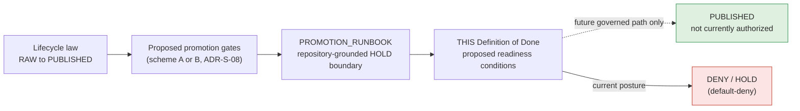

<!-- [KFM_META_BLOCK_V2]
doc_id: kfm://doc/people-dna-land/definition-of-done
title: People / Genealogy / DNA / Land — Definition of Done
type: standard
version: v1.2
prior_version: v1.1
status: draft
owners: [TODO: domain steward — People/Genealogy/DNA/Land; TODO: release authority; TODO: sensitivity reviewer; TODO: rights-holder rep; TODO: docs steward]
created: 2026-06-07
updated: 2026-08-28
policy_label: public
owning_root: docs/
responsibility: Enumerate proposed People/DNA/Land readiness conditions while preserving the current promotion HOLD and keeping review, proof, release, deployment, and publication authority separate.
truth_posture: cite-or-abstain
related:
  - docs/domains/people-dna-land/DATA_LIFECYCLE.md
  - docs/runbooks/people-dna-land/PROMOTION_RUNBOOK.md
  - docs/doctrine/lifecycle-law.md
  - docs/doctrine/trust-membrane.md
  - docs/doctrine/directory-rules.md
  - docs/doctrine/ai-build-operating-contract.md
tags: [kfm, definition-of-done, people, genealogy, dna, land, promotion, governance, sensitivity, consent]
notes:
  - CONTRACT_VERSION = "3.0.0" pinned per ai-build-operating-contract.md v3.0.
  - Definition of Done is PROPOSED doctrine (Pass-10 C14-05); the corpus names the need but does not enumerate per-domain checklists. This is the People-lane enumeration.
  - In a future governed implementation, the DoD could inform a CATALOG-to-PUBLISHED decision; the current document does not gate or authorize that transition.
  - SLUG CONFLICT (OQ-PEOPLE-SLUG-01) and GATE-LETTER CONFLICT (OQ-PEOPLE-GATE-01 / ADR-S-08) inherited from DATA_LIFECYCLE.md; checklist is written scheme-neutral.
  - Consent terms are ConsentGrant + RevocationReceipt (Atlas ubiquitous language); not ConsentReceipt.
  - Verify against mounted repo, ADRs, CI workflows, and policy bundles before treating any path, gate letter, schema, or CI check name as canonical.
  - The current promotion runbook is a repository-grounded HOLD boundary, not an operator procedure; satisfying this proposed checklist does not authorize promotion or publication.
  - v1.2 removes the remaining executable-sounding walkthrough outcome and CI claims identified during review of merged PR #3764.
[/KFM_META_BLOCK_V2] -->

# People / Genealogy / DNA / Land — Definition of Done

> A proposed per-domain promotion-readiness checklist. It records conditions that a future governed path would need to assess; it does not make an artifact eligible for promotion or publication. Current operational promotion is unavailable, and absence of evidence remains a `DENY`, not a pass.

[-a07a00)](#1-purpose-and-status)

|Status|Owners                                                                                             |Last updated|
|------|---------------------------------------------------------------------------------------------------|------------|
|draft |TODO — domain steward + release authority + sensitivity reviewer + rights-holder rep + docs steward|2026-08-28  |

> [!IMPORTANT]
> This proposed Definition of Done models domain-specific questions that a future governed path would need to compose with universal promotion gates and lifecycle law. It does not perform that composition today. The questions cover living-person screening, DNA `ConsentGrant` verification, assessor-as-title denial, chain-of-title gap discipline, and graph-projection safety. [Pass-10 C14-05] [DOM-PEOPLE]

> [!WARNING]
> The current [`PROMOTION_RUNBOOK.md`](../../runbooks/people-dna-land/PROMOTION_RUNBOOK.md) is a fail-closed documentation boundary with outcome `HOLD`. No step-by-step operator procedure, active policy binding, authenticated review route, proof producer, release decision, deployment, or publication path is established. This checklist cannot activate any of them.

> [!CAUTION]
> **Sensitive domain.** This lane spans five §23.2 categories (living people, genealogy, DNA/genomic, private land, ownership). The **most restrictive applicable row** governs any object. This checklist names governance conditions only; it MUST NOT carry living-person identifiers, raw `DNAKitToken`s, DNA segment endpoints, or precise person-parcel joins. Disposition defers to operating contract §23.2.

-----

## Quick links

- [1. Purpose and status](#1-purpose-and-status)
- [2. How this DoD composes other gates](#2-how-this-dod-composes-other-gates)
- [3. The checklist](#3-the-checklist)
- [4. Required receipts and their evidence shape](#4-required-receipts-and-their-evidence-shape)
- [5. Sensitivity gate detail](#5-sensitivity-gate-detail)
- [6. Separation-of-duties requirements](#6-separation-of-duties-requirements)
- [7. Failure reason codes](#7-failure-reason-codes)
- [8. Worked acceptance walkthrough](#8-worked-acceptance-walkthrough)
- [9. Future CI wiring (PROPOSED / NOT IMPLEMENTED)](#9-future-ci-wiring-proposed--not-implemented)
- [10. Open questions register](#10-open-questions-register)
- [11. Open verification backlog](#11-open-verification-backlog)
- [12. Changelog](#12-changelog)
- [13. Definition of done for this document](#13-definition-of-done-for-this-document)
- [14. Related docs](#14-related-docs)

-----

## 1. Purpose and status

**CONFIRMED need / PROPOSED enumeration.** The KFM corpus establishes the Definition of Done as a **per-domain checklist of receipts, schemas, gates, and tests that must be satisfied before a domain artifact can be promoted from `CATALOG` to `PUBLISHED`**, so that promotion is a documented event rather than a tacit judgment. The corpus marks the *concept* `CONFIRMED` but the *per-domain checklists* `PROPOSED` because it names the need without enumerating them. This document is the People/Genealogy/DNA/Land enumeration. [Pass-10 C14-05]

**Why per-domain.** The shared envelope (run receipt, the universal gate matrix) applies to every domain; the domain-specific checks differ. The corpus explicitly cites genealogical records as needing consent verification that other domains do not. This lane therefore carries the heaviest sensitivity and consent obligations of any KFM domain. [Pass-10 C14-05] [DOM-PEOPLE]

**Scope of “artifact.”** A People/DNA/Land artifact is any released object family from the domain dossier — `Person Assertion`, `PersonCanonical`, `NameAssertion`, `LifeEvent`, `Residence Event`, `Migration Event`, `Genealogy Relationship` / `RelationshipAssertion`, `FamilyGroup`, `Relationship Hypothesis`, `DNA Match Evidence`, `Land Ownership Assertion`, `Deed Instrument`, `Title Instrument`, `LandInstrument`, `LegalDescription`, `Assessor Record`, `TaxRecord`, `LandParcel` / `Parcel Version`, `Ownership Interval` — plus any layer, Evidence Drawer payload, or graph projection derived from them. [DOM-PEOPLE]

[↑ Back to top](#quick-links)

-----

## 2. How this DoD composes other gates

This proposed checklist models a **future final readiness layer**. Current repository evidence does not establish that earlier gates have run, that an artifact can reach this layer, or that promotion can execute.

```mermaid
flowchart LR
    L["Lifecycle law<br/>RAW to PUBLISHED"] --> G["Proposed promotion gates<br/>(scheme A or B, ADR-S-08)"]
    G --> R["PROMOTION_RUNBOOK<br/>repository-grounded HOLD boundary"]
    R --> DOD["THIS Definition of Done<br/>proposed readiness conditions"]
    DOD -.->|future governed path only| P["PUBLISHED<br/>not currently authorized"]
    DOD -->|current posture| DENY["DENY / HOLD<br/>(default-deny)"]

    classDef pub fill:#e0f0e0,stroke:#2d8f4e,color:#2b2b2b
    classDef deny fill:#fce4e4,stroke:#c0392b,color:#2b2b2b
    class P pub
    class DENY deny
```

|Layer                 |Owns                                                                               |This DoD’s relationship                                  |
|----------------------|-----------------------------------------------------------------------------------|---------------------------------------------------------|
|`lifecycle-law.md`    |The invariant `RAW → WORK / QUARANTINE → PROCESSED → CATALOG / TRIPLET → PUBLISHED`|Future dependency only; current promotion remains `HOLD` |
|Universal gate matrix |The seven-gate sequence and required evidence                                      |DoD references it scheme-neutrally; does not re-letter it|
|`DATA_LIFECYCLE.md`   |Domain stage handling, tiers, receipts, failure-closed scenarios                   |DoD proposes readiness questions; it does not run a gate |
|`PROMOTION_RUNBOOK.md`|The current fail-closed promotion `HOLD` boundary; no operator procedure is established|DoD remains proposed readiness context and cannot activate promotion|

> [!NOTE]
> **Gate-letter conflict inherited.** Two A–G gate matrices exist in the corpus (Pass-10 C5-01 vs Build-Manual §6.2 / Unified §8); a canonical lettering is pending ADR-S-08. This checklist is written against gate **intent**, so it survives whichever lettering is ratified. [Pass-10 C5-01] [BUILD-MANUAL §6.2] [`OQ-PEOPLE-GATE-01`]

[↑ Back to top](#quick-links)

-----

## 3. The checklist

**Default-deny.** In this proposed model, every box would need a recorded artifact and an unresolved box would be `DENY`, not a deferred concern. The boxes are grouped by gate intent and remain `PROPOSED`; checking every box in this document does not change the current promotion `HOLD`. [Pass-10 C5-02] [DOM-PEOPLE]

### 3.1 Identity, structure, and metadata

- [ ] KFM Meta Block v2 present and zone-correct.
- [ ] `SourceDescriptor` exists and names a recognized source role (`authority` / `observation` / `context` / `model`); no bare GEDCOM dump.
- [ ] Deterministic identity recorded (PROPOSED basis: `source_id + object_role + temporal_scope + normalized_digest`).
- [ ] `Person Assertion` is kept distinct from `PersonCanonical`; no conflation (DDD identity discipline — mistaken identity corrupts data).

### 3.2 Rights and terms

- [ ] License / terms / contact / attribution obligations resolved; not `RIGHTS_UNKNOWN` / `NOASSERTION`.
- [ ] DNA-source vendor terms current and permit the intended use.
- [ ] No `sensitive join` that is denied by policy (e.g., private person × parcel) is present in the release payload.

### 3.3 Schema and contract

- [ ] Validates against `schemas/contracts/v1/people/*.schema.json` (PROPOSED slug — see `OQ-PEOPLE-SLUG-01`).
- [ ] Relevant object schemas validate: `PersonAssertion`, `GenealogyRelationship` / `RelationshipAssertion`, `LandOwnershipAssertion`, `DNAMatchEvidence`, `ConsentGrant`, `RevocationReceipt`.
- [ ] Temporal fields coherent: source / observed / valid / retrieval / release / correction times distinct where material.

### 3.4 Policy parity

- [ ] The same OPA bundle (pinned by digest) that gates this artifact in CI also gates it at runtime (PDP); CI = runtime.
- [ ] Living-person, DNA, consent, steward-review, assessor-as-title, and sensitive-join rules all evaluate identically in both.

### 3.5 Security and sensitivity (additive — see [§5](#5-sensitivity-gate-detail))

- [ ] Living persons screened; no living-person identity in a public-bound payload.
- [ ] No DNA segment in any public-bound payload; no raw `DNAKitToken` in any non-RAW artifact.
- [ ] `ConsentGrant` present, unexpired, unrevoked for every consent-gated record; `RevocationReceipt` ledger reachable.
- [ ] Tier assignment matches Atlas §24.5.2 defaults (living-person fields T4; raw DNA T4; private person-parcel join T4) and any upgrade carries the required transform + review receipts.

### 3.6 Data quality

- [ ] Identity-resolution confidence at or above threshold (threshold value: TODO — corpus is thin on per-domain numbers).
- [ ] Source-role conflict resolved; no `ROLE_COLLAPSE` / `ROLE_DOWNCAST_FORBIDDEN`.
- [ ] Chain-of-title gaps shown explicitly; no record claims completeness over an unevidenced gap.
- [ ] `Assessor Record` / `TaxRecord` not labeled `authority` for title.

### 3.7 Evidence, provenance, and lineage

- [ ] Every published claim resolves: claim → `EvidenceRef` → complete `EvidenceBundle` (source descriptors, citations, receipts, `PolicyDecision`, review state, release state).
- [ ] Catalog closure complete (STAC / DCAT / PROV / domain); `CatalogMatrix` entry present.
- [ ] Graph / triplet projection passes safety tests: no stable cross-correlatable identifier for living persons, genomic subjects, or sealed records.

### 3.8 Reviewability, release, and rollback

- [ ] `ReviewRecord` present for any tier ≥ T2 (domain steward) and rights-holder rep for living-person / DNA scope.
- [ ] Release authority is distinct from the artifact author where materiality applies (two-key).
- [ ] `ReleaseManifest` present with rollback target; correction path defined; rollback drill confirms reachability.

[↑ Back to top](#quick-links)

-----

## 4. Required receipts and their evidence shape

Receipts are governance memory; earlier receipts are **referenced** at later phases via `EvidenceRef`, not duplicated. Required content shapes below are the Atlas-stated (PROPOSED) shapes. [Atlas §24] [DOM-PEOPLE]

|Receipt             |Required when                                               |Required content (PROPOSED shape)                                                                                            |
|--------------------|------------------------------------------------------------|-----------------------------------------------------------------------------------------------------------------------------|
|`SourceDescriptor`  |Always                                                      |role, authority, rights, sensitivity, cadence, payload/reference hash                                                        |
|`RedactionReceipt`  |Any T1 public-safe transform of sensitive content           |`policy_ref`, `redaction_method`, `kept_fields`, `removed_fields`, `geometry_transform`, `reviewer`                          |
|`AggregationReceipt`|Living-person fields aggregated to tract/county for T1      |`geometry_scope`, `time_scope`, `aggregation_method`, `input_source_refs`, `suppression_rule`, `output_unit`                 |
|`ConsentGrant`      |Any DNA / living-person consent-gated record                |signed grant; scope; TTL; status-list / revocation reference (pointer-only when published)                                   |
|`RevocationReceipt` |Consent revoked, or revocation ledger entry                 |`revocation_id`; revoked spec_hashes / scope; issued time; signature; provenance refs                                        |
|`ReviewRecord`      |Tier ≥ T2; sensitive-lane publication; correction acceptance|`reviewer`, `role`, `decision` (ALLOW / RESTRICT / DENY / HOLD), `evidence_refs[]`, `policy_ref`, time                       |
|`PolicyDecision`    |Every governed gate                                         |`policy_id`, `target_object`, `decision`, `reason_code`, time, `evidence_refs[]`                                             |
|`ValidationReport`  |WORK→PROCESSED; release closure                             |`validator_id`, `target`, `passes[]`, `failures[]`, time, `deterministic_inputs`                                             |
|`EvidenceBundle`    |Every public claim                                          |resolved evidence package backing the claim                                                                                  |
|`ReleaseManifest`   |PUBLISHED transition                                        |`release_id`, `contents[]`, digests, `evidence_refs[]`, `rollback_target`, time                                              |
|`CorrectionNotice`  |Post-publication correction                                 |`claim_ref`, `prior_release_ref`, `change_summary`, `invalidates[]`, `review_ref`, time                                      |
|`RollbackCard`      |Revert to prior release                                     |`release_id`, `rollback_to`, `reason`, `invalidates[]`, `review_ref`, time                                                   |
|`AIReceipt`         |Any Focus Mode answer touching this lane                    |`prompt_scope`, `evidence_refs[]`, `policy_ref`, `outcome` (ANSWER / ABSTAIN / DENY / ERROR), `reason_code`, `model_id`, time|

[↑ Back to top](#quick-links)

-----

## 5. Sensitivity gate detail

In a future governed implementation, a sensitivity gate would be **additive** to policy parity and a failure in either dimension would keep the candidate held. No such operational gate is established here; current promotion remains `HOLD` regardless of checklist results. Tier defaults below are CONFIRMED in Atlas §24.5.2. [Atlas §24.5.2] [Pass-10 C5-02]

|Object class                                   |Default tier|Only allowed path to public-safe                                                 |Required gates                                   |
|-----------------------------------------------|------------|---------------------------------------------------------------------------------|-------------------------------------------------|
|Living-person fields                           |**T4**      |Aggregation by tract/county + `AggregationReceipt` → T1                          |Consent **or** aggregation gate + `ReviewRecord` |
|Raw DNA segment data                           |**T4**      |No transform reaches a public tier; **T3 only** under explicit research agreement|Named consent + `ReviewRecord` + `PolicyDecision`|
|Private person-parcel join                     |**T4**      |Generalized parcel + de-identified person → **T2 only**                          |`RedactionReceipt` + `ReviewRecord`              |
|Historical-person profile / timeline (deceased)|T0 / T1     |Generalization where residual sensitivity applies                                |Standard gates; `RedactionReceipt` if T1         |
|Chain-of-title summary                         |T0 / T1     |“Not title proof” qualification                                                  |Standard gates                                   |

> [!WARNING]
> A record’s tier is set by source role, sensitivity flags, and consent state — **never by directory path**. A DNA segment in `data/published/` does not become public; it never becomes public. A tier *upgrade* (toward public) needs both a transform receipt and a review record; a *downgrade* needs only a `CorrectionNotice` + `ReviewRecord`. [Atlas §24.5]

[↑ Back to top](#quick-links)

-----

## 6. Separation-of-duties requirements

**CONFIRMED operating-law invariant:** KFM separates policy-significant release duties when maturity justifies it. For this lane, the following roles are required to be distinct for any tier ≥ T2 release. [Atlas §24.7] [ENCY]

|Action                                      |May author also approve?                                              |Required reviewer(s)                    |
|--------------------------------------------|----------------------------------------------------------------------|----------------------------------------|
|Source admission (— → RAW)                  |Yes for routine; **No** when rights / sovereignty / consent unresolved|Source steward                          |
|Redaction / generalization / tier decision  |No                                                                    |Sensitivity reviewer                    |
|Living-person / DNA release decision        |No                                                                    |Rights-holder representative            |
|Future PUBLISHED transition (materiality applies; not currently executable)|No                                           |Release authority (distinct from author)|
|Correction / rollback of a published claim  |No                                                                    |Correction reviewer                     |
|Focus Mode answer / AI-drafted note         |n/a (AI is never root truth)                                          |AI surface steward (audit)              |

[↑ Back to top](#quick-links)

-----

## 7. Failure reason codes

When a check fails, the `PolicyDecision` records a reason code. These are the lane-relevant codes drawn from the Atlas failure-mode register (PROPOSED set; verify exact strings against the mounted policy bundle).

|Reason code                                                |Triggered by                                               |Remediation                                         |
|-----------------------------------------------------------|-----------------------------------------------------------|----------------------------------------------------|
|`RIGHTS_UNKNOWN` / `SENSITIVITY_UNRESOLVED`                |Rights or sensitivity not resolved at a gate               |Steward review; rights resolution; tier reassignment|
|`CONSENT_MISSING` / `CONSENT_REVOKED` / `CONSENT_EXPIRED`  |DNA / living-person record without valid `ConsentGrant`    |Obtain / refresh grant, or deny                     |
|`RAW_TOKEN_LEAK`                                           |Raw `DNAKitToken` in a non-RAW artifact                    |Remove token; steward incident                      |
|`ASSESSOR_AS_TITLE`                                        |Ownership claim authority-labeled on assessor-only evidence|Downcast to `observation`; add “not title proof”    |
|`CHAIN_GAP_UNEVIDENCED`                                    |Title chain claims completeness over a gap                 |Surface gap explicitly                              |
|`ROLE_COLLAPSE` / `ROLE_DOWNCAST_FORBIDDEN`                |Source-role upcast attempted                               |Restore source role; refuse upcast                  |
|`REVIEW_NEEDED` / `REVIEW_INSUFFICIENT` / `REVIEW_REJECTED`|Required review absent or inadequate                       |Run required review; supply `ReviewRecord`          |
|`GRAPH_REIDENTIFICATION`                                   |Projection exposes stable living-person / genomic ID       |Rebuild projection with opaque references           |
|`RELEASE_MANIFEST_INVALID` / `ROLLBACK_TARGET_MISSING`     |Release infrastructure error                               |Fix manifest; supply rollback target                |
|`CORRECTION_DERIVATIVES_UNRESOLVED`                        |Correction lineage broken                                  |Resolve derivatives; supersession entry             |

[↑ Back to top](#quick-links)

-----

## 8. Worked acceptance walkthrough

*Illustrative proposal only; not sourced from a specific repository record and not an executable release example.* A hypothetical deceased-person residence timeline assembled from census and city-directory sources, with a future T1 target.

1. **Identity/structure** — `SourceDescriptor`s present, both `observation` role; Meta Block valid. ✅
1. **Rights** — census public after release window; directory rights NEEDS VERIFICATION → resolved by steward. ✅
1. **Schema** — validates `Residence Event`, `Person Assertion`. ✅
1. **Policy parity** — living-person rule fires `not_living` (subject deceased); parity CI = runtime. ✅
1. **Sensitivity** — residence points generalized to block level; `RedactionReceipt` emitted (kept: name, decade; removed: exact address). Tier T1. ✅
1. **Data quality** — identity-resolution confidence above threshold; no role collapse. ✅
1. **Evidence** — `EvidenceRef` → `EvidenceBundle` resolves with both source descriptors + citations. ✅
1. **Reviewability** — `ReviewRecord` by domain steward; `ReleaseManifest` with rollback target; release authority ≠ author. ✅

Current outcome: `HOLD`. The checked rows illustrate questions a future governed review might ask; they are not repository evidence, do not resolve rights or living status, and cannot produce `ANSWER`, a release decision, or a `PUBLISHED` transition. A failed or unresolved row would remain `DENY` / `HOLD`, but satisfying every illustrative row still leaves current promotion at `HOLD`.

[↑ Back to top](#quick-links)

-----

## 9. Future CI wiring (PROPOSED / NOT IMPLEMENTED)

> [!WARNING]
> No current workflow, required check, policy-runtime binding, release decision, or branch-protection rule is established by this section. The items below are design questions only and cannot be cited as present enforcement.

- A future blocking check would need an accepted owner and contract before evaluating any `CATALOG → PUBLISHED` candidate.
- A future check would need verified, digest-pinned policy-runtime binding rather than a documentation assertion.
- A future documentation/policy drift check would need a repository-owned workflow and deterministic negative proof.
- Any future required-check or branch-protection change would remain a separate repository-administration decision outside this document.

[↑ Back to top](#quick-links)

-----

## 10. Open questions register

|ID                  |Question                                                                                                                                             |Owner role           |Resolution path                       |
|--------------------|-----------------------------------------------------------------------------------------------------------------------------------------------------|---------------------|--------------------------------------|
|OQ-PEOPLE-DOD-01    |Identity-resolution confidence threshold and per-tier DQ numbers (corpus is thin on quantitative thresholds)                                         |Domain steward       |ADR / DQ-policy doc                   |
|OQ-PEOPLE-DOD-02    |How does a shared-rule change (e.g., new sensitivity rule) propagate into this checklist — single source + per-domain extension, or independent file?|Docs steward         |Pass-10 C14-05 open question; ADR     |
|OQ-PEOPLE-DOD-03    |Is the DoD versioned with the policy bundle or independently?                                                                                        |Docs steward         |ADR                                   |
|OQ-PEOPLE-SLUG-01   |Canonical lane slug (`people` vs `people-dna-land`) across responsibility roots                                                                      |Docs + domain steward|ADR; Atlas §24.13; `DRIFT_REGISTER.md`|
|OQ-PEOPLE-GATE-01   |Canonical A–G gate lettering (Pass-10 C5-01 vs Build-Manual §6.2)                                                                                    |Governance reviewer  |ADR-S-08                              |
|OQ-PEOPLE-CONSENT-01|Single canonical KFM consent envelope (corpus fragments consent across tokens, GA4GH, OAuth introspection, revocation)                               |Schema owner         |ADR                                   |

[↑ Back to top](#quick-links)

-----

## 11. Open verification backlog

These remain `NEEDS VERIFICATION` before this document could advance beyond `draft`:

1. Exact OPA reason-code strings and bundle digest — verify against mounted policy bundle.
1. Whether a DoD check should exist at all, plus its owner, contract, workflow, and administrative approval path.
1. Schema file names and slug (`people` vs `people-dna-land`) — `OQ-PEOPLE-SLUG-01` / ADR.
1. Gate lettering — `OQ-PEOPLE-GATE-01` / ADR-S-08.
1. Identity-resolution confidence threshold value — `OQ-PEOPLE-DOD-01`.
1. Consent envelope reconciliation — `OQ-PEOPLE-CONSENT-01`.
1. Whether the runbook and DoD agree on every gate name once ADR-S-08 lands.

[↑ Back to top](#quick-links)

-----

## 12. Changelog

|Change                                            |Type (per contract §37)|Reason                                                                                                |
|--------------------------------------------------|-----------------------|------------------------------------------------------------------------------------------------------|
|Initial People/DNA/Land Definition of Done        |new                    |Pass-10 C14-05 names the per-domain DoD need; this enumerates it for the lane                         |
|Written scheme-neutral against gate intent        |clarification          |Inherits gate-letter conflict `OQ-PEOPLE-GATE-01` / ADR-S-08; avoids hard-coding a contested lettering|
|Consent terms `ConsentGrant` + `RevocationReceipt`|reconciliation         |Atlas ubiquitous-language terms; not `ConsentReceipt`                                                 |
|Tier rows aligned to Atlas §24.5.2; SoD to §24.7  |reconciliation         |Use Atlas-canonical defaults and roles                                                                |
|Executable-sounding walkthrough and CI claims removed|safety correction  |Merged PR #3764 review found that later sections contradicted the current promotion `HOLD`             |

> **Backward compatibility.** New document; no prior anchors to preserve. Consistent with sibling `DATA_LIFECYCLE.md` v2 and `PROMOTION_RUNBOOK.md`; if any gate-name divergence appears once ADR-S-08 lands, reconcile all three in one change and log in `DRIFT_REGISTER.md`.

[↑ Back to top](#quick-links)

-----

## 13. Definition of done for this document

This document is done enough to enter the repository when:

- it is placed according to Directory Rules (docs lane slug resolved per `OQ-PEOPLE-SLUG-01`);
- a docs steward, the domain steward, and the sensitivity reviewer (plus rights-holder rep, given DNA/living-person scope) review it;
- it is linked from the domain README, `DATA_LIFECYCLE.md`, and `PROMOTION_RUNBOOK.md`;
- it does not conflict with accepted ADRs (notably ADR-S-08 and the slug ADR);
- the slug, gate-letter, and threshold gaps are logged in `docs/registers/DRIFT_REGISTER.md` / `VERIFICATION_BACKLOG.md`;
- the future CI questions in [§9](#9-future-ci-wiring-proposed--not-implemented) remain explicit backlog; this document claims no workflow, generated receipt, or human approval;
- future changes follow the operating contract’s §37 lifecycle.

[↑ Back to top](#quick-links)

-----

## 14. Related docs

- `docs/domains/people-dna-land/DATA_LIFECYCLE.md` — domain lifecycle, tiers, receipts (sibling)
- `docs/runbooks/people-dna-land/PROMOTION_RUNBOOK.md` — repository-grounded promotion `HOLD` boundary; no operator procedure (sibling)
- `docs/domains/people-dna-land/README.md` — domain orientation (TODO — separate doc)
- `docs/domains/people-dna-land/SENSITIVITY.md` — sensitivity tier rules (PROPOSED)
- `docs/doctrine/lifecycle-law.md` — lifecycle invariant
- `docs/doctrine/trust-membrane.md` — governed-API-only public surfaces
- `docs/doctrine/directory-rules.md` — Directory Rules v1.3
- `ai-build-operating-contract.md` — operating contract v3.0 (`CONTRACT_VERSION = "3.0.0"`)
- `schemas/contracts/v1/people/` · `policy/sensitivity/people/` · `policy/consent/people/` — machine surfaces (PROPOSED)
- `docs/quality/README.md` — Quality README / gate matrix (TODO — verify path)

-----

**Last updated:** 2026-08-28 · **Status:** draft · **CONTRACT_VERSION:** 3.0.0 · **Owners:** TODO (domain steward) · [↑ Back to top](#quick-links)
