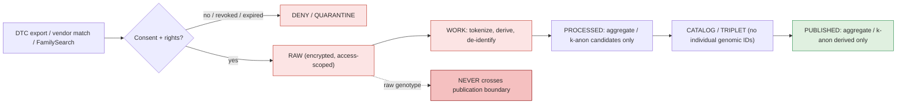
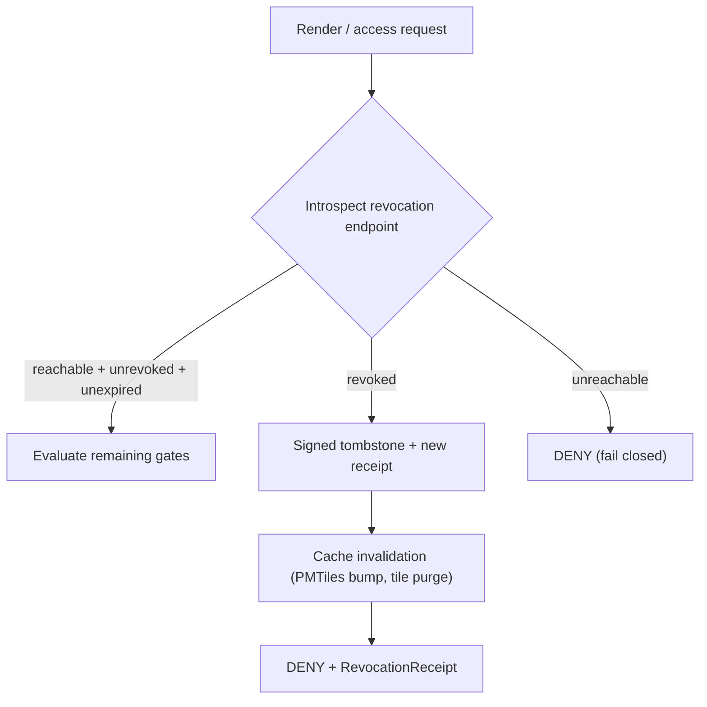

<!-- [KFM_META_BLOCK_V2]
doc_id: kfm://doc/people-dna-land/dna-handling
title: People / Genealogy / DNA / Land — DNA & Genomic Handling
type: standard
version: v1
status: draft
owners: [TODO: domain steward — People/Genealogy/DNA/Land; TODO: sensitivity reviewer; TODO: rights-holder rep; TODO: release authority; TODO: docs steward]
created: 2026-06-07
updated: 2026-06-07
policy_label: public
related:
  - docs/domains/people-dna-land/DATA_LIFECYCLE.md
  - docs/domains/people-dna-land/DEFINITION_OF_DONE.md
  - docs/runbooks/people-dna-land/PROMOTION_RUNBOOK.md
  - docs/doctrine/lifecycle-law.md
  - docs/doctrine/trust-membrane.md
  - docs/doctrine/directory-rules.md            # Directory Rules v1.3
  - ai-build-operating-contract.md              # CONTRACT_VERSION = "3.0.0"
  - policy/consent/people/
  - policy/sensitivity/people/
  - schemas/contracts/v1/people/                # PROPOSED canonical schema slug per Atlas §24.13
  - docs/standards/CONSENT_TOKENS.md            # PROPOSED — consent-token standard (Pass-10 C6-07)
  - docs/standards/DP_BUDGETS.md                # PROPOSED — DP epsilon budgets (Pass-10 C6-05)
tags: [kfm, dna, genomic, genetic-genealogy, consent, revocation, k-anonymity, differential-privacy, sensitivity, deny-by-default]
notes:
  - CONTRACT_VERSION = "3.0.0" pinned per ai-build-operating-contract.md v3.0.
  - Most sensitive document in the lane. Deny-by-default; raw genotype is never republished; only aggregate / k-anonymized derived data crosses the publication boundary.
  - Consent terms are ConsentGrant + RevocationReceipt (Atlas ubiquitous language); the DNA-adjacent overlay cards also use ConsentManifest / revocation ledger / DNAKitToken. Naming reconciliation is OPEN (OQ-PEOPLE-DNA-NAME-01).
  - SLUG (OQ-PEOPLE-SLUG-01) and GATE-LETTER (OQ-PEOPLE-GATE-01 / ADR-S-08) conflicts inherited from DATA_LIFECYCLE.md.
  - External standards (GA4GH AAI/DUO, OAuth2 RFC 7662, NIST SP 800-226, EDPB Guidelines 01/2025) are cited as attested in project knowledge (Pass-10 C9), not via external web research.
  - Verify against mounted repo, ADRs, policy bundles, and current vendor terms before treating any path, threshold, or vendor claim as canonical.
[/KFM_META_BLOCK_V2] -->

# People / Genealogy / DNA / Land — DNA & Genomic Handling

> The lane’s deny-by-default contract for DNA, genomic, and genetic-genealogy material. **Raw genotype is never republished.** Only aggregate or k-anonymized derived data, under documented consent, may cross the publication boundary — and only after review.

|Status|Owners                                                                                             |Last updated|
|------|---------------------------------------------------------------------------------------------------|------------|
|draft |TODO — domain steward + sensitivity reviewer + rights-holder rep + release authority + docs steward|2026-06-07  |

> [!CAUTION]
> **Highest-sensitivity material in KFM.** DNA, genomic, and DNA-derived identity/relationship outputs are **denied or restricted by default**. A raw DTC genomic export is a rubric-4/5 asset that lives only in encrypted storage under strict access scoping. **No transform releases raw DNA segment data to a public tier; T3 is the most public it can reach, and only under an explicit named research agreement.** This document names governance rules only — it MUST NOT contain genotypes, `DNAKitToken`s, segment endpoints, kit identifiers, or any individual’s match data. Disposition defers to operating contract §23.2 and to `policy/consent/people/`. [C9-03] [Atlas §24.5.2] [DOM-PEOPLE]

-----

## Quick links

- [1. Purpose and scope](#1-purpose-and-scope)
- [2. Where DNA sits in the lifecycle](#2-where-dna-sits-in-the-lifecycle)
- [3. Non-negotiable invariants](#3-non-negotiable-invariants)
- [4. Tier defaults and the publication boundary](#4-tier-defaults-and-the-publication-boundary)
- [5. Consent and revocation](#5-consent-and-revocation)
- [6. Tokenization and no-raw-genotype rule](#6-tokenization-and-no-raw-genotype-rule)
- [7. De-identification: k-anonymity and differential privacy](#7-de-identification-k-anonymity-and-differential-privacy)
- [8. Source families and vendor risk](#8-source-families-and-vendor-risk)
- [9. Storage, retention, and erasure](#9-storage-retention-and-erasure)
- [10. Governed AI and graph-projection boundaries](#10-governed-ai-and-graph-projection-boundaries)
- [11. Required receipts](#11-required-receipts)
- [12. Failure-closed scenarios](#12-failure-closed-scenarios)
- [13. Validators, tests, and fixtures](#13-validators-tests-and-fixtures)
- [14. Open questions register](#14-open-questions-register)
- [15. Open verification backlog](#15-open-verification-backlog)
- [16. Changelog](#16-changelog)
- [17. Definition of done](#17-definition-of-done)
- [18. Related docs](#18-related-docs)

-----

## 1. Purpose and scope

**CONFIRMED doctrine / PROPOSED implementation.** This document specifies how DNA, genomic, and genetic-genealogy material is admitted, held, transformed, and (rarely) released within the People/DNA/Land lane. It is the most restrictive sub-policy in the domain and overrides any less-restrictive general guidance for any object it touches. [DOM-PEOPLE] [C9-03]

**In scope.** Direct-to-consumer (DTC) raw genomic exports; `DNA Match Evidence`; `DNASegment`; `DNAKitToken`; `ConsentGrant` / consent manifests and `RevocationReceipt` / revocation ledgers; IBD/relatedness derivations; ancestry-composition derivations; genetic-genealogy overlays; and the de-identification, tokenization, and render-time enforcement that govern all of them. [C9-03] [DOM-PEOPLE]

**Out of scope (governed elsewhere, but constrained by this doc).** General living-person handling and land/title handling live in `DATA_LIFECYCLE.md`; promotion procedure lives in `PROMOTION_RUNBOOK.md`; the acceptance checklist lives in `DEFINITION_OF_DONE.md`. This doc is the DNA-specific layer those documents defer to.

> [!NOTE]
> The capability tension is real and stated in doctrine: DTC inputs are the only practical source of fine-grained genomic data for genealogy work, so refusing them outright is a capability gap — but accepting them naïvely is a serious sensitivity violation. The whole point of this document is to make controlled acceptance auditable. [C9-03]

[↑ Back to top](#quick-links)

-----

## 2. Where DNA sits in the lifecycle

DNA material follows the standard invariant — `RAW → WORK / QUARANTINE → PROCESSED → CATALOG / TRIPLET → PUBLISHED` — but is **gated harder at every edge** and almost never reaches public PUBLISHED in raw or individual form.

> [!IMPORTANT]
> The dashed edge is the load-bearing rule: **raw genotype never crosses the publication boundary.** Only aggregate or k-anonymized derived data does, and only under consent. [C9-03]

[↑ Back to top](#quick-links)

-----

## 3. Non-negotiable invariants

**CONFIRMED doctrine.** These hold at every phase and are gate-enforced, not advisory. [C9-03] [Atlas §24.5.2] [DOM-PEOPLE]

1. **Raw genotype is never republished.** Only aggregate or k-anonymized derived data crosses the publication boundary.
1. **Raw DNA stays encrypted and access-scoped.** A DTC raw file is a rubric-4/5 asset; it lives only in encrypted storage with strict access scoping.
1. **No raw `DNAKitToken` or kit/vendor identifier appears in any non-RAW artifact.**
1. **Consent is required, machine-readable, and revocable.** No consent-gated record is processed or rendered without a valid, unexpired, unrevoked `ConsentGrant`.
1. **Revocation is first-class.** Revocation triggers a signed tombstone, a new receipt, and cache invalidation; if the revocation endpoint is unreachable, rendering **fails closed**.
1. **No raw genotype persistence on the server for overlays** (PROPOSED): DNA-adjacent overlays compute person/match tokens client-side using tenant-scoped HMAC salts and avoid sending raw genotype identifiers to the server. [KFM-P17-PROG-0016]
1. **DNA evidence is `observation` or `model`, never `authority`.** A match or segment is evidence, not proof of identity or relationship.
1. **KFM is never a DNA-testing or interpretation authority.** It governs evidence about externally produced results; it does not certify them.

[↑ Back to top](#quick-links)

-----

## 4. Tier defaults and the publication boundary

**CONFIRMED in Atlas §24.5.2.** The tier of a record is set by source role, sensitivity flags, and consent state — **never by directory path.** Putting a DNA segment in `data/published/` does not make it public; it never becomes public.

|Object class                                                          |Default tier   |Only allowed path toward less-restricted                                               |Required gates                                          |
|----------------------------------------------------------------------|---------------|---------------------------------------------------------------------------------------|--------------------------------------------------------|
|Raw DNA segment data                                                  |**T4 (Denied)**|No transform reaches a public tier; **T3 only** under explicit named research agreement|Named consent + `ReviewRecord` + `PolicyDecision`       |
|`DNA Match Evidence` (individual)                                     |**T4 / T3**    |Restricted research access only; never public individual-level                         |Named consent + `ReviewRecord`                          |
|Living-person genomic-derived fields                                  |**T4**         |Aggregation by tract/county + `AggregationReceipt` → **T1**                            |Consent **or** aggregation gate + `ReviewRecord`        |
|Aggregate / k-anonymized derived statistic (deceased or de-identified)|T1             |DP for aggregates + k-anonymity satisfied                                              |`AggregationReceipt` + DP-budget record + `ReviewRecord`|

> [!WARNING]
> A tier *upgrade* (toward more public) always needs **both** a transform receipt and a `ReviewRecord`. A *downgrade* (toward less public, e.g., on revocation or late discovery a subject is living) needs only a `CorrectionNotice` + `ReviewRecord` and is always permitted. [Atlas §24.5.3]

[↑ Back to top](#quick-links)

-----

## 5. Consent and revocation

**CONFIRMED doctrine.** Consent is treated as an enforceable, machine-readable policy that travels with the data and is checked **on every render** — not as static release text. [C6-07] [C6-08]

### 5.1 Consent envelope

- A `ConsentGrant` (corpus also: compact consent token / `ConsentManifest`) carries scopes, audience, expiry, a `revocation_endpoint`, a consent-history hash, and a `redaction_profile` reference. [C6-07]
- The shape maps to **OAuth 2.0 token introspection (RFC 7662)** and the **GA4GH AAI Passport / Data Use Ontology (DUO)** model; free-text or oral-history consent is normalized into DUO codes via a documented mapping. [C6-07] [C9-04]
- Consent-first genetic-genealogy overlays use signed consent manifests, retention TTLs, and a revocation ledger, with **no raw genotype persistence**. [KFM-P17-IDEA-0006] [KFM-P17-PROG-0018]

### 5.2 Revocation flow (fail-closed)

- On revocation: issue a signed tombstone, append a new spec_hash + receipt to the ledger, and trigger cache-invalidation webhooks. Revocation that does not invalidate caches is incomplete — stale tiles can leak retracted content. [C6-08] [C5-09]
- Embargo: if `now < embargo_until`, the gate denies regardless of other approvals. [C6-08]
- The cache-invalidation hooks **must be tested before** the revocation pathway is relied upon. [C6-08]

> [!CAUTION]
> **Vendor-solvency is a consent-relevant variable.** The 23andMe Chapter 11 filing (March 2025) is the doctrine’s worked example: a DTC raw file cannot be treated as a static input, because the vendor’s solvency can change the consent and rights posture under it. Run a vendor-loss-simulation drill before bulk ingestion of any DTC source. [C9-03] [C9-07]

[↑ Back to top](#quick-links)

-----

## 6. Tokenization and no-raw-genotype rule

**PROPOSED implementation, CONFIRMED intent.** DNA-adjacent overlays should compute person and match tokens **client-side** using tenant-scoped HMAC salts, and avoid sending raw genotype identifiers to the server. Allowed server-side fields are limited to deterministic tokens and policy-permitted attributes; raw genotype is not among them. [KFM-P17-PROG-0016] [KFM-P17-IDEA-0006]

|Concern                          |Rule                                                                                                 |Status                     |
|---------------------------------|-----------------------------------------------------------------------------------------------------|---------------------------|
|Person / match identity on server|Deterministic token (HMAC, tenant-scoped salt) — never the raw identifier                            |PROPOSED                   |
|Raw genotype to server           |Forbidden                                                                                            |PROPOSED (CONFIRMED intent)|
|`DNAKitToken` exposure           |Never in any non-RAW artifact                                                                        |CONFIRMED                  |
|FamilySearch / API upstreams     |Record token **fingerprint**, not the token; store OAuth2 grant scope + GA4GH Passport claim at fetch|CONFIRMED [C9-02]          |

> [!NOTE]
> **Naming reconciliation OPEN.** The domain ubiquitous-language table names `ConsentGrant` and `RevocationReceipt`; the DNA-overlay idea cards use `ConsentManifest` and a `revocation ledger`; tokens appear as both `DNAKitToken` and client-side HMAC “match tokens.” These are not yet reconciled into a single canonical consent/token envelope. Tracked as `OQ-PEOPLE-DNA-NAME-01` / `OQ-PEOPLE-CONSENT-01`. [DOM-PEOPLE] [C6-07]

[↑ Back to top](#quick-links)

-----

## 7. De-identification: k-anonymity and differential privacy

Two distinct tools, applied to **different** outputs. Conflating them is an error. [C6-05] [C6-06] [C9-05]

|Tool                    |Applies to                                   |Rule                                                                                                                                                                                                                                                                                          |Records                                   |Status                   |
|------------------------|---------------------------------------------|----------------------------------------------------------------------------------------------------------------------------------------------------------------------------------------------------------------------------------------------------------------------------------------------|------------------------------------------|-------------------------|
|**k-anonymity**         |Living-people overlays / tabular aggregations|Render only when ≥ k individuals fall in a cell; else server-side fallback radius mask. PDP-decided, audited. Default profile `density_k_anonymity_grid` (k=10, cell≈500 m, fallback radius mask≈250 m); a defensible k=5 default exists for tabular publications, higher k for higher-stakes.|k value, cell size, fallback, PDP decision|CONFIRMED [C6-06]        |
|**Differential privacy**|Aggregate outputs only (counts, heatmaps)    |Applied to aggregates, **never** to raw points (DP-noising raw points can mislead or be undone). Epsilon/delta recorded in receipts; aligned to NIST SP 800-226.                                                                                                                              |epsilon, delta, budget                    |CONFIRMED [C6-05] [C9-05]|
|**Pseudonymisation**    |Re-identification keys                       |Key-management posture recorded; aligned to EDPB Guidelines 01/2025.                                                                                                                                                                                                                          |key handling, rotation                    |CONFIRMED [C9-05]        |

> [!WARNING]
> k-anonymity protects against **identity** disclosure, not **attribute** disclosure, and not against linkage attacks across datasets; it must be combined with consent and access controls (and, for attribute-sensitive cases, l-diversity / t-closeness). Quasi-identifier sets MUST be enumerated explicitly and generalization hierarchies documented, or the de-identification is unauditable. [C6-06]

> [!NOTE]
> Specific defaults are deliberately not hard-committed by doctrine: epsilon budgets and k-by-density are policy decisions tracked in `docs/standards/DP_BUDGETS.md` (PROPOSED) and `policy/sensitivity/people/` (PROPOSED). Recorded here as open thresholds, not invented values. [C6-05] [C6-06]

[↑ Back to top](#quick-links)

-----

## 8. Source families and vendor risk

**CONFIRMED / PROPOSED.** Recognized DNA-relevant source families and the roles they may carry. Rights and current vendor terms are **NEEDS VERIFICATION** per vendor and must be re-checked before bulk ingestion; **sensitive joins fail closed.** [C9-02] [C9-03] [DOM-PEOPLE]

|Source family                                            |Valid roles             |Default tier / sensitivity               |Notes                                                                                            |
|---------------------------------------------------------|------------------------|-----------------------------------------|-------------------------------------------------------------------------------------------------|
|DTC raw genomic export (23andMe, AncestryDNA, MyHeritage)|`observation`, `model`  |T4; rubric 4/5; encrypted + access-scoped|User-controlled input; explicit consent; format-versioned parser; ToS re-check before bulk ingest|
|Vendor match CSV / IBD segment / triangulation           |`observation`, `model`  |T3/T4                                    |Individual-level never public; derive only under consent                                         |
|FamilySearch API (genealogy upstream)                    |`observation`, `context`|per-record; consent-aware                |OAuth2 scopes; record token fingerprint; GA4GH Passport claim at fetch [C9-02]                   |
|GEDCOM / GEDZip / tree overlays (DNA-linked)             |`observation`, `model`  |hypotheses by default; never `authority` |Living-person screening required                                                                 |

> [!CAUTION]
> DTC vendors change export formats without long deprecation windows; the parser MUST be versioned and the receipt MUST record the export-format version. Vendor terms occasionally restrict third-party ingestion — the legal-risk posture for each vendor must be re-checked before bulk ingestion. [C9-03]

[↑ Back to top](#quick-links)

-----

## 9. Storage, retention, and erasure

**CONFIRMED / OPEN.** Raw DNA lives only in encrypted storage under strict access scoping. Beyond that, retention and the tombstone-vs-erasure boundary are explicitly under-specified in doctrine and must be settled by policy + ADR. [C9-03] [C5-09]

|Concern                                           |Posture                                                                                                                                      |Status                   |
|--------------------------------------------------|---------------------------------------------------------------------------------------------------------------------------------------------|-------------------------|
|Raw DTC file at rest                              |Encrypted storage, strict access scoping; not a public surface at any phase                                                                  |CONFIRMED                |
|Retention while vendor solvent vs. distressed     |Open — corpus does not commit a period                                                                                                       |OPEN [C9-03]             |
|Consent revoked → object handling                 |Signed tombstone + ledger entry + cache invalidation                                                                                         |CONFIRMED [C6-08] [C5-09]|
|Tombstone vs. true erasure (right-to-be-forgotten)|Tombstones satisfy explainability but **not** erasure; the boundary is undefined and must align with GDPR and applicable Tribal data policies|OPEN [C5-09]             |

> [!IMPORTANT]
> A tombstone records a supersession and reason; it is **not** deletion. Where a legal right-to-be-forgotten obligation requires true deletion of personal data, tombstoning alone is insufficient — the erasure path and its logging must be defined (`OQ-PEOPLE-DNA-ERASE-01`). [C5-09]

[↑ Back to top](#quick-links)

-----

## 10. Governed AI and graph-projection boundaries

**CONFIRMED doctrine.** AI is interpretive, never the root truth source; `EvidenceBundle` outranks generated language. For DNA material specifically: [GAI] [DOM-PEOPLE]

- AI MAY summarize **released** EvidenceBundles, explain limitations, and draft steward-review notes.
- AI MUST `ABSTAIN` when evidence is insufficient and `DENY` where consent, rights, sensitivity, or release state blocks the request.
- AI MUST NOT read RAW or WORK DNA content; it sees only released, public-safe EvidenceBundles. Every AI answer emits an `AIReceipt`.
- A **graph / triplet projection MUST NOT** expose a stable cross-correlatable identifier for a living person, a genomic subject, or a sealed record. Use opaque holder references / blinded indexes; a projection that leaks such an ID is rebuilt. [DOM-PEOPLE]

[↑ Back to top](#quick-links)

-----

## 11. Required receipts

DNA workflows carry the lane’s heaviest receipt load. Earlier receipts are referenced (not duplicated) downstream via `EvidenceRef`. [Atlas §24] [C6-05] [C6-08]

|Receipt                           |Required when                                 |Key content (PROPOSED shape)                                                                             |
|----------------------------------|----------------------------------------------|---------------------------------------------------------------------------------------------------------|
|`SourceDescriptor`                |Always                                        |role, authority, rights, sensitivity, cadence, vendor + export-format version, hash                      |
|`ConsentGrant` / `ConsentManifest`|Every consent-gated record                    |scopes, audience, expiry/TTL, `revocation_endpoint`, consent-history hash, `redaction_profile`, DUO codes|
|`RevocationReceipt`               |Revocation / ledger entry                     |`revocation_id`, revoked scope/spec_hashes, issued time, signature, provenance refs                      |
|`RedactionReceipt`                |Any public-safe transform of sensitive content|`policy_ref`, `redaction_method`, `kept_fields`, `removed_fields`, reviewer                              |
|`AggregationReceipt`              |Aggregate / k-anon derived release            |`geometry_scope`, `time_scope`, `aggregation_method`, `input_source_refs`, `suppression_rule`, k value   |
|DP-budget record                  |Any DP-treated aggregate                      |epsilon, delta, budget consumed, NIST SP 800-226 rationale                                               |
|`PolicyDecision`                  |Every governed gate / render                  |`policy_id`, target, decision, reason_code, time, evidence_refs                                          |
|`ReviewRecord`                    |Any tier ≥ T2; consent / release decisions    |reviewer, role, decision, evidence_refs, policy_ref, time                                                |
|Tombstone                         |Revoked / superseded content                  |reason, replacement pointer, signature                                                                   |
|`AIReceipt`                       |Any Focus Mode answer touching DNA            |prompt_scope, evidence_refs, policy_ref, outcome, reason_code, model_id, time                            |

[↑ Back to top](#quick-links)

-----

## 12. Failure-closed scenarios

|#   |Condition                                                                    |Outcome                             |Where caught          |
|----|-----------------------------------------------------------------------------|------------------------------------|----------------------|
|D-01|DTC / match file lacks valid `ConsentGrant`, or consent revoked/expired      |`DENY`                              |Admission / RAW → WORK|
|D-02|Raw genotype present in any public-bound payload                             |`DENY` + steward incident           |WORK / PROCESSED      |
|D-03|Raw `DNAKitToken` or kit/vendor ID in any non-RAW artifact                   |`DENY` + steward incident           |WORK / PROCESSED      |
|D-04|Raw genotype identifier sent to server for an overlay                        |`DENY`                              |Runtime / WORK        |
|D-05|Individual-level `DNA Match Evidence` bound for a public tier                |`DENY`                              |PROCESSED / CATALOG   |
|D-06|Aggregate release without k-anonymity satisfied (living individuals)         |`DENY` / fallback mask              |PROCESSED / Runtime   |
|D-07|DP applied to raw points instead of aggregates                               |`DENY` (invalid transform)          |PROCESSED             |
|D-08|Revocation endpoint unreachable at render time                               |`DENY` (fail closed)                |Runtime               |
|D-09|Graph projection exposes stable living-person / genomic identifier           |`DENY` + projection rebuild         |CATALOG / TRIPLET     |
|D-10|Release request without `ReviewRecord` (any DNA tier) or author == releaser  |`DENY`                              |CATALOG → PUBLISHED   |
|D-11|DTC ingest without recorded export-format version                            |`QUARANTINE`                        |RAW → WORK            |
|D-12|Right-to-be-forgotten request resolved by tombstone where erasure is required|`HOLD` pending erasure-path decision|Correction            |

[↑ Back to top](#quick-links)

-----

## 13. Validators, tests, and fixtures

**PROPOSED test set** — gate-anchored. Test path `tests/domains/people-dna-land/...` (PROPOSED slug; see `OQ-PEOPLE-SLUG-01`). [DOM-PEOPLE]

- DNA consent / raw-ID no-log tests (PROPOSED)
- Consent revocation cleanup + cache-invalidation tests (PROPOSED)
- No-raw-genotype-on-server (tokenization) tests (PROPOSED)
- k-anonymity threshold + fallback-mask tests (PROPOSED)
- DP-on-aggregates-only tests (PROPOSED)
- Graph-projection safety (no living/genomic stable ID) tests (PROPOSED)
- Vendor-format-version-recorded tests (PROPOSED)
- Revocation-endpoint-unreachable fail-closed tests (PROPOSED)

### 13.1 Recommended negative fixtures (PROPOSED)

|Fixture                                    |Expected outcome      |
|-------------------------------------------|----------------------|
|`dna_match_no_consent_grant.csv`           |`DENY`                |
|`published_payload_with_raw_genotype.json` |`DENY`                |
|`published_payload_with_raw_kit_token.json`|`DENY`                |
|`overlay_raw_genotype_to_server.json`      |`DENY`                |
|`aggregate_living_below_k.json`            |`DENY` / fallback mask|
|`dp_applied_to_raw_points.json`            |`DENY`                |
|`graph_export_genomic_stable_id.json`      |`DENY`                |
|`dtc_ingest_no_format_version.json`        |`QUARANTINE`          |
|`revocation_endpoint_unreachable.json`     |`DENY` (fail closed)  |

> [!NOTE]
> Negative fixtures are the canonical proof that doctrine is enforceable. Default-deny means the absence of consent or evidence blocks promotion — the structural bedrock of evidence-first governance. [C5-02]

[↑ Back to top](#quick-links)

-----

## 14. Open questions register

|ID                     |Question                                                                                                                                                                               |Owner role                      |Resolution path                              |
|-----------------------|---------------------------------------------------------------------------------------------------------------------------------------------------------------------------------------|--------------------------------|---------------------------------------------|
|OQ-PEOPLE-DNA-NAME-01  |Reconcile `ConsentGrant`/`RevocationReceipt` (ubiquitous language) vs `ConsentManifest`/revocation-ledger (overlay cards) vs `DNAKitToken`/HMAC match-token into one canonical envelope|Schema owner + domain steward   |ADR                                          |
|OQ-PEOPLE-CONSENT-01   |Single canonical KFM consent envelope across JWT / GA4GH visa / OAuth introspection / revocation                                                                                       |Schema owner                    |ADR; `docs/standards/CONSENT_TOKENS.md`      |
|OQ-PEOPLE-DNA-RETAIN-01|Retention period for raw DTC files — solvent vs distressed vendor                                                                                                                      |Rights-holder rep + steward     |Retention policy + vendor-loss drill         |
|OQ-PEOPLE-DNA-ERASE-01 |Tombstone-vs-erasure boundary for right-to-be-forgotten; GDPR + Tribal data policy alignment; erasure logging                                                                          |Rights-holder rep + docs steward|ADR; `docs/runbooks/revocation.md`           |
|OQ-PEOPLE-DNA-KANON-01 |k-by-density defaults and epsilon budgets for genealogical aggregates                                                                                                                  |Sensitivity reviewer            |`DP_BUDGETS.md`; `policy/sensitivity/people/`|
|OQ-PEOPLE-SLUG-01      |Canonical lane slug (`people` vs `people-dna-land`)                                                                                                                                    |Docs + domain steward           |ADR; Atlas §24.13; `DRIFT_REGISTER.md`       |
|OQ-PEOPLE-GATE-01      |Canonical A–G gate lettering                                                                                                                                                           |Governance reviewer             |ADR-S-08                                     |

[↑ Back to top](#quick-links)

-----

## 15. Open verification backlog

These remain `NEEDS VERIFICATION` before promotion from `draft` to `published`:

1. Living-person + DNA consent/revocation enforcement — consent schema, revocation ledger, runtime verifier, fail-closed test.
1. Client-side tokenization (no raw genotype to server) — implementation + test.
1. k-anonymity + DP defaults and budget tracking — policy + fixtures.
1. Current vendor terms for each DTC source — re-check before bulk ingest.
1. Tombstone-vs-erasure path — policy + ADR.
1. Graph-projection safety — projection-rebuild test.
1. Schema home / slug — `OQ-PEOPLE-SLUG-01`.
1. Gate lettering — `OQ-PEOPLE-GATE-01` / ADR-S-08.

[↑ Back to top](#quick-links)

-----

## 16. Changelog

|Change                                                                                                  |Type (per contract §37)|Reason                                                                               |
|--------------------------------------------------------------------------------------------------------|-----------------------|-------------------------------------------------------------------------------------|
|Initial DNA & genomic handling doc                                                                      |new                    |Lane needs a dedicated, most-restrictive DNA sub-policy that other lane docs defer to|
|Encoded raw-genotype-never-public boundary, k-anon vs DP separation, consent/revocation fail-closed flow|gap closure            |Pass-10 C9-03/04/05, C6-05/06/07/08, C5-09                                           |
|Surfaced consent/token naming non-reconciliation as `OQ-PEOPLE-DNA-NAME-01`                             |reconciliation         |Ubiquitous-language vs overlay-card vocabularies disagree                            |
|Recorded thresholds (k, epsilon, retention, erasure) as OPEN, not invented values                       |clarification          |Corpus is deliberately thin on quantitative thresholds                               |
|Inherited slug / gate-letter conflicts; written scheme-neutral                                          |reconciliation         |Consistency with `DATA_LIFECYCLE.md` v2 and `DEFINITION_OF_DONE.md`                  |

> **Backward compatibility.** New document; no prior anchors. Consistent with sibling People/DNA/Land docs; reconcile all together if ADR-S-08 or the slug ADR lands, logging in `DRIFT_REGISTER.md`.

[↑ Back to top](#quick-links)

-----

## 17. Definition of done

This document is done enough to enter the repository when:

- it is placed according to Directory Rules (docs lane slug resolved per `OQ-PEOPLE-SLUG-01`);
- a docs steward, the domain steward, the sensitivity reviewer, **and** the rights-holder rep review it (DNA scope mandates the rights-holder rep);
- it is linked from the domain README, `DATA_LIFECYCLE.md`, `DEFINITION_OF_DONE.md`, and `PROMOTION_RUNBOOK.md`;
- it does not conflict with accepted ADRs (notably the consent-envelope ADR, ADR-S-08, and the slug ADR);
- the naming, retention, erasure, and threshold gaps are logged in `docs/registers/DRIFT_REGISTER.md` / `VERIFICATION_BACKLOG.md`;
- the consent/revocation enforcement path and cache-invalidation hooks are tested (not merely specified);
- the `GENERATED_RECEIPT.json` is approved (`human_review.state: approved`);
- future changes follow the operating contract’s §37 lifecycle.

[↑ Back to top](#quick-links)

-----

## 18. Related docs

- `docs/domains/people-dna-land/DATA_LIFECYCLE.md` — domain lifecycle, tiers, receipts (sibling)
- `docs/domains/people-dna-land/DEFINITION_OF_DONE.md` — promotion-readiness checklist (sibling)
- `docs/runbooks/people-dna-land/PROMOTION_RUNBOOK.md` — operator promotion procedure (sibling)
- `docs/domains/people-dna-land/README.md` — domain orientation (TODO — separate doc)
- `docs/standards/CONSENT_TOKENS.md` — consent-token standard (PROPOSED, Pass-10 C6-07)
- `docs/standards/DP_BUDGETS.md` — DP epsilon budgets (PROPOSED, Pass-10 C6-05)
- `docs/runbooks/revocation.md` — revocation / erasure runbook (PROPOSED, Pass-10 C6-08)
- `policy/consent/people/` · `policy/sensitivity/people/` — OPA bundles (PROPOSED)
- `schemas/contracts/v1/people/` — machine schemas (PROPOSED canonical slug)
- `docs/doctrine/trust-membrane.md` — governed-API-only public surfaces
- `ai-build-operating-contract.md` — operating contract v3.0 (`CONTRACT_VERSION = "3.0.0"`)

-----

**Last updated:** 2026-06-07 · **Status:** draft · **CONTRACT_VERSION:** 3.0.0 · **Owners:** TODO (domain steward) · [↑ Back to top](#quick-links)