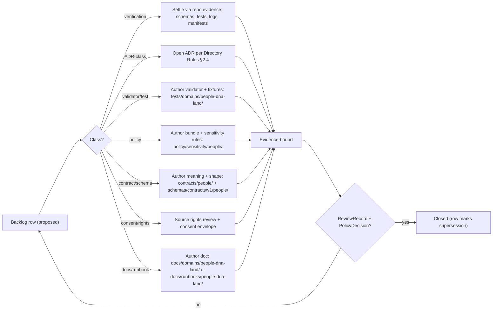
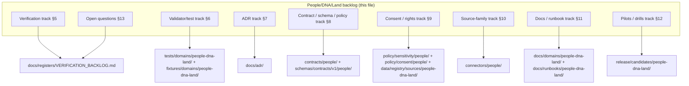

<!-- [KFM_META_BLOCK_V2]
doc_id: kfm://doc/people-dna-land/expansion-backlog
title: People / DNA / Land — Expansion Backlog
type: standard
version: v0.2
status: draft
owners: [TODO: Domain steward — People/DNA/Land] ; [TODO: Sensitivity reviewer] ; [TODO: Rights-holder representative] ; [TODO: Docs steward]
created: 2026-05-18
updated: 2026-06-07
policy_label: restricted-by-default
related:
  - ../../doctrine/directory-rules.md          # Directory Rules v1.3
  - ../../../ai-build-operating-contract.md     # CONTRACT_VERSION = "3.0.0"
  - ./DATA_LIFECYCLE.md
  - ./DEFINITION_OF_DONE.md
  - ./DNA_HANDLING.md
  - ../../standards/PROV.md
  - ../../registers/VERIFICATION_BACKLOG.md
  - kfm://atlas/domains-v1.1/ch16
  - kfm://atlas/domains-v1.1/ch24.12
  - kfm://atlas/domains-v1.1/ch24.13
  - kfm://pass10/c9
  - kfm://pass10/c6
tags: [kfm, domain, people-dna-land, backlog, governance, sensitivity]
notes:
  - CONTRACT_VERSION = "3.0.0" pinned per ai-build-operating-contract.md v3.0.
  - PROPOSED paths; mounted-repo presence NEEDS VERIFICATION.
  - Living-person, DNA-derived, raw kit/vendor IDs, DNASegment, and private person-parcel joins are T4 (denied) by default.
  - SLUG CONFLICT (OQ-PDL-SLUG-01): docs lane `people-dna-land` is CONFIRMED in Directory Rules v1.3 §6.1; responsibility-root slug is `people` per Atlas §24.13. The two diverge; ADR pending. Both forms appear below, each labeled.
  - ADR-S NUMBERING CONFLICT (OQ-PDL-ADR-NUM-01): the corpus carries two different ADR-S-* lists (Atlas §24.12 / Directory Rules §18.c vs Unified Doctrine §49). The same number (e.g. ADR-S-08) means different things in each. Cross-refs below cite the source list explicitly.
  - Consent terms are ConsentGrant + RevocationReceipt (Atlas ubiquitous language); DNA-overlay cards also use ConsentManifest / revocation ledger / DNAKitToken (naming reconciliation OPEN — see DNA_HANDLING.md OQ-PEOPLE-DNA-NAME-01).
  - Owners are placeholders pending CODEOWNERS resolution.
[/KFM_META_BLOCK_V2] -->

# People / DNA / Land — Expansion Backlog

> The forward-looking, priority-tagged work register for the People, Genealogy, DNA, and Land Ownership domain. Each item names what would settle it, where it would land, and what invariant it protects.


**Status:** `draft` · **Owners:** `[Domain steward — TODO]` · `[Sensitivity reviewer — TODO]` · `[Rights-holder rep — TODO]` · **Last reviewed:** `2026-06-07`

> [!IMPORTANT]
> **This file is a backlog, not a roadmap commitment.** Items are PROPOSED until each one is opened against current repository evidence (mounted files, schemas, tests, workflows, policies, release manifests). Nothing here promotes a path, schema, route, or policy. Promotion remains a governed state transition — never a backlog entry alone.

> [!WARNING]
> **Two unresolved naming conflicts pervade this file.** (1) **Slug drift** — the human-facing docs lane is `people-dna-land` (CONFIRMED in Directory Rules v1.3 §6.1), but the responsibility-root slug for `contracts/`, `schemas/`, `policy/`, and `connectors/` is `people` (Atlas §24.13). (2) **ADR-S numbering** — the corpus carries two different `ADR-S-*` lists (Atlas §24.12 vs Unified Doctrine §49) in which the same number means different things. Both are tracked in [§13](#13-open-questions-register); every affected reference below names which it means.

-----

## Quick jump

- [1. Scope and what this file is](#1-scope-and-what-this-file-is)
- [2. How to read this backlog](#2-how-to-read-this-backlog)
- [3. Invariants this backlog must not weaken](#3-invariants-this-backlog-must-not-weaken)
- [4. Backlog flow](#4-backlog-flow)
- [5. Verification track (from Atlas Ch. 16 §N)](#5-verification-track-from-atlas-ch-16-n)
- [6. Validator, test, and fixture track (from Atlas Ch. 16 §K)](#6-validator-test-and-fixture-track-from-atlas-ch-16-k)
- [7. ADR / architecture track](#7-adr--architecture-track)
- [8. Contract, schema, and policy track](#8-contract-schema-and-policy-track)
- [9. Consent, rights, and sensitivity track](#9-consent-rights-and-sensitivity-track)
- [10. Source-family and connector track](#10-source-family-and-connector-track)
- [11. Documentation and runbook track](#11-documentation-and-runbook-track)
- [12. Pilots and drills track](#12-pilots-and-drills-track)
- [13. Open questions register](#13-open-questions-register)
- [14. Cross-references](#14-cross-references)
- [15. Related docs](#15-related-docs)

-----

## 1. Scope and what this file is

This file is the **People / DNA / Land expansion backlog** — the consolidated register of verification items, validators, ADRs, schemas, policies, runbooks, and pilots that the domain still owes before its public surfaces can be treated as governed.

**What this domain owns** (CONFIRMED / PROPOSED, per Atlas Ch. 16 §B):

`Person Assertion` · `Person Identity Candidate` · `Genealogy Relationship` · `FamilyGroup` · `LifeEvent` · `Residence Event` · `Migration Event` · `Land Ownership Assertion` · `Deed Instrument` · `Title Instrument` · `Assessor Record` · `TaxRecord` · `Parcel Version` · `Ownership Interval` · `DNA Match Evidence` · `Relationship Hypothesis`. [DOM-PEOPLE] [ENCY]

**What this domain explicitly does not own** (CONFIRMED / PROPOSED, per Atlas Ch. 16 §B):

Settlements, Roads/Rail, Archaeology, Hydrology, Agriculture, Hazards, and Spatial Foundation provide context but do not weaken living-person, DNA, title, or parcel-boundary controls. [DOM-PEOPLE] [ENCY]

**What this file is not.** It is not a release plan, a list of features, or a substitute for ADRs, schemas, validators, fixtures, ReleaseManifests, or ReviewRecords. Each row here is a *candidate* for governance work; promotion of any candidate requires the artifacts named under “Evidence that would settle it.”

> [!NOTE]
> **Placement basis.** `docs/domains/people-dna-land/` is the responsibility-rooted home for human-facing documentation of this domain. The docs-lane slug `people-dna-land` is **CONFIRMED** — it is listed explicitly in the Directory Rules v1.3 §6.1 `docs/domains/` tree. **Mounted-repo presence of the directory itself remains NEEDS VERIFICATION.** The non-docs responsibility roots use the slug `people` (see [§8](#8-contract-schema-and-policy-track)). [DIRRULES §6.1] [Atlas §24.13]

[Back to top ↑](#quick-jump)

-----

## 2. How to read this backlog

### 2.1 Truth labels

|Label                 |Meaning in this file                                                                                                                                                |
|----------------------|--------------------------------------------------------------------------------------------------------------------------------------------------------------------|
|**CONFIRMED**         |Verified in this session from attached KFM doctrine (Atlas v1.1, Directory Rules v1.3, Pass-10, Encyclopedia, Unified Build Manual).                                |
|**PROPOSED**          |Design, recommendation, path, placement, or candidate not yet verified against mounted-repo evidence.                                                               |
|**NEEDS VERIFICATION**|Checkable, but not yet checked strongly enough to act as fact.                                                                                                      |
|**CONFLICTED**        |Sources disagree, or doctrine and a sibling artifact appear inconsistent; held until an ADR or drift-register entry resolves it.                                    |
|**UNKNOWN**           |Not resolvable without more evidence than this docs-only session provides.                                                                                          |
|**EXTERNAL**          |Sourced from an authoritative external standard (e.g., GA4GH, GEDCOM-X, NIST SP 800-226) as attested in project knowledge. Never used to make KFM repo-state claims.|

### 2.2 Priority

`H` = blocking other work or governing a deny-by-default lane. `M` = important; sequenced after H. `L` = valuable; lower leverage.

### 2.3 Status lifecycle for backlog rows

```text
proposed  →  triaged  →  in-flight  →  evidence-bound  →  closed
                                                     ↘
                                                       deferred (with reason)
```

Closure requires the artifact named under “Evidence that would settle it” to exist and to be cited.

> [!NOTE]
> **Sibling docs now in flight.** Three companion documents have been drafted this sprint: `DATA_LIFECYCLE.md` (v2), `DEFINITION_OF_DONE.md`, and `DNA_HANDLING.md`. Rows below that those docs partially satisfy are marked `in-flight` rather than `proposed`; none is `closed` until reviewed and linked with an approved `GENERATED_RECEIPT.json`.

[Back to top ↑](#quick-jump)

-----

## 3. Invariants this backlog must not weaken

CONFIRMED doctrine: nothing in this backlog reduces, bypasses, or pre-empts the following.

|Invariant                                                                |Source                 |What it means here                                                                                            |
|-------------------------------------------------------------------------|-----------------------|--------------------------------------------------------------------------------------------------------------|
|RAW → WORK/QUARANTINE → PROCESSED → CATALOG/TRIPLET → PUBLISHED          |[DIRRULES] [ENCY]      |Backlog items propose work *inside* the lifecycle; none of them shortcut it.                                  |
|Public clients use governed APIs, not canonical/internal stores          |[DIRRULES] [ENCY] [GAI]|No backlog item exposes RAW, WORK, or QUARANTINE to a public route.                                           |
|Cite-or-abstain                                                          |[GAI] [ENCY]           |A People/DNA/Land claim either resolves an EvidenceRef to an EvidenceBundle or returns ABSTAIN / DENY / ERROR.|
|Living-person and DNA-derived outputs are denied or restricted by default|[DOM-PEOPLE] [ENCY] §I |Default tier is T4; promotion is consent-bound, review-bound, and reversible.                                 |
|Raw kit/vendor IDs and DNA segments are not public                       |[DOM-PEOPLE] [ENCY] §I |No transform releases raw genotype calls or kit identifiers to T0 or T1.                                      |
|Assessor / tax records and parcel geometry are not title truth           |[DOM-PEOPLE] [ENCY] §I |Source-role boundary preserved; no upcast from assessor to title.                                             |
|Promotion is a governed state transition, not a file move                |[DIRRULES]             |Backlog closure ≠ release.                                                                                    |
|Separation of duties for policy-significant release                      |[Atlas §24.7]          |Author cannot also approve sensitive-lane release.                                                            |


> [!WARNING]
> **Source-role anti-collapse.** Aggregate, administrative, modeled, candidate, and synthetic records each carry distinct source roles in this domain. A row in this backlog that would let any of these *become* an observed per-place claim **must** be marked PROPOSED-with-tradeoff and routed to an ADR before any schema or validator work begins. (See Atlas §24.1.) [DOM-PEOPLE] [ENCY]

[Back to top ↑](#quick-jump)

-----

## 4. Backlog flow

How a row moves from this file to closed governance work. **PROPOSED** flow; concrete tooling NEEDS VERIFICATION.



> [!NOTE]
> Closure requires a cited artifact, not a self-attestation. “We wrote a doc” is not closure unless the doc resolves an EvidenceRef the backlog row depends on, or unless it is the deliverable itself (e.g., the consent runbook).

[Back to top ↑](#quick-jump)

-----

## 5. Verification track (from Atlas Ch. 16 §N)

CONFIRMED: Atlas v1.1 Ch. 16 §N lists five domain verification items, each blocked on the same evidence class — mounted repo files, schemas, registry entries, tests, logs, emitted artifacts, review records, or release manifests. [DOM-PEOPLE] [ENCY]

|ID          |Item to verify                                    |Why it matters                                                                                                                   |Evidence that would settle it                                                                         |Priority|Status                                                      |
|------------|--------------------------------------------------|---------------------------------------------------------------------------------------------------------------------------------|------------------------------------------------------------------------------------------------------|--------|------------------------------------------------------------|
|**V-PDL-01**|Verify living-person policy.                      |Default-deny posture on living-person fields is the load-bearing rule for this domain.                                           |Mounted policy bundle under `policy/sensitivity/people/`; policy fixtures; tests; PolicyDecision logs.|H       |NEEDS VERIFICATION                                          |
|**V-PDL-02**|Verify DNA consent / revocation enforcement.      |Consent revocation must produce a tombstone and invalidate embargo caches without leaving derivatives addressable.               |GA4GH-aware consent envelope; revocation endpoint logs; tombstone records; ReviewRecord.              |H       |NEEDS VERIFICATION (design captured in `DNA_HANDLING.md` §5)|
|**V-PDL-03**|Verify land instrument chain logic.               |Chain-of-title reasoning must surface gaps explicitly; legal-description parsing must not silently fill them.                    |Schema for chain-of-title; gap-detection tests; assertion-evidence tests.                             |M       |NEEDS VERIFICATION                                          |
|**V-PDL-04**|Verify geometry-role boundary logic.              |Parcel geometry, assessor parcel, and title boundary are distinct objects; none may be silently upcast to another.               |Source-role enum coverage tests; `role_authority` validator; geometry-scope guard.                    |H       |NEEDS VERIFICATION                                          |
|**V-PDL-05**|Verify UI / API restricted field no-leak behavior.|Restricted fields must never reach a public response, an Evidence Drawer payload, or an AI surface — including in error messages.|Side-channel audit tests; AIReceipt evaluator; Focus Mode citation evaluator.                         |H       |NEEDS VERIFICATION                                          |

Closure for any V-PDL-* row produces a row in `docs/registers/VERIFICATION_BACKLOG.md` with a forward link to the evidence.

[Back to top ↑](#quick-jump)

-----

## 6. Validator, test, and fixture track (from Atlas Ch. 16 §K)

CONFIRMED: Atlas v1.1 Ch. 16 §K names seven PROPOSED validator and test classes for this domain. [DOM-PEOPLE] [ENCY] All rows below are PROPOSED until authored under `tests/domains/people-dna-land/` and `fixtures/` (or `tests/fixtures/`) per Directory Rules §6.6.

> [!NOTE]
> Test/fixture homes below use the docs-lane slug `people-dna-land`. Whether the `tests/` and `fixtures/` segments should instead follow the `people` responsibility-root slug is part of the slug-drift question `OQ-PDL-SLUG-01`. [DIRRULES] [Atlas §24.13]

|ID          |Validator / test class                         |Protects which invariant                                                                 |Suggested home (PROPOSED)                                  |Priority|
|------------|-----------------------------------------------|-----------------------------------------------------------------------------------------|-----------------------------------------------------------|--------|
|**T-PDL-01**|Person-assertion evidence tests.               |Cite-or-abstain on every Person Assertion; assertion-first model.                        |`tests/domains/people-dna-land/contracts/person-assertion/`|H       |
|**T-PDL-02**|GEDCOM import rights / living-flag tests.      |Living-person T4 default; rights checked at admission, not at render.                    |`tests/domains/people-dna-land/connectors/gedcom/`         |H       |
|**T-PDL-03**|DNA consent and raw-ID no-log tests.           |Raw kit IDs and DNASegment are never logged, even on error paths.                        |`tests/domains/people-dna-land/dna/no-log/`                |H       |
|**T-PDL-04**|Revocation cleanup tests.                      |Consent revocation invalidates derivatives, tiles, graph projections, and embargo caches.|`tests/domains/people-dna-land/consent/revocation/`        |H       |
|**T-PDL-05**|Legal-description and chain-of-title gap tests.|Gaps in chain surfaced as ABSTAIN, not papered over.                                     |`tests/domains/people-dna-land/land/chain-of-title/`       |M       |
|**T-PDL-06**|Assessor-as-title denial.                      |Assessor / tax records cannot be cited as title authority.                               |`tests/domains/people-dna-land/land/source-role/`          |M       |
|**T-PDL-07**|Graph projection safety tests.                 |Triplet projections do not leak restricted fields via property paths or inferred edges.  |`tests/domains/people-dna-land/graph/safety/`              |H       |

<details>
<summary><strong>Fixture families needed (PROPOSED)</strong></summary>

|Fixture family                  |Purpose                                                                                                     |Notes                                                                                 |
|--------------------------------|------------------------------------------------------------------------------------------------------------|--------------------------------------------------------------------------------------|
|`valid/person-assertion/`       |Golden Person Assertions with full evidence chains.                                                         |Must include at least one with `living = true` to exercise the T4 deny path.          |
|`valid/gedcom/`                 |GEDCOM 5.5 and GEDCOM-X samples with rights and living-flag variations.                                     |EXTERNAL: GEDCOM 5.5 / GEDCOM-X are the canonical interchange formats. [Pass-10 C9-01]|
|`valid/dna-match-evidence/`     |Synthetic match/segment records with consent variations.                                                    |Synthetic only; **no real kit data**. Reality Boundary Note required.                 |
|`valid/land-instrument/`        |Patents, deeds, mortgages, liens, easements with explicit `LegalDescription` and `LandInstrument` semantics.|Source-role distinct from assessor/tax samples.                                       |
|`invalid/source-role-upcast/`   |Negative fixtures attempting to upcast assessor → title or aggregate → per-place.                           |Validators must reject.                                                               |
|`invalid/consent-revoked/`      |Records whose consent has been revoked; tests assert tombstone presence and no derivative reachability.     |—                                                                                     |
|`invalid/restricted-field-leak/`|Negative fixtures that try to surface T4 fields via response, drawer, or AI path.                           |Side-channel-audit anchor.                                                            |

</details>

[Back to top ↑](#quick-jump)

-----

## 7. ADR / architecture track

CONFIRMED doctrine: per Directory Rules §2.4, certain decisions require an ADR before they are treated as canonical. The rows below are the **domain-specific** ADR candidates for People/DNA/Land. `ADR-PDL-*` are local candidate labels, not numbered Atlas backlog items; the “Maps to” column names the authoritative anchor where one exists. [DIRRULES] [ENCY]

> [!CAUTION]
> **ADR-S numbering is itself CONFLICTED (`OQ-PDL-ADR-NUM-01`).** The Atlas §24.12 / Directory Rules §18.c list and the Unified Doctrine §49 list assign the **same `ADR-S-*` numbers to different questions** — e.g., in Atlas §24.12 `ADR-S-08` is *Frontier Matrix cell semantics*, while in Unified §49 `ADR-S-08` is *promotion-gate A–G letter binding*. The “Maps to” column therefore names the **source list** explicitly. Do not treat a bare `ADR-S-NN` as unambiguous.

|ADR candidate |Question                                                                                                              |Why it is ADR-class                                                                                    |Maps to (named list)                                                                                                             |Priority|
|--------------|----------------------------------------------------------------------------------------------------------------------|-------------------------------------------------------------------------------------------------------|---------------------------------------------------------------------------------------------------------------------------------|--------|
|**ADR-PDL-01**|Consent envelope schema — reconcile JWT / OAuth introspection (RFC 7662) / GA4GH Passport / revocation.               |Spans schema home, policy, and runtime trust membrane.                                                 |No numbered Atlas item; **domain-specific candidate**. Adjacent: Pass-10 C9-04, C6-07.                                           |H       |
|**ADR-PDL-02**|DNA-segment retention rule (vendor-solvent vs distressed) and FamilySearch retention.                                 |Retention is a rights/sensitivity decision with cross-system consequences.                             |No numbered Atlas item; adjacent to Atlas §24.12 ADR-S-12 (connector cadence / quarantine recovery). Pass-10 C9-02, C9-03, C9-07.|H       |
|**ADR-PDL-03**|Source-role enum + assessor/title/parcel distinction within it.                                                       |Anti-collapse rule is doctrine-significant; this domain has the densest collapse risk.                 |**Atlas §24.12 ADR-S-04** (source-role vocabulary v1).                                                                           |H       |
|**ADR-PDL-04**|Tombstone vs erasure boundary (GDPR / right-to-be-forgotten; Tribal data policy).                                     |Explainability-vs-erasure tension is unresolved in the corpus.                                         |No numbered Atlas item; adjacent to Atlas §24.12 ADR-S-10 (stale-state) and ADR-S-11 (story/export receipt). Pass-10 C6-08.      |H       |
|**ADR-PDL-05**|Sensitivity tier rules specific to People/DNA/Land rows of T0–T4.                                                     |Tier rules govern release surfaces; corpus has T4 defaults but no domain-specific transform parameters.|**Atlas §24.12 ADR-S-05** (sensitivity tier scheme).                                                                             |H       |
|**ADR-PDL-06**|Graph / triplet projection safety — admitted property paths; field screening.                                         |Public graph surfaces are a leak vector if property paths bypass field-level policy.                   |No numbered Atlas item; adjacent to Atlas §24.12 ADR-S-14 (cross-lane join policy). Pass-10 C8-04.                               |M       |
|**ADR-PDL-07**|Decision-envelope route for `PeopleDNALandDecisionEnvelope` (governed-API route, finite outcomes, abstention reasons).|Atlas Ch. 16 §J marks the route as `route TBD` / UNKNOWN.                                              |No numbered Atlas item; domain-specific. Atlas Ch. 16 §J.                                                                        |M       |
|**ADR-PDL-08**|DUO version-update handling within long-running consent grants.                                                       |Consent semantics shift when DUO version rolls forward.                                                |No numbered Atlas item; adjacent to ADR-PDL-01. Pass-10 C9-04 open question.                                                     |M       |
|**ADR-PDL-09**|Reviewer separation-of-duties threshold for sensitive People/DNA release.                                             |Separation affects release authority; needs explicit threshold + tooling.                              |**Atlas §24.12 ADR-S-09** (reviewer SoD threshold).                                                                              |M       |


> [!CAUTION]
> ADR candidates are **not** ADRs. None of these rows constitutes an architectural decision. They are triage entries for `docs/adr/` per Directory Rules §2.4.

[Back to top ↑](#quick-jump)

-----

## 8. Contract, schema, and policy track

PROPOSED contract, schema, and policy work for this domain. Placement follows Directory Rules §6.3–§6.5 and §12. The default schema home is `schemas/contracts/v1/...` per **ADR-0001** (Directory Rules §6.4); NEEDS VERIFICATION in mounted repo. [DIRRULES]

> [!WARNING]
> **Responsibility-root slug is `people`, not `people-dna-land`.** Per Atlas §24.13, the canonical roots for this lane are `schemas/contracts/v1/people/`, `contracts/people/`, `policy/sensitivity/people/`, and `policy/consent/people/`. The earlier draft of this backlog used `…/people-dna-land/` for these roots; that is the slug-drift error tracked as `OQ-PDL-SLUG-01`. Paths below are corrected to `people`; the docs/test/data lanes retain `people-dna-land` pending ADR. [Atlas §24.13] [DEEP-RESEARCH slug-drift register]

### 8.1 Contracts (`contracts/people/`)

|ID          |Object family                                                                 |Contract owed                                                                                                                                                                     |Notes                                                                                                                |
|------------|------------------------------------------------------------------------------|----------------------------------------------------------------------------------------------------------------------------------------------------------------------------------|---------------------------------------------------------------------------------------------------------------------|
|**C-PDL-01**|`Person Assertion`                                                            |Field-level meaning; identity rule (`source_id + object_role + temporal_scope + normalized_digest`); temporal handling (source/observed/valid/retrieval/release/correction times).|PROPOSED identity rule per Atlas Ch. 16 §E.                                                                          |
|**C-PDL-02**|`PersonCanonical`                                                             |Resolution rule from Person Assertions; merge/split semantics; correction lineage; `Person Identity Candidate` as the mediating object.                                           |Resolution is policy-aware, not heuristic-only (DDD identity discipline).                                            |
|**C-PDL-03**|`DNA Match Evidence` + `DNASegment`                                           |Field-level meaning; T4-by-default tier; consent reference; no-public-path invariant.                                                                                             |Raw genotype calls never republished. [Pass-10 C9-03]                                                                |
|**C-PDL-04**|`DNAKitToken`                                                                 |Token semantics; revocation linkage; relationship to GA4GH AAI Passport claim and client-side HMAC match token.                                                                   |Token is reference, not authority.                                                                                   |
|**C-PDL-05**|`LegalDescription` · `LandInstrument` · `Deed Instrument` · `Title Instrument`|Field-level meaning; parser-version pin; uncertainty handling for metes-and-bounds.                                                                                               |Chain-of-title reasoning depends on stable LegalDescription parse.                                                   |
|**C-PDL-06**|`Assessor Record` · `TaxRecord` · `Parcel Version` · `Ownership Interval`     |Source-role distinctions; assessor-as-title denial; parcel geometry caveat.                                                                                                       |Parcel geometry is not title-boundary proof without source role and evidence. [DOM-PEOPLE]                           |
|**C-PDL-07**|`Genealogy Relationship` · `Relationship Hypothesis` · `FamilyGroup`          |Evidence-bound semantics; hypothesis stays hypothesis until consent + review.                                                                                                     |Hypotheses are never promoted to public truth without evidence.                                                      |
|**C-PDL-08**|`LifeEvent` · `Residence Event` · `Migration Event`                           |Event identity; temporal validity; uncertainty representation for migration paths.                                                                                                |Migration paths render with uncertainty in viewing products. [Atlas Ch. 16 §G]                                       |
|**C-PDL-09**|`ConsentGrant` · `RevocationReceipt`                                          |Consent grant + revocation semantics; TTL; status-list / ledger reference.                                                                                                        |Canonical terms per Atlas ubiquitous language; reconcile with overlay-card `ConsentManifest` vocabulary (ADR-PDL-01).|

### 8.2 Schemas (`schemas/contracts/v1/people/`)

|ID          |Schema                                                                                  |Backed by      |Status                                                  |
|------------|----------------------------------------------------------------------------------------|---------------|--------------------------------------------------------|
|**S-PDL-01**|`person-assertion.schema.json`                                                          |C-PDL-01       |PROPOSED                                                |
|**S-PDL-02**|`person-canonical.schema.json` · `person-identity-candidate.schema.json`                |C-PDL-02       |PROPOSED                                                |
|**S-PDL-03**|`dna-match-evidence.schema.json`                                                        |C-PDL-03       |PROPOSED                                                |
|**S-PDL-04**|`dna-segment.schema.json`                                                               |C-PDL-03       |PROPOSED                                                |
|**S-PDL-05**|`dna-kit-token.schema.json`                                                             |C-PDL-04       |PROPOSED                                                |
|**S-PDL-06**|`legal-description.schema.json`                                                         |C-PDL-05       |PROPOSED                                                |
|**S-PDL-07**|`land-instrument.schema.json`                                                           |C-PDL-05       |PROPOSED                                                |
|**S-PDL-08**|`assessor-record.schema.json`                                                           |C-PDL-06       |PROPOSED                                                |
|**S-PDL-09**|`tax-record.schema.json`                                                                |C-PDL-06       |PROPOSED                                                |
|**S-PDL-10**|`parcel-version.schema.json`                                                            |C-PDL-06       |PROPOSED                                                |
|**S-PDL-11**|`ownership-interval.schema.json`                                                        |C-PDL-06       |PROPOSED                                                |
|**S-PDL-12**|`genealogy-relationship.schema.json`                                                    |C-PDL-07       |PROPOSED                                                |
|**S-PDL-13**|`relationship-hypothesis.schema.json`                                                   |C-PDL-07       |PROPOSED                                                |
|**S-PDL-14**|`family-group.schema.json`                                                              |C-PDL-07       |PROPOSED                                                |
|**S-PDL-15**|`life-event.schema.json` / `residence-event.schema.json` / `migration-event.schema.json`|C-PDL-08       |PROPOSED                                                |
|**S-PDL-16**|`consent-grant.schema.json` / `revocation-receipt.schema.json`                          |C-PDL-09       |PROPOSED — receipt-home split is ADR-S-03 (Atlas §24.12)|
|**S-PDL-17**|`people-dna-land-decision-envelope.schema.json`                                         |Atlas Ch. 16 §J|PROPOSED — route TBD per ADR-PDL-07                     |

### 8.3 Policy (`policy/sensitivity/people/` and `policy/consent/people/`)

|ID          |Policy                            |Sensitivity tier                                                                                                                               |Notes                                                                        |
|------------|----------------------------------|-----------------------------------------------------------------------------------------------------------------------------------------------|-----------------------------------------------------------------------------|
|**P-PDL-01**|Living-person field denial.       |T4 default; aggregation gate → T1 per Atlas §24.5.2.                                                                                           |Closes V-PDL-01. `policy/sensitivity/people/`.                               |
|**P-PDL-02**|DNA-segment public denial.        |T4; no transform releases to T0 / T1; T3 only under explicit research agreement.                                                               |[Atlas §24.5.2] `policy/sensitivity/people/`.                                |
|**P-PDL-03**|Private person-parcel join denial.|T4; generalized parcel + de-identified person → T2 only.                                                                                       |Closes part of V-PDL-04 and V-PDL-05.                                        |
|**P-PDL-04**|Consent-revocation cleanup.       |Triggers tombstone + embargo invalidation + derivative invalidation; fail-closed on unreachable endpoint.                                      |Closes V-PDL-02; depends on ADR-PDL-01, ADR-PDL-04. `policy/consent/people/`.|
|**P-PDL-05**|Source-role guard.                |DENY assessor→title upcast, aggregate→per-place upcast, candidate→PUBLISHED edge.                                                              |Closes T-PDL-06.                                                             |
|**P-PDL-06**|AI-surface scope.                 |AI may summarize **released** People/DNA/Land EvidenceBundles only; ABSTAIN on insufficient evidence; DENY on policy/rights/sensitivity blocks.|[GAI] [DOM-PEOPLE]                                                           |
|**P-PDL-07**|Graph projection field-screen.    |Restricted fields screened at projection time, not at query time.                                                                              |Closes T-PDL-07.                                                             |

[Back to top ↑](#quick-jump)

-----

## 9. Consent, rights, and sensitivity track

EXTERNAL anchors (attested in project knowledge; cited, never used to make repo-state claims):

- **GEDCOM 5.5 / GEDCOM-X** — canonical genealogical interchange formats. [Pass-10 C9-01] (EXTERNAL)
- **FamilySearch API** — OAuth2 consent-scoped genealogical upstream; records token *fingerprint*, not the token; revocation triggers tombstones. [Pass-10 C9-02] (EXTERNAL)
- **DTC vendors (23andMe, AncestryDNA, MyHeritage)** — user-controlled inputs; raw genotype calls never republished; vendor solvency is a consent-relevant variable post-23andMe Ch. 11 (March 2025). [Pass-10 C9-03, C9-07] (EXTERNAL)
- **GA4GH AAI / Passports / DUO** — international consent and access-control framework. [Pass-10 C9-04] (EXTERNAL)
- **NIST SP 800-226 / EDPB Guidelines 01/2025** — differential-privacy and pseudonymisation frames. [Pass-10 C9-05] (EXTERNAL)
- **OAuth 2.0 token introspection (RFC 7662)** — shape consent tokens map to. [Pass-10 C6-07] (EXTERNAL)

|ID          |Work item                                                                                                                                                                                        |Anchor                             |Priority|
|------------|-------------------------------------------------------------------------------------------------------------------------------------------------------------------------------------------------|-----------------------------------|--------|
|**R-PDL-01**|Consent envelope schema (reconciling JWT / OAuth introspection / GA4GH Passport / revocation endpoint; reconcile `ConsentGrant`/`ConsentManifest`).                                              |ADR-PDL-01; Pass-10 C9-04, C6-07   |H       |
|**R-PDL-02**|FamilySearch retention policy aligned with GA4GH revocation semantics.                                                                                                                           |Pass-10 C9-02 expansion            |H       |
|**R-PDL-03**|DTC vendor-format compatibility matrix (versioned per vendor).                                                                                                                                   |Pass-10 C9-03 expansion            |M       |
|**R-PDL-04**|Per-vendor terms-of-service watcher.                                                                                                                                                             |Pass-10 C9-03 expansion            |M       |
|**R-PDL-05**|DUO compatibility profile and version-pin policy.                                                                                                                                                |Pass-10 C9-04; ADR-PDL-08          |M       |
|**R-PDL-06**|Differential-privacy epsilon defaults for People/DNA aggregates (county / tract / decadal); applied to aggregates only.                                                                          |Pass-10 C6-05, C9-05               |M       |
|**R-PDL-07**|Named redaction profiles applicable to People/DNA (k-anonymity for living-person overlays, default k=10 / cell≈500 m / fallback radius mask≈250 m; deterministic seeded jitter where applicable).|Pass-10 C6-02, C6-03, C6-06        |M       |
|**R-PDL-08**|Tombstone vs erasure boundary documented and aligned with applicable Tribal data policies and GDPR.                                                                                              |Pass-10 C6-08 expansion; ADR-PDL-04|H       |


> [!IMPORTANT]
> **Source-rights review is per-source, not per-batch.** The “Key source families” table in Atlas Ch. 16 §D marks rights and current terms as NEEDS VERIFICATION for *every* source family in this domain. R-PDL-* rows are not closed by a single rights-review pass; each named upstream needs its own review and an entry in `data/registry/sources/people-dna-land/`. [DOM-PEOPLE] [ENCY]

[Back to top ↑](#quick-jump)

-----

## 10. Source-family and connector track

CONFIRMED / PROPOSED source families (Atlas Ch. 16 §D). All rights and current terms are NEEDS VERIFICATION; sensitive joins fail closed. [DOM-PEOPLE] [ENCY]

|Source family                                                                                                    |Role posture                                                 |What this backlog owes                                                              |
|-----------------------------------------------------------------------------------------------------------------|-------------------------------------------------------------|------------------------------------------------------------------------------------|
|Vital / cemetery / burial / obituary / church / school / military / census / directory / court / probate records.|authority / observation / context / model — set at admission.|Connector + SourceDescriptor + rights review.                                       |
|GEDCOM / GEDZip / tree overlays.                                                                                 |observation / model (never `authority`).                     |GEDCOM-conformance reporter (Pass-10 C9-01 expansion); living-flag tests (T-PDL-02).|
|DNA vendor match CSV / segment / triangulation data.                                                             |observation / model.                                         |DTC vendor-format compatibility matrix (R-PDL-03); raw-ID no-log tests (T-PDL-03).  |
|Patent / deed / mortgage / lien / easement / lease / mineral / water / access / probate instruments.             |authority (instrument) / observation (derived claim).        |LegalDescription parser-version pin; chain-of-title gap tests (T-PDL-05).           |
|Assessor and tax-roll records.                                                                                   |observation / context (never `authority` for title).         |Assessor-as-title denial (T-PDL-06); P-PDL-05.                                      |
|Plat / survey / metes-and-bounds / PLSS / subdivision / derived geometry.                                        |authority (survey) / observation (parcel-version geometry).  |Geometry-role boundary tests (V-PDL-04).                                            |

<details>
<summary><strong>Connector authoring notes (PROPOSED)</strong></summary>

- Each connector belongs under `connectors/people/<source-family>/` per Directory Rules §6.5 / §7 (NEEDS VERIFICATION in mounted repo; slug `people` per Atlas §24.13).
- Every connector emits an `IngestReceipt`; rights and source-role are set at admission and **never edited in place** — corrections produce a new SourceDescriptor and a CorrectionNotice. [Atlas §24.1.3]
- DNA-vendor connectors must record the export-format version in the receipt so reproduction is deterministic across vendor format rolls. [Pass-10 C9-03]
- DNA-adjacent overlay connectors compute match tokens client-side (tenant-scoped HMAC) and do not send raw genotype to the server. [KFM-P17-PROG-0016]

</details>

[Back to top ↑](#quick-jump)

-----

## 11. Documentation and runbook track

|ID          |Doc owed                                                                                                                                                                                                                                                 |Suggested home                                                                                                           |Priority|Status                                            |
|------------|---------------------------------------------------------------------------------------------------------------------------------------------------------------------------------------------------------------------------------------------------------|-------------------------------------------------------------------------------------------------------------------------|--------|--------------------------------------------------|
|**D-PDL-01**|Per-domain Definition of Done (the gate matrix expressed as a checklist).                                                                                                                                                                                |`docs/domains/people-dna-land/DEFINITION_OF_DONE.md`                                                                     |H       |**in-flight** (drafted this sprint)               |
|**D-PDL-02**|Consent runbook (envelope, revocation, tombstone, embargo invalidation).                                                                                                                                                                                 |`docs/runbooks/people-dna-land/CONSENT_RUNBOOK.md` (PROPOSED — subfolder vs flat per Directory Rules §6.1.b / OPEN-DR-02)|H       |proposed (design captured in `DNA_HANDLING.md` §5)|
|**D-PDL-03**|Vendor-watch SOP (cadence, triggers, escalation; aligned with C9-07 23andMe scenario).                                                                                                                                                                   |`docs/runbooks/people-dna-land/VENDOR_WATCH_SOP.md` (PROPOSED)                                                           |H       |proposed                                          |
|**D-PDL-04**|Living-person review runbook.                                                                                                                                                                                                                            |`docs/runbooks/people-dna-land/LIVING_PERSON_REVIEW.md` (PROPOSED)                                                       |M       |proposed                                          |
|**D-PDL-05**|Rollback drill for People/DNA/Land releases (RollbackCard → CorrectionNotice → derivative invalidation).                                                                                                                                                 |`docs/runbooks/people-dna-land/ROLLBACK_DRILL.md` (PROPOSED)                                                             |M       |proposed                                          |
|**D-PDL-06**|Map and viewing products spec (person profile maps; residence/event timelines; migration paths with uncertainty; parcel context with warnings; chain-of-title summaries; instrument timeline views; restricted DNA/consent review; living-person review).|`docs/domains/people-dna-land/MAP_AND_VIEWING_PRODUCTS.md` (PROPOSED)                                                    |M       |proposed                                          |
|**D-PDL-07**|Cross-lane relation notes — what crosses to Settlements, Roads/Rail, Archaeology, Agriculture and what each relation preserves.                                                                                                                          |`docs/domains/people-dna-land/CROSS_LANE_RELATIONS.md` (PROPOSED)                                                        |L       |proposed                                          |
|**D-PDL-08**|DNA & genomic handling sub-policy.                                                                                                                                                                                                                       |`docs/domains/people-dna-land/DNA_HANDLING.md`                                                                           |H       |**in-flight** (drafted this sprint)               |
|**D-PDL-09**|Domain lifecycle reference.                                                                                                                                                                                                                              |`docs/domains/people-dna-land/DATA_LIFECYCLE.md`                                                                         |H       |**in-flight** (v2 drafted this sprint)            |


> [!NOTE]
> **Runbook subfolder convention NEEDS VERIFICATION.** Directory Rules v1.3 §18 OPEN-DR-02 flags `docs/runbooks/<domain>/` (Pattern A) vs flat naming (Pattern B) as an open ADR question, recommending Pattern A for any domain that already has a subfolder in flight. The rows above choose Pattern A to match `docs/runbooks/fauna/`; this may revert if the ADR lands on Pattern B. [DIRRULES §18 OPEN-DR-02]

[Back to top ↑](#quick-jump)

-----

## 12. Pilots and drills track

|ID           |Pilot / drill                                                                                                                                    |What it would prove                                                                                                                              |Priority|
|-------------|-------------------------------------------------------------------------------------------------------------------------------------------------|-------------------------------------------------------------------------------------------------------------------------------------------------|--------|
|**Pi-PDL-01**|Vendor-loss simulation tabletop using the 23andMe Chapter 11 scenario.                                                                           |Consent envelope, revocation, retention, and downstream invalidation work end-to-end when an upstream becomes distressed. [Pass-10 C9-03 / C9-07]|H       |
|**Pi-PDL-02**|GEDCOM-conformance reporter pilot on a real GEDCOM 5.5 + GEDCOM-X corpus, with rights and living-flag fixtures.                                  |T-PDL-02 + GEDCOM-conformance reporter (Pass-10 C9-01 expansion).                                                                                |M       |
|**Pi-PDL-03**|Rollback drill on a synthetic People/DNA/Land release: ReleaseManifest → RollbackCard → prior manifest restored → derivative invalidation logged.|Reversibility invariant. [ENCY Appendix E]                                                                                                       |M       |
|**Pi-PDL-04**|Side-channel audit drill (label / popup / response / AI-text leaks of T4 fields).                                                                |V-PDL-05; sensitive-content side-channel audit indicator. [Atlas §24.11.3]                                                                       |H       |
|**Pi-PDL-05**|Consent-revocation cascade drill: revoke at FamilySearch upstream → tombstone here → embargo cache invalidated → graph projection updated.       |Pass-10 C6-08 / C9-02.                                                                                                                           |M       |
|**Pi-PDL-06**|Chain-of-title gap exercise on a representative county set: assertion-evidence path produces ABSTAIN where chain breaks.                         |T-PDL-05.                                                                                                                                        |L       |

[Back to top ↑](#quick-jump)

-----

## 13. Open questions register

Questions explicitly not resolved by this document, to be tracked in `docs/registers/VERIFICATION_BACKLOG.md`. Drawn from Atlas Ch. 16 §N, Atlas Ch. 24.12, Pass-10 C9, and the sibling People/DNA/Land docs.

|#                    |Question                                                                                                                                                                                                                   |Source                                                        |Disposition                             |
|---------------------|---------------------------------------------------------------------------------------------------------------------------------------------------------------------------------------------------------------------------|--------------------------------------------------------------|----------------------------------------|
|**OQ-PDL-SLUG-01**   |Canonical lane slug across responsibility roots: docs `people-dna-land` (CONFIRMED §6.1) vs schema/policy `people` (Atlas §24.13). Must `data/`, `tests/`, `fixtures/`, `connectors/` follow `people` or `people-dna-land`?|Atlas §24.13; DIRRULES §6.1; deep-research slug-drift register|Open → ADR + `DRIFT_REGISTER.md`        |
|**OQ-PDL-ADR-NUM-01**|Two conflicting `ADR-S-*` numbering schemes (Atlas §24.12 vs Unified §49) assign the same number to different questions.                                                                                                   |Atlas §24.12; Unified §49                                     |Open → docs-steward reconciliation + ADR|
|**OQ-PDL-01**        |What consent schema reconciles JWT, GA4GH Passport, OAuth introspection, and revocation endpoints?                                                                                                                         |Pass-10 C9-04; C6-07                                          |Open → ADR-PDL-01                       |
|**OQ-PDL-02**        |How does KFM handle the case where a FamilySearch user dies and consent becomes ambiguous — embargo, surface, or escalate?                                                                                                 |Pass-10 C9-02                                                 |Open → policy + ADR                     |
|**OQ-PDL-03**        |Retention period for raw DTC files — vendor solvent vs distressed.                                                                                                                                                         |Pass-10 C9-03                                                 |Open → ADR-PDL-02                       |
|**OQ-PDL-04**        |How are DUO version updates handled in long-running consent grants?                                                                                                                                                        |Pass-10 C9-04                                                 |Open → ADR-PDL-08                       |
|**OQ-PDL-05**        |Boundary between tombstone and erasure for personal data (GDPR + applicable Tribal data policies).                                                                                                                         |Pass-10 C6-08                                                 |Open → ADR-PDL-04                       |
|**OQ-PDL-06**        |Differential-privacy epsilon values for county / tract / decadal People/DNA aggregates.                                                                                                                                    |Pass-10 C6-05, C9-05                                          |Open → R-PDL-06                         |
|**OQ-PDL-07**        |Does assessor-as-title denial exempt any administrative use case (e.g., notice purposes)?                                                                                                                                  |Atlas Ch. 16 §I                                               |Open → policy + steward review          |
|**OQ-PDL-08**        |Exact route name and DTO surface for `PeopleDNALandDecisionEnvelope`.                                                                                                                                                      |Atlas Ch. 16 §J — route TBD / UNKNOWN                         |Open → ADR-PDL-07                       |
|**OQ-PDL-09**        |Domain-specific sensitivity rubric, or one rubric + domain rules? Relationship of Atlas T0–T4 to Pass-10 0–5 `sensitivity_rank`.                                                                                           |Pass-10 C6-01; Atlas §24.5                                    |Open → ADR-PDL-05 (Atlas ADR-S-05)      |
|**OQ-PDL-10**        |How to communicate chain-of-title gaps in viewing products without inviting confident readings of an incomplete chain?                                                                                                     |Atlas Ch. 16 §G; T-PDL-05                                     |Open → D-PDL-06                         |

[Back to top ↑](#quick-jump)

-----

## 14. Cross-references



> [!NOTE]
> Target paths above mix the `people` responsibility-root slug (contracts/schemas/policy/connectors) and the `people-dna-land` docs/data lane slug, reflecting the unresolved `OQ-PDL-SLUG-01`. All paths are PROPOSED per Directory Rules; mounted-repo presence NEEDS VERIFICATION.

[Back to top ↑](#quick-jump)

-----

## 15. Related docs

- [`../../doctrine/directory-rules.md`](../../doctrine/directory-rules.md) — Directory Rules v1.3; placement authority (responsibility roots, lifecycle, compatibility roots).
- [`../../../ai-build-operating-contract.md`](../../../ai-build-operating-contract.md) — operating contract v3.0 (`CONTRACT_VERSION = "3.0.0"`).
- [`./DATA_LIFECYCLE.md`](./DATA_LIFECYCLE.md) — domain lifecycle, tiers, receipts (sibling; in-flight).
- [`./DEFINITION_OF_DONE.md`](./DEFINITION_OF_DONE.md) — per-domain promotion-readiness checklist (sibling; in-flight; closes D-PDL-01).
- [`./DNA_HANDLING.md`](./DNA_HANDLING.md) — DNA & genomic handling sub-policy (sibling; in-flight; closes D-PDL-08).
- [`../../standards/PROV.md`](../../standards/PROV.md) — provenance standard alignment; naming variance vs `PROVENANCE.md` flagged in Directory Rules §18 OPEN-DR-01.
- [`../../registers/VERIFICATION_BACKLOG.md`](../../registers/VERIFICATION_BACKLOG.md) — where V-PDL-* rows land at closure (PROPOSED path; NEEDS VERIFICATION).
- [`../../adr/`](../../adr/) — home for ADR-PDL-* candidates (PROPOSED path; NEEDS VERIFICATION).
- [`../../runbooks/people-dna-land/`](../../runbooks/people-dna-land/) — runbook home for D-PDL-02..05 (PROPOSED — subfolder convention NEEDS VERIFICATION).
- *(TODO)* `./README.md` — People/DNA/Land domain landing doc.
- *(TODO)* `./MAP_AND_VIEWING_PRODUCTS.md` — viewing products spec (D-PDL-06).
- *(TODO)* `./CROSS_LANE_RELATIONS.md` — cross-lane relation notes (D-PDL-07).

-----

**Last reviewed:** 2026-06-07 · **Edition:** v0.2 (draft) · **CONTRACT_VERSION:** 3.0.0 · [Back to top ↑](#quick-jump)