<!-- [KFM_META_BLOCK_V2]
doc_id: kfm://doc/people-dna-land/expansion-plan
title: People · Genealogy · DNA · Land — Domain Expansion Plan
type: standard
version: v2
status: draft
owners: [TODO: People/DNA/Land domain steward] ; [TODO: Sensitivity reviewer] ; [TODO: Rights-holder representative] ; [TODO: Release authority]
created: 2026-05-18
updated: 2026-06-07
policy_label: public
related:
  - ./DATA_LIFECYCLE.md
  - ./DEFINITION_OF_DONE.md
  - ./DNA_HANDLING.md
  - ./EXPANSION_BACKLOG.md
  - ../README.md                                  # NEEDS VERIFICATION (presence)
  - ../../doctrine/directory-rules.md             # Directory Rules v1.3 (CONFIRMED, attached corpus)
  - ../../../ai-build-operating-contract.md        # CONTRACT_VERSION = "3.0.0"
  - ../../doctrine/lifecycle-law.md               # NEEDS VERIFICATION (presence)
  - ../../doctrine/trust-membrane.md              # NEEDS VERIFICATION (presence)
  - ../../standards/PROV.md                       # CONFIRMED authored prior session
  - ../../registers/VERIFICATION_BACKLOG.md       # NEEDS VERIFICATION (presence)
  - ../../registers/DRIFT_REGISTER.md             # NEEDS VERIFICATION (presence)
tags: [kfm, domain, people, genealogy, dna, land, ownership, sensitivity, deny-default]
notes:
  - CONTRACT_VERSION = "3.0.0" pinned per ai-build-operating-contract.md v3.0.
  - CORRECTION vs v1: the KFM-wide first proof-bearing thin slice is HYDROLOGY (Atlas §21 Phase 5; Build Manual Phase 3). People/DNA/Land is a Phase-12 sensitive-lane staged build (default DENY). The deceased-person story in §4 is this lane's first *internally releasable* slice — PROPOSED design synthesis, NOT a CONFIRMED ENCY definition. See §4 and §13 OPEN-PDL-13.
  - SLUG CONFLICT (OPEN-PDL-01): docs lane `people-dna-land` is CONFIRMED in Directory Rules v1.3 §6.1; responsibility-root slug is `people` per Atlas §24.13. Both forms appear below, each labeled.
  - GATE-LETTER NOTE: v1 invented domain gate labels A–E; two real A–G matrices already exist in the corpus (Pass-10 C5-01 vs Build-Manual §6.2 / Unified §8) and disagree on letters. §3/§10 now reference gate intent, not a third lettering. See sibling DATA_LIFECYCLE.md §5.
  - Consent terms are ConsentGrant + RevocationReceipt (Atlas ubiquitous language).
  - All implementation-layer path claims are PROPOSED until checked against a mounted repo.
[/KFM_META_BLOCK_V2] -->

# People · Genealogy · DNA · Land — Domain Expansion Plan

> Governed, assertion-first expansion of KFM’s most sensitivity-loaded domain: people, families, residences, migrations, land instruments, ownership intervals, and (restricted) DNA evidence. Build the governance spine first; release nothing public until evidence, policy, review state, and rollback all close.

-critical)

|Field                       |Value                                                                                          |
|----------------------------|-----------------------------------------------------------------------------------------------|
|**Status**                  |Draft (governance-first; no public release planned in this expansion alone)                    |
|**Owners**                  |`TODO` — People/DNA/Land domain stewards (placeholder pending steward register entry)          |
|**Last updated**            |2026-06-07                                                                                     |
|**Source basis**            |`[DOM-PEOPLE]`, `[ENCY]`, `[DIRRULES]` (v1.3), `[GAI]`, `[UNIFIED]`, Pass-10 Category C9       |
|**Default sensitivity tier**|**T4** — living-person, DNA-derived, private person-parcel join (deny-default)                 |
|**KFM-wide build position** |**Phase 12** (sensitive-lane staged builds, default DENY) per Atlas §21 / Build Manual Phase 10|

> [!IMPORTANT]
> This is a **plan**, not an implementation claim. Every path, schema name, route, validator, fixture, and CI gate referenced below is **PROPOSED** until verified against a mounted repository. Doctrine claims grounded in attached KFM corpus are **CONFIRMED**; implementation-layer claims remain **PROPOSED / NEEDS VERIFICATION**. See §13.

> [!WARNING]
> **This lane is built late, on purpose.** The corpus build sequence places the **Hydrology** proof slice first (Atlas §21 Phase 5; Build Manual Phase 3) and People/DNA/Land **last among ingest lanes** (Build Manual Phase 10 #8; Atlas §21 Phase 12, “default DENY”). This plan therefore assumes the trust spine, governed API, Evidence Drawer, Focus Mode, and release/rollback machinery are already proven on a lower-sensitivity lane before any slice here begins. See [§4](#4-first-internally-releasable-slice).

-----

## Quick navigation

1. [Mission and scope](#1-mission-and-scope)
1. [Why this domain is different](#2-why-this-domain-is-different)
1. [Architecture at a glance](#3-architecture-at-a-glance)
1. [First internally releasable slice](#4-first-internally-releasable-slice)
1. [Expansion slices](#5-expansion-slices)
1. [Object families](#6-object-families)
1. [Source families and roles](#7-source-families-and-roles)
1. [Sensitivity tiers and deny-by-default](#8-sensitivity-tiers-and-deny-by-default)
1. [Responsibility-root plan](#9-responsibility-root-plan)
1. [Required gates, validators, receipts](#10-required-gates-validators-receipts)
1. [Cross-lane dependencies](#11-cross-lane-dependencies)
1. [Governed AI behavior](#12-governed-ai-behavior)
1. [Open verification items and ADR backlog](#13-open-verification-items-and-adr-backlog)
1. [Risk register](#14-risk-register)
1. [Acceptance criteria](#15-acceptance-criteria)
1. [Related docs](#16-related-docs)

-----

## 1. Mission and scope

**CONFIRMED doctrine / PROPOSED implementation.** The People/Genealogy/DNA/Land domain governs *assertion-first* person evidence, genealogy relationships, restricted DNA evidence, land instruments, ownership intervals, chain-of-title reasoning, consent, policy decisions, review, correction, graph projection, EvidenceBundle views, and rollback. `[DOM-PEOPLE]` `[ENCY]`

### 1.1 What this domain owns

`Person Assertion`, `Person Identity Candidate`, `Genealogy Relationship`, `FamilyGroup`, `LifeEvent`, `Residence Event`, `Migration Event`, `Land Ownership Assertion`, `Deed Instrument`, `Title Instrument`, `Assessor Record`, `TaxRecord`, `Parcel Version`, `Ownership Interval`, `DNA Match Evidence`, `Relationship Hypothesis`. `[DOM-PEOPLE]` `[ENCY]`

### 1.2 What this domain does *not* own

Settlements, Roads/Rail, Archaeology, Hydrology, Agriculture, Hazards, and Spatial Foundation provide **context** but **do not weaken** living-person, DNA, title, or parcel-boundary controls. `[DOM-PEOPLE]` `[ENCY]`

### 1.3 What this plan is for

This plan is the **expansion road** from doctrine to a buildable, releasable lane: it lays out this lane’s first releasable slice, the sequenced PROPOSED slices that follow, the responsibility-root layout the slices imply, and the gates each slice must pass before any artifact crosses the trust membrane.

> [!NOTE]
> This plan does **not** propose any T0 public release in its own scope. The lane’s first releasable slice releases a *historical deceased-person* story using public records only at T1; everything living-person, raw-DNA, or private person-parcel remains deny-by-default. See §4 and §8.

[⬆ Back to top](#quick-navigation)

-----

## 2. Why this domain is different

The People/DNA/Land lane is the **most ethically loaded** lane in KFM. Three properties make it different from every other domain:

1. **Sensitivity is not advisory; it is the default.** Living-person output, raw kit/vendor DNA identifiers, DNA segments, and private person-parcel joins are **denied by default** in the Atlas §20.5 Deny-by-Default Register; they become releasable only with explicit consent + policy + restricted authorized surface. `[DOM-PEOPLE]` `[ENCY §20.5]`
1. **Assertion-first, not record-first.** A person is not a primary key — a person is a *bundle of cited assertions* with confidence. GEDCOM trees, vendor matches, and online genealogies are **hypotheses**, not facts. Mistaken identity corrupts data (DDD identity discipline). `[DOM-PEOPLE]` `[ENCY]` `[DDD]`
1. **Title is not assessor data, and parcels are not boundaries.** Assessor and tax records describe a tax-roll view; parcel geometry is a *spatial version* of a parcel record. **Neither equals chain-of-title truth.** The domain owns the distinction; the UI must surface it. `[DOM-PEOPLE]` `[ENCY]`

> [!WARNING]
> Three failure modes that this plan must structurally prevent — not document away:
> 
> 1. **Living-person leak** — a record about a living individual reaches a public surface (popup, AI text, layer manifest, Evidence Drawer payload, tile).
> 1. **DNA segment leak** — raw DTC genotype or segment data crosses any boundary other than restricted-store-to-restricted-surface.
> 1. **Assessor-as-title collapse** — assessor or parcel geometry is rendered, summarized, or AI-generated *as if* it were authoritative title.

[⬆ Back to top](#quick-navigation)

-----

## 3. Architecture at a glance

**CONFIRMED doctrine / PROPOSED lane application.** The lane follows the standard KFM lifecycle and is **gated at every transition**. Promotion is a governed state transition, not a file move. `[DIRRULES]` `[DOM-PEOPLE]` `[ENCY]`

```mermaid
flowchart LR
    classDef gate fill:#fff7e6,stroke:#d97706,color:#7c2d12,stroke-width:1px;
    classDef store fill:#eef2ff,stroke:#4f46e5,color:#1e1b4b,stroke-width:1px;
    classDef deny fill:#fef2f2,stroke:#dc2626,color:#7f1d1d,stroke-width:1.5px;
    classDef public fill:#ecfdf5,stroke:#059669,color:#064e3b,stroke-width:1px;

    SRC(["Public records, census, deeds, patents, assessor/tax, GEDCOM, FamilySearch, DTC DNA"]):::store
    RAW[/"RAW — SourceDescriptor + hash"/]:::store
    WQ[/"WORK · QUARANTINE — schema · time · evidence · rights"/]:::store
    PROC[/"PROCESSED — EvidenceRef · ValidationReport"/]:::store
    CAT[/"CATALOG · TRIPLET — EvidenceBundle · graph projection"/]:::store
    PUB[/"PUBLISHED — ReleaseManifest · rollback"/]:::public

    G1{{"Admission gate: source role, rights, sensitivity"}}:::gate
    G2{{"Normalization gate: schema, identity, time"}}:::gate
    G3{{"Validation gate: evidence closure, PolicyDecision"}}:::gate
    G4{{"Catalog gate: catalog/proof closure, review state"}}:::gate
    G5{{"Release gate: release authority, correction + rollback"}}:::gate

    DENY[/"Deny-by-default: living-person · raw DNA · private person-parcel"/]:::deny

    SRC --> G1 --> RAW
    RAW --> G2 --> WQ
    WQ --> G3 --> PROC
    PROC --> G4 --> CAT
    CAT --> G5 --> PUB

    G1 -. fail .-> DENY
    G2 -. fail .-> DENY
    G3 -. fail .-> DENY
    G4 -. fail .-> DENY
    G5 -. fail .-> DENY
```

> [!NOTE]
> Diagram **CONFIRMED** in shape (matches the KFM lifecycle and the §H pipeline table for this domain in `[ENCY]` / `[DOM-PEOPLE]`). The gate **labels** above name lifecycle *transitions* (admission / normalization / validation / catalog / release) — they are **not** a third A–G gate lettering. The corpus already carries two A–G promotion-gate matrices that disagree on letters (Pass-10 C5-01 vs Build-Manual §6.2 / Unified §8); see sibling `DATA_LIFECYCLE.md` §5 and `OQ-PEOPLE-GATE-01` (ADR-S-08). This plan deliberately avoids inventing a competing lettering. `[Pass-10 C5-01]` `[BUILD-MANUAL §6.2]`

[⬆ Back to top](#quick-navigation)

-----

## 4. First internally releasable slice

> [!CAUTION]
> **Correction from v1.** The previous draft asserted this slice was “CONFIRMED in `[ENCY]`” as *the* People/DNA/Land first credible thin slice. That attribution is **withdrawn**: the corpus names **Hydrology** as the KFM-wide first proof-bearing thin slice (Atlas §21 Phase 5; Build Manual Phase 3; Atlas §24.13). People/DNA/Land is a **Phase-12 sensitive-lane staged build** (Atlas §21; Build Manual Phase 10 #8). The deceased-person story below is **PROPOSED design synthesis** — this lane’s first *internally releasable* slice once the spine is proven elsewhere — not a verbatim ENCY definition. Tracked as `OPEN-PDL-13`. `[ENCY §21]` `[UNIFIED Phase 3/10]` `[Atlas §24.13]`

### 4.1 Why this slice (for this lane)

A historical, deceased-person, public-records-only story is the right *first* releasable artifact **within this lane** because it:

- Exercises the **full pipeline** end-to-end (RAW → PUBLISHED) for one bounded case, in line with KFM’s reusable runtime-proof methodology (one domain, one query, instrument every stage). `[UNIFIED]`
- Touches **every doctrinal pressure point** at once: identity assertion, source role, evidence closure, sensitivity policy, review state, release manifest, correction path, rollback target.
- Releases **only** material the Deny-by-Default Register permits: public historical records, beyond a configurable death-date margin, no living relatives surfaced, no DNA touched, no private person-parcel joins. `[ENCY §20.5]`

### 4.2 PROPOSED scope of the slice

|Slice attribute     |PROPOSED specification                                                                                                                                     |Status                             |
|--------------------|-----------------------------------------------------------------------------------------------------------------------------------------------------------|-----------------------------------|
|Subject             |One historical deceased person, 19th-century Kansas, with documentable life events.                                                                        |PROPOSED                           |
|Sources             |Public census, public vital records (where legally public), public deeds / land patents, public obituary.                                                  |PROPOSED                           |
|Public outputs      |One person profile page (Evidence-Drawer-anchored), one residence/migration timeline, one land-assertion timeline.                                         |PROPOSED                           |
|Explicit non-outputs|Any living relative. Any DNA. Any unredacted private person-parcel join. Any AI-generated genealogy claim.                                                 |CONFIRMED constraint `[ENCY §20.5]`|
|Receipts            |`SourceDescriptor`, `EvidenceRef`, `EvidenceBundle`, `ValidationReport`, `RunReceipt`, `PolicyDecision`, `ReviewRecord`, `ReleaseManifest`, `RollbackCard`.|PROPOSED set                       |
|Rollback drill      |Demote the published profile back to T4 with a `CorrectionNotice`, then re-promote on review.                                                              |PROPOSED                           |

### 4.3 Exit criteria for the slice

- [ ] A `SourceDescriptor` exists for every source the slice cites. `[DOM-PEOPLE §H]`
- [ ] An `EvidenceRef` resolves to a closed `EvidenceBundle` for every public-facing claim. `[ENCY]`
- [ ] A `PolicyDecision` records the deny / allow / restrict outcome for each assertion. `[DOM-PEOPLE]`
- [ ] A `ReleaseManifest` ties the published artifact to its evidence, policy, and review state. `[ENCY Appendix E]`
- [ ] A `RollbackCard` is exercised by a drill that *demotes the published artifact* and *re-promotes it*. `[ENCY Appendix E]`
- [ ] A no-network fixture test reproduces the slice deterministically in CI. `[UNIFIED Phase 4]`

[⬆ Back to top](#quick-navigation)

-----

## 5. Expansion slices

**PROPOSED.** Multiple thin slices, not one thick one. Order is governance-led: each slice extends the trust membrane outward from the historical, evidence-rich, low-sensitivity center toward higher-sensitivity surfaces, and never the other way around. The seed-card guidance is explicit that the People/DNA/Land scope is too broad for one PR and **should be split into reversible slices**. `[KFM People-DNA-Land seed card]`

|#     |Slice                                                                                |What it adds                                                                                                                                                                        |What it still denies                                                                     |Sensitivity ceiling              |Status  |
|------|-------------------------------------------------------------------------------------|------------------------------------------------------------------------------------------------------------------------------------------------------------------------------------|-----------------------------------------------------------------------------------------|---------------------------------|--------|
|**S0**|**Historical deceased-person family/land story** (the first releasable slice from §4)|Person, residence, migration, land assertion, chain-of-title summary for one historical case.                                                                                       |Living persons, DNA of any kind, private person-parcel joins.                            |T1 public-safe                   |PROPOSED|
|**S1**|**Land instrument vs. assessor distinction inspector**                               |A UI that *visibly* distinguishes deed / patent / title instruments from assessor / tax / parcel-geometry records.                                                                  |Anything that could be read as title authority.                                          |T1                               |PROPOSED|
|**S2**|**GEDCOM / GEDCOM-X ingest with rights + living-flag guards**                        |GEDCOM 5.5 and GEDCOM-X parser; date-interval normalizer; place anchoring; living-flag enforcement; conformance reporter. `[C9-01]`                                                 |Any GEDCOM record where the living-flag is unresolved or rights are unclear → quarantine.|T2 reviewer                      |PROPOSED|
|**S3**|**FamilySearch upstream under OAuth2 + GA4GH**                                       |FamilySearch ingest with OAuth scope capture, `ConsentGrant`, GA4GH Passport fingerprint, tombstone + `RevocationReceipt` on revoke, embargo cache invalidation. `[C9-02]` `[C9-04]`|Republication of upstream records; any record whose consent has lapsed.                  |T3 restricted                    |PROPOSED|
|**S4**|**Restricted DNA review surface (steward-only)**                                     |Restricted authenticated surface for DTC `DNA Match Evidence`; raw-ID no-log; differential-privacy aggregates; k-anonymity for any living-individual signal. `[C9-03]` `[C9-05]`    |All public DNA outputs. All raw segments. All inferred living-relative claims.           |T4 → T3 only with named agreement|PROPOSED|
|**S5**|**Public-safe aggregate demography join (Frontier-Matrix-aware)**                    |County/tract-aggregated demographic context for historical periods, joined to Frontier Matrix cells with `AggregationReceipt`.                                                      |Any disaggregated, individual-identifying outputs.                                       |T1                               |PROPOSED|
|**S6**|**Correction-and-dispute view**                                                      |Public surface for filing corrections against published assertions; reviewer queue; demotion path; tombstone path.                                                                  |Direct edits to canonical evidence; uncited corrections.                                 |T1                               |PROPOSED|

> [!CAUTION]
> Skipping a slice — particularly S0 → S2 without S1, or anything → S4 — is a **doctrinal failure mode**. The slice order encodes the trust ladder, not a preference.

<b>Sequencing rationale (click to expand)</b>

- **S0 before everything** because no claim in this domain is releasable until the runtime stack can carry one deceased-person profile end-to-end with all gates — and only after the KFM-wide spine is already proven on Hydrology.
- **S1 immediately after S0** because the assessor-vs-title distinction is the most likely place the lane will be misread by users and by AI; the UI must teach the difference before the lane expands.
- **S2 before S3** because GEDCOM is the dominant supply for genealogy and the consent posture is simpler; FamilySearch adds OAuth + GA4GH plumbing that should ride on a working ingest. `[C9-01]` `[C9-02]`
- **S3 before S4** because the GA4GH consent infrastructure built for FamilySearch is a prerequisite for ingesting DTC raw genotypes safely. `[C9-04]` `[C9-03]`
- **S4 never reaches T1.** No transform releases raw DNA to public; T3 only under named research agreement. `[Atlas §24.5.2]`
- **S5 last among ingest slices** so demography joins are added only after the per-person trust path is proven.
- **S6 in parallel from S0 onward** because every published artifact needs a correction path on day one. `[ENCY Appendix E]`

[⬆ Back to top](#quick-navigation)

-----

## 6. Object families

**CONFIRMED terms (`[DOM-PEOPLE]`, `[ENCY]`) / PROPOSED field realizations** — schemas, identity rules, and on-disk shapes are PROPOSED until validated under ADR-0001 (schema-home rule).

|Object family                                            |Role in domain                                                                  |Identity rule (PROPOSED)                                    |Temporal distinction                                                            |
|---------------------------------------------------------|--------------------------------------------------------------------------------|------------------------------------------------------------|--------------------------------------------------------------------------------|
|`Person Assertion`                                       |A cited claim *about* a person (name, event, relation). Never the person itself.|source_id + person role + temporal_scope + normalized_digest|source / observed / valid / retrieval / release / correction times stay distinct|
|`PersonCanonical`                                        |The resolved identity, downstream of `Person Identity Candidate` reconciliation.|resolution-id + version                                     |versioned; never destructive                                                    |
|`Person Identity Candidate`                              |A hypothesis that two assertions describe the same person.                      |candidate-id; carries confidence                            |bitemporal: hypothesis time vs. claim time                                      |
|`NameAssertion`                                          |A name with source role, locale, and confidence.                                |name-digest + source                                        |observed / valid                                                                |
|`LifeEvent`                                              |Birth, marriage, death, court, naturalization, etc.                             |event-digest + source                                       |observed / valid                                                                |
|`Residence Event`                                        |Person at place at time, from a cited source.                                   |source + person + place + time                              |observed / valid                                                                |
|`Migration Event`                                        |A derived movement between residences, with uncertainty.                        |derived-id + window                                         |derived; uncertainty surfaced                                                   |
|`Genealogy Relationship` / `RelationshipAssertion`       |Parent-of, spouse-of, child-of, sibling-of — as assertion, not fact.            |source + relation + endpoints                               |observed / valid                                                                |
|`FamilyGroup`                                            |A grouping of related assertions.                                               |group-id                                                    |observed / valid                                                                |
|`Land Ownership Assertion`                               |A claim that a person held an interest in a parcel during an interval.          |source + interest + parcel-version + interval               |bitemporal                                                                      |
|`Deed Instrument` / `Title Instrument` / `LandInstrument`|Documentary instruments. Title-bearing.                                         |instrument-id + source                                      |instrument time                                                                 |
|`LegalDescription`                                       |Metes/bounds/PLSS/lot-block text.                                               |normalized-form + source                                    |source time                                                                     |
|`Assessor Record` / `TaxRecord`                          |Tax-roll view. **Not title truth.**                                             |source + record-id + year                                   |tax year                                                                        |
|`Parcel Version` / `LandParcel`                          |A *spatial version* of a parcel. **Not a boundary claim about title.**          |parcel-id + version                                         |geometry valid time                                                             |
|`Ownership Interval`                                     |The time window during which an ownership assertion holds.                      |assertion-id + window                                       |bitemporal                                                                      |
|`DNA Match Evidence` / `DNASegment` / `DNAKitToken`      |Restricted DNA artifacts. **T4 default.**                                       |kit + segment + match-id (opaque)                           |source time; restricted                                                         |
|`Relationship Hypothesis`                                |A DNA-derived or documentary-derived guess; never published as fact.            |hypothesis-id + sources                                     |hypothesis time                                                                 |
|`ConsentGrant` / `RevocationReceipt`                     |Consent envelope and its revocation.                                            |signed; TTL; ledger ref                                     |grant time / revocation time                                                    |
|`ReviewRecord`                                           |A steward decision recorded against any assertion or release.                   |reviewer + subject + decision                               |review time                                                                     |

[⬆ Back to top](#quick-navigation)

-----

## 7. Source families and roles

**CONFIRMED families (`[DOM-PEOPLE §D]`, `[ENCY]`, Pass-10 C9) / NEEDS VERIFICATION rights, terms, freshness.** Every source carries a **source role** that anti-collapse rules forbid blending (authority, observation, context, model). Rights are NEEDS VERIFICATION per source; sensitive joins fail closed.

|Source family                                                                             |Role(s)                                                   |Sensitivity (PROPOSED default)                                                                 |Rights / consent                                                          |Status                      |
|------------------------------------------------------------------------------------------|----------------------------------------------------------|-----------------------------------------------------------------------------------------------|--------------------------------------------------------------------------|----------------------------|
|Vital / cemetery / burial / obituary / church / school / military records                 |authority / observation                                   |T1 if public + deceased; T4 otherwise                                                          |source-vintage; **NEEDS VERIFICATION** per source                         |PROPOSED                    |
|Census (decennial / ACS / historical)                                                     |observation / context                                     |T1 if historical-public; T4 if living-individual disaggregated                                 |public per release rules                                                  |PROPOSED                    |
|GEDCOM 5.5 / GEDCOM-X / tree overlays                                                     |observation / model **(never authority)**                 |T2 default; T4 if living-flag unresolved                                                       |rights variable; living-flag enforcement required                         |PROPOSED `[C9-01]`          |
|FamilySearch API                                                                          |observation under OAuth2 + GA4GH                          |per-record consent scope; T4 default until proven otherwise                                    |OAuth2 scope captured; token fingerprint not token; revocation → tombstone|PROPOSED `[C9-02]` `[C9-04]`|
|DTC raw genomic exports (23andMe, AncestryDNA, MyHeritage)                                |observation / model (restricted)                          |**T4** — raw never republished; only DP/k-anonymized derivatives cross the publication boundary|consent + vendor-watch (23andMe Ch. 11)                                   |PROPOSED `[C9-03]` `[C9-07]`|
|Land patents (federal patent records)                                                     |authority                                                 |T1 (historical public)                                                                         |public                                                                    |PROPOSED                    |
|Deed / mortgage / lien / easement / lease / mineral / water / access / probate instruments|authority (instrument) / observation (derived claim)      |T1–T2 depending on rights & subjects                                                           |NEEDS VERIFICATION per source                                             |PROPOSED                    |
|Assessor and tax-roll records                                                             |observation / context **(not title)**                     |T1–T2                                                                                          |NEEDS VERIFICATION per county                                             |PROPOSED                    |
|Plat / survey / metes / bounds / PLSS / subdivision / derived geometry                    |authority (survey) / observation (parcel-version geometry)|T1–T2                                                                                          |NEEDS VERIFICATION                                                        |PROPOSED                    |
|GA4GH AAI / Passports / DUO                                                               |consent framework (not data)                              |n/a                                                                                            |required for any human-subject record                                     |PROPOSED `[C9-04]`          |

> [!IMPORTANT]
> The **source-role anti-collapse rule** holds the lane open: an assessor record is not a title instrument; a GEDCOM tree is not authority; a DNA match is not a relationship claim. Validators must refuse silent collapse. (Source roles are the four canonical roles `authority` / `observation` / `context` / `model`; the precise enum is ADR-S-04, Atlas §24.12.)

[⬆ Back to top](#quick-navigation)

-----

## 8. Sensitivity tiers and deny-by-default

**CONFIRMED tier scheme (`[Atlas §24.5]`) / per-object rows CONFIRMED in `[Atlas §24.5.2]`.** The lane’s working assumption is **T4 by default**, with explicit transforms required to demote.

|Object class                                  |Default tier      |Allowed transforms (Atlas §24.5.2)                           |Required gates                                   |
|----------------------------------------------|------------------|-------------------------------------------------------------|-------------------------------------------------|
|Living-person fields                          |**T4**            |Tract/county aggregation + `AggregationReceipt` → T1         |Consent or aggregation gate + `ReviewRecord`     |
|Raw DNA segment data                          |**T4**            |None to public; **T3 only** under named research agreement   |Named consent + `ReviewRecord` + `PolicyDecision`|
|`DNA Match Evidence` (relationship hypothesis)|**T4 / T3**       |Restricted steward surface only; never AI-summarized publicly|`PolicyDecision` + restricted access class       |
|Private person-parcel join                    |**T4**            |Generalized parcel + de-identified person → **T2 only**      |`RedactionReceipt` + `ReviewRecord`              |
|Historical deceased-person assertions         |T1 (with evidence)|n/a (public-safe when evidence + death-date margin pass)     |`EvidenceBundle` + `ReleaseManifest`             |
|Land patent / public deed instrument          |T1                |n/a                                                          |`EvidenceBundle` + `ReleaseManifest`             |
|Assessor / tax record                         |T1–T2             |UI must label “tax-roll view, not title”                     |UI policy + label receipt                        |
|Parcel geometry                               |T1–T2             |UI must label “geometry version, not boundary truth”         |UI policy + label receipt                        |

> [!WARNING]
> The combination *“living person × DNA × private join”* is a hard deny. **No transform** in this expansion plan permits any of those three to reach a T0 surface. Tier names are the Atlas-canonical set: T0 Open · T1 Generalized · T2 Reviewer · T3 Restricted · T4 Denied. `[Atlas §24.5.1]`

[⬆ Back to top](#quick-navigation)

-----

## 9. Responsibility-root plan

**PROPOSED placements**, derived from Directory Rules v1.3 §4–§6 (placement protocol + canonical roots) and the Atlas §24.13 crosswalk.

> [!WARNING]
> **Responsibility-root slug is `people`, not `people-dna-land` (OPEN-PDL-01).** Per Atlas §24.13, the canonical roots are `schemas/contracts/v1/people/`, `contracts/people/`, `policy/sensitivity/people/`, `policy/consent/people/`. Only the **docs lane** is `people-dna-land` (CONFIRMED in Directory Rules v1.3 §6.1). The v1 draft used `people-dna-land`/`people` inconsistently; paths below are corrected. The data/test/fixture/connector lane slug remains unsettled pending ADR. `[Atlas §24.13]` `[DIRRULES §6.1]`

|Responsibility root             |PROPOSED domain path                                                                                                                                                                                                                                                               |Purpose                                                                                      |
|--------------------------------|-----------------------------------------------------------------------------------------------------------------------------------------------------------------------------------------------------------------------------------------------------------------------------------|---------------------------------------------------------------------------------------------|
|`docs/`                         |`docs/domains/people-dna-land/`                                                                                                                                                                                                                                                    |Human-facing doctrine, this plan, runbooks, ADR pointers. (docs slug CONFIRMED §6.1)         |
|`control_plane/`                |`control_plane/source_authority_register.yaml`, `control_plane/domain_lane_register.yaml` (entries)                                                                                                                                                                                |Machine-readable lane index.                                                                 |
|`contracts/`                    |`contracts/people/`                                                                                                                                                                                                                                                                |Object **meaning** in Markdown — `Person Assertion`, `Land Ownership Assertion`, etc.        |
|`schemas/`                      |`schemas/contracts/v1/people/`                                                                                                                                                                                                                                                     |Machine **shape** — JSON Schema per object family. Per ADR-0001 default.                     |
|`policy/`                       |`policy/sensitivity/people/`, `policy/consent/people/`                                                                                                                                                                                                                             |Allow/deny/restrict/abstain + consent rules.                                                 |
|`tests/`                        |`tests/domains/people-dna-land/` *(slug NEEDS VERIFICATION — OPEN-PDL-01)*                                                                                                                                                                                                         |Validator and fixture-driven proofs (see §10).                                               |
|`fixtures/`                     |`fixtures/domains/people-dna-land/` *(slug NEEDS VERIFICATION)*                                                                                                                                                                                                                    |Valid / invalid samples for ingest, redaction, consent revoke, etc.                          |
|`connectors/`                   |`connectors/people/<source>/`                                                                                                                                                                                                                                                      |Source-specific fetchers (GEDCOM, FamilySearch, county-deed) — outputs into `data/raw/` only.|
|`pipelines/` / `pipeline_specs/`|`pipelines/domains/people-dna-land/`, `pipeline_specs/people-dna-land/` *(slug NEEDS VERIFICATION)*                                                                                                                                                                                |Executable pipeline + declarative specs.                                                     |
|`data/`                         |`data/{raw,work,quarantine,processed}/people-dna-land/`, `data/catalog/domain/people-dna-land/`, `data/triplets/people-dna-land/`, `data/published/layers/people-dna-land/`, `data/registry/sources/people-dna-land/`, `data/rollback/people-dna-land/` *(slug NEEDS VERIFICATION)*|Lifecycle artifacts. Public surfaces read **only** from `data/published/`.                   |
|`release/`                      |`release/candidates/people-dna-land/`, `release/manifests/people-dna-land/` *(slug NEEDS VERIFICATION)*                                                                                                                                                                            |Release decisions, correction notices, rollback cards.                                       |
|`apps/`                         |`apps/governed-api/` (lane routes)                                                                                                                                                                                                                                                 |Governed public surface. Never reads RAW / WORK / QUARANTINE.                                |
|`runtime/`                      |`runtime/people/` *(slug NEEDS VERIFICATION)*                                                                                                                                                                                                                                      |Local adapters / harnesses behind the governed API.                                          |

> [!NOTE]
> Every responsibility-root path above is **PROPOSED** and must be checked against a mounted repo before any move/create. The Directory Rules §3 invariant — “the responsibility root wins over the topic name” — applies: the domain is a **segment**, never a root.

[⬆ Back to top](#quick-navigation)

-----

## 10. Required gates, validators, receipts

**PROPOSED set (`[DOM-PEOPLE §K]`, `[ENCY]`).** No slice releases without the receipts and tests that match its lifecycle stage. Gate references use intent (admission / normalization / validation / catalog / release), not a lettered matrix; see §3 note and `DATA_LIFECYCLE.md` §5.

### 10.1 Validators (PROPOSED)

|Validator                                    |Slice introduced|What it proves                                                                                                                                        |
|---------------------------------------------|----------------|------------------------------------------------------------------------------------------------------------------------------------------------------|
|Person-assertion evidence test               |S0              |Every `Person Assertion` carries a resolvable `EvidenceRef`.                                                                                          |
|Living-flag enforcement test                 |S2              |No record where the living-flag is true or unresolved reaches T1.                                                                                     |
|GEDCOM import rights / conformance test      |S2              |Rights captured; deviations reported by GEDCOM-conformance reporter. `[C9-01]`                                                                        |
|DNA consent capture + raw-ID no-log test     |S4              |Raw `DNAKitToken`s never appear in any log, receipt, or AI prompt. `[C9-03]`                                                                          |
|Consent revocation cleanup test              |S3, S4          |Revoke event produces tombstone + `RevocationReceipt` + embargo cache invalidation; fail-closed on unreachable endpoint. `[C9-02]` `[C9-04]` `[C6-08]`|
|Legal-description and chain-of-title gap test|S0, S1          |Gaps in the chain are surfaced as ABSTAIN, not papered over.                                                                                          |
|Assessor-as-title denial test                |S0, S1          |Assessor data never renders, summarizes, or is AI-cited as title authority.                                                                           |
|Graph-projection safety test                 |S0–S6           |Triplet projection does not surface any deny-default field or stable living/genomic identifier.                                                       |
|Side-channel audit (label / popup / AI text) |S0–S6           |Public surfaces (Evidence Drawer, AI text, layer manifest) carry no leaked restricted fields. `[Atlas §24.11.3]`                                      |
|No-network fixture reproducibility           |All slices      |Slice runs deterministically in CI without network. `[UNIFIED Phase 4]`                                                                               |

### 10.2 Receipts (PROPOSED minimum per published artifact)

`SourceDescriptor` → `EvidenceRef` → `EvidenceBundle` → `ValidationReport` → `RunReceipt` → `PolicyDecision` → `ReviewRecord` (where required) → `ReleaseManifest` → `RollbackCard` → `CorrectionNotice` (on demotion). Consent-gated slices additionally require `ConsentGrant` (resolves on every dereference) and a reachable `RevocationReceipt` ledger.

### 10.3 Decision envelopes (PROPOSED)

Every governed-API or Focus-Mode surface for this domain returns a finite envelope: **ANSWER / ABSTAIN / DENY / ERROR**. AI surfaces additionally emit an `AIReceipt`. `[GAI]` `[DOM-PEOPLE §J]`

[⬆ Back to top](#quick-navigation)

-----

## 11. Cross-lane dependencies

**CONFIRMED relations (`[DOM-PEOPLE §F]`, `[Atlas §24.4.14]`) / PROPOSED implementation.** Cross-lane relations must preserve ownership, source role, sensitivity, and EvidenceBundle support.

|This domain    |Related lane      |Relation type                                              |Constraint                                                                                                                               |
|---------------|------------------|-----------------------------------------------------------|-----------------------------------------------------------------------------------------------------------------------------------------|
|People/DNA/Land|Settlements       |residence, cemetery, school, court, county, township, place|Residence events anchor settlement membership; **living-person fields fail closed.** `[Atlas §24.4.14]`                                  |
|People/DNA/Land|Roads / Rail      |migration, access, movement                                |Migration paths cite, never own, route geometry.                                                                                         |
|People/DNA/Land|Archaeology       |historic person, land, documentary, cultural-place context |Cultural affiliations cited with rights, sovereignty, steward review. `[Atlas §24.4.14]`                                                 |
|People/DNA/Land|Agriculture       |farm, land use, producer-adjacent context                  |`LandParcel` context may bound field-candidate joins; **private person-parcel joins denied by default.** `[Atlas §24.4.14]`              |
|People/DNA/Land|Frontier Matrix   |aggregated population observations feed matrix cells       |Matrix cells are analytical releases with their own evidence and rollback; this lane never edits matrix cells. `[Atlas §24.4.14/24.4.15]`|
|People/DNA/Land|Spatial Foundation|parcel geometry, place anchoring, geography versions       |Geometry versions are not title or boundary truth.                                                                                       |

[⬆ Back to top](#quick-navigation)

-----

## 12. Governed AI behavior

**CONFIRMED doctrine (`[GAI]`, `[DOM-PEOPLE §L]`, `[ENCY]`) / PROPOSED implementation.**

> [!IMPORTANT]
> AI in this lane is **interpretive, not authoritative**. AI never reads RAW or WORK; it reads only released `EvidenceBundle` projections. The EvidenceBundle outranks any generated language.

**What AI MAY do in this lane:**

- Summarize a released People/DNA/Land `EvidenceBundle`.
- Compare evidence across sources for a deceased historical person.
- Explain a chain-of-title gap, distinguishing assessor data from title data.
- Draft a steward-review note for an assertion under review.

**What AI MUST do:**

- **ABSTAIN** when evidence is insufficient or `EvidenceRef` does not resolve.
- **DENY** where policy, rights, sensitivity, or release state blocks the request.
- **Cite** every claim back to an `EvidenceBundle` projection.
- Emit an `AIReceipt` for every Focus Mode answer.

**What AI MUST NOT do:**

- Infer living-person identity, relationship, or location.
- Generate DNA relationship claims or describe raw segments.
- Equate assessor or parcel-geometry data with title.
- Summarize from RAW/WORK/QUARANTINE under any framing.

[⬆ Back to top](#quick-navigation)

-----

## 13. Open verification items and ADR backlog

**NEEDS VERIFICATION / UNKNOWN.** This plan does not assume any mounted repo. Items below are filed to `docs/registers/VERIFICATION_BACKLOG.md` (PROPOSED) and, where structural, to ADRs (per Directory Rules §2.4).

|#              |Item                                                                                                                                                                                                                            |Class                           |Status                                             |
|---------------|--------------------------------------------------------------------------------------------------------------------------------------------------------------------------------------------------------------------------------|--------------------------------|---------------------------------------------------|
|**OPEN-PDL-01**|Domain segment naming: docs `people-dna-land/` (CONFIRMED §6.1) vs responsibility-root `people/` (Atlas §24.13). Must `data/`, `tests/`, `fixtures/`, `pipelines/`, `release/`, `runtime/` follow `people` or `people-dna-land`?|ADR-class (Directory Rules §2.4)|UNKNOWN                                            |
|**OPEN-PDL-02**|Living-person screening policy: death-date margin, name-aware redaction, ageing-out triggers.                                                                                                                                   |Policy + ADR                    |NEEDS VERIFICATION                                 |
|**OPEN-PDL-03**|DNA consent + revocation enforcement: GA4GH Passport refresh cadence, tombstone latency budget, embargo-cache scope; consent-envelope reconciliation.                                                                           |Policy + ADR                    |NEEDS VERIFICATION `[C9-04]`                       |
|**OPEN-PDL-04**|Chain-of-title gap rules: when a gap fails the gate vs. is surfaced with uncertainty.                                                                                                                                           |Policy                          |NEEDS VERIFICATION                                 |
|**OPEN-PDL-05**|Geometry-role boundary: how the UI must label parcel-version vs. legal-description vs. PLSS.                                                                                                                                    |UI + Policy                     |NEEDS VERIFICATION                                 |
|**OPEN-PDL-06**|UI/API restricted-field no-leak invariant: side-channel audit cadence and pass/fail thresholds.                                                                                                                                 |Test + Policy                   |NEEDS VERIFICATION                                 |
|**OPEN-PDL-07**|GEDCOM-conformance test corpus + reject/warn thresholds.                                                                                                                                                                        |Test                            |NEEDS VERIFICATION `[C9-01]`                       |
|**OPEN-PDL-08**|FamilySearch retention policy aligned with GA4GH revocation semantics.                                                                                                                                                          |Policy + ADR                    |NEEDS VERIFICATION `[C9-02]`                       |
|**OPEN-PDL-09**|DTC vendor-watch SOP and vendor-loss tabletop (post-23andMe Chapter 11).                                                                                                                                                        |Runbook                         |NEEDS VERIFICATION `[C9-07]`                       |
|**OPEN-PDL-10**|Differential-privacy epsilon defaults for demographic / genealogical aggregates (aggregates only).                                                                                                                              |Policy + ADR                    |NEEDS VERIFICATION `[C9-05]`                       |
|**OPEN-PDL-11**|k-anonymity threshold for any aggregate that could touch a living individual (default k=10 / cell≈500 m / fallback radius mask≈250 m).                                                                                          |Policy                          |NEEDS VERIFICATION `[C9-05]` `[C6-06]`             |
|**OPEN-PDL-12**|Steward roles and separation of duties for promotion/rollback in this lane.                                                                                                                                                     |Governance                      |NEEDS VERIFICATION `[Atlas §24.7]`                 |
|**OPEN-PDL-13**|**(new)** First-slice attribution: is the deceased-person story a lane-internal design choice (PROPOSED) or does any doctrine name a People/DNA/Land first slice? Corpus names Hydrology KFM-wide.                              |Doctrine reconciliation         |CONFLICTED → settled by ENCY/UNIFIED re-read or ADR|
|**OPEN-PDL-14**|**(new)** Canonical A–G gate lettering (Pass-10 C5-01 vs Build-Manual §6.2 / Unified §8).                                                                                                                                       |Governance                      |Open → ADR-S-08 (Unified §49 numbering)            |

[⬆ Back to top](#quick-navigation)

-----

## 14. Risk register

**PROPOSED.** Cross-checked against `[Atlas §24.9]` (Failure Modes) and `[Atlas §24.10]` (Risk Register). Mitigation is structural, not procedural.

|Risk                                                                 |Likelihood|Severity        |Structural mitigation                                                                                                        |
|---------------------------------------------------------------------|----------|----------------|-----------------------------------------------------------------------------------------------------------------------------|
|Living-person leak via public layer / popup / AI text.               |Medium    |**Catastrophic**|Default T4; side-channel audit; AI ABSTAIN on unresolved living-flag; redaction at WORK gate.                                |
|DNA segment leak via tile, manifest, or AI summary.                  |Low       |**Catastrophic**|DNA never reaches public PROCESSED; raw-ID no-log; AI denied access to DNA bundles.                                          |
|Assessor-as-title collapse on map or in AI explanation.              |Medium    |High            |Assessor-as-title denial test; UI labels; AI prompt scaffolding refuses the framing.                                         |
|GEDCOM hypothesis treated as authority.                              |Medium    |High            |GEDCOM source-role = `observation`/`model` (never `authority`); validator denies promotion to `authority`.                   |
|Consent revocation propagation delay.                                |Medium    |High            |Tombstone + `RevocationReceipt` on revoke; embargo cache invalidation test; cadence SLA; fail-closed on unreachable endpoint.|
|Vendor loss / ToS change (e.g., DTC bankruptcy).                     |Medium    |Medium–High     |Vendor-watch SOP; format compatibility matrix; tabletop drill `[C9-07]`.                                                     |
|Parallel schema home created under `contracts/` or `policy/`.        |Low       |High            |ADR-0001 enforcement + Directory Rules §2.4 review gate.                                                                     |
|Slug drift entrenches divergent `people` vs `people-dna-land` roots. |Medium    |Medium          |OPEN-PDL-01 ADR; `DRIFT_REGISTER.md` entry until resolved.                                                                   |
|Plan over-claims doctrine maturity (e.g., a “CONFIRMED” first slice).|Medium    |Medium          |Truth-label discipline; this revision withdrew the v1 over-claim (see §4 CAUTION).                                           |
|AI-generated relationship hypothesis cited as fact.                  |Medium    |High            |`AIReceipt` + DENY policy on living-relative inference; per-claim citation enforcement.                                      |

[⬆ Back to top](#quick-navigation)

-----

## 15. Acceptance criteria

This plan is **accepted** when **all** of the following are true. Each criterion is **PROPOSED** in this plan and must be approved by domain stewards + Directory-Rules reviewer before promotion to `status: review`.

- [ ] §4 first releasable slice has a written PR plan with named fixtures, validators, receipts, and rollback drill — and explicitly notes it runs only after the Hydrology spine is proven.
- [ ] §5 expansion slices have named owners (or remain stewards-TBD with that fact flagged).
- [ ] §9 responsibility-root placements are reconciled against a mounted repo, or each is filed under `VERIFICATION_BACKLOG.md`; OPEN-PDL-01 slug question carries an ADR or stable convention.
- [ ] §10 validator list is registered against the canonical validator orchestrator (Directory Rules §7.5.a).
- [ ] §13 OPEN-PDL items each have a row in `VERIFICATION_BACKLOG.md` and, where structural, a proposed ADR in `docs/adr/`.
- [ ] §14 risks each have either a structural mitigation in the slice plan or a documented residual-risk acceptance.
- [ ] OPEN-PDL-13 (first-slice attribution) is reconciled so no CONFIRMED claim outruns the evidence.

> [!NOTE]
> Acceptance of **this plan** is not acceptance of **a release**. No `ReleaseManifest` is produced by adopting this document.

[⬆ Back to top](#quick-navigation)

-----

## 16. Related docs

- `docs/domains/people-dna-land/DATA_LIFECYCLE.md` — domain lifecycle, tiers, receipts (sibling).
- `docs/domains/people-dna-land/DEFINITION_OF_DONE.md` — per-domain promotion-readiness checklist (sibling).
- `docs/domains/people-dna-land/DNA_HANDLING.md` — DNA & genomic handling sub-policy (sibling).
- `docs/domains/people-dna-land/EXPANSION_BACKLOG.md` — work register feeding this plan (sibling).
- `docs/doctrine/directory-rules.md` — Directory Rules v1.3; placement authority. (CONFIRMED in attached corpus.)
- `ai-build-operating-contract.md` — operating contract v3.0 (`CONTRACT_VERSION = "3.0.0"`).
- `docs/doctrine/lifecycle-law.md` — RAW → PUBLISHED invariant. (NEEDS VERIFICATION in repo.)
- `docs/doctrine/trust-membrane.md` — public-path deny-default. (NEEDS VERIFICATION in repo.)
- `docs/standards/PROV.md` — provenance discipline. (Prior-session authored; NEEDS VERIFICATION in repo.)
- `docs/runbooks/people-dna-land/` — operational procedures (PROPOSED; subfolder vs flat per Directory Rules §18 OPEN-DR-02).
- `docs/registers/VERIFICATION_BACKLOG.md` — backlog of unverified items.
- `docs/registers/DRIFT_REGISTER.md` — repo-vs-doctrine drift entries.
- `docs/adr/` — Architectural Decision Records for OPEN-PDL items requiring structural choices.

> Sources cited in this plan (short names per `[ENCY Appendix B]` / Atlas §2):
> `[DOM-PEOPLE]` People/DNA/Land dossier · `[ENCY]` KFM Encyclopedia · `[DIRRULES]` Directory Rules v1.3 · `[GAI]` Governed AI dossier · `[UNIFIED]` Unified Implementation Architecture Build Manual · `[DDD]` Domain-Driven Design Reference · `[Atlas §24.*]` Domains v1.1 Atlas Chapter 24 · `[C9-*]`, `[C6-*]` Pass-10 Idea Index (Genealogy/Genomics; Sensitivity/Geoprivacy).

-----

Last updated: 2026-06-07 · Status: draft · CONTRACT_VERSION: 3.0.0 · Segment naming: see §13 OPEN-PDL-01 · First-slice attribution: see §4 / OPEN-PDL-13 · [⬆ Back to top](#quick-navigation)